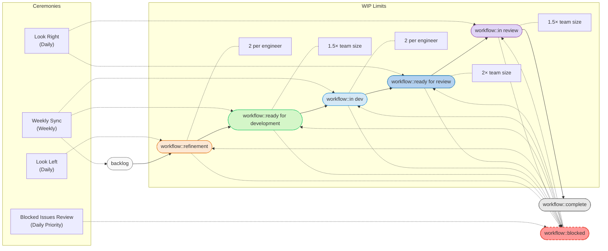
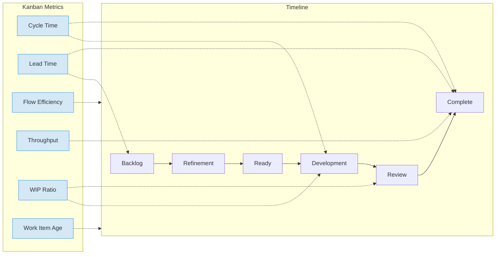
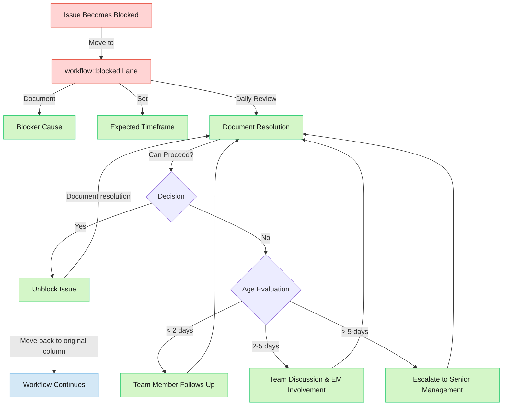

## 概要 {#overview}

Application Lifecycle チームは、さまざまなデプロイ方法にわたって、インストール、アップグレード、スケーリング、移行、設定を担当します。私たちの作業には、多くの場合、次の内容が含まれます。

1. 社内外のお客様のリクエストへの対応
2. 複数のデプロイ方法とプラットフォームの同時サポート
3. さまざまなタイムラインを持つ、技術的に複雑な統合作業の管理
4. 計画された機能開発と保守作業のバランス調整

[Kanban](https://en.wikipedia.org/wiki/Kanban_(development))のアプローチに従うことで、次のメリットが得られます。

- **フロー効率の向上** - マイルストーンの区切りに縛られず、作業項目が継続的に進みます
- **適応力の向上** - 計画済みの作業を中断せずに、緊急のデプロイ問題やお客様のリクエストに対応しやすくなります
- **作業負荷の可視化の改善** - 異なるデプロイプラットフォームにまたがる進行中の作業を、より明確に把握できます
- **提供の予測可能性の向上** - 作業の完了をマイルストーンの期限ではなく、チームのキャパシティに基づいて判断します

## Kanban の実装 {#kanban-implementation}

また、原則として [GitLab 製品開発フロー](/handbook/product-development/how-we-work/product-development-flow/#workflow-summary)とラベルを使用します。ただし、作業の性質上、通常は以下のフェーズを省略します。

- [検証フェーズ 4: 設計](/handbook/product-development/how-we-work/product-development-flow/#validation-phase-4-design)
- [検証フェーズ 5: ソリューション検証](/handbook/product-development/how-we-work/product-development-flow/#validation-phase-5-solution-validation)

### ワークフロー図 {#workflow-diagram}

### Kanban ボードの構造 {#kanban-board-structure}

Application Lifecycle の Kanban ボードでは、GitLab の製品開発ワークフローに合わせて、次の列を使用します。

| 列 | 説明 | WIP 上限 |
|--------|-------------|-----------|
| **backlog** | 優先順位は付いているが、開発の準備ができていない | 上限なし |
| **workflow::refinement** | 詳細化、分割している Issue | エンジニア 1 人あたり 2 件 |
| **workflow::ready for development** | 仕様が完全に定まり、着手できる状態 | チーム人数の 1.5 倍 |
| **workflow::in dev** | 現在実装中 | エンジニア 1 人あたり 2 件 |
| **workflow::ready for review** | 実装が完了し、レビュー担当者が引き受けるのを待っている | チーム人数の 2 倍 |
| **workflow::in review** | コードレビュー中 | チーム人数の 1.5 倍 |
| **workflow::complete** | 完了した作業 | 上限なし |
| **workflow::blocked** | 何らかの理由で進められない作業 | 追跡するが上限なし |

## 主なセレモニー {#key-ceremonies}

### 日次活動 {#daily-activities}

- **開発前に左右を見る** - 新しい開発を始める前に、refinement または review（ready for review/in review）から 1 つの項目を前進させるよう支援します
- **非同期スタンドアップ** - フローと障害に焦点を当てた簡潔な非同期チェックイン

### 週次会議 {#weekly-meetings}

1. **チーム同期**（毎週）
   - EM と PM とともに Kanban ボードの進捗をレビューする
   - 障害と優先順位付けについて議論する
   - 製品目標との整合性を確保する

2. **チームデモ**（毎週）
   - Build グループと共有する
   - 完了した作業を定期的に実演する
   - 新機能や改善に関する知識を共有する
   - チームメンバーとステークホルダーからフィードバックを集める
   - チームの成果の可視性を高める

3. **メンテナーの議論**（毎週）
   - Build グループと共有する
   - マージリクエストとコード品質を定期的にレビューする
   - 技術的な意思決定とアーキテクチャについて議論する
   - 重要なコンポーネントについてメンテナー間で調整する
   - コードの基準とプラクティスの一貫性を確保する

4. **エンジニアのハドル**（必要に応じて）
   - 開発に焦点を当てた議論
   - 実装戦略と技術的な意思決定

### 月次活動 {#monthly-activities}

毎月、最終週の週次同期会議で実施します。

- **フローのレトロスペクティブ** - フローメトリクスとプロセス改善をレビューする
- **リリース計画** - フローベースの優先順位を使用し、次のマイルストーンの計画と整合させる

### 四半期活動 {#quarterly-activities}

- **ロードマップ計画** - 四半期ごとのロードマップ計画に参加し、フローを戦略目標と整合させる
- **レトロスペクティブ** - 前四半期の成果を振り返り、改善すべき領域を特定し、将来のアクションプランを作成する

## 優先度の定義 {#priority-definition}

Application Lifecycle チームは、Kanban の列内での位置を決めるために、[Infrastructure 全体の優先度ラベル](/handbook/product-development/how-we-work/issue-triage/#priority)を
使用します。

| 優先度 | ラベル | Kanban 内の位置 | 必要なアクション |
|----------|-------|--------------------|-----------------|
| 1 | ~priority::1 | アクティブな列の最上部 | 直ちに対応が必要 |
| 2 | ~priority::2 | アクティブな列の上部 | 優先度 1 の項目の後に対応 |
| 3 | ~priority::3 | ワークフローの中部 | より高い優先度の項目の後に対応 |
| 4 | ~priority::4 | ワークフローの下部 | リソースを利用できるときに対応 |

- 「**アクティブな列**」とは、作業を現在処理しているワークフローのステージを指します。これには以下が含まれます。
  - **Ready for Development**: 優先順位付けされ、着手できる状態の Issue
  - **In dev**: チームメンバーが現在作業している Issue
  - **Ready for review:** 作業は完了しているが、レビューを待っている
  - **In review**: 作業は完了しているが、レビューと承認を受けている
- 「**ワークフローの中部／下部**」とは、ボードの中央部分に配置された ~priority::3 および ~priority::4 の Issue を指します。これらの項目には、次の特徴があります。
  - 緊急度が中程度である
  - アクティブな列で、優先度 1 および 2 の項目より下に配置されている
  - 通常は、より緊急な作業の後に予定される
  - どのワークフローステージ（refinement、development、review）にも存在する可能性がある
  - 完了すべき重要な作業だが、より高い優先度に対応するまで待つことができる

- Issue ボードの制約により、Kanban ボード内の位置は手動で管理し、維持する必要があります。

### 作業の優先順位付けに関するガイダンス {#work-prioritization-guidance}

1. **最も高い優先度を最初にする**: 優先度の低い項目より前に、常に優先度の高い項目に対応します
2. **マイルストーン／期限に基づく作業**: 期限またはマイルストーンが固定されている Issue は、同じ優先度で期限のない作業より優先します
3. **依存関係の解決**: 当初の優先度にかかわらず、依存する Issue より前にブロックしている Issue に対応します
4. **WIP 上限**: 優先度の高い項目の完了に集中できるよう、進行中の作業の上限を維持します

## Issue ウェイトの定義 {#issue-weight-definition}

<table>
<tr>
<th>ウェイト</th>
<th>追加調査</th>
<th>想定外の事象</th>
<th>コラボレーション</th>
<th>説明</th>
<th>例</th>
</tr>
<tr>
<td>1: ごく簡単</td>
<td>想定されない</td>
<td>想定されない</td>
<td>不要</td>
<td>これ以上の分割によるメリットがない</td>
<td>

- [簡単なドキュメントの作成または更新](https://gitlab.com/gitlab-org/cloud-native/operator/-/issues/161)
- [シークレット管理で欠落しているエンコーディングの問題を修正](https://gitlab.com/gitlab-org/cloud-native/operator/-/issues/68)

</td>
</tr>
<tr>
<td>2: 小規模</td>
<td>可能性あり</td>
<td>可能性あり</td>
<td>可能性あり</td>
<td>要件が明確な簡単なタスク</td>
<td>

- [主要な依存関係を新しいバージョンへ更新](https://gitlab.com/gitlab-org/cloud-native/gitlab-operator/-/issues/1836)
- [複雑なドキュメントの作成または更新](https://gitlab.com/gitlab-org/cloud-native/operator/-/issues/184)

</td>
</tr>
<tr>
<td>3: 中規模</td>
<td>可能性が高い</td>
<td>可能性が高い</td>
<td>可能性が高い</td>
<td>調整が必要な、より複雑なタスク</td>
<td>

- [CI パイプラインに E2E テストを追加](https://gitlab.com/gitlab-org/cloud-native/operator/-/issues/156)
- [カスタマイズした依存関係のセキュリティ脆弱性に対応](https://gitlab.com/gitlab-org/cloud-native/charts/gitlab-ingress-nginx/-/issues/23)

</td>
</tr>
<tr>
<td>5: 大規模</td>
<td>可能性が非常に高い</td>
<td>可能性が非常に高い</td>
<td>可能性が非常に高い</td>
<td>技術的に可能であれば、分割を検討する</td>
<td>

- [シークレットジェネレーターモジュールを新しいフレームワークへ移行](https://gitlab.com/gitlab-org/cloud-native/operator/-/issues/130)
- [新しいアプリケーション API とカスタムリソース定義を Operator V2 に導入](https://gitlab.com/gitlab-org/cloud-native/operator/-/issues/109)

</td>
</tr>
<tr>
<td>8+</td>
<td>確実</td>
<td>確実</td>
<td>確実</td>
<td>大きすぎるため、複数の Issue に分割してエピックにまとめる必要がある</td>
<td>

- [プロジェクト全体で DockerHub の pull 制限に対応](https://gitlab.com/groups/gitlab-org/distribution/-/epics/104)
- [Self-managed: Self-Managed インスタンス向け Container Registry のロールアウトをサポート](https://gitlab.com/groups/gitlab-org/-/epics/17005)

</td>
</tr>
</table>

1. **ウェイトに関する注記:**
   - ウェイトは文脈に依存し、ドメイン知識、経験レベル、GitLab での在籍期間の影響を受ける可能性があります
   - ウェイトは固定ではなく、Issue に当初の見積もりより多くの労力が必要な場合は、作成者や担当者が調整できます
   - ウェイト 5 の Issue については、分割が有益かどうかをチームメンバーが議論することを推奨します
   - ウェイト 8+ の Issue は分割する必要があり、ready for development としてマークすべきではありません
2. **WIP 上限の実装**
   - 当初は項目数に基づいて列の WIP 上限を設定し、データが増えた時点でレビューします

### フローメトリクス {#flow-metrics}

マイルストーンベースの完了メトリクスの代わりに、これらのフローベースのメトリクスを使用します。ベースラインメトリクスを確立し、FY27Q1 までに着実な改善を目指します。

#### 1. サイクルタイム {#1-cycle-time}

**定義:** Issue の作業を開始してから本番環境へ提供するまでの総経過時間です。

**構成要素:**

- **コーディング時間:** ソリューションのコーディングに費やした時間
- **レビュー時間:** コードレビューに費やした時間（MR の作成 → MR のマージ）

**目標:** 目標サイクルタイムは、作業の複雑さによって異なります（FY27Q1 までに更新予定）。

- ごく簡単な変更（ウェイト 1）: \< x
- 小規模な変更（ウェイト 2）: \< x
- 中規模な変更（ウェイト 3）: \< x
- 大規模な変更（ウェイト 5）: \< x

**測定:**（FY27Q1 までに更新予定）

#### 2. リードタイム {#2-lead-time}

**定義:** Issue が作成されてから本番環境へ提供するまでの総経過時間です。

**構成要素:**

- **計画時間:** Issue の作成から開発開始までの時間
- **サイクルタイム:**（上記の定義を参照）

**目標:** 目標リードタイムは次のとおりです（FY27Q1 までに更新予定）。

- 優先度 1 の Issue: \< x
- 優先度 2 の Issue: \< x
- 優先度 3 の Issue: \< x
- 優先度 4 の Issue: \< x

**測定:**（FY27Q1 までに更新予定）

#### 3. WIP 比率 {#3-wip-ratio}

**定義:** チームのキャパシティに対する進行中の作業項目の比率です。アクティブな作業項目の数をチームメンバーの数で割って算出します。

**目標 :**

- 最適な WIP 比率: 1 〜 3
- 警告しきい値: \> 3.0
- 重大しきい値: \> 4.0

**測定:** ~"workflow::in dev" および ~"workflow::in review" のステージにある Issue の数を、アクティブなチームメンバーの数で割ります。

#### 4. スループット {#4-throughput}

**定義:** 一定期間に完了した作業項目（Issue）の数です。

**目標:** チームはスループットのベースラインを確立し、着実な改善を目指す必要があります。

**測定:** 1 週間あたりに「closed」状態へ移動した Issue の数です。

#### 5. 作業項目の経過期間 {#5-work-item-age}

**定義:** 現在未完了の作業項目の経過期間です。

**目標:**

- x 日より古い優先度 1 の Issue がない
- x 日より古い優先度 2 の Issue がない
- 作業項目の平均経過期間が時間とともに短くなる

**測定:** すべての未完了 Issue について、現在の日付から Issue の作成日を引きます。

#### 6. フロー効率 {#6-flow-efficiency}

**定義:** 作業項目が待機している時間ではなく、実際に作業されている時間の割合です。

**目標:** \> x% のフロー効率（業界標準は多くの場合 15 〜 20%）

**測定:** アクティブな作業時間（~"workflow::refinement" + ~"workflow::in dev" + ~"workflow::in review" に費やした時間）を総リードタイムで割ります。

## 必須ラベル {#required-labels}

[GitLab 製品開発フロー](/handbook/product-development/how-we-work/product-development-flow/#workflow-summary)のラベルに加えて、エピック、Issue、マージリクエスト（項目）には、常に適用する追加の**必須**ラベルがあります。

- `group::Application Lifecycle` - 私たちに固有の項目、または私たちが作成した項目。

また、特定の状況で追加の**必須**ラベルがあります。

- `spike` - 主に選択肢を理解するための調査と、将来提供する成果物の分割を伴う Issue。[スパイク](/handbook/product/product-processes/#spikes)は、新しいエピックで最初の Issue となることが多く、その成果で追加の Issue と直列／並列作業の順序を定義します。

上記のラベルに加えて、[マージリクエストのレビュー中に使用するワークフローラベル](/handbook/engineering/infrastructure-platforms/gitlab-delivery/distribution/merge_requests/#workflow)および [Issue のトリアージ中に使用するラベル](/handbook/engineering/infrastructure-platforms/gitlab-delivery/distribution/triage/#label-glossary)も参照してください。

## マイルストーンとの統合 {#milestone-integration}

次の方法で、GitLab のマイルストーンのプラクティスとの整合性を維持します。

- 厳密なタイムラインがあるすべての Issue は、作成時に適切なマイルストーンを付け、完了まで維持する（破壊的変更など）
- その他のすべての Issue は、作業中であればマイルストーンを `Next 1-3 releases` に維持する
- その他のすべての Issue は、マイルストーンを `Backlog` に維持する
- 記録のため、完了したすべての作業にマイルストーンを付ける
- 標準の必須ラベルをすべて維持する

## ブロックされた Issue の管理プロセス {#blocked-issues-management-process}

### ブロックされた Issue の追跡 {#blocked-issue-tracking}

- **~"Workflow::blocked" レーン** - 依存関係、情報待ち、その他の障害によって進められない Issue は、専用の「workflow::blocked」レーンに移動します
- **ブロッカーの文書化** - ブロックされた各 Issue には、次の内容を説明するコメントを含める必要があります。
  - Issue をブロックしているもの
  - ブロックを解除する責任を持つ人／チーム
  - ブロックを解消するために実施したアクション
  - 解決までの想定期間（分かる場合）

### ブロックされた Issue のレビュー（日次の優先事項） {#blocked-issue-review-daily-priority}

1. **ブロックされた Issue の日次トリアージ**
   - 毎日の開始時に、チームはブロックされたすべての Issue をレビューします
   - ブロックされた Issue を優先度とブロック期間で並べ替えます
2. **エスカレーションパス**
   - ブロック期間が 2 日未満の Issue: Issue の担当者が積極的にフォローアップします
   - ブロック期間が 2 〜 5 日の Issue: チームで同期／非同期の議論を行い、EM が関与します
   - ブロック期間が 5 日以上の Issue: 適切なマネージャー／部門にエスカレーションします
3. **解決アクション**
   - Issue の担当者は、ブロックされた各 Issue をフォローアップする責任を負います
   - ブロックを解消するために実施したすべてのアクションを文書化します
   - ブロックを迅速に解消できない場合は、回避策やスコープの調整を検討します
4. **メトリクスとレポート**
   - ブロックされている Issue と流れている Issue の割合を追跡します
   - ブロックの解消にかかる平均時間を報告します
   - ブロッカーのパターンを特定し、体系的な問題に対処します
5. **ブロックされた Issue の WIP 管理**
   - ブロックされた Issue も `workflow::in dev` の WIP 上限に引き続きカウントされます
   - 複数の Issue がブロックされた場合、チームはキャパシティ配分を一時的に調整できます
   - ブロックされた Issue にチームで集中して取り組み、障害を取り除くことを検討します

### ブロック解除のワークフロー {#unblocking-workflow}

