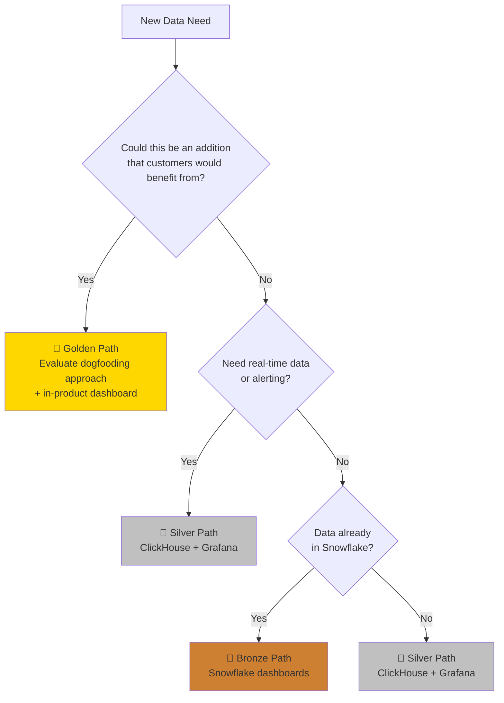
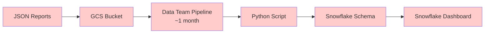
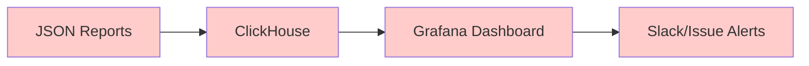
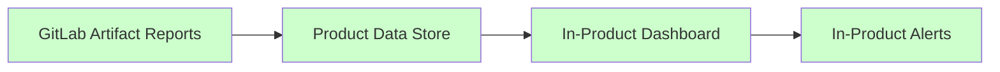

製品機能が不足しているためにカスタムツールを構築すると、カスタムデータも作成されます。このカスタムデータは監視とアラートができるようにどこかに保存する必要があります。カスタムツールを製品機能にすること（該当する場合）で、データも製品の一部になります — 私たちのメンテナンス作業を削減しながら顧客を支援します。

## データパス: ゴールド、シルバー、ブロンズ

ニーズと制約に基づいてチームが最適なアプローチに向かえるよう、メダルシステムを使用します。

### ゴールデンパス（目標状態）

**データストレージ:** データはすでに GitLab 製品機能の一部
**可視化:** 製品内ダッシュボード

これが私たちの目標状態です。データが製品の一部になると、ダッシュボードで自動的に利用可能になり、内部チームと顧客の両方にメリットをもたらします。

**ゴールデンパスの現在のブロッカー:**

- **データストレージ:** ほとんどのカスタムデータはまだ製品に保存できない（[Data Insights Platform](/handbook/engineering/architecture/design-documents/data_insights_platform/) に依存 — [ロードマップ](/handbook/engineering/architecture/design-documents/data_insights_platform/#rollout-roadmap)にはまだ本番の見積もりなし）
- **カスタムダッシュボード:** 製品データにはまだ利用できない（[Dashboard Foundations エピック](https://gitlab.com/groups/gitlab-org/-/epics/18072) の Data Exploration 機能に依存 — **FY26 Q4** に予定）
- **アラート:** 製品データのリアルタイムアラートはまだ計画されていない（ただし機能チームはそのアイデアに開かれている）

### シルバーパス（良い代替手段）

**データストレージ:** ClickHouse のカスタムデータ
**可視化:** Grafana ダッシュボード

製品の一部でないカスタムデータ、またはリアルタイム更新が必要な運用モニタリングに使用します。

**共有 Devex ClickHouse インスタンス**: ほとんどのデータセット（異常に大きくない限り）に対して、Development Analytics は Developer Experience 全体で使用できる ClickHouse インスタンスを維持しています。詳細については #g_development_analytics にお問い合わせください。

### ブロンズパス（レガシー/特殊ケースのみ）

**データストレージ:** Snowflake
**可視化:** Snowflake ダッシュボード

移行がコスト効果的でない、すでに Snowflake にある既存データ、または特定の Snowflake 機能が必要な場合にのみ使用します。

## 各パスを使用する場合

**ゴールドを選択する場合:**

- データが GitLab 顧客にメリットをもたらす可能性がある
- 製品機能になるべきものを構築している
- メンテナンスのオーバーヘッドをゼロにしたい

**シルバーを選択する場合:**

- リアルタイムモニタリングとアラートが必要（ブロンズから移行する場合）
- データがカスタム/運用的で、製品機能には（まだ）適していない
- セルフサービスのデータパイプラインセットアップが必要
- 製品機能を構築する前にプロトタイピングしている

**ブロンズを選択する場合:**

- データがすでに Snowflake にある
- リアルタイム更新が不要な単発分析をしている
- アラート機能が不要

## 意思決定フローチャート

## 例: バックエンドテストデータ

**ブロンズパス（過去の実装）:**

**シルバーパス（現在の実装）:**

**ゴールデンパス（目標の実装）:**

**凡例:**
🔴 カスタムツール/インフラ
🟢 カスタムツール/インフラ不要

これは、ゴールデンパスが顧客価値を生み出しながら私たちのメンテナンス作業をどのように削減するかを示しています。

## 移行パス

### カスタムソリューション → シルバー

既存のカスタムデータストレージと可視化ソリューション（InfluxDB/Grafana、完全カスタム UI、カスタムデータベースなど）を持つチームは、標準化されたシルバーパスに移行します:

1. **既存のデータソースとパイプラインを監査**して、収集しているデータとその構造を把握する
2. **サンプルデータをエクスポート**して移行アプローチを検証する
3. **既存のデータソースから ClickHouse データパイプラインを設定**する
4. **標準化された ClickHouse データを使用して Grafana の主要な可視化を再作成**する
5. **古いシステムと新しいシステム間のデータ精度とパフォーマンスを検証**する
6. **Grafana のネイティブ機能を使用してアラートとモニタリングを改善**する
7. **カスタムソリューションから Grafana ダッシュボードへユーザーを段階的に移行**する
8. **移行が完了して検証されたらレガシーシステムを廃止**する

*移行すべきカスタムソリューションの例: InfluxDB + Grafana スタック、BigQuery + カスタム UI、PostgreSQL + カスタムダッシュボード、Elasticsearch + Kibana、カスタム時系列データベース*

### ブロンズ → シルバー

1. **既存の Snowflake クエリをエクスポート**してデータ構造を把握する
2. **データソースから ClickHouse データパイプラインを設定**する
3. **ClickHouse データを使用して Grafana の可視化を再作成**する
4. **古いシステムと新しいシステム間のデータ精度を検証**する
5. **新しい Grafana ダッシュボードでアラートとモニタリングを追加**する

*注: データがすでに GitLab データベースにあり、製品機能を通じて公開できる場合は、ブロンズからゴールドに直接移行することも可能です。*

### シルバー → ゴールド（ドッグフーディング）

1. **ドッグフーディングの機会を評価**する — このデータは顧客にとって価値ある追加機能になれるか?
2. **アプローチを選択する:**
   - **完全な機能を持つ既存機能:** すぐにドッグフーディングを開始する
   - **機能が不足している既存機能:** 機能チームと協力して拡張する（直接貢献するか機能拡張をリクエスト）
   - **既存機能なし:** 製品チームと協力してゼロから構築する（最も長いパス、クロスチームの協力が必要）
   - **データのみのアプローチ:** UI 機能なしで製品にデータを保存/公開する（理想的ではないが、完全な製品機能への踏み台として実行可能）
3. **製品のデータを使用して製品内ダッシュボードを構築または拡張**する
4. **Grafana から製品内ダッシュボードへユーザーを移行**する
5. **カスタム ClickHouse パイプラインを廃止**する

## 継続的な監査と移行計画

### 四半期レビュー

すべてのチームは、**カスタムソリューションが不足している製品機能を表すことが多い**という原則に従って、定期的にデータパスを監査して移行の機会を特定する必要があります:

**レビューの質問:**

1. 顧客機能になれるどのデータを使用しているか?
2. 他の GitLab ユーザーにメリットをもたらせるどのカスタムツールを構築したか?
3. どのブロンズパスのソリューションを移行または廃止できるか?
4. ゴールド（製品機能）になる準備ができているシルバーパスのソリューションはあるか?
5. ドッグフーディングしないことで蓄積している技術的負債は何か?
6. 私たちの内部ワークフローは、顧客が同様の問題を解決するのに役立つ機能になれるか?

### チームデータインベントリテンプレート

チームはデータパスとドッグフーディングの機会への可視性を維持する必要があります。**構築していることだけでなく、なぜそれがまだ製品機能になっていないかも記録してください。**

#### Development Analytics

| データタイプ | 現在のパス | カスタムツール/プロセス | 理由 | 製品としての可能性 | 移行先 | タイムライン |
|-----------|--------------|---------------------|-----------|-------------------|------------------|----------|
| CI Pipeline Duration | ブロンズ | Snowflake ダッシュボード | レガシー、すでに実装済み | 高 — ネイティブ CI 分析になる可能性 | シルバー → ゴールド | TBD |
| Test Results Analytics | シルバー | カスタム ClickHouse パイプライン + Grafana | 製品にネイティブテスト概念がない | 高 — 多くの顧客がテスト可視性を必要としている | ゴールド（Test Analytics 機能） | TBD |
| Failure Categories | シルバー | カスタム triage-ops ルール | 製品にない高度な自動化 | 高 — ネイティブ Issue 自動化になる可能性 | ゴールド（Advanced triage） | TBD |
| Caching data | ブロンズ | カスタム BigQuery/Grafana スタック（POC） | POC デプロイ、移行が必要 | 中 — CI 最適化を持つ顧客にメリットをもたらす可能性 | シルバー | TBD |
| Predictive tests data | ブロンズ | 内部イベントを Snowflake + Snowflake ダッシュボードへ | 既存の Snowflake インフラを使用 | 高 — 予測テストは価値ある機能になる可能性 | シルバー → ゴールド | TBD |

#### API

*近日公開*

#### Development Tooling

*近日公開*

#### Feature Readiness

*近日公開*

#### Performance Enablement

*近日公開*

#### Test Governance

*近日公開*

## 将来のビジョン

GitLab のデータインサイトプラットフォーム（DIP）が成熟するにつれて、ほとんどのユースケースでゴールデンパスへの統合が進み、DIP 統合を通じてシルバーパスがよりシンプルになることが期待されます。最終的な目標は、顧客価値をドッグフーディングで最大化しながらカスタムツールを最小化することです。
