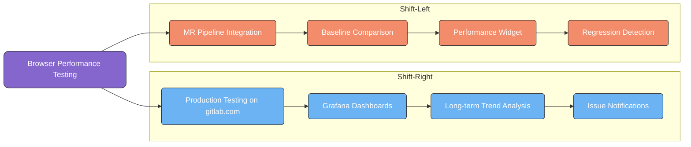
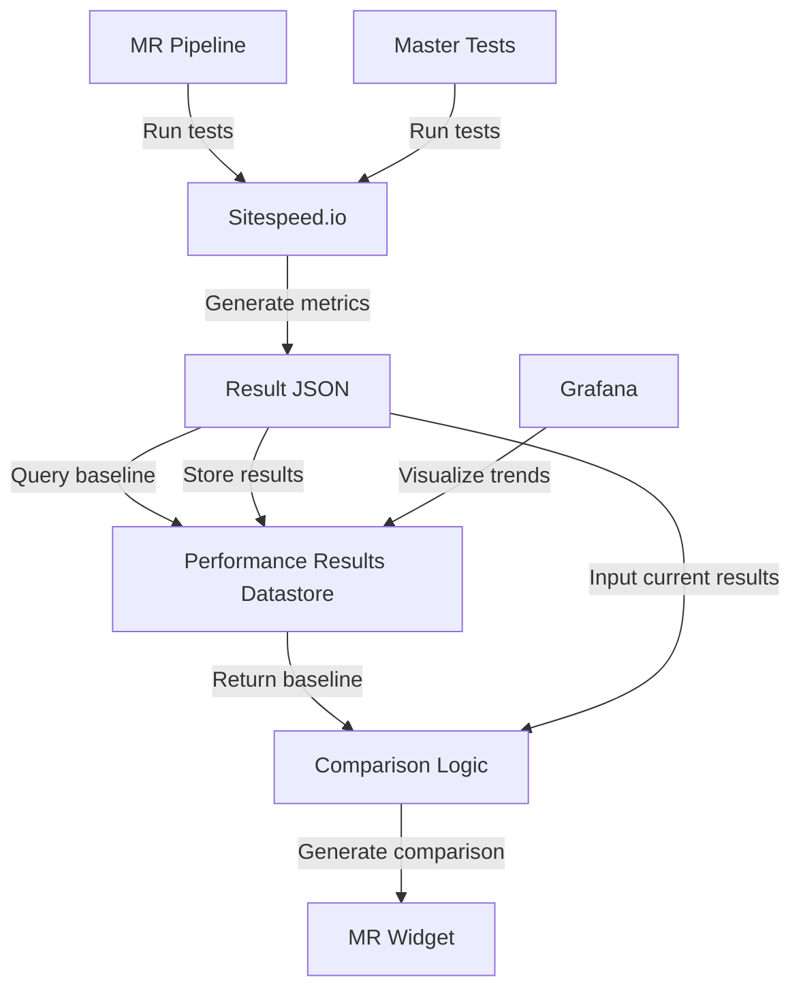
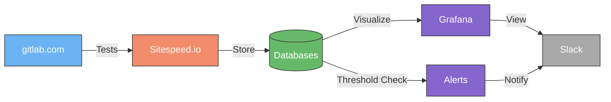

このページには今後予定されている製品・機能・機能性に関する情報が含まれています。ここに示す情報は参考目的のみです。購入・計画の決定にこの情報を使用しないでください。製品・機能・機能性の開発、リリース、タイミングは変更または延期される可能性があり、GitLab Inc. の独自の判断に委ねられています。

<table class="w-full text-sm border-collapse">
<thead>
<tr class="bg-gray-100 text-left">
<th class="px-3 py-2 border border-gray-300">Status</th>
<th class="px-3 py-2 border border-gray-300">Authors</th>
<th class="px-3 py-2 border border-gray-300">Coach</th>
<th class="px-3 py-2 border border-gray-300">DRIs</th>
<th class="px-3 py-2 border border-gray-300">Owning Stage</th>
<th class="px-3 py-2 border border-gray-300">Created</th>
</tr>
</thead>
<tbody>
<tr>
<td class="px-3 py-2 border border-gray-300">accepted</td>
<td class="px-3 py-2 border border-gray-300"><a href="https://gitlab.com/nprabakaran" class="text-blue-600 hover:underline">@nprabakaran</a></td>
<td class="px-3 py-2 border border-gray-300"></td>
<td class="px-3 py-2 border border-gray-300"><a href="https://gitlab.com/ksvoboda" class="text-blue-600 hover:underline">@ksvoboda</a></td>
<td class="px-3 py-2 border border-gray-300">~stage::developer-experience</td>
<td class="px-3 py-2 border border-gray-300">2025-04-23</td>
</tr>
</tbody>
</table>

[[_TOC_]]

## エグゼクティブサマリー

このブループリントは、GitLab においてブラウザパフォーマンステストを実装するための包括的なアプローチを概説します。二つの焦点があります: パフォーマンス問題を早期に検出するためのマージリクエスト（MR）レベルでの「シフトレフト」テストと、実際の条件でパフォーマンスを検証するための本番環境に対する「シフトライト」テストです。このアプローチは Sitespeed.io をコアテクノロジーとして活用しながら、テスト環境の一貫性、データシーディング、意味のあるメトリクスに関する課題に対処します。

## 背景

フロントエンドチームはかつて Sitespeed のセットアップ（GitLab.org/frontend/sitespeed-measurement-setup）をパフォーマンステストに活用していましたが、このシステムは旧式になりました。Performance Enablement チームは、GitLab 全体でアプリケーションパフォーマンスを向上させる継続的な取り組みの一環として、この機能を復活させ改善するという任務を担っています。

並行して、DevEx チームは GitLab ブラウザパフォーマンステスト（GBPT）ソリューション（gitlab-org/quality/performance-sitespeed）を 1k セルフマネージドインスタンスとステージング環境に対して実行してきました。この既存のソリューションは貴重なパフォーマンスデータを提供しますが、主に本番環境や MR レベルのテストではなく、制御されたセルフマネージド環境に重点を置いています。

サーバーサイドのパフォーマンス問題（GitLab Performance Tool - GPT で検出）とクライアントサイドのパフォーマンス問題（GBPT で検出）は現在、主にナイトリーランで特定されています。つまり、問題はマージされた後、セルフマネージドインスタンスにリリースされる前に発見されることが多いです。ただし、gitlab.com ではこれらの問題が修正されるまで一定期間残る可能性があります。開発ライフサイクルの早い段階でこれらの問題をキャッチするためのよりプロアクティブなアプローチが必要です。

このブループリントは、GitLab の広範なパフォーマンスエンジニアリングの取り組みと整合しています。これには、すべてのパフォーマンステスト結果を一元化して高度な分析とトレンド分析を可能にする提案された Performance Results Datastore が含まれます。ここで概説するブラウザパフォーマンステスト機能は、この中央リポジトリにデータを供給し、環境および GitLab バージョン全体のクライアントサイドパフォーマンスメトリクスのより洗練された分析と可視化を実現します。

## 現在の課題

1. **遅い検出**: パフォーマンス問題は本番環境に到達した後にのみ発見されることが多い
2. **環境の不一致**: 異なる環境で結果が異なり、ベースライン比較が困難
3. **テストデータの変動性**: パフォーマンスメトリクスはテストデータの量と複雑さに敏感
4. **遅いフィードバック**: チームはパフォーマンスリグレッションを特定するために何百もの MR をレビューしなければならないことが多い
5. **リソースの制約**: 各 MR に専用のテスト環境を立ち上げることはリソース集約的
6. **Cells アーキテクチャ**: 将来の Cells アーキテクチャへの移行でパフォーマンステストのアプローチが複雑になる
7. **分散したソリューション**: 現在のソリューション（旧式のフロントエンド Sitespeed と 1k インスタンス向けの GBPT）は独立して動作しており、環境間の比較とインサイト共有が制限されている
8. **MR レベルのテストの制限**: 既存のソリューションはコード変更レベルで即座のフィードバックを提供するのではなく、環境レベルのテストに集中している
9. **認証要件**: 一部のエンドポイントはユーザー認証を必要とし、ログインフローの処理とセレクタの維持のためのフレームワーク機能が必要
10. **ページインタラクションの複雑さ**: 特定のテストはページとの複雑なインタラクションを必要とし、チームがカスタムテストスクリプトを構築して維持する必要がある

## 戦略的アプローチ

インフラのために GitLab の Runway プラットフォームを活用するデュアルトラックの実装戦略を提案します:

### トラック 1: シフトレフト（MR レベルのテスト）

MR レベルでブラウザパフォーマンステストを実装して、パフォーマンスリグレッションが本番環境に到達する前にキャッチします。このアプローチは、変更がクライアントサイドのパフォーマンスに与える影響について開発者に即座のフィードバックを提供します。

### MR インテグレーションのデータフローアーキテクチャ

### トラック 2: シフトライト（本番モニタリング）

本番環境（gitlab.com と staging.gitlab.com）に対する定期的なパフォーマンステストを実現するために、GCP VM 上の Runway 経由で Sitespeed.io オンラインセットアップをデプロイします。これによりパフォーマンスのベースラインが確立され、長期的なトレンドが監視され、フロントエンドチームの要件を満たしながら貴重な比較データが提供されます。

### 本番モニタリングのデータフローアーキテクチャ

### 既存のソリューションとのインテグレーション

現在 1k セルフマネージドインスタンスとステージング環境に対して実行されている既存の GitLab ブラウザパフォーマンステスト（GBPT）ソリューション（gitlab-org/quality/performance-sitespeed）と統合します。このインテグレーションにより:

1. 制御されたセルフマネージド環境と本番環境間の比較ベースラインを提供
2. 異なる環境タイプ間のパフォーマンストレンドの相関を可能にする
3. GitLab のデプロイメントモデル全体でブラウザパフォーマンスのより包括的な全体像を作成
4. 既存の投資の価値を最大化しながら作業の重複を削減

**注意**: フェーズ 1 の実装後、既存の GBPT テストを新しい実装と並行して維持することが必要かどうか、または統合がより効率的かどうかを再評価します。

## 実装計画

### フェーズ 1: コアインフラと本番モニタリングのセットアップ

1. **Runway アーキテクチャを使用して Sitespeed.io をデプロイ**
   * GitLab の内部プラットフォームである Runway を活用して Sitespeed.io インフラをデプロイ
   * GCP VM 上の Sitespeed Online コンポーネントを設定（元の Issue に記載）
   * Runway アーキテクチャで定義されている以下のコンポーネントを設定:
     * キャッシュとジョブキューイングのための KeyDB
     * テストメタデータと設定ストレージのための PostgreSQL
     * 結果ストレージのための Minio（または同等の S3 ストレージ）
     * Sitespeed.io テストランナー（バージョン 36.4.1）
     * Online GUI と API コンポーネント
   * セキュリティのベストプラクティスを実装:
     * すべてのデフォルトパスワードを変更
     * 管理のための Basic Auth を設定
     * API アクセスのためのシークレットキーを設定
     * ドメイン正規表現の制限を実装
2. **主要なパフォーマンスメトリクスを定義**
   * First Contentful Paint (FCP)
   * Largest Contentful Paint (LCP)
   * Total Blocking Time (TBT)
   * Speed Index (SI)
   * Layout Volatility (LVC)
   * Transfer Size (TFR SIZE)
   * パフォーマンススコア
   * アクセシビリティ（AXE インテグレーション）
3. **モニタリングと可視化を設定**
   * パフォーマンスメトリクスを表示するための Grafana ダッシュボードを設定
   * 一元化された分析のための Performance Results Datastore と統合
   * 時系列パフォーマンスデータのための InfluxDB ストレージバケットを設定
   * 重大なパフォーマンス劣化のためのアラート閾値を設定
4. **本番テスト設定**
   * gitlab.com 環境のテストを設定
   * 競合他社比較テストを設定
   * 認証されたページテストのためのログイン機能を実装
   * テスト結果のデータ保持ポリシーを設定
   * 既存の GBPT（gitlab-org/quality/performance-sitespeed）データパイプラインと統合
   * 1k セルフマネージドインスタンスの結果と本番メトリクスの相関を確立
5. **結果の可視化とレポート**
   * 本番メトリクスの Grafana ダッシュボードを設定
   * 環境間の比較ビューを作成
   * 長期モニタリングのためのトレンド分析を実装
   * Issue/Slack チャンネルへの通知のための Webhook を設定
   * 定期的なパフォーマンスレポートを作成
   * GBPT の結果と新しい Sitespeed セットアップのクロスリファレンス可視化を有効化

### フェーズ 2: MR レベルのインテグレーション

1. **既存の CI/CD リソースを活用**
   * 新しい環境を立ち上げるのではなく、既存の CI/CD CNG インスタンスを使用
   * E2E テスト完了後に同じ環境で Sitespeed テストを実行
   * E2E テストとの共有が結果の変動性をもたらす場合は、CNG オーケストレーターで専用環境を構築することを検討
2. **ベースラインの確立**
   * 各重要なページ/ワークフローのメインブランチベースラインを作成
   * 参照のためにベースラインパフォーマンスを中央の場所にドキュメント化
   * 定期的なサイクルでベースラインの自動更新を実装
3. **MR インテグレーション**
   * ブラウザパフォーマンステストを実行する CI ジョブを作成
   * MR の結果とベースライン間の比較ロジックを実装
   * MR ウィジェット表示のための browser-performance.json を生成
   * 変更されたファイルに基づいて関連するテストのみを実行する選択的テスト実行のサポートを追加
4. **アラートシステム**
   * パフォーマンス劣化の閾値を定義
   * パフォーマンス問題のための MR コメントを作成
   * 重大なリグレッションのための Slack 通知を実装

### フェーズ 3: 改良と拡張

1. **ユーザージャーニーサポート**
   * カスタムユーザージャーニーを定義するためのフレームワークを実装
   * URL パラメータを通じたフィーチャーフラグテストをサポート
   * チームが専門的なワークフローを作成できるようにする
2. **ドキュメントとセルフサービス**
   * チームのための操作ガイドを作成
   * カスタムテストの追加に関するドキュメントを提供
   * 質問のためのサポートチャンネルを確立
3. **将来のアーキテクチャサポート**
   * Cells アーキテクチャの互換性を計画
   * Cell 固有のテスト戦略を開発
   * Cells 対応の本番モニタリングのための戦略を作成:
     * Cell 固有のテスト設定とベースライン
     * Cell 間インタラクションテスト
     * パフォーマンスメトリクスの Cell 帰属

## 技術的実装の詳細

### 環境戦略

1. **MR テスト**:
   * E2E テスト完了後に既存の CNG インスタンスを使用
   * 一貫してシードされた制御された環境に対してテスト
   * 同じ環境タイプのメインブランチベースラインと直接比較
   * Performance Results Datastore からの動的ベースラインを活用
2. **本番テスト**:
   * gitlab.com と staging.gitlab.com の特定のエンドポイントに対して実行
   * 比較ベースラインのために 1K リファレンスアーキテクチャを使用（既存の GBPT アプローチに合わせる）
   * 長期的なトレンドを特定するために定期的な間隔でスケジュール
   * 本番環境に対してテストする際の将来の Cells アーキテクチャの考慮事項に注意
3. **既存の GBPT インテグレーション**:
   * 既存の GBPT 1k セルフマネージドインスタンステストと結果を相関させる
   * GBPT の結果を制御された環境パフォーマンスの参照点として使用
   * 該当する場合はテスト定義とページシナリオを共有
   * 制御された環境と本番/MR の結果の間でクロス比較を可能にする

### パフォーマンスデータストレージ

1. **時系列データ**:
   * Performance Results Datastore の一部として InfluxDB にブラウザパフォーマンスメトリクスを保存
   * 関連するメタデータ（GitLab バージョン、環境、テストタイプなど）でデータにタグを付ける
   * 履歴分析のための適切な保持ポリシーを設定
2. **ベースライン管理**:
   * InfluxDB（トレンド分析用）と JSON ファイル（CI アクセス用）の両方にベースラインを保存
   * 最近の結果の統計分析に基づいてベースラインを自動的に更新
   * 異なる GitLab リリースのバージョン固有のベースラインをサポート

### データシーディングアプローチ

1. **一貫したテストデータ**:
   * 特定された要件に基づいてデータシーディング戦略を実装:
     * テストのセットアップ時間を最小化するための迅速なシーディングプロセス
     * テストランにわたる安定した一貫したデータ
     * 専門的なテストデータを追加するための開発者による拡張が可能
   * [GitLab シーディングオプションランブック](https://gitlab.com/gitlab-org/quality/runbooks/-/blob/main/gitlab_seeding_options/index.md?ref_type=heads)で参照されているオプションを評価
   * 環境にテストデータをプリロード
   * 一貫したデータを持つ事前構築済み Docker イメージを検討
2. **テストページの選択**:
   * テストのための高影響ページを特定（コンテンツが読み込まれた MR、Issue ページなど）
   * 複雑な UI コンポーネントを持つページを含める
   * ログアウト状態とログイン状態の両方のビューをテスト

### 閾値管理

* ベースライン + 割合の分散に基づく動的閾値を実装
* 業界標準から始める:
  * LCP: \< 2.5s（良い）、\< 4s（改善が必要）、\> 4s（不良）
  * TBT: \< 200ms（良い）、\< 600ms（改善が必要）、\> 600ms（不良）
* チーム固有の閾値カスタマイズを可能にする

## ロールアウト戦略

1. **フロントエンドチームでのパイロット**:
   * 復活を要請した Source Code Management チームから開始
   * 重要なページの小さなセットに集中
   * フィードバックを収集してアプローチを改良
2. **他のチームへの拡大**:
   * 同様のニーズを持つ追加のチームをオンボード
   * ドキュメントとサポートを提供
   * ユースケースと実装フィードバックを収集
3. **組織全体のデプロイメント**:
   * すべての開発チームで利用可能にする
   * 開発者ワークフロードキュメントに組み込む
   * 採用と効果を追跡

## 成功メトリクス

この実装の成功は以下によって測定されます:

1. **早期検出**: MR レベルでキャッチされたパフォーマンス問題の数 vs 本番環境
2. **レスポンスタイム**: パフォーマンスリグレッションを特定して修正するまでの時間の短縮
3. **開発者の採用**: ブラウザパフォーマンステストをアクティブに使用しているチームの数
4. **パフォーマンストレンド**: 時間とともに主要なパフォーマンスメトリクスの改善
5. **信頼性**: 環境全体でのテスト結果の一貫性
6. **データアクセシビリティ**: エンジニアリングチームによるパフォーマンスデータ可視化の採用
7. **インテグレーションの効果**: Performance Results Datastore との統合の成功
8. **意思決定への影響**: パフォーマンスインサイトを使用して行われたデータ駆動の意思決定の数

## メンテナンスモデル

このイニシアティブの長期的な成功を確保するために、以下のメンテナンスモデルを実装します:

1. **Performance Enablement チームの責任**:
   * コアフレームワークとインフラを維持
   * CI/CD パイプラインとのインテグレーションを確保
   * ベースライン比較ロジックのサポートを提供
   * Performance Results Datastore とのインテグレーションを維持
   * 必要に応じてコアコンポーネントを更新
2. **フロントエンドチームの責任**:
   * 自分たちのエリアの特定のテストを作成して維持
   * コンポーネントのアラートを監視
   * コードのパフォーマンスリグレッションに対処
   * 必要に応じてコンポーネントの閾値を調整
   * テストカバレッジの拡大に貢献
3. **共有の責任**:
   * ドキュメントの更新
   * 新しいチームのオンボーディング
   * パフォーマンスメトリクスの定義
   * テストデータ管理

この明確な責任の分担により、パフォーマンス成果のチームオーナーシップを最大化しながら、ソリューションの持続可能性が確保されます。

## 結論

このブラウザパフォーマンステストのブループリントは、クライアントサイドのパフォーマンステストの即時ニーズと問題の早期検出のための長期的な戦略目標の両方に対処するための包括的なアプローチを概説しています。シフトレフトとシフトライトの両方のテストを実装することで、開発者に即座のフィードバックを提供しながら本番パフォーマンスへの可視性を維持できます。

段階的な実装アプローチにより、最も重要なコンポーネントから始めて機能を徐々に拡張することで、インクリメンタルな価値デリバリーが可能になります。このブループリントは、ステークホルダーによって特定された主要な課題に対処しながら、将来のパフォーマンステストニーズのためのスケーラブルな基盤を提供します。

## 参考資料

* [Sitespeed.io ドキュメント](https://www.sitespeed.io/documentation/)
* [GitLab ブラウザパフォーマンステストドキュメント](https://docs.gitlab.com/ee/ci/testing/browser_performance_testing.html)
* [Web Vitals イニシアティブ](https://web.dev/vitals/)
* [GitLab Issue #17: Sitespeed セットアップの復活](https://gitlab.com/gitlab-org/frontend/sitespeed-measurement-setup/-/issues/17)
* [GitLab Epic #146: MR での GitLab ブラウザパフォーマンスツール使用の有効化](https://gitlab.com/groups/gitlab-org/quality/-/epics/146)
* [GitLab Epic #134: Sitespeed を使用したブラウザパフォーマンスの本番モニタリング](https://gitlab.com/groups/gitlab-org/quality/-/epics/134)
* [Performance Results Datastore ブループリント](../performance_datastore/)
* [シフトレフトとシフトライトのパフォーマンステスト](../shift_left_right_performance/)
* [GitLab Performance Tool (GPT)](https://gitlab.com/gitlab-org/quality/performance)
* [GitLab ブラウザパフォーマンステスト (GBPT)](https://gitlab.com/gitlab-org/quality/performance-sitespeed)
* [リファレンスアーキテクチャテスト環境の詳細](https://gitlab.com/gitlab-org/quality/gitlab-environment-toolkit-configs/quality/-/wikis/Performance-environments-setup)
* [Runway ドキュメント](https://runway-docs-4jdf82.runway.gitlab.net/welcome/onboarding/)
* [GitLab シーディングオプションランブック](https://gitlab.com/gitlab-org/quality/runbooks/-/blob/main/gitlab_seeding_options/index.md?ref_type=heads)
