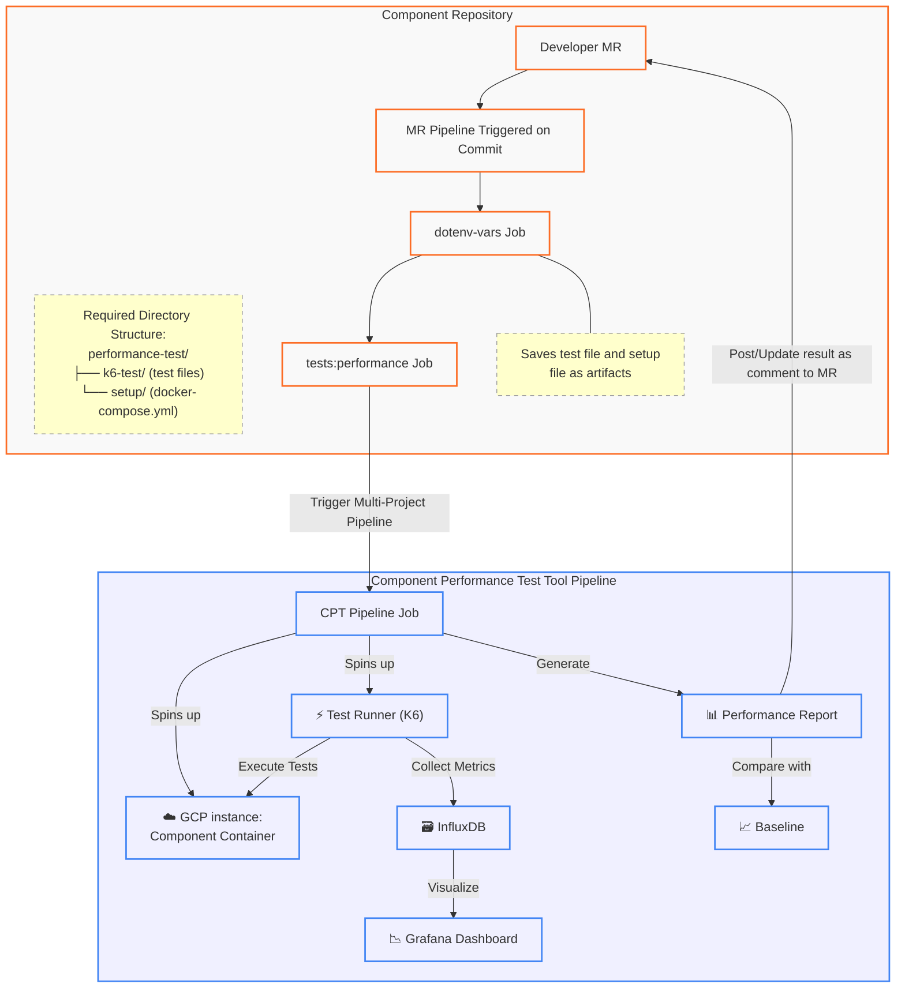
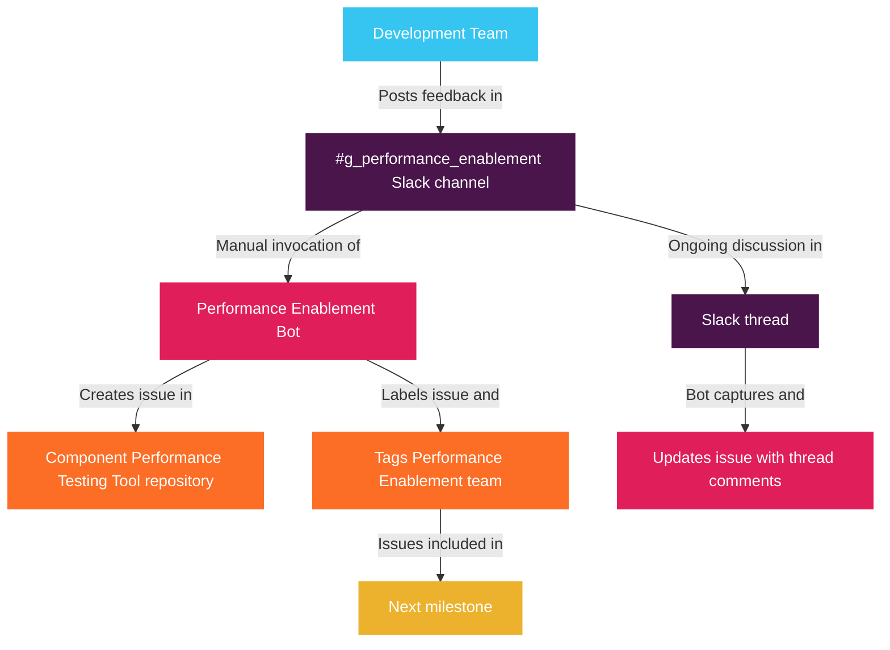

<div class="my-3 border-l-4 border-blue-500 bg-blue-50 px-4 py-3 rounded-r text-sm text-blue-800">
このページには今後予定されている製品・機能・機能性に関する情報が含まれています。ここに示す情報は参考目的のみです。購入・計画の決定にこの情報を使用しないでください。製品・機能・機能性の開発、リリース、タイミングは変更または延期される可能性があり、GitLab Inc. の独自の判断に委ねられています。
</div>

<div class="overflow-x-auto my-4">
<table class="w-full text-sm border-collapse">
<thead>
<tr class="bg-gray-100 text-left">
<th class="px-3 py-2 border border-gray-300">Status</th>
<th class="px-3 py-2 border border-gray-300">Authors</th>
<th class="px-3 py-2 border border-gray-300">Coach</th>
<th class="px-3 py-2 border border-gray-300">DRIs</th>
<th class="px-3 py-2 border border-gray-300">Owning Stage</th>
<th class="px-3 py-2 border border-gray-300">Created</th>
</tr>
</thead>
<tbody>
<tr>
<td class="px-3 py-2 border border-gray-300"><span class="inline-block rounded px-2 py-0.5 text-xs font-medium bg-gray-100 text-gray-700">accepted</span></td>
<td class="px-3 py-2 border border-gray-300"><a href="https://gitlab.com/vishal.s.patel" class="text-blue-600 hover:underline">@vishal.s.patel</a></td>
<td class="px-3 py-2 border border-gray-300"></td>
<td class="px-3 py-2 border border-gray-300"><a href="https://gitlab.com/ksvoboda" class="text-blue-600 hover:underline">@ksvoboda</a></td>
<td class="px-3 py-2 border border-gray-300"><span class="inline-block rounded px-2 py-0.5 text-xs font-medium bg-gray-100 text-gray-700">~stage::developer-experience</span></td>
<td class="px-3 py-2 border border-gray-300">2025-04-11</td>
</tr>
</tbody>
</table>
</div>


[[_TOC_]]

## 用語集

| 用語 | 定義 |
|------|------|
| GPT | GitLab Performance Toolkit |
| 実世界シナリオ | **本番環境を代表データで再現した環境** |
| コンポーネント | GitLab アーキテクチャの独立した要素（例: Gitaly、AI Gateway など） |

## エグゼクティブサマリー

本ブループリントは、GitLab においてコンポーネントレベルのパフォーマンステストを実装するための包括的なアプローチを概説します。これにより、チームが開発ライフサイクルの早い段階でパフォーマンス問題を検出（「シフトレフト」）できるようになります。このアプローチはコンテナ化と自動テストを活用し、個々のコンポーネントのパフォーマンス指標に関するインサイトを提供するとともに、マージリクエストレベルでコード変更のパフォーマンス影響に関する即時フィードバックを実現します。

### コンポーネントテストツールのアーキテクチャ



## 問題の背景

現在、GitLab のパフォーマンステストは主に、リファレンスアーキテクチャに従ったセルフマネージドインスタンスに対して GitLab Performance Tool（GPT）を実行することに依存しています。

この方法は包括的ではありますが、重大な制限があります:

1. **検出の遅れ**: MR がマージされた後にはじめてパフォーマンス問題が判明することが多い
2. **セットアップ時間の長さ**: 環境とデータの準備にテスト開始前に約 2 時間かかる
3. **リソースの大量消費**: フルインスタンスのテストには大量の計算リソースが必要
4. **分離の困難さ**: パフォーマンス問題を特定のコンポーネントに帰属させることが難しい
5. **フィードバックの遅延**: チームはパフォーマンスのリグレッションを特定するために多数の MR をレビューする必要がある
6. **コンポーネントの可視性の欠如**: 個々のコンポーネントのパフォーマンスに関する詳細なインサイトが不足している
7. **テストオーナーシップの不整合**: テストは主に Dev Ex チームによって開発されており、コンポーネントチームではない
8. **運用上のオーバーヘッド**: 専任のパフォーマンスオンコールローテーションが必要

コンポーネントレベルのパフォーマンステストは、分離されたテスト、高速フィードバックループ、および対象を絞ったパフォーマンス分析によってこれらの課題に対応します。

## 目標

コンポーネントチームが統合できるセルフサービスのパフォーマンステストフレームワークを開発し、個々のコンポーネントのパフォーマンスに関するインサイトを得られるようにし、開発ライフサイクルの早期に[一部の](#コンポーネントパフォーマンステストツールの制限)パフォーマンス問題を検出できるようにします。

## 責任範囲

<table>
<tr>
<th>チームと役割</th>
<th>責任</th>
<th>場所</th>
</tr>
<tr>
<td>

Performance Enablement

* オーナー

</td>
<td>

* コアフレームワークの維持
* テストツールとインフラストラクチャの定期的な更新
* フレームワークへのセキュリティパッチと依存関係の更新の適用
* 包括的なドキュメントの維持
* 新しいチームのオンボーディングトレーニングの提供
* ベストプラクティスと学んだ教訓の共有
* 各コンポーネントチームから提供されたフィードバックへの対応
* 各コンポーネントチームへの適切なパフォーマンスインサイトを提供するためのフレームワークの更新

</td>
<td>Component Performance Testing Tool リポジトリ</td>
</tr>
<tr>
<td>

各コンポーネントチーム

* オーナー

</td>
<td>

* コンポーネントレベルのパフォーマンステスト追加のための[前提条件](#ツール使用の前提条件)をコンポーネントが満たしていることを確認
* コンポーネントの新機能がコンポーネントレベルのパフォーマンステスト追加のための[前提条件](#ツール使用の前提条件)を満たしていることを確認
* 特定のパフォーマンステストシナリオの維持
* コンポーネントのパフォーマンスの継続的な監視
* パフォーマンス関連テストを追加してテストスイートを拡充
* コンポーネントインターフェースの変更に合わせたテストの更新
* 各 MR 実行のパフォーマンスを監視し、適切なパフォーマンスを得るために MR を適宜更新
* パフォーマンス要件に基づいてテストのしきい値を調整
* コンポーネント設定の変更に合わせてコンポーネントセットアップを更新

</td>
<td>各コンポーネントリポジトリ</td>
</tr>
</table>

## コンポーネントパフォーマンステストツールの制限

コンポーネントパフォーマンステストでは以下に関連する問題は検出できません:

* **統合のボトルネック**: コンポーネント間の相互作用から生じるパフォーマンス問題
* **データ量のスケーリング問題**: 本番規模のデータでのみ発生する劣化
* **ネットワーク遅延の影響**: 分離されたテストでは明らかにならないエンドツーエンドの遅延問題
* **カスケード障害**: コンポーネントの相互依存関係によって引き起こされるシステム全体の問題
* など

大量のデータや本番環境のようなセットアップで発生する可能性のある問題は、コンポーネントパフォーマンステストでは検出できません。

このツールは以下の特定に焦点を当てています:

* **スループットのボトルネック**: コンポーネント固有のリクエスト処理の制限
* **キャッシュの有効性**: コンポーネント固有のキャッシュ戦略のパフォーマンスへの影響
* **エラー処理のオーバーヘッド**: 過剰または非効率なエラー処理によるパフォーマンスの劣化
* **設定関連のパフォーマンス問題**: 最適でないコンポーネント設定
* **シリアライズ/デシリアライズのオーバーヘッド**: データ変換の非効率性
* など

GPT テストは引き続き現在のスケジュールで実行され、包括的な実世界シナリオのカバレッジを維持します。

## アプローチ

MR レベルでコンポーネントレベルのパフォーマンステストを実装し、本番デプロイ前のパフォーマンスリグレッションを特定します。

[前提条件](#ツール使用の前提条件)を満たしたコンポーネントは、この CI パイプラインにこのツールを統合できます。

コンポーネント固有の `docker-setup.yml` および `k6-test.js` ファイルはコンポーネントリポジトリに格納され、開発チームが管理します。このツールはコンテナ化されたコンポーネントを起動し、制御されたセットアップで Grafana K6 テストを実行します。

## ツール使用の前提条件

ツールの使用を開始する前に、コンポーネントは以下の機能を備えている必要があります:

* コンテナ化のサポート: 分離してデプロイ可能な Docker 化された実装
* API/インターフェース機能: GrafanaLabs K6 が[サポートするプロトコルのいずれか](https://grafana.com/docs/k6/latest/using-k6/protocols/)を使用した公開インターフェース
* モッキング/分離テスト機能: 分離またはインターフェースモッキングによるテスト可能性
* メトリクス収集: パフォーマンスメトリクス（エンドポイント、メソッドなど）の収集ポイントが明確であること

## ツール実装の課題

以下の点は、ツールの実装時に直面する可能性のある課題を示しています:

1. **環境の分離**: 分離されたテストでのコンポーネント依存関係の管理
2. **テストとセットアップのオーケストレーション**: ツールのオーケストレーションとコンポーネント固有のファイルの分離の維持
3. **テストデータの変動性**: テストデータ全体で一貫したパフォーマンスメトリクスの確保
4. **リソース管理**: **MR レベルのテストのためのリソースの効率的な割り当て**
5. **メトリクス収集**: コンテナ化されたコンポーネントからのパフォーマンスメトリクスの収集と分析
6. **ベースライン比較**: 比較のための信頼できるパフォーマンスベースラインの確立
7. **CI/CD との統合**: 既存の CI/CD パイプラインとのシームレスな統合
8. **レポートの制限**: 標準的な [K6 レポート](https://grafana.com/docs/k6/latest/get-started/results-output/#end-of-test-summary)機能を超えた拡張
9. **ツールの汎用化**: コンポーネント固有のニーズとフレームワークの標準化のバランス

## セルフサービスの課題

採用上の課題には以下が含まれます:

* [前提条件](#ツール使用の前提条件)の機能を備えていないコンポーネント
* テスト開発のためのチームの帯域幅の制約
* 開発者にとっての環境セットアップとテストスクリプトの追加メンテナンス
* K6 テスト開発の学習曲線
* 競合する優先事項と締め切り

## 実装アプローチ

### フェーズ 1: PoC、要件収集とコンポーネントの特定

1. PoC のためのコンポーネントの特定
   1. [ツール使用の前提条件](#ツール使用の前提条件)を満たすコンポーネントの特定
   2. ステークホルダーグループからのパフォーマンス要件の収集
2. 概念実証
   1. MR レベルテストのための基本的な K6 テスト実装の開発

### フェーズ 2: コアインフラストラクチャ、フレームワークセットアップとパイロット

1. **コンポーネントテストフレームワーク**
   * コンポーネントレベルのパフォーマンステストのための再利用可能なフレームワークの作成
   * Docker/Docker Compose を使用したコンテナ化されたコンポーネントデプロイのサポート
   * セキュアな認証情報管理（git-crypt）の実装
   * 適切なリソースを持つテストランナーの設定
2. **テストツールの統合**
   * HTTP ベースのパフォーマンステストのための k6 の統合
   * 強化されたメトリクス収集のための xk6 拡張機能の設定
   * コンテナメトリクス収集のための telegraf の実装
   * メトリクスストレージのための InfluxDB のセットアップ
3. **CI/CD との統合**
   * MR パイプライン統合の実装
   * パフォーマンスレポート生成の設定
   * MR フィードバックメカニズムの確立
4. **メトリクスと可視化**
   * コンポーネントの主要なパフォーマンスメトリクスの定義
   * Grafana ダッシュボードの開発
   * 長期モニタリングのためのトレンド分析の実装
5. **パイロットコンポーネントの選定**
   * パイロット用の初期コンポーネントの選定（例: AI Gateway）
   * コンポーネント固有の要件の文書化
   * コンポーネント固有のテストシナリオの実装

### フェーズ 3: パイロット、フィードバック収集とツールの強化

1. **テストシナリオの開発**
   * ai-assist リポジトリへの追加テストの追加
2. **フィードバックの収集**
   * ai-assist チームからのフィードバックの収集
   * フィードバックに基づくテストアプローチの改善
   * 学んだ教訓の文書化
3. ツールの強化
   * コンポーネントパフォーマンステスト用の CI テンプレートの作成
   * メインブランチでの実行とテスト結果の比較
   * コンポーネントのメインブランチベースラインの作成
   * ベースラインパフォーマンスの文書化
   * ベースラインの自動更新の実装

### フェーズ 4: 拡張と改善

1. **追加コンポーネントのオンボーディング**
   * サポートと連携し、パフォーマンスが遅れているコンポーネントを把握することで、次のオンボーディング対象コンポーネントを特定
   * オンボーディングドキュメントの提供
   * コンポーネントのセットアップを理解し、コンポーネント用の 1 つのテストを追加してチームをサポート
2. **フレームワークの強化**
   * マルチコンポーネントテスト機能の実装
   * レポートと可視化の強化
   * リソース利用の最適化
3. **ドキュメントとセルフサービス**
   * 包括的なドキュメントの作成
   * セルフサービスオンボーディングの実装
   * テンプレートと例の提供

## 技術的実装の詳細

### 技術スタック

* **GitLab CI**: マルチプロジェクトパイプラインのトリガーに使用
* **Google Cloud Platform**: GCP インスタンスでコンポーネントの Docker コンテナを実行するとともに、別の GCP インスタンスからテストスクリプトを実行するために使用
* **Docker**: GCP インスタンス上で Docker 化されたコンテナを実行
* **Ruby**: レポートを整理してより簡潔なレポートを作成
* **Bash スクリプト**: gcloud コマンドを実行してさまざまな GCP リソースを作成
* **Telegraf**: メトリクスを InfluxDB に送信
* **InfluxDB**: バケットにメトリクスを格納
* **Grafana**: InfluxDB のメトリクスを使用してダッシュボードを作成

### アーキテクチャフロー

[アーキテクチャ図](#コンポーネントテストツールのアーキテクチャ)で示されたフローは以下のように説明できます:

* コンポーネントリポジトリには `performance-tests/setup/docker-compose.yml` という形式のコンポーネントセットアップファイルと `performance-tests/k6-test/test-file.js` が含まれています
* `.gitlab-ci.yml` ファイルには、プロジェクトの [README](https://gitlab.com/gitlab-org/quality/component-performance-testing/-/tree/main?ref_type=heads) に示されているパフォーマンステストジョブを含める必要があります
* MR が作成されるか、既存の MR にコミットがプッシュされると、以下のジョブが実行されます:
  * `dotenv-var` ジョブ: `performance-test` ディレクトリをアーティファクトとして保存し、いくつかの `dotenv` 変数も保存します
  * `tests:performance` ジョブ: いくつかの環境変数を渡しながらダウンストリームのマルチプロジェクトパイプラインをトリガーします
* ダウンストリームのマルチプロジェクトパイプラインが[コンポーネントパフォーマンステストツール](https://gitlab.com/gitlab-org/quality/component-performance-testing/-/pipelines)プロジェクトでトリガーされ、以下を実行します:
  * `dotenv-var` アップストリームジョブによって保存されたアーティファクトをダウンロードし、`docker-compose.yml` と `test-file.js` ファイルの検証を実行
  * GCP インスタンスを作成し、いくつかの依存関係をダウンロードして、Docker コンテナを使用してコンポーネントを起動
    * コンテナメトリクスを InfluxDB に送信
  * GCP インスタンスを作成し、いくつかの依存関係をダウンロードして、別の GCP インスタンスで実行中のコンポーネント Docker コンテナに対してテストを実行するテストランナーコンテナを起動
    * テスト実行メトリクスを InfluxDB に送信
  * テスト結果を抽出し、簡潔なテストレポートを作成
  * テスト結果のコメントを MR に投稿するか、更新された結果で既存のコメントを更新
* 開発者は MR のコメントとしてパフォーマンステスト結果を確認できます

### MR サイクルタイムへの影響

現在の ai-assist のパフォーマンステストジョブは[約 10 分](https://gitlab.com/gitlab-org/quality/component-performance-testing/-/pipelines/1742959393)かかります。これにより MR サイクルタイムが 10 分増加しています。各パフォーマンステストは 1 分間実行されるため、テストを追加するほどジョブの実行時間が長くなることに注意してください。

ただし、必要に応じてタイミングを短縮するために以下を最適化できます:

* 依存関係のインストール
* 順次テストの実行

### メトリクスとダッシュボード

[Telegraf](https://www.influxdata.com/time-series-platform/telegraf/) は以下のメトリクスを InfluxDB に送信するために使用されます:

* Docker コンテナメトリクス（CPU、メモリなど）
* Docker ログ

[xk6-output-influxdb](https://github.com/grafana/xk6-output-influxdb) は k6 テストコンテナの[テストサマリーメトリクス](https://grafana.com/docs/k6/latest/get-started/results-output/#end-of-test-summary)を InfluxDB に送信するために使用されます。

ツールセットアップの一部として収集するメトリクスは以下のとおりです:

1. **テスト実行固有のメトリクス**:
   * レスポンスタイム（最小、最大、p95、p99）
   * スループット（1 秒あたりのリクエスト数）
   * エラーレート
   * カスタムコンポーネントメトリクス
   * テスト実行時間
   * セットアップ時間
   * ティアダウン時間
2. **コンポーネントからのリソース使用率メトリクス**:
   * CPU 使用率
   * メモリ消費
   * ネットワーク I/O
   * ディスク I/O
3. **パイプラインメトリクス**:
   * ジョブ ID
   * SHA コミット

Grafana は InfluxDB に保存されたメトリクスを使用してダッシュボードを作成するために使用されます。

### レポート

k6 はデフォルトで[テストサマリーメトリクス](https://grafana.com/docs/k6/latest/get-started/results-output/#end-of-test-summary)を生成し、これをツールが取り込んでより簡潔なレポートを作成し、ボットによって MR のコメントとして投稿されます。レポートの例は以下のとおりです:

```text
+---------------------+-----+--------------+----------+----------------+------------+--------+
| NAME                | RPS | RPS RESULT   | TTFB AVG | TTFB P90       | REQ STATUS | RESULT |
+---------------------+-----+--------------+----------+----------------+------------+--------+
| v2_code_completions | 2   | 1.97 (> 2/s) | 11.77    | 15.47 (< 25ms) | 100%       | Passed |
+---------------------+-----+--------------+----------+----------------+------------+--------+
```

このパイプラインは、各コンポーネントリポジトリのメインブランチでも実行され、パフォーマンス結果のベースラインとして考慮されます。将来のイテレーションでは、MR で生成されたテスト結果を比較し、差異を結果として提供します。

### データストレージと分析

1. **時系列データ**:
   * InfluxDB にパフォーマンスメトリクスを保存
   * 関連するメタデータ（コミット SHA、環境、テストタイプ）でデータにタグを付ける
   * 適切な保持ポリシーを設定
2. **ベースライン管理**:
   * InfluxDB と JSON ファイルの両方にベースラインを保存
   * 統計分析に基づいてベースラインを自動的に更新
   * バージョン固有のベースラインをサポート
3. **レポート生成**:
   * 包括的な JSON レポートの生成
   * MR コメント用の要約レポートの作成
   * 詳細なダッシュボードへのリンクの提供

## ロールアウト戦略

<table>
<tr>
<th>会計四半期</th>
<th>タスク</th>
</tr>
<tr>
<td rowspan="8">

`FY26::Q1`
</td>
<td>

[ツール使用の前提条件](#ツール使用の前提条件)を満たすコンポーネントの特定
</td>
</tr>
<tr>
<td>

AI Gateway のコンポーネントパフォーマンステストを実際に示す PoC の作成

* https://gitlab.com/gitlab-org/quality/quality-engineering/team-tasks/-/issues/3339

</td>
</tr>
<tr>
<td>

AI Framework グループと AI Model validation グループからのパフォーマンス要件の収集

* https://gitlab.com/gitlab-org/quality/quality-engineering/team-tasks/-/issues/3310

</td>
</tr>
<tr>
<td>

コンポーネントレベルのパフォーマンステストのための再利用可能な基本フレームワークの作成

* Docker/Docker Compose を使用したコンテナ化されたコンポーネントデプロイのサポート
* セキュアな認証情報管理（git-crypt）の実装
* MR のコメントとして投稿される簡潔なレポートの生成

</td>
</tr>
<tr>
<td>

コンポーネントパフォーマンステストフレームワークを活用し、コード補完の単一テストで各 MR パイプラインでジョブを実行する `tests:performance` ジョブを ai-assist に作成します。
</td>
</tr>
<tr>
<td>

ai-assist チームからフィードバックを収集し、フレームワークを改善して `tests:performance` ジョブを最適化します。
</td>
</tr>
<tr>
<td>ai-assist チーム向けの基本ドキュメントの作成</td>
</tr>
<tr>
<td>ai-assist チームでこのフレームワークをパイロット</td>
</tr>
<tr>
<td rowspan="8">

`FY26::Q2`
</td>
<td>ai-assist リポジトリへの追加パフォーマンステストの追加</td>
</tr>
<tr>
<td>2 番目のコンポーネント（Gitaly）のオンボーディング計画</td>
</tr>
<tr>
<td>パフォーマンステストの安定性の向上</td>
</tr>
<tr>
<td>チームからのフィードバック収集の継続</td>
</tr>
<tr>
<td>パフォーマンスメトリクスの可視化のための Grafana ダッシュボードの開発</td>
</tr>
<tr>
<td>フレームワークの汎用性を向上させることによる強化</td>
</tr>
<tr>
<td>収集されたフィードバックに基づくフレームワークの強化</td>
</tr>
<tr>
<td>フレームワーク採用に適した次のコンポーネントを特定するためのパフォーマンス関連のサポート Issue の調査</td>
</tr>
<tr>
<td rowspan="5">

`FY26::Q3`
</td>
<td>2 番目のコンポーネント（Gitaly）のオンボーディング開始</td>
</tr>
<tr>
<td>オンボーディングドキュメントの強化</td>
</tr>
<tr>
<td>Grafana ダッシュボードによる採用と有効性の追跡</td>
</tr>
<tr>
<td>

新しいコンポーネントが[オンボーディングの前提条件](#ツール使用の前提条件)を満たしていることを確認するために開発チームと連携します。
</td>
</tr>
<tr>
<td>必要に応じてフレームワークのメンテナンスを実施</td>
</tr>
<tr>
<td rowspan="6">

`FY26::Q4`
</td>
<td>フレームワークを活用した MR テスト用のジョブを新しいコンポーネントリポジトリに作成することでフレームワークを統合</td>
</tr>
<tr>
<td>汎用性を維持しながら特定のコンポーネントのニーズに対応できるようにフレームワークを強化</td>
</tr>
<tr>
<td>新しいコンポーネントのセルフサービスをサポートするためのドキュメントの更新</td>
</tr>
<tr>
<td>Grafana ダッシュボードによる採用と有効性の継続的な追跡</td>
</tr>
<tr>
<td>継続的なフレームワークのメンテナンスの実施</td>
</tr>
<tr>
<td>新しくオンボーディングされたコンポーネントへの初期サポートの提供</td>
</tr>
</table>

## パフォーマンスフィードバック管理ワークフロー



## 成功指標

この実装の成功は以下によって測定されます:

1. **早期検出**: MR レベルで検出されたパフォーマンス問題の数
2. **開発者の採用**: コンポーネントパフォーマンステストを積極的に使用しているチームの数
3. **パフォーマンストレンド**: 主要なパフォーマンスメトリクスの時間経過による改善
4. **テスト実行時間**: パフォーマンステストに必要な時間の削減
5. **統合の有効性**: CI/CD パイプラインとのシームレスな統合
6. **意思決定への影響**: パフォーマンスインサイトを使用したデータドリブンな意思決定の数

## メンテナンスとサポート

1. **フレームワークのメンテナンス**:
   * Performance Enablement チームがコアフレームワークを維持
   * Performance Enablement チームがテストツールとインフラストラクチャを定期的に更新
   * Performance Enablement チームがセキュリティパッチと依存関係の更新を適用
2. **コンポーネントテストのメンテナンス**:
   * コンポーネントチームが特定のテストシナリオを維持
   * コンポーネントチームがコンポーネントインターフェースの変更に合わせてテストを更新
   * コンポーネントチームがパフォーマンス要件に基づいてしきい値を調整
3. **ドキュメントとトレーニング**:
   * Performance Enablement チームが包括的なドキュメントを維持
   * Performance Enablement チームが新しいチームへのトレーニングを提供
   * Performance Enablement チームがベストプラクティスと学んだ教訓を共有

## 参考資料

* [コンポーネントパフォーマンステストリポジトリ](https://gitlab.com/gitlab-org/quality/component-performance-testing)
* [k6 ドキュメント](https://k6.io/docs/)
* [Docker Compose ドキュメント](https://docs.docker.com/compose/)
* [InfluxDB ドキュメント](https://docs.influxdata.com/)
* [Telegraf ドキュメント](https://docs.influxdata.com/telegraf/)
* [GitLab CI/CD ドキュメント](https://docs.gitlab.com/ee/ci/)
* [GitLab Performance Tool (GPT)](https://gitlab.com/gitlab-org/quality/performance)
* [シフトレフトとライトのパフォーマンステスト](../shift_left_right_performance/)
