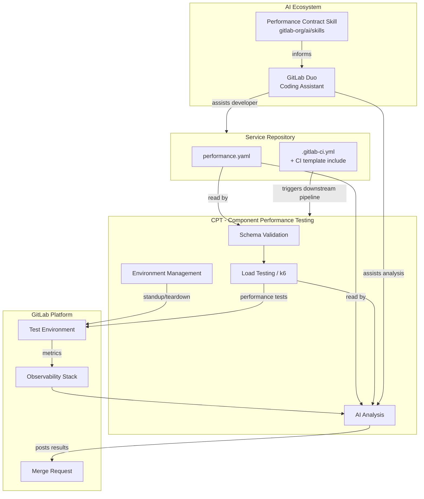

このページには今後予定されている製品・機能・機能性に関する情報が含まれています。ここに示す情報は参考目的のみです。購入・計画の決定にこの情報を使用しないでください。製品・機能・機能性の開発、リリース、タイミングは変更または延期される可能性があり、GitLab Inc. の独自の判断に委ねられています。

<table class="w-full text-sm border-collapse">
<thead>
<tr class="bg-gray-100 text-left">
<th class="px-3 py-2 border border-gray-300">Status</th>
<th class="px-3 py-2 border border-gray-300">Authors</th>
<th class="px-3 py-2 border border-gray-300">Coach</th>
<th class="px-3 py-2 border border-gray-300">DRIs</th>
<th class="px-3 py-2 border border-gray-300">Owning Stage</th>
<th class="px-3 py-2 border border-gray-300">Created</th>
</tr>
</thead>
<tbody>
<tr>
<td class="px-3 py-2 border border-gray-300">accepted</td>
<td class="px-3 py-2 border border-gray-300"><a href="https://gitlab.com/AndyWH" class="text-blue-600 hover:underline">@AndyWH</a></td>
<td class="px-3 py-2 border border-gray-300"></td>
<td class="px-3 py-2 border border-gray-300"></td>
<td class="px-3 py-2 border border-gray-300">~stage::developer-experience</td>
<td class="px-3 py-2 border border-gray-300">2026-04-21</td>
</tr>
</tbody>
</table>

[[_TOC_]]

## 用語集

| 用語 | 定義 |
| ---- | ---------- |
| Performance contract（パフォーマンスコントラクト） | モジュラーフィーチャーサービスのパフォーマンス目標をエンコードし、CI で自動的に検証される `performance.yaml` ファイル |
| Modular Feature（モジュラーフィーチャー） | モジュラーフィーチャーアーキテクチャ（Runway、Bench、LabKit v2）上に構築されたスタンドアロンの GitLab サービス |
| Contract tooling（コントラクトツール） | コントラクトに対するスキーマ検証、環境管理、負荷テスト実行を担うツール。CPT が選定されたツールです — [#4407](https://gitlab.com/gitlab-org/quality/quality-engineering/team-tasks/-/work_items/4407) を参照 |
| SLI | Service Level Indicator — サービスパフォーマンスの特定の側面を測定するメトリクス |
| LabKit v2 | Go サービス向けの GitLab の標準プラットフォームライブラリ。メトリクス名、ラベル規約、SLO に整合したヒストグラムバケットを提供します |
| CPT | Component Performance Testing — コントラクトツールの環境基盤およびテストランナー |
| Performance model（パフォーマンスモデル） | 個々のサービスコントラクトを集約することで構築される、GitLab のパフォーマンス特性に関する組み立て可能でシステムレベルの視点 |

## エグゼクティブサマリー

GitLab のモジュラーフィーチャーアーキテクチャへの移行は、パフォーマンステストへの新しいアプローチを必要とします。単一のモノリシックな表面をテストするのではなく、各モジュラーフィーチャーサービスが自身のパフォーマンス目標をエンコードした `performance.yaml` コントラクトを定義します。このコントラクトは、自動化された CI 検証、負荷テスト実行、サービスごとの AI 支援分析を駆動し — マージ前に回帰を検出するシフトレフトのフィードバックループを生み出します。

サービスごとのコントラクトアプローチは、組み立て可能な GitLab のパフォーマンスモデルへの第一歩です: コントラクトが成熟して安定化するにつれて、それらを集約することで、すべての可能な組み合わせを網羅的に統合テストすることなく、サービスの組み合わせ全体にわたるシステムレベルのパフォーマンスについて推論できるようになります。

実装の進捗は [&387 Performance contracts for Modular Features](https://gitlab.com/groups/gitlab-org/quality/-/work_items/387) で追跡されています。

## 問題提起

GitLab のパフォーマンステスト戦略は歴史的に、単一の統合された表面 — 負荷下にある GitLab インスタンス全体 — のテストに依存してきました。このアプローチは GitLab がモノリスだった頃には機能しましたが、Modular GitLab および Modular Features へのコミットメントは、テストの状況を根本的に変えます。

GitLab が独立してデプロイ可能なモジュラーフィーチャーサービスへ分解されるにつれて、2 つの異なる問題が浮上します:

- **組み合わせマトリクス問題（テストインフラストラクチャ）**: 単一の表面が、異なる方法で組み合わせ可能な多数のモジュラー表面になります。すべての組み合わせをテストすることは現実的ではありません — マトリクスが大きくなりすぎ、特定の変更に対してどの組み合わせをテストすべきかが曖昧になり、組み合わせ全体の結果を解釈することは複雑です。
- **共通言語問題（システム推論）**: モジュラーフィーチャーサービスにとって「良いパフォーマンス」が何を意味するかについて、共通の機械可読な定義がありません。これがなければ、チームは一貫した目標を設定できず、AI コーディングエージェントはパフォーマンス認識を持たず、デプロイ設定のリソース制限が実際の目標から乖離し、システム全体のパフォーマンスについて推論することは不可能です。

パフォーマンスコントラクトはこれら両方の問題に同時に対処します。各サービスが独自のコントラクトを定義し、組み合わせを網羅的にテストする必要を排除します。コントラクトはまた、CI で強制でき、AI エージェントが消費でき、最終的にはシステムレベルのパフォーマンスモデルに組み立てられる、パフォーマンス期待値の共通言語を確立します。

## ゴール

### 現行（マイルストーン 1〜4）

- 任意のモジュラーフィーチャーサービスが採用できる、`performance.yaml` の安定したバージョン管理されたスキーマを定義する
- モジュラーフィーチャーチーム向けのセルフサービス機能として、すべての MR で CI 上のコントラクト検証と負荷テスト実行を自動化する
- MR 上で開発者へのフィードバックとして、結果の AI 支援分析を表示する
- 採用が 1 日未満で済むよう、再利用可能な CI テンプレートとスキャフォールディングを提供する

### 将来の方向性

- **コントラクトコンポジション** — 個々のサービスコントラクトを統合ビューに集約し、組み合わせを網羅的にテストすることなくシステムレベルのパフォーマンス推論を可能にします。これは GitLab パフォーマンスモデルの基盤です。
- **GitLab のパフォーマンスモデル** — すべてのモジュラーフィーチャーにわたる、組み合わされたコントラクトと観測可能なメトリクスから派生した、GitLab のパフォーマンス特性に関する生きた機械可読モデル。
- **ローカル開発者環境** — 開発者が MR を開く前にローカル環境に対してコントラクトテストを実行できるようにすることで、パフォーマンスフィードバックをさらに前倒しします。

## 非ゴール

- 環境管理は明示的にコントラクトスキーマ自体のスコープ外です — コントラクトは _何を_ 測定するかを定義し、環境を _どのように_ プロビジョニングするかは定義しません
- ローカル開発者環境テストは将来の方向性であり、現在のエピックのスコープではありません
- 完全な本番 SLO 管理（コントラクトは SLO に情報を提供しますが、置き換えるものではありません）
- コントラクトコンポジションとパフォーマンスモデルは将来の方向性であり、現在のエピックのスコープではありません

## アーキテクチャ

[パフォーマンスコントラクトのハンドブックページ](/handbook/engineering/testing/performance-contracts/) には、コントラクトテスト実行の論理的フロー — 開発者へのフィードバックを生成するために何がどの順序で起こるか — が示されています。この図は構造的なビューを示しています: どのリポジトリがどのコンポーネントを所有し、どのように接続されるかです。

## スキーマ設計の決定事項

### 決定: エンドポイントカテゴリーは自由形式のラベル

**コンテキスト**: `endpoints` セクションは API ルートをパフォーマンスカテゴリーにグループ化します。問題は、カテゴリー名（`fast_reads`、`standard_reads`、`writes`）を固定の enum にすべきか、自由形式のラベルにすべきかです。

**決定**: 自由形式のラベル。チームは自分たちのサービスのセマンティクスに合わせてカテゴリーに名前を付けます。パフォーマンスティア（後述）は推奨デフォルトを提供しますが、スキーマでは強制されません。

**根拠**: 固定の enum は、新しいサービスアーキタイプが特定されるたびにスキーマ変更を必要とします。自由形式のラベルはチームに表現の自由を与え、ティアシステムがガードレールを提供します。

**ステータス**: 採択

---

### 決定: スキャフォールディングのデフォルトとしてのパフォーマンスティア

**コンテキスト**: 新しいサービスには、初期目標の基にできる本番データがありません。ゼロから目標を導出することなくチームに出発点を与える方法が必要です。

**決定**: 推奨されるレイテンシ/エラー率のデフォルトにマップする名前付きパフォーマンスティアを定義します。チームはティアを出発点として選択し、そこから調整します。

**根拠**: ティアは、一般的なサービスアーキタイプにとって「良い」ものがどう見えるかについての組織的知識をエンコードします。最初のコントラクトを作成する認知負荷を軽減します。

**ステータス**: 開発中 — [#4406](https://gitlab.com/gitlab-org/quality/quality-engineering/team-tasks/-/work_items/4406) を参照

**未解決の問い**: ティアの正しいメンタルモデルは何でしょうか — レイテンシ予算、サービスアーキタイプ、SLO クラス、それとも別のものでしょうか?

---

### 決定: `resources` および `database` セクションは MVP では任意

**コンテキスト**: リソース制限とデータベース制約は価値がありますが、その強制メカニズムはまだ完全には定義されていません。

**決定**: 両方のセクションを MVP では任意としてマークします。チームは意図を文書化するためにこれらを含めることができますが、強制が実装されるまで検証は CI をブロックしません。

**根拠**: まだ強制できないセクションを必須にすることは誤った自信を作り出します。任意のセクションにすることで、強制が構築される間にチームが目標の文書化を開始できるようになります。

**ステータス**: MVP として採択。強制メカニズムは未定。

**未解決の問い**: `database` セクション（例: `max_queries_per_request`）は、explain ジョブによる実行後分析を必要とします。これは既存のデータベースチームの explain ジョブツールとどのように統合されるでしょうか?

---

### 決定: `sli_mapping` は LabKit v2 のメトリクス名を直接参照

**コンテキスト**: コントラクトはパフォーマンス目標を観測可能な Prometheus メトリクスにマップする必要があります。LabKit v2 は Go サービス向けの標準化されたメトリクス名を提供します。

**決定**: `sli_mapping` セクションは LabKit v2 のメトリクス名を直接参照します。LabKit v2 を使用していないサービスは、同等のメトリクス名を手動で提供しなければなりません。

**根拠**: LabKit v2 はモジュラーフィーチャーサービスの標準です。直接参照することで翻訳レイヤーを排除し、コントラクトが計装標準に整合し続けることを保証します。

**ステータス**: 採択

---

### 決定: スキーマの正規の場所はツール選定待ちで保留

**コンテキスト**: テンプレートスキーマファイルには、バージョン管理され、検証ツールから参照され、新しいサービスへパフォーマンスコントラクトを追加するためにインポートできる、恒久的な置き場所が必要です。

**決定**: スキーマはマイルストーン 1 中、[ハンドブックページ](/handbook/engineering/testing/performance-contracts/) で一時的にメンテナンスされます。正規の場所は、[#4407](https://gitlab.com/gitlab-org/quality/quality-engineering/team-tasks/-/work_items/4407) で環境ツールが選定された後に決定されます。

**根拠**: スキーマの場所はツール選択と密結合です。ツール決定の前に場所をコミットすることは、破壊的な移行のリスクとなります。

**ステータス**: [#4407](https://gitlab.com/gitlab-org/quality/quality-engineering/team-tasks/-/work_items/4407) 待ち

## 環境とツールの決定事項

### 決定: 環境管理ツールの選定

**コンテキスト**: コントラクトテストは、各 MR で実行する一時的な環境を必要とします。CPT (Component Performance Testing) が主要候補として評価されました。

**決定**: CPT が MR レベルのコントラクト実行のための環境基盤として確認されました。[#4407](https://gitlab.com/gitlab-org/quality/quality-engineering/team-tasks/-/work_items/4407) で評価されました。

**根拠**:

- CPT の Docker および CNG デプロイパスはすでにモジュラーフィーチャーサービスのデプロイパターンをカバーしている
- 2 VM の GCP プロビジョニングモデル（テスト対象サービス用に 1 台、k6 用に 1 台）は MR レベルの実行に許容できる
- 環境管理に対する実行可能な代替案は存在しない — Sitespeed はテスト実行に対処するが環境プロビジョニングには対処せず、フロントエンド/UX コントラクトメトリクスの将来的な補完としてより適している

**検討された選択肢**:

| 選択肢 | 長所 | 短所 |
| ------ | ---- | ---- |
| CPT | 同一チームの所有、実証済みの環境管理、Docker と CNG のサポート、k6 統合 | `performance.yaml` を入力として受け入れ、k6 シナリオを動的に生成するための適応が必要 |
| 専用の新ツール | コントラクトのために目的別に構築 | 構築コスト、メンテナンス負担、現時点で環境管理がない |
| Runway 一時環境 | 本番ライク | セットアップの複雑さ、コスト、可用性 |
| Sitespeed | フロントエンドテストでの広範な現在の採用 | 環境管理を解決しない; UX/フロントエンドコントラクトメトリクスの将来的な補完としてより適している |

**ステータス**: 採択 — [#4407](https://gitlab.com/gitlab-org/quality/quality-engineering/team-tasks/-/work_items/4407) を参照

**マイルストーン 2（タスク 2.1）で対処すべき実装ギャップ**:

- `performance.yaml` → k6 シナリオへの変換、CPT にネイティブに組み込む予定
- スキーマ検証の場所（CPT vs. 別リポジトリ） — パイロットチーム採用からの具体的な再利用シナリオ待ちで保留
- Pass/fail の CI ゲーティングと構造化レポート — マイルストーン 4（タスク 4.2a/4.2b）に延期; MR コメントフィードバックは MVP には十分

---

### 決定: スキーマ検証アプローチ

**コンテキスト**: 構造的および意味的エラーを早期にキャッチするため、負荷テストの実行前にコントラクトを検証する必要があります。

**決定**: 2 段階の検証: (1) `check-jsonschema` を介した JSON Schema による構造的検証、(2) 意味的チェック（p99 ≥ p95、ルートの重複なし、有効な SLI 参照、リソース制限 ≥ リクエスト）。

**根拠**: 構造的検証と意味的検証を分離することで、エラーの診断が容易になり、各段階を独立して所有できるようになります。

**ステータス**: 採択（POC で実装済み）

## AI 統合の決定事項

### 決定: GitLab Skills リポジトリにパフォーマンスコントラクトスキルを公開

**コンテキスト**: AI コーディングアシスタントは、コントラクト準拠のコードを生成し、コントラクトテスト結果を分析するため、パフォーマンスコントラクトを認識する必要があります。

**決定**: コントラクト形式、スキーマ、テスト実行、機能コントラクトテストへのリンクをカバーするスキルを [GitLab Skills リポジトリ](https://gitlab.com/gitlab-org/ai/skills) に作成・公開します。

**根拠**: 共有リポジトリ内のスキルは、すべてのモジュラーフィーチャーリポジトリにわたるエージェントからアクセス可能であり、コントラクトシステムの進化に伴い 1 回の更新のみで済みます。

**ステータス**: マイルストーン 4 に予定 — マイルストーン 1 終了時にスキーマが安定したら開始可能

**未解決の問い**: AI エージェントは実行後分析のために観測スタックにどのようにアクセスしますか? どのようなデータがどの形式で利用可能ですか?

## 未解決の問い

アクティブな未解決の問いは [&387](https://gitlab.com/groups/gitlab-org/quality/-/work_items/387) で追跡されています。以下は未解決の主要な設計上の問いです:

1. **スキーマ変更のガバナンス** — 正規のテンプレートと検証ルールがコントラクトツールリポジトリで進化するにつれて、採用するすべてのサービスに影響する変更のレビューと通知プロセスはどうなるでしょうか? 破壊的 vs 非破壊的なスキーマ変更を承認するのは誰でしょうか?
2. **新しいサービスの初期目標** — 本番データがない新しいサービスの初期 p95/p99 目標を、チームはどのように決定しますか?
3. **SLO との関係** — コントラクト閾値は SLO から導出されるべきでしょうか、それとも SLO はコントラクトから導出されるべきでしょうか?
4. **複数のコントラクト vs 環境対応セクション** — 異なるテスト環境（CI、ステージング、ローカル）は別々のコントラクトファイルを使用すべきでしょうか、それとも 1 つのファイル内で環境別のセクションを使用すべきでしょうか?
5. **データベースセクションの強制** — `max_queries_per_request` はどのように強制されますか? データベースチームの explain ジョブとの統合は?

## 参考資料

- **Epic**: [&387 Performance contracts for Modular Features](https://gitlab.com/groups/gitlab-org/quality/-/work_items/387)
- **ハンドブックページ**: [Performance Contracts](/handbook/engineering/testing/performance-contracts/)
- **POC リポジトリ**: [perf-contract-poc](https://gitlab.com/gl-dx/performance-enablement/demos/perf-contract-poc)
- **POC ウォークスルー**: [動画ウォークスルー](https://drive.google.com/file/d/1bz2IwUE80H0MspLT0-TiFj3poWaEa9Cc/view?usp=drive_link)
- **関連設計ドキュメント**: [Component Performance Testing](../component_performance_testing/)
- **関連設計ドキュメント**: [Shift Left/Right Performance Testing](../shift_left_right_performance/)
