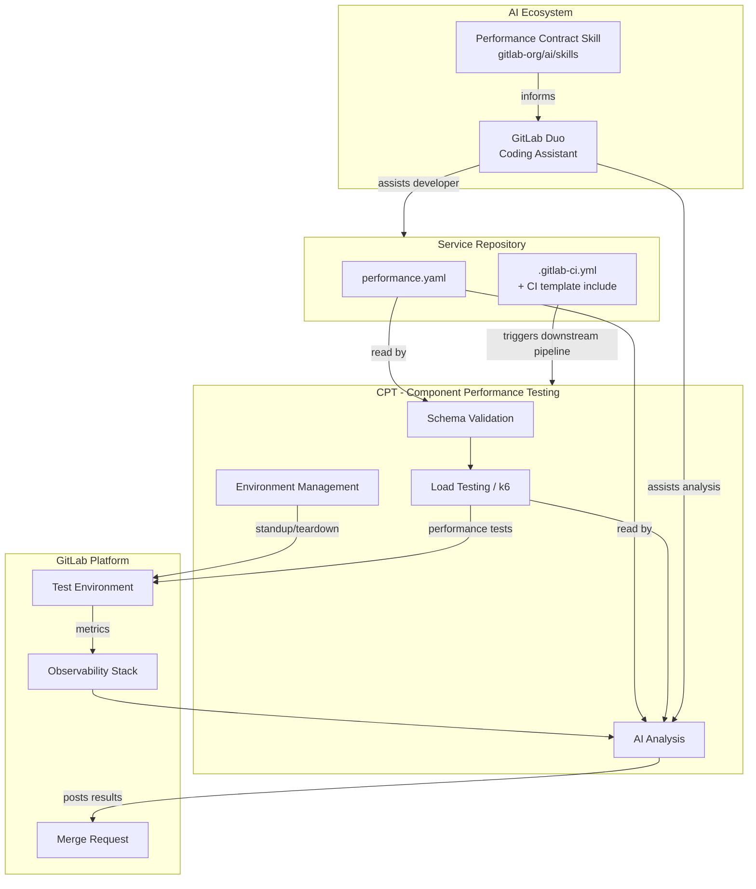
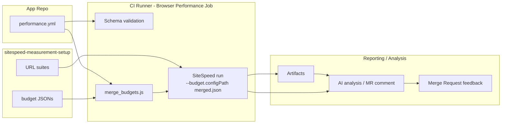



[[_TOC_]]

## 用語集

| 用語 | 定義 |
| ---- | ---------- |
| Performance contract（パフォーマンスコントラクト） | モジュラー機能サービスのパフォーマンス目標をエンコードする `performance.yaml` ファイル。CI で自動的に検証されます |
| Modular Feature（モジュラー機能） | モジュラー機能アーキテクチャ（Runway、Bench、LabKit v2）上に構築された、スタンドアロンの GitLab サービス |
| Contract tooling（コントラクトツーリング） | スキーマ検証、環境管理、コントラクトに対する負荷テストの実行を担当するツール。CPT が選定されたツールです - [#4407](https://gitlab.com/gitlab-org/quality/quality-engineering/team-tasks/-/work_items/4407) を参照 |
| SLI | Service Level Indicator - サービスのパフォーマンスの特定の側面を測定するメトリクス |
| LabKit v2 | Go サービス向けの GitLab 標準プラットフォームライブラリ。メトリクス名、ラベル規約、SLO に整合したヒストグラムバケットを提供します |
| CPT | Component Performance Testing - コントラクトツーリングのための環境基盤とテストランナー |
| Performance model（パフォーマンスモデル） | 個別のサービスコントラクトを集約して構築される、GitLab のパフォーマンス特性のコンポーザブルでシステムレベルのビュー |

## エグゼクティブサマリー

GitLab のモジュラー機能アーキテクチャへの移行は、新しいパフォーマンステストのアプローチを必要とします。単一のモノリシックなサーフェスをテストするのではなく、各モジュラー機能サービスがパフォーマンス目標をエンコードした `performance.yaml` コントラクトを定義します。このコントラクトは、サービスごとに自動化された CI 検証、負荷テストの実行、AI 支援分析を駆動し、マージ前に回帰を検出するシフトレフトのフィードバックループを作成します。

サービスごとのコントラクトアプローチは、GitLab のコンポーザブルなパフォーマンスモデルへの最初の一歩です。コントラクトが成熟して安定するにつれて、それらを集約することで、すべての可能な組み合わせを網羅的に統合テストすることなく、サービスの組み合わせ全体にわたるシステムレベルのパフォーマンスについて推論できるようになります。

実装の進捗は [&387 Performance contracts for Modular Features](https://gitlab.com/groups/gitlab-org/quality/-/work_items/387) で追跡されています。

## 問題提起

GitLab のパフォーマンステスト戦略は歴史的に、単一の統一されたサーフェス、つまり負荷下にある完全な GitLab インスタンスをテストすることに依存してきました。このアプローチは GitLab がモノリスだったときには機能しましたが、Modular GitLab と Modular Features へのコミットメントは、テストのランドスケープを根本的に変化させます。

GitLab が独立してデプロイ可能なモジュラー機能サービスに分解されるにつれて、2 つの異なる問題が浮かび上がります:

- **組み合わせマトリックス問題（テストインフラストラクチャ）:** 単一のサーフェスが、さまざまな方法で組み合わせ可能な多くのモジュラーサーフェスになります。あらゆる組み合わせをテストすることは現実的ではありません。マトリックスが大きくなりすぎ、所与の変更に対してどの組み合わせをテストすべきかを特定することがあいまいになり、組み合わせ間で結果を解釈することは複雑です。
- **共通言語問題（システムの推論）:** モジュラー機能サービスにとって「良いパフォーマンス」とは何かについて、共通かつ機械可読な定義は存在しません。これがないため、チームは一貫した目標を設定できず、AI コーディングエージェントはパフォーマンスを認識できず、デプロイ設定のリソース制限が実際の目標から乖離し、システム全体としてのパフォーマンスについて推論することが不可能です。

パフォーマンスコントラクトは、これらの両方の問題に同時に対処します。各サービスが独自のコントラクトを定義することで、組み合わせを網羅的にテストする必要がなくなります。コントラクトはまた、CI で強制可能で、AI エージェントが消費でき、最終的にはシステムレベルのパフォーマンスモデルに合成できる、パフォーマンス期待値の共通言語を確立します。

## ゴール

### 現在（マイルストーン 1-4）

- 任意のモジュラー機能サービスが採用できる、安定したバージョン管理された `performance.yaml` のスキーマを定義する
- モジュラー機能チームのためのセルフサービス機能として、すべての MR でコントラクト検証と負荷テストの実行を CI で自動化する
- MR で開発者へのフィードバックとして、結果の AI 支援分析を表面化する
- 採用に 1 日もかからないよう、再利用可能な CI テンプレートとスキャフォールディングを提供する

### 将来の方向性

- **コントラクトの合成** - 個別のサービスコントラクトを集約して結合ビューを作成し、組み合わせを網羅的にテストせずにシステムレベルのパフォーマンスを推論できるようにします。これは GitLab のパフォーマンスモデルの基礎です。
- **GitLab のパフォーマンスモデル** - 合成されたコントラクトと観測可能なメトリクスから派生する、すべてのモジュラー機能にわたる GitLab のパフォーマンス特性の、生きた機械可読モデル。
- **ローカル開発者環境** - 開発者が MR を作成する前にローカル環境に対してコントラクトテストを実行できるようにすることで、パフォーマンスフィードバックをさらに早めます。

## 非ゴール

- 環境管理はコントラクトスキーマ自体のスコープ外であることを明示します - コントラクトは _何を_ 測定するかを定義し、環境を _どのように_ プロビジョニングするかを定義しません
- ローカル開発者環境のテストは将来の方向性であり、現在のエピックのスコープ外です
- 完全な本番 SLO 管理（コントラクトは SLO に情報を提供しますが置き換えません）
- コントラクトの合成とパフォーマンスモデルは将来の方向性であり、現在のエピックのスコープ外です

## アーキテクチャ

[パフォーマンスコントラクトのハンドブックページ](/handbook/engineering/testing/performance-contracts/) は、コントラクトテスト実行の論理的な流れ - 開発者フィードバックを生成するために何がどの順序で起こるか - を示しています。この図は構造的なビューを示します: どのリポジトリがどのコンポーネントを所有し、それらがどのように接続するかです。



### フロントエンド: SiteSpeed の構造ビュー

ハンドブックには種類ごとの詳細な流れが含まれています。下記の図はフロントエンドの流れを反映しており、読者は予算と URL スイートがどこに存在し、それらが MR レベルの実行とオプションの集中集計にどのようにフィードバックされるかを確認できます。



## スキーマ設計の判断

### 判断: エンドポイントカテゴリを自由形式のラベルとする

**コンテキスト:** `endpoints` セクションは、API ルートをパフォーマンスカテゴリにグループ化します。問題は、カテゴリ名（`fast_reads`、`standard_reads`、`writes`）を固定の enum とすべきか、自由形式のラベルとすべきかです。

**判断:** 自由形式のラベル。チームは自分たちのサービスのセマンティクスに合わせてカテゴリ名を付けます。パフォーマンスティア（後述）は推奨されるデフォルトを提供しますが、スキーマで強制されることはありません。

**根拠:** 固定 enum は、新しいサービスアーキタイプが特定されるたびにスキーマ変更を必要とします。自由形式のラベルにより、ティアシステムがガードレールを提供しつつ、チームが表現豊かにできます。

**ステータス:** Accepted

---

### 判断: パフォーマンスティアをスキャフォールディングのデフォルトとする

**コンテキスト:** 新しいサービスには、初期目標の基礎となる本番データがありません。チームがゼロから目標を導出することを必要とせず、出発点を提供する方法が必要です。

**判断:** 名前付きのパフォーマンスティアを定義し、推奨されるレイテンシ／エラーレートのデフォルトにマッピングします。チームはティアを出発点として選択し、そこからチューニングします。

**根拠:** ティアは、一般的なサービスアーキタイプに対する「良い」とは何かに関する組織的な知識をエンコードします。最初のコントラクトを作成する際の認知負荷を軽減します。

**ステータス:** Under development - [#4406](https://gitlab.com/gitlab-org/quality/quality-engineering/team-tasks/-/work_items/4406) を参照

**未解決の問い:** ティアの正しいメンタルモデルは何か - レイテンシ予算、サービスアーキタイプ、SLO クラス、それとも別の何か？

---

### 判断: `resources` と `database` セクションは MVP ではオプションとする

**コンテキスト:** リソース制限とデータベース制約は価値がありますが、その強制メカニズムはまだ完全には定義されていません。

**判断:** 両方のセクションを MVP ではオプションとしてマークします。チームは意図をドキュメント化するために含めることができますが、強制が実装されるまで検証は CI をブロックしません。

**根拠:** まだ強制できないセクションを必須にすると、誤った信頼を生み出します。オプションセクションにより、強制が構築される間、チームは目標のドキュメント化を開始できます。

**ステータス:** Accepted for MVP. 強制メカニズムは TBD。

**未解決の問い:** `database` セクション（例: `max_queries_per_request`）は、explain ジョブ経由でのポストラン分析を必要とします。これは既存のデータベースチームの explain ジョブツーリングとどのように統合されますか？

---

### 判断: `sli_mapping` は LabKit v2 のメトリクス名を直接参照する

**コンテキスト:** コントラクトは、パフォーマンス目標を観測可能な Prometheus メトリクスにマッピングする必要があります。LabKit v2 は Go サービスに標準化されたメトリクス名を提供します。

**判断:** `sli_mapping` セクションは LabKit v2 のメトリクス名を直接参照します。LabKit v2 を使用していないサービスは、同等のメトリクス名を手動で提供する必要があります。

**根拠:** LabKit v2 はモジュラー機能サービスの標準です。直接参照することで翻訳レイヤーが不要になり、コントラクトが計装標準と整合したままになります。

**ステータス:** Accepted

---

### 判断: ツーリングの選定を待ってスキーマの正規の場所を保留する

**コンテキスト:** テンプレートとなるスキーマファイルは、バージョン管理され、検証ツーリングから参照され、新しいサービスにパフォーマンスコントラクトを追加するためにインポートできる恒久的な場所が必要です。

**判断:** スキーマはマイルストーン 1 の間、一時的に [ハンドブックページ](/handbook/engineering/testing/performance-contracts/) で維持されます。正規の場所は、[#4407](https://gitlab.com/gitlab-org/quality/quality-engineering/team-tasks/-/work_items/4407) で環境ツーリングが選定された後に決定されます。

**根拠:** スキーマの場所はツーリングの選択と結合しています。ツーリングの決定前に場所にコミットすると、破壊的な移行のリスクがあります。

**ステータス:** Pending [#4407](https://gitlab.com/gitlab-org/quality/quality-engineering/team-tasks/-/work_items/4407)

---

### 判断: `performance.yml` 内のフロントエンド設定を `frontend` の下に名前空間化する

**コンテキスト:** フロントエンドコントラクトは複数の関連する設定フィールド（budgets、teams、default）を必要とし、将来のオプションのために拡張可能でなければなりません。

**判断:** すべてのフロントエンド関連設定を `performance.yml` 内の `frontend` オブジェクトの下に名前空間化します。オブジェクトが存在することはフロントエンドコントラクトが設定されていることを意味します。明示的にオプトアウトするには、オプションの `enabled` ブール値を使用できます。

**根拠:** 名前空間化により関連する設定がグループ化され、スキーマの進化が簡素化され、無関係なキーがトップレベルで平坦化されることを避けます。

**ステータス:** Accepted

## 環境とツーリングの判断

### 判断: 環境管理ツーリングの選定

**コンテキスト:** コントラクトテストは、各 MR で実行する一時的な環境を必要とします。主要な候補として CPT（Component Performance Testing）が評価されました。

**判断:** MR レベルのコントラクト実行のための環境基盤として CPT を確定しました。[#4407](https://gitlab.com/gitlab-org/quality/quality-engineering/team-tasks/-/work_items/4407) で評価されました。

**根拠:**

- CPT の Docker と CNG のデプロイパスは、すでにモジュラー機能サービスのデプロイパターンをカバーしています
- 2 つの VM を使う GCP プロビジョニングモデル（テスト対象サービス用に 1 つ、k6 用に 1 つ）は MR レベルの実行に対して許容可能です
- 環境管理に対する実行可能な代替案は存在しません - Sitespeed はテスト実行に対応しますが環境プロビジョニングには対応しておらず、フロントエンド／UX のコントラクトメトリクスの将来的な補完としてのほうが適しています

**検討したオプション:**

| オプション | 利点 | 欠点 |
| ------ | ---- | ---- |
| CPT | 同じチームのオーナーシップ、実証された環境管理、Docker と CNG のサポート、k6 統合 | `performance.yaml` を入力として受け入れ、動的に k6 シナリオを生成するための適応が必要 |
| 専用の新ツール | コントラクト専用に作られる | 構築コスト、保守オーバーヘッド、現時点で環境管理がない |
| Runway 一時環境 | 本番に近い | セットアップの複雑さ、コスト、可用性 |
| Sitespeed | フロントエンドテストでの現在の採用がより広範 | 環境管理を解決しない。UX／フロントエンドのコントラクトメトリクスの将来的な補完としてのほうが良い |

**ステータス:** Accepted - [#4407](https://gitlab.com/gitlab-org/quality/quality-engineering/team-tasks/-/work_items/4407) を参照

**マイルストーン 2（タスク 2.1）で対処する実装ギャップ:**

- `performance.yaml` → k6 シナリオへの変換。CPT に組み込みでネイティブに構築します
- スキーマ検証の場所（CPT 内かそれとも別リポジトリか） - パイロットチームの採用から具体的な再利用シナリオが得られるまで保留
- 合否の CI ゲーティングと構造化されたレポーティング - マイルストーン 4（タスク 4.2a/4.2b）に保留。MR コメントのフィードバックで MVP には十分

---

### 判断: スキーマ検証のアプローチ

**コンテキスト:** コントラクトは、構造的および意味的なエラーを早期に検出するために、負荷テスト実行前に検証されなければなりません。

**判断:** 2 段階の検証: (1) `check-jsonschema` 経由の JSON Schema 構造検証、(2) 意味的なチェック（p99 ≥ p95、重複ルートなし、有効な SLI 参照、リソース制限 ≥ リクエスト）。

**根拠:** 構造的検証と意味的検証を分離することで、エラーの診断が容易になり、各パスを独立してオーナーシップできるようになります。

**ステータス:** Accepted（POC で実装済み）

## AI 統合の判断

### 判断: パフォーマンスコントラクトスキルを GitLab Skills リポジトリに公開する

**コンテキスト:** AI コーディングアシスタントが、コントラクトに準拠したコードを生成し、コントラクトテスト結果を分析するためには、パフォーマンスコントラクトの認識が必要です。

**判断:** コントラクトのフォーマット、スキーマ、テスト実行、機能的なコントラクトテストへのリンクをカバーするスキルを作成し、[GitLab Skills リポジトリ](https://gitlab.com/gitlab-org/ai/skills) に公開します。

**根拠:** 共有リポジトリ内のスキルは、すべてのモジュラー機能リポジトリにわたるエージェントからアクセス可能であり、コントラクトシステムの進化に応じて 1 回の更新で済みます。

**ステータス:** マイルストーン 4 に予定 - マイルストーン 1 の終わりにスキーマが安定したら開始できます

**未解決の問い:** AI エージェントは、ポストラン分析のために観測可能性スタックにどのようにアクセスしますか？どのようなデータがどのようなフォーマットで利用可能ですか？

## 未解決の問い

アクティブな未解決の問いは [&387](https://gitlab.com/groups/gitlab-org/quality/-/work_items/387) で追跡されています。以下は未解決の主要な設計上の問いです:

1. **スキーマ変更のガバナンス** - コントラクトツーリングリポジトリ内で正規のテンプレートと検証ルールが進化するにつれて、採用しているすべてのサービスに影響する変更のレビューと通知プロセスはどうあるべきか？破壊的なスキーマ変更と非破壊的なスキーマ変更を誰が承認するか？
2. **新しいサービスの初期目標** - 本番データのない新しいサービスについて、チームはどのように初期の p95/p99 目標を決定するか？
3. **SLO との関係** - コントラクトのしきい値は SLO から派生すべきか、それとも SLO はコントラクトから派生すべきか？
4. **複数のコントラクト対環境対応のセクション** - 異なるテスト環境（CI、ステージング、ローカル）は別々のコントラクトファイルを使うべきか、それとも 1 つのファイル内の環境固有のセクションを使うべきか？
5. **データベースセクションの強制** - `max_queries_per_request` はどのように強制されるか？データベースチームの explain ジョブとの統合？

## 参考資料

- **Epic**: [&387 Performance contracts for Modular Features](https://gitlab.com/groups/gitlab-org/quality/-/work_items/387)
- **ハンドブックページ**: [Performance Contracts](/handbook/engineering/testing/performance-contracts/)
- **POC リポジトリ**: [perf-contract-poc](https://gitlab.com/gl-dx/performance-enablement/demos/perf-contract-poc)
- **POC ウォークスルー**: [Video walkthrough](https://drive.google.com/file/d/1bz2IwUE80H0MspLT0-TiFj3poWaEa9Cc/view?usp=drive_link)
- **関連設計ドキュメント**: [Component Performance Testing](../component_performance_testing/)
- **関連設計ドキュメント**: [Shift Left/Right Performance Testing](../shift_left_right_performance/)

### 注: コントラクトの種類と SiteSpeed のフロントエンド予算

この設計ドキュメントは、コントラクトモデルとアーキテクチャ上の判断（CPT 中心）について記述しています。具体的な使用パターンと例については、ハンドブックページ [モジュラー機能向けのパフォーマンステスト](/handbook/engineering/testing/performance-contracts/) に「Contract Types」セクションと専用の Frontend: SiteSpeed サブセクションが追加されました。

フロントエンドパイロットの概要（高レベル）:

- 私たちは SiteSpeed を使用したフロントエンドのパフォーマンス予算について、開発者中心のワークフローをパイロットしています。予算と URL リストは `sitespeed-measurement-setup` リポジトリの `performance/` 配下に共置されているため、開発者は単一の PR で両方を一緒に更新できます。
- 予算ファイルは、ベースラインのデフォルト（`performance/budgets/default.json`）、環境のオーバーライド（`performance/budgets/environments/*.json`）、およびオプションのチームごとのオーバーライド（`performance/budgets/teams/*.json`）として編成されます。すべてのファイルは SiteSpeed のネイティブなネストされた予算フォーマットを使用します。CI 実行時に、環境の予算はチームのオーバーライドとマージされます。チームのエントリは各セクション内でメトリクスレベルで環境のエントリを上書きし、URL／エイリアスキーのオーバーライドはグローバルセクションのデフォルトとは独立してマージされます。
- MR レベルの実行はアドバイザリ的であり、レビューアプリの URL に対して `--budget.configPath` を指定して SiteSpeed をローカルで実行します。初期パイロットでは、データの無制限な増加を防ぐため、MR の実行を中央の sitespeed-runway サーバーに送信することを避けます。スケジュール実行や保護ブランチ実行は後で昇格できます。
- `sitespeed-measurement-setup` リポジトリには、例、JSON Schema、およびヘルパースクリプト（`validate_budget.js`、`merge_budgets.js`）が `performance/` 配下に含まれています。

`performance.yml` のフロントエンド設定の例（名前空間化済み）:

```yaml
frontend:
  enabled: true            # optional: presence implies enabled; set false to opt-out
  budgets:
    production: testrunner/sitespeed-measurement-setup/performance/budgets/environments/production.json
    staging:   testrunner/sitespeed-measurement-setup/performance/budgets/environments/staging.json
    mr:        testrunner/sitespeed-measurement-setup/performance/budgets/environments/mr.json
  teams:
    rapid-diffs:
      url_dir: testrunner/sitespeed-measurement-setup/gitlab/desktop/urls
      budget:  testrunner/sitespeed-measurement-setup/performance/budgets/teams/rapid-diffs.json
  default_budget: mr
```

マージセマンティクスに関する注: 環境予算とオプションのチーム予算は、SiteSpeed のネイティブなネストされたフォーマットを使用して実行時にマージされます。チームのエントリは各セクション内でメトリクスレベルで環境のエントリを上書きし、URL／エイリアスキーのオーバーライドはグローバルセクションのデフォルトとは独立してマージされます。

SiteSpeed の例と CI スニペットについてはハンドブックページを参照してください。この設計ドキュメントは、アーキテクチャ上の判断と CPT のロードマップに焦点を当てています。
