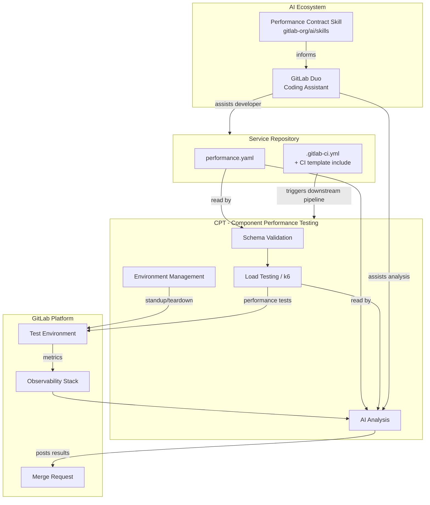
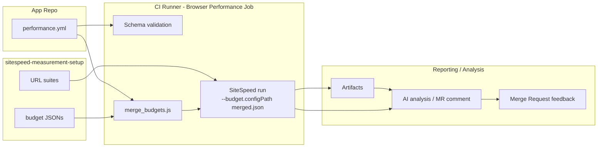



[[_TOC_]]

## 用語集

| 用語 | 定義 |
| ---- | ---------- |
| Performance contract | モジュラーフィーチャーサービスのパフォーマンス目標をエンコードした `performance.yaml` ファイル。CI で自動的に検証される |
| Modular Feature | モジュラーフィーチャーアーキテクチャ (Runway, Bench, LabKit v2) 上に構築されたスタンドアロンの GitLab サービス |
| Contract tooling | スキーマ検証、環境管理、コントラクトに対する負荷テストの実行を担うツール。CPT が選定されたツールである - [#4407](https://gitlab.com/gitlab-org/quality/quality-engineering/team-tasks/-/work_items/4407) を参照 |
| SLI | Service Level Indicator - サービスパフォーマンスの特定の側面を測定するメトリクス |
| LabKit v2 | Go サービス向けの GitLab 標準プラットフォームライブラリ。メトリクス名、ラベルの規約、SLO に整合したヒストグラムバケットを提供する |
| CPT | Component Performance Testing - コントラクトツーリングの環境基盤およびテストランナー |
| Performance model | 個々のサービスコントラクトを集約して構築される、GitLab のパフォーマンス特性のコンポーザブルでシステムレベルのビュー |

## エグゼクティブサマリー

GitLab のモジュラーフィーチャーアーキテクチャへの移行には、新しいパフォーマンステストのアプローチが必要です。単一のモノリシックなサーフェスをテストするのではなく、各モジュラーフィーチャーサービスがそのパフォーマンス目標をエンコードした `performance.yaml` コントラクトを定義します。このコントラクトは、サービスごとに自動 CI 検証、負荷テストの実行、AI 支援分析を駆動し、マージ前に回帰を検出するシフトレフトのフィードバックループを生み出します。

サービスごとのコントラクトのアプローチは、GitLab のコンポーザブルなパフォーマンスモデルへの第一歩です。コントラクトが成熟し安定するにつれて、可能なすべての組み合わせを網羅的に統合テストすることなく、サービスの組み合わせ全体のシステムレベルのパフォーマンスを論じるために集約できます。

実装の進捗は [&387 Performance contracts for Modular Features](https://gitlab.com/groups/gitlab-org/quality/-/work_items/387) で追跡されています。

## 課題の説明

GitLab のパフォーマンステスト戦略は、これまで単一の統一されたサーフェス - 負荷をかけた完全な GitLab インスタンス - をテストすることに依存してきました。このアプローチは GitLab がモノリスだった頃には機能しましたが、Modular GitLab と Modular Features へのコミットメントは、テストの状況を根本的に変えます。

GitLab が独立してデプロイ可能なモジュラーフィーチャーサービスに分解されるにつれて、2 つの明確な課題が浮上します。

- **組み合わせマトリクスの問題（テストインフラ）:** 単一のサーフェスが、さまざまな方法で組み合わせられる多数のモジュラーサーフェスになります。すべての組み合わせをテストするのは現実的ではありません - マトリクスが大きくなりすぎ、ある変更に対してどの組み合わせをテストすべきかの特定が曖昧になり、組み合わせ全体の結果を解釈するのが複雑になります。
- **共通言語の問題（システムの推論）:** モジュラーフィーチャーサービスにとって「良好なパフォーマンス」が何を意味するかについて、共通の機械可読な定義がありません。これがなければ、チームは一貫した目標を設定できず、AI コーディングエージェントはパフォーマンスを認識できず、デプロイ設定のリソース制限が実際の目標から乖離し、システム全体のパフォーマンスを論じることが不可能になります。

パフォーマンスコントラクトは、両方の問題を同時に解決します。各サービスが独自のコントラクトを定義するため、組み合わせを網羅的にテストする必要がなくなります。コントラクトはまた、CI で強制でき、AI エージェントが消費でき、最終的にはシステムレベルのパフォーマンスモデルに合成できる、パフォーマンス期待値の共通言語を確立します。

## 目標

### 現在 (マイルストーン 1-4)

- 任意のモジュラーフィーチャーサービスが採用できる、安定したバージョン管理された `performance.yaml` のスキーマを定義する
- モジュラーフィーチャーチームのセルフサービス機能として、すべての MR で CI 上のコントラクト検証と負荷テストの実行を自動化する
- MR でのデベロッパーへのフィードバックとして、結果の AI 支援分析を表面化する
- 採用が 1 日未満で済むように、再利用可能な CI テンプレートとスキャフォールディングを提供する

### 将来の方向性

- **コントラクトの合成** - 個々のサービスコントラクトを統合ビューに集約し、網羅的な組み合わせテストなしにシステムレベルのパフォーマンスの推論を可能にする。これは GitLab パフォーマンスモデルの基盤である。
- **GitLab のパフォーマンスモデル** - 合成されたコントラクトと観測可能なメトリクスから導出される、すべてのモジュラーフィーチャーにわたる GitLab のパフォーマンス特性の、生きた機械可読なモデル。
- **ローカルのデベロッパー環境** - デベロッパーが MR を開く前にローカル環境に対してコントラクトテストを実行できるようにすることで、パフォーマンスフィードバックをさらに早めにシフトする。

## 非目標

- 環境管理は、コントラクトスキーマ自体のスコープから明示的に外れています - コントラクトは _何を_ 測定するかを定義するものであり、_どのように_ 環境をプロビジョニングするかではありません
- ローカルのデベロッパー環境テストは将来の方向性であり、現在のエピックのスコープには含まれません
- 本番の完全な SLO 管理（コントラクトは SLO に情報を与えますが、SLO を置き換えるものではありません）
- コントラクトの合成とパフォーマンスモデルは将来の方向性であり、現在のエピックのスコープには含まれません

## アーキテクチャ

[パフォーマンスコントラクトのハンドブックページ](/handbook/engineering/testing/performance-contracts/)は、コントラクトテスト実行の論理的なフロー - デベロッパーへのフィードバックを生み出すために、何がどの順序で起こるか - を示しています。この図は構造的なビューを示しています。どのリポジトリがどのコンポーネントを所有し、それらがどのように接続されるかです。



### フロントエンド: SiteSpeed の構造的なビュー

ハンドブックには、タイプごとの詳細なフローが含まれています。以下の図はフロントエンドのフローを反映しており、バジェットと URL スイートがどこにあり、それらがどのように MR レベルの実行とオプションの中央集約にフィードされるかを読者が確認できます。



## スキーマ設計の決定

### 決定: エンドポイントのカテゴリを自由形式のラベルとする

**コンテキスト:** `endpoints` セクションは、API ルートをパフォーマンスのカテゴリにグループ化します。問題は、カテゴリ名 (`fast_reads`, `standard_reads`, `writes`) を固定の enum とすべきか、自由形式のラベルとすべきかです。

**決定:** 自由形式のラベル。チームは自分たちのサービスのセマンティクスに合わせてカテゴリに名前を付けます。パフォーマンスティア（後述）は推奨されるデフォルトを提供しますが、スキーマによって強制されるわけではありません。

**根拠:** 固定の enum は、新しいサービスのアーキタイプが特定されるたびにスキーマの変更を必要とします。自由形式のラベルはチームが表現力を持てるようにし、ティアシステムがガードレールを提供します。

**ステータス:** Accepted

---

### 決定: パフォーマンスティアをスキャフォールディングのデフォルトとする

**コンテキスト:** 新しいサービスには、初期目標の基礎とする本番データがありません。チームに目標をゼロから導出させることなく、出発点を与える方法が必要です。

**決定:** 推奨されるレイテンシ／エラー率のデフォルトにマッピングする、名前付きのパフォーマンスティアを定義します。チームはティアを出発点として選択し、そこから調整します。

**根拠:** ティアは、一般的なサービスのアーキタイプにとって「良好」とは何かについての組織的な知識をエンコードします。これにより、最初のコントラクトを作成する際の認知的負荷が軽減されます。

**ステータス:** 開発中 - [#4406](https://gitlab.com/gitlab-org/quality/quality-engineering/team-tasks/-/work_items/4406) を参照

**未解決の問題:** ティアの正しいメンタルモデルは何か - レイテンシバジェット、サービスのアーキタイプ、SLO クラス、それとも別の何かか?

---

### 決定: `resources` および `database` セクションを MVP ではオプションとする

**コンテキスト:** リソース制限とデータベース制約は価値がありますが、その強制メカニズムはまだ完全には定義されていません。

**決定:** MVP では両方のセクションをオプションとしてマークします。チームは意図を文書化するためにそれらを含めることができますが、強制が実装されるまで検証が CI をブロックすることはありません。

**根拠:** まだ強制できないセクションを必須にすると、誤った確信を生み出します。オプションのセクションにより、強制が構築される間、チームは目標の文書化を開始できます。

**ステータス:** MVP では Accepted。強制メカニズムは TBD。

**未解決の問題:** `database` セクション（例: `max_queries_per_request`）は、explain ジョブによる実行後の分析を必要とします。これは既存のデータベースチームの explain ジョブツーリングとどのように統合されますか?

---

### 決定: `sli_mapping` は LabKit v2 のメトリクス名を直接参照する

**コンテキスト:** コントラクトは、パフォーマンス目標を観測可能な Prometheus メトリクスにマッピングする必要があります。LabKit v2 は Go サービス向けの標準化されたメトリクス名を提供します。

**決定:** `sli_mapping` セクションは LabKit v2 のメトリクス名を直接参照します。LabKit v2 を使用していないサービスは、同等のメトリクス名を手動で提供する必要があります。

**根拠:** LabKit v2 はモジュラーフィーチャーサービスの標準です。直接参照することで変換レイヤーが不要になり、コントラクトが計測の標準に整合し続けることが保証されます。

**ステータス:** Accepted

---

### 決定: スキーマの正規の場所はツーリングの選定まで保留する

**コンテキスト:** テンプレートのスキーマファイルには、バージョン管理され、検証ツーリングから参照され、新しいサービスにパフォーマンスコントラクトを追加するためにインポートできる、恒久的な置き場所が必要です。

**決定:** スキーマは、マイルストーン 1 の間は一時的に[ハンドブックページ](/handbook/engineering/testing/performance-contracts/)で管理されます。正規の場所は、[#4407](https://gitlab.com/gitlab-org/quality/quality-engineering/team-tasks/-/work_items/4407) で環境ツーリングが選定された時点で決定されます。

**根拠:** スキーマの場所はツーリングの選択に結合しています。ツーリングの決定の前に場所をコミットすると、破壊的な移行のリスクがあります。

**ステータス:** [#4407](https://gitlab.com/gitlab-org/quality/quality-engineering/team-tasks/-/work_items/4407) 待ち

---

### 決定: フロントエンド設定を `performance.yml` の `frontend` 配下に名前空間化する

**コンテキスト:** フロントエンドコントラクトは複数の関連する設定フィールド（budgets, teams, default）を必要とし、将来のオプションのために拡張可能でなければなりません。

**決定:** すべてのフロントエンド関連の設定を `performance.yml` の `frontend` オブジェクト配下に名前空間化します。オブジェクトが存在することはフロントエンドコントラクトが設定されていることを意味します。明示的にオプトアウトするために、オプションの `enabled` ブール値を使用できます。

**根拠:** 名前空間化は関連する設定をグループ化し、スキーマの進化を簡素化し、無関係なキーをトップレベルでフラット化することを避けます。

**ステータス:** Accepted

## 環境とツーリングの決定

### 決定: 環境管理ツーリングの選定

**コンテキスト:** コントラクトテストは、各 MR で実行するための一時的な環境を必要とします。CPT (Component Performance Testing) が主要な候補として評価されました。

**決定:** CPT は MR レベルのコントラクト実行のための環境基盤として確定しました。[#4407](https://gitlab.com/gitlab-org/quality/quality-engineering/team-tasks/-/work_items/4407) で評価されました。

**根拠:**

- CPT の Docker および CNG のデプロイパスは、すでにモジュラーフィーチャーサービスのデプロイパターンをカバーしています
- 2 つの VM による GCP プロビジョニングモデル（1 つはテスト対象のサービス用、もう 1 つは k6 用）は、MR レベルの実行には許容できます
- 環境管理に対する実行可能な代替手段は存在しません - Sitespeed はテストの実行には対応しますが環境のプロビジョニングには対応せず、フロントエンド／UX コントラクトメトリクスの将来の補完としてより適しています

**検討したオプション:**

| オプション | 利点 | 欠点 |
| ------ | ---- | ---- |
| CPT | 同一チームによる所有、実証済みの環境管理、Docker と CNG のサポート、k6 との統合 | `performance.yaml` を入力として受け取り、k6 シナリオを動的に生成するための適応が必要 |
| 専用の新規ツール | コントラクトのために専用設計 | 構築コスト、保守のオーバーヘッド、現時点で環境管理がない |
| Runway のエフェメラル環境 | 本番に近い | セットアップの複雑さ、コスト、可用性 |
| Sitespeed | フロントエンドテストでの現状のより広い採用 | 環境管理を解決しない。UX／フロントエンドのコントラクトメトリクスの将来の補完としてより適している |

**ステータス:** Accepted - [#4407](https://gitlab.com/gitlab-org/quality/quality-engineering/team-tasks/-/work_items/4407) を参照

**マイルストーン 2 (タスク 2.1) で対処すべき実装上のギャップ:**

- `performance.yaml` → k6 シナリオの変換。CPT にネイティブに構築する
- スキーマ検証の場所（CPT か別のリポジトリか） - パイロットチームの採用からの具体的な再利用シナリオが出るまで保留
- 合否の CI ゲーティングと構造化されたレポート - マイルストーン 4 (タスク 4.2a/4.2b) に延期。MR コメントのフィードバックは MVP には十分

---

### 決定: スキーマ検証のアプローチ

**コンテキスト:** 構造的・意味的なエラーを早期に検出するため、負荷テストが実行される前にコントラクトを検証する必要があります。

**決定:** 2 パスの検証: (1) `check-jsonschema` による JSON スキーマの構造検証、(2) セマンティックチェック（p99 ≥ p95、ルートの重複なし、有効な SLI 参照、リソース制限 ≥ リクエスト）。

**根拠:** 構造検証とセマンティック検証を分離することで、エラーの診断が容易になり、各パスを独立して所有できるようになります。

**ステータス:** Accepted（POC で実装済み）

## AI 統合の決定

### 決定: GitLab Skills リポジトリにパフォーマンスコントラクトのスキルを公開する

**コンテキスト:** AI コーディングアシスタントは、コントラクトに準拠したコードを生成し、コントラクトテストの結果を分析するために、パフォーマンスコントラクトを認識する必要があります。

**決定:** コントラクトの形式、スキーマ、テストの実行、機能コントラクトテストへのリンクをカバーするスキルを作成し、[GitLab Skills リポジトリ](https://gitlab.com/gitlab-org/ai/skills) に公開します。

**根拠:** 共有リポジトリ内のスキルは、すべてのモジュラーフィーチャーリポジトリにわたるエージェントからアクセス可能であり、コントラクトシステムが進化するにつれて単一の更新のみで済みます。

**ステータス:** マイルストーン 4 に計画 - マイルストーン 1 の終わりにスキーマが安定したら開始できる

**未解決の問題:** AI エージェントは実行後の分析のために観測可能性スタックにどのようにアクセスするか? どのようなデータがどのような形式で利用可能か?

## 未解決の問題

アクティブな未解決の問題は [&387](https://gitlab.com/groups/gitlab-org/quality/-/work_items/387) で追跡されています。以下は主要な未解決の設計上の問題です。

1. **スキーマ変更のガバナンス** - 正規のテンプレートと検証ルールがコントラクトツーリングのリポジトリで進化するにつれて、採用するすべてのサービスに影響する変更のレビューとコミュニケーションのプロセスはどうなるか? 破壊的なスキーマ変更と非破壊的なスキーマ変更を誰が承認するか?
2. **新しいサービスの初期目標** - 本番データのない新しいサービスの初期 p95/p99 目標をチームはどのように決定するか?
3. **SLO との関係** - コントラクトのしきい値は SLO から導出すべきか、それとも SLO はコントラクトから導出すべきか?
4. **複数のコントラクト vs 環境を意識したセクション** - 異なるテスト環境（CI, staging, local）は別々のコントラクトファイルを使用すべきか、それとも 1 つのファイル内の環境固有のセクションを使用すべきか?
5. **データベースセクションの強制** - `max_queries_per_request` はどのように強制されるか? データベースチームの explain ジョブとの統合か?

## 参考資料

- **エピック**: [&387 Performance contracts for Modular Features](https://gitlab.com/groups/gitlab-org/quality/-/work_items/387)
- **ハンドブックページ**: [Performance Contracts](/handbook/engineering/testing/performance-contracts/)
- **POC リポジトリ**: [perf-contract-poc](https://gitlab.com/gl-dx/performance-enablement/demos/perf-contract-poc)
- **POC ウォークスルー**: [動画ウォークスルー](https://drive.google.com/file/d/1bz2IwUE80H0MspLT0-TiFj3poWaEa9Cc/view?usp=drive_link)
- **関連する設計ドキュメント**: [Component Performance Testing](../component_performance_testing/)
- **関連する設計ドキュメント**: [Shift Left/Right Performance Testing](../shift_left_right_performance/)

### 注記: コントラクトの種類と SiteSpeed フロントエンドバジェット

この設計ドキュメントは、コントラクトモデルとアーキテクチャの決定（CPT 中心）を説明しています。具体的な使用パターンと例については、ハンドブックページ [Performance Testing for Modular Features](/handbook/engineering/testing/performance-contracts/) に、専用の Frontend: SiteSpeed サブセクションを含む「Contract Types」セクションが追加されました。

フロントエンドパイロットの概要（ハイレベル）:

- SiteSpeed を使用して、フロントエンドのパフォーマンスバジェットのデベロッパー中心のワークフローをパイロットします。バジェットと URL リストは `sitespeed-measurement-setup` リポジトリの `performance/` 配下に同じ場所に配置されるため、デベロッパーは単一の PR でそれらを一緒に更新できます。
- バジェットファイルは、ベースラインのデフォルト (`performance/budgets/default.json`)、環境のオーバーライド (`performance/budgets/environments/*.json`)、およびオプションのチームごとのオーバーライド (`performance/budgets/teams/*.json`) として編成されます。すべてのファイルは SiteSpeed のネイティブなネスト化されたバジェット形式を使用します。CI 実行時に、環境バジェットはチームのオーバーライドとマージされます。チームのエントリは各セクション内のメトリクスレベルで環境のエントリをオーバーライドし、URL／エイリアスをキーとするオーバーライドはグローバルなセクションのデフォルトとは独立してマージされます。
- MR レベルの実行は助言的であり、レビューアプリの URL に対して `--budget.configPath` を使用してローカルで SiteSpeed を実行します。初期パイロットでは、制御されないデータの増加を防ぐために、MR 実行を中央の sitespeed-runway サーバーに送信することを避けています。スケジュールされた実行または保護されたブランチの実行は、後で昇格できます。
- `sitespeed-measurement-setup` リポジトリには、`performance/` 配下に例、JSON スキーマ、ヘルパースクリプト (`validate_budget.js`, `merge_budgets.js`) が含まれています。

`performance.yml` フロントエンド設定の例（名前空間化）:

```yaml
frontend:
  enabled: true            # optional: presence implies enabled; set false to opt-out
  budgets:
    production: testrunner/sitespeed-measurement-setup/performance/budgets/environments/production.json
    staging:   testrunner/sitespeed-measurement-setup/performance/budgets/environments/staging.json
    mr:        testrunner/sitespeed-measurement-setup/performance/budgets/environments/mr.json
  teams:
    rapid-diffs:
      url_dir: testrunner/sitespeed-measurement-setup/gitlab/desktop/urls
      budget:  testrunner/sitespeed-measurement-setup/performance/budgets/teams/rapid-diffs.json
  default_budget: mr
```

マージのセマンティクスに関する注記: 環境バジェットとオプションのチームバジェットは、SiteSpeed のネイティブなネスト化形式を使用して実行時にマージされます。チームのエントリは各セクション内のメトリクスレベルで環境のエントリをオーバーライドし、URL／エイリアスをキーとするオーバーライドはグローバルなセクションのデフォルトとは独立してマージされます。

SiteSpeed の例と CI スニペットについてはハンドブックページを参照してください。この設計ドキュメントはアーキテクチャの決定と CPT のロードマップに焦点を当てています。
