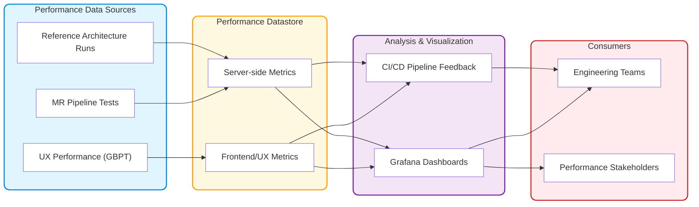
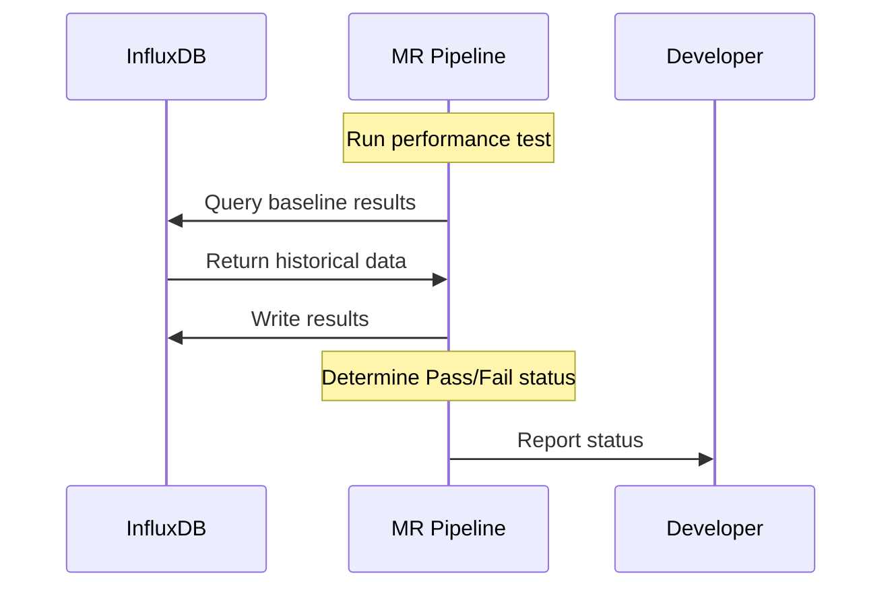
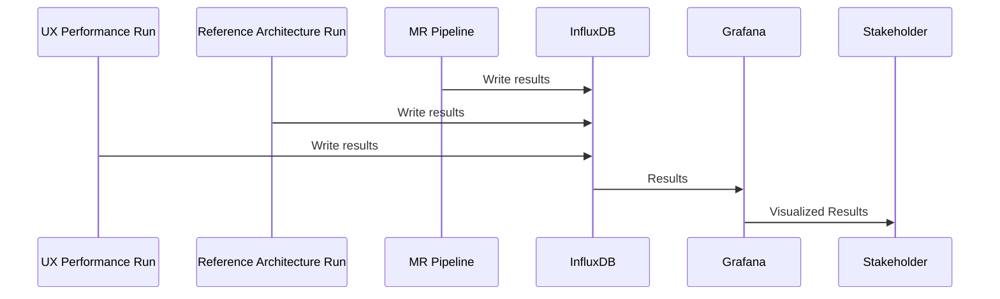

## サマリー

本ブループリントは、GitLab Performance Tool を基盤としたパフォーマンス結果データストアを提案します。パフォーマンスメトリクスを一元化することで、データに基づいた意思決定、動的なベースライン、そして開発ライフサイクル全体へのパフォーマンス意識の統合を実現します。

## 目標

- すべてのパフォーマンステスト結果の集中リポジトリを作成する
- 分析と可視化のためのパフォーマンスデータへのプログラムアクセスを実現する
- 異なるテスト実行、環境、GitLab バージョン間でのトレンド分析を実現する
- 自動化されたパフォーマンスリグレッション検出のための基盤を提供する
- 自動的なデータ収集のために既存の CI/CD パイプラインと統合する
- 高レベルの集約メトリクスと詳細な生パフォーマンスデータの両方をサポートする
- 過去のデータに基づく動的なベースライン作成を実現する

## 非目標

- **既存のパフォーマンステストツールの置き換え**: GitLab Performance Tool などのツールを置き換えるのではなく、拡張・統合します
- **監視インフラストラクチャの重複**: 並行システムを作成するのではなく、現在の監視ソリューションを活用します
- **可視化の再発明**: カスタム代替手段を作成するのではなく、引き続き現在の可視化ツールを利用します
- **リアルタイム監視との競合**: 既存のリアルタイム監視機能を置き換えるのではなく、補完します
- **パフォーマンスフォーカスを超えた拡張**: インサイトの深さと関連性を確保するため、パフォーマンスメトリクスに専念します

このイニシアティブは、パフォーマンス機能の増幅と進化に関するものであり、置き換えではありません。価値あるシステムを破棄することなく、以前の作業によって作られた確固たる基盤の上に構築し、新たな可能性を開きます。

## 提案

クロスファンクショナルなパフォーマンスメトリクスの分析と解釈を可能にするパフォーマンス結果データストアの構築を提案します。主要な機能は以下のとおりです:

- 複数のタイプのパフォーマンステストをサポート
- 豊富なメタデータ（GitLab バージョン、環境の詳細、テストパラメータ）を伴う結果の保存
- さまざまな分析ニーズに対応する柔軟なクエリ機能の提供
- 増大するパフォーマンスデータのボリュームに対応するスケール
- 既存の CI/CD パイプラインとのシームレスな統合

## 実装アプローチ

既存のインフラストラクチャ（InfluxDB と Grafana）を活用して、以下を可能にする概念実証を作成します:

- 複数のソースからのパフォーマンスデータの保存
- Grafana ダッシュボードによる可視化
- CI/CD パイプラインからのプログラムアクセス

### インフラストラクチャの詳細

この実装のために以下のリソースがプロビジョニングされています:

- **InfluxDB インスタンス**
  - URL: https://influxdb.quality.gitlab.net/
  - バケット名: `perf-test-metrics`

- **Grafana インスタンス**
  - URL: https://dashboards.quality.gitlab.net/
  - パフォーマンスメトリクスの可視化のために InfluxDB インスタンスに接続済み

## アーキテクチャ概要

### 主要なユースケース

- MR パイプラインのパフォーマンス検証
- トレンド分析
- 動的ベースライン
- リグレッション検出

### データ保持

多数の MR にわたるパフォーマンステストは大量のデータを生成します。分析上の価値とストレージ制約のバランスを保つための思慮深い保持戦略が必要です。可能なアプローチには以下が含まれます:

1. **選択的ストレージ** - マージされた MR の結果のみを永続化し、未マージの MR のパイプライン実行を一時的なデータとして扱う
2. **データ集約** - 過去のデータを統合し、古い測定値の粒度を下げながらトレンドを保持する定期的なプロセスを実装
3. **時間ベースの保持** - 最近のデータは完全な忠実度を維持（例: 30〜90 日）し、その後古いデータの解像度を段階的に下げる
4. **重要度ベースの削除** - 大幅な変化や異常を示すすべてのデータポイントを保持し、予想されるパターンに従うデータはサンプリングまたは集約する
5. **環境ベースのポリシー** - ソース環境に基づいて異なる保持ルールを適用（例: リファレンスアーキテクチャ実行は MR パイプラインテストよりも長い保持期間）

実際の使用パターンに基づいてこれらのアプローチを評価しながら、初期実装ではコアインフラストラクチャの確立に注力します。

## サンプルワークフロー

### 開発者として、自分の変更がパフォーマンスに影響するかどうかを知りたい

### ステークホルダーとして、パフォーマンストレンドを調査できるようにしたい

## 代替ソリューション

1. 各 MR でベースライン実行とパフォーマンス実行を実行する
   - 長所:
     - 履歴データに依存せずに即時の直接比較が可能
     - 最新の参照ポイントを保証
     - 環境や時間的な変動に関する懸念を排除
   - 短所:
     - CI リソースの消費とパイプライン期間を大幅に増加させる
     - 同じベースラインコードの重複テスト実行を作成
     - すべてのパフォーマンス関連 MR のテスト時間が 2 倍になる
     - テストスイートに追加されるパフォーマンステストが増えるほどスケールが悪化
     - ハードコードされたベースラインを使用
2. 静的なハードコードされたベースラインを使用する
   - 長所:
     - 最小限のインフラストラクチャニーズでシンプルな実装
     - 比較のための一貫した参照ポイント
     - 実装のメンテナンスオーバーヘッドが低い
   - 短所:
     - アプリケーションの進化に伴い急速に時代遅れになる
     - 時間の経過とともに正当なパフォーマンス変化を考慮できない
     - 期待値を調整するための手動更新が必要
3. 既存の環境ごとの Prometheus インスタンスを使用する
   - 長所:
     - 既存の監視インフラストラクチャを活用
     - データはすでに収集・利用可能
   - 短所:
     - データは各環境内に分離されている
     - CI 実行でどのデータソースを使用するかを決定するための複雑さが増す
     - テスト実行は異なる場合があり、必要なデータが存在するかどうかわからない
4. カスタムパフォーマンス分析プラットフォームを構築する
   - 長所:
     - 特定のパフォーマンステストニーズに完全に合わせたカスタマイズが可能
     - データモデルと分析機能の最大限の柔軟性
   - 短所:
     - 開発とメンテナンスの労力が大幅に高い
     - 初期価値の提供までに時間がかかる
     - 構築と維持に専門スキルが必要
     - 既存ツールにすでに利用可能な機能を再発明することになる
5. JSON ベースラインのオブジェクトストレージ（S3/GCS/パッケージレジストリ）を使用する
   - 長所:
     - インフラストラクチャへの依存関係を最小限にしたシンプルな実装
     - CI/CD パイプラインと既存ツールとの簡単な統合
     - ベースラインファイルの簡単なバージョン管理
     - 関連するデータ量に対して低い運用オーバーヘッドで高い信頼性のストレージ
     - コスト効率が高い
   - 短所:
     - 動的な分析と調査のためのクエリ機能が限定的
     - 組み込みの可視化またはトレンド機能がない
     - 比較とリグレッション検出のためのカスタムツールが必要
     - 複数のテストにわたるアドホック分析やパターンの特定が困難
     - 完全なテスト結果データセットの保存には適しておらず、ベースラインのみに適している

現在のアプローチを選択した理由は、既存のインフラストラクチャへの投資を活用しながら、効果的な MR パフォーマンステストに不可欠な動的ベースラインを実現できるためです。このソリューションは、実装速度、分析機能、および長期的なスケーラビリティの最適なバランスを提供します。

## 参考資料

- [GitLab Performance Tool (GPT)](https://gitlab.com/gitlab-org/quality/performance)
- [GPT ベンチマーク Wiki](https://gitlab.com/gitlab-org/quality/performance/-/wikis/Benchmarks/Latest)
- [リファレンスアーキテクチャテスト環境の詳細](https://gitlab.com/gitlab-org/quality/gitlab-environment-toolkit-configs/quality/-/wikis/Performance-environments-setup)
- InfluxDB を Prometheus InfluxDB エクスポーターに置き換える
  - [MR](https://gitlab.com/gitlab-org/gitlab-environment-toolkit/-/merge_requests/174)
  - [Issue](https://gitlab.com/gitlab-org/gitlab-environment-toolkit/-/issues/98)
- [シフトレフトとライトのパフォーマンステスト](../shift_left_right_performance/)
- [エンドツーエンドパイプラインモニタリング](/handbook/engineering/testing/end-to-end-pipeline-monitoring/#test-metrics)
