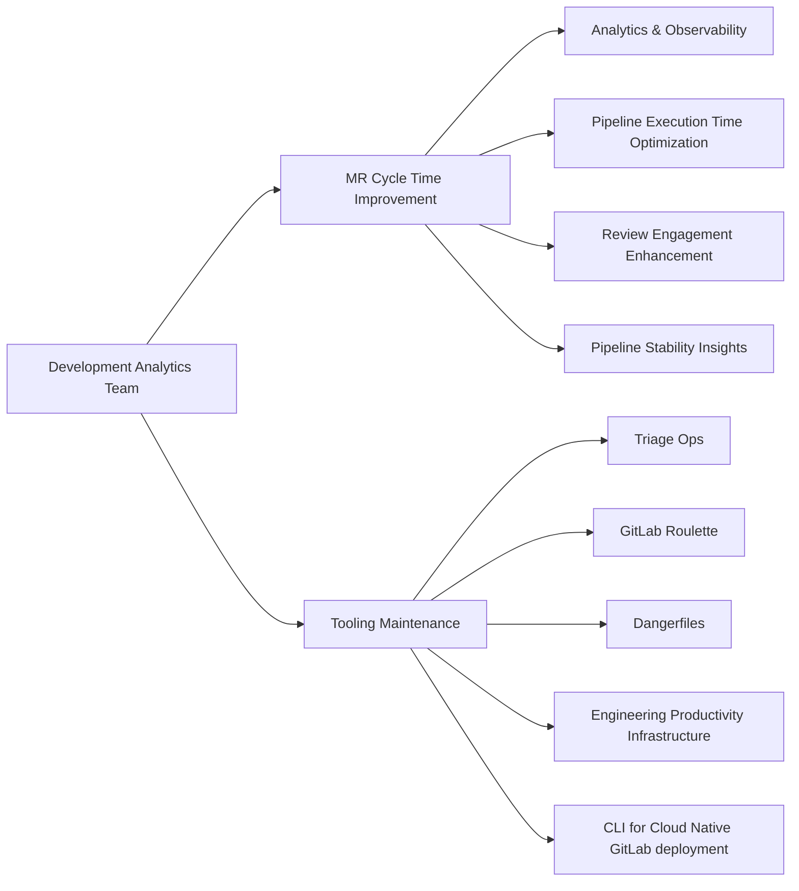

## 共通リンク

| **カテゴリ**            | **ハンドル**                                                                                                                 |
|-------------------------|----------------------------------------------------------------------------------------------------------------------------|
| **GitLab グループハンドル** | [`@gl-dx/development-analytics`](https://gitlab.com/gl-dx/development-analytics)                                           |
| **Slack チャンネル**       | [`#g_development_analytics`](https://gitlab.enterprise.slack.com/archives/C064M4D2V37)                                     |
| **Slack ハンドル**        | `@dx-development-analytics`                                                                                                |
| **チームボード**         | [`Team Issues Board`](https://gitlab.com/groups/gitlab-org/-/boards/8966549?label_name%5B%5D=group::development%20analytics), [`Team Epics Board`](https://gitlab.com/groups/gitlab-org/-/epic_boards/2068920?label_name[]=group%3A%3Adevelopment%20analytics), [`Support Requests`](https://gitlab.com/groups/gitlab-org/-/boards/9098093?label_name%5B%5D=development-analytics::support-request)                                           |
| **Issue トラッカー**       | [`tracker`](https://gitlab.com/groups/gitlab-org/quality/dx/analytics/-/issues)                                            |
| **チームリポジトリ** | [development-analytics](https://gitlab.com/gitlab-org/quality/analytics)                                                   |

## ビジョン

すべての GitLab プロジェクトは、カスタムの計測を一切行わずに、開発の健全性スコアをすぐに取得できます。SDLC の摩擦、潜在的なボトルネック、実行可能なシグナルをリアルタイムかつセルフサービスで可視化します。GitLab 自身のエンジニアリングで実証したパターンは、GitLab を利用するすべてのチームが利用できる標準テレメトリになります。

## ミッション

SDLC 全体の開発健全性シグナルを明らかにし、そのシグナルを所有するチームに見える形で提供します。私たちは開発健全性シグナルにおける Customer Zero です。まず GitLab 自身のエンジニアリングでパターンを実証し、その後すべての顧客に拡張します。

## 戦略的な柱

### 開発健全性シグナルプラットフォーム

GitLab エンジニアリング向けの SDLC シグナルレイヤー全体を担います。開発健全性データを製品に取り込み、ユーザー、AI エージェント、ダッシュボードで利用できるようにします。エンジニアから VP レベルまでのスコアカードを提供します。

### Customer Zero から製品への展開

まず GitLab 自身のプロジェクトでデータモデル、シグナル品質、UX パターンを検証し、その後すべての顧客向けの製品に取り込みます。私たちは製品機能ではなく、リファレンス実装とデータパイプラインを担います。長期的な成果は、すべての GitLab プロジェクトがプロジェクトごとの SDLC テレメトリをすぐに取得できることです。

### ツールの維持管理

Triage Ops、Roulette、Dangerfiles、EP Infrastructure など、GitLab エンジニアリングが依存するツールを維持します。カスタムツールを並行して運用するのではなく、段階的に製品へ移行します。現在人間またはスクリプトが行っている L1 自動化作業は、AI エージェントが引き継ぎます。

## FY27 ロードマップ

### 現在 FY27-Q2

チームが現在取り組んでいる内容の最新の状況については、[Q2 計画 Issue](https://gitlab.com/gitlab-org/quality/analytics/team/-/work_items/573)を参照してください。

## FY27 Q3/Q4 ロードマップ

社内で何を構築する場合でも、私たちは製品を念頭に置いて構築します。Customer Zero とは、まず GitLab 内でシグナルパターンを検証し、その後、すべての GitLab 顧客が恩恵を受けられるよう製品に取り込むことです。

### Q3

| イニシアチブ | キャパシティ | エンジニア |
| :---- | :---- | :---- |
| [CI 健全性インシデント — 運用、フィードバック、改善](https://gitlab.com/groups/gitlab-org/quality/analytics/-/work_items/47) | 主担当（チーム全体） | 全 3 名 |
| [Theseus — モジュラー機能の CI/CD とテストの可観測性](https://gitlab.com/groups/gitlab-org/quality/analytics/-/work_items/49) | ベストエフォート | 1〜2 名 |
| [テスト健全性インデックス](https://gitlab.com/groups/gitlab-org/quality/analytics/-/work_items/46) | ベストエフォート、Q3 で完了 | 1 名 |

#### CI 健全性インシデント — 運用、フィードバック、改善

CI 健全性インシデントの検出はすでに稼働しており、旧 master-broken システムと比べてノイズを約 91% 削減しています。エンジニアと EM が master-broken インシデントの影響を定量化し、解決までの時間を短縮し、防止のためのガードレールを追加できるよう支援できる、よい位置にいます。

製品面での直接的な機会もあります。GitLab は[製品内のフレーキーテスト検出](https://gitlab.com/gitlab-org/gitlab/-/work_items/606069)を試作しており、DA が持つ過去のテストシグナル、つまり統計的なフレーキネスの定義、失敗シグネチャ、影響範囲のデータは、この製品イニシアチブを堅牢にするためにまさに必要なものです。

*エピック: [CI 健全性インシデント — 運用、フィードバック、改善](https://gitlab.com/groups/gitlab-org/quality/analytics/-/work_items/47)*

- **Q3:** 3 名のエンジニア全員がここに注力します。シグナル品質の改善（トレースなしのジョブ/パイプライン失敗の検出）、master-broken 廃止監査、オーナーシップ/対応プロセスを進めます。
- **Q4:** レガシー master-broken インシデントの扱い（廃止、リダイレクト、または統合）を決め、ハンドブック/ドキュメントを適宜更新します。
- **その後:** 高度な自動化（AI 支援による MR の特定、自動作成されるリバート MR）。インシデントから学び、再発を防ぎます。

---

#### Theseus — モジュラー機能の CI/CD とテストの可観測性 *(ベストエフォート)*

Theseus は GitLab の将来の開発プラットフォームです。新しい Modular Component はすべてこれを基盤とします。DA は早期に関与し、モジュラー機能にとって優れた可観測性とは何かを確立する機会があります。DA では、Theseus ベースのコンポーネントのエンドツーエンド CI/CD とテストシグナルフローをまだ誰も検証していません。まず試験プロジェクトで実施し、Artifact Registry で検証すれば、将来のすべてのモジュラーチームに従うべき舗装済みの道筋を提供できます。

*エピック: [Theseus のテストと CI の可観測性](https://gitlab.com/groups/gitlab-org/quality/analytics/-/work_items/49)*

- **Q3（ベストエフォート）:** 小規模なプロジェクト（Ruby/Go/Jest テストを含む）を計測し、テスト結果、テスト時間、ジョブ時間、パイプライン時間、失敗カテゴリ、失敗シグネチャを私たちの ClickHouse に送信します。既存のダッシュボードを検証します。同じアプローチを Artifact Registry に適用します。ギャップは Issue として登録します。
- **Q4（主担当）:** 全力で注力します。SDLC ライフサイクルに沿ってより多くのメトリクスを追加し、対象をより多くの Modular Component に拡大し、エピックを洗練させます。
- **その後:** 私たちが定義する可観測性標準が、新しい GitLab プロジェクトの標準になります。すべてのプロジェクトが、カスタム計測作業なしで SDLC 全体の CI/CD とテストメトリクスを出力します。

---

#### テスト健全性インデックス *(ベストエフォート、Q3 で完了)*

GitLab のテストスイートには、隔離テスト、フレーキーテスト、低速テストという 3 つの柱にまたがる、実在し増加し続ける負債があります。現在、これらをグループごとの健全性として集約して表示するものはありません。フェーズ 1（可視化）はほぼ完了し、フェーズ 2（キャリブレーション）はすでに進行中です。

*エピック: [テスト健全性インデックスの導入](https://gitlab.com/groups/gitlab-org/quality/analytics/-/work_items/46)*

- **Q3（ベストエフォート）:** フェーズ 1（可視化）とフェーズ 2（キャリブレーション）を完了します。テスト健全性インデックスのダッシュボード、グループごとの詳細生成機能、Investigation バケットのワークフロー、triage-ops 統合、調整済みの RAG バンドしきい値を完了します。
- **その後:** フェーズ 3（アラート）とフェーズ 4（強制）は、エンジニアリングリーダーシップの支持を条件とします。

---

### Q4

| イニシアチブ | キャパシティ | エンジニア |
| :---- | :---- | :---- |
| [Theseus — モジュラー機能の CI/CD とテストの可観測性](https://gitlab.com/groups/gitlab-org/quality/analytics/-/work_items/49) | 主担当 | 1〜2 名 |
| [Orbit 統合 — CI シグナルをナレッジグラフへ取り込む](https://gitlab.com/groups/gitlab-org/quality/analytics/-/work_items/52) | 調査スパイク | 1 名 |
| [フレーキーテスト検出を Jest、Go、Rust に拡大する](https://gitlab.com/groups/gitlab-org/quality/analytics/-/work_items/53) | 調査スパイク | 1 名 |
| [CI 健全性インシデント — 運用、フィードバック、改善](https://gitlab.com/groups/gitlab-org/quality/analytics/-/work_items/47) | 保守 | 必要に応じて |

#### Orbit 統合 — CI シグナルをナレッジグラフへ取り込む

現在、エージェントは CI ジョブまでの経路をたどれますが、そのジョブの内部で何が起きているかは見えません。DA の ClickHouse データ（フレーキーテスト、失敗カテゴリ、CI 健全性インシデント、失敗シグネチャ、コードカバレッジ）があれば、エージェントはさらに 1 段深く掘り下げられ、CI 健全性に関する質問への回答能力を大きく向上できます。ハッカソンの試作（[リポジトリ](https://gitlab.com/gitlab-ai-hackathon/transcend/8043245)、[記事](https://dev.to/arek_h/finding-the-root-cause-of-production-incidents-in-seconds-with-gitlab-orbit-ai-244i)）では、すでに Orbit を通じたインシデントから MR へのトラバーサルパターンが実証されています。DA の CI シグナルレイヤーが欠けている要素です。

*エピック: [Orbit 統合 — CI シグナルをナレッジグラフへ取り込む](https://gitlab.com/groups/gitlab-org/quality/analytics/-/work_items/52)*

- **Q4:** 調査スパイクを実施します。チームの ClickHouse から本番 ClickHouse にデータを移すには何が必要でしょうか。Orbit 統合には技術的に何が必要でしょうか。GitLab 社内向けと製品向けではどのような形になるでしょうか。可能な箇所から移行と統合を開始します。
- **その後:** DA の CI シグナルは Orbit の第一級データソースとなり、GitLab の顧客が利用できるようになります。

---

#### フレーキーテスト検出を Jest、Go、Rust に拡大する

現在、フレーキーテスト検出は RSpec でしか機能しません。Jest、Go、Rust のテストには、フレーキネスが同じように現実の問題であるにもかかわらず、参加する方法がありません。この拡大は、GitLab が構築している製品内フレーキーテスト検出イニシアチブを直接支援します。

*エピック: [フレーキーテスト検出を Jest、Go、Rust に拡大する](https://gitlab.com/groups/gitlab-org/quality/analytics/-/work_items/53)*

- **Q4:** Jest と Go の実際の再試行確認を組み込みます。Orbit 自身のテストスイートを含む Rust エクスポーターを構築します。既存のダッシュボードやアラートに大量に流入しないよう、各フレームワークを明示的な許可リストの背後に置きます。
- **その後:** DA がサポートするすべての主要フレームワークで、フレーキーシグナルの同等性を実現します。

---

## 将来の作業 / 候補

*このサイクルではコミットしません。レビュー担当者が価値を確認し、必要に応じて優先順位を変更できるよう掲載しています。*

### 体系的な本番インシデントの根本原因分析

テストカバレッジ、隔離状態、CI シグナルを本番インシデントに結び付け、「なぜパイプラインはグリーンだったのか？」に答えます。ハッカソンの試作（[リポジトリ](https://gitlab.com/gitlab-ai-hackathon/transcend/8043245)、[記事](https://dev.to/arek_h/finding-the-root-cause-of-production-incidents-in-seconds-with-gitlab-orbit-ai-244i)）では、すでに Orbit を通じたインシデントから MR へのトラバーサルパターンが実証されています。DA の CI シグナルレイヤーが、体系的かつ再現可能な根本原因分析に欠けている要素です。

*エピック: [体系的なインシデント根本原因分析](https://gitlab.com/groups/gitlab-org/quality/analytics/-/work_items/39)*

---

### Development Analytics 向け Tier-1 エージェント

DA で Tier-1 エージェントを責任を持って運用するための設計図を調査します。実行場所、ガードレール、良い/悪い結果の定義を扱います。DA は、他の DevEx チームや社内チームが追随できるリファレンス実装になります。現在の GitLab には、このための共通パターンがありません。

*エピック: [Development Analytics 向け Tier-1 エージェント](https://gitlab.com/groups/gitlab-org/quality/analytics/-/work_items/51)*

---

### ClickHouse のエンジニアリングデータカバレッジを拡大する

より多くの欠けているデータソースを ClickHouse に追加します。ファクトリープロファイリング、MR レビューメタデータ、CI/CD コストテレメトリが対象です。データギャップを 1 つ埋めるたびに、検証し、製品チームに提供し、最終的に顧客へ届けられるシグナルカテゴリが増えます。

*エピック: [ClickHouse のエンジニアリングデータカバレッジを拡大する](https://gitlab.com/groups/gitlab-org/quality/analytics/-/work_items/54)*

候補のサブプロジェクト:

- **MR プロセスの可視性** — レビュアールーレットプールの規模、承認リセットの頻度、レビュータイムラインを表示します。製品がすでに解決していないことを確認するため、まず簡単な調査 Issue が必要です。[エピック](https://gitlab.com/groups/gitlab-org/quality/analytics/-/work_items/45)
- **ファクトリーが多用される RSpec テストの可観測性、ガードレール、修復** — CI におけるファクトリーの時間コスト（以前は 1 つのファクトリーに対して実行ごとに約 11.7 CI 時間）をプロファイリングし、その後 RuboCop のガードレールと修復を追加します。[エピック](https://gitlab.com/groups/gitlab-org/quality/-/work_items/403)
- **ClickHouse と Grafana で CI/CD パイプラインコストを追跡する** — プロジェクト、ジョブ種別、リソースカテゴリ別のコスト内訳です。[エピック](https://gitlab.com/groups/gitlab-org/quality/analytics/-/work_items/34)

## チームメンバー



## コア責任範囲



## ダッシュボード

Development Analytics のダッシュボードは [Developer Experience ダッシュボードページ](/handbook/engineering/infrastructure-platforms/developer-experience/dashboards)に掲載されています。

## メトリクス

Development Analytics グループはエンジニアリングの生産性、品質、効率性を測定するメトリクスを開発・維持しています。以下の各メトリクスは、定義、方法論、現在のステータス、既知の制限とともに文書化されています。

### 欠陥脱出率

#### 現在のステータス

- **成熟度**: アルファ版
- **更新**: 毎月（E2E 環境の手動データ収集）
- **ダッシュボード**: [欠陥脱出率（Snowflake）](https://app.snowflake.com/ys68254/gitlab/#/dx-defect-escape-rate-dM9ZOyVDJ)

#### 何を、なぜ

欠陥脱出率は、ソフトウェア開発ライフサイクル全体で自動パイプラインとテストによって検出された欠陥と比較して、本番に漏れた欠陥の割合を測定します。このメトリクスはテスト戦略とシフトレフト実践の有効性を示します。低い率は、欠陥が顧客に届くのを防ぐ強固な品質ゲートを示しています。

このメトリクスは製品グループによるドリルダウンをサポートし、グループが自身の欠陥検出の有効性を追跡できるようにします。

#### 仕組み

「欠陥」を 2 つの方法で測定しています:

- **漏れた欠陥**: 本番バグ（`type::bug` ラベルが付いた Issue）
- **検出された欠陥**: 問題のあるコードが本番に届くのを防いだ失敗したパイプライン/テスト

この計算式は本番に届いた欠陥の割合を計算します:

```plaintext
Defect Escape Rate = Defects Escaped / (Defects Escaped + Defects Caught)
```

**「漏れた欠陥」としてカウントするもの:**

- `gitlab-org/gitlab` プロジェクトの `type::bug` Issue（カノニカルスコープ）
- または `gitlab-org` と `gitlab-com` グループの `type::bug` Issue（広いスコープ）

**「検出された欠陥」としてカウントするもの:**

失敗したパイプラインを検出された欠陥のプロキシとして使用し、パイプラインの失敗が問題のあるコードのさらなる進行を防いだと仮定します。

以下の SDLC ステージにわたってカウントします:

1. **MR パイプライン** - `gitlab-org/gitlab` と `gitlab-org/gitlab-foss` の失敗したパイプライン
2. **マスターパイプライン** - マスターブランチでの失敗したパイプライン
3. **デプロイ E2E テスト** - デプロイ環境に対して実行される失敗した E2E テストパイプライン:
   - Staging Canary, Staging Ref, Production Canary, Staging, Production, Preprod, Release (ops.gitlab.net から)
   - Dedicated UAT (gitlab.com から)

注意: E2E メトリクスは各環境を検証するために失敗したテストパイプラインを追跡しており、デプロイパイプライン自体からの失敗ではありません。これらは顧客への影響前の品質ゲートとして機能します。

`gitlab-foss` の場合: 直接的な失敗のみ（push、schedule、merge_request_event ソース）がカウントされます。親 `gitlab-org/gitlab` パイプラインですでに取得された失敗を二重カウントしないよう、ダウンストリームパイプライン（ソース = `pipeline` または `parent_pipeline`）は除外されます。

**測定精度に関する重要なコンテキスト:**

現在の実装は「失敗したパイプライン」を「検出された欠陥」のプロキシとして使用していますが、これには機能的な欠陥を示すテスト失敗だけでなく、すべてのパイプライン失敗（インフラの問題、タイムアウト、リンティングエラーなど）が含まれます。この広い定義により、欠陥脱出率の値は約 5〜10% になります。

テスト失敗のみ（機能的な欠陥）を測定する将来のイテレーションでは、欠陥脱出率の値は約 20〜40% になる可能性があります。この増加は、多くのパイプライン失敗が顧客に影響するコードの欠陥ではなく非機能的な問題（インフラ、設定）を検出するという、より正確な測定を反映しています。より高い割合は品質の低下を示すのではなく、機能的な欠陥を検出するテストの有効性のより正確な測定を示しています。

**グループレベルの欠陥脱出率:**

欠陥脱出率は MR の `group::` ラベルを使用して製品グループでフィルタリングできます。基本的な仮定は、特定のグループのエンジニアが主に自分たちが担当するコードの欠陥を生成するということです — テストスイートが検出すべき欠陥です。

具体的には:

- Issue の `group::` ラベルを介してグループに割り当てられたバグ
- マージリクエストの `group::` ラベルを介してグループに割り当てられた MR パイプライン失敗
- MR パイプライン失敗のみが帰属可能（マスターパイプラインや E2E テストパイプラインには `group::` ラベルがない）

MR と Issue には常にグループラベルが設定されているとは限りません（例: 2025 年 10〜12 月の MR の 13% と Issue の 6% にはグループラベルがなかった）。

将来のイテレーションでは、MR の著者からオーナーシップを推測するのではなく、どのテストが失敗したかを直接測定するために、テストオーナーシップ（`feature_category`）を使用したグループ帰属が理想的です。これにはバックエンドテストだけでなく、すべてのテストフレームワークにグループオーナーシップデータを追加する必要があります。

#### 既知の制限

**データ収集:**

- E2E パイプライン失敗は ops.gitlab.net API 経由で手動で取得（自動化されていない）
- ops.gitlab.net パイプラインデータは ClickHouse または現在の Snowflake で利用不可（レガシーデータは 2025 年 8 月に停止）
- ClickHouse はこのメトリクスの優先プラットフォームだが、現在は必要なデータのほとんどが欠如（Issue、マージリクエスト、E2E パイプライン）。2026 年 Q1 にこのデータを追加予定。

**グローバル欠陥脱出率の制限:**

- 現在のバージョンは機能的なテスト失敗だけでなく、すべてのパイプライン失敗（インフラ、タイムアウト、リンティング）をカウント
  - データが利用可能になったら、ClickHouse でのより正確なテストのみの測定が理想的

**グループ帰属の制限:**

- グループレベルの欠陥脱出率は MR パイプライン失敗のみを含む（マスター/E2E 失敗はそれらのパイプラインにグループラベルがないため帰属できない）
- グループの欠陥脱出率は、分母が小さいため（全 SDLC ステージではなく MR のみ）グローバルの欠陥脱出率よりも高くなる
- MR ラベルの帰属は、エンジニアが主に自身のコード領域に欠陥を作成すると仮定しているが、クロスファンクショナルな作業には適用されない場合がある
- MR と Issue には常にグループラベルがあるとは限らない

**メトリクスの変動性:**

欠陥脱出率は本来可変であり、実際の品質改善とは無関係な要因に影響される可能性があります:

- **マスターブロークンインシデント**は一時的に「検出された欠陥」を増加させ（マスター失敗が急増）、欠陥脱出率を人為的に低下させる
- **インフラの問題**によるパイプライン失敗は分母を増加させ、テストの改善なしに欠陥脱出率を低下させる
- **フレーキーテスト**による偽の失敗は「検出された欠陥」を増加させ、改善の偽の印象を作り出す
- **CI キャパシティの制約**はパイプライン実行を削減し、欠陥を隠す可能性がある

これらの交絡因子をフィルタリングできるまで、月次の欠陥脱出率の変化は慎重に解釈する必要があります。複数月にわたる継続的なトレンドは単月の変動よりも意味があります。

#### 計画された改善

**2026 年 Q1:**

- ops.gitlab.net から ClickHouse への E2E パイプラインデータ取り込みの自動化
- 完全な自動化のために Issue とマージリクエストデータを ClickHouse に追加
- ClickHouse でのダッシュボードの構築
- RSpec または Jest テスト失敗によるパイプラインのみをカウントするよう「検出された欠陥」を改善（注: フレーキーテストやマスターブロークンインシデントはまだ含まれる）

**将来:**

- よりクリーンな測定のためにインフラの失敗、フレーキーテスト、マスターブロークンインシデントをフィルタリング
- どのテストが失敗したかに基づいた正確なグループ帰属を実現するためにテストオーナーシップデータ（`feature_category`）を拡張

## 働き方

### 哲学

- GitLab のオールリモート、タイムゾーン分散型の構造に沿って、非同期コミュニケーションとハンドブックファーストのアプローチを優先しています。
- 生産的で中断されない作業に焦点を当てた [Maker's Schedule](https://www.paulgraham.com/makersschedule.html) を重視しています。
- 最も重要な定期ミーティングは火曜日と木曜日に予定されています。
- 集中した学習とイノベーションのために週 3〜4 時間を確保しています。この保護された時間により、チームが新興技術を探索し、概念実証を実施し、業界のトレンドについて常に把握できます。この時間帯のミーティングリクエストには事前通知が必要です。
- すべてのミーティングのアジェンダは[チーム共有ドライブ](https://drive.google.com/drive/folders/1uZg0J5hYsOUu3WMNR-PoAcmrhhmDxxoA?usp=drive_link)およびミーティング招待にあります。

### ミーティング/イベント

| イベント                        | 頻度                                     | アジェンダ                                                                                                                                                          |
|------------------------------|---------------------------------------------|-----------------------------------------------------------------------------------------------------------------------------------------------------------------|
| 週末進捗アップデート  | 週 1 回（水曜日）                     | Issue とエピックの週次アップデートにステータス、進捗、ETA、サポートが必要な領域をまとめます。自動ステータスチェックのために [epic-issue-summaries ボット](https://gitlab.com/gitlab-com/gl-infra/epic-issue-summaries)を活用しています。 |
| チームミーティング                 | 月 2 回、火曜日 16:00 UTC        | [アジェンダ](https://docs.google.com/document/d/1gtghZCYeg42cMbQ8mWnjBcsu4maMO4OFA0xcQ8MfRHE/edit?usp=sharing)                                                      |
| 月次ソーシャルタイム          | 月 1 回、最終木曜日 16:00 UTC        | アジェンダなし、楽しい集まりです。タイムゾーンの整合性に基づいていずれかのスロットを選択してください。[バーチャルチームビルディング](https://internal.gitlab.com/handbook/finance/expenses/#team-building)をお読みください。     |
| 四半期ビジネスレポート    | 四半期ごと                                   | [各ビジネス四半期のチームの成功、学び、イノベーション、改善機会に貢献します](https://gitlab.com/groups/gitlab-org/quality/quality-engineering/-/epics/61)。 |
| エンジニアリングマネージャーとの 1:1 | 週次                                      | 開発目標について話し合います（[1:1 ガイドライン](/handbook/leadership/1-1/)を参照）                                                                                |
| チームメンバーのコーヒーチャット   | 月 1〜2 回                          | チームメンバーが定期的につながるためのオプションのミーティング                                                                                                        |

### 年次ロードマップ計画

- 各会計年度に、可視性と整合性を確保するためのロードマップを作成します。
- 通常 Q4 に、ステークホルダーから意見を収集するために集中的な 1 ヶ月間の作業を実施します。
- DRI は[ロードマップ準備作業テンプレート](https://gitlab.com/gitlab-org/quality/analytics/work-log/-/blob/main/templates/roadmap-pre-work-template.md?ref_type=heads)を使用してロードマップのドラフトを作成するリードを務めます。
- ロードマップが承認されたら、隔週のチームミーティングで、計画されたロードマップ作業の進捗を確認し、ブロッカーに対処し、フィードバックを収集します。

### イテレーション

年次ロードマップが定義されたら、月 2 回のイテレーションモデル内で [GitLab イテレーション](https://docs.gitlab.com/ee/user/group/iterations/)を使用して作業を構造化します。このアプローチにより、一貫した進捗追跡、明確な優先事項、および継続的な改善が確保されます。参考として、[現在のイテレーションボード](https://gitlab.com/groups/gitlab-org/-/boards/9114071?label_name%5B%5D=group::development%20analytics&iteration_id=Current)と[過去のイテレーション](https://gitlab.com/groups/gitlab-org/-/boards/9114585?label_name%5B%5D=group::development%20analytics)があります。チームとして以下を確保します:

1. 各 Issue が [Development Analytics イテレーション](https://gitlab.com/groups/gitlab-org/-/cadences/)に割り当てられています。
2. イテレーション内で作業されなかった Issue は自動的に次のイテレーションにロールオーバーされます。
3. 隔週のチームミーティングごとに、イテレーションボードをレビューし、バーンダウンチャートを使用してベロシティを追跡します。

### 内部ローテーションとサポートリクエスト

#### 内部ローテーション

サポートリクエストやその他のチームメンテナンスタスクのために[内部ローテーション](https://gitlab.com/gitlab-org/quality/analytics/internal-rotation#process)を使用しています。これにより、チームの他のエンジニアが計画された作業に集中できる時間が確保されます。

#### サポートリクエスト

- バグを発見したり、支援が必要な場合、または改善の機会を特定した場合は、`~"group::Development Analytics"` と `~"development-analytics::support-request"` ラベルを使用してサポートリクエストを提出してください。緊急の場合は、指定された Slack チャンネル - [`#g_development_analytics`](https://gitlab.enterprise.slack.com/archives/C064M4D2V37) にエスカレーションしてください。
- リクエストが最初に Slack 経由で来た場合は、リクエスト者または `group::Development Analytics` メンバーが適切なラベルで Issue を開いて、適切なトラッキングとトリアージを確保してください。
- チームは[サポートリクエストボード](https://gitlab.com/groups/gitlab-org/-/boards/9098093?label_name%5B%5D=development-analytics%3A%3Asupport-request)をレビューし、それに応じて優先順位を付けます。一般的に、チームはサポートタスクに週次時間の約 20% を確保していますが、現在の優先事項によって異なる場合があります。

### ツール/リポジトリのメンテナンス

- チームはグループが所有する各リポジトリに作成されたすべての新しい Issue を自動的に監視しているわけではありません — 可視性を確保するためにグループラベルを使用するか、Slack でエスカレーションしてください。
- セルフサービスのマージリクエストを強く推奨します。すでに修正や改善を特定している場合は、より迅速なターンアラウンドのために MR を開くことを推奨します。`~group::development analytics` のメンテナーが適宜レビューしてマージします。
- 機能作業とバグ修正はチームの現在の優先事項に従います。
- `~group::development analytics` が所有するリポジトリのバージョン管理に関する慣習を参照してください:

| リポジトリ                             | リリースプロセス                                                                                 |
|----------------------------------------|-------------------------------------------------------------------------------------------------|
| **gitlab-roulette**                    | バージョン更新は設定されたスケジュールでは行われません。バージョン更新 MR が提出されると随時リリースが行えます。 |
| **gitlab-dangerfiles**                 | 上記と同じ — 定期的なスケジュールはなく、バージョン更新 MR によってリリースがトリガーされます。                     |
| **triage-ops**                         | デフォルトブランチに新しいコミットがマージされた後に新しいリリースが開始されます。                            |
| **engineering-productivity-infrastructure** | 依存関係更新 MR は Renovate ボットによって生成されます。                                            |

### 自動ラベルマイグレーション

ラベルマイグレーションの詳細については、[GitLab Duo Workflow でラベルマイグレーショントリアージポリシーを作成するためのハンドブックエントリ](https://handbook/engineering/infrastructure-platforms/developer-experience/development-analytics/create-triage-policy-with-gitlab-duo-workflow-guide)を参照してください。
