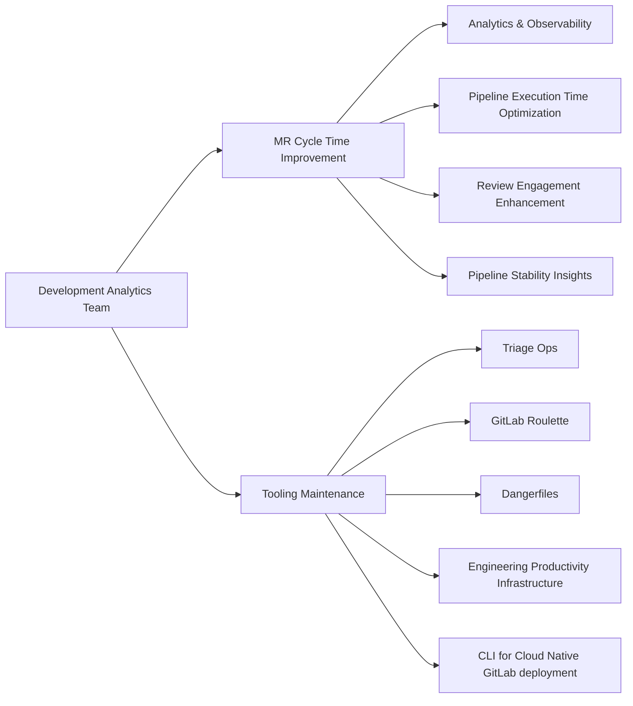

## 共通リンク

| **カテゴリ**            | **ハンドル**                                                                                                                 |
|-------------------------|----------------------------------------------------------------------------------------------------------------------------|
| **GitLab グループハンドル** | [`@gl-dx/development-analytics`](https://gitlab.com/gl-dx/development-analytics)                                           |
| **Slack チャンネル**       | [`#g_development_analytics`](https://gitlab.enterprise.slack.com/archives/C064M4D2V37)                                     |
| **Slack ハンドル**        | `@dx-development-analytics`                                                                                                |
| **チームボード**         | [`Team Issues Board`](https://gitlab.com/groups/gitlab-org/-/boards/8966549?label_name%5B%5D=group::development%20analytics), [`Team Epics Board`](https://gitlab.com/groups/gitlab-org/-/epic_boards/2068920?label_name[]=group%3A%3Adevelopment%20analytics), [`Support Requests`](https://gitlab.com/groups/gitlab-org/-/boards/9098093?label_name%5B%5D=development-analytics::support-request)                                           |
| **Issue トラッカー**       | [`tracker`](https://gitlab.com/groups/gitlab-org/quality/dx/analytics/-/issues)                                            |
| **チームリポジトリ** | [development-analytics](https://gitlab.com/gitlab-org/quality/analytics)                                                   |

## ミッション

私たちのミッションは、実用的なインサイトを提供することで開発者の効率を高め、品質、CI および関連するメトリクスでチームを支援し、当社のチームと顧客のためにソフトウェア開発ライフサイクルを測定可能なかたちで改善するスケーラブルなツールを構築することです。

## ビジョン

Infrastructure Platforms 部門の KPI の確立と実施を支援します。チームはメトリクスとレポートを統合し、エンジニアから VP+ レベルまで測定可能な DevEx と品質情報を提供します。

- すべてのテストスイート、ジョブ、パイプラインからのデータ可視化を可能にします。
- ダッシュボードとレポートを作成・統合し、Engineering チームが品質を評価・改善できるようにします (例: テストカバレッジ、テスト実行時間、フレーキネス、バグ数)。
- DevEx セクションと Platforms に対して、テストスイートの有効性、エンジニアと顧客によって特定されたバグ、インシデント、その他の本番データに関する情報を提供し、エンジニアリングチームを導きます。
- 私たちが構築するものから顧客も恩恵を受けられるよう、GitLab 製品そのものにソリューションを組み込むことを目指します。

## FY27 ロードマップ

### Now FY27-Q2

チームが現在取り組んでいる内容の最新のビューについては、Q2 Planning issue を参照してください: https://gitlab.com/gitlab-org/quality/analytics/team/-/work_items/573

### Next FY27-Q3/Q4

**フォーカス: データ/ダッシュボードの利用をスケールアウトする。パイプラインテレメトリを改善し、Engineering チームが CI パフォーマンスを改善できるようにする製品機能を構築する** (FY27-Q1 から FY27-Q2)

- Factory を多用する RSpec テストの可観測性、ガードレール、是正
- MR プロセスの可視性: reviewer roulette、approval reset、レビュータイムライン
- スケーラブルな CI ジョブテレメトリレポートの構築支援 (runner 経由で製品へ)
- Data Insight Platform のダッシュボード機能のドッグフーディング (準備ができていれば)
- Triage Ops のメンテナンスと改善 (例: Triage Ops を Runway へ移行)

### Later FY28 以降

**フォーカス: カスタムツールから製品機能へ移行する**

- チームが所有するカスタムツールのうち、製品に組み込むものに優先順位を付ける。

## チームメンバー



## 主要な責任



## ダッシュボード

Development Analytics のダッシュボードは [Developer Experience Dashboards ページ](/handbook/engineering/infrastructure-platforms/developer-experience/dashboards)に一覧されています。

## メトリクス

Development Analytics グループは、エンジニアリングの生産性、品質、効率を測定するためのメトリクスを開発・維持しています。以下の各メトリクスは、その定義、方法論、現在のステータス、既知の制限とともに文書化されています。

### Defect Escape Rate

#### 現在のステータス

- **成熟度**: Alpha
- **更新頻度**: 毎月 (E2E 環境については手動でのデータ収集)
- **ダッシュボード**: [Defect Escape Rate (Snowflake)](https://app.snowflake.com/ys68254/gitlab/#/dx-defect-escape-rate-dM9ZOyVDJ)

#### 何を・なぜ

Defect Escape Rate は、ソフトウェア開発ライフサイクル全体で自動化されたパイプラインやテストによって捕捉された欠陥と比較して、本番環境に漏れ出た欠陥の割合を測定します。このメトリクスは、私たちのテスト戦略とシフトレフトの実践の有効性を示します。レートが低いほど、欠陥が顧客に届くのを防ぐ品質ゲートが強固であることを示します。

このメトリクスはプロダクトグループ別のドリルダウンをサポートしており、グループが自身の欠陥検出の有効性を追跡できるようにします。

#### 仕組み

私たちは「欠陥」を 2 つの方法で測定します。

- **漏れ出た欠陥**: 本番環境のバグ (`type::bug` ラベルが付いた issue)
- **捕捉された欠陥**: 問題のあるコードが本番環境に到達するのを防いだ、失敗したパイプライン/テスト

この計算式は、欠陥全体のうち何パーセントが本番環境に到達したかを算出します。

```plaintext
Defect Escape Rate = Defects Escaped / (Defects Escaped + Defects Caught)
```

**「漏れ出た欠陥」としてカウントするもの:**

- `gitlab-org/gitlab` プロジェクトの `type::bug` issue (canonical スコープ)
- または `gitlab-org` および `gitlab-com` グループの `type::bug` issue (broad スコープ)

**「捕捉された欠陥」としてカウントするもの:**

私たちは、捕捉された欠陥の代理指標として失敗したパイプラインを使用し、パイプラインの失敗が問題のあるコードのそれ以上の進行を防いだと仮定します。

これらの SDLC ステージ全体でカウントされます。

1. **MR パイプライン** - `gitlab-org/gitlab` および `gitlab-org/gitlab-foss` の失敗したパイプライン
2. **Master パイプライン** - master ブランチの失敗したパイプライン
3. **デプロイメント E2E テスト** - デプロイメント環境に対して実行される失敗した E2E テストパイプライン:
   - Staging Canary、Staging Ref、Production Canary、Staging、Production、Preprod、Release (ops.gitlab.net から)
   - Dedicated UAT (gitlab.com から)

注: E2E メトリクスは、デプロイメントパイプライン自体の失敗ではなく、各環境を検証する失敗したテストパイプラインを追跡します。これらは顧客への影響が出る前の品質ゲートとして機能します。

`gitlab-foss` については: 直接の失敗 (push、schedule、merge_request_event ソース) のみがカウントされます。下流パイプライン (source = `pipeline` または `parent_pipeline`) は、親の `gitlab-org/gitlab` パイプラインですでに捕捉された失敗の二重カウントを避けるために除外されます。

**測定精度に関する重要な背景:**

現在の実装では「失敗したパイプライン」を「捕捉された欠陥」の代理指標として使用しており、これには機能的欠陥を示すテスト失敗だけでなく、すべてのパイプライン失敗 (インフラの問題、タイムアウト、linting エラーなど) が含まれます。この広い定義により、Defect Escape Rate の値は 5 〜 10% 程度になります。

テスト失敗 (機能的欠陥) のみを測定する将来のイテレーションでは、Defect Escape Rate の値はおそらく 20 〜 40% 程度になります。この増加は、多くのパイプライン失敗が顧客に影響を与えるコード欠陥ではなく、機能以外の問題 (インフラ、設定) を捕捉していることを反映しています。この割合の上昇は品質が悪化していることを示すものではなく、機能的欠陥を捕捉するテストの有効性のより精密な測定を示すものです。

**グループレベルの Defect Escape Rate:**

Defect Escape Rate は、MR の `group::` ラベルを使ってプロダクトグループ別にフィルタリングできます。背後にある前提は、あるグループのエンジニアは主に自分たちが担当するコードで欠陥を生み出す、というものです — それらの欠陥はそのグループのテストスイートが捕捉すべきものです。

具体的には:

- issue の `group::` ラベルによってグループに割り当てられたバグ
- merge request の `group::` ラベルによってグループに割り当てられた MR パイプラインの失敗
- 帰属できるのは MR パイプラインの失敗のみです (Master パイプラインや E2E テストパイプラインには `group::` ラベルがありません)

MR と issue には必ずしもグループラベルが設定されているとは限りません (例: 2025 年 10 〜 12 月の MR の 13%、issue の 6% にグループラベルがありませんでした)。

将来のイテレーションでは、MR の作者からオーナーシップを推測するのではなく、どのテストが失敗したかを直接測定できるよう、帰属にテストのオーナーシップ (`feature_category`) を使用するのが理想的です。これには、バックエンドのテストだけでなく、すべてのテストフレームワークにグループのオーナーシップデータを追加する必要があります。

#### 既知の制限

**データ収集:**

- E2E パイプラインの失敗は ops.gitlab.net API 経由で手動で取得されます (自動化されていません)
- ops.gitlab.net のパイプラインデータは ClickHouse や現在の Snowflake では利用できません (レガシーデータは 2025 年 8 月に停止)
- ClickHouse はこのメトリクスにとって私たちの選定プラットフォームですが、現在必要なデータの大半 (issue、merge request、E2E パイプライン) を欠いています。このデータは 2026 年 Q1 に追加する予定です。

**グローバル Defect Escape Rate の制限:**

- 現在のバージョンは、機能的テストの失敗だけでなく、すべてのパイプライン失敗 (インフラ、タイムアウト、linting) をカウントします
  - より精密なテストのみの測定は、データが利用可能になり次第、ClickHouse で実装するのが理想的です

**グループ帰属の制限:**

- グループレベルの Defect Escape Rate には MR パイプラインの失敗のみが含まれます (Master/E2E の失敗は、それらのパイプラインにグループラベルがないため帰属できません)
- グループの Defect Escape Rate の割合は、分母が小さいため (全 SDLC ステージではなく MR のみ)、グローバルな Defect Escape Rate よりも高くなります
- MR ラベルによる帰属は、エンジニアが主に自分のコード領域で欠陥を生み出すと仮定しています — クロスファンクショナルな作業では当てはまらない場合があります
- MR と issue には必ずしもグループラベルがあるとは限りません

**メトリクスの変動性:**

Defect Escape Rate は本質的に変動しやすく、実際の品質改善とは無関係な要因の影響を受ける可能性があります。

- **Master-broken インシデント**は一時的に「捕捉された欠陥」を膨らませ (master の失敗が急増)、Defect Escape Rate を人為的に低下させます
- **インフラの問題**によるパイプライン失敗は分母を膨らませ、よりよいテストを反映することなく Defect Escape Rate を低下させます
- **フレーキーテスト**による偽の失敗は「捕捉された欠陥」を膨らませ、改善の見せかけを作り出します
- **CI キャパシティの制約**はパイプライン実行を減らし、欠陥を覆い隠す可能性があります

これらの交絡要因をフィルタリングできるようになるまで、月ごとの Defect Escape Rate の変化は慎重に解釈すべきです。複数月にわたる持続的なトレンドの方が、単月の変動よりも意味があります。

#### 計画されている改善

**2026 年 Q1:**

- ops.gitlab.net から ClickHouse への E2E パイプラインデータの取り込みを自動化する
- 完全な自動化のために issue と merge request のデータを ClickHouse に追加する
- ClickHouse でダッシュボードを構築する
- 「捕捉された欠陥」を、RSpec または Jest のテスト失敗が原因で失敗したパイプラインのみをカウントするように改良する (注: フレーキーテストと master-broken インシデントは依然として含まれます)

**将来:**

- よりクリーンな測定のために、インフラの失敗、フレーキーテスト、master-broken インシデントをフィルタリングして除外する
- どのテストが失敗したかに基づいて正確なグループ帰属ができるよう、テストのオーナーシップデータ (`feature_category`) を拡張する

## 私たちの働き方

### 哲学

- 私たちは、GitLab のオールリモートでタイムゾーン分散の構造に沿って、非同期コミュニケーションとハンドブックファーストのアプローチを優先します。
- 私たちは [Maker's Schedule](https://www.paulgraham.com/makersschedule.html) を重視し、生産的で中断のない作業に注力します。
- 最も重要な定例ミーティングのほとんどは火曜日と木曜日に予定されています。
- 私たちは集中的な学習とイノベーションのために週に 3 〜 4 時間を充てています。この保護された時間により、チームは新しいテクノロジーを探求し、概念実証を実施し、業界のトレンドに遅れずについていくことができます。これらの時間帯のミーティング依頼には事前の通知が必要です。
- すべてのミーティングアジェンダは、[チーム共有ドライブ](https://drive.google.com/drive/folders/1uZg0J5hYsOUu3WMNR-PoAcmrhhmDxxoA?usp=drive_link)とミーティングの招待状の両方で確認できます。

### ミーティング/イベント

| イベント                        | 頻度                                     | アジェンダ                                                                                                                                                          |
|------------------------------|---------------------------------------------|-----------------------------------------------------------------------------------------------------------------------------------------------------------------|
| 週末の進捗アップデート  | 週 1 回 (水曜日)                     | issue と Epic の週次アップデートで、ステータス、進捗、ETA、サポートが必要な領域を要約します。自動化されたステータスチェックのために [epic-issue-summaries bot](https://gitlab.com/gitlab-com/gl-infra/epic-issue-summaries) を活用しています |
| チームミーティング                 | 月 2 回、火曜日 4:00 pm UTC        | [アジェンダ](https://docs.google.com/document/d/1gtghZCYeg42cMbQ8mWnjBcsu4maMO4OFA0xcQ8MfRHE/edit?usp=sharing)                                                      |
| 月次ソーシャルタイム          | 毎月最終木曜日 4:00 pm UTC        | アジェンダなし、楽しい集まり。あなたのタイムゾーンに合った枠を 1 つ選んでください。[バーチャルチームビルディング](https://internal.gitlab.com/handbook/finance/expenses/#team-building)を読んでください     |
| 四半期ビジネスレポート    | 四半期ごと                                   | [各事業四半期のチームの成功、学び、イノベーション、改善機会](https://gitlab.com/groups/gitlab-org/quality/quality-engineering/-/epics/61)に貢献します |
| Engineering Manager との 1:1 | 毎週                                      | 開発目標について話し合います ([1:1 ガイドライン](/handbook/leadership/1-1/)を参照)                                                                                |
| チームメンバーのコーヒーチャット   | 月 1 〜 2 回                          | チームメンバーが定期的につながるための任意のミーティング                                                                                                        |

### 年次ロードマップ計画

- 各会計年度に、可視性と整合性を確保するためにロードマップを作成します。
- 私たちは、ステークホルダーからの意見を集めるために、1 か月にわたる集中的な取り組み (通常は Q4) を実施します。
- DRI が [ロードマップ準備作業テンプレート](https://gitlab.com/gitlab-org/quality/analytics/work-log/-/blob/main/templates/roadmap-pre-work-template.md?ref_type=heads)を使用してロードマップの起草を主導します。
- ロードマップが承認されると、隔週のチームミーティングで進捗をレビューし、ブロッカーに対処し、計画されたロードマップ作業についてのフィードバックを集めます。

### イテレーション

年次ロードマップが定義されると、私たちは月 2 回のイテレーションモデルの中で [GitLab Iterations](https://docs.gitlab.com/ee/user/group/iterations/) を使って作業を構造化します。このアプローチにより、一貫した進捗追跡、明確な優先順位、反復的な改善が確保されます。参考までに、私たちの[現在のイテレーションボード](https://gitlab.com/groups/gitlab-org/-/boards/9114071?label_name%5B%5D=group::development%20analytics&iteration_id=Current)と[過去のイテレーション](https://gitlab.com/groups/gitlab-org/-/boards/9114585?label_name%5B%5D=group::development%20analytics)を示します。チームとして、私たちは以下を確実にします。

1. 各 issue は [Development Analytics Iteration](https://gitlab.com/groups/gitlab-org/-/cadences/) に割り当てられます。
2. イテレーション内で取り組まれなかった issue は、自動的に次のイテレーションへ繰り越されます。
3. 月 2 回のチームミーティングごとに、イテレーションボードをレビューし、バーンダウンチャートを使ってベロシティを追跡します。

### 内部ローテーションとサポートリクエスト

#### 内部ローテーション

私たちはサポートリクエストやその他のチームメンテナンスタスクに [内部ローテーション](https://gitlab.com/gitlab-org/quality/analytics/internal-rotation#process)を使用しています。これにより、チームの他のエンジニアが計画された作業に取り組むための時間を確保できます。

#### サポートリクエスト

- バグを見つけたり、支援が必要だったり、改善の機会を特定したりした場合は、`~"group::Development Analytics"` と `~"development-analytics::support-request"` ラベルを使ってサポートリクエストを起票してください。issue が緊急の場合は、指定された Slack チャンネル - [`#g_development_analytics`](https://gitlab.enterprise.slack.com/archives/C064M4D2V37) にエスカレーションしてください。
- リクエストが最初に Slack を通じて来た場合は、適切な追跡とトリアージを確実にするために、リクエスト者または `group::Development Analytics` のメンバーが正しいラベルで issue を起票するべきです。
- チームは[サポートリクエストボード](https://gitlab.com/groups/gitlab-org/-/boards/9098093?label_name%5B%5D=development-analytics%3A%3Asupport-request)をレビューし、それに応じて優先順位を付けます。一般的に、チームは週の時間の約 20% をサポートタスクのために確保していますが、これは現在の優先順位によって変わる場合があります。

### ツール/リポジトリのメンテナンス

- チームは、各グループ所有のリポジトリで作成されるすべての新しい issue を自動的にウォッチするわけではありません — 可視性を確保するために、グループラベルを使うか、Slack でエスカレーションしてください。
- 私たちはセルフサーブの Merge Request を強く推奨します。すでに修正や改善を特定している場合は、より迅速な対応のために MR の起票をお願いします。`~group::development analytics` の maintainer が適宜レビューしてマージします。
- 機能の作業とバグ修正は、チームの現在の優先順位に従います。
- `~group::development analytics` が所有するリポジトリのバージョン管理の慣習は以下のとおりです。

| リポジトリ                             | リリースプロセス                                                                                 |
|----------------------------------------|-------------------------------------------------------------------------------------------------|
| **gitlab-roulette**                    | バージョン更新は決まった頻度では予定されていません。バージョン更新 MR が提出されたときにいつでもリリースを切ることができます。 |
| **gitlab-dangerfiles**                 | 上記と同じ — 定期的な頻度はなく、バージョン更新 MR によってリリースがトリガーされます。                     |
| **triage-ops**                         | デフォルトブランチに新しいコミットがマージされた後に新しいリリースが開始されます。                            |
| **engineering-productivity-infrastructure** | 依存関係更新 MR は Renovate bot によって生成されます。                                            |

### 自動ラベルマイグレーション

ラベルマイグレーションの詳細については、[GitLab Duo Workflow を使ったラベルマイグレーションのトリアージポリシー作成に関するハンドブックのエントリ](https://handbook/engineering/infrastructure-platforms/developer-experience/development-analytics/create-triage-policy-with-gitlab-duo-workflow-guide)を参照してください。
