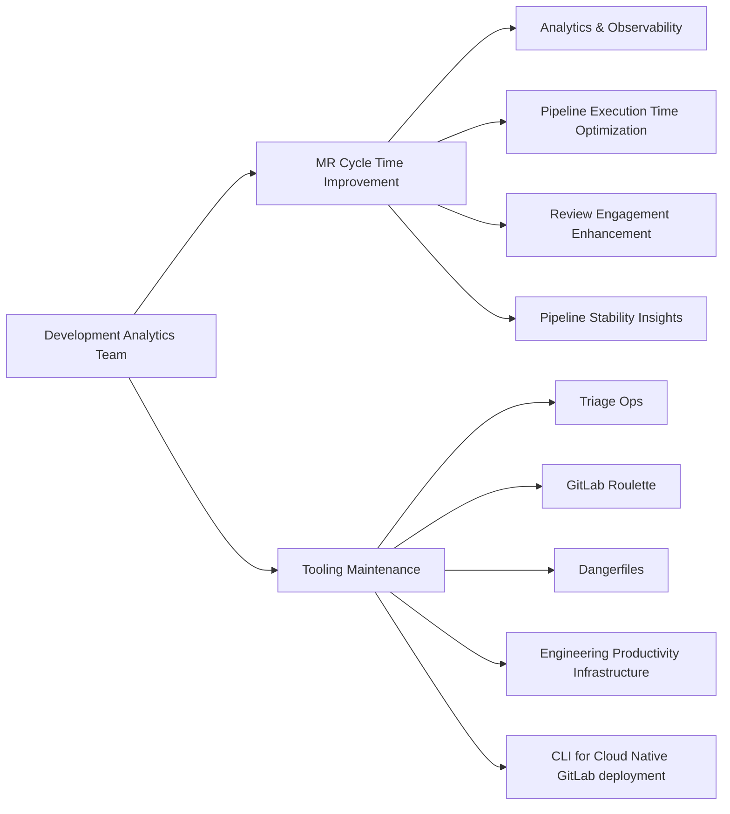

## 戦略

### ビジョン

すべての GitLab プロジェクトは、カスタムの計測を一切行わずに、開発の健全性スコアをすぐに取得できます。SDLC の摩擦、潜在的なボトルネック、実行可能なシグナルをリアルタイムかつセルフサービスで可視化します。GitLab 自身のエンジニアリングで実証したパターンは、GitLab を利用するすべてのチームが利用できる標準テレメトリになります。

### ミッション

SDLC 全体の開発健全性シグナルを明らかにし、そのシグナルを所有するチームに見える形で提供します。私たちは Customer Zero です。まず GitLab 自身の Engineering でパターンを実証し、その後、製品チームに影響を与え協力してすべての顧客に届けます。GitLab モノリスと Modular Components の両方を第一級の対象として扱います。各イニシアチブでは適切なプラットフォームに焦点を当てますが、両方を念頭に置きます。

### 戦略的な柱

#### 開発健全性シグナルプラットフォーム

GitLab Engineering 向けの SDLC シグナルレイヤー全体を担い、モノリスと Modular Components の両方を対象とします。開発健全性データを製品に取り込み、ユーザー、AI エージェント、ダッシュボードで利用できるようにします。エンジニアから VP レベルまでのスコアカードを提供します。

#### Customer Zero から製品への展開

GitLab Engineering に組み込まれた社内ラボとして運用します。開発健全性のギャップを特定し、それを表面化するための軽量なシグナルまたは計測を構築して、モノリスと Modular Components の両方にわたる実際の Engineering 作業でその価値を検証します。その後、製品チームと連携してそのシグナルを GitLab にネイティブに組み込み、カスタム計測なしですべての顧客が利用できるようにします。

#### ツールの維持管理

Triage Ops、Roulette、Dangerfiles、EP Infrastructure など、GitLab エンジニアリングが依存するツールを維持します。カスタムツールを並行して運用するのではなく、段階的に製品へ移行します。現在人間またはスクリプトが行っている L1 自動化作業は、AI エージェントが引き継ぎます。

## FY27 ロードマップ

社内で何を構築する場合でも、私たちは製品を念頭に置いて構築します。Customer Zero とは、まず GitLab 内でシグナルパターンを検証し、その後、すべての GitLab 顧客が恩恵を受けられるよう製品に取り込むことです。

### Q2

チームが現在取り組んでいる内容の最新の状況については、[Q2 計画 Issue](https://gitlab.com/gitlab-org/quality/analytics/team/-/work_items/573)を参照してください。

### Q3

| イニシアチブ | キャパシティ | エンジニア |
| :---- | :---- | :---- |
| [CI 健全性インシデント — 運用、フィードバック、改善](https://gitlab.com/groups/gitlab-org/quality/analytics/-/work_items/47) | 主担当（チーム全体） | 全 3 名 |
| [Theseus — モジュラー機能の CI/CD とテストの可観測性](https://gitlab.com/groups/gitlab-org/quality/analytics/-/work_items/49) | ベストエフォート | 1〜2 名 |
| [テスト健全性インデックス](https://gitlab.com/groups/gitlab-org/quality/analytics/-/work_items/46) | ベストエフォート、Q3 で完了 | 1 名 |

#### CI 健全性インシデント — 運用、フィードバック、改善

CI 健全性インシデントの検出はすでに稼働しており、旧 master-broken システムと比べてノイズを約 91% 削減しています。エンジニアと EM が master-broken インシデントの影響を定量化し、解決までの時間を短縮し、防止のためのガードレールを追加できるよう支援できる、よい位置にいます。

製品面での直接的な機会もあります。GitLab は[製品内のフレーキーテスト検出](https://gitlab.com/gitlab-org/gitlab/-/work_items/606069)を試作しており、DA が持つ過去のテストシグナル、つまり統計的なフレーキネスの定義、失敗シグネチャ、影響範囲のデータは、この製品イニシアチブを堅牢にするためにまさに必要なものです。

*エピック: [CI 健全性インシデント — 運用、フィードバック、改善](https://gitlab.com/groups/gitlab-org/quality/analytics/-/work_items/47)*

- **Q3:** 3 名のエンジニア全員がここに注力します。シグナル品質の改善（トレースなしのジョブ/パイプライン失敗の検出）、master-broken 廃止監査、オーナーシップ/対応プロセスを進めます。
- **Q4:** レガシー master-broken インシデントの扱い（廃止、リダイレクト、または統合）を決め、ハンドブック/ドキュメントを適宜更新します。
- **その後:** 高度な自動化（AI 支援による MR の特定、自動作成されるリバート MR）。インシデントから学び、再発を防ぎます。

---

#### Theseus — モジュラー機能の CI/CD とテストの可観測性 *(ベストエフォート)*

Theseus は GitLab の将来の開発プラットフォームです。新しい Modular Component はすべてこれを基盤とします。DA は早期に関与し、Modular Components にとって優れた可観測性とは何かを確立する機会があります。DA では、Theseus ベースのコンポーネントのエンドツーエンド CI/CD とテストシグナルフローをまだ誰も検証していません。まず試験プロジェクトで実施し、Artifact Registry で検証すれば、将来のすべてのモジュラーチームに従うべき舗装済みの道筋を提供できます。

*エピック: [Theseus のテストと CI の可観測性](https://gitlab.com/groups/gitlab-org/quality/analytics/-/work_items/49)*

- **Q3（ベストエフォート）:** 小規模なプロジェクト（Ruby/Go/Jest テストを含む）を計測し、テスト結果、テスト時間、ジョブ時間、パイプライン時間、失敗カテゴリ、失敗シグネチャを私たちの ClickHouse に送信します。既存のダッシュボードを検証します。同じアプローチを Artifact Registry に適用します。ギャップは Issue として登録します。
- **Q4（主担当）:** 全力で注力します。SDLC ライフサイクルに沿ってより多くのメトリクスを追加し、対象をより多くの Modular Component に拡大し、エピックを洗練させます。
- **その後:** 私たちが定義する可観測性標準が、新しい GitLab プロジェクトの標準になります。すべてのプロジェクトが、カスタム計測作業なしで SDLC 全体の CI/CD とテストメトリクスを出力します。

---

#### テスト健全性インデックス *(ベストエフォート、Q3 で完了)*

GitLab のテストスイートには、隔離テスト、フレーキーテスト、低速テストという 3 つの柱にまたがる、実在し増加し続ける負債があります。現在、これらをグループごとの健全性として集約して表示するものはありません。フェーズ 1（可視化）はほぼ完了し、フェーズ 2（キャリブレーション）はすでに進行中です。

*エピック: [テスト健全性インデックスの導入](https://gitlab.com/groups/gitlab-org/quality/analytics/-/work_items/46)*

- **Q3（ベストエフォート）:** フェーズ 1（可視化）とフェーズ 2（キャリブレーション）を完了します。テスト健全性インデックスのダッシュボード、グループごとの詳細生成機能、Investigation バケットのワークフロー、triage-ops 統合、調整済みの RAG バンドしきい値を完了します。
- **その後:** フェーズ 3（アラート）とフェーズ 4（強制）は、エンジニアリングリーダーシップの支持を条件とします。

---

### Q4

| イニシアチブ | キャパシティ | エンジニア |
| :---- | :---- | :---- |
| [Theseus — モジュラー機能の CI/CD とテストの可観測性](https://gitlab.com/groups/gitlab-org/quality/analytics/-/work_items/49) | 主担当 | 1〜2 名 |
| [Orbit 統合 — CI シグナルをナレッジグラフへ取り込む](https://gitlab.com/groups/gitlab-org/quality/analytics/-/work_items/52) | 調査スパイク | 1 名 |
| [フレーキーテスト検出を Jest、Go、Rust に拡大する](https://gitlab.com/groups/gitlab-org/quality/analytics/-/work_items/53) | 調査スパイク | 1 名 |
| [CI 健全性インシデント — 運用、フィードバック、改善](https://gitlab.com/groups/gitlab-org/quality/analytics/-/work_items/47) | 保守 | 必要に応じて |

#### Orbit 統合 — CI シグナルをナレッジグラフへ取り込む

現在、エージェントは CI ジョブまでの経路をたどれますが、そのジョブの内部で何が起きているかは見えません。DA の ClickHouse データ（フレーキーテスト、失敗カテゴリ、CI 健全性インシデント、失敗シグネチャ、コードカバレッジ）があれば、エージェントはさらに 1 段深く掘り下げられ、CI 健全性に関する質問への回答能力を大きく向上できます。ハッカソンの試作（[リポジトリ](https://gitlab.com/gitlab-ai-hackathon/transcend/8043245)、[記事](https://dev.to/arek_h/finding-the-root-cause-of-production-incidents-in-seconds-with-gitlab-orbit-ai-244i)）では、すでに Orbit を通じたインシデントから MR へのトラバーサルパターンが実証されています。DA の CI シグナルレイヤーが欠けている要素です。

*エピック: [Orbit 統合 — CI シグナルをナレッジグラフへ取り込む](https://gitlab.com/groups/gitlab-org/quality/analytics/-/work_items/52)*

- **Q4:** 調査スパイクを実施します。チームの ClickHouse から本番 ClickHouse にデータを移すには何が必要でしょうか。Orbit 統合には技術的に何が必要でしょうか。GitLab 社内向けと製品向けではどのような形になるでしょうか。可能な箇所から移行と統合を開始します。
- **その後:** DA の CI シグナルは Orbit の第一級データソースとなり、GitLab の顧客が利用できるようになります。

---

#### フレーキーテスト検出を Jest、Go、Rust に拡大する

現在、フレーキーテスト検出は RSpec でしか機能しません。Jest、Go、Rust のテストには、フレーキネスが同じように現実の問題であるにもかかわらず、参加する方法がありません。この拡大は、GitLab が構築している製品内フレーキーテスト検出イニシアチブを直接支援します。

*エピック: [フレーキーテスト検出を Jest、Go、Rust に拡大する](https://gitlab.com/groups/gitlab-org/quality/analytics/-/work_items/53)*

- **Q4:** Jest と Go の実際の再試行確認を組み込みます。Orbit 自身のテストスイートを含む Rust エクスポーターを構築します。既存のダッシュボードやアラートに大量に流入しないよう、各フレームワークを明示的な許可リストの背後に置きます。
- **その後:** DA がサポートするすべての主要フレームワークで、フレーキーシグナルの同等性を実現します。

---

### 将来の作業 / 候補

*このサイクルではコミットしません。レビュー担当者が価値を確認し、必要に応じて優先順位を変更できるよう掲載しています。*

#### 体系的な本番インシデントの根本原因分析

テストカバレッジ、隔離状態、CI シグナルを本番インシデントに結び付け、「なぜパイプラインはグリーンだったのか？」に答えます。ハッカソンの試作（[リポジトリ](https://gitlab.com/gitlab-ai-hackathon/transcend/8043245)、[記事](https://dev.to/arek_h/finding-the-root-cause-of-production-incidents-in-seconds-with-gitlab-orbit-ai-244i)）では、すでに Orbit を通じたインシデントから MR へのトラバーサルパターンが実証されています。DA の CI シグナルレイヤーが、体系的かつ再現可能な根本原因分析に欠けている要素です。

*エピック: [体系的なインシデント根本原因分析](https://gitlab.com/gitlab-org/quality/analytics/team/-/work_items/39)*

---

#### Development Analytics 向け Tier-1 エージェント

DA で Tier-1 エージェントを責任を持って運用するための設計図を調査します。実行場所、ガードレール、良い/悪い結果の定義を扱います。DA は、他の DevEx チームや社内チームが追随できるリファレンス実装になります。現在の GitLab には、このための共通パターンがありません。

*エピック: [Development Analytics 向け Tier-1 エージェント](https://gitlab.com/groups/gitlab-org/quality/analytics/-/work_items/51)*

---

#### ClickHouse のエンジニアリングデータカバレッジを拡大する

より多くの欠けているデータソースを ClickHouse に追加します。ファクトリープロファイリング、MR レビューメタデータ、CI/CD コストテレメトリが対象です。データギャップを 1 つ埋めるたびに、検証し、製品チームに提供し、最終的に顧客へ届けられるシグナルカテゴリが増えます。

*エピック: [ClickHouse のエンジニアリングデータカバレッジを拡大する](https://gitlab.com/groups/gitlab-org/quality/analytics/-/work_items/54)*

候補のサブプロジェクト:

- **MR プロセスの可視性** — レビュアールーレットプールの規模、承認リセットの頻度、レビュータイムラインを表示します。製品がすでに解決していないことを確認するため、まず簡単な調査 Issue が必要です。[エピック](https://gitlab.com/groups/gitlab-org/quality/analytics/-/work_items/45)
- **ファクトリーが多用される RSpec テストの可観測性、ガードレール、修復** — CI におけるファクトリーの時間コスト（以前は 1 つのファクトリーに対して実行ごとに約 11.7 CI 時間）をプロファイリングし、その後 RuboCop のガードレールと修復を追加します。[エピック](https://gitlab.com/groups/gitlab-org/quality/-/work_items/403)
- **ClickHouse と Grafana で CI/CD パイプラインコストを追跡する** — プロジェクト、ジョブ種別、リソースカテゴリ別のコスト内訳です。[エピック](https://gitlab.com/groups/gitlab-org/quality/analytics/-/work_items/34)

## 働き方

### 内部ローテーションとサポートリクエスト

#### 内部ローテーション

サポートリクエストやその他のチームメンテナンスタスクのために[内部ローテーション](https://gitlab.com/gitlab-org/quality/analytics/internal-rotation#process)を使用しています。これにより、チームの他のエンジニアが計画された作業に集中できる時間が確保されます。

#### サポートリクエスト

- バグを発見したり、支援が必要な場合、または改善の機会を特定した場合は、`~"group::Development Analytics"` と `~"development-analytics::support-request"` ラベルを使用してサポートリクエストを提出してください。緊急の場合は、指定された Slack チャンネル - [`#g_development_analytics`](https://gitlab.enterprise.slack.com/archives/C064M4D2V37) にエスカレーションしてください。
- リクエストが最初に Slack 経由で来た場合は、リクエスト者または `group::Development Analytics` メンバーが適切なラベルで Issue を開いて、適切なトラッキングとトリアージを確保してください。
- チームは[サポートリクエストボード](https://gitlab.com/groups/gitlab-org/-/boards/9098093?label_name%5B%5D=development-analytics%3A%3Asupport-request)をレビューし、それに応じて優先順位を付けます。一般的に、チームはサポートタスクに週次時間の約 20% を確保していますが、現在の優先事項によって異なる場合があります。

### ツール/リポジトリのメンテナンス

- チームはグループが所有する各リポジトリに作成されたすべての新しい Issue を自動的に監視しているわけではありません — 可視性を確保するためにグループラベルを使用するか、Slack でエスカレーションしてください。
- セルフサービスのマージリクエストを強く推奨します。すでに修正や改善を特定している場合は、より迅速なターンアラウンドのために MR を開くことを推奨します。`~group::development analytics` のメンテナーが適宜レビューしてマージします。
- 機能作業とバグ修正はチームの現在の優先事項に従います。
- `~group::development analytics` が所有するリポジトリのバージョン管理に関する慣習を参照してください:

| リポジトリ                             | リリースプロセス                                                                                 |
|----------------------------------------|-------------------------------------------------------------------------------------------------|
| **gitlab-roulette**                    | バージョン更新は設定されたスケジュールでは行われません。バージョン更新 MR が提出されると随時リリースが行えます。 |
| **gitlab-dangerfiles**                 | 上記と同じ — 定期的なスケジュールはなく、バージョン更新 MR によってリリースがトリガーされます。                     |
| **triage-ops**                         | デフォルトブランチに新しいコミットがマージされた後に新しいリリースが開始されます。                            |
| **engineering-productivity-infrastructure** | 依存関係更新 MR は Renovate ボットによって生成されます。                                            |

## チームメンバー



## コア責任範囲

```mermaid
flowchart LR
    DA[Development Analytics Team]

    DA --> MRCT[MR Cycle Time Improvement]
    DA --> Tools[Tooling Maintenance]

    MRCT --> Analytics[Analytics & Observability]
    MRCT --> ExecTime[Pipeline Execution Time Optimization]
    MRCT --> ReviewEng[Review Engagement Enhancement]
    MRCT --> PipeStab[Pipeline Stability Insights]

    Tools --> Triage[Triage Ops]
    Tools --> Roulette[GitLab Roulette]
    Tools --> Danger[Dangerfiles]
    Tools --> EPInfra[Engineering Productivity Infrastructure]
    Tools --> CNG[CLI for Cloud Native GitLab deployment]

    click Triage "https://gitlab.com/gitlab-org/quality/triage-ops"
    click Roulette "https://gitlab.com/gitlab-org/gitlab-roulette"
    click Danger "https://gitlab.com/gitlab-org/ruby/gems/gitlab-dangerfiles"
    click EPInfra "https://gitlab.com/gitlab-org/quality/engineering-productivity-infrastructure"
    click Analytics "https://gitlab.com/groups/gitlab-org/-/epics/16185"
    click ExecTime "https://gitlab.com/groups/gitlab-org/-/epics/15989"
    click ReviewEng "https://gitlab.com/groups/gitlab-org/-/epics/16028"
    click PipeStab "https://gitlab.com/groups/gitlab-org/-/epics/16186"
    click MRCT "https://gitlab.com/groups/gitlab-org/-/epics/16026"
    click CNG "https://gitlab.com/gitlab-org/gitlab/-/tree/master/qa/gems/gitlab-cng"
```

## ダッシュボード

Development Analytics のダッシュボードは [Developer Experience ダッシュボードページ](/handbook/engineering/infrastructure-platforms/developer-experience/dashboards)に掲載されています。

[Test Health](/handbook/engineering/infrastructure-platforms/developer-experience/development-analytics/test-health) ページでは、グループごとのテストスイート健全性スコア（Flaky、Quarantine、Slow の各ピラー）と、それらへの対応方法を説明しています。

## 共通リンク

| **カテゴリ**            | **ハンドル**                                                                                                                 |
|-------------------------|----------------------------------------------------------------------------------------------------------------------------|
| **GitLab グループハンドル** | [`@gl-dx/development-analytics`](https://gitlab.com/gl-dx/development-analytics)                                           |
| **Slack チャンネル**       | [`#g_development_analytics`](https://gitlab.enterprise.slack.com/archives/C064M4D2V37)                                     |
| **Slack ハンドル**        | `@dx-development-analytics`                                                                                                |
| **チームボード**         | [`チーム Issue ボード`](https://gitlab.com/groups/gitlab-org/-/boards/8966549?label_name%5B%5D=group::development%20analytics), [`チームエピックボード`](https://gitlab.com/groups/gitlab-org/-/epic_boards/2068920?label_name[]=group%3A%3Adevelopment%20analytics), [`サポートリクエスト`](https://gitlab.com/groups/gitlab-org/-/boards/9098093?label_name%5B%5D=development-analytics::support-request)                                           |
| **Issue トラッカー**       | [`Development Analytics の Issue`](https://gitlab.com/groups/gitlab-org/quality/dx/analytics/-/issues)                       |
| **チームリポジトリ** | [development-analytics](https://gitlab.com/gitlab-org/quality/analytics)                                                   |
