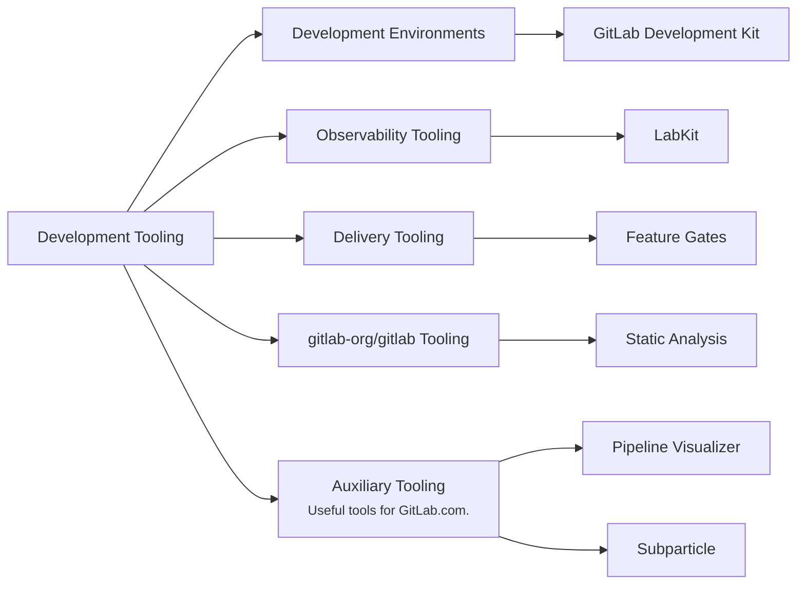

## ミッション

- 開発者が手間なく開発環境を最新の状態に保てるよう、効率的で信頼性の高い最先端の開発ツールを構築します。
- チームメンバーとより広いコミュニティが私たちのツールと製品に効率的に貢献できるようにします。
- 定量的・定性的なメトリクスの両方を使用して、開発者体験、効率性、作業負担の削減における改善を測定します。

## ビジョン

GitLab チームメンバーとより広いコミュニティが GitLab に迅速、効率的、かつ確実に貢献できるツールを作成することが私たちのビジョンです。

## 責任範囲

## チーム構成

チームメンバー情報は <a href="https://handbook.gitlab.com/handbook/engineering/infrastructure-platforms/developer-experience/development-tooling/#team-structure" rel="external noopener">原文 (英語)</a> を参照してください。

## ロードマップ

継続的なロードマップ策定の一環として、ロードマップを四半期ごとにレビューし、アプローチの検証や改善、新しい優先事項の反映に合わせて更新します。

### 現在

**フォーカス:** 開発環境全体の開発者体験を改善し、FY'27 の基盤を構築する（FY26Q4）

- GitLab エンジニアリングチームの開発環境へのオンボーディング体験を改善
- 開発環境の可観測性と監視機能を改善
- FY'27 の計画と基盤作り:
  - モジュール化されたコンテナ型開発環境のためのアーキテクチャコンセプトの構築
  - SaaS でのロールアウトの健全性を向上させるための Feature Gates システムの技術要件の策定、概念実証、ツール整備
  - 本番デバッグの改善のための LabKit でのロギング標準化メカニズムの整備

### 次

**フォーカス:** 改善された機能安定性のための基盤構築（FY27Q1/Q2）

- エンジニアリングチームが開発環境でコンポーネントの統合を自己サービスで行えるようにする
- LabKit を使用した標準化されたロギングとメトリクスによる本番デバッグの改善
- SaaS でのロールアウトの健全性を向上させるための Feature Gates システムの技術ソリューション策定の完了

### 後期

**フォーカス:** 改善された機能安定性のための基盤構築（FY27Q3+）

- 出荷した変更に対するチームの自信を向上させるための本番環境に合致した開発環境の構築
- 本番デバッグとインシデント解決の改善のための LabKit 内のトレーシング機能の整備
- SaaS でのロールアウトの健全性を向上させるための Feature Gates システムの構築

### 継続的なメンテナンス（KTLO）

計画された作業に加えて、依存関係のアップグレード、セキュリティ脆弱性、重要なバグ修正など、共有ツール機能とインフラストラクチャに影響する継続的なメンテナンスとサポートも担当します。

## 私たちとの連携

問題、機能リクエスト、改善案については: [RFH リポジトリ](https://gitlab.com/gitlab-org/quality/request-for-help#developer-experience---request-for-help)の[Issue を作成](https://gitlab.com/gitlab-org/quality/request-for-help/-/issues/new?description_template=developer_experience_request)してください。または `#g_development_tooling` でご連絡いただくこともできます。

個別の質問については、GitLab.com でチームメンバーに直接メンションするか、Slack チャンネルを通じてチームに連絡してください。

### コミュニケーション

| 説明            | リンク                                                                                                                                         |
| ---------------------- | -------------------------------------------------------------------------------------------------------------------------------------------- |
| **GitLab チームハンドル** | [`@gl-dx/development-tooling`](https://gitlab.com/gl-dx/development-tooling)                                                                     |
| **Slack チャンネル**      | [`#g_development_tooling`](https://gitlab.enterprise.slack.com/archives/C07UW7F3FL2)                                                           |
| **チーム Issue ボード**   | [Team Issue Board](https://gitlab.com/groups/gitlab-org/-/boards/8974136?label_name%5B%5D=group%3A%3Adevelopment+tooling&iteration_id=Current) |
| **Issue トラッカー**      | [`gitlab-org/dx/tooling/team`](https://gitlab.com/gitlab-org/quality/tooling/team/-/issues/)                                                 |

## 働き方

私たちは AMER、APAC、EMEA の各地域に地理的に分散しており、デフォルトで非同期で作業しています。

### ミーティング

イテレーションの計画、優先事項の調整、進行中のトピックの議論のために週 1 回同期して集まります。現在のスケジュールは、関係するすべてのタイムゾーンのメンバーに配慮するために隔週で交互に変わります。
生産的な議論を促進するため、トピックは週の初めまでにアジェンダに追加してください。

### プロジェクト管理

[Infrastructure Platforms 部門](/handbook/engineering/infrastructure-platforms/project-management/)のプロジェクト管理プロセスに従います。

現在のプロジェクトの詳細については、[親エピック](https://gitlab.com/groups/gitlab-org/quality/-/epics/114)を参照してください。
