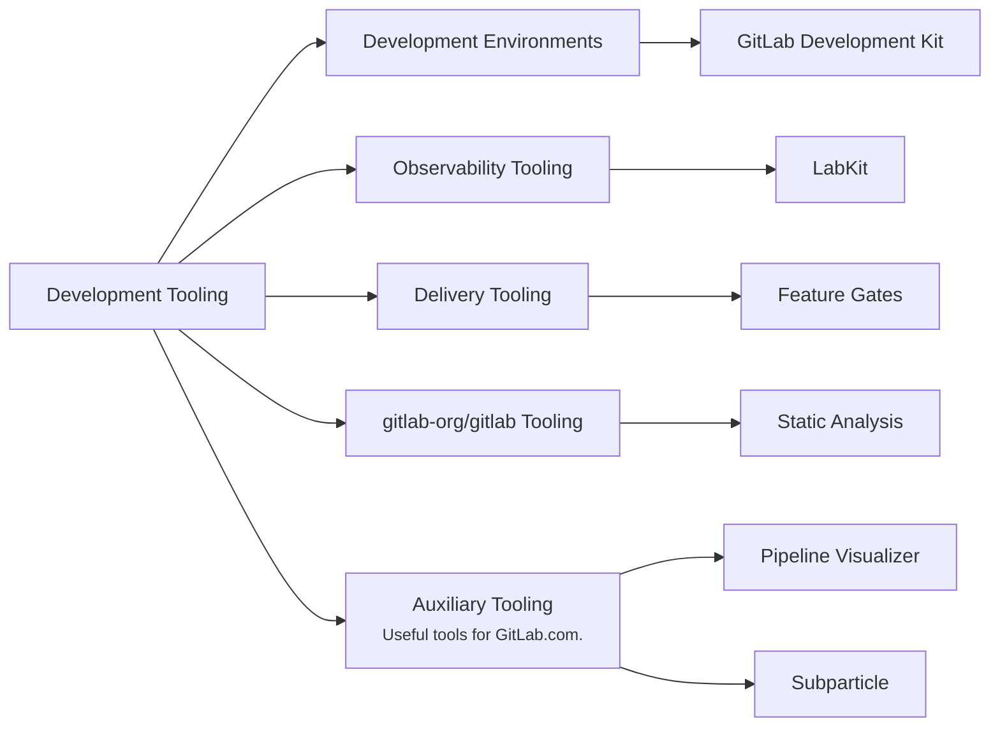

## ミッション

- 開発者が手間なく開発環境を最新に保てるよう、効率的で信頼性の高い最先端の開発者ツールを構築します。
- チームメンバーやより広いコミュニティが、私たちのツールやプロダクトに効率的にコントリビュートできるようにします。
- 重要なものを測定します。定量的・定性的な両方の指標を用い、開発者体験、効率、トイル削減における改善を測定します。

## ビジョン

私たちのビジョンは、GitLab チームメンバーとより広いコミュニティが GitLab に対して迅速、効率的、確実にコントリビュートできるツールを生み出すことです。

## 責務領域

## チーム体制



## ロードマップ

継続的なロードマップ運用の一環として、四半期ごとにロードマップをレビューし、アプローチを検証・洗練したり、新しい優先事項を反映したりして更新していきます。

### Now

**フォーカス:** 開発環境にまたがる開発者体験を改善し、FY'27 の基盤を整える（FY26Q4）

- 開発環境に関する GitLab エンジニアリングチームのオンボーディング体験を改善
- 開発環境の可観測性とモニタリング機能を改善
- FY'27 のプランニングと地ならし:
  - モジュール化されたコンテナ型開発環境のアーキテクチャコンセプトを構築
  - SaaS におけるロールアウトの健全性を高める Feature Gates システムについて、技術要件、概念実証、ツール群を整備
  - プロダクション障害時のデバッグ性向上のため、LabKit にロギング標準化のしくみを導入

### Next

**フォーカス:** 機能の安定性向上に向けた基盤構築（FY27Q1/Q2）

- エンジニアリングチームが、開発環境への自分たちのコンポーネントの統合をセルフサービスで行えるようにする
- LabKit を用いた標準化されたロギングとメトリクスにより、プロダクションでのデバッグを改善
- SaaS におけるロールアウトの健全性を高める Feature Gates システムの技術ソリューションを完成させる

### Later

**フォーカス:** 機能の安定性向上に向けた基盤構築（FY27Q3 以降）

- 出荷した変更へのチームの自信を高めるため、プロダクションと整合した開発環境を構築
- プロダクションでのデバッグとインシデント対応の改善のため、LabKit にトレース機能を提供
- SaaS におけるロールアウトの健全性を高める Feature Gates システムを構築

### 灯りを点け続ける（KTLO）

計画された作業に加え、私たちのチームは、依存関係のアップグレード、セキュリティ脆弱性、重大なバグ修正など、共有ツール群の機能やインフラに影響する継続的なメンテナンスとサポートも担当します。

## 私たちと協働する

問題、機能リクエスト、機能改善については: 私たちの [RFH リポジトリ](https://gitlab.com/gitlab-org/quality/request-for-help#developer-experience---request-for-help)で **[Issue を作成](https://gitlab.com/gitlab-org/quality/request-for-help/-/issues/new?description_template=developer_experience_request)** してください。または、`#g_development_tooling` で私たちに声をかけることもできます。

個別の質問については、GitLab.com でチームメンバーに直接メンションするか、Slack チャンネル経由でチームに連絡してください。

### コミュニケーション

| 説明            | リンク                                                                                                                                         |
| ---------------------- | -------------------------------------------------------------------------------------------------------------------------------------------- |
| **GitLab チームハンドル** | [`@gl-dx/development-tooling`](https://gitlab.com/gl-dx/development-tooling)                                                                     |
| **Slack チャンネル**      | [`#g_development_tooling`](https://gitlab.enterprise.slack.com/archives/C07UW7F3FL2)                                                           |
| **チーム Issue ボード**   | [Team Issue Board](https://gitlab.com/groups/gitlab-org/-/boards/8974136?label_name%5B%5D=group%3A%3Adevelopment+tooling&iteration_id=Current) |
| **Issue トラッカー**      | [`gitlab-org/dx/tooling/team`](https://gitlab.com/gitlab-org/quality/tooling/team/-/issues/)                                                 |

## 私たちの働き方

私たちは AMER、APAC、EMEA の各リージョンに地理的に分散しており、原則として非同期で働きます。

### ミーティング

私たちは週に 1 度同期ミーティングを行い、イテレーションの計画、優先事項の擦り合わせ、進行中のトピックの議論を行います。現在のスケジュールは、関係するすべてのタイムゾーンのメンバーに配慮するため、隔週で交互に切り替わります。
生産的な議論にするため、トピックは週初めまでにアジェンダに記入してください。

### プロジェクトマネジメント

[Infrastructure Platforms 部門](/handbook/engineering/infrastructure-platforms/project-management/)のプロジェクトマネジメントプロセスに従います。

進行中のプロジェクトの詳細は、[親エピック](https://gitlab.com/groups/gitlab-org/quality/-/epics/114)を参照してください。
