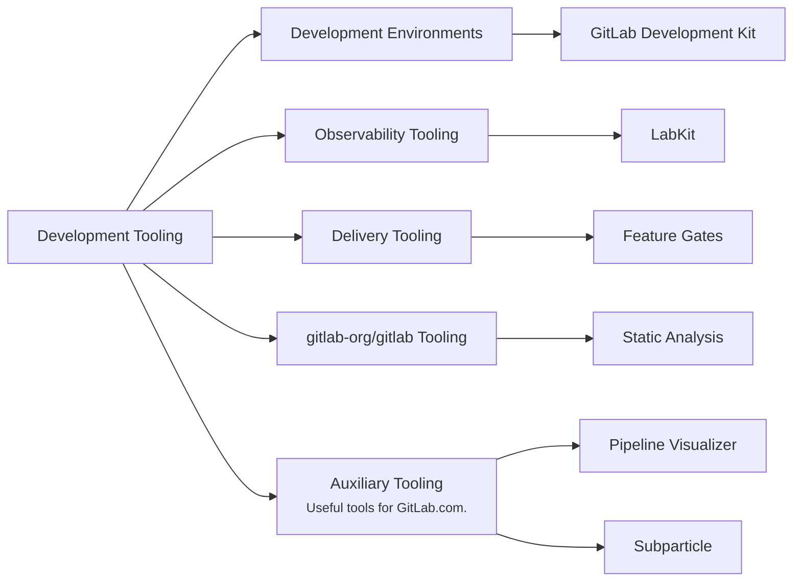

## ミッション

- 効率的かつ信頼性の高い最先端の開発者ツールを構築し、開発者が苦痛なく開発環境を最新の状態に保てるようにします。
- チームメンバーとより広いコミュニティが、私たちのツールとプロダクトに効率的にコントリビュートできるようにします。
- 重要なものを測定する: 開発者体験、効率性、トイル削減における改善を、定量的および定性的なメトリクスの両方を使って測定します。

## ビジョン

私たちのビジョンは、GitLab のチームメンバーとより広いコミュニティが GitLab に迅速、効率的、信頼性高くコントリビュートできるツールを作成することです。

## 責任の領域

## チーム体制



## ロードマップ

継続的ロードマップ作成の一部として、私たちは四半期ごとにロードマップをレビューし、アプローチを検証または改良し、新しい優先順位を反映するためにそれを更新します。

### Now

**フォーカス:** Development Environments での開発者体験を改善し、FY'27 (FY26Q4) の基盤を築く

- Development Environments のための GitLab エンジニアリングチームのオンボーディング体験を改善する
- Development Environments の可観測性とモニタリング機能を改善する
- FY'27 計画と基礎作業:
  - モジュール化されたコンテナ化された Development Environment のアーキテクチャコンセプトを構築する
  - SaaS でのロールアウト健康性向上のための Feature Gates システムの技術要件、概念実証、ツールをキュレートする
  - 本番デバッグ向上のための LabKit のロギング標準化メカニズムをプロビジョニングする

### Next

**フォーカス:** 機能の安定性向上のための基盤を構築 (FY27Q1/Q2)

- エンジニアリングチームが Development Environments への自分のコンポーネントの統合をセルフサーブできるようにする
- LabKit を使った標準化されたロギングとメトリクスで本番デバッグを改善する
- SaaS でのロールアウト健康性向上のための Feature Gates システムの技術的解決を完了する

### Later

**フォーカス:** 機能の安定性向上のための基盤を構築 (FY27Q3+)

- 出荷された変更に対するチームの信頼を向上させるために、本番準拠の Development Environments を構築する
- 本番デバッグとインシデント解決を改善するために LabKit 内にトレーシング機能をプロビジョニングする
- SaaS でのロールアウト健康性を向上させるための Feature Gates システムを構築する

### Keeping The Lights On (KTLO)

計画された作業に加えて、私たちのチームは、依存関係のアップグレード、セキュリティ脆弱性、重要なバグ修正など、共有ツールの機能性とインフラストラクチャに影響する継続的な保守とサポートも担当します。

## 私たちとの連携

問題、機能リクエスト、機能強化について: 私たちの [RFH リポジトリ](https://gitlab.com/gitlab-org/quality/request-for-help#developer-experience---request-for-help) で **[Issue を作成](https://gitlab.com/gitlab-org/quality/request-for-help/-/issues/new?description_template=developer_experience_request)** してください。あるいは、`#g_development_tooling` で私たちに連絡することもできます。

個別の質問については、GitLab.com で直接チームメンバーに言及するか、私たちの Slack チャンネルを通じてチームに連絡してください。

### コミュニケーション

| 説明            | リンク                                                                                                                                         |
| ---------------------- | -------------------------------------------------------------------------------------------------------------------------------------------- |
| **GitLab チームハンドル** | [`@gl-dx/development-tooling`](https://gitlab.com/gl-dx/development-tooling)                                                                     |
| **Slack チャンネル**      | [`#g_development_tooling`](https://gitlab.enterprise.slack.com/archives/C07UW7F3FL2)                                                           |
| **チーム Issue ボード**   | [チーム Issue ボード](https://gitlab.com/groups/gitlab-org/-/boards/8974136?label_name%5B%5D=group%3A%3Adevelopment+tooling&iteration_id=Current) |
| **Issue トラッカー**      | [`gitlab-org/dx/tooling/team`](https://gitlab.com/gitlab-org/quality/tooling/team/-/issues/)                                                 |

## 私たちの働き方

私たちは AMER、APAC、EMEA の地域に地理的に分散しており、デフォルトで非同期で作業します。

### ミーティング

私たちは週に 1 回同期的に集まり、イテレーションを計画し、優先順位を揃え、進行中のトピックについて議論します。現在のスケジュールは、関与するすべてのタイムゾーンのメンバーに対応するために隔週で交互です。
生産的な議論を促進するために、トピックは週の初めまでに議題に入れるべきです。

### プロジェクト管理

私たちは [Infrastructure Platforms 部門](/handbook/engineering/infrastructure-platforms/project-management/) のプロジェクト管理プロセスに従います。

現在のプロジェクトの詳細については、私たちの [親エピック](https://gitlab.com/groups/gitlab-org/quality/-/epics/114) を参照してください。
