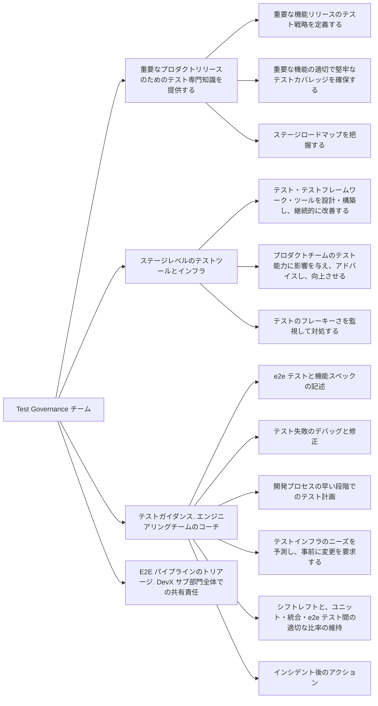

## 共通リンク

| **カテゴリ**            | **ハンドル**                                                                                     |
|-------------------------|------------------------------------------------------------------------------------------------|
| **GitLab グループハンドル** | [`@gl-dx/test-governance`](https://gitlab.com/gl-dx/test-governance)                           |
| **Slack チャンネル**       | [`#g_test-governance`](https://gitlab.enterprise.slack.com/archives/C064M4S0FU5)               |
| **Slack ハンドル**        | `@dx-test-governance`                                                                     |
| **チームボード**         |                                                                                                |
| **Issue トラッカー**       | [`tracker`](https://gitlab.com/groups/gitlab-org/developer-experience/test-governance/-/issues) |
| **GitLab リポジトリ** | [test-governance](https://gitlab.com/gitlab-org/developer-experience/test-governance)          |

## ミッション

テストフレームワークとツールを提供し、設定を最適化し、開発チームと協力して顧客に不具合が届くことを防ぐ包括的な機能テストを作成・維持することで、すべてのチームにわたって高度に効果的なテストを確保します。

## ビジョン

* 可能な限り早い段階でバグを発見するために、安定した・再現可能な・高速なテストフレームワークと設定を提供する
* 機能テストと品質に関するチームのスキルアップのためのトレーニング。すべてのエンジニアリングチームが、何をテストすべきか・いつ・どのようにアプリケーションが成長するにつれてテストカバレッジを維持するための価値あるテストをテストスイートに追加すべきかを知るべきです
* GitLab.com と Dedicated のインシデントとバグ分析 - テストのギャップを特定し、テストの改善のために開発チームと協力する
* フレーキーなテストをステージグループが修正または削除するために迅速に特定して隔離するための効果的な隔離プロセス

## チームメンバー

チームメンバー情報は <a href="https://handbook.gitlab.com/handbook/engineering/infrastructure-platforms/developer-experience/test-governance/#team-members" rel="external noopener">原文 (英語)</a> を参照してください。

## 主な責任

## ロードマップとテーマ

Test Governance ロードマップは、今四半期のコミットメントに基づいており、会社の目標と整合しています。すべての Test Governance コミットメントは、おおまかに以下のテーマとサブテーマに分類されます:

* テストレジリエンス
  * 安定性: 品質プロセスが直感的で、テスト結果が予測可能であることを確保します。
  * 速度: 機能テストフレームワークが望ましい速度でパフォーマンスを発揮し、新しいツールが実行時間を増やさないことを確認します。
* テストオブザーバビリティ
  * テストレベルの追跡: 機能テストレベルが追跡・尊重されることを確保します。
  * フレーキーさ: フレーキーなテストをより早く検出して対処することを確保します。
  * 隔離: テストスイートが健全で高品質なテストで構成されることを確保します。
  * カバレッジ: 多様なテストタイプを可能にする新しいテスト自動化フレームワークの提供と既存フレームワークの拡張により、品質カバレッジを向上させます。
* テスト知識ベース
  * 品質についてエンジニアをコーチするための包括的なドキュメント・ガイドライン・ハウツー・トレーニングを提供します。
* テストガバナンス
  * テストカバレッジの適切なバランスを提供することにより、最終製品の品質を保証します。上流チームへの機能変更を通知し、重要なジャーニーが常に徹底的にテストされることを確保します。
  * 戦略とツール: 組織の成長をサポートするための品質戦略を発展させます。
* 開発者支援
  * 品質のオーナーシップを持てるようにエンジニアを支援するヘルパーツールを提供します。

現在の Test Governance の取り組みを確認するには [DevEx: Test Governance Issue](https://gitlab.com/groups/gitlab-org/quality/-/epics/116) を使用してください。

### 短期コミットメント

フォーカス: 品質を損なわずにテストパイプラインのパフォーマンスを最適化する（FY27Q1）

* パイプライン実行時間の短縮
* CI コストの削減
* 品質の維持または改善（エスケープされた欠陥の増加なし）

### 中期コミットメント

フォーカス: ランナーコストの削減、欠陥エスケープ率の低下、パイプライン安定性の改善を継続する（FY27Q2 - FY27Q3）

* AI を活用してランナーコストを削減するための予測テストシステムの改善
* 欠陥エスケープ率を下げるためにコードの変更に自動テストを適応させるシステムの構築
* パイプラインの安定性を向上させるために、セルフヒーリングテストをフレーキーテストと隔離テストのプロセスに統合する

### ヘルプリクエストによる連携方法

Test Governance グループは、[品質はすべての人の責任](/handbook/engineering/development/principles/#quality) という原則をチームがより適用できるよう支援することを目指しています。
すべてのサポートは以下の RFH プロセスを通じてリクエストしてください。これにより、計画されたプロジェクトロードマップに対してリクエストの優先順位を付けることができます。
すべてのサポートリクエストに以下のヘルプリクエストプロセスをご利用ください。

#### ヘルプリクエストプロセス

1. [ヘルプリクエスト](https://gitlab.com/gitlab-org/quality/test-governance/request-for-help#step-1-create-a-new-issue) プロジェクトに Issue を作成します。リクエストを迅速にトリアージできるよう、テンプレートのすべてのセクションを完成させてください。
1. Test Governance チームは 1 週間以内にリクエストをトリアージし、リクエストの種類と優先度に基づいて適切なラベルを追加してチームメンバーを割り当てます。優先順位付けと次のステップの詳細はヘルプリクエスト Issue でお知らせします。

E2E テストカバレッジの詳細なガイダンスについては、以下のアプローチを検討してください:

* 主要な DRI と連携して、さまざまな顧客が新機能をどのように使用するかを示す[ペルソナ](/handbook/product/personas)ユースケースを定義する
* 全体的な[テストピラミッド](https://docs.gitlab.com/ee/development/testing_guide/testing_levels.html)を念頭に置きながら、ユースケースのどの部分が下位レベルのテストでカバーできるか、どの部分が E2E テストでカバーできるかを評価する
* リクエストを提出する前に、[テストのベストプラクティス](https://docs.gitlab.com/development/testing_guide/end_to_end/best_practices)に関するドキュメントを参照する

<!--
## 働き方
### 作業に関する儀式
### 作業管理
#### 計画
-->

## チームミーティング

これらのミーティングの目的に関する詳細は、[グループ Test Governance のプロセス](/handbook/engineering/infrastructure-platforms/developer-experience/test-governance/workflows/#processes-and-their-frequencies) を参照してください。

* **チーム同期・知識共有**: 隔週（すべてのタイムゾーンをカバーするために 2 セッション）
* **Issues/Epics のリファインメント**: 毎週、同期（すべてのタイムゾーンをカバーするために 2 セッション）と非同期を交互に
* **四半期計画**: 四半期に 1 回
* **振り返り**: 月次だが四半期ごとにまとめる
