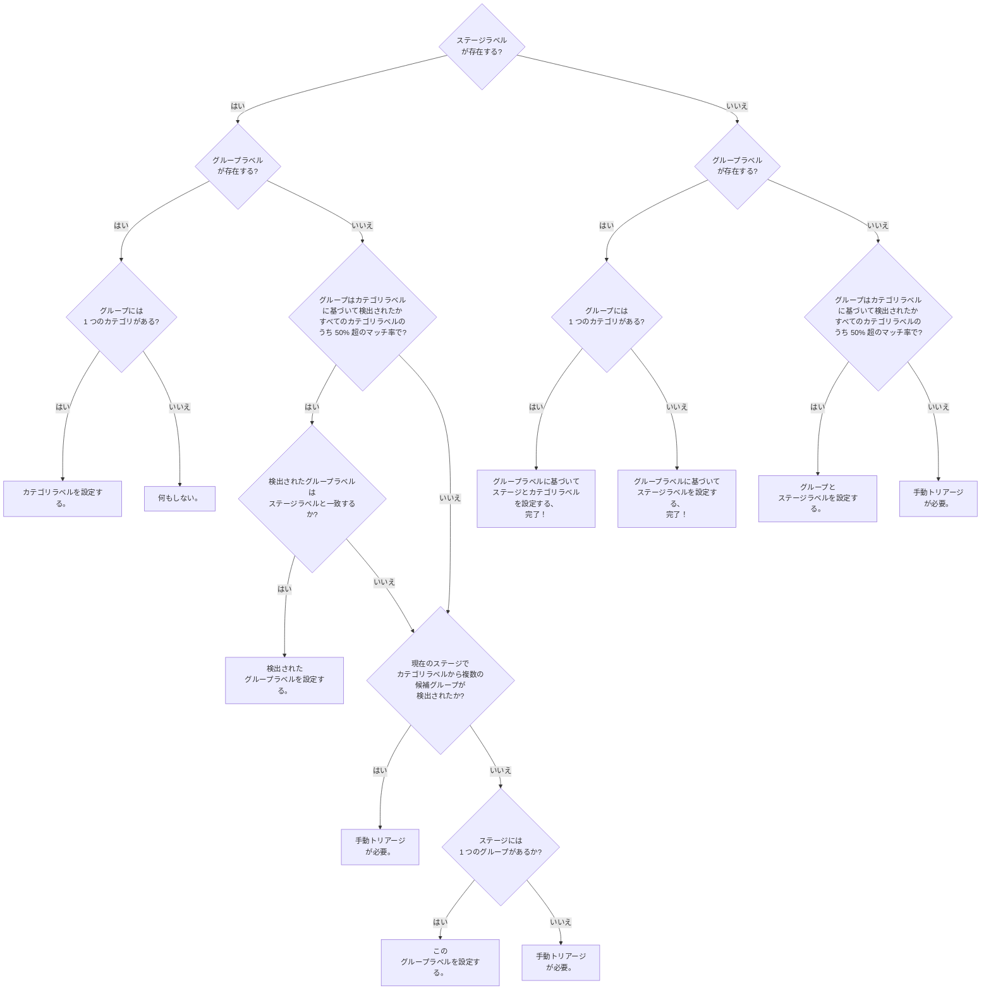

GitLab のすべてのチームメンバーは Issue をトリアージできます。[トリアージされていない Issue](/handbook/product-development/how-we-work/issue-triage/#triaging-issues) の数を少なく保つことはメンテナビリティにとって不可欠であり、私たちの共同責任です。

私たちはこれを大規模に処理し、各チームやグループに負荷を分散するための自動化とツールを実装しています。

Triage Operations・トリアージレポート・優先度と重大度ラベルのビデオ紹介。

<iframe width="560" height="315" src="https://www.youtube.com/embed/qOlN2G1BDhk" frameborder="0" allow="accelerometer; autoplay; encrypted-media; gyroscope; picture-in-picture" allowfullscreen></iframe>

## 説明責任

[Developer Experience](/handbook/engineering/infrastructure-platforms/developer-experience/) チームは、すべてのプロダクトおよびエンジニアリンググループが定められた SLA を守る責任を持つことを確保します。

私たちの欠陥 SLA は以下で確認できます:

* [優先度ラベル](/handbook/product-development/how-we-work/issue-triage/#priority)
* [重大度ラベル](/handbook/product-development/how-we-work/issue-triage/#severity)

Developer Experience チームは、この目標を達成するために手動介入に加えて多くのツールと自動化を採用しています。
この分野の作業は、Triage と Measure のトラックの作業として部門ロードマップで確認できます。

## ラベルの名前変更

ステージ・グループ・カテゴリラベルを使用する自動化が多数あります。以下のいずれかの変更が発生した場合、プロダクトマネージャーは triage-ops に Issue を作成することを求めています。この Issue は自動化とレポートへの影響を最小限に抑えるのに役立ちます。

* [ステージの作成または名前変更](https://gitlab.com/gitlab-org/quality/triage-ops/issues/new?issuable_template=category-stage-group-label-change)
* [グループの作成または名前変更](https://gitlab.com/gitlab-org/quality/triage-ops/issues/new?issuable_template=category-stage-group-label-change)
* [カテゴリラベルの作成または名前変更](https://gitlab.com/gitlab-org/quality/triage-ops/issues/new?issuable_template=category-label-change)

## Issue とマージリクエストの自動ラベリング

トリアージボットは、Issue または MR にすでに設定されているカテゴリ/機能に基づいてセクション・ステージ・グループラベルを自動的に推測します。これは `gitlab-org` グループ内の**オープン**な Issue/MR で利用可能です。

最も重要なルールは以下のとおりです:

* ステージまたはグループが `stages.yml` にリストされており、ラベルがすでに設定されている場合、ボットはステージまたはグループラベルを変更しません。
* グループラベルは、カテゴリラベルからの最も高いグループマッチが 50% を超える場合にのみ選択されます。
* グループラベルは、すでに設定されているステージラベル（該当する場合）と一致する場合にのみ選択されます。
* ステージラベルは選択された、またはすでに設定されているグループラベルに基づいて設定されます。
* セクションラベルは選択された、またはすでに設定されているグループまたはステージラベルに基づいて設定されます。
* ボットは推論ロジックを説明するメッセージを残します。

以下のロジックは最初に[このマージリクエスト](https://gitlab.com/gitlab-org/quality/triage-ops/merge_requests/155#workflow)で実装されました:



上記の推測が完了した後、ステージまたはグループラベルに基づいてセクションラベルが追加されます。この手順で推測されたラベルにセクションラベルのみが含まれる場合、説明は追加されません。

このフローが実際にどのような意味を持つかをより深く理解するために、[実際のユースケースのリスト](https://gitlab.com/gitlab-org/quality/triage-ops/merge_requests/155#test-cases)を確認してください。

Issue/MR が特定のステージに属していない場合は、ステージラベルを削除し、この自動化が将来発生しないようにするために `~"automation:devops-mapping-disable"` ラベルを追加できます。

## トリアージレポート

[トリアージレポート](https://gitlab.com/gitlab-org/quality/team-tasks/issues/35)は、注意が必要な Issue またはマージリクエストのチェックリストを含む Issue です。
通常、各タスクはラベル・優先順位付け・スケジュール・注意などが必要な Issue またはマージリクエストに対応します。
一部のレポートにはヒートマップやその他のさまざまな情報も含まれます。

トリアージレポートは、[ステージ定義ファイル](https://gitlab.com/gitlab-com/www-gitlab-com/-/blob/master/data/stages.yml)に記載されている特定のチームメンバーに自動的に割り当てられます。

Issue の割り当て先を変更するには、上記のファイルに対してマージリクエストを開いてください。グループ定義ファイルが変更された場合は、生成されたファイルも更新するために[いくつかのスクリプトを実行する](https://gitlab.com/gitlab-org/quality/triage-ops#generating-policy-files-and-ci-jobs)必要があります。

### コミュニティ関連のトリアージレポート

これらのレポートは[Developer Relations Engineering チーム](/handbook/marketing/developer-relations/engineering/)が所有しています。

#### 新しく作成されたコミュニティマージリクエスト

このレポートには、[部分的なトリアージ](/handbook/engineering/infrastructure-platforms/developer-experience/merge-request-triage/#partial-triage-gitlab-org)が必要なコミュニティのマージリクエストが含まれます。
目標は、コーチがタイプ・ステージ・グループラベルを追加し、後でそれらのラベルに基づいて関連する人々に通知できるようにすることです。

* 頻度: 毎日。
* 担当者: [gitlab roulette](https://gitlab.com/gitlab-org/gitlab-roulette#features) によって選ばれた不在中でない[マージリクエストコーチ](https://gitlab.com/gitlab-org/coaches)。
* 表示されるマージリクエスト: 部分的にトリアージされていない最新 100 件の `コミュニティコントリビューション`。
* トリアージアクション: トリアージレポートの指示に従ってください。
* 例: <https://gitlab.com/gitlab-org/quality/triage-reports/-/issues/7903>
* ポリシー: <https://gitlab.com/gitlab-org/quality/triage-ops/-/blob/master/policies/stages/report/untriaged-community-merge-requests.yml>

#### 注意が必要なコミュニティのマージリクエスト

このレポートには、GitLab チームメンバーからの注意が必要な可能性のあるコミュニティのマージリクエストが含まれます。

* 頻度: 毎週。
* 担当者: [Developer Relations Engineering チーム](/handbook/marketing/developer-relations/engineering) + ボランティアのより広いコミュニティメンバー。
* 表示されるマージリクエスト（すべて GitLab からの応答待ち）:
  1. 7 日間アイドル状態の新規コントリビューターからのマージリクエスト。
  1. 21 日間アイドル状態のマージリクエスト（`~group::runner` を除く）。
  1. 21 日間アイドル状態の `~group::runner` のマージリクエスト。
* トリアージアクション:
  1. マージリクエストを進めるべきか閉じるべきかを判断する。
  1. マージリクエストが準備できているか、さらに変更が必要かを判断する。
  1. 必要に応じてレビュアーを割り当てる。
* 例: <https://gitlab.com/gitlab-org/quality/triage-reports/-/issues/7690>
* ポリシー: <https://gitlab.com/gitlab-org/quality/triage-ops/-/blob/master/policies/groups/gitlab-org/quality/community-contribution-mr-report.yml>

### チームレポート

#### グループレベルのバグ・機能・Deferred UX

このレポートには、[DevOps ステージ](/handbook/product/categories/#devops-stages)のグループに属する関連するバグ・機能リクエスト・Deferred UX Issue が含まれます。
目標は、そのエリアのプロダクトマネージャー・エンジニアリングマネージャー・UX チームメンバーによる[完全なトリアージ](/handbook/product-development/how-we-work/issue-triage#complete-triage)を達成することです。

レポート自体は 4 つの主要部分に分かれています。

* 機能提案
* Deferred UX Issues
* フロントエンドのバグ
* バグ（バックエンドの可能性が高い）
* ターゲット SLO を超過した `~priority::1` および `~priority::2` のバグ。

バグセクションにはヒートマップも含まれています。


例: [https://gitlab.com/gitlab-org/quality/triage-ops/issues/118](https://gitlab.com/gitlab-org/quality/triage-ops/issues/118)

トリアージレポートのビデオ概要。

<iframe width="560" height="315" src="https://www.youtube.com/embed/JzHSUop9PSg" frameborder="0" allow="accelerometer; autoplay; encrypted-media; gyroscope; picture-in-picture" allowfullscreen></iframe>

[カテゴリが欠落しているケース](https://gitlab.com/gitlab-org/quality/triage-ops/-/blob/master/policies/missing-categories.yml)のためのオプションのステージポリシーもあります。
チームがこれを有効にしている場合、ステージラベルを持っているがそのステージの適切なカテゴリラベルをまったく持っていない最大 100 件のアイテムのリストを受け取ります。

##### 機能提案

このセクションには、マイルストーンのない `~"type::feature"` ラベルを持つ Issue が含まれます。`~"customer"` ラベルを持つ Issue と持たない Issue にさらに分けられています。

* トリアージオーナー: そのグループのプロダクトマネージャー。
* トリアージアクション:
  1. Issue が重複または無関係な場合は Issue を閉じる。
  1. バージョン付きマイルストーン・`Backlog` または `Awaiting further demand` マイルストーンのいずれかにマイルストーンを割り当てる。

##### フロントエンドのバグ

このセクションには、優先度と重大度のない `~"type::bug"` および `~"frontend"` ラベルを持つ Issue が含まれます。`~"customer"` ラベルを持つ Issue と持たない Issue にさらに分けられています。

* トリアージオーナー: そのグループのフロントエンドエンジニアリングマネージャー。
* トリアージアクション:
  1. Issue が関連性がなくなったか重複している場合は閉じる。
  1. [優先度ラベル](/handbook/product-development/how-we-work/issue-triage/#priority)を割り当てる。
  1. [重大度ラベル](/handbook/product-development/how-we-work/issue-triage/#severity)を割り当てる。
  1. バージョン付きマイルストーンまたは `Backlog` のいずれかを割り当てる。

##### 非フロントエンドのバグ（バックエンドの可能性が高い）

このセクションには、優先度と重大度のない `~"type::bug"` ラベルを持つ Issue が含まれます。`~"customer"` ラベルを持つ Issue と持たない Issue にさらに分けられています。

* トリアージオーナー: そのグループのバックエンドエンジニアリングマネージャー。
* トリアージアクション:
  1. Issue が関連性がなくなったか重複している場合は閉じる。
  1. [優先度ラベル](/handbook/product-development/how-we-work/issue-triage/#priority)を割り当てる。
  1. [重大度ラベル](/handbook/product-development/how-we-work/issue-triage/#severity)を割り当てる。
  1. バージョン付きマイルストーンまたは `Backlog` のいずれかを割り当てる。

##### SLO を超過した severity::1 & severity::2 のバグ

このセクションには、設定された重大度ラベルに基づいてターゲット SLO を超過したバグが含まれます。これは[SLO 検出の見逃し](/handbook/engineering/infrastructure-platforms/developer-experience/triage-operations/#missed-slo)トリアージポリシーに基づいています。

##### ~customer バグのヒートマップ

このセクションには、`~"customer"` および `~"bug"` でラベル付けされたグループのオープン Issue を表示するテーブルが含まれます。割り当てられた重大度と優先度ラベルによる内訳があります。

#### 注意が必要なグループレベルのマージリクエスト

このレポートには、GitLab チームメンバーが作成した[グループ](/handbook/product/categories/)のアイドル状態のマージリクエストが含まれます。

マージリクエストは 28 日間人間の活動がない場合にアイドル状態と見なされます。
このレポートはそれらを収集し、著者・レビュアー・メンテナーへのリマインダーなど、MR を前進させるための行動を促します。

* トリアージオーナー: そのグループのエンジニアリングマネージャー。
* トリアージ頻度: 毎月 8 日と 23 日。
* トリアージアクション:
  1. マージにかかる時間を短縮できる手順があるかどうかを特定するためにこれらのマージリクエストをレビューする。手順には以下が含まれます:
     1. 著者にリマインダーを送る。
     1. DRI を変更する。

レポートの例: [Merge requests requiring attention for `group::access` - 2020-11-08](https://gitlab.com/gitlab-org/quality/triage-reports/-/issues/751)。現在のレポートは [triage-reports プロジェクト](https://gitlab.com/gitlab-org/quality/triage-reports/-/issues?scope=all&utf8=%E2%9C%93&state=all&search=%22Merge+Requests+requiring+attention%22)で確認できます。

#### 注意が必要なグループレベルのフィーチャーフラグ

このレポートには、[DevOps ステージ](/handbook/product/categories/#devops-stages)内のグループのコードベースで 2 つ以上のリリースにわたって有効になっているフィーチャーフラグが含まれます。

DRI はこれらのフィーチャーフラグをレビューして、完全に削除できるかどうかを判断するか、または期限切れのフィーチャーフラグが適切に削除されるように別の Issue を作成する責任があります。

* トリアージオーナー: そのグループのエンジニアリングマネージャー。
* トリアージ頻度: 毎月 1 日。
* トリアージアクション:
  1. フィーチャーフラグをレビューして、以下のいずれかが可能かどうかを特定する:
     1. エンジニアリング DRI が削除する。
     1. グループの PM が削除をスケジュールするための別の Issue で追跡する。

レポートの例: [Feature Flags requiring attention for `group::continuous integration` - 2021-03-01](https://gitlab.com/gitlab-org/quality/triage-reports/-/issues/2161)。現在のレポートは [triage-reports プロジェクト](https://gitlab.com/gitlab-org/quality/triage-reports/-/issues?scope=all&utf8=%E2%9C%93&state=all&search=%22Feature+flags+requiring+attention%22)で確認できます。

フィーチャーフラグのトリアージレポートは、[gitlab-feature-flag-alert](https://gitlab.com/gitlab-org/gitlab-feature-flag-alert) プロジェクトを使用して [quality toolbox スケジュールパイプライン](https://gitlab.com/gitlab-org/quality/toolbox/-/pipeline_schedules)で生成されます。

#### グループレベルのバグ優先度付けレポート

このレポートには、次のマイルストーンに向けて優先順位付けが必要な `~"type::bug"` のオープン Issue のトップ 10 が[グループ](/handbook/product/categories/)レベルで含まれます。`~"severity::`・`~"bug::vulnerability"` および `~"customer"` ラベルを持つ Issue にさらに分けられており、Issue の古い順にリストされています。

* トリアージオーナー: そのグループのプロダクトマネージャーとエンジニアリングマネージャー。
* トリアージ頻度: 毎月 2 日。
* トリアージアクション:
     1. Issue が関連性がなくなったか重複している場合は閉じる。
     1. これらの Issue に優先順位を付け、次のマイルストーンで取り組む必要があるものを特定する。
     1. バージョン付きマイルストーンまたは `Backlog` のいずれかを割り当てる。
* ポリシー: <https://gitlab.com/gitlab-org/quality/triage-ops/-/blob/master/policies/template/group/bug-prioritization.yml.erb>

レポートの例: [2023-11-01 - Bugs Prioritization for "group::source code" for upcoming milestone - 16.7](https://gitlab.com/gitlab-org/quality/triage-reports/-/issues/14732)。現在のレポートは [triage-reports プロジェクト](https://gitlab.com/gitlab-org/quality/triage-reports/-/issues/?sort=updated_desc&state=all&search=Bugs%20Prioritization%20for&first_page_size=100)で確認できます。

#### トリアージレポートの自動クローズ

`~"triage report"` ラベルを持つ 2 週間以上オープン状態のレポートは、[古いトリアージレポートのクローズ](https://gitlab.com/gitlab-org/quality/triage-ops/-/blob/master/policies/stages/close-reports/close-old-triage-reports.yml)自動化によって自動的にクローズされます。

## リアクティブワークフロー自動化

リアクティブトリアージ自動化は、スケジュールされたトリアージ自動化を補完するものであり、リアルタイムのフィードバックが改善された開発者体験を提供します。これは [triage-ops](https://gitlab.com/gitlab-org/quality/triage-ops) によって処理されます。

### コミュニティ関連のリアクティブワークフロー自動化

**注意**: ブラケット（`[]`）内のリアクティブコマンド引数はオプションと見なされます。

以下はすべての自動化がどのように組み合わさるかを示す図です:

```mermaid
graph LR
    classDef triageOpsClass fill:#FC6D26,stroke:#333,stroke-width:3px;

    MR_INITIAL(["より広いコミュニティのマージリクエスト<br />（著者は `gitlab-org` のメンバーではない）"])
    MR_COMMUNITY(["`Community contribution` ラベルを持つマージリクエスト"])
    MR_OPENED[MR がオープンされた]
    MR_UPDATED[MR が更新された]
    MR_MERGED[MR がマージされた]
    MR_CLOSED[MR がクローズされた]
    MR_AUTHOR_NOTE[MR の著者がノートを投稿した]
    ANYONE_NOTE[誰かがノートを投稿した]
    AUTOMATED_THANK(["1. 「ありがとう」ノートを投稿<br/>2. `Community contribution` ラベルを追加<br />3. `workflow::in dev` ラベルを追加<br />4. MR を著者に割り当てる"])
    WORKFLOW_READY_FOR_REVIEW_LABEL{"`workflow::ready for review`<br />ラベルが追加されたか?"}
    AUTOMATED_REVIEWER_REQUEST_GENERIC(["レビュアーがいる場合はレビューを依頼。<br />そうでない場合は（グループラベルに基づいて選ばれた）<br />MR コーチに依頼（と割り当て）してレビューする"])
    AUTOMATED_REVIEW_DOC{"MR はドキュメントファイルに<br/>触れているか?"}
    AUTOMATED_REVIEWER_REQUEST_DOC(["テクニカルライターにレビューを<br />依頼するノートを投稿する"])
    AUTOMATED_REVIEW_UX{"MR は<br />`UX` ラベルを持っているか?"}
    AUTOMATED_REVIEWER_REQUEST_UX(["`#ux-community-contributions`<br />Slack チャンネルと MR にメッセージを投稿する"])
    AUTOMATED_FEEDBACK_REQUEST(["フィードバックを求める<br />ノートを投稿する"])
    AUTOMATED_HACKATHON_LABEL{ハッカソンは<br />現在実施中か?}
    AUTOMATED_HACKATHON_LABEL_ADDITION(["`Hackathon` ラベルを追加する"])
    WHAT_AUTHOR_NOTE{どのようなノートか?}
    WHAT_ANYONE_NOTE{どのようなノートか?}

    AUTOMATED_LABEL_COMMAND_REPLY(["リクエストされたラベルを追加する"])
    AUTOMATED_HELP_COMMAND_REPLY(["ヘルプのために MR コーチに依頼（レビュアーとして割り当て）する"])
    AUTOMATED_REVIEW_COMMAND_REPLY(["`workflow::ready for review` ラベルを追加する"])
    AUTOMATED_FEEDBACK_COMMAND_REPLY(["`#mr-feedback` Slack チャンネルにフィードバックを投稿する"])

    MR_INITIAL -.-> MR_OPENED
    MR_COMMUNITY -.-> MR_UPDATED & MR_MERGED & MR_CLOSED & MR_AUTHOR_NOTE & ANYONE_NOTE

    MR_OPENED ----> AUTOMATED_THANK
    MR_UPDATED -.-> WORKFLOW_READY_FOR_REVIEW_LABEL
    MR_UPDATED -.-> AUTOMATED_HACKATHON_LABEL
    MR_MERGED & MR_CLOSED ----> AUTOMATED_FEEDBACK_REQUEST
    MR_AUTHOR_NOTE -.-> WHAT_AUTHOR_NOTE
    ANYONE_NOTE -.-> WHAT_ANYONE_NOTE

    WORKFLOW_READY_FOR_REVIEW_LABEL ---> |はい| AUTOMATED_REVIEWER_REQUEST_GENERIC
    WORKFLOW_READY_FOR_REVIEW_LABEL -.-> |はい| AUTOMATED_REVIEW_DOC & AUTOMATED_REVIEW_UX
    AUTOMATED_REVIEW_DOC -->|はい| AUTOMATED_REVIEWER_REQUEST_DOC
    AUTOMATED_REVIEW_UX -->|はい| AUTOMATED_REVIEWER_REQUEST_UX
    AUTOMATED_HACKATHON_LABEL --->|はい| AUTOMATED_HACKATHON_LABEL_ADDITION

    WHAT_AUTHOR_NOTE --->|"@gitlab-bot label ..."| AUTOMATED_LABEL_COMMAND_REPLY
    WHAT_AUTHOR_NOTE --->|"@gitlab-bot feedback"| AUTOMATED_FEEDBACK_COMMAND_REPLY

    WHAT_ANYONE_NOTE --->|"@gitlab-bot help"| AUTOMATED_HELP_COMMAND_REPLY
    WHAT_ANYONE_NOTE --->|"@gitlab-bot ready"| AUTOMATED_REVIEW_COMMAND_REPLY

    class AUTOMATED_THANK,AUTOMATED_LABEL_COMMAND_REPLY,AUTOMATED_HELP_COMMAND_REPLY triageOpsClass;
    class AUTOMATED_REVIEW_COMMAND_REPLY,AUTOMATED_FEEDBACK_REQUEST,AUTOMATED_REVIEW_DOC triageOpsClass;
    class AUTOMATED_REVIEW_UX,AUTOMATED_REVIEWER_REQUEST_DOC,AUTOMATED_REVIEWER_REQUEST_UX triageOpsClass;
    class AUTOMATED_FEEDBACK_COMMAND_REPLY,AUTOMATED_HACKATHON_LABEL triageOpsClass;
    class AUTOMATED_HACKATHON_LABEL_ADDITION,WHAT_AUTHOR_NOTE,WHAT_ANYONE_NOTE triageOpsClass;
    class WORKFLOW_READY_FOR_REVIEW_LABEL,AUTOMATED_REVIEWER_REQUEST_GENERIC triageOpsClass;
```

#### コミュニティコントリビューションお礼ノート

* 自動化条件:
  * MR がオープンされた
  * MR が `gitlab-org` グループ配下のプロジェクトまたは `gitlab-com/www-gitlab-com` プロジェクトでオープンされており、その著者が[チームページ](/handbook/company/team/)に存在しない
* 自動化アクション:
  * 「ありがとう」ノートを投稿する
  * `Community contribution` および `workflow::in dev` ラベルを追加する
  * MR を著者に割り当てる
* プロセッサ: <https://gitlab.com/gitlab-org/quality/triage-ops/-/blob/master/triage/processor/community/thank_contribution.rb>

#### 自動レビューリクエスト

* 自動化条件:
  * `workflow::ready for review` ラベルが追加された
  * MR に `Community contribution` ラベルが設定されている
  * MR が <https://gitlab.com/gitlab-org/distribution/monitoring/-/raw/master/lib/data_sources/projects.yaml> にリストされているディストリビューションプロジェクトでオープンされていない
  * MR が外部レビュープロセスを持つプロジェクトでオープンされていない（プロセッサで定義）
* 自動化アクション:
  * MR にすでにレビュアーがいる場合は、レビューを実施・再割り当て・`workflow::in dev` ラベルを設定するよう促す
  * MR にレビュアーがいない場合は、MR のグループ（またはランダムなコーチ）に基づいてコーチに通知し割り当てる（レビュアーとして）。レビュー・再割り当て・`workflow::in dev` ラベルの設定を促す
* プロセッサ: <https://gitlab.com/gitlab-org/quality/triage-ops/-/blob/master/triage/processor/community/automated_review_request_generic.rb>

#### ドキュメントコントリビューションの自動レビューリクエスト

* 自動化条件:
  * `workflow::ready for review` ラベルが追加された
  * MR に `Community contribution` ラベルが設定されている
  * MR に `Technical Writing` ラベルが設定されていない
  * MR にドキュメントの変更がある
  * ドキュメントレビューを求める既存のノートがない
* 自動化アクション:
  * `CODEOWNERS` ファイルからマッピングされた変更に基づいて関連するテクニカルライターにレビューを依頼する
* プロセッサ: <https://gitlab.com/gitlab-org/quality/triage-ops/-/blob/master/triage/processor/community/automated_review_request_doc.rb>

#### UX コントリビューションの自動レビューリクエスト

* 自動化条件:
  * `workflow::ready for review` ラベルが追加された
  * MR に `Community contribution` ラベルが設定されている
  * MR に `UX` ラベルが設定されている
  * UX レビューを求める既存のノートがない
* 自動化アクション:
  * `#ux-community-contributions` Slack チャンネル（内部）に UX レビュアーに非下書き MR のレビューを依頼する Slack メッセージを投稿する
  * Slack の通知について著者に知らせるノートを投稿する
* プロセッサ: <https://gitlab.com/gitlab-org/quality/triage-ops/-/blob/master/triage/processor/community/automated_review_request_ux.rb>

#### リアクティブ `help` コマンド

* 自動化条件:
  * マージリクエストに `@gitlab-bot help` で始まる新しい MR ノートが投稿された
  * ノートが MR の著者またはチームメンバーによって投稿された
* 自動化アクション:
  * ランダムな MR コーチにヘルプのために通知し、割り当てる（レビュアーとして）
* レート制限: 著者/MR ごとに 1 時間に 1 回、またはチームメンバー/MR ごとに 1 時間に 100 回
* プロセッサ: <https://gitlab.com/gitlab-org/quality/triage-ops/-/blob/master/triage/processor/community/command_mr_help.rb>

#### リアクティブ `ready` コマンド

* 自動化条件:
  * `@gitlab-bot ready [@user1 @user2 ...]`・`@gitlab-bot review [@user1 @user2 ...]`・または `@gitlab-bot request_review [@user1 @user2 ...]` で始まる新しい MR ノート
  * ノートが MR の著者またはチームメンバーによって投稿された
* 自動化アクション:
  * MR に `workflow::ready for review` ラベルを追加する
  * 提供されたユーザー（任意の GitLab コミュニティメンバー）をレビュアーとして割り当てる。そうでない場合はランダムな MR コーチをレビュアーとして選ぶ
* レート制限: 著者/MR ごとに 1 時間に 1 回、またはチームメンバー/MR ごとに 1 時間に 100 回
* プロセッサ: <https://gitlab.com/gitlab-org/quality/triage-ops/-/blob/master/triage/processor/community/command_mr_request_review.rb>

#### リアクティブ `unassign_review` コマンド

* 自動化条件:
  * `@gitlab-bot unassign_review` で始まる新しい MR ノート
  * ノートが現在割り当てられているレビュアーの 1 人（任意の GitLab コミュニティメンバー）によって投稿された
* 自動化アクション:
  * 投稿したユーザーを現在割り当てられているレビュアーのリストから削除する
* レート制限: 1 時間に 100 回
* プロセッサ: <https://gitlab.com/gitlab-org/quality/triage-ops/-/blob/master/triage/processor/community/command_mr_unassign_review.rb>

#### リアクティブ `label` および `unlabel` コマンド

* 自動化条件:
  * `@gitlab-bot label ~"label-name"` または `@gitlab-bot unlabel ~"label-name"` で始まる新しいノート（`label-name` が以下に一致する場合）:
    * `group::*`・`type::*`・`feature::*`・`bug::*`・`maintenance::*`・`category:*`
    * `backend`・`database`・`documentation`・`frontend`・`handbook`・`UX`
    * `issues`・`issue list`・`merge requests`・`merge request widget`・`labels`
    * `workflow::in dev`・`workflow::ready for review`・`workflow::in review`・`workflow::complete`・`workflow::blocked`
    * `aws:first-review-approved`・`aws:second-review-approved`
    * `pipeline:run-all-jest`・`pipeline:run-all-rspec`
    * `automation:ml wrong`
    * `reproduced on GitLab.com`・`reproduced on GitLab Dedicated`・`reproduced on GitLab Self-Managed`・`reproduced on GitLab Dedicated for Gov`
    * `Contributor Success`・`ActivityPub`
    * `security`（追加できるが削除できない）
  * ノートが著者・担当者・またはチームメンバーによって投稿された
* **注意**: 複数のラベルを追加または削除するには、コマンドの後にすべてのラベルをリストします。例: `@gitlab-bot label ~"group::project management" ~"type::bug"`
* 自動化アクション:
  * リクエストされたラベルを追加または削除する
* レート制限: リクエスター/アイテムごとに 1 時間に 60 回
* プロセッサ: <https://gitlab.com/gitlab-org/quality/triage-ops/-/blob/master/triage/processor/community/command_mr_label.rb>

#### アイドル/ステールラベルリムーバー

* 自動化条件:
  * MR の著者がノートを投稿するか、MR に新しい変更をプッシュした
  * MR に `Community contribution` ラベルが設定されている
  * MR に `idle` または `stale` ラベルが設定されている
* 自動化アクション:
  * `idle` および `stale` ラベルを削除する
* プロセッサ: <https://gitlab.com/gitlab-org/quality/triage-ops/-/blob/master/triage/processor/community/remove_idle_labels_on_activity.rb>

#### コードレビュー体験フィードバック

* 自動化条件:
  * MR がマージまたはクローズされた
  * MR に `Community contribution` ラベルが設定されている
  * フィードバックを求める既存のノートがない
* 自動化アクション:
  * MR の著者にコントリビューション体験についてのノートを投稿する
* プロセッサ: <https://gitlab.com/gitlab-org/quality/triage-ops/-/blob/master/triage/processor/community/code_review_experience_feedback.rb>

#### リアクティブ `feedback` コマンド

* 自動化条件:
  * `@gitlab-feedback` で始まる新しい MR ノート
  * ノートが MR の著者またはチームメンバーによって投稿された
* 自動化アクション:
  * `#mr-feedback` Slack チャンネル（内部）にコントリビューターのフィードバックノートを投稿する
* レート制限: リクエスター/MR ごとに 1 日に 1 回
* プロセッサ: <https://gitlab.com/gitlab-org/quality/triage-ops/-/blob/master/triage/processor/community/command_mr_feedback.rb>

#### ハッカソンラベラー

* 自動化条件:
  * MR がハッカソンの日程中にオープンまたは更新された
  * MR に `Community contribution` ラベルが設定されている
  * ハッカソンに言及する既存のノートがない
* 自動化アクション:
  * ハッカソンに言及するノートを投稿する
  * `Hackathon` ラベルを追加する
* プロセッサ: <https://gitlab.com/gitlab-org/quality/triage-ops/-/blob/master/triage/processor/community/hackathon_label.rb>

#### スパム検出器

* 自動化条件:
  * MR に `Community contribution` ラベルが設定されている
  * MR に現在 `Spam` ラベルが設定されていない
  * MR のコンテンツが不適切または悪用的な活動に関連するフレーズと一致する（詳細はプロセッサ実装を参照）
* 自動化アクション:
  * [GitLab ウェブサイト利用規約](/handbook/legal/policies/website-terms-of-use/)へのリンクを含むノートを投稿する
  * `Spam` としてリラベル（他のすべてのラベルを削除）する
  * MR をクローズする
* プロセッサ: <https://gitlab.com/gitlab-org/quality/triage-ops/-/blob/master/triage/processor/community/detect_and_flag_spam.rb>

### エンジニアリングワークフロー自動化

#### アベイラビリティ Issue の優先度確保

`~"availability"` でラベル付けされた Issue には、<https://handbook.gitlab.com/handbook/product-development/how-we-work/issue-triage/#availability-prioritization> のガイドラインに従って最低限が適用されます。

#### 非推奨のバックステージラベルが追加されないことを確保

`~"backstage [DEPRECATED]"` が追加されると、それを削除し、追加すべきでない理由についてのヒントと代替案を提供します。

#### 顧客関連リンクが追加されたときに customer ラベルを追加

顧客関連リンクが適用されると `~"customer"` ラベルが適用されます。

以下の URL が顧客関連リンクと見なされます:

* `gitlab.zendesk.com`
* `gitlab.my.salesforce.com`

#### サブタイプからタイプラベルを追加

サブタイプラベルが追加されると、対応するタイプラベルが追加されます。
サブタイプラベルを持つ現在のタイプラベルは:

* `~"type::feature"`
* `~"type::tooling"`

#### 関連 Issue からのマージリクエストタイプラベルのコピー

* 自動化条件:
  * タイプラベルを持たないマージリクエストのオープンまたは更新であり、タイプラベルを持つ関連 Issue がある。
* 自動化アクション:
  * Issue のタイプラベルがマージリクエストに適用される
* ポリシー: <https://gitlab.com/gitlab-org/quality/triage-ops/-/blob/master/triage/processor/apply_type_label_from_related_issue.rb>

#### リアクティブ `retry_job` コマンド

* 自動化条件:
  * 破損したマスターインシデントで `@gitlab-bot retry_job <job_id>` を含む GitLab チームメンバーからの新しい Issue ノート。
  * この自動化は現在、[gitlab-org/quality/engineering-productivity/master-broken-incidents](https://gitlab.com/gitlab-org/quality/engineering-productivity/master-broken-incidents) プロジェクトからのみ呼び出せます。
* 自動化アクション:
  * `@gitlab-bot` がターゲットジョブの再試行リクエストを送信し、新しいジョブリンクで返信します。
* 例: <https://gitlab.com/gitlab-org/quality/engineering-productivity/master-broken-incidents/-/issues/3188#note_1496059720>
* プロセッサ: <https://gitlab.com/gitlab-org/quality/triage-ops/-/blob/master/triage/processor/gitlab_internal_commands/command_retry_pipeline_or_job.rb>

#### リアクティブ `retry_pipeline` コマンド

* 自動化条件:
  * 破損したマスターインシデントで `@gitlab-bot retry_pipeline <pipeline_id>` を含む GitLab チームメンバーからの新しい Issue ノート。
  * この自動化は現在、[gitlab-org/quality/engineering-productivity/master-broken-incidents](https://gitlab.com/gitlab-org/quality/engineering-productivity/master-broken-incidents) プロジェクトからのみ呼び出せます。
* 自動化アクション:
  * `@gitlab-bot` がターゲットパイプラインのすべての失敗ジョブを再試行するリクエストを送信し、パイプラインリンクで返信します。
* 例: <https://gitlab.com/gitlab-org/quality/engineering-productivity/master-broken-incidents/-/issues/3187#note_1496076800>
* プロセッサ: <https://gitlab.com/gitlab-org/quality/triage-ops/-/blob/master/triage/processor/gitlab_internal_commands/command_retry_pipeline_or_job.rb>

#### リアクティブ `delete_bot_comment` コマンド

* 自動化条件:
  * ボットコメントスレッドへの返信として GitLab チームメンバーによって投稿された `@gitlab-bot delete_bot_comment` を含む新しい Issue またはマージリクエストノート。
  * 削除するコメントは `@gitlab-bot` によって投稿されたものであり、コマンドは GitLab チームメンバーによって投稿されたものでなければなりません。
  * コミュニティメンバーはこのコマンドへのアクセス権がないため、ヘルプが必要な場合は GitLab チームメンバーに連絡する必要があります。
* 自動化アクション:
  * `@gitlab-bot` はボットコメントと返信コメントを削除します。
  * スレッドをページから削除するにはページの更新が必要な場合があります。
  * 上記の自動化条件が満たされない場合、このコマンドを投稿しても返信したコメントには何も影響がありません。
  * 注意: ボットコメントを削除した後、必要なラベルや他の属性が再び欠落している場合はリソースに再投稿されます。
* 例: コマンドを実行した結果としてコメントが削除されるため、利用できません
* プロセッサ: <https://gitlab.com/gitlab-org/quality/triage-ops/-/blob/master/triage/processor/gitlab_internal_commands/command_delete_bot_comment.rb>

### データベース関連のリアクティブワークフロー自動化

#### データベースレビュー体験フィードバック

* 自動化条件:
  * MR がマージまたはクローズされた
  * MR に `database::reviewed` または `database::approved` ラベルが設定されている
  * フィードバックを求める既存のノートがない
* 自動化アクション:
  * MR の著者にデータベースレビュープロセスを改善するためのフィードバックを求めるノートを投稿する
* プロセッサ: <https://gitlab.com/gitlab-org/quality/triage-ops/-/blob/master/triage/processor/database/database_review_experience_feedback.rb>

## スケジュールされたワークフロー自動化

スケジュールされたトリアージ自動化は、レポートとマイルストーン移行を支援するために Issue にラベルを付けたり更新したりするために実行されます。これは [triage-ops](https://gitlab.com/gitlab-org/quality/triage-ops) によって処理されます。

### コミュニティ関連のスケジュールされたワークフロー自動化

#### 担当者のいる Issue から `Seeking community contributions` を削除する

Issue が割り当てられると、重複した作業を防ぐために新しいコントリビューションを受け付けるべきではありません。

* 自動化条件:
  * 担当者と `Seeking community contributions` ラベルを持つ Issue
* 自動化アクション:
  * `Seeking community contributions` ラベルが削除される
* ポリシー: <https://gitlab.com/gitlab-org/quality/triage-ops/-/blob/master/policies/stages/hygiene/label-seeking-community-contributions.yml>

#### 無効なワークフローラベルを持つ Issue から `Seeking community contributions` を削除する

Issue に `Seeking community contributions` ラベルが設定されているが、互換性のないワークフローラベルもある場合、その Issue は実際にはコントリビューションを受け入れる準備ができていません。

* 自動化条件:
  * `Seeking community contributions` と `workflow::blocked`・`workflow::design`・`workflow::planning breakdown`・`workflow::refinement`・`workflow::verification` ラベルのいずれかを持つ Issue
* 自動化アクション:
  * `Seeking community contributions` ラベルが削除される
* ポリシー: <https://gitlab.com/gitlab-org/quality/triage-ops/-/blob/master/policies/stages/hygiene/label-seeking-community-contributions.yml>

#### すべてのマージリクエストから `Seeking community contributions` を削除する

マージリクエストに `Seeking community contributions` を設定することは意味がありません。

* 自動化条件:
  * `Seeking community contributions` ラベルを持つマージリクエスト
* 自動化アクション:
  * `Seeking community contributions` ラベルが削除される
* ポリシー: <https://gitlab.com/gitlab-org/quality/triage-ops/-/blob/master/policies/stages/hygiene/label-seeking-community-contributions.yml>

#### コミュニティコントリビューションにラベルを付ける

`gitlab-org` のメンバーではない著者によるマージリクエストには `Community contribution` ラベルが適用されます。このスケジュールされた自動化は、[ウェルカムメッセージ](#community-contribution-thank-you-note)で `Community contribution` を適用するリアクティブ自動化のバックアップです。

* 自動化条件:
  * `gitlab-org` グループのメンバーではない著者によるか、または `gitlab-org/gitlab-core-team/community-members` グループのメンバーである著者による `gitlab-org` 配下のマージリクエスト
* 頻度: 毎日
* 自動化アクション:
  * `Community contribution` ラベルが適用され、この著者によるこのプロジェクトへの最初のコントリビューションであれば `1st contribution` ラベルがオプションで適用される
* 例: <https://gitlab.com/gitlab-org/gitlab-ce/merge_requests/30909/#note_0a1c0937d1b2851e9695fb89848d8425dcf28e00>
* ポリシー: <https://gitlab.com/gitlab-org/quality/triage-ops/-/blob/master/policies/stages/hygiene/label-community-contributions.yml>

#### コミュニティマージリクエストにマイルストーンを追加する

`Community contribution` ラベルを持ちマイルストーンがないマージされたマージリクエストには、自動的に関連するマイルストーンが設定されます。これにより、コミュニティコントリビューションの数値を正確に保つのに役立ちます。

* 自動化条件:
  * `Community contribution` ラベルを持ちマイルストーンがないマージされたマージリクエスト
* 自動化アクション:
  * マージリクエストの `merged_at` とマイルストーンの `start_date` と `due_date` に基づいて関連するマイルストーンが設定される
* 例: <TBD>
* ポリシー: <https://gitlab.com/gitlab-org/quality/triage-ops/-/blob/master/policies/stages/hygiene/add-milestone-to-community-merge-requests.yml>

#### アイドル状態のコミュニティマージリクエストにラベルを付ける

* 自動化条件:
  * `Community contribution` ラベルを持ち、28 日以上人間のインタラクションがないマージリクエスト
* 自動化アクション:
  * `idle` ラベルが適用される
* 例: <TBD>
* ポリシー: <https://gitlab.com/gitlab-org/quality/triage-ops/-/blob/master/policies/stages/hygiene/label-idle-community-mrs.yml>

#### ステールなコミュニティマージリクエストにラベルを付ける

* 自動化条件:
  * `Community contribution` ラベルを持ち、120 日以上人間のインタラクションがないマージリクエスト
* 自動化アクション:
  * `stale` ラベルが適用される
* 例: <TBD>
* ポリシー: <https://gitlab.com/gitlab-org/quality/triage-ops/-/blob/master/policies/stages/hygiene/label-idle-community-mrs.yml>

#### `stale` なコミュニティマージリクエストに EM を通知する

* 自動化条件:
  * `Community contribution` および `stale` ラベルを持つマージリクエスト
* 自動化アクション:
  * エンジニアリングマネージャーに通知し、GitLab チームメンバーが作業を引き継ぐか、マージリクエストをクローズするかを決定するよう求める
* 例: <TBD>
* ポリシー: <https://gitlab.com/gitlab-org/quality/triage-ops/-/blob/master/policies/stages/hygiene/nudge-stale-community-contributions.yml>

#### レビューを待っているコミュニティマージリクエストに関連コーチを通知する

* 自動化条件:
  * `Community contribution` および `workflow::ready for review` ラベルを持ち、`automation:reviewers-reminded` ラベルのないマージリクエスト
  * 前日（1 日の非アクティブの後）から MR に活動がない
  * MR にレビュアーが割り当てられていない
* 自動化アクション:
  * MR のグループ（またはランダムなコーチ）に基づいてコーチに通知し割り当てる（レビュアーとして）。レビュー・再割り当て・`workflow::in dev` ラベルの設定を促す
* 例: <https://gitlab.com/gitlab-org/gitlab-pages/-/merge_requests/788#note_1011327312>
* ポリシー: <https://gitlab.com/gitlab-org/quality/triage-ops/-/blob/master/policies/community/hygiene/ping-inactive-reviewers.yml>

#### レビューを待っているコミュニティマージリクエストに割り当てられたレビュアーを通知する

* 自動化条件:
  * `Community contribution` および `workflow::ready for review` ラベルを持ち、`automation:reviewers-reminded` ラベルのないマージリクエスト
  * 過去 7 日間 MR に活動がない
  * MR にレビュアーが割り当てられている
* 自動化アクション:
  * 現在のレビュアーにレビュー・再割り当て・`workflow::in dev` ラベルの設定を促す
* 例: <https://gitlab.com/gitlab-org/gitlab-runner/-/merge_requests/3460#note_1011327399>
* ポリシー: <https://gitlab.com/gitlab-org/quality/triage-ops/-/blob/master/policies/community/hygiene/ping-inactive-reviewers.yml>

### エンジニアリングワークフロー自動化

#### マイルストーンの再スケジュール

現在のリリースを逃したオープン状態の Issue とマージリクエストは、次のアクティブなマイルストーンに再スケジュールされます。これにより、計画されたマイルストーン内で完了しなかった保留中の作業が特定されます。

**注意:** 機密 Issue は `missed` ラベルの適用の一部としてスキップされます。詳細については[この Issue](https://gitlab.com/gitlab-org/quality/triage-ops/-/issues/45) を参照してください。

* 自動化条件: 現在のマイルストーンを逃したオープン状態の Issue またはマージリクエスト（現在日 `>=` 月の第 3 水曜日）
* 自動化アクション:
  * Issue とマージリクエストが次のマイルストーンに再スケジュールされる
  * `~missed:x.y` ラベルが適用される（`x.y` は現在のマイルストーン）
  * リソースに `~Deliverable` ラベルがある場合、`~missed-deliverable` ラベルが適用される
* 例: [Rescheduled Issue](https://gitlab.com/gitlab-org/gitlab-ce/issues/63145)
* ポリシー: <https://gitlab.com/gitlab-org/quality/triage-ops/-/blob/master/policies/stages/hygiene/missed-resources.yml>

#### Missed deliverable

`~Deliverable` として計画されているが `~missed:x.y` ラベルを持つオープン状態の Issue とマージリクエストには `~missed-deliverable` ラベルが適用されます。

**注意:** 機密 Issue は `missed` ラベルの適用の一部としてスキップされます。詳細については[この Issue](https://gitlab.com/gitlab-org/quality/triage-ops/-/issues/45) を参照してください。

* 自動化条件:
  * `~Deliverable` ラベルと `~missed:x.y` ラベルを持ち、`~missed-deliverable` ラベルのないオープン状態の Issue またはマージリクエスト。
* 自動化アクション:
  * `~missed-deliverable` ラベルが適用される。
* ポリシー: <https://gitlab.com/gitlab-org/quality/triage-ops/-/blob/master/policies/stages/hygiene/missed-resources.yml>

#### マイルストーンのない Deliverable

マイルストーンなしで `~Deliverable` ラベルを持つ Issue にはマイルストーン `%Backlog` が設定されます。

* 自動化条件:
  * マイルストーンなしで `~Deliverable` ラベルを持つオープン状態の Issue またはマージリクエスト
* 自動化アクション:
  * `~Deliverable` ラベルが削除される
  * （Issue のみ）マイルストーンが `%Backlog` に設定される
* ポリシー: <https://gitlab.com/gitlab-org/quality/triage-ops/-/blob/master/policies/stages/hygiene/remove-far-deliverable.yml>

#### Missed SLO {#missed-slo}

重大度ラベルを持ち[SLO ターゲット](/handbook/product-development/how-we-work/issue-triage/#severity)を逃した Issue には `~missed-SLO` ラベルが付けられます。経過時間の計算は重大度ラベルが適用された日付から開始されます。これにより SLO ターゲットの遵守状況のレポートが可能になります。

* 自動化条件:
  * 重大度ラベルが存在し、SLO ターゲットを超えてオープン状態のままの Issue。
* 現在、`~severity::1` および `~severity::2` のバグの SLO 未達のみを検出します。
* 自動化アクション:
  * `~missed-SLO` ラベルが適用される。
* 例: <https://gitlab.com/gitlab-org/gitlab-ce/issues/61662>
* ポリシー: <https://gitlab.com/gitlab-org/quality/triage-ops/-/blob/master/policies/stages/hygiene/label-missed-slo.yml>

#### バグ優先度ラベルの推論

severity 1 または severity 2 ラベルを持つが優先度ラベルのないバグには、同等の優先度ラベルが付けられます。たとえば、優先度ラベルのない `~severity::1` `~"type::bug"` には `~priority::1` が適用されます。

* 自動化条件:
  * `~severity::1` または `~severity::2` を持ち `~priority::*` ラベルのない `~"type::bug"` Issue。
* 自動化アクション:
  * 同じレベルの `~priority::*` ラベルを適用する
* ポリシー: <https://gitlab.com/gitlab-org/quality/triage-ops/-/blob/master/policies/stages/hygiene/set-priority-from-severity.yml>

#### マスター破損の分類

`~"master:broken"` ラベルを持つ Issue またはマージリクエストには `~"priority::1"` および `~"severity::1"` ラベルが適用されます。これにより、マスターを壊すリクエストがレポートのために十分に分類されることが保証されます。

* 自動化条件:
  * `~"master:broken"` ラベルを持つオープン状態の Issue またはマージリクエスト。
* 自動化アクション:
  * `~"priority::1"` および `~"severity::1"` ラベルが適用される。
* 例: <https://gitlab.com/gitlab-org/gitlab-ee/issues/12363>
* ポリシー: <https://gitlab.com/gitlab-org/quality/triage-ops/-/blob/master/policies/stages/hygiene/label-reminders.yml#L27-45>

#### 興味深い機能提案の特定

この自動化はアップボートを使用して潜在的かつ人気のある提案を特定します。これにより、人々が望んでいると示した機能提案を特定するのに役立ちます。

* 自動化条件:
  * 10 以上のアップボートを持つ Issue は潜在的と特定される
  * 50 以上のアップボートを持つ Issue は人気と特定される
* 自動化アクション:
  * 条件に応じて `~"potential proposal"` または `~"popular proposal"` ラベルが適用される。
* 例:
  * 潜在的: <https://gitlab.com/gitlab-org/gitlab-ce/issues/62067#note_ca6949d26c3d121c421b4f8b20f7e5dc2028c0a6>
  * 人気: <https://gitlab.com/gitlab-org/gitlab-ce/issues/55638#note_b15ea9cbc76b8dea82963d7f14a4a65da52c2b09>
* ポリシー: <https://gitlab.com/gitlab-org/quality/triage-ops/-/blob/master/policies/stages/hygiene/discover.yml>

#### 非アクティブなバグの自動クローズ

GitLab はコントリビューターがバグを報告する際に費やした時間を大切にしています。しかし、バグが非常に長い期間非アクティブのままの場合、自動クローズの対象となります。
以下は非アクティブなバグの特定と自動クローズのポリシーです。

* `~"severity::3"` または `~"severity::4"` の `~"type::bug"` Issue が少なくとも 12 ヶ月間非アクティブの場合、自動クローズの対象として特定されます。この時点で以下のアクションが発生します:
  * Issue が 1 年間非アクティブであることを示す `~"vintage"` の適用。
  * 現在自動クローズの対象として特定されていることを示す `~"stale"` の適用。
  * 報告されたバグがまだ存在するかどうかを確認し、次の 7 日以内にそれに応じてコメントするよう著者に求める GitLab Bot によるコメント。
* 7 日後、以下のアクションのいずれかが発生します:
  * コメントを受け取っていない Issue はクローズされ、`~"auto-closed"` が適用されます。
  * 過去 7 日間に gitlab-bot 以外の誰かからのコメントがある Issue はアクティブと見なされ、`~"stale"` が削除されます。
* ポリシー: <https://gitlab.com/gitlab-org/quality/triage-ops/-/blob/master/policies/stages/hygiene/close-stale-bugs.yml>

#### Issue にティアラベルを促す

ティアラベルは機能のライセンスティアを指定するために Issue に適用する必要があります。このポリシーは、現在のマイルストーンにスケジュールされ `~direction` でラベル付けされた Issue に、適用されたグループラベルのプロダクトマネージャーにライセンスティアラベルを追加するよう促します。

適用可能なティアラベルは以下のとおりです:

* ~"GitLab Free"
* ~"GitLab Premium"
* ~"GitLab Ultimate"

* 自動化条件:
  * ティアラベルがなく、グループと `~direction` ラベルを持ち、現在のマイルストーンにある Issue
* 自動化アクション:
  * グループの関連する PM に言及し、適切なラベルを追加するよう求める
* ポリシー: <https://gitlab.com/gitlab-org/quality/triage-ops/-/blob/master/policies/stages/hygiene/prompt-for-tier-labels.yml>

#### Issue にタイプラベルを促す

[タイプラベル](https://docs.gitlab.com/ee/development/labels/index.html#type-labels)はチームの Issue リファインメント中の可視性と発見可能性を高めるために Issue に適用されます。このポリシーは `gitlab-org` チームメンバーが作成した Issue に適用され、最初の 1 週間以内にタイプラベルを追加するよう著者を促します。

タイプラベルは Issue が[グループトリアージレポート](#group-level-bugs-features-and-deferred-ux)に表示され、正しいセクションに追加されることを確保します。

* 自動化条件:
  * タイプラベルが適用されていない、過去 7 日間にオープンされた、`gitlab-org` メンバーが作成した Issue
* 自動化アクション:
  * 適切なタイプラベルを追加するよう著者に言及する
* ポリシー: <https://gitlab.com/gitlab-org/quality/triage-ops/-/blob/master/policies/stages/hygiene/prompt-team-member-type-label.yml>

##### データ

* [タイプラベル別のオープン Issue 数を表示するグラフ](https://10az.online.tableau.com/#/site/gitlab/views/DRAFTIssueTypesDetail/TotalIssuesbyTypes?:iid=1)

#### バグ SLO 警告

バグには[修正の SLO](/handbook/product-development/how-we-work/issue-triage/#severity)を示す重大度ラベルがあります。この自動化ポリシーは、SLO 閾値に近づいているグループのバグについてマネージャーに通知することを目的としています。

* 自動化条件:
  * `~"type::bug"` でラベル付けされ `~severity::1` または `~severity::2` を持つ Issue
  * 現在の重大度ラベルが適用されてから今日までの時間が SLO 閾値の 75% を超えている
* 自動化アクション:
  * 差し迫った SLO 違反を認識させるために Issue の EM と PM に言及する
* 例: <TBD>
* ポリシー: <https://gitlab.com/gitlab-org/quality/triage-ops/-/blob/master/policies/stages/hygiene/comment-slo-breaching-bugs.yml>

#### ~infradev Issue に重大度ラベル・優先度ラベル・マイルストーンを設定するリマインダー

`~infradev` ラベルを持つ Issue には[重大度ラベル](/handbook/product-development/how-we-work/issue-triage/#severity)・[優先度ラベル](/handbook/product-development/how-we-work/issue-triage/#priority)・マイルストーンが設定されている必要があります。この自動化ポリシーは、これらの属性のいずれかが欠落しているマネージャーにそのような Issue について通知することを目的としています。

* 自動化条件:
  * `~infradev` でラベル付けされ、重大度ラベルがないか、優先度ラベルがないか、マイルストーンが設定されていない Issue
  * Issue に `~"automation:infradev-missing-labels"` が設定されていない
* 自動化アクション:
  * `~"automation:infradev-missing-labels"` ラベルが適用される
  * Issue に重大度ラベル・優先度ラベル・マイルストーンを設定するよう求めるメッセージが投稿される
* 例: <TBD>
* ポリシー: <https://gitlab.com/gitlab-org/quality/triage-ops/-/blob/master/policies/stages/hygiene/ask-severity-priority-for-infradev-issues.yml>

注意:

1. `~"automation:infradev-missing-labels"` は Issue に重大度ラベル・優先度ラベル・マイルストーンが設定されると自動的に削除されます。
1. `~"automation:infradev-missing-labels"` は 2 週間後に自動的に削除され、上記の自動化条件がまだ満たされている場合は新しいメッセージが投稿されます。
   これにより、実質的に 2 週間ごとに Issue にリマインダーが投稿されることが保証されます。

#### ~customer ~type::bug Issue に重大度ラベルを設定するリマインダー

`~customer` および `~type::bug` ラベルを持つ Issue には[重大度ラベル](/handbook/product-development/how-we-work/issue-triage/#severity)が設定されている必要があります。この自動化ポリシーは、`~customer` バグが適時にトリアージされるようにチームメンバーに重大度を設定するよう促すことを目的としています。

* 自動化条件:
  * `~customer` および `~type::bug` でラベル付けされた、重大度ラベルが設定されていない Issue
  * Issue に `~"automation:customer-bug-missing-labels"` が設定されていない
* 自動化アクション:
  * `~"automation:customer-bug-missing-labels"` ラベルが適用される
  * Issue に重大度ラベルを設定するよう求めるメッセージが投稿される
* ポリシー: <https://gitlab.com/gitlab-org/quality/triage-ops/-/blob/master/policies/stages/hygiene/ask-severity-for-customer-bug-issues.yml>

注意:

1. `~"automation:customer-bug-missing-labels"` は Issue に重大度ラベルが設定されると自動的に削除されます。

#### タイプラベルのない新しい Epic にノートを投稿する

新しい Epic が作成されると、著者にタイプラベルの追加を検討するよう求めるノートを投稿します。

* 自動化条件:
  * gitlab/gitlab-org グループ配下の新しい Epic
  * `~type::*` ラベルが存在しない場合
* 自動化アクション:
  * `~type::feature`・`~type::maintenance`・`~type::bug`・`~type::ignore` のいずれかのラベルを追加することを検討するよう著者に求めるコメントを投稿する

## リソース

* [Issue トリアージポリシー](/handbook/product-development/how-we-work/issue-triage/)。
* [より広いコミュニティのマージリクエストトリアージポリシー](/handbook/engineering/infrastructure-platforms/developer-experience/merge-request-triage/)
* チャットチャンネル（リアルタイムコミュニケーションツールとして内部で使用）:
  * [#triage](https://gitlab.slack.com/messages/triage): 一般的なトリアージチームチャンネル。
  * [#gitlab-issue-feed](https://gitlab.slack.com/messages/gitlab-issue-feed) - すべての GitLab-CE Issue のフィード
  * [#support-tracker-feed](https://gitlab.slack.com/messages/support-tracker-feed) - GitLab.com サポートトラッカーのフィード
  * [#mr-coaching](https://gitlab.slack.com/messages/mr-coaching): マージリクエストコーチングに関する一般的な会話。
  * [#opensource](https://gitlab.slack.com/messages/opensource): オープンソースに関する一般的な会話。
