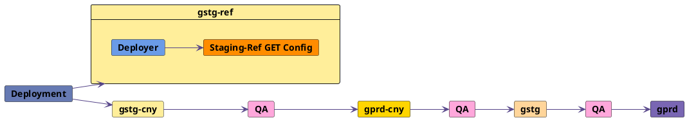

## Staging Ref

Staging Ref は、最新の Staging Canary コードを本番前テストするためのサンドボックス環境です。環境への完全なアクセスとデータ制御を持つことができます。

| **名前** | **URL** | **目的** | **デプロイ** | **データベース** | **ターミナルアクセス** | **Slack チャンネル** |
| ---- | --- | ------- | ------ | -------- | --------------- | --------- |
| Staging Ref | [staging-ref.gitlab.com](https://staging-ref.gitlab.com/users/sign_in) | 本番前テスト | 頻繁（`gstg-cny` と並行） | 独立したローカル | 全エンジニア | [`#staging-ref`](https://gitlab.slack.com/archives/C02LN0K1N3Y) |

### 目的

- エンジニアリング部門のテストニーズを本番に近い環境でカバーする
- 管理者テストアクセス
  - 現在の Staging（`gstg`）には顧客データが含まれており、エンジニアリングチームへのより多くのアクセス付与を妨げています。
- 異なる有料ティアのテスト
- テストの民主化とより良いテストデータ
- テストアカウントへのより良いアクセスとより広い権限
- エンジニア向けのパフォーマンスに優れたサンドボックス環境

### 環境情報

- [Geo](https://docs.gitlab.com/ee/administration/geo/) は以下の設定で Staging Ref にセットアップされています：
  - Staging Ref US サイト - *プライマリ* - [3k クラウドネイティブハイブリッドリファレンスアーキテクチャ](https://docs.gitlab.com/ee/administration/reference_architectures/3k_users.html#cloud-native-hybrid-reference-architecture-with-helm-charts-alternative) 環境 - ステートレスコンポーネント（Webservice、Sidekiq、NGINX）は Google Kubernetes Engine クラスターにデプロイされ、残りのステートフルコンポーネントは GCP 仮想マシンにインストールされています
  - Staging Ref EU サイト - *セカンダリ* - [3k リファレンスアーキテクチャ](https://docs.gitlab.com/ee/administration/reference_architectures/3k_users.html) 完全な Omnibus 環境
- [GitLab Environment Toolkit (GET)](https://gitlab.com/gitlab-org/gitlab-environment-toolkit) と [Deployer](https://ops.gitlab.net/gitlab-com/gl-infra/deployer) でデプロイ
- SSL 証明書は [Let's Encrypt](https://letsencrypt.org/) で自動化
- [Google OAuth](https://docs.gitlab.com/ee/integration/google.html) で GitLab チームメンバーの環境アクセスを提供
- [送信メール](https://docs.gitlab.com/charts/charts/globals.html#outgoing-email) は Mailgun で設定
- [高度な検索](https://docs.gitlab.com/ee/user/search/advanced_search.html) は Elasticsearch と [GET](https://gitlab.com/gitlab-org/gitlab-environment-toolkit/-/blob/main/docs/environment_advanced.md#advanced-search-with-elasticsearch) で設定
- デフォルトで [Free 有料プラン](#upgrade-paid-plans) の Ultimate ライセンス
- [Sentry](https://new-sentry.gitlab.net/organizations/gitlab/projects/staging-ref/) でエラーレポートを設定
- [Snowplow](https://docs.gitlab.com/ee/development/internal_analytics/internal_event_instrumentation/local_setup_and_debugging.html#configure-a-remote-event-collector) トラッキングが有効で、`snowplow.trx.gitlab.net` に収集されます
- [監査イベントストリーミング](https://docs.gitlab.com/administration/compliance/audit_event_streaming/#google-cloud-logging-destinations) が有効

#### デプロイプロセス

Staging Ref のデプロイは Staging Canary デプロイと並行して実行されます。[Deployer](https://ops.gitlab.net/gitlab-com/gl-infra/deployer) が [Staging-Ref GET Config](https://ops.gitlab.net/gitlab-org/quality/gitlab-environment-toolkit-configs/staging-ref) のジョブをトリガーして環境を更新します。新しいデプロイについての通知は [`#announcements`](https://gitlab.slack.com/archives/C8PKBH3M5) Slack チャンネルに送信されます。

Staging Ref パイプラインはデプロイをブロックしません。`gstg-ref` へのデプロイに失敗がある場合は、`@release-managers` に連絡してください。

### Staging Ref の使い方

Staging Ref は、最新の Staging（`gstg-cny`）コードをテストしたいエンジニア向けの安全なプレイグラウンドです。Staging Ref には、完全なサンドボックス環境として機能させるいくつかの利点があります：

- Staging Ref のデプロイはデプロイプロセスをブロックせず、GitLab エンジニアであれば誰でも調整または更新できます。そのため、GitLab エンジニアは広い権限を持ち、環境を完全に制御できます。
- 環境は 3k ハイブリッドアーキテクチャに従っているため、既存の Staging（`gstg`）よりも高性能で、必要に応じて負荷テストに使用できます。

環境にサインインするには、[staging-ref.gitlab.com](https://staging-ref.gitlab.com/users/sign_in) にアクセスし、「Sign in with Google」オプションで GitLab Google アカウントを使用してください。

サインイン後は、必要に応じて環境を使用できます。テスト後に環境に破壊的な変更が加えられたり、問題のある状態になった場合は、環境の再構築をリクエストしてください。[`#staging-ref`](https://gitlab.slack.com/archives/C02LN0K1N3Y) Slack チャンネルに連絡するか、[Staging-Ref GET Config](https://gitlab.com/gitlab-org/quality/gitlab-environment-toolkit-configs/staging-ref) で Issue を作成してください。プロセスは [Staging-Ref GET Config](https://gitlab.com/gitlab-org/quality/gitlab-environment-toolkit-configs/staging-ref) で自動化されており、完了まで約 1 時間かかります。

#### フィーチャーフラグの有効化

[ChatOps コマンド](/handbook/support/workflows/chatops/#feature-flags) を使用して、Staging Ref のフィーチャーフラグを有効または無効にできます。このコマンドは [`#staging-ref`](https://gitlab.slack.com/archives/C02LN0K1N3Y) Slack チャンネルで実行できます。

#### 管理者アクセス {#admin-access}

ユーザーを管理者に昇格させるには、1Password の `Engineering` ボールトの `Staging Ref credentials` から管理者アカウントを使用してサインインしてください。その後、[Admin Area のユーザーページ](https://docs.gitlab.com/ee/administration/admin_area.html#administering-users) に移動し、ユーザーのアクセスレベルを編集してください。

Staging Ref 環境は全エンジニアで共有されていることに注意してください。GitLab の Admin 設定を変更する予定がある場合は、[`#staging-ref`](https://gitlab.slack.com/archives/C02LN0K1N3Y) Slack チャンネルを使用して変更を広く周知してください。

#### SSH アクセスと Rails コンソール

ローカルに `gcloud` または `kubectl` がセットアップされている場合は、[ローカルターミナルから接続する](#connect-from-your-local-terminal) に従ってください。そうでない場合は、[ブラウザ経由で接続する](#connect-via-your-browser) を選択できます。

##### ブラウザ経由で接続する {#connect-via-your-browser}

1. [GCP プロジェクト `gitlab-staging-ref` へのアクセスを取得する](#request-access-to-gcp-project-and-environment)
1. `gitlab-staging-ref` プロジェクトの [`gitlab-toolbox`](https://console.cloud.google.com/kubernetes/deployment/us-east1/staging-ref-3k-hybrid-us/default/gitlab-toolbox/overview?project=gitlab-staging-ref) ワークロードにアクセスしてください
1. **管理対象 Pod** セクションで、実行中の Pod の **名前** をクリックします。例えば、**名前** は `gitlab-toolbox-5955db475c-ng2xr` のようになります。
1. 上部付近にある **Kubectl** ドロップダウンをクリックしてください
1. **Exec** にカーソルを合わせてサブメニューを表示してください
1. **toolbox** をクリックしてください
1. Cloud Shell が起動します
1. コマンド `kubectl exec -it gitlab-toolbox-5955db475c-ng2xr -- bash`（toolboxは異なるサフィックスを持ちます）を編集し、[インタラクティブおよび TTY オプション](https://docs.docker.com/reference/cli/docker/container/exec/) で `bash` コマンドを実行します。
1. この時点で、toolbox Pod にログインしているはずです。Rails コンソールを使用するには、`gitlab-rails console` を実行します。
1. 詳細は [Kubernetes チートシート](https://docs.gitlab.com/charts/troubleshooting/kubernetes_cheat_sheet.html#gitlab-specific-kubernetes-information) を参照してください

##### ローカルターミナルから接続する {#connect-from-your-local-terminal}

1. [staging-ref クラスター](https://console.cloud.google.com/kubernetes/clusters/details/us-east1-c/staging-ref-3k-hybrid-us/details?project=gitlab-staging-ref&cloudshell=false) または [staging-ref geo クラスター](https://console.cloud.google.com/kubernetes/clusters/details/europe-west6-c/staging-ref-3k-hybrid-eu/details?cloudshell=false&project=gitlab-staging-ref) に移動してください
1. **Connect** をクリックしてください
1. コマンドをコピーし、ローカルで実行して `kubeconfig` を取得してください
1. [Kubernetes チートシート](https://docs.gitlab.com/charts/troubleshooting/kubernetes_cheat_sheet.html#gitlab-specific-kubernetes-information) に従ってください
1. [追加の開発者ツール](https://docs.gitlab.com/charts/development/environment_setup.html#additional-developer-tools) も参照してください

#### GCP プロジェクトと環境へのアクセスをリクエストする {#request-access-to-gcp-project-and-environment}

GCP プロジェクト（`gitlab-staging-ref`）の Staging Ref コンポーネントへのアクセスが必要な場合は、`#staging-ref` Slack チャンネルに連絡してください。[`gcp-staging-ref-sg@gitlab.com` Google グループ](https://groups.google.com/a/gitlab.com/g/gcp-staging-ref-sg/members) に追加してもらえます。

もう一つの方法として、[access-request プロジェクト](https://gitlab.com/gitlab-com/team-member-epics/access-requests/-/issues/new?issuable_template=Individual_Bulk_Access_Request) で Issue を作成できます。サーバー環境へのアクセスリクエストには、マネージャーとインフラストラクチャマネージャーの承認が必要です。

GitLab の設定変更は環境への新しいデプロイによって上書きされることに注意してください。環境の更新は、`#staging-ref` Slack チャンネルで `@release-managers` にリクエストすることでロックできます。

#### E2E テストパイプラインのトリガー

[staging-ref](https://ops.gitlab.net/gitlab-org/quality/staging-ref/-/pipeline_schedules) プロジェクトで、フルまたはスモーク E2E テストスイートをオンデマンドでトリガーできます。結果は `#staging-ref` Slack チャンネルにも投稿されます。

#### モニタリング

モニタリングの実装は ([epic#594](https://gitlab.com/groups/gitlab-com/gl-infra/-/epics/594)) で行われました。ドキュメントは [runbooks](https://gitlab.com/gitlab-com/runbooks/-/blob/master/docs/staging-ref/get-monitoring-setup.md) に記載されています。

Staging Ref のダッシュボードは、Grafana の [staging-ref フォルダー](https://dashboards.gitlab.net/d/Fyic5Wanz/server-performance?orgId=1) で確認できます。`environment=gstg-ref` を選択すると、Staging Ref の情報を表示する既存のダッシュボードが他にもあります。

Geo セカンダリサイトでは、<https://geo.staging-ref.gitlab.com/-/grafana> で Grafana が動作しています。認証情報は 1Password の `Engineering` ボールト内の `Staging Ref credentials` の `EU site monitoring` セクションで確認できます。

特定のダッシュボードが必要な場合や既存のダッシュボードが動作しない場合は、[`#staging-ref`](https://gitlab.slack.com/archives/C02LN0K1N3Y) チャンネルに連絡してください。

#### 有料プランのアップグレード {#upgrade-paid-plans}

デフォルトでは、すべてのユーザーとグループは `Free` プランです。有料プランにアップグレードするには、[管理者アカウント](#admin-access) を使用して以下の手順を実行してください：

1. [Admin エリア](https://docs.gitlab.com/ee/administration/) に移動してください。
1. アップグレードしたいエンティティに応じて、Users または Groups セクションを選択してください。
1. 名前でユーザーまたはグループを検索し、「Edit」をクリックしてください。
1. 「Plan」で必要な有料プランを選択してください。
1. 「Save changes」をクリックしてください。

グループが Premium プランに昇格された例を確認するには、[このデモ](https://gitlab.com/gitlab-org/gitlab/uploads/43733f0e0b58ded0e964909cfe4489e8/admin_paid_plan.gif) を参照してください。

#### 既存のテストアカウント

Staging Ref 環境には、テストに使用できる既存のアカウントがあります。例えば、異なる有料プランの管理者アカウント、監査ユーザー、QA ユーザーなどです。すべての認証情報は 1Password の `Engineering` ボールトの `Staging Ref credentials` に保存されています。

#### SAML SSO が有効なグループでの作業

Okta アプリケーションが [https://staging-ref.gitlab.com/groups/saml-sso-group](https://staging-ref.gitlab.com/groups/saml-sso-group) の SAML IdP として機能するように設定されています。
`gitlab-qa-saml-sso-user1` と `gitlab-qa-saml-sso-user2` という名前の 2 人のユーザーが作成され、Okta に追加されてアプリケーションに割り当てられています。これらのユーザーは staging-ref 環境でも使用できます。

以下に記載されているフィールドのすべての認証情報と値は、1Password Engineering Vault の「Staging Ref credentials」の「User credentials for saml-sso-group Group」に保存されています。

SAML SSO を使用するには：

1. [管理者](#admin-access) として、[https://staging-ref.gitlab.com/groups/saml-sso-group](https://staging-ref.gitlab.com/groups/saml-sso-group) にグループが存在しない場合は作成してください。
1. このグループの[料金プランをアップグレード](#upgrade-paid-plans)して「Premium」にしてください。
1. [https://staging-ref.gitlab.com/groups/saml-sso-group/-/saml](https://staging-ref.gitlab.com/groups/saml-sso-group/-/saml) にアクセスして：

   - 「Enforce SSO-only authentication for web activity for this group」にチェックを入れてください
   - 「Identity provider single sign-on URL」の値を 1Password に保存されている値に更新してください
   - 「Certificate fingerprint」の値を 1Password に保存されている値に更新してください

1. 変更を保存してください。
1. サインアウトしてください。

[https://staging-ref.gitlab.com/groups/saml-sso-group](https://staging-ref.gitlab.com/groups/saml-sso-group) に最初にアクセスしてログインしようとすると、SAML ID をリンクするために既存のアカウントで GitLab にサインインするように求められます。ユーザー名 `gitlab-qa-saml-sso-user1` または `gitlab-qa-saml-sso-user2` を使用してサインインします。認証情報は 1Password にあります。

### 将来のイテレーションと既知の制限事項

Staging Ref 環境にはいくつかの既知の制限事項があります：

- テストデータの設定（[epic#7020](https://gitlab.com/groups/gitlab-org/-/epics/7020)）
- 共有ランナーの設定（[issue#353284](https://gitlab.com/gitlab-org/gitlab/-/issues/353284)）
- Staging Ref の Kibana（[issue#351816](https://gitlab.com/gitlab-org/gitlab/-/issues/351816)）
- 受信メールのセットアップ（[issue#348970](https://gitlab.com/gitlab-org/gitlab/-/issues/348970)）
- Staging Ref での統合 URL（[issue#370312](https://gitlab.com/gitlab-org/gitlab/-/issues/370312)）
- staging-ref Pages のワイルドカード TLS サポートの設定（[issue#21421](https://gitlab.com/gitlab-com/gl-infra/delivery/-/issues/21421)）

### フィードバック

Staging Ref に追加のカスタム設定が必要な場合、または他のフィードバックや改善のアイデアがある場合は、[`#staging-ref`](https://gitlab.slack.com/archives/C02LN0K1N3Y) Slack チャンネルに連絡するか、[機能リクエスト](https://gitlab.com/gitlab-com/gl-infra/delivery/-/issues/new?description_template=staging-ref-feature-request) を作成してください。
