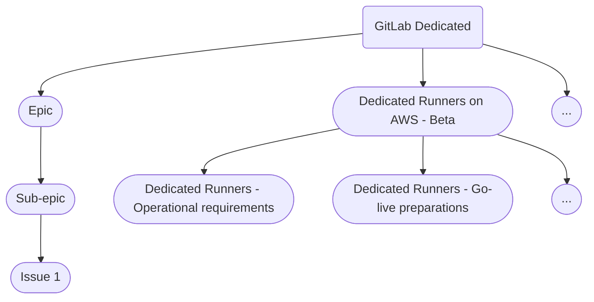

## ミッション

GitLab Dedicated チームのミッションは、GitLab Dedicated プラットフォームを通じて提供される、完全にマネージドなシングルテナント GitLab 環境を作り出すことです。顧客テナントのインストールとの手動的なインタラクションをすべて排除し、顧客テナントが The One DevOps Platform の力を最大限に活用することに完全に集中できるようにするために開発されています。

## ビジョン

GitLab Dedicated グループは顧客向けチームであり、チームメンバーは高度なインフラストラクチャ自動化と、顧客が GitLab Dedicated プラットフォームとインタラクションできるようにすることに注力しています。

チームのミッションは：

- 多数のシングルテナント GitLab サイトをプロビジョニングするための 100% 自動化されたシステムを開発する
- 上記サイトの保守タスクを人間の介入なしで自動化する
- 中央のオブザーバビリティスタック、および顧客テナントごとのオブザーバビリティスタックを作成・管理する
- 顧客テナントに管理操作を公開するカスタマーポータル（Switchboard）を作成する

## GitLab Dedicated アーキテクチャ

GitLab Dedicated アーキテクチャのドキュメントは [アーキテクチャページ](architecture/index.html) を参照してください。

## パフォーマンス指標

チームのパフォーマンス指標はまだ完全には定義されていません。**プロビジョニング SLO** から始めることを検討しており、その後 [DORA 4 メトリクス](https://cloud.google.com/blog/products/devops-sre/using-the-four-keys-to-measure-your-devops-performance) が続く可能性があります。

## チームメンバー

GitLab Dedicated のエンジニアリングチームメンバーは、主なタスクに基づいて `Environment Automation`、`Switchboard`、または `US Public Sector Services` チームの専門として公開的に参照されています。

以下のメンバーは Dedicated:Environment Automation チームです：


<p class="my-3 text-sm text-gray-600 italic">チームメンバー情報は <a href="https://handbook.gitlab.com/handbook/engineering/infrastructure-platforms/gitlab-dedicated/#team-members" rel="external noopener">原文 (英語)</a> を参照してください。</p>


<p class="my-3 text-sm text-gray-600 italic">チームメンバー情報は <a href="https://handbook.gitlab.com/handbook/engineering/infrastructure-platforms/gitlab-dedicated/#team-members" rel="external noopener">原文 (英語)</a> を参照してください。</p>


<p class="my-3 text-sm text-gray-600 italic">チームメンバー情報は <a href="https://handbook.gitlab.com/handbook/engineering/infrastructure-platforms/gitlab-dedicated/#team-members" rel="external noopener">原文 (英語)</a> を参照してください。</p>


以下のメンバーは Dedicated:US Public Sector Services チームです：


<p class="my-3 text-sm text-gray-600 italic">チームメンバー情報は <a href="https://handbook.gitlab.com/handbook/engineering/infrastructure-platforms/gitlab-dedicated/#team-members" rel="external noopener">原文 (英語)</a> を参照してください。</p>


以下のメンバーは Dedicated:Switchboard チームです：


<p class="my-3 text-sm text-gray-600 italic">チームメンバー情報は <a href="https://handbook.gitlab.com/handbook/engineering/infrastructure-platforms/gitlab-dedicated/#team-members" rel="external noopener">原文 (英語)</a> を参照してください。</p>


## 私たちとの連携

GitLab Dedicated チームと連携するには：

- GitLab Dedicated チームの Issue トラッカーで [Issue を作成](https://gitlab.com/gitlab-com/gl-infra/gitlab-dedicated/team/-/issues/new) してください
  - 機能リクエストの場合は、[機能リクエスト Issue テンプレート](https://gitlab.com/gitlab-com/gl-infra/gitlab-dedicated/team/-/blob/main/.gitlab/issue_templates/feature_request.md) を使用して必要な情報を記入してください
- Issue を作成する際は、誰かを `@`メンションする必要はありません
- 注目を得たい場合は、[以下のグループ階層](#gitlab-group-hierarchy) で定義されている特定のチームハンドルを使用してください
- 数時間から数日以内に支援が必要な場合：
  - [Request For Help (RFH)](/handbook/support/workflows/how-to-get-help/#the-request-for-help-landing-page) プロセスに従ってください。特定のテンプレートは[こちら](https://gitlab.com/gitlab-com/request-for-help#infrastucture-section) から探してください。
  - 緊急の顧客影響のある Issue については、以下の[セクション](/handbook/engineering/infrastructure-platforms/gitlab-dedicated/#urgent-availability-or-security-events) に従ってください
- Slack チャンネル
  - GitLab Dedicated 固有の質問については [#f_gitlab_dedicated](https://gitlab.slack.com/archives/C01S0QNSYJ2) で私たちを見つけられます
  - Dedicated グループは内部的に [#g_dedicated-team](https://gitlab.slack.com/archives/C025LECQY0M) を活用しています
  - Dedicated 内のエンジニアリングチームにはチームの作業ディスカッション用の独自の作業チャンネルがあります：
    - [#g_dedicated-environment-automation-team](https://gitlab.enterprise.slack.com/archives/C074L0W77V0)
    - [#g_dedicated-switchboard-team](https://gitlab.slack.com/archives/C04DG7DR1LG)
    - [#g_dedicated-us-pubsec](https://gitlab.slack.com/archives/C03R5837WCV)
  - ソーシャルチャンネル [#g_dedicated-team-social](https://gitlab.slack.com/archives/C03QBGQ3K5W) は、チームとカジュアルに交流したい方なら誰でもアクセスできます

### 緊急の可用性またはセキュリティイベント

[Sev-1 または Sev-2 インシデント](/handbook/engineering/infrastructure-platforms/incident-management/#severities) の場合は、GitLab Dedicated のオンコールエンジニアに *ページ* してください。これをいつ使用するかについての詳細なガイダンスは[こちら](https://gitlab.com/gitlab-com/gl-infra/gitlab-dedicated/team/-/blob/main/runbooks/on-call.md#what-is-an-emergency) で確認できます。

#### コマーシャル向け Dedicated

1. 任意の Slack チャンネルから `/inc escalate` を使用：
   1. `On-Call Teams` の下で `dedicated EOC` を選択
   1. `Notification Message` にレポートの情報を入力
   1. *Urgency*、*Priority*、*Assign To* は設定しない

#### 政府向け Dedicated

1. 任意の Slack チャンネルから `/pd trigger` を使用：
   1. Impacted Service: `Dedicated US Public Sector Platform Service`
   1. Title: `GitLab Dedicated`
   1. Description: レポートの情報と連絡方法を入力
   1. *Urgency*、*Priority*、*Assign To* は設定しない

### エスカレーションポリシー

顧客サポート Issue のエスカレーションに関しては、Dedicated 顧客は優先サポートを受けるため、[Support が提供する](https://about.gitlab.com/support/definitions/#definitions-of-support-impact) セベリティの定義と同じものに従います。[可用性またはセキュリティ sev-1](/handbook/product-development/how-we-work/issue-triage/#severity) イベントの場合のみ、Support レベルで Sev-1 にエスカレーションできます。「通常業務」の設定変更は sev-1 にエスカレーションできません。sev-1 の場合は、これらのインシデントが顧客への可用性 SLA コミットメントに影響する可能性があるため、オンコールエンジニアを関与させます。Sev-2 以下は通常の営業時間中にチームが対応します。サポートチケットの一環として特定された修正が即座に適用される必要がある場合は「緊急メンテナンス」と見なされ、通常のメンテナンスウィンドウ外で実施できます。その他すべての修正は次回の利用可能なメンテナンスウィンドウ中に行われます。

### テナント環境の設定変更の処理

顧客はプロダクション環境で Dedicated インスタンスを使用できるようになる前に、その設定をカスタマイズする必要があります。
これらのカスタマイズには、IP 許可リストやクラウド固有のプライベートネットワーク設定などのインフラレベルの設定、および現在管理 UI でセルフサービスできない SAML 設定変更などの GitLab アプリケーション設定など、[Dedicated でサポートされている機能](https://docs.gitlab.com/ee/subscriptions/gitlab_dedicated/#available-features) の設定変更が含まれます。

Dedicated 内で現在サポートされていない機能をリクエストするには、[機能リクエスト Issue テンプレート](https://gitlab.com/gitlab-com/gl-infra/gitlab-dedicated/team/-/blob/main/.gitlab/issue_templates/feature_request.md) を使用して機能リクエストを作成する必要があります。より広範な GitLab アプリケーションの機能をリクエストするには、[機能提案](https://gitlab.com/gitlab-org/gitlab/-/blob/master/.gitlab/issue_templates/Feature%20Proposal%20-%20lean.md) テンプレートを使用できます。

長期的には、顧客管理者が Switchboard カスタマーポータルを使用してセルフサービスで設定変更を行えるようになります。短期的には、SRE が変更を行い顧客の環境にデプロイする必要があります。このプロセスを以下に示します。

- オンボーディング中（インスタンス引き渡し前）
  - プラットフォームにオンボーディングする新しい顧客をサポートするために、SRE を 1 名配置します。SRE はオンボーディング日（顧客契約に記載されている `start date`）の 1 週間前から対応可能で、環境に必要な設定変更を行います。
  - オンボーディング中に設定変更をリクエストするには、共有コラボレーションプロジェクトで新しい Issue を開くことができます。PM が顧客のリクエストを受け取り、Dedicated チームプロジェクト内で Issue を作成し、プロジェクトワークフローに従ってラベルを付け、担当の SRE を `@`メンションします。SRE は Issue を自分に割り当てて変更を実施します。
  - なお、オンボーディング中の設定変更は、まだ契約上の開始日前であるため、Dedicated チームにエスカレーションできません。[エスカレーションポリシー](#escalation-policy) の詳細については以下を参照してください。
- インスタンス引き渡し後
  - `start date` 後に必要な設定変更は、次の利用可能な週次メンテナンスウィンドウでバッチ処理されます。メンテナンスウィンドウ開始の 2 営業日前が変更の締め切りです。
  - 特定のメンテナンスウィンドウに設定変更が含まれることを保証することはできません。4 時間のメンテナンスウィンドウを超える可能性のある作業量が多い場合、設定変更は次のウィンドウに延期される場合があります。このような場合は、リクエスト Issue でお知らせします。
  - 初回オンボーディング後に設定変更をリクエストするには、サポートチケットを作成する必要があります。担当のサポートエンジニアが Dedicated Issue トラッカーでリクエストの新しい Issue を開きます。変更管理の目的で、内部 Issue に ZD チケットへのリンクがあることを確認してください。この顧客の次回メンテナンスを担当する SRE が Issue に大まかな ETA を返信し、変更がデプロイされたら再度返信します。これが開発作業を必要とする変更の場合、SRE は PM/EM に報告します。
  - オンボーディング後は、テナントインスタンスがオンラインであることを確保する設定のみ設定変更リクエストのエスカレーションが可能です。「通常業務」の変更は、オンボーディング時に提供される顧客プロジェクト計画を使用して十分前もってスケジュールされる必要があります。エスカレーションポリシーの詳細については以下を参照してください。

#### Production Change Lock (PCL)

私たちが行う変更は厳密にテストされ慎重にデプロイされますが、
GitLab Summit、主要なグローバル祝日、
その他 GitLab チームメンバーの可用性が大幅に低下する特定のイベント中は、
本番環境の変更を一時的に停止することが良い慣行です。

これらの期間中に本番環境の変更を行うリスクには、即時の顧客影響やインシデント発生時のエンジニアリングチームの可用性低下が含まれます。
そのため、GitLab Dedicated に Production Change Lock (PCL) というメカニズムを導入しました。

GitLab Dedicated の Production Change Lock は [GitLab.com の PCL](/handbook/engineering/infrastructure-platforms/change-management/#production-change-lock-pcl) から大きく着想を得ていますが、いくつかの注目すべき違いがあります。

PCL は以下の要件が満たされた場合に手動で実施されます：

1. PCL 期間を説明する PCL [Issue](https://gitlab.com/gitlab-com/gl-infra/gitlab-dedicated/team/-/issues/10237) が作成される。
2. スケジュールされた PCL テーブルを更新する MR がインフラストラクチャプラットフォームエンジニアリングディレクターによって承認される。
3. PCL 期間中、Switchboard を使用した顧客の変更が防止される。

以下の日程が現在スケジュールされている PCL です。

| プラットフォーム | 日程 | タイプ | 理由 |
|-----------------------------------|----------------------------------------------|--------|---------------------------------------------------|
| Dedicated for Gov | 2026-07-20 01:00 UTC -> 2026-07-27 01:00 UTC | Hard | 2026 R&D Summit（チームメンバーの可用性低下） |
| Dedicated Commercial | 2026-07-20 01:00 UTC -> 2026-07-27 01:00 UTC | Hard | 2026 R&D Summit（チームメンバーの可用性低下） |

時間が指定されていない日程は 09:00 UTC に始まり、翌日の 09:00 UTC に終了します。

GitLab.com の [PCL](/handbook/engineering/infrastructure-platforms/change-management/#production-change-lock-pcl) とは異なり、GitLab Dedicated では Hard PCL タイプのみを考慮します。

##### Hard PCL

Hard PCL には以下が含まれます：

- Switchboard を使用した顧客の変更
- すべてのコードデプロイとインフラストラクチャ変更
- UAT、PreProd、Production 環境での自動メンテナンスを含む

Hard PCL 中は新規顧客のオンボーディングは行いません。

アクティブな S1/S2 インシデントの場合、インシデントを軽減または解決するために必要な変更を適用するかどうかは EOC（オンコールエンジニア）の判断に委ねられ、サービスの可用性を維持するために変更を適用することができます。
PCL 中のインシデント時のアクションは Issue に関連付け、EOC は GitLab Dedicated エンジニアリングリーダーシップに実施したアクションを報告する必要があります。

インシデントに関連しない変更には、GitLab Dedicated エンジニアリングリーダーシップによる免除承認が必要です。

### ログへのアクセスのリクエスト

GitLab Dedicated はテナント環境に対する厳格な[アクセス制御](https://docs.gitlab.com/ee/subscriptions/gitlab_dedicated/#access-controls)を備えています。
デフォルトでは、GitLab Dedicated ログは GitLab Dedicated とサポートエンジニアリングチームのメンバーのみがアクセスできます。GitLab Dedicated の顧客がログの確認を要する追加チームメンバーを必要とする Issue の影響を受けている場合、アクセスはケースバイケースで付与できます。例として、他の部門のバックエンドエンジニアやセキュリティエンジニアなどがありますが、これらに限定されません。

アクセスは以下にのみ付与されます：

1. 個々のチームメンバー
1. 定義された期間（デフォルト：2 営業週間）
1. すべてのアクセスリクエストには Dedicated チームのエンジニアリングマネージャーまたはディレクター、およびリクエストするチームメンバーの直属マネージャーの承認が必要
1. 延長には Dedicated チームのエンジニアリングマネージャーまたはディレクター、およびリクエストするチームメンバーの直属マネージャーの承認が必要

アクセスを取得するには、以下を作成してください：

1. [アクセスリクエスト](https://gitlab.com/gitlab-com/team-member-epics/access-requests/-/issues/new?issuable_template=Individual_Bulk_Access_Request)。システムとして `GitLab Dedicated Logs (Production)` を使用してください。
1. `Log rotation access` テンプレートを使用して [GitLab Dedicated トラッカー](https://gitlab.com/gitlab-com/gl-infra/gitlab-dedicated/team/-/issues/new?issuable_template=log_access_rotation) で Issue を作成する。

## GitLab 全体での連携

### GitLab Dedicated 顧客とのコミュニケーション

一人または複数の GitLab Dedicated 顧客に緊急に連絡する必要がある場合は、
[GitLab Dedicated Communications Manager On-Call (CMOC)](/handbook/support/workflows/dedicated_cmoc/) に連絡してください。

緊急でないコミュニケーションは、顧客の Customer Success Manager (CSM) を通じて処理してください。

### GitLab Dedicated への製品修正の迅速な取り込み


{}
このセクションは、GitLab Dedicated インシデント管理プロセスページが利用可能になった際にそこへ移動される予定です。
{}


製品修正が GitLab Dedicated のインシデントや
[顧客エスカレーション](#escalation-policy) を解決するために導入されることがあります。
[アップグレードポリシー](https://docs.gitlab.com/ee/subscriptions/gitlab_dedicated/#upgrades) のため、
製品修正がマージされてから GitLab Dedicated 環境にデプロイされるまでに大幅な遅延が生じる場合があります。

このような場合は、遅延の影響を評価し、正当化される場合は
[バックポートリクエストプロセス](/handbook/engineering/releases/backports/) を使用して
製品修正を許容できる時間枠内に GitLab Dedicated 環境にデプロイできる GitLab バージョンへのバックポートをリクエストしてください。

## 作業方法

GitLab Dedicated は GitLab 内および広い市場で高い注目を集めています。また、複雑なサービス提供でもあります。その結果、Dedicated チームは自チームの作業と外部・内部のステークホルダーの期待を管理する必要があります。以下のセクションでは、チームが効率的かつ効果的に作業するために採用したプロセスとツールについて説明します。

これらのプロセスが重要なのは、製品の状態と進行中の作業を明確に理解できる方法を提供し、チームメンバーがそれぞれの役割を果たせるようにするためです。

これらのプロセスを設計する主な目標は、GitLab Dedicated のどの部分に携わるすべてのチームメンバーが、自分の作業が**なぜ**重要で、どのように顧客の成果に貢献するかを理解できるようにすることです。

以下のプロセスはすべてのチームメンバーが理解し、自分たちで責任を持つことが重要です。

### ミーティングと定期通話

私たちは、[プロジェクト管理セクション](#project-management) で説明されているプロジェクト Issue トラッカー内で非同期的に作業することを優先しています。

チームには一連の定期的な同期通話があります：

- `デモコール` - この通話は 2 週間ごとにタイムゾーンをローテーションしながら開催されます。この通話では、チームメンバーが進捗を披露し、GitLab Dedicated プラットフォームに関連するトピックについて他のチームメンバーと交流します。デモコールは荒削りで洗練されていなくても構いません。実際、デモが洗練されて見える場合は、目標が十分に野心的かどうかを議論します
- Dedicated 内のチームには独自の `チームシンク` がある場合があります
- 個別コントリビューターとエンジニアリングマネージャー間の 1-1

グループには PM と EM のアライメントを確保するための定期的な同期通話があります：

- `GitLab Dedicated Product <> Eng Sync` - この通話は月曜日と木曜日に週次で開催され、PM と EM がアライメントを確保します
- `Dedicated Managers Sync` - この通話は 2 週間ごとに Dedicated EM が同期してアライメントを確保します

主催者は、主催者が不在の場合でもこれらの通話を録画できるように [Zoom で「Alternative Hosts」を有効化](/handbook/security/corporate/end-user-services/supported-apps/zoom/zoom-recording/#how-to-allow-recording-when-the-host-is-not-present) することが責任です。

GitLab Dedicated の作業に関する個人間の即興 Zoom ミーティングは必要に応じて作成されます。
これらのミーティングはプライベートストリーミング、または録画（1*）され、[GitLab Unfiltered プレイリスト](https://www.youtube.com/playlist?list=PL05JrBw4t0KqC5FfUVPyndvLvTWifWbfB) にアップロードされることが期待されます。
通話の結果は永続的な場所で共有されます（Slack は永続的ではありません）。これは、早期段階で行われた決定が後でチームが大きくなった際に疑問視されるため、特にチームの成長とともに重要です。

`1*` 録画ルールの例外は：1-1 通話、プロジェクト以外の作業に関する議論、当事者が録画に不快感を感じる場合。ただし、例外があっても、プロジェクト関連の議論の結果は、メインの Issue トラッカーなどの永続的な場所に記録する必要があります。

### 顧客情報の保護

GitLab の [機密レベル](/handbook/communication/confidentiality-levels/) では、明示的な許可なく顧客を公開的に特定してはなりません。

特定の顧客を参照する必要がある場合は、以下のガイドラインを使用します：

| ユースケース | 例 | プロセス |
|----------------------------------------|----------------------------------------------------------------------------|-----------------------------------------------------------------------------------------------------------------------------------------------------------------------------------------------------------------------------------------------------------------------------------------------------------------------------------------------------------------------------|
| 内部コミュニケーションとコラボレーション | Slack 会話、RFH (Request for Help) Issue | <ul><li>顧客名を使用する</li></ul> |
| 公開コラボレーション | Issue（SIRT Issue を含む）、エピック、録画通話へのコラボレーション | <ul><li>顧客名を公開で使用することを避ける。代わりに内部メモを使用するか、誰もが Switchboard にアクセスできるわけではないことを覚えておきながら、識別に役立つアクセス可能な内部リンクを提供する</li><li>録画通話で顧客名が言及された場合、動画をプライベートに設定し、YouTube の説明に理由を記載する</li></ul> |
| 実装レベル | Tech Stack 内でコードネームを tenant_id にマッピングする必要がある場合 | <ul><li>このユースケースには内部コードネームを使用する。</li><li>Switchboard が内部コードネームの SSOT。</ul></li> |

### GitLab グループ階層

GitLab Dedicated プロジェクトに携わるチームメンバーを論理的に整理するために [GitLab グループ](https://docs.gitlab.com/ee/user/group/#groups) を使用しています。
グループは以下のユースケースをカバーしています：

1. GitLab Dedicated グループメンバーシップ: `@gitlab-dedicated`
    - GitLab Dedicated チームの任意のメンバーとして永続的なチームメンバーは、オンボーディングの一環としてこの GitLab グループへのアクセスを取得します
    - グループメンションは、共有される情報が GitLab Dedicated グループのすべてのチームメンバーに関連する場合にのみ使用すること
1. 個別チームグループメンバーシップ: `@gitlab-dedicated/environment-automation`、`@gitlab-dedicated/switchboard`、`@gitlab-dedicated/uspubsec` など
    - 個別チームの永続的なチームメンバーは、オンボーディングの一環としてそれぞれの GitLab グループへのアクセスを取得します
    - グループメンションは、共有される情報がそれぞれのチームに関連する場合に使用すること
1. 個別チームの GitLab Dedicated グループには `maintainers` と `reviewers` という 2 つの追加サブグループがあります。例えば: `@gitlab-dedicated/switchboard/maintainers`
    - `reviewers` GitLab グループアクセスは、永続的なチームメンバー、外部コントラクター、借用中のチームメンバーなどに付与されます。この GitLab グループタイプはマージ権限のないユーザーを区別するために使用されます。初期レビューはこのグループにリクエストすることが推奨されます。例えば、クイックアクション `/assign_reviewer @gitlab-dedicated/switchboard/reviewers` を使用します
    - `maintainers` GitLab グループは永続的なチームメンバーのみに付与されます。このグループにはマージ権限があり、[CODEOWNERS 承認ルール](https://docs.gitlab.com/ee/user/project/codeowners/#code-owners) を通じてアクセスが付与されます。チームメンバーは [Dedicated Maintainer Training](https://gitlab.com/gitlab-com/gl-infra/gitlab-dedicated/team/-/blob/main/.gitlab/issue_templates/maintainer_training.md)（内部のみ）で定義された要件を満たした後、`maintainer` サブグループにオンボーディングされます

### プロジェクト管理

作業を整理するためにエピック、Issue、Issue/エピックボードを使用しており、これらは互いを補完し合います。

以下を参照してください：

1. [インフラストラクチャプラットフォーム プロジェクト管理](/handbook/engineering/infrastructure-platforms/project-management)
1. [インフラストラクチャプラットフォーム エピック](https://gitlab.com/groups/gitlab-com/-/epics/2115)
1. [Environment Automation エピック](https://gitlab.com/groups/gitlab-com/gl-infra/-/epics/479)
1. [Switchboard エピック（現在の四半期にスコープ）](https://gitlab.com/groups/gitlab-com/gl-infra/gitlab-dedicated/-/epics/405)
1. [US Public Sector エピック](https://gitlab.com/groups/gitlab-com/gl-infra/-/epics/876)

#### エピック階層

より大きなエピックを小さな部分に分割するためにサブエピックを使用します。

1. サブエピックはメンションされた項目を提供するために必要なタスクをグループ化します
1. サブエピックはロードマップの項目を表し、特定のフェーズで提供されます
1. サブエピックは複数月にわたる場合がありますが、終了日は追加されたロードマップフェーズの「予定完了日」と一致する必要があります

以下の図は完全な階層をトラバースする例を示しています：



*注* 図が表示されない場合は、すべての Cookie を承認していることを確認してください。

#### エピックオーナー

各エピックには、プロジェクトの提供に責任を持つ単一の DRI がいます。各エピックの DRI はエピック構造に従って各エピックの説明の冒頭に記載されています。エピック DRI の責任は [https://handbook.gitlab.com/handbook/engineering/infrastructure-platforms/gitlab-dedicated/#epic-owner-responsibilities](/handbook/engineering/infrastructure-platforms/gitlab-dedicated/#epic-owner-responsibilities) にあります

1. エンジニアリングエピック DRI は [GitLab Dedicated エピック](https://gitlab.com/groups/gitlab-com/gl-infra/-/epics/479) の子エピック内に記載されています。

#### エピックオーナーの責任

DRI は以下を行う必要があります：

1. Issue をボード上で移動させるために他者と協力する
1. エピックが [エピック構造](/handbook/engineering/infrastructure-platforms/gitlab-dedicated/#epic-structure) で概説された基準を満たしていることを確認する
1. 以下の [ステータス更新プロセス](/handbook/engineering/infrastructure-platforms/gitlab-dedicated/#status-update-process) で概説されたプロセスに従って、エピック説明に DRI のエピックの更新を提供する。

プロジェクト全体を通じて、DRI はエピックの説明と構造を継続的に調整して、プロジェクトの現在の状態を最新に保つ必要があります。

#### エピック構造

各エピックと子サブエピックには以下が含まれている必要があります：

**説明**（TBD エピックテンプレートを作成）

1. このエピックに責任を持つ **DRI**。
1. エピックを理解しようとしている人々にコンテキストを提供するための問題ステートメントを含む **背景**。
1. エピックの具体的な目標の **終了基準**。
1. **ステータス yyyy-mm-dd** は説明の最後の見出しである必要があります。
    1. これにより、エピックに関心のある人々が、エピックに添付されたすべてのコメントや Issue を読まずに最新のステータスを確認できます。
    1. この見出しは、トップレベルエピックのステータス情報を自動生成するために使用されます。

**エピックメタデータ**

1. **開始日** は予定開始日に設定され、プロジェクト開始時に実際の開始日に更新されます。
1. **期限** は予定終了日に設定されます。
    1. プロジェクトが実際に終了した日付は、エピックが閉じられた日付から取得されます。

ラベルは [エピックラベルセクション](#epics-labels) で説明されています。

#### エピックボード

エピックボードはエピックの全体的なステータスを追跡するために使用されます。DRI は、適切なプロジェクトボードを作成できるように必要なプロジェクトラベルを作成することを推奨します。

#### 機能ロールアウトの計画

すべての重要な変更には、[rollout_coordination テンプレートを使用したロールアウト Issue](https://gitlab.com/gitlab-com/gl-infra/gitlab-dedicated/team/-/issues/new?issuable_template=rollout_coordination) が必要です。この Issue は、テストカバレッジ、ロールアウトのタイミングのレビュー、および必要な顧客コミュニケーションの計画に使用されます。

#### プロジェクトステージ

プロジェクトは一般的に以下のステージに従います：

- Beta
- Limited Availability
- General Availability (GA)
- Post-GA

#### Issue

Dedicated チームのプロジェクトはアジャイル的な方法論を使用しています。

1. チームメンバーは ~"workflow-infra::Ready" とマークされた Issue から始める必要があります。
1. GitLab は非同期の作業環境であり、コードレビューはレビュアーが他のタイムゾーンにいるため時間がかかる場合があります。チームメンバーは保留中のコードレビューを確認し、タスクが完全に完了していなくても、容量があると感じる場合は 2 番目のタスクを開始することを推奨します。例えば、最終承認を待つレビュープロセス中に、チームメンバーは別のタスクを開始できます。通常のアジャイル同期セレモニー（スタンドアップ、レトロなど）は行いませんが、週に短い「チームシンク」通話が行われることがあり、ライブトラブルシューティングやペアリングなどの活動は禁止されていません。
1. 新しいタスクを開始する際：
    - 自分自身を Issue に割り当て、~"workflow-infra::In Progress" ラベルを適用する。
    - まず必要な追加情報を収集し、問題を明確にするために Issue に質問を投稿する。
1. タスクが進行中の場合：
    - 定期的に Issue を進捗で更新する。できれば毎日。
    - Issue のスコープが変更された場合は、変更を反映するように Issue の説明を更新する。Issue のウェイトを確認する。
    - 反復的に作業するようにする。
    - 行き詰まったら、Issue にコメントを残し、[Slack](https://gitlab.enterprise.slack.com/archives/C025LECQY0M) でコメントをハイライトする
1. 変更がレビューに入った場合：
    - ~"workflow-infra::Under Review" ラベルを Issue に適用する
1. Issue がブロックされた場合：
    - タスクが別のタスクにブロックされ、作業が継続できない場合は、タスクに ~"workflow-infra::Blocked" ラベルを割り当て、そのブロックタスクなど別のタスクを選択することを検討する
    - GitLab Issue 関係を使用してアップストリームのブロッキング Issue としてマークし、そのブロッキング Issue の購読者にダウンストリーム作業がブロックされていることを通知するためにブロッキング Issue にコメントを追加する

#### 新規 Issue チェックリスト

新しい Issue を作成する際：

1. 適切なプロジェクトラベルを追加する。例: ~"Hosted Runners for GitLab Dedicated"。
1. ~"workflow-infra::Triage" ラベルを追加する。
1. 適切なチームラベルを追加する。例: ~"group::environment automation"。
1. Issue を機密にする。
1. Issue を正しいエピックに追加する。

```txt
# 正しい親エピックを確認する。
/epic &XXX

# プロジェクトラベルでラベル付けする。
# /label ~"Hosted Runners for GitLab Dedicated"

/label ~"group::environment automation" ~"workflow-infra::Triage"
/confidential
```

### Issue ボード

Issue ボードはすべての進行中の作業の進捗を追跡します。

単一のボードでは、Issue を `workflow-infra::Triage` から `workflow-infra::Done` 状態に移動させることが目標です。各ワークフローラベルは [ワークフローラベル](#workflow-labels) セクションで説明されている特別な意味を持っています。

### ステータス更新

GitLab Dedicated に関連するすべての作業のステータスは、トップレベルの [GitLab Dedicated エピック](https://gitlab.com/groups/gitlab-com/gl-infra/-/epics/479) の説明に一目でわかるように維持されています。

#### ステータス更新プロセス

両方のエンジニアリングクロスファンクショナル DRI は、[プラットフォームのプロジェクト管理](/handbook/engineering/infrastructure-platforms/project-management/#project-management-in-platforms) との整合性を確保するために、以下のプロセスに従って DRI のエピックの週次更新を提供する必要があります：

1. **木曜日 EoD（金曜日 02:00 UTC）までに** プロジェクトの DRI は以下のようにエピック説明のステータスブロックを更新することが期待されます：
    1. 週次更新のフォーマット: [エピックステータス自動化フォーマット](https://gitlab.com/gitlab-com/gl-infra/epic-issue-summaries/-/blob/master/lib/status_note/epic_updater.rb) に従う
    1. 以下の 4 つの領域それぞれの簡単な更新：
        1. [ラベルによるプロジェクトヘルスステータス](/handbook/engineering/infrastructure-platforms/gitlab-dedicated/#workflow-labels) を示す。
        1. プロジェクトステータスを簡潔にハイライトする。
        1. 最後の更新以降の進捗項目を示す。
        1. プロジェクトのブロッカーを示す。
        1. 計画されている次のステップ、または進行に必要な軽減策を示す。これにより、他のエンジニアや他のマネージャーが非同期でプロジェクトに関する良い情報を持てるようになります。
    1. サブエピックの DRI がエピック DRI と異なる場合、エピック DRI はサブエピック DRI から更新を取得する責任があります。
    1. **ワークフローとヘルスラベルの更新** - 各ステータス更新後、ワークフローラベルとヘルスラベルを更新する必要があります。[エピックラベルの基準](/handbook/engineering/infrastructure-platforms/gitlab-dedicated/#workflow-labels) を参照してください

1. **トップレベルエピックステータス更新** [自動化はステータスセクションから更新を集約し](/handbook/engineering/infrastructure-platforms/gitlab-dedicated/#status-update-automation)、アクティブなエピックの説明からトップレベルのイニシアチブエピックの説明のステータスセクションにイニシアチブステータスを提供します。

1. **月曜日 16:30 UTC の週次エンジニアリング/プロダクト同期** Dedicated エンジニアリング/プロダクトミーティングは、ステータス更新と必要に応じた潜在的な軽減策を議論するために使用されます。

1. ステータス更新は翌週のイニシアチブステータス更新とイニシアチブレポートに組み込まれます。

#### ステータス更新の自動化

ステータス更新は、[エピック Issue サマリープロジェクト](https://gitlab.com/gitlab-com/gl-infra/epic-issue-summaries) を実行しているボットを使用して自動生成され、[GitLab Dedicated トップレベルエピック](https://gitlab.com/groups/gitlab-com/gl-infra/-/epics/479) の説明に追加されます。

1 週間以上エピックや Issue に更新が提供されていない場合、Issue は自動的に workflow-infra::stalled ラベルを受け取ります。エンジニアリングマネージャーは Issue のステータスを確認し、進行を助ける責任があります。

#### レポート

トップクロスファンクショナルイニシアチブの要件を満たすために、GitLab Dedicated のステータスに関するレポートを提供しています。

### バックログ精緻化

> **注意:** エピックバックログ精緻化は [Environment Automation チームの四半期計画プロセス](environment-automation/#quarterly-planning-process) に統合されており、各四半期の前の **ステップ 4（週 -2 から -1）** に行われます。

新しい四半期の開始前に、チームはエピックバックログの精緻化に時間を費やします。このプロセスは EM + PM が主導し、（[ロードマップ](https://about.gitlab.com/direction/gitlab_dedicated/#roadmap) に従って）次の四半期を対象としたエピックを確認し、各エピックに以下の情報が含まれていることを確認します（必要に応じて異なるステークホルダーを引き込んで詳細を埋めます）：

- MVC スコープ
- ビジネスケース / 根拠
- 高レベル設計へのリンク
- 推定複雑度レベル

上記の情報が追加される間、エピックは  から  に移動します。情報が確定したら、エピックは  に移動します。

この精緻化されたエピックのセットは、次の四半期の計画に役立ち、エンジニアが四半期中にエピックを選択する準備ができたらすぐに開始できるようにします。

### ブループリント

新しいサービスや既存アーキテクチャへの重要な変更はすべて [ブループリント](https://gitlab.com/gitlab-com/gl-infra/gitlab-dedicated/team/-/tree/main/architecture/blueprints) が必要です。

ブループリントは変更のすべての重要な部分を考え抜き、チーム全体で知識を共有するために設計されています。

ブループリントは以下を考慮する必要があります：

1. スコープと技術的考慮事項
1. 高レベルの実装詳細とプロジェクトイテレーション
1. 新規および既存顧客へのデプロイ
1. 継続的な運用とメンテナンス
1. セキュリティとコンプライアンス
1. コスト
1. 運用リスク
1. リソース

誰でも Dedicated のブループリントに貢献できます。マージ前に必ず Staff+ の承認があることを確認してください。

### マージリクエスト

GitLab Dedicated チームは [マージリクエストから始める](/handbook/communication/#start-with-a-merge-request) というカンパニーの原則を尊重しています。

1. すべてのマージリクエスト（MR）はレビュープロセスを経る必要があります。
1. マージリクエストの説明に `Closes #<issue>` または `Related to #<issue>` を含め、マージリクエストの変更が GitLab 内の適切な Issue にリンクされるようにしてください。
1. MR の準備状況を示すためにドラフトを使用します。一般的に、レビュープロセスに進む前にドラフトを解除してください。
1. MR 作成者は MR がレビュー準備できたらレビュアーを割り当てることが期待されます。
1. レビュアーは変更を確認し、質問や提案のコメントを残す必要があります。以下の [MR レビュアーガイドライン](/handbook/engineering/infrastructure-platforms/gitlab-dedicated/#merge-request-reviewers) と [MR のスレッドを解決するガイドライン](/handbook/engineering/infrastructure-platforms/gitlab-dedicated/#resolving-threads-on-a-merge-request) に従ってください。

すべてのプロジェクトの MR 承認ルール設定は次のとおりです：

1. `Prevent approval by author` 有効 ✔️
1. `Prevent approvals by users who add commits` 有効 ✔️
1. `Prevent editing approval rules in merge requests` 無効 ❌（緊急時に絶対に必要な場合に誠意を持って行動できるように）
1. `Remove all approvals when commits are added to the source branch` 無効 ❌

#### 優先事項

私たちは当面、他のすべての MR よりもドキュメントのマージリクエストのレビューを優先しています。獲得した知識（または結論が出た議論）を文書化するすべてのマージリクエストは、プロジェクトに直接関わる人々だけでなく、それ以上の影響を持ちます。製品構築の早い段階では、多くのステークホルダーが実際の情報を素早く見つける必要があり、文書化されたすべての行がプロジェクトに直接関わる人々の効率だけでなく、より多くのセルフサービスを可能にすることでプロジェクトに間接的に貢献している人々の効率も向上させます。

#### デフォルトブランチでのパイプライン失敗

デフォルトブランチでのパイプライン通過（グリーンビルド）は非常に重要です。パイプライン失敗（レッドビルド）は、デフォルトブランチを対象とするすべての進行中の MR に遅延をもたらし、さらに重要なことは、新しい MR がマージされた場合に重大なリグレッションを引き起こす可能性があります。

デフォルトブランチでレッドビルドが検出された場合、最初の対応は失敗を導入した MR を**リバート**することです。リバートは**より多くの作業になるとしても**実施するべきです。なぜかという質問への回答：

1. ビルドがグリーンであることを確保することで、他のすべての進行中の作業がアンブロックされます。
1. リバートはほとんどの場合安全かつ迅速で、プロジェクト履歴にトレイルを残します。これにより将来の追跡が簡単になります。
1. レッドビルドを引き起こした問題を修正する際、元の変更のコンテキストでの修正のレビューがどのレビュアーにとっても容易になります。
1. 迅速な修正がより多くの問題を引き起こし、元の変更のコンテキストで追跡しにくい迅速な修正の連鎖を生み出すことは珍しくありません。
1. 他のチームメンバーが修正の可用性に依存していない場合、レッドビルドを引き起こした問題の修正はよりストレスが少なくなります。

#### MR レビュアー

GitLab Dedicated は、[コードレビューガイドラインドキュメント](https://docs.gitlab.com/ee/development/code_review.html#dogfooding-the-reviewers-feature) に文書化されている標準的な GitLab の実践と同じパターンで作成者/レビュアーの割り当てを行います。

プロセスの概要：

1. MR 作成者は、レビュー準備ができた MR にレビュアーとメンテナーを割り当てます。
     - レビューをリクエストする前にパイプラインが通過していることを確認してください。
     - MR 作成者はレビューに誰を割り当てるかを選択できます。作業量と知識を分散させるために [Environment Automation Reviewer Roulette](https://gitlab-org.gitlab.io/gitlab-roulette/?currentProject=environment-automation) を使用することを推奨します。
     - MR の説明に明示的に記載されている場合を除き、メンテナーは効率のために承認した MR をマージすることも期待されています。MR の説明の最初の行に **This MR should be approved by all approvers, last approver should merge.** と追加して意図を明確に述べてください。
     - 変更が重要なものであれば、知識共有のために `@gitlab-dedicated/environment-automation` または `@gitlab-dedicated/switchboard` などの適切なグループを MR の説明でメンションすることを検討してください。
2. レビュアーは MR を確認し、質問やコメントを残します。
    - プロジェクトを進め続けるために、1 営業日以内にレビューリクエストに応答し、2 営業日以内にレビューを完了することを目指してください。
    - レビュアーがタイムラインを守れない場合、または他のレビューリクエストが多すぎる場合は、他の人にレビューを引き受けてもらうように依頼しても構いません。

#### MR のスレッドを解決する

MR 作成者として、レビュアーが返答する機会を得る前にディスカッションを解決済みとしてマークしないでください。一般的に、レビュアーが MR をまだ承認していない場合で、スレッドが些細でない場合は、そのコメントを解決済みとしてマークせず、次のレビューラウンド中にレビュアーが返答を確認して適切に解決できるようにしてください。レビュアーが MR を承認したが、コメントが未解決のままである場合は、マージ前にコメントを解決することが一般的に許容されます。

#### メンテナートレーニング

新しい Dedicated チームメンバーはマネージャーと協力してメンテナートレーニングを開始するタイミングを決定します。通常、これはチームに参加してから 3 ヶ月頃になります。

[メンテナートレーニング Issue](https://gitlab.com/gitlab-com/gl-infra/gitlab-dedicated/team/-/issues/new?issuable_template=maintainer_training) が `maintainer_training` テンプレートを使用して作成され、トレーニングをサポートするためにトレーニングバディが割り当てられます。

トレーニングが完了した後、新しいメンテナーは Environment Automation メンテナープールに追加されます。

### 一時的な回避策

アップストリームライブラリのバグの影響を受けることがあります。アップストリームライブラリの修正を待っている間、バグを修正するかインシデントを軽減する一時的な回避策を適用する必要があります。

適用されたすべての一時的な回避策の精神的な記録を保持するチームの認知的負荷を軽減するために、一時的な回避策を追跡するために以下のプロセスを使用します：

1. 回避策とどのテナントインスタンスに適用されたかを説明する Issue を開く。Issue に `workaround::active` ラベルを適用する
1. 長期修正 Issue がすでに作成されている場合は、`corrective action` ラベルを適用して回避策 Issue にリンクする
1. 回避策を説明するコードにコメントを追加し、フォローアップ Issue へのリンクを追加する。例えば [`pyyaml` バグの回避策](https://gitlab.com/gitlab-com/gl-infra/gitlab-dedicated/instrumentor/-/merge_requests/1873/diffs)
1. 一時的な回避策がメンテナンスウィンドウ中に SRE がスクリプトを実行する場合は、triage-ops の [tooling-upgrade-toil](https://gitlab.com/gitlab-com/gl-infra/triage-ops/-/blob/master/policies/gitlab-dedicated/tooling-upgrade-toil.yml#L55) ポリシーにアクションを追加する

### ラベル

よく使用されるラベル：

1. `group::environment automation` などのチームラベル。
1. スコープされた `workflow-infra` ラベル。
1. スコープされた `component` ラベル。
1. スコープされた `cloud-provider` ラベル。
1. スコープされた `workaround` ラベル。

`group::environment automation` ラベルは、グループレベルのラベルが適用されたチームに適用可能な Issue をより簡単にフィルタリングできるようにするために使用されます。

#### エピックラベル

エピックと子エピックには以下のラベルを含める必要があります：

1. エピックが提供される予定のロードマップフェーズを示すラベル（例: `FY25-Q2`）
1. スコープされた `workflow-infra` ラベル
1. 関連するすべての GitLab Dedicated チームラベル
1. エピックが `workflow-infra::In Progress` とラベル付けされている場合、エピック DRI によってヘルスステータスラベルを適用する必要があります。（`health::on track`、`health::needs attention`、`health::at risk`。このラベルはステータス更新の一部として定期的に更新されます。）

#### ワークフローラベル

作業の異なる段階を追跡するためにスコープされたワークフローラベルを活用しています。

一般的に、Issue が実装に進むことを示すために、`workflow-infra::Triage` から `workflow-infra::Ready` ステージに Issue を移動させたいと考えています。Issue が `workflow-infra::Ready` とマークされたら、`workflow-infra::Done` とマークされるまで Issue に取り組む準備ができています。

ワークフローの標準的な進行は以下の表で上から下に示されています：

| ステートラベル | 説明 |
| ----------- | ----------- |
|  | Issue に追加されるデフォルトラベル。このラベルの Issue は、検討する作業として確認される必要があります。Issue をこれ以上考慮したくない場合は、`workflow-infra::Cancelled` でマークしてクローズします。この Issue がプロダクトの検証を必要とせず、実装の準備ができている場合、Issue は `workflow-infra::Ready` に移動します。そうでなければ、次のステージ `workflow-infra::Proposal` に移動します。 |
|  | このステージでは、提案が作成され、チームの残りのメンバーのレビューに提出されます。このステージの Issue はプロダクト検証ワークフローの一部でもあります。それ以上の質問やブロッカーがない場合、Issue は十分に精緻化され、実装の準備ができていると見なされ、`workflow-infra::Ready` に移動できます。顧客向け機能の実装作業をカプセル化するエピックは、`workflow-infra::Ready` に移動する前にプロダクトマネージャーのサインオフが必要です |
|  | Issue は作業のために選択されるのを待っています。 |
|  | Issue は DRI に割り当てられ、作業が開始されています。 |
|  | Issue は実施した作業の結果で更新され、このラベルが適用されて Issue がクローズされます。 |

重要なワークフローラベルが他に 3 つあります：

| ステートラベル | 説明 |
| ----------- | ----------- |
|  | Issue の作業が外部要因または Issue を解決しないという決定により放棄されています。このラベルを適用した後、Issue はクローズされます。 |
|  | 1 週間以上 Issue に更新が提供されていない場合、Issue はこのラベルを取得します。チームのエンジニアリングマネージャーは Issue のステータスを確認し、進行を助ける責任があります。 |
|  | 外部依存関係やその他の外部要因により作業がブロックされています。可能な場合、[ブロッキング Issue](https://docs.gitlab.com/ee/user/project/issues/related_issues.html) も設定する必要があります。このラベルを適用した後、ラベルが削除できるまでチームが定期的にトリアージします。 |

#### サポートラベル

スコープされたサポートラベルは、GitLab サポートエンジニアが ["request for help"](/handbook/support/workflows/how-to-get-help/#how-to-formally-request-help-from-the-gitlab-development-team) プロセスを使用してサポートのためにチケットをエスカレーションする際に開かれる Issue に適用されます。これらのリクエストは GitLab サポートチームのメンバーが定期的にレビューします。このレビューの目的は、リクエストが偏向できた可能性があるかどうかを特定することです。これらのレビューは主に [GitLab Dedicated サポートワークフロー](/handbook/support/workflows/) と [GitLab ドキュメント](https://docs.gitlab.com/) の更新につながります。

| ステートラベル | 説明 |
| ----------- | ----------- |
| `support::reviewed` | `support::reviewed` ラベルは、これらの Issue がレビューされ、レビューが直接 Issue や MR をもたらさなかった場合に適用されます。 |
| `support::reviewed-and-improvement-made` | `support::reviewed-and-improvement-made` ラベルは、レビューに基づいて改善が行われた場合に適用されます。改善には開かれた Issue や MR が含まれます。 |

#### コンポーネントラベル

作業している異なるタイプのコンポーネントとサービスを示すために、`component::` スコープのラベルを活用しています。これらのラベルを使用することで、さまざまなコンポーネントにわたる作業の分布を追跡でき、必要に応じてフォーカスを変更できます。これらのラベルは GitLab Dedicated 固有の作業に焦点を当てているため、[GitLab Dedicated グループレベル](https://gitlab.com/groups/gitlab-com/gl-infra/gitlab-dedicated) で作成されています。

**注意** サービスラベルは GitLab SaaS 関連プロジェクトで使用されているため、`Service::` ラベルは使用しません。

コンポーネントラベルとその説明は [優先ラベルを検索して](https://gitlab.com/gitlab-com/gl-infra/gitlab-dedicated/team/-/labels?subscribed=&search=component) 確認できます。

#### クラウドプロバイダーラベル

これらのスコープラベルは、一般的な作業と特定のクラウドプロバイダー向けに行われるすべての作業を区別するためのものです。

| クラウドプロバイダーラベル | 説明 |
| ----------- | ----------- |
|  | Amazon Cloud 固有の実装 |
|  | Google Cloud 固有の実装 |

#### 回避策ラベル

スコープされた回避策ラベルは、永続的な修正が利用可能になったら削除される予定の GitLab Dedicated テナントインスタンスに適用された一時的な回避策を追跡するためのものです。これらのラベルは永続的な修正の実装を説明するフォローアップ Issue に追加する必要があります。

| 回避策ラベル | 説明 |
| ----------- | ----------- |
|  | このラベルはテナントインスタンスに適用された回避策を説明する Issue に適用されます |

### キャパシティプランニング

私たちはキャパシティプランニングローテーションを運営しており、
すべてのオンコール SRE の間で 2 週間ごとに切り替わります。
スケジュールは [PagerDuty](https://gitlab.pagerduty.com/schedules#PAP8TMH) で管理されています。
キャパシティプランニングはほとんどの週で大きな労力を必要としないはずですが、
キャパシティプランニングシフトがオンコールシフトと重なる場合は、
両方のタスクに必要な注意が払われるように、別のエンジニアとキャパシティプランニングシフトを交換することを検討してください。
目標は、差し迫った飽和イベントが顧客に影響するインシデントになる*前*に解決する最善の機会を自分たちに与えることです。
これは統計的モデリングと人間の解釈に基づいており、
すべての状況で完璧であることは期待されていません。
ベストを尽くし、
プロセスが本質的に不正確でエッジで曖昧であることを理解してください。

Dedicated キャパシティプランニングプロセスは [Tamland](https://gitlab.com/gitlab-com/gl-infra/tamland) の上に構築されています。
キャパシティプランニングに関する詳細情報は [ドキュメント](https://gitlab-com.gitlab.io/gl-infra/observability/docs-hub/capacity-planning/introduction/) で確認できます。

作業の全体的な流れは、新たに報告された飽和リスクを評価し、
再確認が必要なものを再確認することです。
飽和のリスクが明らかな場合は、
潜在的な改善策のさらなる評価を開始し、
自分に割り当てられている進行中の Issue を積極的に管理してください。

シフトの開始時に、前のシフトからの
[引き継ぎ Issue](https://gitlab.com/gitlab-com/gl-infra/gitlab-dedicated/team/-/issues/?label_name%5B%5D=capacity-planning-handover)
を確認し、把握したらそれをクローズしてください。

担当中の各勤務週の開始時に、アクティブなインシデントに次ぐ高優先度タスクとして：

1. 以下のキャパシティプランニング Issue を確認する：
   1. [ボード](https://gitlab.com/gitlab-com/gl-infra/capacity-planning-trackers/gitlab-dedicated/-/boards/7536402) のオープン列にあるもの。
   1. [以前に評価された](https://gitlab.com/gitlab-com/gl-infra/capacity-planning-trackers/gitlab-dedicated/-/issues/?label_name%5B%5D=violation%3Asaturation) が今再確認が必要なもの。
   - 必要に応じて優先順位付けを助けるために Issue に自動入力されたラベルを使用してください。
     `violation:hard` は `violation:soft` より重要で、
     `severity::` が追加のシグナルを提供します。
1. 確認対象の各飽和 Issue について、
   Issue で与えられた予測を評価する：
   - 予測を偽陽性として素早く評価するための提案については以下のヒントを確認してください；
     これはより多くの作業を必要とする Issue の数を素早く減らす良い方法です
   - 評価が 1 日以上の非自明な調査を必要とする場合、
     `capacity-planning::investigate` とラベル付けし、より高い優先度のキャパシティプランニング Issue に対応した後で調査してください
   - 近い将来に積極的なアクションが必要であると評価され、まだ `capacity-planning::in-progress` でない場合：
      1. `~capacity-planning::in-progress` とラベル付けする、
      1. 期限を来週に追加または更新する、そして
      1. 改善策 [Issue](https://gitlab.com/gitlab-com/gl-infra/gitlab-dedicated/team/-/issues/new?issuable_template=saturation_risk) を作成する
      - 既存の改善策オプション
        （例: パフォーマンスベースのオーバーレイ、またはリファレンスアーキテクチャ全体のアップサイジング）
        があるかどうか、または特定の飽和問題を処理する機能を追加する必要があるかどうかを考慮してください。
        さらなる議論のために Issue を起こす方向に傾いてください；
        いつでもクローズして監視ステータスに戻ることができます。
      - テナントの環境への永続的な変更には PM からの承認が必要です。改善策 Issue テンプレートにさらなる詳細があります。
   - `capacity-planning::in-progress` の場合、改善策 Issue を確認し、進行中であることを確認し、
     期限を 1 週間後に更新してください。
     改善策が完了した場合、
     `capacity-planning::verification` に移動するか、
     結果がすでに明らかに十分であればクローズしてください。
   - `capacity-planning::verification` の場合、
     改善策の結果が十分と見なせるかどうかを確認し、
     十分であればクローズしてください。
     そうでない場合は、期限を来週に更新してさらに確認してください。
   - 予測の範囲が広く、近い将来に違反する兆候がない場合、
     またはリードタイムが十分に余裕がある場合（例: Gitaly ディスク飽和の 3 ヶ月以上）、
     Issue に `~capacity-planning::monitor` とラベル付けして
     期限を次のシフト開始直前に更新し、
     担当エンジニアがレビューできるようにしてください
   - メトリクスの性質（おそらく Dedicated に固有の理由）により、
     そのメトリクスの予測がすべての顧客にわたって一貫して使用不可能な場合、
     または予測が有用である可能性があるがチューニングが必要な場合：
      1. `capacity-planning::tune-model` とラベル付けする、
      1. 期限を 2 週間後に更新する、
      1. 特定の飽和シグナルを除外または調整するために tamland
         [マニフェスト](https://gitlab.com/gitlab-com/runbooks/-/blob/master/reference-architectures/get-hybrid/config/tamland/manifest.json)
        を作業する。
         - [オブザーバビリティチーム](/handbook/engineering/infrastructure-platforms/production-engineering/observability/)
        が tamland 設定の細部についてアドバイスを提供できます。
1. Tamland が[実行されている](https://gitlab.com/gitlab-com/gl-infra/capacity-planning-trackers/gitlab-dedicated/-/pipeline_schedules) ことを確認する。
   パイプラインは毎日正常に実行される必要があります。
   エラーや失敗を調査して修正してください。
1. [リストされていない](https://gitlab.com/gitlab-com/gl-infra/capacity-planning-trackers/gitlab-dedicated/-/blob/main/tenants.yaml) 新しい本番テナントがないか確認する。
   必要に応じてリストを更新し、対応する `tenant::` [ラベル](https://gitlab.com/gitlab-com/gl-infra/capacity-planning-trackers/gitlab-dedicated/-/labels?subscribed=&sort=relevance&search=tenant%3A%3A) を作成する。

シフトが終わる際、
[引き継ぎ Issue](https://gitlab.com/gitlab-com/gl-infra/gitlab-dedicated/team/-/issues/new?issuable_template=capacity_planning_handover&issue[title]=Capacity%20Planning%20Triage%20handover%20notes%20YYYY-MM-DD)
を作成し、担当エンジニアに割り当て、担当シフトが知るべき情報を入力してください。
平凡で日常的な事柄については特定の Issue のコメント/ディスカッションに任せてください（期限に確認されます）が、以下について言及することを検討してください：

1. 懸念事項になりそうだったが改善策を正当化しないメトリクス、
   またはある意味で異常なもの
2. 進行中の改善策についての簡単なコメント。
   改善策の実装 Issue を担当エンジニアに再割り当てしてください、
   ただし自分で完了させたい場合や特定の理由で他の人に割り当てられている場合は除きます。

チーム Issue と同様に、必要または有益な場合は各キャパシティプランニング Issue に更新とステータスコメントを記録することを忘れずに。

いくつかのヒント：

1. 予測は新しいテナントで予測可能になるまでに数ヶ月かかる場合があります。
   文字通りの数値が高くない限り、
   予測範囲が広く tamland が過度に慎重な場合でも心配しないでください。
   このような状況では `capacity-planning::monitor` 状態に入れることが良い対応策です
1. Tamland が飽和予測が全体的に下降傾向にあるサービスに対してアラートを生成することがありますが、
   Tamland の信頼区間（予測グラフの薄い青色の領域）には依然として飽和の可能性が含まれています。
   実際の飽和リスクを疑う具体的な理由がない限り、
   Issue に `capacity-planning::monitor` タグを付けて期限を 2 週間以上延ばすことを強く検討してください。
1. 落ち着いた行動で対応できる十分な時間がある段階で明らかな段階的な成長を先取りするようにしてください。
   例えば、Gitaly や Opensearch のディスク使用量に関して 1 ヶ月の警告は、
   ページャーアラートへの対応で急いでではなく、今後のメンテナンスウィンドウ中にストレージボリュームの拡張をスケジュールするのに十分です
1. 監視が必要な項目については、コメントに現在の予測を添付することをお勧めします；
   予測は今後数週間でその場で変化する可能性があり、履歴が有用な場合があります。
1. [キャパシティプランニング Issue トラッカー](https://gitlab.com/gitlab-com/gl-infra/capacity-planning-trackers/gitlab-dedicated/-/issues) でコンポーネント/アラート名を検索すると良い情報源になる場合があります。
   一部の繰り返し飽和予測は同じまたは類似した原因を共有しており、
   または過去にこれらの Issue がどのように調査・解決されたかについての洞察を得るのに役立ちます。
1. 一部の項目は複数のテナントにわたってアラートを発生させる可能性があることを忘れないでください。
   原因と修正が本当に異なる場合を除き、テナントごとではなく単位として扱うようにしてください。
   これは偽陽性またはチューニングが必要な項目に特に重要です
1. 直感を信頼してください。
   懸念があれば改善策 Issue を作成してください；それは無料で、追加の意見の後で簡単にクローズできます。
   問題がないように見えれば、おそらくそうです、
   そしてそうでなくても、見逃したものを発見できる後続週に他のエンジニアのローテーションスケジュールがあります。
   このプロセスは、可能な場合に来るものの警告を得るように設計されており、
   すべてのケースで完璧な予測者であることを目的としていません。

### リソース

チームが作業を実施するために使用するリソースは [Development Resources ページ](https://gitlab.com/gitlab-com/gl-infra/gitlab-dedicated/team/-/blob/main/engineering/Dev-resources.md) で説明されています。

## 歴史とトリビア

- [`Switchboard` カスタマーポータル](https://gitlab.com/gitlab-com/gl-infra/gitlab-dedicated/team/-/issues/7#note_591358260) の名前は、@marin がアマチュア音楽制作のためにどのミキシングコンソール（スイッチボード/サウンドボードとも呼ばれる）を購入するかを 1 日かけて考えた後に提案しました。彼は何も購入しませんでしたが、提案は受け入れられました。
- [`Amp` 管理クラスター](https://gitlab.com/gitlab-com/gl-infra/gitlab-dedicated/team/-/issues/31#note_609710775) の名前は @ccasella によって提案されました。他のインスタンスの供給を「パワー」する存在だからです。
- [Dedicated グループ - 2023 年振り返り](https://gitlab.com/gitlab-com/gl-infra/gitlab-dedicated/team/-/issues/3681)
- Dedicated グループ - 2024 年振り返り - 今年は個別チームの Issue を作成しました：
  - [Switchboard](https://gitlab.com/gitlab-com/gl-infra/gitlab-dedicated/team/-/issues/7162)
  - [Environment Automation](https://gitlab.com/gitlab-com/gl-infra/gitlab-dedicated/team/-/issues/7167)
  - [Dedicated for Goverment](https://gitlab.com/gitlab-com/gl-infra/gitlab-dedicated/team/-/issues/7267)
- [Dedicated グループ - 2025 年振り返り](https://gitlab.com/gitlab-com/gl-infra/gitlab-dedicated/team/-/issues/10957)
