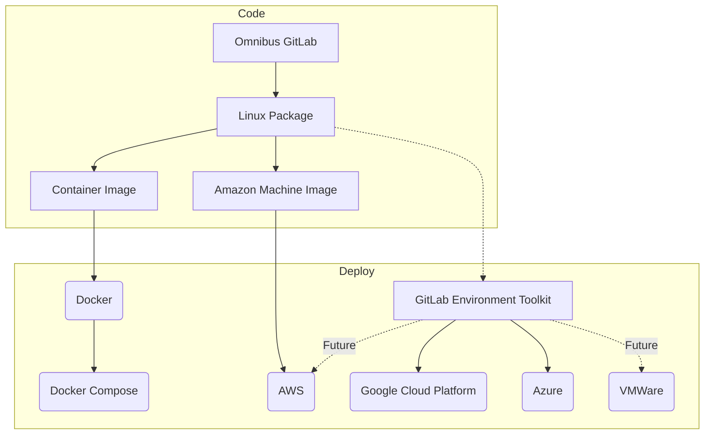
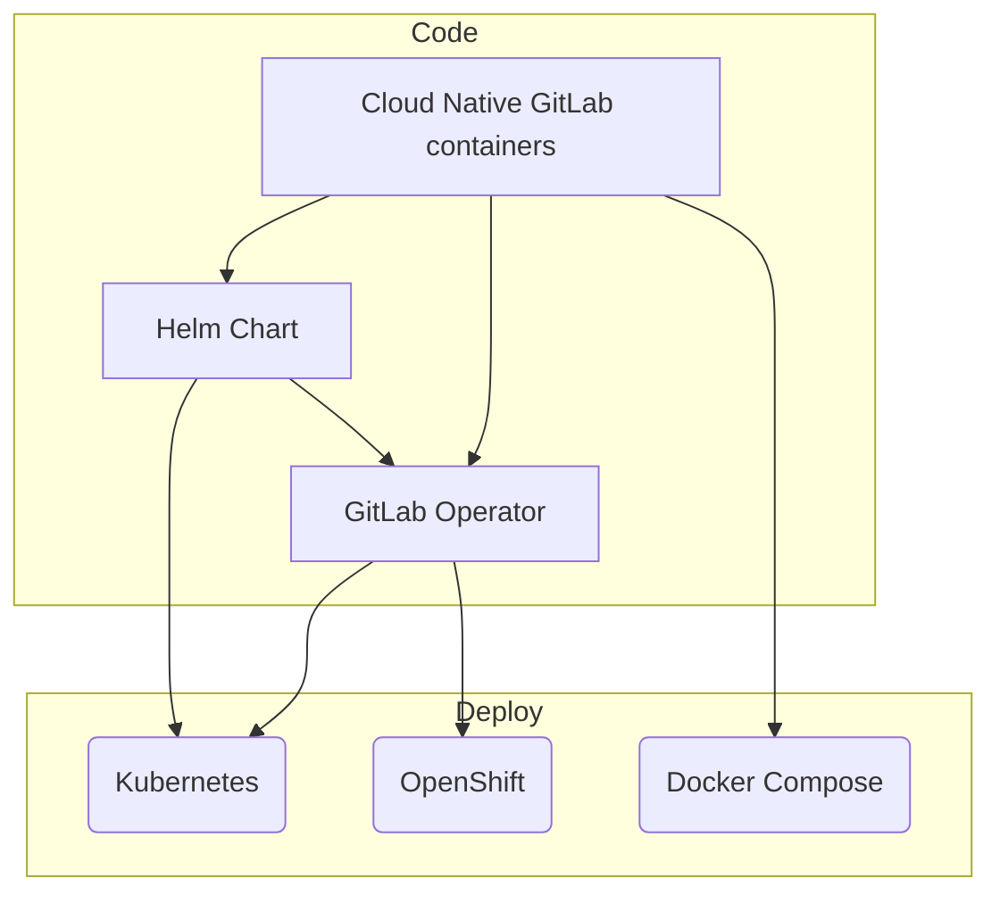

## 概要

Build チームはカスタマーが GitLab をデプロイするために使用するアーティファクトに注力しています。これにはシステムパッケージ、コンテナイメージ、クラウドプロバイダーマーケットプレイス上のパッケージが含まれます。Build チームメンバーは開発チームとエンドユーザーの橋渡し役を担います。Build エンジニアはコンポーネントの効率的なビルドを可能にし、シンプルで安全かつ信頼性の高いインストール体験を提供するためのツールと専門知識を提供します。

Build チームはまた、外部から作成された多数のマージリクエストをレビューします。PostgreSQL、Consul、Patroni などのバンドルされたコンポーネントには定期的な依存関係とセキュリティの更新が必要です。コミュニティメンバーは特定の最適化を有効にするコンパイルフラグの変更をリクエストすることもあります。

## 私たちのカスタマー

### 内部カスタマー — 開発チーム

私たちは GitLab の開発チームと連携して以下を行います:

- コンポーネントを一貫したインストールパッケージに統合する
- 信頼性の高いビルドツールと自動化を提供する
- 安全な依存関係管理と脆弱性の緩和を確保する
- コードからパッケージ化ソフトウェアへの道筋を効率化する

### 外部カスタマー — GitLab ユーザー

私たちは以下を通じて優れたインストール体験を提供します:

- サポートされているプラットフォーム全体で信頼性が高くテスト済みのインストール方法
- 安全で最新のパッケージ、コンテナ、クラウドプロバイダーマーケットプレイスイメージ
- 明確なドキュメントとアップグレードパス
- 多様なカスタマー環境での互換性

## ミッション

Build チームは GitLab コンポーネントがシームレスに統合され、安全にパッケージ化され、カスタマーに確実にデリバリーされることを保証します。私たちは開発チームとエンドユーザーの橋渡し役として、コンポーネントのビルドを効率化するツールと専門知識を提供し、シンプルで安全かつ信頼性の高いインストール体験をデリバリーします。

## ビジョン

[Build チームのビジョン](vision/)は、より広い [Delivery グループ](https://about.gitlab.com/direction/gitlab_delivery/)と整合し、それをサポートしています。

### 内部カスタマー（開発チーム）向け

- すべての開発チームがワークフローを加速させる信頼性の高い効率的なビルドツールにアクセスできる
- コンポーネントの統合が自動化され、安全で、手動介入を最小限に抑える
- セキュリティの脆弱性がすべての依存関係にわたって積極的に特定・緩和される
- ビルドプロセスが一貫していて、十分に文書化されており、可能な限りセルフサービスである

### 外部カスタマー（GitLab ユーザー）向け

- GitLab がサポートされているすべてのプラットフォームとアーキテクチャに容易にインストールできる
- 本番準備が整い十分にテストされたパッケージを提供する
- カスタマーのデプロイが最小限の介入で確実にアップグレードできる
- セキュリティパッチが迅速かつ透明に公開される

### テクノロジービジョン

- GitLab がサポートされているすべてのプラットフォームとアーキテクチャで公式インストール方法を持つ
- GitLab がサポートされているすべてのクラウドプラットフォームで公式のワンクリックインストール方法を提供する
- GitLab が安全かつ確実に自動でアップグレードできる
- GitLab が高リソースと低リソースシステム（Raspberry Pi など）の両方で同等に動作する
- GitLab.com が公式インストール方法を使用して運用される
- すべての GitLab インストールがインストール/アップグレードエラーを自動的に報告できる
- HA 構成での GitLab のセットアップが自動化されてシンプルになる
- すべてのインストール方法がリリース前に自動的にテストされる

### チームビジョン

- 各チームメンバーがドメインの専門知識に加えてチームのすべてのプロジェクトに取り組める
- 各チームメンバーがチームを強化し作業の質を高める候補者を特定するよう努める
- チームがナレッジトランスファーを促進してセルフサービスを可能にするためのドキュメントを作成・改善する
- GitLab の[リーダーシップ原則](/handbook/leadership/#managers-of-one)に基づいて、チームが常に独立して結論に達し、ほとんどの場合コンセンサスを形成できる
- チームメンバーが頻繁に使用するテクノロジーとプラットフォームの[認定取得を支援される](/handbook/people-group/learning-and-development/growth-and-development/#professional-developmentcertificationscourses)など、継続的な専門能力開発が促進される
- オンボーディングとオフボーディングが効率的
- 明確なキャリア開発パス

## クイックスタートガイド

### 開発チーム向け

- **新しい依存関係が必要ですか？** [デリバラブルリクエスト](https://gitlab.com/gitlab-org/distribution/team-tasks/-/issues/new?issuable_template=Architectural-Deliverables-Request)を作成してください
- **パッケージングの質問ですか？** Issue で `@gitlab-build` にピングしてください
- **セキュリティに関する懸念ですか？** [脆弱性管理プロセス](/handbook/security/product-security/security-platforms-architecture/application-security/vulnerability-management/)に従ってください
- **一般的なガイダンスが必要ですか？** [ワークフロードキュメント](workflow.html)を確認してください

**重要:** 変更に以下が必要な場合は、**早めに** Build チームに連絡してください:

- ネイティブ拡張機能を持つ新規または更新された gem
- 新規または更新された外部ソフトウェア依存関係
- GitLab スタックの任意の部分で `install`、`update`、`make`、`mkdir`、`mv`、`cp`、`chown`、
`chmod` を実行したり、コンパイルを行う必要がある場合

リリースサイクルの遅い段階で変更が報告された場合や報告されなかった場合、あなたの機能/変更はそのリリース内でシップされない可能性があります。

### 新しいチームメンバー向け

- `Team-onboarding` テンプレートを使用して [Build チームの Issue トラッカー](https://gitlab.com/gitlab-org/distribution/team-tasks)で[チームオンボーディング Issue](https://gitlab.com/gitlab-org/distribution/team-tasks)を開く
- [ワークフロードキュメント](workflow.html)を確認する
- オンボーディング Issue に記載されているとおりにビルドインフラストラクチャへのアクセスをセットアップする

### カスタマーとコミュニティ向け

- **インストールの問題:** [コミュニティフォーラム](https://forum.gitlab.com)
- **バグ報告:** `group::build` ラベルを付けた [GitLab Issues](https://gitlab.com/gitlab-org/omnibus-gitlab/-/issues)
- **インストールドキュメント:** [インストール](https://about.gitlab.com/install/)、[更新](https://about.gitlab.com/update/)、[アップグレード](https://about.gitlab.com/upgrade/)ページ
- **コントリビューション:** [コミュニティ行動規範](https://about.gitlab.com/community/contribute/code-of-conduct/)とコントリビューションガイドラインを参照

## コミュニケーションチャンネル

- **緊急の問題:** Slack `#g_build` チャンネル
- **機能リクエスト:** [デリバラブルリクエスト](https://gitlab.com/gitlab-org/distribution/team-tasks/-/issues/new?issuable_template=Architectural-Deliverables-Request) Issue
- **一般的な質問:** 関連する Issue で `@gitlab-build` にピング
- **マージリクエストのレビュー:** Build チームプロジェクトには[マージリクエストワークフロー](merge_requests.html#workflow)を使用する

### サポートリクエストの場合

複数のチームからの専門知識が必要な複雑な問題や、どのチームがカスタマーリクエストを処理すべきか不明な場合は、GitLab の統一された Request for Help（RFH）プロセスを使用してください。このプロセスにより単一の情報源が確保され、多くのリクエストが実際に製品の複数の領域からの専門知識を必要とするため、より良いクロスファンクショナルなコラボレーションが可能になります。

RFH を開くには、[ヘルプの入手方法](/handbook/support/workflows/how-to-get-help.md)のハンドブックページの手順を参照してください。このプロセスにより、関与した時間を追跡し、適切な当事者が適切なタイミングで関与することが保証されます。

## 責任範囲

### 内部カスタマーサポート

- **ビルドツールとインフラ:** コンポーネントの効率的なビルドを可能にするツールを開発・維持する
- **統合サービス:** 開発チームのコンポーネントが GitLab パッケージにシームレスに統合されるよう確保する
- **セキュリティパートナーシップ:** セキュリティチームと協力して脆弱性を特定・緩和する
- **依存関係管理:** すべてのコンポーネントにわたって安全で最新の依存関係を維持する
- **ドキュメントとセルフサービス:** 開発チームが独立して作業できるガイドを作成する

### 外部カスタマーデリバリー

- **マルチプラットフォームパッケージ:** サポートされているすべての Linux ディストリビューションとアーキテクチャのパッケージをビルド・維持する
- **コンテナイメージ:** 公式 GitLab コンテナイメージを開発・維持する
- **クラウドマーケットプレイス:** 主要なクラウドプロバイダーとのリスティングとインテグレーションを管理する
- **インストール体験:** インストール、更新、アップグレードのドキュメントとプロセスを維持する
- **品質保証:** リリース前にすべてのインストール方法を十分にテストする
- **ライセンス管理:** バンドルされているすべての依存関係にわたってコンプライアンスを確保する
- **パートナー認定:** バリデーションと認定のためにパートナーに提出する

## チームメンバー

以下の人々が GitLab:Build チームのメンバーです:

チームメンバー情報は <a href="https://handbook.gitlab.com/handbook/engineering/infrastructure-platforms/gitlab-delivery/build/#team-members" rel="external noopener">原文 (英語)</a> を参照してください。

## 主要プロジェクト

[omnibus-gitlab](https://gitlab.com/gitlab-org/omnibus-gitlab) - このプロジェクトはクラウド環境とオンプレミスホスティングでの Self-Managed 消費のために、プラットフォーム固有の自己完結型 GitLab パッケージとイメージを作成します。

[Cloud Native GitLab](https://gitlab.com/gitlab-org/build/CNG) は GitLab をデプロイするためのクラウドネイティブコンテナを提供します。これらのコンテナは Kubernetes、OpenShift、および Kubernetes 互換のコンテナプラットフォーム上で [GitLab Charts](https://gitlab.com/gitlab-org/charts/gitlab) または [GitLab Operator](https://gitlab.com/gitlab-org/cloud-native/gitlab-operator) を使用して Helm でデプロイ・管理できます。

### Omnibus GitLab プロジェクトの製品アウトプット

### Cloud Native GitLab プロジェクトの製品アウトプット

## 全プロジェクト

| 名前 | 場所 | 説明 |
| -------- | -------- | -------- |
| Omnibus GitLab | [gitlab-org/omnibus-gitlab](https://gitlab.com/gitlab-org/omnibus-gitlab) | Ubuntu、Debian、CentOS/RHEL、OpenSUSE、SLES などサポートされているすべての Linux OS の LTS バージョン向けに HA サポートを備えた Omnibus パッケージをビルドする |
| Docker All in one GitLab image | [gitlab-org/omnibus-gitlab/docker](https://gitlab.com/gitlab-org/omnibus-gitlab/tree/master/docker) | omnibus-gitlab パッケージをベースとした GitLab CE/EE の Docker イメージをビルドする |
| Cloud Native GitLab Containers | [gitlab-org/build/CNG](https://gitlab.com/gitlab-org/build/CNG) | GitLab Helm Charts が使用する個別のイメージ |
| AWS images | [AWS marketplace](https://aws.amazon.com/marketplace/pp/B071RFCJZK?qid=1493819387811&sr=0-1&ref_=srh_res_product_title) | omnibus-gitlab パッケージをベースとした AWS イメージ |
| Omnibus GitLab Builder | [GitLab Omnibus Builder](https://gitlab.com/gitlab-org/gitlab-omnibus-builder) | omnibus-gitlab パッケージのビルド依存関係を含む環境を作成する |
| バンドルされた依存関係のライセンス | [GL Pages 上のライセンスページ](https://gitlab-org.gitlab.io/omnibus-gitlab/licenses.html)  | 各パッケージにバンドルされた依存関係とそのライセンスを記載したウェブページ |

## コミュニティとの連携

インストールとアップグレードのプロセスは、システム管理者が GitLab と作業を始める際に最初に経験する機能の 1 つです。
その結果、Build チームが管理するプロジェクトはユーザーベースから高いエンゲージメントを受けています。GitLab
コミュニティはコードコントリビューターだけではなく、Issue を報告したり機能リクエストを出したりするユーザーも常に私たちを前進させ、より良い体験を作るのに貢献しています。

私たちは公開プロジェクトで以下を目指しています:

1. [コミュニティ行動規範](https://about.gitlab.com/community/contribute/code-of-conduct/)を守る。
1. [誰もがコントリビューションできるというGitLab のミッション](/handbook/company/mission/#mission)を実現する。
1. [公開](/public-by-default)で作業を示す。
1. コントリビューターの作業を[認識し感謝する](/handbook/marketing/developer-relations/engineering/community-contributors-workflows/#recognition-for-contributors)。
1. コントリビューターが寄付してくれた時間を尊重し、[適切なレビューターンアラウンドタイム](/handbook/engineering/workflow/code-review/#review-turnaround-time)を提供する。

### オープンソースコミュニティとの連携

[GitLab のオープンコア](/handbook/company/stewardship)は何千ものオープンソースの依存関係の上に構築されています。これらの依存関係とそのコミュニティは GitLab の戦略にとって重要であり、これらの依存関係との作業は Build チームが維持するプロジェクトに不可欠です。

私たちは以下を目指しています:

1. 私たちが恩恵を受けているオープンソースコミュニティへの作業の影響を考慮する。
1. GitLab 内でこれらのオープンソースコミュニティの重要性を促進する。
1. [スチュワードシップの約束](/handbook/company/stewardship/#promises)に反する決定に対して異議を唱える。
1. [行った変更をコントリビューションとして還元する](/handbook/engineering/open-source/#using-forks-in-your-code)機会を見つける。

## デフォルトで公開 {#public-by-default}

Build チームが行うすべての作業は公開されています。いくつかの例外があります:

- 作業にセキュリティ上の影響がある場合 — 作業の過程でセキュリティ上の懸念がなくなった場合は、その作業を公開にすることが期待されます。
- 第三者との作業の場合 — 第三者が作業を非公開にするよう要請した場合のみ。
- 作業に財務的な影響がある場合 — 財務的な詳細を作業から省略できない場合を除く。
- 作業に法的な影響がある場合 — 法的な詳細を作業から省略できない場合を除く。

チームの作業の一部は `dev.gitlab.org` の開発サーバーで行われます。
理由は[インフラの概要ドキュメント](https://docs.gitlab.com/omnibus/release/#infrastructure)に記載されています。

セキュリティに関連する作業でない限り、その他のすべての作業は `GitLab.com` のプロジェクトで行われます。
機密性の高い Issue を提出する必要がある場合は、機密 Issue を使用してください。

何かをプライベートに保つ必要があるかどうかわからない場合は、チームのエンジニアリングマネージャーに確認してください。

## オンボーディングとオフボーディング

会社全体のオンボーディングとオフボーディングに加えて、Build チームには新しいチームメンバーをより素早く軌道に乗せるための独自のプロセスがあります。

オンボーディングを開始する場合は、[Build チームの Issue トラッカー](https://gitlab.com/gitlab-org/distribution/team-tasks)で Issue を開き、`Team-onboarding` テンプレートを選択して Issue を自分にアサインします。

Issue に記載されているステップを進めることが最優先事項であり、会社全体のオンボーディング Issue よりも高い優先度です。なぜなら、チームのオンボーディングのアイテムはあなたの役割に特化したものであり、より素早く軌道に乗るのに役立つからです。

オフボーディングはチームのエンジニアリングマネージャーが同じ Issue トラッカーの適切な Issue テンプレートを使用して行う必要があります。

## 作業リソース

開発者が利用できる一般的なリソースは[サンドボックスクラウドページ](/handbook/company/infrastructure-standards/realms/sandbox/)に記載されています。

Distribution チームでは特に、全員が以下のリソースにアクセスできる必要があります:

- [Google Cloud Platform](https://console.cloud.google.com/) 上の Google プロジェクト
  - `gitlab-build-4c16cc9e`
  - `cloud-native`
  - `omnibus-build-runners`
- AWS ビルドインフラストラクチャ
  - Distribution グループの AWS サンドボックスアカウント
  - CI 用の `cloud-native` EKS クラスター（メンテナーが[アクセスを付与する](https://stackoverflow.com/questions/59987859/kubectl-error-you-must-be-logged-in-to-the-server-unauthorized/59991446#59991446)必要があります）

これらのリソースへのアクセス権がない場合は、[アクセスリクエスト](https://gitlab.com/gitlab-com/team-member-epics/access-requests/-/issues)を作成してマネージャーに承認を求めてください。

## インフラとメンテナンス

チームの責任の一部として、チームは日々の業務に使用するインフラのメンテナンスを担当しています。
ノードのリストとメンテナンスタスクの説明については[インフラとメンテナンス](maintenance/)ページを参照してください。

## チームワークフロー

一般的な[エンジニアリングワークフロー](/handbook/engineering/workflow/)が Build チームに適用されます。複数のプロジェクトをまたいで作業しているため、チームのワークフローは[Build ワークフローページ](workflow.html)でさらに詳しく説明・要約されています。

### 参考資料

以下の GitLab ハンドブックの重要な領域は私たちの作業に影響を与え、読む価値があります。

- [一般的なエンジニアリングワークフローページ](/handbook/engineering/workflow/)
- [私たちの価値観を強化する方法](/handbook/values/#how-do-we-reinforce-our-values)
- [中小規模ユーザーへのサービス継続](https://internal.gitlab.com/handbook/leadership/mitigating-concerns/#serve-smaller-users)（内部のみ）
- [オープンソースコミュニティへの約束](/handbook/company/stewardship/#promises)
- [プロダクト原則に従う方法](/handbook/product/product-principles/#how-we-follow-our-principles)
- [効果的で責任あるコミュニケーションガイドライン](/handbook/communication/#effective--responsible-communication-guidelines)
- [Distribution グループのテストプラットフォーム](/handbook/engineering/testing/distribution/)

## ワークライフハーモニー

[オールリモート](/handbook/company/culture/all-remote/)と[非同期ファースト](/handbook/company/culture/all-remote/asynchronous/)での作業は、チームメンバーが自分の作業日をどのようにアプローチするかに柔軟性をもたらします。チームメンバーは作業時間と生活の他の側面のバランスをどのように取るかを選択する必要があります。

新しいチームメンバーのために、以下のリソースが時間の集中方法の例を提供しています:

- [チームメンバーが一日にどのようにアプローチするか](https://gitlab.com/gitlab-org/distribution/team-tasks/-/issues/907)
- ブログ記事: [リモートワーカーの一日](https://about.gitlab.com/blog/2019/06/18/day-in-the-life-remote-worker/)
- [非線形な作業日](/handbook/company/culture/all-remote/non-linear-workday/)のオプション
- GitLab ハンドブック: [ワークライフハーモニー](/handbook/company/culture/all-remote/)

以下の GitLab ハンドブックの領域は健全なワークライフバランスを維持するために重要です。

- [家族と友人を優先、仕事はその次](/handbook/values/#family-and-friends-first-work-second)
- [リモートワーク環境でのバーンアウト、孤立、不安に立ち向かう](/handbook/company/culture/all-remote/mental-health/)
- [バーンアウトの認識](/handbook/people-group/time-off-and-absence/time-off-types/)
