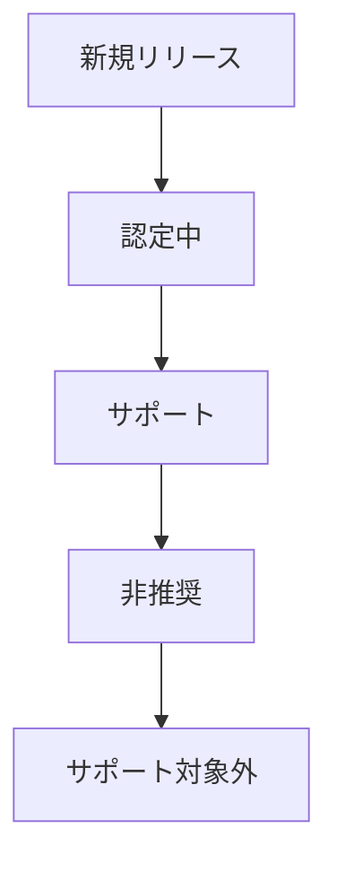

GitLab Helm チャートと Operator に対する、各種 Kubernetes および OpenShift リリースの Distribution チームのサポートポリシーです。

## 定義

このポリシーで使用する用語の定義です。

### Kubernetes リリース

Kubernetes の公式マイナーバージョンリリース。リリースは <https://kubernetes.io/releases/> で確認できます。Kubernetes は年 3 回、約 4 ヶ月間隔で公式リリースを行い、各リリースはバグ修正とセキュリティパッチとともに 1 年間サポートされます。

### OpenShift リリース

OpenShift の公式マイナーバージョンリリース。リリースは <https://access.redhat.com/support/policy/updates/openshift> で確認できます。OpenShift は年 3 回、約 4 ヶ月間隔で公式リリースを行い、各リリースはバグ修正とセキュリティパッチとともに 1 年間サポートされます。

OpenShift は Kubernetes をベースにしており、機能的に非常に類似しています。特に断りがない限り、このドキュメントでは同一のものとして扱います。

### サポートされている Kubernetes リリース

GitLab が公式にサポートしている Kubernetes リリース。

### 非推奨の Kubernetes リリース

GitLab で以前サポートされていた Kubernetes リリースで、`kubeval`、`kubeconform`、または同様のツールを使用して CI/CD 環境で最小限のテストを実行しているもの。このリリースでは GitLab がおそらく動作しますが、一部の機能は動作しない可能性があります。

### 認定中の Kubernetes リリース

テスト（場合によっては移植作業を含む）を行い、CI/CD システムのエンドツーエンド（E2E）テストに追加しているリリース。リリースが認定されると、公式サポートリリースになります。やがて非推奨のリリースに移行します。

### サポートされていない Kubernetes リリース

サポートされていないリリースは以下のいずれかです:

- まだ認定されていない新しいリリース。
- 以前サポートまたは非推奨であったが、破損していることが知られているリリース。

## 制約

公式にまたは非推奨のリリースとしてサポートできる Kubernetes と OpenShift のリリースを制限するいくつかの制約があります。

### Kubectl

`kubectl` のバージョン `1.X.Y`（`X` は Kubernetes のマイナーバージョン、`Y` はパッチレベル）は、Kubernetes クラスターのバージョン `1.X-1` から `1.X+1` でのみサポートされます。

### API サポート

Operator は Kubernetes API の後方互換性に依存しています。Kubernetes は `N-3` バージョンの後方互換性を保証しているため、この制約は `kubectl` サポートよりも問題になりにくいです。

### Kubernetes リリーススケジュール

Kubernetes は年 3 回、リリース間隔は約 4 ヶ月でリリースされます。各 Kubernetes リリースは 12 ヶ月間サポートされます。

### GitLab の認定

新しいリリースをサポートするための新しいクラスターの作成と CI/CD サポートの追加には大きな作業が必要です。GitLab チャートと Operator での API 変更の適応作業もあります。GitLab を新しい Kubernetes リリースで認定するには約 3 ヶ月かかります。

### クラウドプロバイダーと Kubernetes フレーバーのリリーススケジュール

Kubernetes を提供するさまざまなクラウドプロバイダーがあります。リソースの制約から、GKE と EKS の 2 つのみでテストを行います。これらのプロバイダーでのテストにより、同じ Kubernetes リリースを実行する他のプロバイダーへのサポートを推定できるという理解に基づいています。

OpenShift はオンプレミスインフラで実行されることが多い Kubernetes フレーバーです。OpenShift には十分な需要と独自の特性があるため、クラウドプロバイダーと同様にテスト、認定、サポートを行います。

#### Google Kubernetes Engine（GKE）

GKE は Kubernetes クラウドプロバイダーです。

GKE は Kubernetes リリースサイクルの各リリースを 14 ヶ月間サポートします。これらのリリースはリリースの認定に伴う遅延があるものの、Kubernetes のリリースサイクルとほぼ対応しています。通常、rapid チャンネルと regular チャンネルでは 4〜5 のリリースが利用可能で、最も古いバージョンはパッチリリースやセキュリティ修正を受けなくなります。stable チャンネルには最新の Kubernetes マイナーバージョンがないため、一般的に最も古いものがメンテナンスを受けなくなった 4 つのバージョンが存在します。

詳細については [GKE リリーススケジュール](https://cloud.google.com/kubernetes-engine/docs/release-schedule)を参照してください。

#### Elastic Kubernetes Service（EKS）

EKS は Kubernetes クラウドプロバイダーです。

EKS は GKE や Openshift と同様に Kubernetes のリリーススケジュールに従います。各リリースは 14 ヶ月間サポートされます。

詳細については [EKS バージョン](https://docs.aws.amazon.com/eks/latest/userguide/kubernetes-versions.html)を参照してください。

#### Azure Kubernetes Service（AKS）

AKS は Kubernetes クラウドプロバイダーです。

AKS は GKE や Openshift と同様に Kubernetes のリリーススケジュールに従います。各リリースは 12 ヶ月間サポートされます。最新の AKS リリースは通常、最新の Kubernetes リリースより 1 リリース遅れます。

詳細については [AKS Kubernetes リリースカレンダー](https://learn.microsoft.com/en-us/azure/aks/supported-kubernetes-versions)を参照してください。

#### OpenShift

OpenShift は Kubernetes フレーバーです。

Openshift は各リリースを 12〜18 ヶ月間サポートします。GKE と同様に、リリース間隔は約 4 ヶ月で Kubernetes のリリースサイクルとほぼ対応しています。最新の OpenShift リリースは通常、最新の Kubernetes リリースより 2 リリース遅れます。

詳細については [Openshift バージョニング](https://access.redhat.com/support/policy/updates/openshift)を参照してください。

### GKE の自動アップグレード

GKE はサポート外のクラスターを自動アップグレードします。

## Kubernetes および OpenShift リリースサポートポリシー

Kubernetes と OpenShift のリリースにおける GitLab Helm チャートと Operator に対する Distribution チームのサポートポリシーです。

### 公式サポートリリース

GitLab は新しいバージョンがリリースされ、古いバージョンが対応プロバイダーでサポートされなくなるにつれて、Kubernetes と OpenShift のすべてのリリースのうち移動するサブセットをサポートします。

#### 公式にサポートされている Kubernetes リリース

GitLab は Kubernetes の 3 つのマイナーリリース（`N`、`N-1`、`N-2`）を公式にサポートします。`N` は以下のいずれかです:

- 認定が完了している場合、Kubernetes の最新リリースのマイナーバージョン。
- 最新バージョンの認定が完了または開始されていない場合、次に新しいバージョン。

最新の認定未完了または認定未開始のリリースには `N+1` という用語を使用します。GitLab は Kubernetes の 3 つのマイナーリリース（`N`、`N-1`、`N-2`）を公式にサポートします。`N` は Kubernetes の最新リリースのマイナーバージョン（認定完了の場合）または次に新しいバージョン（最新バージョンの認定が完了または開始されていない場合）です。次の予定リリースを `N+1` と呼びますが、認定中かどうかは問いません。例えば、現在利用可能なリリースが `1.28`、`1.27`、`1.26`、`1.25` で、リリース `1.28` の認定が完了していない場合、`N` は `1.27` となり、このテーブルに示すように `1.25`、`1.26`、`1.27` を公式サポートします。

| リリース | 参照     | サポート |
|---------|----------|----------|
| 1.28    | `N+1`    | なし     |
| 1.27    | `N`      | あり     |
| 1.26    | `N-1`    | あり     |
| 1.25    | `N-2`    | あり     |

`1.28` が認定されると、`1.29` が `N+1` となり、`1.28` が公式サポートリリースのリストに追加されます。最も古い既存のサポートリリース（`1.25`）は非推奨（または場合によってはサポート対象外）になります。

| リリース | 参照      | サポート    |
|---------|-----------|-------------|
| 1.29    | `N+1`     | なし        |
| 1.28    | `N`       | あり        |
| 1.27    | `N-1`     | あり        |
| 1.26    | `N-2`     | あり        |
| 1.25    | N/A       | 非推奨      |

#### 公式にサポートされている OpenShift リリース

GitLab は OpenShift の 4 つのマイナーリリース（`N`、`N-1`、`N-2`、`N-3`）を公式にサポートします。Kubernetes と同様に、`N` は以下のいずれかです:

- 認定が完了している場合、OpenShift の最新リリースのマイナーバージョン。
- 最新バージョンの認定が完了または開始されていない場合、次に新しいバージョン。

同様に、次の予定リリースを `N+1` と呼びますが、認定中かどうかは問いません。例えば、現在利用可能なリリースが `4.14`、`4.13`、`4.12`、`4.11` で、リリース `4.15` の認定が完了していない場合、`N` は `4.14` となり、このテーブルに示すように `4.14`、`4.13`、`4.12`、`4.11` を公式サポートします。

| リリース | 参照      | サポート |
|---------|-----------|----------|
| 4.15    | `N+1`     | なし     |
| 4.14    | `N`       | あり     |
| 4.13    | `N-1`     | あり     |
| 4.12    | `N-2`     | あり     |
| 4.11    | `N-2`     | あり     |

### 非推奨リリース

非推奨のリリースでの Issue を修正するためのコミュニティコントリビューションは、それらの修正がサポートされているバージョンを壊さない限り受け入れます。また、時間とリソースが許す範囲でこれらのリリースへの非公式サポートを提供することもあります。

GitLab は Kubernetes プロジェクトの非推奨スケジュールに厳密には従わないことに注意してください。

### Kubernetes リリースサポートライフサイクル

Kubernetes リリースは以下の Distribution の Kubernetes リリースサポートライフサイクルを経ます:

#### 新規リリース

GitLab サポートの認定がまだ開始されていない新しい Kubernetes リリース。

#### 認定中

GitLab Distribution チームが新しいリリースの認定を開始しました。
認定には以下が含まれます:

- 必要に応じた API 変更への対応
- インフラのプロビジョニング
- CI/CD パイプラインの追加
- E2E テストの追加

認定タスクの完全なリストは [Kubernetes リリース認定 Issue テンプレート](https://gitlab.com/gitlab-org/distribution/team-tasks/-/blob/master/.gitlab/issue_templates/Kubernetes-support.md?ref_type=heads)に記載されています

#### サポート

認定が完了しました。

#### 非推奨

以前サポートされていたリリースは以下の理由で非推奨になる可能性があります:

- Kubernetes リリースが EOL（End of Life）に達した場合。
- 最も古いサポートリリースであり、3 つ以上のサポートリリースがある場合。

非推奨のリリースは Distribution チームの時間とリソースが許す範囲でベストエフォートでサポートされます。CI システムで `kubeval`、`kubeconform`、またはその他の検証ツールのテストに合格し続け、既知の破壊的な問題がない限り、リリースは非推奨として継続されます。これらの変更がサポートされている公式リリースおよびより新しい非推奨リリースのサポートを壊さない限り、コミュニティコントリビューションを検討します。

#### サポート対象外

リリースが以下の理由でサポート対象外になります:

- リリースが非推奨であり、破損していることが知られている（通常、検証テストに合格しなくなった）。
- リリースが EOL から 1 年以上経過している。

### 新しい Kubernetes リリースサポートのタイムライン

より新しい（`N+1`）Kubernetes リリースはそのリリースから 3 ヶ月以内にサポートされます。

### Kubernetes パッチレベル

GitLab は、特定の Kubernetes マイナーレベルリリースのパッチレベルリリースと後方・前方互換性があることを前提とします。つまり、Kubernetes リリース `1.N.3` を認定した場合、`1.N.x` のすべてのリリースで認定されていると見なすことができます。

### アーキテクチャ

Kubernetes はいくつかの物理的なアーキテクチャで実行できます。GitLab はリソースの制約からこれらのアーキテクチャのサブセットをサポートしています。

#### x86-64

私たちの基本アーキテクチャは x86-64 です。サポートされているすべての Kubernetes リリースでこのアーキテクチャをサポートしています。

#### arm64

現在、ARM64 での E2E テストは行っていません。ARM64 を公式サポートにする前に、少なくとも 1 つの Kubernetes リリースでこのテストを追加する必要があります。

### `kubectl` バージョン

実践可能な限り、最新の GitLab Helm チャートは `N-1` バージョンの `kubectl` を含めるべきです。これにより、`N` と `N-2` の両方の Kubernetes リリースを公式にサポートできます。

### CI/CD テスト要件

#### エンドツーエンド（E2E）テスト

`N` の Kubernetes リリースは x86-64 と ARM64（サポートを決定した場合）の両方で E2E テストを受けます。E2E テストは現在、`review__<cluster_version>`、`review_specs_<cluster_version>`（チャートのみ）、`qa_<cluster_version>` ジョブを使用して現在のチャートと Operator パイプラインで行われています。

#### スモークテスト

`N`、`N-1`、`N-2` の Kubernetes リリースに対してスモークテストを行います。スモークテストは `review_vcluster_<cluster_version>` ジョブを使用してパイプラインで行われます。このテストは GitLab Helm チャートまたは Operator を[仮想クラスター](https://www.vcluster.com/)にデプロイします。

#### 検証テスト

検証テストは [`kubeconform`](https://github.com/yannh/kubeconform) または同様の検証ツールを使用して行われます。GitLab チャートのパイプラインは `Validate <cluster_version>` ジョブで `kubconform` を実行します。

GitLab Operator には現在、この目的に使用できる検証テストがありません。すべてのリリースの E2E テストを停止したら、非推奨リリース向けに対応する検証テストを追加する予定です。

#### 非推奨リリースのテスト

非推奨リリースは検証テストを使用して回帰テストが行われます。新しいリリースが認定されると、新しい検証テストジョブが作成されます。非推奨リリースのサポートは、古いバージョンの検証テストジョブを削除しないことで構成されます。互換性のない理由で検証テストジョブが失敗した場合、[非推奨ポリシー](#deprecated)が許可する場合は互換性の問題を修正するか、それ以外の場合はそのリリースをリストから削除してサポート対象外の Kubernetes リリースにします。

### 公開向けドキュメント

サポートされている Kubernetes リリースと非推奨の Kubernetes リリースを以下のテーブルに文書化しています:

- [GitLab チャート](https://docs.gitlab.com/charts/installation/cloud/index.html#supported-kubernetes-releases)
- [GitLab Operator](https://docs.gitlab.com/operator/installation.html#cluster)

これらのテーブルは GitLab Helm チャートと Operator の両方についてサポートおよび/または非推奨リリースのリストを変更するたびに更新されます。

### 新リリースプロセス

新しいリリースのサポートを追加して古いリリースを非推奨にするためのプロセスは [Issue テンプレート](https://gitlab.com/gitlab-org/distribution/team-tasks/-/blob/master/.gitlab/issue_templates/Kubernetes-support.md)に詳述されています。
