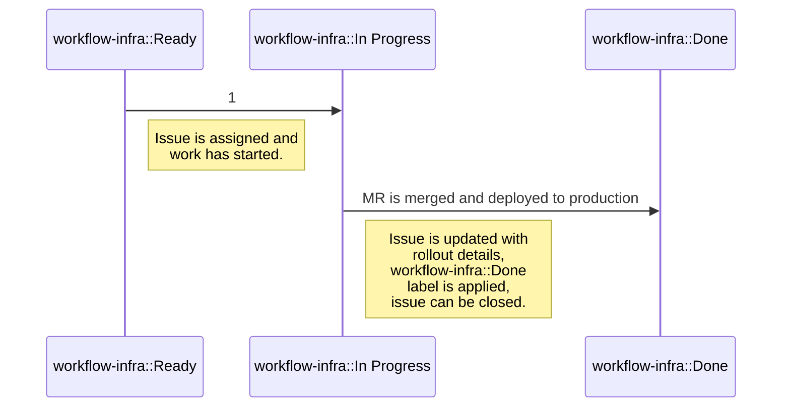

## 共通リンク

|   |   |
|---|---|
| **ワークフロー** | [チームワークフロー](#how-we-work) |
| **GitLab.com** | `@gitlab-org/delivery` |
| **Issue トラッカー** | [**Delivery**](https://gitlab.com/gitlab-com/gl-infra/delivery) |
| **Slack チャンネル** | [#g_release_and_deploy](https://gitlab.slack.com/archives/g_release_and_deploy) / `@delivery-team` |
| **Delivery ハンドブック** | [チームトレーニング](/handbook/engineering/infrastructure-platforms/gitlab-delivery/delivery/training/) |
| **Delivery メトリクス** | [Metrics](/handbook/engineering/infrastructure-platforms/gitlab-delivery/delivery/metrics/) |
| Deployment and Release プロセス | [Deployments and Releases](/handbook/engineering/deployments-and-releases/) |
| Release Tools プロジェクト | [Release tools](/handbook/engineering/infrastructure-platforms/release-tools) |
| Release Manager ランブック | [release/docs/runbooks](https://gitlab.com/gitlab-org/release/docs/-/blob/master/runbooks/README.md) |

## ミッション

Release & Deploy グループは、GitLab Engineering が
**安全**、**スケーラブル**、**効率的** な方法で、GitLab.com、GitLab Dedicated、およびセルフマネージドのお客様に機能を提供できるよう支援します。
このグループは、GitLab の月次およびパッチリリースが GitLab.com、GitLab Dedicated に
タイムリーにデプロイされ、公にリリースされることを保証します。

## ビジョン

Release & Deploy グループは、舞台裏で活動し、主に社内ユーザー向けのチームです。
そのプロダクトと出力は、Infrastructure の主要な目標である **可用性**、**信頼性**、
**パフォーマンス**、**スケーラビリティ** に直接影響します。これはすべての GitLab のユーザー向けサービスと
セルフマネージドのお客様に当てはまります。グループは、エンジニアリングチームが効果的かつ効率的に作業を本番に届けるためのワークフロー、フレームワーク、アーキテクチャ、自動化を作成します。

Release & Deploy グループは、[CI/CD ブループリント](https://gitlab.com/gitlab-com/gl-infra/readiness/-/blob/master/library/ci-cd/index.md) の上に構築された完全に自動化されたデプロイメントおよびリリースプラットフォームの構築に注力しており、迅速なロールアウト、障害の検出と回復を備えた高速で柔軟なリリースとデプロイメントを可能にします。

Release & Deploy グループの各メンバーは、このビジョンの一部です:

- 各チームメンバーがすべてのチームプロジェクトに取り組むことができる
- チームは常に独立して結論に達することができ、ほとんどの場合は合意に達する
- キャリア開発パスが明確である
- チームは、ドキュメント、トレーニングセッション、アウトリーチを通じて知識のデータベースを作成する

GitLab Duo/AI を私たちのワークフローに組み込む方法のアイデアは、[こちら](/handbook/engineering/infrastructure-platforms/gitlab-delivery/delivery/ai-use-cases) で記録されています。

### 短期

- [Maintenance Policy](https://docs.gitlab.com/ee/policy/maintenance.html) を 3 バージョンをフルでサポートするように拡張できるツールとプロセスを開発
- 将来のチームとモジュールが各コンポーネントへの変更を簡単にリリースできるようにする Release Platform を開発
- デプロイメントの非効率性を測定および削減できるように、デプロイメントパイプラインの可観測性を改善
- プロセス改善を推進するために Release Manager の作業量を測定

### 中期

- プロセスと自動化の改善を通じて Release Manager の作業量を大幅に削減
- テストおよびデプロイメントのために、私たちのインフラストラクチャ内でトラフィックを目的のリソースにルーティングする柔軟な機能を開発
- 新しいテスト要件とロールアウト戦略を支援するために、オンデマンドで新しい環境を作成する機能を開発
- 複数のパッケージの同時テストを左にシフトして可能にするために、テスト実行の柔軟性を改善
- ツールとプロセスの開発・テスト時間を削減するために、デプロイメントとリリースツールへの変更をテストするためのツールとプロセスを改善
- Release Manager の作業量を維持または削減しながら、組織のニーズに合うように GitLab リリースをスケール

### 長期

- 標準的、実験的、リスクの高い変更を、他のデプロイメントプロセスや MTTP への影響を最小限に抑えて迅速かつ安全にロールアウトできるように、プログレッシブデプロイメント戦略をサポート
- Delivery 外のチームメンバーがデプロイメントとリリースタスクを安全にセルフサーブできるようにするツールを提供
- リリース速度を向上させ、Release Manager の作業量を削減するために、セルフマネージドユーザー向けの月次およびパッチリリースのリリースプロセスを完全に自動化
- MTTP を現在の 12 時間目標を大幅に下回るレベルまで削減
- ヘルスチェックとロールバックプロセスを強化することにより、デプロイメント障害の検出と回復の速度を向上

## ガイディング原則

これらはグループ内で行っていることが正しいことかどうかを評価するために使用できる一連のステートメントまたは質問です。コミットする作業を決定する際は、その作業がこれらの原則に沿っているかを自問するべきです。原則は、Release & Deploy グループの戦略、ドメインエキスパート、Release & Deploy グループメンバーによって推進されます。これらは時間の経過とともに、学ぶにつれて少し変わる可能性があり、固定的なものとは見なされません。さらに、これらの原則は [GitLab Values](/handbook/values/) に加えるものであり、それらをここで重複しないことを目指しています。

これらの原則は、誰もがグループと戦略に沿った方法で独立して働けるよう支援することを意図しています。

### ソリューションを設計するとき

1. Release Management を単純化する。タスクを削除するか自動化を改善することによって、リリースマネージャーの仕事を減らすことを常に望みます。何かを取り除かずに新しいタスクを導入することは非常に慎重に行う
1. [Deployer](https://gitlab.com/gitlab-com/gl-infra/deployer) に機能を追加しない。VM からの移行作業の一部として [Deployer](https://gitlab.com/gitlab-com/gl-infra/deployer) を非推奨にすることを目指しています
1. 常にメトリクスを考慮する。価値を追跡するためのメトリクスがない場合、追加することを検討すべきです
1. UX の一貫性。ツールのインタラクションと命名で一貫性を目指す
1. 低コンテキストデザイン。Delivery 外のチームメンバーが使用する必要があるかのようにツールを設計する。物事をシンプルに保ち、ツールに重い仕事をさせる

### ソリューションを実装するとき

1. 最小の実装を選ぶ。書くコードが少なければ少ないほど、保守する (またはデバッグする) コードも少なくなる

## 戦略

このサブセクションは、[Delivery direction pages](https://about.gitlab.com/direction/gitlab_delivery/) に移動しました。これは、製品の方向性の残りと同じ場所にあるようにするためです。

## トップレベルの責任

このグループは、優先順位の高い順に以下のタスクに定期的に取り組みます:

1. GitLab SaaS への GitLab アプリケーションソフトウェアの継続的デリバリーの確保 (例: [GitLab SaaS auto-deploy](https://gitlab.com/groups/gitlab-org/release/-/epics/13))。
1. セルフマネージドユーザー向けの月次パッチおよびセキュリティリリースのための GitLab リリースの調整と準備。
1. SaaS およびセルフマネージドのソフトウェアデリバリーに関する、インシデント解決への参加と是正措置の実行。
1. 基礎的なプロジェクト作業を通じた SaaS およびセルフマネージドのソフトウェアデリバリーの速度向上 (例: [Running GitLab SaaS on Kubernetes](https://gitlab.com/groups/gitlab-com/gl-infra/-/epics/112))。
1. ツールの作成および改善による SaaS ソフトウェアデリバリーの堅牢性の向上 (例: [Deployment rollback](https://gitlab.com/groups/gitlab-com/gl-infra/-/epics/282))。
1. GitLab 内で機能を構築または強化することによるカスタムツールの使用の最小化 (例: [Create a Changelog feature](https://gitlab.com/groups/gitlab-com/gl-infra/-/epics/351))。
1. GitLab SaaS 上のソフトウェアデリバリーに関連する他チームのニーズのサポート (例: [New Container Registry deployment](https://gitlab.com/groups/gitlab-com/gl-infra/-/epics/412))。

### チームメンバー

以下のメンバーが Delivery:Releases&Deploy チームに所属しています:



## パフォーマンス指標

Delivery グループは、[Infrastructure 部門のパフォーマンス指標] を通じて、[Engineering 機能のパフォーマンス指標](https://internal.gitlab.com/handbook/company/performance-indicators/engineering/) に貢献しています。
グループの主なパフォーマンス指標は [**M**ean **T**ime **T**o **P**roduction](https://internal.gitlab.com/handbook/company/performance-indicators/product/saas-platforms-section/#mean-time-to-production-mttp) (MTTP) で、これは、マージリクエストを介して導入された変更が
本番環境 (GitLab.com) にどれだけ迅速に到達しているかを示すものです。
執筆時点で、この PI の目標は、この [key result](https://gitlab.com/groups/gitlab-com/gl-infra/-/epics/107) エピックで定義されています。

## Delivery チーム間の Delivery ドメインのオーナーシップ

Release & Deploy グループは、GitLab デプロイメントとリリースに必要なツールと機能を所有しています。下の図は、2 つのチームと現在のリリースマネージャーの間のドメインオーナーシップの分担を示します。Release & Deploy グループ外のチームとドメインが重なる場合、私たちは主にデプロイメントとリリースの機能とニーズに注力します。


- [Diagram source](https://docs.google.com/presentation/d/1KdrrdYpjdHinYyUa2V3nUCWico74twXWfCCJg-m0ODI/edit?usp=sharing)

### Release Manager のオーナーシップ

Release Manager は Release & Deploy グループのメンバーですが、リリースマネージャーとしての時間中は別の帽子をかぶっています。主な顧客は GitLab ユーザーです。

1. Auto-deploys: Release Manager は auto-deploy プロセスを運用します。これは主に Deployments チームが提供する機能を活用しますが、Orchestration ツールは Deployments チームの機能を活用します。環境ヘルスチェックは、リリースマネージャーが使用するプロセスとツールに不可欠な Deployments の機能の一例です。
2. セルフマネージドリリース: Release Manager は、Releases チームが提供する機能を使ってリリースプロセス (パッチおよびセキュリティ) を運用します。
3. Post-deploy migrations: Release Manager は、Deployments チームが提供する機能を使って PDM プロセスを運用します。
4. Hot patch プロセス: Release Manager は、EOC と協力して、hot patch プロセスを管理します。Hot patch 機能は Releases チームによって提供されますが、短縮されたプロセスとそれに伴うパイプラインジョブの削減により、Deployments 機能に大きく依存します。
5. Deployment blockers: Release Manager は、チームが改善を計画するために必要なデータを提供するために、デプロイメントのブロッカーを特定および報告する責任を負います。
6. Release Manager のダッシュボード: Release Manager は <https://dashboards.gitlab.net/d/delivery-release_management/delivery-release-management?orgId=1> を所有しており、リリース管理に役立つと思われる追加のダッシュボードを自由に作成できます。ダッシュボードに必要なデータは、Deployments が所有する中央集中型の場所から利用可能になります。
7. Deployment Blockers のエスカレーション。任意の環境で 2 時間以上明確な解決パスのないデプロイメントブロッカーに直面したとき、デプロイメントの調整とブロック解除を支援するために、PagerDuty の `Release Management Escalation` スケジュールに [エスカレーション](/handbook/engineering/infrastructure-platforms/gitlab-delivery/delivery/#release-management-escalation) してください。

### Releases の作業の主な顧客は

- 変更をデプロイおよびリリースしたい社内 GitLab ユーザー、つまり、
- リリースマネージャーとステージグループ。
- 月次リリースのお客様

1. Release メトリクス: リリースに関するメトリクスのための中央集中型ストアの提供。Deployments は主に、すべてのデプロイメントパイプラインが必要なすべてのダッシュボードを駆動するために有用な方法でメトリクスを記録できるようにするメトリクス機能の提供に関心を持ちます。
1. Releases/Packages パイプラインの可視性: パイプラインの構成、ステータス、結果の可視性の提供。
1. Release 変更管理ツール: セルフマネージドユーザーへのリリースに変更を含めるか除外するかの機能の提供。
1. Release/packaging 実行ログ: リリースの正確なログが維持されることの確保。
1. Deployment & release メタデータ: クオリティゲートが正確であり、予測可能なリリースを確保するために、コンポーネントのバージョンと依存関係の追跡。
1. QA テストの実行と結果の可視性: すべてのデプロイメントとリリースが必要なテストを通過することの確保。Releases は特に、テスト実行のタイミングと、信頼できる結果のために正しい依存関係が整っていることに関心を持ちます。
1. Releases ダッシュボード: Delivery:Releases は、効果的なリリースプロセスの設計に関するチームの作業を導くための一連のダッシュボードを所有します。個々のリリースパイプラインの有効性を評価するためのダッシュボードまたはテンプレートも必要になります。
1. Release の公開: 各種配布サイト (例: packages.gitlab.com、Docker Hub など) へのパッケージの公開、公開ツール、信頼性の高い公開プロセスの保証。

### Deployments の作業の主な顧客は

- デプロイメントツールに依存するリリースマネージャー
- それぞれのインフラストラクチャに更新されたコードのデプロイメントを期待する GitLab SaaS (GitLab.com、Dedicated、Cells) のお客様。

1. Deployment changelock: すべてのデプロイメントが計画されたおよびアドホックな変更ロックを遵守することを確保します。例として、PCL、S1/S2 インシデント、その他の Change Request があります。
1. Environment changelock: 環境がスケジュールに従って、または計画されたメンテナンスや環境の不健康性によって必要な場合はアドホックにロックできることを確保します。変更が予測可能な方法でロールアウトされることを保証することも Deployments の責任です。
1. Environment ヘルス: 環境の健康が評価され、デプロイメント決定を導くために利用可能であることを確保します。
1. Release & deployment メトリクス: デプロイメントとリリースに関するメトリクスのための中央集中型ストアの提供。Deployments は主に、すべてのデプロイメントとリリースパイプラインが必要なすべてのダッシュボードを駆動するために有用な方法でメトリクスを記録できるようにするメトリクス機能の提供に関心を持ちます。
1. Deployment 変更管理ツール: デプロイメントに変更を含めるか除外するかの機能の提供。
1. Deployment 実行ログ: デプロイメントの正確なログが維持されることの確保。
1. アプリケーションロールアウト: 必要なクラスターと環境に変更を適用する責任を負います。Canary、blue/green、段階的トラフィック増加などのロールアウト戦略は、Deployments が提供する機能です。
1. Rollout ダッシュボード: すべての環境への効果的なロールアウトを管理するチームの作業を導くための一連のダッシュボードを所有します。例として、個々のサーバーに変更が適用されるタイミングや、環境利用の可視性が含まれる可能性があります。
1. Canary 環境: canary 環境のロールアウト機能を所有します。完全な環境管理を確保するために、Reliability と密接に協力します。
1. Deployment と release のテスト環境: Pre、Staging、Release: テスト環境のロールアウト機能を所有します。完全な環境管理を確保するために、Reliability と密接に協力します。
1. Deployment と release の本番環境: 本番環境のロールアウト機能を所有します。完全な環境管理を確保するために、Reliability と密接に協力します。
1. Deployment ダッシュボード: Delivery:Deployments は、効果的なデプロイメントプロセスの設計に関するチームの作業を導くための一連のダッシュボードを所有します。個々のデプロイメントおよびリリースパイプラインの有効性を評価するためのダッシュボードまたはテンプレートも必要になります。

## 私たちの働き方

### チームへの連絡方法

| 理由 | 連絡先 | 経由 |
| ------ | ------- | --- |
| S1/P1 のデプロイメント／リリース関連の問題 | `@release-managers` | Slack |
| 任意の優先度のデプロイメント／リリース関連の問題 | `@gitlab-org/delivery` | GitLab |
| Release Manager | release-management team | incident.io |
| Release and Deploy team | release-and-deploy team | incident.io |

Release Manager は平日の follow-the-sun ローテーションを持ち、Slack の `@release-managers` ハンドルから連絡できます。週末のサポートやその他のエスカレーションについては、以下の Release Management Escalation の手順を使用して Delivery Leader に連絡してください。

#### Release Management のエスカレーション

平日の労働時間中は、Slack の `@release-managers` ハンドルから現在の Release Manager に連絡できます。

労働時間外のリリースマネジメントサポート、または Delivery Leadership にエスカレーションする必要がある場合は、以下の手順に従って PagerDuty を使ってページしてください。

1. Incident.io で、Delivery - Leadership チームにエスカレーションします。

### プロジェクト管理

Release & Deploy グループの作業は、いくつかのエピック、Issue、Issue ボードを通じて追跡されます。

エピックと Issue ボードは相互補完的で、私たちは常に作業中のエピックと Issue ボードの間の 1 対 1 のマッピングを目指しています。
エピックは作業を説明し、一般的なディスカッションを可能にし、Issue ボードは任意のエピック内の進行順を説明するために存在します。

各プロジェクトには、Issue ボードがフルプロジェクトビューを表示できるようにするためのプロジェクトラベルがすべてのエピックと Issue に適用される必要があります。

Issue は主に、可視性と優先順位付けのために [delivery issue tracker](https://gitlab.com/gitlab-com/gl-infra/delivery) に作成すべきです。Delivery が保守するリポジトリは、独自の Issue トラッカーを無効化すべきです。これは、優先順位付けが必要でチーム内で見える作業の単一の真実の情報源を確保するためです。

### エピック

[Release Velocity](https://gitlab.com/groups/gitlab-com/gl-infra/-/epics/170) エピックは、グループのミッションに関連するすべての作業を追跡します。チームが作成する任意の作業中のエピックは、このトップレベル追跡の子として直接追加されるべきです。

作業中のエピックには常に以下が必要です:

1. [問題提起](https://lamport.azurewebsites.net/pubs/state-the-problem.pdf)。
1. プロジェクト完了の責任を負う [直接責任のある個人 (Directly Responsible Individuals, DRI)](/handbook/people-group/directly-responsible-individuals/)。
1. 定義された終了基準
1. 迅速なアクションのために、Issue の優先度、ラベル、エピックを提供するための Issue 管理セクション。[Example](https://gitlab.com/groups/gitlab-com/gl-infra/-/epics/273#issue-template)。
1. 何が、なぜ取り組まれているか、計画された次のステップを示す Status YYYY-MM-DD。DRI は毎週水曜日にエピックのステータスを更新する責任を負います。注: これは、自動化されたエピックサマリー更新をサポートするために、エピック内の最後の見出しでなければなりません
1. 開始日と推定終了日
1. ラベル:
    - 
    - プロジェクトスコープの一部として使用されるラベル (例: `kubernetes`、`security-release`)。DRI は、必要に応じて適切なプロジェクトスコープラベルを作成し、[Delivery-triage rules](https://gitlab.com/gitlab-com/gl-infra/triage-ops) に追加すべきです。
    - 'workflow-infra::triage'、'workflow-infra::proposal'、'workflow-infra::in-progress'、'workflow-infra::done' を使用したエピックステータスラベル

私たちの正式なプロジェクトの場所の外のグループのプロジェクトで作業が追跡される場合、同じトピックに対して 2 つのエピックを作成し、どちらが作業中のエピックかをエピックの説明に記載します。

### Issue ボード

各作業中のエピックには Issue ボードが付随する必要があります。Issue ボードは特定のプロジェクトのニーズに合わせて調整されるべきですが、最低でも、ワークフロー図に示されている [ワークフローラベル](#workflow) を含む必要があります。

### ラベル

Release & Deploy グループの正式な Issue トラッカーは [gl-infra/delivery](https://gitlab.com/gitlab-com/gl-infra/delivery) にあります。ラベルが適用されていない場合、Issue は [triage ops](https://gitlab.com/gitlab-com/gl-infra/triage-ops) プロジェクトを使って自動的にラベル付けされます。
[ラベリングライブラリ](https://gitlab.com/gitlab-com/gl-infra/triage-ops/-/blob/master/lib/delivery/default_labeling.rb) で定義されたデフォルトラベル。

デフォルトでは、Issue には以下が必要です:

1. Workflow ラベル - デフォルト: `workflow-infra::Triage`
1. Priority ラベル - デフォルト: `Delivery::P4`
1. Team ラベル - `team::release-and-deploy`
1. Group ラベル - `group::delivery-deploy` または `group::delivery-release`
1. Other ラベル - プロジェクトまたはチーム管理関連のラベル。

#### Workflow

Release & Deploy グループは、作業の異なる段階を追跡するためにスコープ付きの `workflow-infra` ラベルを活用します。

すべての Issue が準備が整ってすぐに構築のために優先順位付けされるわけではありません。代わりに、私たちは [Build board](https://gitlab.com/gitlab-com/gl-infra/delivery/-/boards/1918862) を管理しています。これにはチームの現在の目標に焦点を当てたすべての `workflow-infra::In Progress` と `workflow-infra::Ready` の Issue が含まれます。

ワークフローの標準的な進行は以下のとおりです:



上の図から省略された 3 つの他の重要なワークフローラベルがあります:

1. `workflow-infra::Cancelled`:

    - Issue 内の作業は、外部要因または Issue を解決しないという決定により放棄されています。このラベルを適用後、Issue は閉じられます。

1. `workflow-infra::Stalled`

    - 作業は放棄されていないが、他の作業の優先順位が高いです。このラベルを適用後、優先順位を変更するか追加のヘルプを見つけるために、チームの Engineering Manager が Issue に言及されます。

1. `workflow-infra::Blocked`

    - 作業は外部依存またはその他の外部要因によりブロックされています。このラベルを適用後、ラベルを削除できるまで Issue がチームによって定期的にトリアージされます。

`workflow-infra::Done` ラベルは作業の完了を示すために適用されますが、その唯一の目的は、作業が完了したときに Issue が閉じられるようにし、Issue の衛生を確保することです。

#### 優先度ラベル

Release & Deploy グループは、次に取り上げる作業の順序を示すために優先度ラベルを使用します。優先度に付けられた意味は以下のとおりです:

| 優先度レベル  | 定義 |
| --------------- | ---------- |
| Delivery::P1 | 他のチームメンバーをブロックしているか、他の作業をブロックしている Issue。現在の作業を後回しにしてでも、即座に対処する必要があります。 |
| Delivery::P2 | Issue は大きな影響を持ち、現在の OKR に貢献するか、追加の作業を生み出します。進行中のタスクを完了したらすぐに作業を開始すべきです。 |
| Delivery::P3 | Issue は、他の緊急の作業が完了したら完了するべきです。 |
| Delivery::P4 | **デフォルト優先度**。あると良い改善、ブロックしない技術的負債、またはディスカッション Issue。Issue は将来完了する可能性があり、完全に放棄される可能性もあります。 |

このグループは、ステージチームと Infrastructure チームの間のタイムラインの違いから来るあいまいさを避けるために、[一般的な Issue トリアージ優先度の定義](/handbook/product-development/how-we-work/issue-triage/#priority) とは異なる方法で優先度ラベルを使用します。私たちは異なるタイムライン (リリースは Delivery に異なる期待をもたらす)、異なる DRI (Delivery には PM がない)、異なる重要性 (ブロックされたリリースは誰も何も出荷できないことを意味する) を持っています。

#### Delivery impact ラベル

インシデントには、アクティブな場合にインシデントが持つ影響を示すために、`Delivery impact:*` ラベルが任意で付くことがあります。このラベルは、複数のインシデント間で優先順位付けを行うのに役立つことを目的としています。

| **Impact ラベル** | **定義** |
| ----- | ---------- |
| Delivery impact::1 | デプロイメントおよび/またはスケジュールされたリリースが、このインシデントによって完全にブロックされています。これを即座に解決するためのアクションが必要です |
| Delivery impact::2 | デプロイメントおよび/またはスケジュールされたリリースが間もなくブロックされるようになります。できるだけ早く解決してください |
| Delivery impact::3 | デプロイメントとリリースは現在ブロックされていませんが、デリバリープロセスにいくらかの影響があります |

#### その他のラベル

チーム管理に関連するラベルの一部は以下のように定義されています:

1. `onboarding` - Issue はチームリソースへのアクセス付与に関するものです。
1. `team-tasks` - 一般的なチームトピックに関する Issue。
1. `Discussion` - 作業中のエピックに昇格する可能性が高い、または別の実装 Issue を生み出す可能性が高い meta Issue。
1. `Announcements` - 重要な変更を広範な視聴者にアナウンスするために使用される Issue。

プロジェクトラベルは必要に応じて定義されますが、Issue がチーム管理タスクを記述している場合を除き、必要です。

Delivery に影響するインシデントには、[impact ラベル](#delivery-impact-labels) が任意で含まれる場合があります。

#### Delivery:Deployments 固有の働き方

チーム全体に共通するエピック、Issue ボード、ラベル、ワークフローのプラクティスに加えて、Delivery:Deployments チームは、コミュニケーションを改善し、チーム内での知識と決定をより良く共有するために、いくつかの追加アプローチを採用しています。

- 各エピックには `Decision Log` が含まれている必要があります: これは、プロジェクト作業中に行われたすべての決定がリストされる、単一の中央集中型の SSOT を維持するのに役立ちます。完全性のために、決定の日付、議論と決定に関わった人、決定の結果を報告すべきです。

  簡便のため、エピックの説明に Decision Log を追加するには、以下のスニペットを使用できます:

  ```markdown
  ### Decision Log

  <details>
    <summary>Decision List</summary>

    <details>
      <summary>YYYY-MM-DD</summary>
        <Discussion details, people involved in the discussion and decision, decision outcome>
    </details>
  </details>
  ```

- 各 Issue にはコメントとして `Progress Thread` が含まれている必要があります: これは非同期環境で作業を見えるようにし、作業が進むにつれて知識を共有するのに役立ちます。
progress thread 内のコメントは、達成した進捗、得られた中間的なステップ／結果、想定事項、発見、直面しているブロッカーを強調すべきです。
このアプローチは、チームの内外の人々が明確なアイデアを構築し、最終的にコメントや提案で貢献できるようにします。

### 取り組むことの選択

Release & Deploy グループは一般的に、[DRI](/handbook/people-group/directly-responsible-individuals/) に割り当てられた作業中のエピックを持っており、その DRI は作業が Issue に分割され、適切な Issue が [Build board](https://gitlab.com/gitlab-com/gl-infra/delivery/-/boards/1918862) に移動されて、プロジェクトを順調に進めることを確保する責任を負います。ただし、誰でも所属するプロジェクトに関係なく、[Build board](https://gitlab.com/gitlab-com/gl-infra/delivery/-/boards/1918862) から任意のタスクを取り上げることを歓迎します。

### マージリクエスト

Release & Deploy グループは、[everything starting with a merge request](/handbook/communication/#start-with-a-merge-request) の会社の原則を尊重します。

1. すべてのマージリクエスト (MR) はレビュープロセスを経る必要があります。
1. MR には [Delivery ラベル](/handbook/engineering/infrastructure-platforms/gitlab-delivery/delivery/#labels) を付ける必要があります。
1. MR の作成者が、MR の準備ができたらレビューアを割り当てることが期待されます。
1. [GitLab Code Review Guidelines](https://docs.gitlab.com/ee/development/code_review.html) に従ってください。
1. MR にレビューアを割り当てるために、[Reviewers feature を dogfood](https://docs.gitlab.com/ee/development/code_review.html#dogfooding-the-reviewers-feature) します。

さらに、マージリクエストを行う際に、いくつかのベストプラクティスを適用するように努めます:

- レビューアの選択: 一般的に、Delivery の任意のチームメンバーをレビューに割り当てることができますが、いくつかの考慮事項があります:
  - 多くの ping を避けるために、マージリクエストレビューに Release & Deploy グループ全体を追加することは避けます。
  - GitLab チームはグローバルに分散しているので、誰かをレビューアとして割り当てる際はタイムゾーンを考慮してください。
  - プロジェクト - レビューアはプロジェクトに精通しているか、少なくとも親しんでいるべきです。例えば、release-tools のレビューは通常バックエンドエンジニアが処理し、k8s-workloads のレビューは SRE が処理します。
  - コンテキスト - ピアと密接に作業している場合、より短いレビューサイクルのためにそのチームメンバーに割り当てることが推奨されます。
  - リリースマネージャー (またはキャパシティ) - チームメンバーが [リリースマネージャー](https://about.gitlab.com/community/release-managers/) であり、リリースタスクに取り組んでいる場合、レビューで邪魔されるべきではありません。
- 通常の [code-review turnaround](/handbook/engineering/workflow/code-review/#review-response-slo) は 2 営業日です。
  - これはマージリクエストが ~Delivery::P1 項目に関連付けられている場合は適用されません。その場合、マージリクエストレビューは優先度と緊急性をもって扱う必要があります。
- マージリクエストが必要なすべての承認を持っている場合、作成者がマージできます。
- Reviewer に割り当てられ、マージリクエストに最適でないと考える場合 (労働時間外、十分な理解がない、レビューする能力がないなど)、別のメンテナーを見つけられるか、あなたが感じる別のチームメンバーを選択できるように、マージリクエストの作成者にこれを伝えてください。
- Delivery チームのプロジェクトでは、MR をマージするには通常 1 つの承認で十分ですが、レビューアまたは作成者が好む場合は別のレビューをリクエストすることができます。レビューアが唯一のレビューアであることに不快な場合、作成者がもう一組の目を望む場合、その他の理由など、2 番目のレビューがリクエストされる可能性があります。

## プロジェクトデモ

プロジェクトの一部として、プロジェクトデモを開催することを決定する場合があります。デモを作成するかどうかの判断は、プロジェクトの予想される寿命と、その複雑さによります。

デモの目的は、プロジェクトに参加するすべての人が、通常の非同期ワークフロー外で発見した内容や直面した課題を共有する方法を持つことを確実にすることです。デモにはプレゼンテーションは付随せず、事前準備は必要ありません。
デモ実施者は、準備不足で言い訳する必要があると感じるべきではなく、自分の説明に欠点がないことを期待するべきではありません。実際、デモされている内容が弱点を示していない場合、適切な時期にスコープをカットしていない可能性があります。

以下を表示および議論することが推奨されます:

1. 特定のコード実装の不完全さ。
1. 使用しているツールがどれほど壊れている可能性があるか。
1. 確立されたプロセスがどう破綻するか。
1. 解決される問題がどれほど挑戦的になり得るか。

## チームトレーニング

すべての Release & Deploy グループメンバーは、グループの残りのためにトレーニングセッションを作成するか、ペア作業を通じて、スキルを共有する責任を負います。
詳細は [チームトレーニング](/handbook/engineering/infrastructure-platforms/gitlab-delivery/delivery/training/) のページを参照してください。

## 歴史

Delivery チームは [2018-10-23 に正式に発足](https://gitlab.com/gitlab-com/www-gitlab-com/-/merge_requests/15348/) しました。これは、その年を通じて起きていたより大きな調整の集大成であり、セルフマネージドユーザー向けのリリースを合理化し、GitLab.com ユーザー向けに良い体験を作り出す必要性によって明らかになったものでした。

GitLab の存在中ずっと、Release Management は開発者によって毎月ローテーションする役割でした。背後にあるアイデアは、開発者が自分たちが作成するソフトウェアのライフサイクル全体に近接し続けることと、彼らが自分の作業を自動化することを確保することでした。これは、アプリケーションの変更数や開発者のタスクが二次的なタスクとして誰も処理できないほど大きくなるまで、うまく機能していました。変化の必要性を示す出来事は 2017 年の終わり頃のニアミスイベントで、最初のリリース候補が 22 日のわずか 2 日前に GitLab.com にデプロイされました。その月全体はチャレンジに満ちており、リリースマネージャーは日々の開発タスクと RM タスクを提供するのに苦労し、GitLab.com への複数の失敗したデプロイメントに直面しました。最も重要なのは、これは会社が成長していること、以前にうまくいっていたプロセスが計画されているより大きな成長に対応するために変える必要があるかもしれないという最初の兆候でした。

いくつかの内部議論の後、私たちは [プロセス改善に取り組む](https://gitlab.com/gitlab-org/release/tasks/-/issues/39) という試みで 2018 年に入りました。すべてを一度に変えるのではなく、月次ローテーションから 2 ヶ月の [リリースマネージャーローテーション](https://about.gitlab.com/community/release-managers/) に変更し、[費やした時間を記録](https://gitlab.com/gitlab-org/release/tasks/-/issues/1) し始めました。その後の数ヶ月にわたって、プロセスの全体的な安定化が見られましたが、Release Manager ローテーションに 4 人のエンジニアの時間を費やすことは GitLab.com のデプロイメントプロセスを改善することに近づくことはなく、私たちが採用する各開発者でタスクリストが大きくなっていることが明らかになりました。

GitLab.com で [継続的デリバリーを達成するために何が前に立ちはだかっているか](https://gitlab.com/gitlab-com/gl-infra/delivery/-/issues/1) の最初の議論は、この特定のタスクに焦点を当てたチームの明確な必要性を露呈しました。

チームが作成されたとき、私たちは [私たちが設計したリリース](https://gitlab.com/gitlab-com/www-gitlab-com/-/merge_requests/16028)、 [GitLab.com へのデプロイ方法を変える](https://gitlab.com/gitlab-com/www-gitlab-com/-/merge_requests/17842/diffs)、[GitLab Rails コードベースをマージ](https://gitlab.com/gitlab-com/www-gitlab-com/-/merge_requests/19037/diffs) など、多くの他のタスクに取り組み始めました。

[チームオンサイト (別名 Fast boot)](https://gitlab.com/groups/gitlab-org/release/-/epics/17) で初めて一緒の部屋でタスクを実行した後、[GitLab.com での継続的デリバリーへの第一歩を発表しました](https://gitlab.com/gitlab-com/gl-infra/delivery/-/issues/345)。これはデプロイ頻度をデフォルトブランチからの月に 1 回 (バグ修正を含めて合計 4-6 回のデプロイ) から、デフォルトブランチから週に 1 回のコミットを取るように変更した非常に大きな変化でした。

チームの焦点はその後、デプロイ時間を時間単位で測定すること、GitLab.com の Kubernetes への移行に移りました。

2020 年以前は、チームインパクトの概要は Slack で作成され、その後の年では Issue で記録されました:

1. [2020 年の年次概要](https://gitlab.com/gitlab-com/gl-infra/delivery/-/issues/1446)
1. [2021 年の年次概要](https://gitlab.com/gitlab-com/gl-infra/delivery/-/issues/2171)
1. [2022 年の年次概要](https://gitlab.com/gitlab-com/gl-infra/delivery/-/issues/2726)
1. [2023 年の年次概要](https://gitlab.com/gitlab-com/gl-infra/delivery/-/issues/19887)
1. [2024 年の年次概要](https://gitlab.com/gitlab-com/gl-infra/delivery/-/issues/20754)
