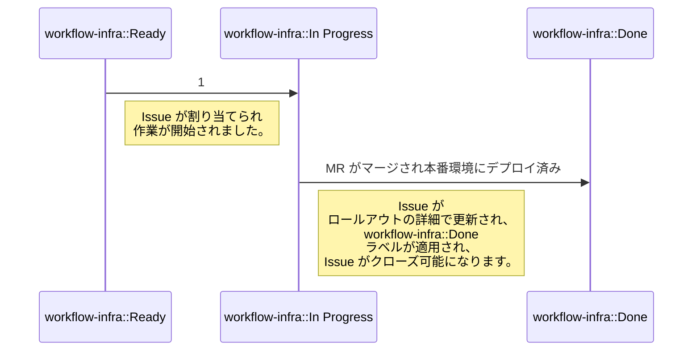

## 共通リンク

|   |   |
|---|---|
| **ワークフロー** | [チームワークフロー](#how-we-work) |
| **GitLab.com** | `@gitlab-org/delivery` |
| **Issue トラッカー** | [**Delivery**](https://gitlab.com/gitlab-com/gl-infra/delivery) |
| **Slack チャンネル** | [#g_release_and_deploy](https://gitlab.slack.com/archives/g_release_and_deploy) / `@delivery-team` |
| **Delivery ハンドブック** | [チームトレーニング](/handbook/engineering/infrastructure-platforms/gitlab-delivery/delivery/training/) |
| **Delivery メトリクス** | [メトリクス](/handbook/engineering/infrastructure-platforms/gitlab-delivery/delivery/metrics/) |
| デプロイとリリースのプロセス | [デプロイとリリース](/handbook/engineering/deployments-and-releases/) |
| Release Tools プロジェクト | [Release tools](/handbook/engineering/infrastructure-platforms/release-tools) |
| Release Manager ランブック | [release/docs/runbooks](https://gitlab.com/gitlab-org/release/docs/-/blob/master/runbooks/README.md) |

## ミッション

Release & Deploy グループは、GitLab Engineering が GitLab.com、GitLab Dedicated、およびセルフマネージドのお客様に対して、**安全**・**スケーラブル**・**効率的**な方法で機能を届けられるよう支援します。このグループは、GitLab の月次・パッチリリースが適切なタイミングで GitLab.com と GitLab Dedicated にデプロイされ、一般公開されることを確保します。

## ビジョン

Release & Deploy グループは、主に内部ユーザー向けの裏方チームであり、その成果物は Infrastructure の主要目標である GitLab の全ユーザー向けサービスおよびセルフマネージドユーザーの**可用性**・**信頼性**・**パフォーマンス**・**スケーラビリティ**に直接影響を与えます。このグループは、Engineering チームが自身の成果を効果的かつ効率的に本番環境に届けるためのワークフロー・フレームワーク・アーキテクチャ・自動化を構築します。

Release & Deploy グループは、[CI/CD ブループリント](https://gitlab.com/gitlab-com/gl-infra/readiness/-/blob/master/library/ci-cd/index.md)を基盤として、高速かつ柔軟なリリースとデプロイを実現し、迅速なロールアウト・障害検知・復旧を可能にする完全自動化されたデプロイ・リリースプラットフォームの構築に注力しています。

Release & Deploy グループの各メンバーはこのビジョンの一員です：

- 各チームメンバーはすべてのチームプロジェクトで作業できます
- チームは常に独自に結論を出せ、ほとんどの場合コンセンサスを形成できます
- キャリア開発パスが明確です
- チームはドキュメント・トレーニングセッション・アウトリーチを通じて知識のデータベースを構築します

ワークフローに GitLab Duo/AI を取り入れるためのアイデアは[こちら](/handbook/engineering/infrastructure-platforms/gitlab-delivery/delivery/ai-use-cases)に集約されています。

### 短期目標

- [メンテナンスポリシー](https://docs.gitlab.com/ee/policy/maintenance.html)を3バージョンの完全サポートに拡張するためのツールとプロセスを開発する
- デプロイパイプラインの可観測性を向上させ、デプロイの非効率性を測定・削減できるようにする
- Release Manager の作業負荷を測定してプロセス改善を推進する

### 中期目標

- 改善されたプロセスと自動化によって Release Manager の作業負荷を大幅に削減する
- インフラ内のトラフィックルーティングを柔軟に制御し、テストやデプロイに必要なリソースを対象とする機能を開発する
- 新しいテスト要件やロールアウト戦略に対応するためのオンデマンド環境作成機能を開発する
- テスト実行の柔軟性を向上させ、左シフトを可能にし、複数パッケージの並行テストを実現する
- Release Manager の作業負荷を維持または削減しながら、組織のニーズに応じてセキュリティリリースをスケールさせる
- デプロイ・リリースツールの変更をテストするためのツールとプロセスを改善し、ツール変更の開発・テストにかかる時間を削減する

### 長期目標

- 標準的・実験的・リスクの高い変更を、他のデプロイプロセスや MTTP への影響を最小限に抑えながら迅速かつ安全にロールアウトできるプログレッシブデプロイ戦略をサポートする
- Delivery チーム以外のメンバーが安全にデプロイ・リリースタスクをセルフサービスで実行できるツールを提供する
- 月次・セキュリティ・パッチリリースプロセスを完全自動化し、セルフマネージドユーザーのリリース速度を向上させ、Release Manager の作業負荷を削減する
- MTTP を現在の12時間目標から大幅に削減する
- ヘルスチェックとロールバックプロセスを強化することで、デプロイ障害の検知と復旧速度を向上させる

## 指導原則

これらは、グループ内で私たちが行っていることが正しいかどうかを評価するために使用できる一連の文または質問です。作業にコミットする際には、その作業がこれらの原則と一致しているかどうかを自問してください。これらの原則は Release & Deploy グループの戦略・ドメインエキスパート・グループメンバーによって推進されます。学習を重ねながら時間とともに若干変化する可能性があるため、固定的なものとして考えるべきではありません。また、これらの原則は [GitLab バリュー](/handbook/values/) に対して補完的なものであり、重複を避けることを目指しています。

これらの原則は、グループと戦略に合致した形で全員が独立して作業できるように意図されています。

### ソリューションを設計するとき

1. リリース管理を簡素化する。タスクを削除するか自動化を改善することで、常にリリースマネージャーの作業を削減しようとします。何かを削除せずに新しいタスクを追加することには非常に慎重になってください
1. [Deployer](https://gitlab.com/gitlab-com/gl-infra/deployer) に機能を追加しない。VM からの移行作業の一環として [Deployer](https://gitlab.com/gitlab-com/gl-infra/deployer) を廃止することを目指しています
1. 常にメトリクスを考慮する。価値を追跡するメトリクスがない場合、それを追加することを検討してください
1. UX の一貫性。ツールのインタラクションと命名全体で一貫性を目指します
1. 低コンテキスト設計。Delivery チーム以外のメンバーが使用する必要があるかのようにツールを設計します。シンプルに保ち、ツールに重い作業をさせましょう

### ソリューションを実装するとき

1. 最小の実装を選ぶ。書くコードが少ないほど、メンテナンス（またはデバッグ）するコードも少なくなります

## 戦略

このサブセクションは[Delivery ディレクションページ](https://about.gitlab.com/direction/gitlab_delivery/)に移動しました。そちらが残りの製品ディレクションと同じ場所にあります。

## トップレベルの責任

グループは優先度順に以下のタスクを定期的に担当します：

1. GitLab SaaS への GitLab アプリケーションソフトウェアの継続的なデリバリーを確保する（例: [GitLab SaaS オートデプロイ](https://gitlab.com/groups/gitlab-org/release/-/epics/13)）
1. 月次・パッチ・セキュリティリリースのセルフマネージドユーザー向けの調整と準備
1. SaaS およびセルフマネージドソフトウェアデリバリーのインシデント解決への参加と是正措置への対応
1. 基盤的なプロジェクト作業を通じた SaaS とセルフマネージドのソフトウェアデリバリーの速度向上（例: [GitLab SaaS の Kubernetes 上での実行](https://gitlab.com/groups/gitlab-com/gl-infra/-/epics/112)）
1. ツールの作成・改善による SaaS ソフトウェアデリバリーの堅牢性向上（例: [デプロイロールバック](https://gitlab.com/groups/gitlab-com/gl-infra/-/epics/282)）
1. GitLab 内の機能をビルド・強化することでカスタムツールの使用を最小化する（例: [Changelog 機能の作成](https://gitlab.com/groups/gitlab-com/gl-infra/-/epics/351)）
1. GitLab SaaS でのソフトウェアデリバリーに関連する他チームのニーズをサポートする（例: [新しいコンテナレジストリのデプロイ](https://gitlab.com/groups/gitlab-com/gl-infra/-/epics/412)）

### チームメンバー

以下の方々が Delivery:Releases&Deploy チームのメンバーです：


<p class="my-3 text-sm text-gray-600 italic">チームメンバー情報は <a href="https://handbook.gitlab.com/handbook/engineering/infrastructure-platforms/gitlab-delivery/delivery/#team-members" rel="external noopener">原文 (英語)</a> を参照してください。</p>


## パフォーマンス指標

Delivery グループは [Infrastructure 部門のパフォーマンス指標] を通じて [エンジニアリング機能のパフォーマンス指標](https://internal.gitlab.com/handbook/company/performance-indicators/engineering/) に貢献します。グループの主要パフォーマンス指標は [**M**ean **T**ime **T**o **P**roduction](https://internal.gitlab.com/handbook/company/performance-indicators/product/saas-platforms-section/#mean-time-to-production-mttp)（MTTP）であり、マージリクエストを通じて導入された変更が本番環境（GitLab.com）に到達するまでの速さを示します。執筆時点では、この PI の目標はこちらの[キーリザルト](https://gitlab.com/groups/gitlab-com/gl-infra/-/epics/107)エピックで定義されています。

## Delivery チーム間のドメインオーナーシップ

Release & Deploy グループは GitLab のデプロイとリリースに必要なツールと機能を所有しています。以下の図は、2つのチームと現在のリリースマネージャーの間のドメインオーナーシップの分担を示しています。Release & Deploy グループ外のチームとドメインが重複する箇所では、主にデプロイとリリースの機能とニーズに焦点を当てています。


- [ダイアグラムのソース](https://docs.google.com/presentation/d/1KdrrdYpjdHinYyUa2V3nUCWico74twXWfCCJg-m0ODI/edit?usp=sharing)

### Release Manager オーナーシップ

Release Manager は Release & Deploy グループのメンバーですが、リリースマネージャーとして活動している期間は異なる役割を担います。主要な顧客は GitLab ユーザーです。

1. オートデプロイ: Release Manager はオートデプロイプロセスを運営します。これは主に Deployments チームが提供する機能を活用しますが、オーケストレーションツールは Deployments チームの機能を使用します。環境ヘルスチェックは、リリースマネージャーが使用するプロセスとツールに不可欠な Deployments の機能の例です。
2. セルフマネージドリリース: Release Manager は Releases チームが提供する機能を使用してリリースプロセス（パッチとセキュリティ）を運営します。
3. デプロイ後のマイグレーション: Release Manager は Deployments チームが提供する機能を使用して PDM プロセスを運営します。
4. ホットパッチプロセス: Release Manager は EOC と協力してホットパッチプロセスを管理します。ホットパッチ機能は Releases チームが提供しますが、短縮されたプロセスのためパイプラインジョブが削減されることから、Deployments 機能への依存度が高くなっています。
5. デプロイブロッカー: Release Manager はデプロイブロッカーの特定と報告に責任を持ち、チームが改善を計画するために必要なデータを提供します。
6. Release Manager ダッシュボード: Release Manager は <https://dashboards.gitlab.net/d/delivery-release_management/delivery-release-management?orgId=1> を所有し、リリース管理に役立つと判断した追加ダッシュボードを自由に作成できます。ダッシュボードに必要なデータは、Deployments が所有する一元化された場所から提供されます。
7. デプロイブロッカーのエスカレーション。2時間以上解決の見通しが立たないデプロイブロッカーに直面した場合、PagerDuty の `Release Management Escalation` スケジュールに[エスカレーション](/handbook/engineering/infrastructure-platforms/gitlab-delivery/delivery/#release-management-escalation)してデプロイの調整と解除を支援してもらいます。

### Delivery:Releases オーナーシップ

Releases チームの主要な顧客：

- デプロイ・リリースの変更を行いたい GitLab 内部ユーザー、すなわち
- Release Manager とステージグループ
- 月次リリースのお客様

1. リリースメトリクス: リリースに関するメトリクスの一元化されたストアを提供します。Deployments は主に、すべてのデプロイパイプラインが必要なダッシュボードを活用する形でメトリクスを記録できるメトリクス機能の提供に関心があります。
1. リリース/パッケージパイプラインの可視性: パイプライン設定・ステータス・成果の可視性を提供します。
1. リリース変更管理ツール: セルフマネージドユーザーへのリリースに変更を含めたり除外したりする機能を提供します。
1. リリース/パッケージング実行ログ: リリースの正確なログが維持されることを確保します。
1. デプロイ・リリースのメタデータ: コンポーネントのバージョンと依存関係を追跡し、品質ゲートの正確性を確保し、予測可能なリリースを保証します。
1. QA テスト実行と結果の可視性: すべてのデプロイとリリースが必要なテストをパスすることを確保します。Releases は特にテスト実行のタイミングと、信頼性の高い結果のための正しい依存関係の整備に関心があります。
1. リリースダッシュボード: Delivery:Releases は、効果的なリリースプロセス設計に向けたチームの作業をガイドするダッシュボードのセットを所有します。個々のリリースパイプラインの有効性を評価するためのダッシュボードまたはテンプレートも必要になります。
1. リリース公開: パッケージをさまざまな配布サイト（例: packages.gitlab.com、Docker Hub など）への公開、公開ツール、および信頼性の高い公開プロセスの保証。

### Delivery:Deployments オーナーシップ

Deployments チームの主要な顧客：

- デプロイツールに依存するリリースマネージャー
- GitLab SaaS（GitLab.com、Dedicated、Cells）ユーザーで、さまざまなインフラへの更新コードのデプロイを期待している方々

1. デプロイ変更ロック: すべてのデプロイが計画的・臨時の変更ロックを遵守することを確保します。例として PCL・S1/S2 インシデント・その他の変更リクエストが含まれます。
1. 環境変更ロック: 環境をスケジュールまたは計画メンテナンスや環境の健全性が低下している場合は臨時でロックできることを確保します。変更が予測可能な方法でロールアウトされることの保証も Deployments の責任です。
1. 環境の健全性: デプロイ決定をガイドするための環境の健全性評価と可用性の確保。
1. リリース・デプロイメトリクス: デプロイ・リリースに関するメトリクスの一元化されたストアを提供します。Deployments は主に、すべてのデプロイ・リリースパイプラインが必要なダッシュボードを活用する形でメトリクスを記録できるメトリクス機能の提供に関心があります。
1. デプロイ変更管理ツール: デプロイに変更を含めたり除外したりする機能を提供します。
1. デプロイ実行ログ: デプロイの正確なログが維持されることを確保します。
1. アプリケーションロールアウト: 必要なクラスターと環境への変更適用に責任を持ちます。カナリア・ブルー/グリーン・段階的なトラフィック増加などのロールアウト戦略は、Deployments が提供する機能です。
1. ロールアウトダッシュボード: すべての環境への効果的なロールアウト管理に向けたチームの作業をガイドするダッシュボードのセットを所有します。個々のサーバーへの変更適用タイミングや環境使用状況の可視性などが例として挙げられます。
1. カナリア環境: カナリア環境のロールアウト機能を所有します。完全な環境管理を確保するために Reliability と密に連携します。
1. デプロイ・リリーステスト環境: Pre・Staging・Release 環境のロールアウト機能を所有します。完全な環境管理を確保するために Reliability と密に連携します。
1. デプロイ・リリース本番環境: 本番環境のロールアウト機能を所有します。完全な環境管理を確保するために Reliability と密に連携します。
1. デプロイダッシュボード: Delivery:Deployments は、効果的なデプロイプロセス設計に向けたチームの作業をガイドするダッシュボードのセットを所有します。個々のデプロイ・リリースパイプラインの有効性を評価するためのダッシュボードまたはテンプレートも必要になります。

## 私たちの働き方

### チームへのコンタクト

| 理由 | 窓口 | 経由 |
| ------ | ------- | --- |
| S1/P1 のデプロイ/リリース関連 Issue | `@release-managers` | Slack |
| 任意の優先度のデプロイ/リリース関連 Issue | `@gitlab-org/delivery` | GitLab |

Release Manager は平日のフォロー・ザ・サン体制で輪番し、Slack の `@release-managers` ハンドルで連絡できます。週末のサポートやその他のエスカレーションについては、以下のリリース管理エスカレーション手順に従って Delivery リーダーに連絡してください。

#### リリース管理エスカレーション

平日の就業時間中は、Slack の `@release-managers` ハンドルで現在の Release Manager に連絡できます。

就業時間外のリリース管理サポートが必要な場合、または Delivery リーダーシップへのエスカレーションが必要な場合は、以下の手順に従って PagerDuty でページングしてください。

1. Slack で PagerDuty アプリを開き、`/pd trigger` コマンドを使用して新しいインシデントをトリガーします

2. `Release Management Escalation` サービスを選択し、`Title` フィールドにリクエスト詳細を入力します。他のフィールドはすべて空欄のままにできます

3. `Create` をクリックすると、Delivery リーダーの一人が対応します

### プロジェクト管理

Release & Deploy グループの作業は、多数のエピック・Issue・Issue ボードで追跡されます。

エピックと Issue ボードは相互補完的であり、作業エピックと Issue ボードの間で常に1対1のマッピングを持つよう努めます。エピックは作業を説明し、一般的な議論を可能にします。一方、Issue ボードは任意のエピックにおける進捗の順序を示すためのものです。

各プロジェクトには、Issue ボードがプロジェクト全体のビューを表示できるよう、すべてのエピックと Issue にプロジェクトラベルを適用する必要があります。

Issue は可視性と優先順位付けのために、主に [delivery issue tracker](https://gitlab.com/gitlab-com/gl-infra/delivery) に作成してください。Delivery がメンテナンスするリポジトリは独自の Issue トラッカーを無効化してください。これは、チーム内で優先順位付けと可視化のための単一の情報源を確保するためです。

### エピック

[Release Velocity](https://gitlab.com/groups/gitlab-com/gl-infra/-/epics/170) エピックはグループミッションに関連するすべての作業を追跡します。チームが作成する作業エピックは、このトップレベルのトラッキングの子として直接追加してください。

作業エピックには常に以下が必要です：

1. [問題ステートメント](https://lamport.azurewebsites.net/pubs/state-the-problem.pdf)
1. プロジェクト完了に責任を持つ[直接責任者](/handbook/people-group/directly-responsible-individuals/)（DRI）
1. 定義された終了基準
1. クイックアクションのための Issue 優先度・ラベル・エピックを提供する Issue 管理セクション。[例](https://gitlab.com/groups/gitlab-com/gl-infra/-/epics/273#issue-template)
1. 何を作業しているか・なぜか・計画された次のステップを示す YYYY-MM-DD 形式のステータス。DRI は毎週水曜日にエピックステータスを更新する責任があります。これはエピック内の最後の見出しである必要があり、自動エピックサマリー更新をサポートします
1. 開始日と推定終了日
1. ラベル:
    - 
    - プロジェクトスコープの一部として使用されるラベル（例: `kubernetes`、`security-release`）。DRI は適切なプロジェクトスコープラベルを作成し、必要に応じて [Delivery-triage ルール](https://gitlab.com/gitlab-com/gl-infra/triage-ops) に追加してください
    - 'workflow-infra::triage'、'workflow-infra::proposal'、'workflow-infra::in-progress'、'workflow-infra::done' を使用したエピックステータスラベル

作業が標準プロジェクトの場所とは別のグループのプロジェクトで追跡される場合、同じトピックに対して2つのエピックを作成し、エピックの説明でどちらが作業エピックかを明記します。

### Issue ボード

各作業エピックには Issue ボードが必要です。Issue ボードは特定のプロジェクトのニーズに合わせてカスタマイズする必要がありますが、最低限ワークフロー図に示された[ワークフローラベル](#workflow)が含まれている必要があります。

### ラベル

Release & Deploy グループの正規の Issue トラッカーは [gl-infra/delivery](https://gitlab.com/gitlab-com/gl-infra/delivery) にあります。ラベルが適用されていない場合、[triage ops](https://gitlab.com/gitlab-com/gl-infra/triage-ops) プロジェクトによって自動的にラベルが付与されます。デフォルトラベルは[ラベリングライブラリ](https://gitlab.com/gitlab-com/gl-infra/triage-ops/-/blob/master/lib/delivery/default_labeling.rb)で定義されています。

デフォルトでは、Issue には以下が必要です：

1. ワークフローラベル - デフォルト: `workflow-infra::Triage`
1. 優先度ラベル - デフォルト: `Delivery::P4`
1. チームラベル - `team::release-and-deploy`
1. グループラベル - `group::delivery-deploy` または `group::delivery-release`
1. その他ラベル - プロジェクトまたはチーム管理に関連するラベル

#### ワークフロー

Release & Deploy グループはスコープ付きの `workflow-infra` ラベルを使用して作業のさまざまなステージを追跡します。

すべての Issue が準備完了後すぐにビルドのために優先順位付けされるわけではありません。代わりに、チームの現在の目標に焦点を当てた `workflow-infra::In Progress` と `workflow-infra::Ready` のすべての Issue を含む[ビルドボード](https://gitlab.com/gitlab-com/gl-infra/delivery/-/boards/1918862)を管理します。

標準的なワークフローの進行は以下のとおりです：



上記の図から省略された重要な3つのワークフローラベルがあります：

1. `workflow-infra::Cancelled`:

    - 外部要因または Issue を解決しないという決定により、Issue 内の作業が中断されました。このラベルを適用後、Issue はクローズされます。

1. `workflow-infra::Stalled`

    - 作業は中断されていないが、他の作業が高い優先度を持っています。このラベルを適用後、チームのエンジニアリングマネージャーが Issue に記載され、優先度を変更するか追加の支援を探します。

1. `workflow-infra::Blocked`

    - 外部の依存関係またはその他の外部要因により作業がブロックされています。このラベルを適用後、ラベルが削除できるまでチームによって定期的にトリアージされます。

`workflow-infra::Done` ラベルは作業の完了を示すために適用されますが、その唯一の目的は、Issue の衛生を確保するために作業完了時に Issue がクローズされることを保証することです。

#### 優先度ラベル

Release & Deploy グループは優先度ラベルを使用して、次に取り組む作業の順序を示します。優先度に付与される意味は以下のとおりです：

| 優先度レベル | 定義 |
| --------------- | ---------- |
| Delivery::P1 | 他のチームメンバーまたは他の作業をブロックしている Issue。現在の作業を後回しにしてでも、即座に対応する必要があります。 |
| Delivery::P2 | 大きな影響を持つ Issue で、現在の OKR に貢献するか、追加作業を生み出します。進行中のタスクを完了した後、できるだけ早く作業を開始してください。 |
| Delivery::P3 | 他の緊急作業が完了したら対応すべき Issue です。 |
| Delivery::P4 | **デフォルトの優先度**。あったらいい改善・非ブロッキングの技術的負債・または議論 Issue です。将来的に完了するか、作業が完全に中断される可能性があります。 |

グループは[一般的な Issue トリアージの優先度定義](/handbook/product-development/how-we-work/issue-triage/#priority)とは異なる方法で優先度ラベルを使用します。これは、ステージチームとインフラチームのタイムライン（リリースは Delivery に異なる期待をもたらします）・DRI（Delivery には PM がいません）・重要性（ブロックされたリリースは誰も出荷できないことを意味します）の違いによる曖昧さを避けるためです。

#### Delivery インパクトラベル

インシデントにはオプションで `Delivery impact:*` ラベルを付けて、アクティブ時のインシデントのインパクトを示すことができます。このラベルは複数のインシデント間での優先順位付けに役立てることを目的としています。

| **インパクトラベル** | **定義** |
| ----- | ---------- |
| Delivery impact::1 | このインシデントによってデプロイおよび/またはスケジュールされたリリースが完全にブロックされています。直ちに解決するための対応を取ってください |
| Delivery impact::2 | デプロイおよび/またはスケジュールされたリリースが間もなくブロックされます。できるだけ早く解決してください |
| Delivery impact::3 | デプロイとリリースは現在ブロックされていませんが、デリバリープロセスに何らかの影響があります |

#### その他のラベル

チーム管理に関連するラベルの一部は以下のように定義されています：

1. `onboarding` - チームリソースへのアクセス付与に関連する Issue
1. `team-tasks` - 一般的なチームトピックに関連する Issue
1. `Discussion` - 作業エピックに昇格するか、別の実装 Issue を生み出す可能性のあるメタ Issue
1. `Announcements` - より広いオーディエンスへの重要な変更を告知するために使用される Issue

プロジェクトラベルは必要に応じて定義されますが、Issue がチーム管理タスクを説明する場合を除いて必須です。

Delivery に影響するインシデントにはオプションで[インパクトラベル](#delivery-impact-labels)を含めることができます。

#### Delivery:Deployments 固有の作業方法

エピック・Issue ボード・ラベル・ワークフローの慣行に加え、Delivery:Deployments チームはチーム内のコミュニケーションを改善し、知識と決定をより良く共有するためにいくつかの追加アプローチを採用しています。

- 各エピックには `Decision Log`（決定ログ）を含める必要があります: これにより、プロジェクト作業中に下されたすべての決定が一覧表示される単一の集中型 SSOT を維持できます。完全性のために、決定の日付・議論と決定に関与した人物・決定の結果を報告してください。

  シンプルにするために、以下のスニペットを使用してエピックの説明に Decision Log を追加できます：

  ```markdown
  ### Decision Log

  <details>
    <summary>Decision List</summary>

    <details>
      <summary>YYYY-MM-DD</summary>
        <Discussion details, people involved in the discussion and decision, decision outcome>
    </details>
  </details>
  ```

- 各 Issue にはコメントとして `Progress Thread`（進捗スレッド）を含める必要があります: これにより、非同期環境で作業を可視化し、作業が進む中で知識を共有できます。進捗スレッド内のコメントは、達成された進捗・中間ステップ/結果・仮定・発見・直面するブロッカーを強調すべきです。このアプローチにより、チーム内外の人々が明確なアイデアを構築し、コメントや提案で貢献できるようになります。

### 作業の選択

Release & Deploy グループには通常、作業エピックに割り当てられた [DRI](/handbook/people-group/directly-responsible-individuals/) がいます。DRI は作業を Issue に分解し、適切な Issue を[ビルドボード](https://gitlab.com/gitlab-com/gl-infra/delivery/-/boards/1918862)に移動してプロジェクトを軌道に乗せる責任があります。ただし、どのプロジェクトに属するかに関わらず、[ビルドボード](https://gitlab.com/gitlab-com/gl-infra/delivery/-/boards/1918862)からタスクを選択することは誰でも歓迎されます。

### マージリクエスト

Release & Deploy グループは、[すべてをマージリクエストから始める](/handbook/communication/#start-with-a-merge-request)という会社の原則を尊重します。

1. すべてのマージリクエスト（MR）はレビュープロセスを経る必要があります。
1. MR には [Delivery ラベル](/handbook/engineering/infrastructure-platforms/gitlab-delivery/delivery/#labels) を付与してください。
1. MR の準備が整ったら、MR の作者がレビュアーを割り当てることが期待されます。
1. [GitLab コードレビューガイドライン](https://docs.gitlab.com/ee/development/code_review.html)に従ってください。
1. [レビュアー機能をドッグフードする](https://docs.gitlab.com/ee/development/code_review.html#dogfooding-the-reviewers-feature)ことで、MR にレビュアーを割り当てます。

さらに、マージリクエストを行う際にいくつかのベストプラクティスを適用するよう努めます：

- レビュアーの選択: 通常、Delivery の任意のチームメンバーをレビューに割り当てることができますが、いくつかの考慮点があります：
  - Release & Deploy グループ全体を MR レビューに追加して過剰な通知が発生することを避けます。
  - GitLab チームはグローバルに分散しているため、レビュアーとして割り当てる際はタイムゾーンを考慮してください。
  - プロジェクト - レビュアーはプロジェクトに精通しているか、少なくとも馴染みがある必要があります。例えば、release-tools のレビューは通常バックエンドエンジニアが担当し、k8s-workloads のレビューは SRE が担当します。
  - コンテキスト - ピアと密接に作業している場合は、レビューサイクルを短縮するためにそのチームメンバーに割り当てることをお勧めします。
  - Release Manager（またはキャパシティ）- チームメンバーが[リリースマネージャー](https://about.gitlab.com/community/release-managers/)でリリースタスクに取り組んでいる場合、レビューで煩わせるべきではありません。
- 通常の[コードレビューのターンアラウンド](/handbook/engineering/workflow/code-review/#review-response-slo)は2営業日です。
  - これは MR が `~Delivery::P1` アイテムに関連している場合には適用されません。その場合、MR のレビューは優先度と緊急性をもって扱う必要があります。
- MR に必要なすべての承認が得られた場合、作者がマージできます。
- レビュアーとして割り当てられたが、MR に最適でないと思う場合（就業時間外・理解が不十分・レビューするキャパシティがないなど）、MR の作者にその旨を伝えて、利用可能な別のメンテナーを見つけるか、より適していると思うチームメンバーを選択できるようにしてください。
- Delivery チームプロジェクトでは、通常1つの承認で MR をマージするのに十分ですが、レビュアーまたは作者が望む場合は別のレビューをリクエストできます。レビュアーが唯一のレビュアーであることに不安を感じている場合、作者がもう一対の目が必要な場合、またはその他の理由で2回目のレビューがリクエストされることがあります。

## プロジェクトデモ

プロジェクトの一環として、プロジェクトデモを開催することを決定する場合があります。デモを作成するかどうかの決定はプロジェクトの予想される寿命に依存しますが、その複雑さにも依存します。

デモの目的は、プロジェクトに参加するすべての人が、通常の非同期ワークフロー以外で自分たちの発見や遭遇した課題を共有できる方法を確保することです。デモにはプレゼンテーションは付属していませんが、事前の準備も必要ありません。デモンストレーターは準備不足を謝罪する必要があると感じる必要はなく、説明が完璧でなくてもかまいません。実際、デモされているものに弱点が見られない場合、スコープを適切に削減できていないかもしれません。

以下を示し議論することが奨励されます：

1. 特定のコード実装の不完全さ
1. 使用したツールがどれほど壊れているか
1. 確立されたプロセスがどのように機能しなくなるか
1. 解決しようとしている問題がどれほど困難か

## チームトレーニング

Release & Deploy グループのすべてのメンバーは、グループの残りのメンバーにトレーニングセッションを作成するか、ペア作業を通じてスキルを共有する責任があります。詳細については[チームトレーニング](/handbook/engineering/infrastructure-platforms/gitlab-delivery/delivery/training/)ページをご覧ください。

## 歴史

Delivery チームは[2018年10月23日に正式に発足](https://gitlab.com/gitlab-com/www-gitlab-com/-/merge_requests/15348/)しました。これは、セルフマネージドユーザーのリリースを効率化し、GitLab.com ユーザーにより良い体験を提供する必要性によって明らかになった、その年を通じて進行していた大規模な調整の集大成でした。

GitLab の存在期間を通じて、リリース管理は開発者が毎月輪番で担当していました。これは開発者が自分が作成したソフトウェアのライフサイクル全体に近い状態を維持し、自分たちの作業を自動化することを確保するための考え方でした。これはアプリケーション変更の数と開発者タスクが、誰にとってもセカンダリタスクとして処理するには大きすぎるまで機能していました。変更の必要性を示したイベントは2017年末のニアミスイベントで、最初のリリース候補が22日のわずか2日前に GitLab.com にデプロイされました。その月全体が課題の連続で、リリースマネージャーが日々の開発タスクと RM タスクの両方をこなすのに苦労し、GitLab.com への複数の失敗したデプロイがありました。最も重要なことは、これが会社が成長していて、以前機能していたプロセスが計画された大きな成長に対応するために変更が必要かもしれないという最初の指標でした。

社内での議論の後、一度にすべてを変更するのではなく、[プロセス改善に取り組む](https://gitlab.com/gitlab-org/release/tasks/-/issues/39)ことで2018年に入りました。月次のローテーションから2ヶ月の[リリースマネージャーローテーション](https://about.gitlab.com/community/release-managers/)に移行し、[費やした時間を記録](https://gitlab.com/gitlab-org/release/tasks/-/issues/1)し始めました。その後数ヶ月にわたってプロセスの全体的な安定化が見られましたが、4人のエンジニアの時間をリリースマネージャーローテーションに費やしても、GitLab.com のデプロイプロセスの改善に近づけていないことが明らかになりました。採用した開発者ごとにタスクリストは大きくなっていきました。

[GitLab.com での継続的デリバリーを達成するために何が必要か](https://gitlab.com/gitlab-com/gl-infra/delivery/-/issues/1)についての最初の議論は、この特定のタスクに集中したチームの明確な必要性を示しました。

チームが作成されると、[設計したリリース](https://gitlab.com/gitlab-com/www-gitlab-com/-/merge_requests/16028)への取り組み、[GitLab.com へのデプロイ方法の変更](https://gitlab.com/gitlab-com/www-gitlab-com/-/merge_requests/17842/diffs)、[GitLab Rails コードベースのマージ](https://gitlab.com/gitlab-com/www-gitlab-com/-/merge_requests/19037/diffs)など、多くのタスクに着手しました。

[チームオンサイト（別名 Fast boot）](https://gitlab.com/groups/gitlab-org/release/-/epics/17)での成功後、初めて同じ部屋でタスクを実行し、[GitLab.com での継続的デリバリーに向けた最初のステップを発表](https://gitlab.com/gitlab-com/gl-infra/delivery/-/issues/345)しました。これは非常に大きな変化で、デプロイ頻度を月に1回（バグ修正を含めて合計4〜6回のデプロイ）デフォルトブランチからデプロイすることから、毎週デフォルトブランチからコミットを取得するように変更しました。

チームの焦点はその後、デプロイ時間を時間単位で測定することと、GitLab.com の Kubernetes への移行に移りました。

2020年以前は、チームのインパクトの概要が Slack で作成されていましたが、その後の年は Issue でログに記録されています：

1. [2020年の年間概要](https://gitlab.com/gitlab-com/gl-infra/delivery/-/issues/1446)
1. [2021年の年間概要](https://gitlab.com/gitlab-com/gl-infra/delivery/-/issues/2171)
1. [2022年の年間概要](https://gitlab.com/gitlab-com/gl-infra/delivery/-/issues/2726)
1. [2023年の年間概要](https://gitlab.com/gitlab-com/gl-infra/delivery/-/issues/19887)
1. [2024年の年間概要](https://gitlab.com/gitlab-com/gl-infra/delivery/-/issues/20754)
