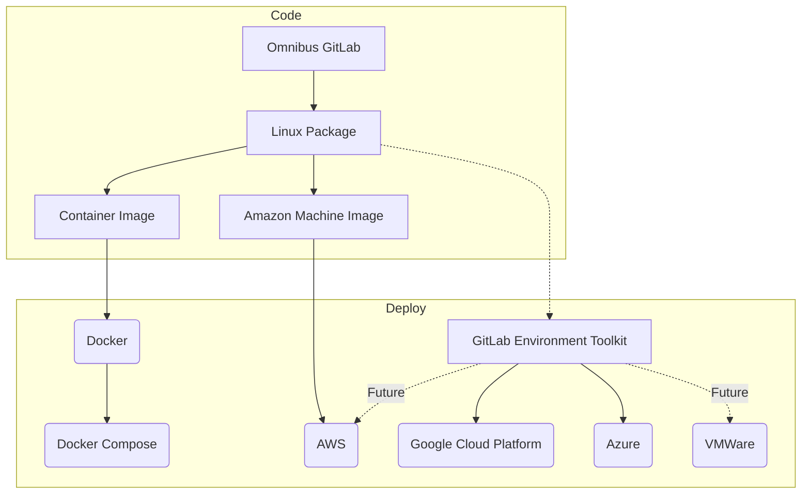
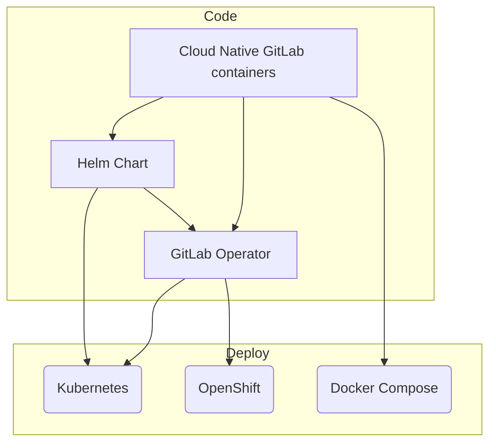

## 概要

Distribution チームは **Distribution:Build** と **Distribution:Deploy** という2つのサブグループで構成されています。

Build チームは、システムパッケージ・コンテナイメージ・マーケットプレイスリスティングなどのアーティファクトと、それらを作成・維持するために必要なツールの制作に注力しています。

Deploy チームは、スムーズなデプロイを確保するためのインストールおよびアップグレードメカニズムに注力しています。これにはシステムインテグレーション・スクリプト・テンプレート・関連する設定管理ツールが含まれます。

[製品デリバラブル](https://gitlab.com/groups/gitlab-org/-/issues/?sort=created_date&state=opened&label_name%5B%5D=group%3A%3Adistribution&label_name%5B%5D=Deliverable&milestone_title=Any)に加えて、両グループはチーム外から作成された多数の MR をレビューします。これらには、依存関係・セキュリティの更新、設定コントロール、PostgreSQL・Consul・Patroni などのバンドルされたコンポーネントが含まれます。

## ターゲットユーザー

Distribution の主要ユーザーペルソナは、GitLab インスタンスの管理を担当するシステム管理者です。チームの目標は、さまざまなオンプレミスおよびクラウドプラットフォームで、さまざまなスケールで GitLab をできるだけ簡単にデプロイ・アップグレード・設定できるようにすることです。

デプロイには、GitLab を評価するための単一ノードデプロイから、50Kユーザーリファレンスアーキテクチャとそれ以上まで、あらゆるものが含まれます。主な目標は、エンドユーザーが最小のダウンタイムやサービス中断で GitLab を管理する際に、高速で摩擦の少ない体験を確保することです。

Omnibus パッケージ・Helm Charts・Operator は、Distribution が現在サポートしている主要なデプロイ方法です。

### Distribution Build

<!-- markdownlint-disable MD051 -->
[チーム](#distribution-build-team)    |
[チャーター](#distributionbuild-charter)

責務：

- 新しいクラウド・プラットフォーム・アーキテクチャ・コンポーネントのサポートに向けた調査
- アクセスコントロール・権限・CVE パッチ
- 依存関係の更新
- ライセンス管理
- 検証/認定のためのパートナーへの提出
- [インストール](https://about.gitlab.com/install/)・[更新](https://about.gitlab.com/update/)・[アップグレード](https://about.gitlab.com/upgrade/)ページ
- さまざまなインストール方法を作成するために使用されるインフラのビルドと所有
- Distribution で使用される[インフラのメンテナンス](#infrastructure-and-maintenance)

### Distribution Deploy

[チーム](#distribution-deploy-team)
[チャーター](#distributiondeploy-charter)
<!-- markdownlint-enable MD051 -->

責務：

- Self-Managed インストールと GitLab.com のための初期インストールと構成可能性
- アップグレード / ダウングレード
- デプロイのスケーリング
- プラットフォームまたはプロバイダー間の移行
- データライフサイクル管理
- セキュアな設定 & 通信
- 既存ツールへの統合のためのクラウドとプラットフォームの調査

## ビジョン

Distribution チームのビジョンは以下のとおりです（これに限定されません）：

### テクノロジー

- GitLab はすべての主要プラットフォームとアーキテクチャで公式インストール方法を持っています。
- GitLab はすべての主要クラウドプラットフォームで公式のワンクリックインストール方法を提供しています。
- GitLab は安全かつ確実に自動アップグレードできます。
- Kubernetes パッケージリポジトリ用の公式リポジトリがあります。
- GitLab は高リソースシステムと低リソースシステム（Raspberry Pi など）の両方で同様に動作します。
- GitLab.com は公式のインストール方法を使用して動作しています。
- すべての GitLab 機能はデフォルトでインストールおよび設定されます。
- GitLab を設定するためのインストールインターフェース。
- GitLab のインストールはいずれもインストール/アップグレードエラーを自動的に報告できます。
- HA 設定での GitLab のセットアップが自動化されシンプルになります。
- すべてのインストール方法はリリース前に自動的にテストされます。
- 最も頻繁に使用される設定オプションがエンドツーエンドの統合テストでテストされます。

### チーム

- 各チームメンバーはすべてのチームプロジェクトで作業でき、特定のテクノロジーに集中する能力も持っています。
- 各チームメンバーは、チームの最優秀者よりも優れた人材を採用することを目的とした採用パネルの一員です。
- チームはセルフサービスモデルをサポートするための知識と認識を高めるドキュメントを作成します。
- チームは常に独自に結論を出せ、ほとんどの場合コンセンサスを形成できます。
- チームは頻繁に使用されるテクノロジーとプラットフォームの公式認定を持っています。
- オンボーディングとオフボーディングが効率的です。
- キャリア開発パスが明確です。

## ミッション

Distribution は GitLab のインストールとメンテナンスの体験が誰にとっても簡単で安全であることを確保します。Distribution チームの任務は、最も幅広いインストール/更新のユースケースを考慮し、ほとんどのニーズを満たすソリューションを提供することです。Distribution は、ソフトウェアのインストールとメンテナンスに関して初心者にも経験者にも最高の体験を提供するためにあります。

### Distribution:Build チャーター

Build チームの焦点は、GitLab コンポーネントがテスト済みで最新で、ライセンスに準拠しており、ユーザーのプラットフォームとアーキテクチャで利用可能であることを確保することです。このグループはビルドパイプラインを管理し、新しいサービス・プラットフォーム・アーキテクチャのサポートを調査し、既存のものをメンテナンスします。ユーザーにとって安全で信頼性の高い製品を確保するために、ビルドの失敗・セキュリティ結果・依存関係の変更に効率的に対応することを目指しています。

### Distribution:Deploy チャーター

Deploy チームの焦点は、製品全体としての GitLab の設定・デプロイ・運用です。目標は、直感的で明確で摩擦のないインストール体験を提供し、あらゆる規模のデプロイに対してスムーズでシームレスなアップグレードとメンテナンスプロセスを続けて提供することです。スケーリング・ほぼゼロダウンタイムのアップグレード・インスタンス管理者だけでなくそのユーザーにとっても高信頼性な体験のための継続的な運用上の振る舞いを提供することを目指しています。

## チームメンバー

### Distribution Build チーム

以下の方々が Distribution:Build チームのメンバーです：

チームメンバー情報は <a href="https://handbook.gitlab.com/handbook/engineering/infrastructure-platforms/gitlab-delivery/distribution/#distribution-build-team" rel="external noopener">原文 (英語)</a> を参照してください。

### Distribution Deploy チーム

以下の方々が Distribution:Deploy チームのメンバーです：

チームメンバー情報は <a href="https://handbook.gitlab.com/handbook/engineering/infrastructure-platforms/gitlab-delivery/distribution/#distribution-build-team" rel="external noopener">原文 (英語)</a> を参照してください。

### ステーブルカウンターパート

以下の他の機能チームメンバーが私たちの[ステーブルカウンターパート](/handbook/leadership/#stable-counterparts)です：

チームメンバー情報は <a href="https://handbook.gitlab.com/handbook/engineering/infrastructure-platforms/gitlab-delivery/distribution/#distribution-build-team" rel="external noopener">原文 (英語)</a> を参照してください。

## 共通リンク

- [Distribution チームの Issue トラッカー](https://gitlab.com/gitlab-org/distribution/team-tasks)
- [Slack チャットチャンネル](https://gitlab.slack.com/archives/distribution)

## チームの責任

Build と Deploy の[個別の責任](#概要)に加えて、Distribution チーム全体は以下の責任を持ちます：

1. omnibus-gitlab インストールパッケージ
   - パッケージを使用したインストールがシンプルで迅速・安全でデータの整合性を保護します。
1. クラウドネイティブなインストール方法
   - Helm チャートを使用したインストールが増加する需要に合わせて簡単にスケールできます。
1. 所有するすべての[プロジェクト](#all-projects)での [Issue のトリアージ](triage.md)と[マージリクエストのレビュー](merge_requests.md)
1. 最近のソリューションや進行中の作業の定期的な[デモンストレーション](demo.md)の提供

## チームの目標

チームの責任に基づき、以下の目標が適用されます：

- Distribution:Build
  - インストールページは完全で正確かつ簡単で役立ち、魅力的である必要があります。チームの主なスキルがデザインや UX でなくても、このスキルを主スキルとするチームの助けを借りてページを維持できます。
  - dev.gitlab.org では、Distribution Build チームの公式アーティファクトのいずれかを使用して、nightly ビルドがインストールされます。この作業の目的は、コミュニティが使用するインストール方法のいずれかを使用して本番レベルのインスタンスを持つことです。
- Distribution:Deploy
  - omnibus-gitlab インストールパッケージとクラウドネイティブなインストール方法により、初心者でも迅速・正確・完全に GitLab をインストールできる必要があります。必要な設定は最小限に抑え、可能な限りユーザーのためにこの設定を自動化することが Distribution Deploy チームの責任です。
  - omnibus-gitlab インストールパッケージとクラウドネイティブなインストール方法は、上級ユーザーがより複雑な GitLab アーキテクチャを設定できるよう十分に設定可能である必要があります。
  - 上記の2つの目標は相反するように聞こえますが、そうではありません。Distribution チームのプロジェクトのメンテナンスコストを上げることなく、これらの2つの目標の間で妥協点を見つけることができます。最初のインストール体験を最適化し、その後さらに複雑な要件に対応します。
- Distribution 共通目標
  - Issue トラッカーのトリアージは、私たちが行った変更のパルスを維持できるタスクです。ユーザーや顧客と接触することで、最も頻繁に報告されるバグやリクエストされた機能への可視性を維持できます。報告されたすべてのものが解決されるわけではありませんが、報告の_すべて_はトリアージされるべきです。これは、`Distribution` と `group::distribution` ラベルがついた Issue の GitLab CE/EE リポジトリでのメンションにも適用されます。
  - すべての Distribution チームメンバーは、チームの残りのメンバーのためにトレーニングセッションを作成する責任があります。詳細については[チームトレーニング](training.md)ページをご覧ください。
  - GitLab.com を管理するチームが Issue を作成した場合、そのアイテムはチームのエンジニアリングマネージャーとプロダクトマネージャーに直接報告する必要があります。これらの Issue は重要ですが、必ずしも完全なソリューションをすぐに提供する必要はありませんが、相手チームと協力して要求に対する前進の道筋を作る必要があります。

## 主要プロジェクト

[omnibus-gitlab](https://gitlab.com/gitlab-org/omnibus-gitlab) - このプロジェクトは、クラウド環境やオンプレミスホスティングの Self-Managed 利用向けに、プラットフォーム固有の自己完結型 GitLab パッケージとイメージを作成します。

[Cloud Native GitLab](https://gitlab.com/gitlab-org/build/CNG) は GitLab をデプロイするためのクラウドネイティブコンテナを提供します。これらのコンテナは、Kubernetes・OpenShift・Kubernetes 互換コンテナプラットフォーム上で [GitLab Charts](https://gitlab.com/gitlab-org/charts/gitlab) または [GitLab Operator](https://gitlab.com/gitlab-org/cloud-native/gitlab-operator) を使用して Helm によってデプロイ・管理できます。

### Omnibus GitLab プロジェクトの製品成果物

### Cloud Native GitLab プロジェクトの製品成果物

## すべてのプロジェクト

| 名前 | 場所 | 説明 |
| -------- | -------- | -------- |
| Omnibus GitLab | [gitlab-org/omnibus-gitlab](https://gitlab.com/gitlab-org/omnibus-gitlab) | Ubuntu・Debian・CentOS/RHEL・OpenSUSE・SLES などすべての主要 Linux OS の LTS バージョン向けに HA サポート付きのプラットフォーム固有の自己完結型 GitLab パッケージとイメージをビルドします |
| Docker All in one GitLab image | [gitlab-org/omnibus-gitlab/docker](https://gitlab.com/gitlab-org/omnibus-gitlab/tree/master/docker) | omnibus-gitlab パッケージをベースにした GitLab CE/EE の Docker イメージをビルドします |
| GitLab Helm Chart | [gitlab-org/charts/gitlab](https://gitlab.com/gitlab-org/charts/gitlab) | Cloud Native GitLab Helm Charts |
| GitLab Helm Chart 用の Docker イメージ | [gitlab-org/build/CNG](https://gitlab.com/gitlab-org/build/CNG) | GitLab Helm Charts で使用される個別イメージ |
| GitLab Operator | [gitlab-org/cloud-native/gitlab-operator](https://gitlab.com/gitlab-org/cloud-native/gitlab-operator) | GitLab Operator は Openshift や Kubernetes などのコンテナプラットフォームで GitLab インスタンス/デプロイメントを作成・管理します。デプロイメント・ステートフルセット・サービス・イングレス/OpenShift ルート・永続ボリュームクレーム・永続ボリュームなど、ネイティブの Kubernetes リソースを提供するあらゆる環境で動作します |
| Kubernetes Helm Charts インデックス | [charts/charts.gitlab.io](https://gitlab.com/charts/charts.gitlab.io) | Helm チャートリポジトリインデックス |
| AWS イメージ | [AWS マーケットプレイス](https://aws.amazon.com/marketplace/pp/B071RFCJZK?qid=1493819387811&sr=0-1&ref_=srh_res_product_title) | omnibus-gitlab パッケージをベースにした AWS イメージ |
| Reference Architecture Tester | [gitlab-org/distribution/reference-architecture-tester](https://gitlab.com/gitlab-org/distribution/reference-architecture-tester) | [GET](https://gitlab.com/gitlab-org/gitlab-environment-toolkit) を使用してリファレンスアーキテクチャベースの GitLab デプロイメントをスピンアップし、QA を実行します |
| Omnibus GitLab Builder | [GitLab Omnibus Builder](https://gitlab.com/gitlab-org/gitlab-omnibus-builder) | omnibus-gitlab パッケージのビルド依存関係を含む環境を作成します |
| バンドルされた依存関係のライセンス | [GL Pages のライセンスページ](https://gitlab-org.gitlab.io/omnibus-gitlab/licenses.html) | 各パッケージにバンドルされた依存関係とそのライセンスを一覧表示するウェブページ |

## コミュニティとの協力

インストールとアップグレードプロセスは、GitLab を操作する際にシステム管理者が最初に体験する機能の一つです。その結果、Distribution チームが管理するプロジェクトはユーザーベースによる高いエンゲージメントを持っています。GitLab コミュニティは単なるコードコントリビューターではなく、Issue や機能リクエストを記録するユーザーが私たちを常に前進させ、より良い体験を作る手助けをしています。

Distribution では、公開プロジェクトで以下を目指しています：

1. [コミュニティ行動規範](https://about.gitlab.com/community/contribute/code-of-conduct/)を守ります。
1. [誰でも貢献できるという GitLab のミッション](/handbook/company/mission/#mission)を可能にします。
1. [公開](#public-by-default)で作業を公示します。
1. コントリビューターの作業に対して[認識と感謝を示します](/handbook/marketing/developer-relations/engineering/community-contributors-workflows/#recognition-for-contributors)。
1. [タイムリーなレビューターンアラウンドタイムを提供する](/handbook/engineering/workflow/code-review/#review-turnaround-time)ことで、コントリビューターが捧げた時間を尊重します。

### オープンソースコミュニティとの協力

[GitLab のオープンコア](/handbook/company/stewardship)は何千ものオープンソースの依存関係の上に構築されています。これらの依存関係とそのコミュニティは GitLab の戦略にとって重要であり、これらの依存関係との協力は Distribution チームが維持するプロジェクトの本質的な部分です。

Distribution では以下を目指しています：

1. 私たちが恩恵を受けているオープンソースコミュニティへの私たちの作業の影響を考慮します。
1. GitLab 内でこれらのオープンソースコミュニティの重要性を促進します。
1. [スチュワードシップの約束](/handbook/company/stewardship/#promises)に反する決定に対して問題を提起します。
1. [私たちが行った変更を貢献し返す](/handbook/engineering/open-source/#using-forks-in-your-code)機会を見つけます。

## デフォルトで公開

Distribution チームが行うすべての作業は公開です。一部の例外が適用されます：

- 作業にセキュリティへの影響がある可能性がある場合 - 作業中にセキュリティの懸念が無効になった場合、この作業は公開されることが期待されます。
- 作業がサードパーティと行われている場合 - サードパーティが作業を非公開にするよう要求した場合のみ。
- 作業に財務的な影響がある場合 - 財務上の詳細を作業から省略できない限り。
- 作業に法的な影響がある場合 - 法的な詳細を作業から省略できない限り。

チームの一部の作業は `dev.gitlab.org` の開発サーバーで行われます。[インフラ概要ドキュメント](https://docs.gitlab.com/omnibus/release/#infrastructure)にその理由が記載されています。

セキュリティに関連する作業でない限り、その他すべての作業は `GitLab.com` 上のプロジェクトで行われます。機密性の高い Issue を提出する必要がある場合は、機密 Issue を使用してください。

何かをプライベートにする必要があるかどうかわからない場合は、チームのエンジニアリングマネージャーに確認してください。

## YouTube プレイリスト

チームはデモ・ディスカッション・ミーティングをこれらのプレイリストに定期的に公開しています：

- [Distribution チームデモ](https://www.youtube.com/playlist?list=PL05JrBw4t0KrPasGZcEUoHHIYdUtzpfA4)（公開）[チームデモ](demo.md)の詳細はこちら。
- [Distribution チームディスカッション](https://www.youtube.com/playlist?list=PL05JrBw4t0KotcsilVcbCc1NBXUmWqEWy)（ほぼ公開ですが一部プライベートコンテンツあり）
- [Distribution チームミーティング](https://www.youtube.com/playlist?list=PL05JrBw4t0KoigLGkdYj9x2erU2NC24ij)（プライベート）

## オンボーディングとオフボーディング

一般的な会社のオンボーディングとオフボーディングに加えて、Distribution チームには新しいチームメンバーをより迅速にキャッチアップさせるための独自のプロセスがあります。

オンボーディングを開始する場合は、[Distribution チームの Issue トラッカー](https://gitlab.com/gitlab-org/distribution/team-tasks)に Issue を作成し、`Team-onboarding` テンプレートを選択して、Issue を自分自身に割り当ててください。

Issue に記載されたステップを完了することを、一般的な会社のオンボーディング Issue よりも高い優先度にしてください。これは、チームオンボーディングのアイテムがあなたの役割に特有のものであり、より迅速にキャッチアップできるためです。

オフボーディングはチームのエンジニアリングマネージャーが、同じ Issue トラッカーの適切な Issue テンプレートを使用して実施する必要があります。

## 作業リソース

開発者が利用できる一般的なリソースは[サンドボックスクラウドページ](/handbook/company/infrastructure-standards/realms/sandbox/)に記載されています。

Distribution チームでは特に、全員が以下のリソースにアクセスできる必要があります：

- [Google Cloud Platform](https://console.cloud.google.com/) の Google プロジェクト
  - `testground`
  - `cloud-native`
  - `omnibus-build-runners`
- AWS ビルドインフラ
  - Distribution グループの AWS サンドボックスアカウント
  - CI 用の `cloud-native` EKS クラスター（メンテナーが[アクセスを付与](https://stackoverflow.com/questions/59987859/kubectl-error-you-must-be-logged-in-to-the-server-unauthorized/59991446#59991446)する必要があります）
  - [GitLabTop アカウント](https://gitlab-top.signin.aws.amazon.com/console)（廃止予定、既存チームメンバーのみ）

これらのリソースにアクセスできない場合は、[アクセスリクエスト](https://gitlab.com/gitlab-com/team-member-epics/access-requests/-/issues)を作成し、マネージャーに承認のために割り当ててください。

## インフラとメンテナンス

チームの責任の一部として、チームは日常業務で使用されるインフラのメンテナンスに責任を持ちます。ノードの一覧とメンテナンスタスクの説明については、[インフラとメンテナンス](maintenance/)ページをご覧ください。

## チームワークフロー

一般的な[エンジニアリングワークフロー](/handbook/engineering/workflow/)が Distribution チームに適用されます。Distribution は複数のプロジェクトにまたがって作業するため、チームワークフローは[Distribution ワークフローページ](workflow.html)でさらに説明・要約されています。

### 参考資料

以下の GitLab ハンドブックの重要な分野は私たちの作業に影響を与えており、読む価値があります。

- [Distribution ワークフローページ](workflow.html)
- [一般的なエンジニアリングワークフローページ](/handbook/engineering/workflow/)
- [バリューを強化する方法](/handbook/values/#how-do-we-reinforce-our-values)
- [小規模ユーザーへのサービス継続](https://internal.gitlab.com/handbook/leadership/mitigating-concerns/#serve-smaller-users)（内部のみ）
- [オープンソースコミュニティへの約束](/handbook/company/stewardship/#promises)
- [製品原則に従う方法](/handbook/product/product-principles/#how-we-follow-our-principles)
- [効果的かつ責任あるコミュニケーションのガイドライン](/handbook/communication/#effective--responsible-communication-guidelines)
- [Distribution グループのテストプラットフォーム](/handbook/engineering/testing/distribution/)

## ワークライフバランス

[オールリモート](/handbook/company/culture/all-remote/)と[非同期ファースト](/handbook/company/culture/all-remote/asynchronous/)は、チームメンバーが自分の作業日にアプローチする方法に柔軟性を提供します。チームメンバーは仕事の時間と生活の他の領域をどのようにバランスを取るかを選択する必要があります。

新しいチームメンバーにとって、以下のリソースは時間の使い方に関する例を提供します：

- [チームメンバーが一日をどのようにアプローチするか](https://gitlab.com/gitlab-org/distribution/team-tasks/-/issues/907)
- ブログ記事: [リモートワーカーの一日](https://about.gitlab.com/blog/2019/06/18/day-in-the-life-remote-worker/)
- [非線形な作業日](/handbook/company/culture/all-remote/non-linear-workday/)のオプション
- GitLab ハンドブック: [ワークライフバランス](/handbook/company/culture/all-remote/)

以下の GitLab ハンドブックの分野は、健全なワークライフバランスを維持するために重要です。

- [家族と友人を優先し、仕事は二番目](/handbook/values/#family-and-friends-first-work-second)
- [リモート職場での燃え尽き・孤立・不安への対処](/handbook/company/culture/all-remote/mental-health/)
- [燃え尽きの認識](/handbook/people-group/time-off-and-absence/time-off-types/)

## Distribution との協力方法

GitLab で行われるすべてのことは、ユーザーに配布されるサポートされたインストール方法に最終的に反映されます。それはチェーンの最後のリンクのように聞こえますが、最も重要なリンクの一つです。これは、早い段階で機能の変更を Distribution チームに知らせることがリリースにとって不可欠であることを意味します。直前の変更は避けられないことがありますが、それを避けるよう努めるべきです。

以下の場合、今後のリリースに機能をスケジュールする前に、すべてのチームが Distribution チームに連絡することを期待しています：

- Distribution Build に連絡してください。以下の場合：
  - 変更がネイティブ拡張を持つ gem の新規追加または更新を必要とする場合
  - 変更が新規または更新された外部ソフトウェア依存関係を必要とする場合
    - 外部依存関係がさらに外部依存関係を持つ場合も含みます
- Distribution Deploy に連絡してください。以下の場合：
  - 変更が omnibus-gitlab によって管理されるべきファイルを追加・変更・削除する場合、例えば：
    - 変更がパッケージに新しいディレクトリを導入する場合
    - 変更が以前定義されていない場所に新しいファイルを導入する場合
  - 変更が新しい設定ファイルを必要とする場合
  - 変更が既存の設定に変更を必要とする場合

上記のリストをまとめると：

GitLab スタックのいずれかの部分で `install`・`update`・`make`・`mkdir`・`mv`・`cp`・`chown`・`chmod`、コンパイルや設定変更を行う必要がある場合、できるだけ早く Distribution チームに意見を求める必要があります。

これにより、パッケージに行う必要がある変更（もしあれば）を適切にスケジュールできます。

リリースサイクルの終盤に変更が報告されたり、まったく報告されなかったりすると、機能/変更がリリース内で出荷されない可能性があります。

変更が Distribution チームに影響を与えるかどうかわからない場合は、遠慮なく Issue でピングしてください。喜んでお手伝いします。

### 新しいコンポーネントのリクエストまたはコンポーネントの置き換え

Distribution チームの [Issue トラッカー]に[デリバラブルリクエスト](https://gitlab.com/gitlab-org/distribution/team-tasks/-/issues/new?issuable_template=Architectural-Deliverables-Request)を作成してください。

### 機能変更に関するフィードバックのリクエスト

フィードバックをリクエストするには、Issue またはマージリクエストで `@gitlab-org/distribution` をピングできます。

マージリクエストの Distribution レビュアーを探している場合は、[Distribution チームが所有するプロジェクト](#all-projects)に対して[マージリクエストワークフロー](merge_requests.html#workflow)に概説されているプロセスを使用してください。それらのプロジェクト以外で Distribution のレビューが必要な変更については、マージリクエストで `@gitlab-org/distribution` をピングしてください。

## サポートにおける専門知識のための Distribution との関わり

GitLab はお客様のサポートのためにヘルプリクエスト（RFP）を開くための統一されたプロセスを提供しています。このプロセスは、機能横断的に協力する単一の情報源を確保するために設けられており、多くの場合、リクエストは実際に製品の複数の分野の専門知識を必要とするか、最初はどの分野がサポートに最も適しているかが明確ではありません。同じサポートリクエストプロセス内で複数の関連グループに情報を共有することで、はるかに効率的にソリューションに到達できます。

RFP を開くには、[ヘルプの取得方法](/handbook/support/workflows/how-to-get-help.md)ハンドブックページの手順を参照してください。

このプロセスにより、関与した時間を追跡し、適切なタイミングで適切な当事者が関与することを確保できます。

## トリビア

Distribution はどのようにしてその名前を得たのでしょうか？いつものようにイテレーションを重ねました。「Distribution」は、共同創設者の Sid との [AMA でライブ](https://www.youtube.com/watch?v=gSyAFN6LPHU)で元の「Build」チームの名前を変更する際に「Install」よりも優れているとして選ばれました。その後、チームを成長させるために[さらにイテレーション](https://gitlab.com/gitlab-org/distribution/team-tasks/-/issues/936)を行い、現在は「Build」と「Deploy」のサブグループを持っています。
