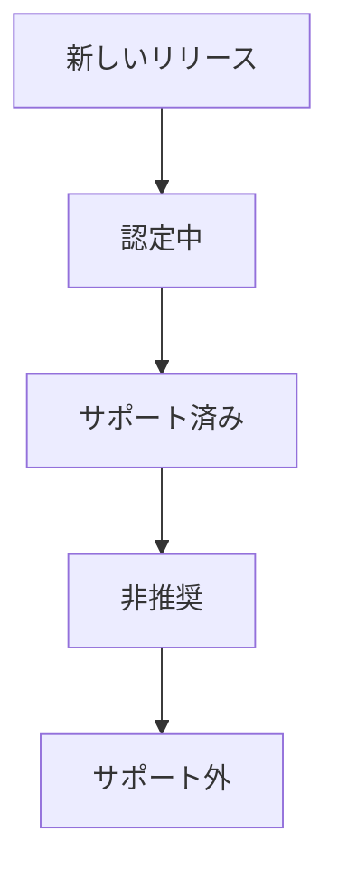

GitLab Helm チャートと Operator に対する、さまざまな Kubernetes および OpenShift リリースに関する Distribution チームのサポートポリシーです。

## 定義

このポリシーで使用される用語の定義。

### Kubernetes リリース

Kubernetes の公式マイナー番号リリース。リリースは <https://kubernetes.io/releases/> で確認できます。Kubernetes は年に3回、約4ヶ月間隔で公式リリースを行い、1年間はバグ修正とセキュリティパッチでサポートされます。

### OpenShift リリース

OpenShift の公式マイナー番号リリース。リリースは <https://access.redhat.com/support/policy/updates/openshift> で確認できます。OpenShift は年に3回、約4ヶ月間隔で公式リリースを行い、1年間はバグ修正とセキュリティパッチでサポートされます。

OpenShift は Kubernetes をベースとしており、機能的に非常に類似しています。特に断りがない限り、このドキュメントでは同一として扱います。

### サポートされている Kubernetes リリース

GitLab が公式にサポートしている Kubernetes リリース。

### 非推奨の Kubernetes リリース

以前は GitLab がサポートしていた Kubernetes リリースで、CI/CD 環境で `kubeval`・`kubeconform`・その他の類似ツールによる最小限のテストを引き続き実行しているもの。GitLab はこの Kubernetes リリースで動作する可能性がありますが、一部の機能は動作しない場合があります。

### 認定中の Kubernetes リリース

認定中のリリースとは、テスト中（移植作業の可能性あり）で、CI/CD システムのエンドツーエンド（E2E）テストに追加されつつあるリリースです。リリースが認定されると、公式にサポートされるリリースになります。その後、時間の経過とともに非推奨のリリースに移行します。

### サポートされていない Kubernetes リリース

サポートされていないリリースとは、以下のいずれかです：

- まだ認定されていない新しいリリース
- 壊れていることが判明している、以前サポートされていたまたは非推奨のリリース

## 制約

公式またはサポート非推奨の扱いとしてサポートできる Kubernetes および OpenShift リリースを制限するいくつかの制約があります。

### Kubectl

`kubectl` のバージョン `1.X.Y`（`X` が Kubernetes のマイナーバージョン、`Y` がパッチレベル）は、Kubernetes クラスターバージョン `1.X-1` から `1.X+1` でのみサポートされます。

### API サポート

Operator は Kubernetes API の後方互換性に依存しています。Kubernetes は `N-3` バージョンの後方互換性を保証しているため、この制約は `kubectl` サポートよりも問題が少ないです。

### Kubernetes リリーススケジュール

Kubernetes は年に3回、リリース間に約4ヶ月の間隔でリリースします。各 Kubernetes リリースは12ヶ月間サポートされます。

### GitLab の認定

新しいリリースをサポートするための新しいクラスターの作成と CI/CD サポートの追加に関わる作業は重要です。また、GitLab Chart と Operator の API 変更への対応作業もあります。新しい Kubernetes リリースで GitLab を認定するには約3ヶ月かかります。

### クラウドプロバイダーと Kubernetes フレーバーのリリーススケジュール

Kubernetes を提供するさまざまなクラウドプロバイダーがあります。リソースの制約から、GKE と EKS の2つでのみテストを行います。これらのプロバイダーでのテストにより、同じ Kubernetes リリースを実行している他のプロバイダーでのサポートを外挿できると考えています。

OpenShift はオンプレミスインフラで実行されることが多い Kubernetes フレーバーです。OpenShift には十分な需要と十分な独自の特性があるため、クラウドプロバイダーと同様のテスト・認定・サポートを行っています。

#### Google Kubernetes Engine (GKE)

GKE は Kubernetes クラウドプロバイダーです。

GKE は Kubernetes リリースサイクルの各リリースを14ヶ月間サポートします。これらのリリースは、GKE がリリースを認定する必要があることによるラグがありつつも、Kubernetes のリリースサイクルにほぼ対応しています。通常、rapid チャンネルと regular チャンネルには4〜5個のリリースが利用可能で、最も古いバージョンはパッチリリースやセキュリティ修正を受け取りません。stable チャンネルには最新の Kubernetes マイナーバージョンがないため、通常は4バージョンがあり、最も古いものはメンテナンスを受け取りません。

詳細については [GKE リリーススケジュール](https://cloud.google.com/kubernetes-engine/docs/release-schedule)をご覧ください。

#### Elastic Kubernetes Service (EKS)

EKS は Kubernetes クラウドプロバイダーです。

EKS は GKE や Openshift と同様に Kubernetes リリーススケジュールに従います。各リリースは14ヶ月間サポートされます。

詳細については [EKS バージョン](https://docs.aws.amazon.com/eks/latest/userguide/kubernetes-versions.html)をご覧ください。

#### Azure Kubernetes Service (AKS)

AKS は Kubernetes クラウドプロバイダーです。

AKS は GKE や Openshift と同様に Kubernetes リリーススケジュールに従います。各リリースは12ヶ月間サポートされます。最新の AKS リリースは通常、最新の Kubernetes リリースより1つ遅れます。

詳細については [AKS Kubernetes リリースカレンダー](https://learn.microsoft.com/en-us/azure/aks/supported-kubernetes-versions)をご覧ください。

#### OpenShift

OpenShift は Kubernetes フレーバーです。

Openshift はリリースサイクルの各リリースを12〜18ヶ月間サポートします。GKE と同様に、リリースは約4ヶ月間隔で、Kubernetes のリリースサイクルにほぼ対応しています。最新の OpenShift リリースは通常、最新の Kubernetes リリースより2つ遅れます。

詳細については [Openshift バージョニング](https://access.redhat.com/support/policy/updates/openshift)をご覧ください。

### GKE の自動アップグレード

GKE はサポート外のクラスターを自動アップグレードします。

## Kubernetes および OpenShift リリースサポートポリシー

Kubernetes および OpenShift リリースの GitLab Helm チャートと Operator に対する Distribution チームのサポートポリシー。

### 公式サポートされているリリース

GitLab は新しいバージョンがリリースされ、古いバージョンが対応するプロバイダーによってサポートされなくなるにつれて、Kubernetes と OpenShift のすべてのリリースのうち移動するサブセットを公式にサポートします。

#### 公式サポートされている Kubernetes リリース

GitLab は Kubernetes のマイナーリリース3つ（`N`・`N-1`・`N-2`）を公式にサポートします。`N` は以下のいずれかです：

- 認定が完了している場合は、Kubernetes の最新リリースのマイナーバージョン
- 最新バージョンの認定が完了していないまたは開始していない場合は、次に最近のバージョン

次のアップカミングリリースがまだ認定中かどうかにかかわらず、`N+1` という用語を使用します。GitLab は Kubernetes の3つのマイナーリリース（`N`・`N-1`・`N-2`）を公式にサポートします。`N` は Kubernetes の最新リリースのマイナーバージョン（認定が完了している場合）、または次に最近のバージョン（最新バージョンの認定が完了していないまたは開始していない場合）のいずれかです。`N+1` という用語は、まだ認定中かどうかにかかわらず次のアップカミングリリースに使用します。例えば、利用可能な現在のリリースが `1.28`・`1.27`・`1.26`・`1.25` で、リリース `1.28` を認定していない場合、`N` は `1.27` になり、このテーブルに示すようにリリース `1.25`・`1.26`・`1.27` を公式にサポートします。

| リリース | 参照 | サポート |
|---------|------------|-----------|
| 1.28    | `N+1`      | いいえ |
| 1.27    | `N`        | はい |
| 1.26    | `N-1`      | はい |
| 1.25    | `N-2`      | はい |

`1.28` が認定されると、`1.29` が `N+1` になり、公式にサポートされるリリースのリストに `1.28` が追加されます。既存のサポートされているリリースの中で最も古いもの（`1.25`）は非推奨（または場合によってはサポート外）になります。

| リリース | 参照 | サポート |
|---------|-----------|-----------|
| 1.29    | `N+1`     | いいえ |
| 1.28    | `N`       | はい |
| 1.27    | `N-1`     | はい |
| 1.26    | `N-2`     | はい |
| 1.25    | N/A       | 非推奨 |

#### 公式サポートされている OpenShift リリース

GitLab は OpenShift のマイナーリリース4つ（`N`・`N-1`・`N-2`・`N-3`）を公式にサポートします。Kubernetes と同様に、`N` は以下のいずれかです：

- 認定が完了している場合は、OpenShift の最新リリースのマイナーバージョン
- 最新バージョンの認定が完了していないまたは開始していない場合は、次に最近のバージョン

再度、まだ認定中かどうかにかかわらず次のアップカミングリリースに `N+1` という用語を使用します。例えば、利用可能な現在のリリースが `4.14`・`4.13`・`4.12`・`4.11` で、リリース `4.15` を認定していない場合、`N` は `4.14` になり、このテーブルに示すようにリリース `4.14`・`4.13`・`4.12`・`4.11` を公式にサポートします。

| リリース | 参照 | サポート |
|---------|-----------|-----------|
| 4.15    | `N+1`     | いいえ |
| 4.14    | `N`       | はい |
| 4.13    | `N-1`     | はい |
| 4.12    | `N-2`     | はい |
| 4.11    | `N-2`     | はい |

### 非推奨リリース

非推奨リリースでの Issue を修正するコミュニティのコントリビューションは、それらの修正がサポートされているバージョンを壊さない限り受け入れます。また、時間とリソースが許す範囲でこれらのリリースの非公式サポートを提供することがあります。

GitLab は Kubernetes プロジェクトの非推奨スケジュールを厳密に따いません。

### Kubernetes リリースサポートのライフサイクル

Kubernetes リリースは以下の Distribution Kubernetes リリースサポートのライフサイクルを経ます：

#### 新しいリリース

GitLab サポートの認定がまだ開始されていない新しい Kubernetes リリース。

#### 認定中

GitLab Distribution チームが新しいリリースの認定を開始しました。認定には以下が含まれます：

- 必要に応じて API 変更への適合
- インフラのプロビジョニング
- CI/CD パイプラインの追加
- E2E テストの追加

認定タスクの完全なリストは [Kubernetes リリース認定 Issue テンプレート](https://gitlab.com/gitlab-org/distribution/team-tasks/-/blob/master/.gitlab/issue_templates/Kubernetes-support.md?ref_type=heads)で確認できます。

#### サポート済み

認定が完了しました。

#### 非推奨

以前サポートされていたリリースは、以下の理由で非推奨になる場合があります：

- Kubernetes リリースがサポート終了に達した場合
- サポートされているリリースの中で最も古く、サポートされているリリースが3つ以上ある場合

非推奨のリリースは、Distribution チームが時間とリソースの範囲でベストエフォートでサポートします。CI システムの `kubeval`・`kubeconform`・またはその他の検証ツールテストをパスし続け、既知の壊れる Issue がない限り、リリースは非推奨として継続されます。これらの変更が公式サポートされているリリースおよびより新しい非推奨リリースのサポートを壊さない限り、コミュニティのコントリビューションを考慮します。

#### サポート外

リリースは以下の理由でサポート外になります：

- リリースが非推奨で、壊れていることが判明している場合（通常、検証テストをパスしなくなったため）
- リリースがサポート終了から1年以上経過している場合

### 新しい Kubernetes リリースのサポートタイムライン

新しい（`N+1`）Kubernetes リリースは、そのリリースから3ヶ月以内にサポートされます。

### Kubernetes パッチレベル

GitLab は特定の Kubernetes マイナーレベルリリースのパッチレベルリリースとの後方・前方互換性があると仮定します。つまり、Kubernetes リリース `1.N.3` を認定した場合、`1.N.x` のすべてのリリースの認定を仮定できます。

### アーキテクチャ

Kubernetes はいくつかの物理アーキテクチャで動作できます。GitLab はリソースの制約からこれらのアーキテクチャのサブセットをサポートしています。

#### x86-64

私たちのベースアーキテクチャは x86-64 です。すべてのサポートされている Kubernetes リリースでこのアーキテクチャをサポートしています。

#### arm64

現在、ARM64 での E2E テストは行っていません。ARM64 を公式にサポートする前に、少なくとも1つの Kubernetes リリースにこのテストを追加すべきです。

### `kubectl` バージョン

実用的な範囲で、最新の GitLab Helm チャートは `N-1` バージョンの `kubectl` を同梱すべきです。これにより、`N` と `N-2` の Kubernetes リリースの両方を公式にサポートできます。

### CI/CD テスト要件

#### エンドツーエンド (E2E) テスト

`N` Kubernetes リリースは x86-64 と ARM64（サポートを決定した場合）の両方で E2E テストを受けます。E2E テストは現在、`review__<cluster_version>`・`review_specs_<cluster_version>`（チャートのみ）・`qa_<cluster_version>` ジョブを使用した現在のチャートと Operator パイプラインで行われています。

#### スモークテスト

`N`・`N-1`・`N-2` の Kubernetes リリースにスモークテストを実施します。スモークテストは、`review_vcluster_<cluster_version>` ジョブを使用したパイプラインで行われます。このテストは GitLab Helm チャートまたは Operator を[仮想クラスター](https://www.vcluster.com/)にデプロイします。

#### 検証テスト

検証テストは [`kubeconform`](https://github.com/yannh/kubeconform) または類似の検証ツールを使用して行われます。GitLab チャートパイプラインは `Validate <cluster_version>` ジョブで `kubconform` を実行します。

GitLab Operator には現在この目的に使用できる検証テストがありません。すべてのリリースの E2E テストを停止したら、非推奨リリース用の対応する検証テストを追加します。

#### 非推奨リリーステスト

非推奨リリースは検証テストを使用してリグレッションがテストされます。新しいリリースが認定されると、新しい検証テストジョブが作成されます。非推奨リリースのサポートは、古いバージョンの検証テストジョブを削除しないことで構成されます。検証テストジョブが何らかの非互換性によって壊れた場合、[非推奨ポリシー](#deprecated)が許可する場合は非互換性を修正するか、そのリリースをリストから削除してサポートされていない Kubernetes リリースにします。

### 公開ドキュメント

サポートされている Kubernetes リリースと非推奨の Kubernetes リリースを以下のテーブルでドキュメント化しています：

- [GitLab チャート](https://docs.gitlab.com/charts/installation/cloud/index.html#supported-kubernetes-releases)
- [GitLab Operator](https://docs.gitlab.com/operator/installation.html#cluster)

これらのテーブルは、GitLab Helm チャートと Operator の両方についてサポートされているリリースや非推奨リリースのリストを変更するたびに更新されます。

### 新リリースプロセス

新しいリリースのサポートを追加し、古いリリースを非推奨にするために使用するプロセスは、[Issue テンプレート](https://gitlab.com/gitlab-org/distribution/team-tasks/-/blob/master/.gitlab/issue_templates/Kubernetes-support.md)に詳細が記載されています。
