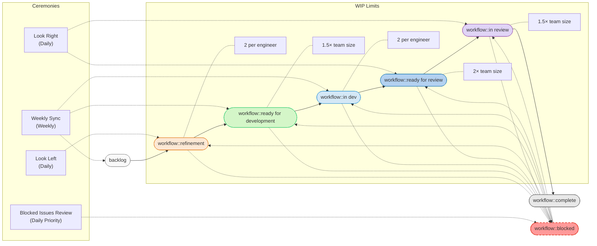
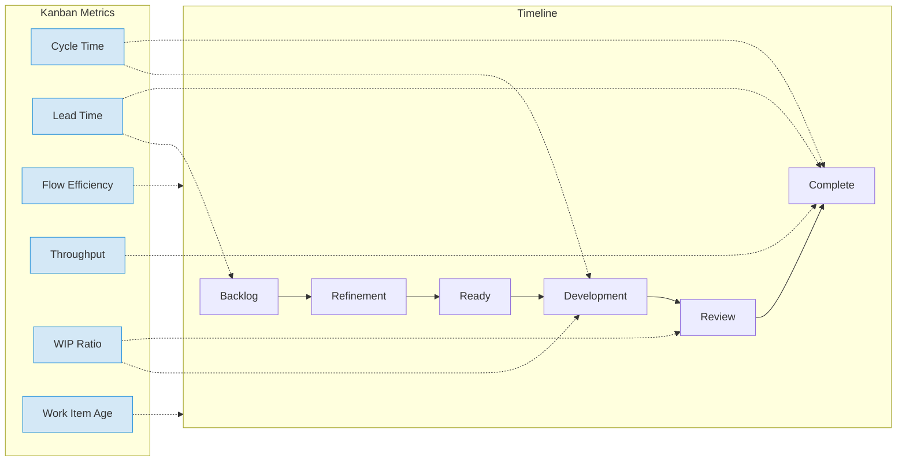
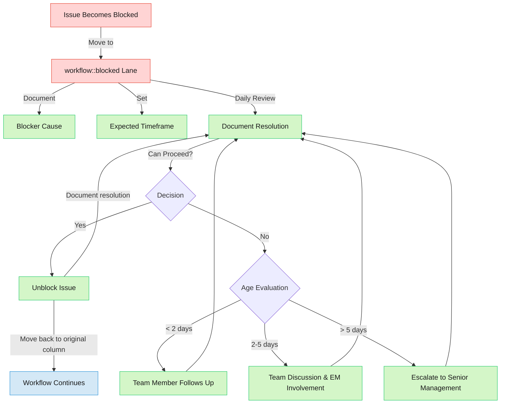

## 概要

Operate チームはさまざまなデプロイメソッドにわたるインストール、アップグレード、スケーリング、移行、設定を担当しています。私たちの作業には以下がよく含まれます:

1. 内部および外部の顧客リクエストへの対応
2. 複数のデプロイメソッドとプラットフォームの同時サポート
3. さまざまなタイムラインを持つ技術的に複雑な統合作業の管理
4. 計画された機能開発とメンテナンス作業のバランス

[カンバン](https://en.wikipedia.org/wiki/Kanban_(development)) アプローチに従うことで、以下のメリットが得られます:

- **フロー効率の向上** - 作業アイテムがマイルストーンの境界に縛られることなく継続的に進行する
- **適応性の向上** - マイルストーンの計画作業を中断することなく、緊急のデプロイ Issue や顧客リクエストへの対応が容易になる
- **ワークロードの可視化向上** - 異なるデプロイプラットフォーム間の進行中作業がより明確に見える
- **より予測可能なデリバリー** - 作業完了がマイルストーンの締め切りではなくチームのキャパシティに基づく

## カンバン実装

私たちも原則として [GitLab 製品開発フロー](/handbook/product-development/how-we-work/product-development-flow/#workflow-summary) とラベルを使用します。ただし、作業の性質上、以下のフェーズは通常スキップします:

- [バリデーションフェーズ 4: デザイン](/handbook/product-development/how-we-work/product-development-flow/#validation-phase-4-design)
- [バリデーションフェーズ 5: ソリューションバリデーション](/handbook/product-development/how-we-work/product-development-flow/#validation-phase-5-solution-validation)

### ワークフロー図

### カンバンボード構造

Operate カンバンボードは GitLab の製品開発ワークフローに合わせた以下のカラムを使用します:

| カラム | 説明 | WIP 制限 |
|--------|-------------|-----------|
| **backlog** | 優先度付けされたが開発準備が整っていない | 制限なし |
| **workflow::refinement** | リファインメント中、分解中の Issue | エンジニア 1 人あたり 2 件 |
| **workflow::ready for development** | 完全に仕様化され、作業準備が整っている | チームサイズの 1.5 倍 |
| **workflow::in dev** | 現在実装中 | エンジニア 1 人あたり 2 件 |
| **workflow::ready for review** | 実装完了、レビュアーの引き受け待ち | チームサイズの 2 倍 |
| **workflow::in review** | アクティブなコードレビュー中 | チームサイズの 1.5 倍 |
| **workflow::complete** | 完了した作業 | 制限なし |
| **workflow::blocked** | 何らかの理由で進行できない作業 | 追跡するが制限なし |

## 主要なセレモニー

### 日次活動

- **開発前に左右を確認** - 新しい開発を開始する前に、リファインメントやレビュー（レビュー準備完了/レビュー中）からアイテムを 1 つ前進させる
- **非同期スタンドアップ** - フローと障害に焦点を当てた簡潔な非同期チェックイン

### 週次ミーティング

1. **チーム同期**（週次）
   - EM と PM とともにカンバンボードの進捗をレビュー
   - 障害と優先順位付けについて議論
   - プロダクト目標との整合を確保

2. **チームデモ**（週次）
   - Build グループとの共有
   - 完了した作業の定期的なデモ
   - 新機能や改善に関するナレッジの共有
   - チームメンバーとステークホルダーからのフィードバック収集
   - チームの成果の可視化向上

3. **メンテナーディスカッション**（週次）
   - Build グループとの共有
   - マージリクエストとコード品質の定期的なレビュー
   - 技術的な決定とアーキテクチャの議論
   - 重要なコンポーネントのメンテナー間の調整
   - コード標準と実践の一貫性の確保

4. **エンジニアハドル**（必要に応じて）
   - 開発に焦点を当てたディスカッション
   - 実装戦略と技術的な決定

### 月次活動

毎月最後の週の週次同期ミーティング時に実施します。

- **フロー振り返り** - フローメトリクスとプロセス改善のレビュー
- **リリース計画** - フローベースの優先事項を使用した次のマイルストーン計画との整合

### 四半期活動

- **ロードマップ計画** - フローを戦略的目標と整合させるための四半期ロードマップ計画への参加
- **振り返り** - 過去の四半期の成果を振り返り、改善すべき領域を特定し、将来の行動計画を作成

## 優先度の定義

Operate チームはカンバンカラム内の位置を決定するために [インフラ全体の優先度ラベル](/handbook/product-development/how-we-work/issue-triage/#priority) を使用します。

| 優先度 | ラベル | カンバンでの位置 | 必要なアクション |
|----------|-------|--------------------|-----------------|
| 1 | ~priority::1 | アクティブカラムの最上部 | 即時対応が必要 |
| 2 | ~priority::2 | アクティブカラムの上部 | 優先度 1 のアイテムの後に対処 |
| 3 | ~priority::3 | ワークフローの中間 | 高優先度の後に対処 |
| 4 | ~priority::4 | ワークフローの最下部 | リソースが利用可能な時に対処 |

- "**アクティブカラム**" とは、作業が現在処理されているワークフロー段階を指します。以下が含まれます:
  - **Ready for Development**: 優先度付けされ作業準備が整った Issue
  - **In dev**: チームメンバーが現在取り組んでいる Issue
  - **Ready for review**: 完了したが、レビューを待っている作業
  - **In review**: 完了したがレビューと承認の過程にある作業
- "**ワークフローの中間/最下部**" とは、ボードの中央部に位置する ~priority::3 および ~priority::4 の Issue を指します。これらのアイテムは:
  - 中程度の緊急性を持つ
  - アクティブカラムの優先度 1 および 2 のアイテムより下に位置する
  - 通常、より緊急な作業の後にスケジュールされる
  - 任意のワークフロー段階（リファインメント、開発、レビュー）にある可能性がある
  - 完了すべき重要な作業を表すが、高優先度のものが対処されるまで待つことができる

- カンバンボードでの位置は、Issue ボードの制限により手動で管理・維持する必要があります。

### 作業優先順位付けガイダンス

1. **最高優先度を最初に**: 低優先度のものを始める前に、常に高優先度のアイテムに対処する
2. **マイルストーン/締め切り駆動の作業**: 固定された締め切りやマイルストーンのある Issue は、同じ優先度の締め切りなしの作業より優先される
3. **依存関係の解決**: 初期優先度に関係なく、依存している Issue の前にブロッキング Issue に対処する
4. **WIP 制限**: 高優先度のアイテムの完了に集中するために WIP 制限を維持する

## Issue ウェイト定義

<table>
<tr>
<th>ウェイト</th>
<th>追加調査</th>
<th>サプライズ</th>
<th>コラボレーション</th>
<th>説明</th>
<th>例</th>
</tr>
<tr>
<td>1: 些細</td>
<td>期待されない</td>
<td>期待されない</td>
<td>不要</td>
<td>さらなる分解から恩恵を受けられない</td>
<td>

- [シンプルなドキュメントの作成または更新](https://gitlab.com/gitlab-org/cloud-native/operator/-/issues/161)
- [シークレット管理の欠落したエンコーディング問題の修正](https://gitlab.com/gitlab-org/cloud-native/operator/-/issues/68)

</td>
</tr>
<tr>
<td>2: 小</td>
<td>可能性あり</td>
<td>可能性あり</td>
<td>可能性あり</td>
<td>明確な要件を持つシンプルなタスク</td>
<td>

- [主要な依存関係の新バージョンへの更新](https://gitlab.com/gitlab-org/cloud-native/gitlab-operator/-/issues/1836)
- [複雑なドキュメントの作成または更新](https://gitlab.com/gitlab-org/cloud-native/operator/-/issues/184)

</td>
</tr>
<tr>
<td>3: 中</td>
<td>可能性高い</td>
<td>可能性高い</td>
<td>可能性高い</td>
<td>調整が必要な、より複雑なタスク</td>
<td>

- [CI パイプラインへの E2E テストの追加](https://gitlab.com/gitlab-org/cloud-native/operator/-/issues/156)
- [カスタマイズを伴う依存関係のセキュリティ脆弱性への対処](https://gitlab.com/gitlab-org/cloud-native/charts/gitlab-ingress-nginx/-/issues/23)

</td>
</tr>
<tr>
<td>5: 大</td>
<td>非常に可能性高い</td>
<td>非常に可能性高い</td>
<td>非常に可能性高い</td>
<td>技術的に実現可能な場合は分解を検討する</td>
<td>

- [新しいフレームワークへのシークレットジェネレーターモジュールの移行](https://gitlab.com/gitlab-org/cloud-native/operator/-/issues/130)
- [Operator V2 への新しいアプリケーション API とカスタムリソース定義の導入](https://gitlab.com/gitlab-org/cloud-native/operator/-/issues/109)

</td>
</tr>
<tr>
<td>8+</td>
<td>確実</td>
<td>確実</td>
<td>確実</td>
<td>大きすぎる - 複数の Issue に分解してエピックにグループ化する必要がある</td>
<td>

- [プロジェクト全体での DockerHub プル制限への対処](https://gitlab.com/groups/gitlab-org/distribution/-/epics/104)
- [Self-Managed: Self-Managed インスタンス向けコンテナレジストリのロールアウトサポート](https://gitlab.com/groups/gitlab-org/-/epics/17005)

</td>
</tr>
</table>

1. **ウェイトに関する注意:**
   - ウェイトはコンテキストに依存し、ドメイン知識、経験レベル、GitLab での勤務期間によって影響を受ける場合があります
   - ウェイトは固定ではなく、Issue が当初の見積もりより多くの労力を必要とする場合、作成者/アサイニーが調整できます
   - ウェイト 5 の Issue については、分解することが有益かどうかチームメンバーが議論することが奨励されます
   - ウェイト 8+ の Issue は分解する必要があり、開発準備完了としてマークすべきではありません
2. **WIP 制限の実装**
   - 最初はアイテム数に基づいてカラムの WIP 制限を設定し、より多くのデータが得られたら見直す

### フローメトリクス

マイルストーンベースの完了メトリクスの代わりにこれらのフローベースのメトリクスを使用し、FY27Q1 までにベースラインメトリクスを確立して着実な改善を目指します。

#### 1. サイクルタイム

**定義:** Issue に作業が開始されてから本番環境にデリバリーされるまでの合計経過時間。

**構成要素:**

- **コード時間:** ソリューションのコーディングに費やした時間
- **レビュー時間:** コードレビューに費やした時間（MR オープン → MR マージ）

**目標:** 目標サイクルタイムは作業の複雑さによって異なります（FY27Q1 までに更新予定）:

- 些細な変更（ウェイト 1）: \< x
- 小さな変更（ウェイト 2）: \< x
- 中程度の変更（ウェイト 3）: \< x
- 大きな変更（ウェイト 5）: \< x

**測定:** （FY27Q1 までに更新予定）

#### 2. リードタイム

**定義:** Issue が作成されてから本番環境にデリバリーされるまでの合計経過時間。

**構成要素:**

- **計画時間:** Issue 作成から開発開始までの時間
- **サイクルタイム:** （上記で定義）

**目標:** 目標リードタイムは以下のとおりです（FY27Q1 までに更新予定）:

- 優先度 1 の Issue: \< x
- 優先度 2 の Issue: \< x
- 優先度 3 の Issue: \< x
- 優先度 4 の Issue: \< x

**測定:** （FY27Q1 までに更新予定）

#### 3. WIP 比率

**定義:** 進行中の作業アイテムとチームのキャパシティの比率。アクティブな作業アイテム数をチームメンバー数で割って計算します。

**目標:**

- 最適な WIP 比率: 1-3
- 警告しきい値: \> 3.0
- 重大しきい値: \> 4.0

**測定:** アクティブなチームメンバー数で割った ~"workflow::in dev" および ~"workflow::in review" 段階の Issue 数。

#### 4. スループット

**定義:** 期間あたりに完了した作業アイテム（Issue）数。

**目標:** チームはベースラインのスループットを確立し、着実な改善を目指すべきです。

**測定:** 週ごとに "closed" 状態に移行した Issue の数。

#### 5. 作業アイテムの経過時間

**定義:** 現在オープンな作業アイテムの経過時間。

**目標:**

- x 日以上経過した優先度 1 の Issue なし
- x 日以上経過した優先度 2 の Issue なし
- 平均作業アイテム経過時間の減少傾向

**測定:** すべてのオープン Issue の Issue 作成日から現在の日付を引いた値。

#### 6. フロー効率

**定義:** 作業アイテムが待機に対してアクティブに取り組まれている時間の割合。

**目標:** \> x% フロー効率（業界標準はしばしば 15-20%）

**測定:** 総リードタイムで割った アクティブな作業時間（~"workflow::refinement" + ~"workflow::in dev" + ~"workflow::in review" で費やした時間）。

## 必須ラベル

[GitLab 製品開発フロー](/handbook/product-development/how-we-work/product-development-flow/#workflow-summary) のラベルに加えて、Epic、Issue、マージリクエスト（アイテム）に常時適用される**必須**ラベルが多数あります:

- `group::Operate` - 私たちに特有の、または私たちによって作成されたアイテム。

特定のシナリオで追加される**必須**ラベルもあります:

- `spike` - 主にオプションを理解し、将来の成果物を分解するためのリサーチを伴う Issue。[スパイク](/handbook/product/product-processes/#spikes) は新しい Epic の最初の Issue であることが多く、その出力が追加の Issue と直列/並列作業の順序を定義します。

上記のラベルに加えて、[マージリクエストレビュー中に使用されるワークフローラベル](/handbook/engineering/infrastructure-platforms/gitlab-delivery/distribution/merge_requests/#workflow) と [Issue トリアージ中に使用されるラベル](/handbook/engineering/infrastructure-platforms/gitlab-delivery/distribution/triage/#label-glossary) も参照してください。

## マイルストーン統合

GitLab のマイルストーン実践との整合を以下の方法で維持します:

- 厳格なタイムライン Issue（例: 破壊的変更）はすべて、作成時に適切なマイルストーンをタグ付けし、完了まで維持する
- 他のすべての Issue はアクティブに作業中の場合は `Next 1-3 releases` としてマイルストーンを維持する
- その他すべての Issue はマイルストーン `Backlog` で維持する
- 完了したすべての作業を記録のためにマイルストーンでタグ付けする
- すべての標準必須ラベルを維持する

## ブロックされた Issue の管理プロセス

### ブロックされた Issue の追跡

- **~"Workflow::blocked" レーン** - 依存関係、入力待ち、またはその他の障害によって進行できない Issue は、専用の "workflow::blocked" レーンに移動されます
- **ブロッカーのドキュメント** - ブロックされた各 Issue には以下を説明するコメントが必要です:
  - Issue をブロックしているもの
  - ブロックを解除する責任を持つ担当者/チーム
  - ブロックを解決するために取られたアクション
  - 解決の予想タイムフレーム（判明している場合）

### ブロックされた Issue のレビュー（日次優先）

1. **日次ブロック Issue トリアージ**
   - 毎日の開始時に、チームはブロックされた Issue をすべてレビューします
   - ブロックされた Issue は優先度とブロックの期間でソートされます
2. **エスカレーションパス**
   - 2 日未満ブロックされた Issue: Issue のアサイニーがアクティブにフォローアップ
   - 2〜5 日ブロックされた Issue: チームの同期/非同期ディスカッションと EM の関与
   - 5 日以上ブロックされた Issue: 適切なマネージャー/部門へのエスカレーション
3. **解決アクション**
   - Issue のアサイニーは各ブロックされた Issue のフォローアップに責任を持つ
   - ブロックを解決するために取られたすべてのアクションをドキュメント化する
   - ブロックを迅速に解決できない場合は、回避策やスコープの調整を検討する
4. **メトリクスとレポート**
   - ブロックされた Issue とフローしている Issue の割合を追跡する
   - ブロックの平均解決時間についてレポートする
   - ブロッカーのパターンを特定して体系的な Issue に対処する
5. **ブロックされた Issue の WIP 管理**
   - ブロックされた Issue は引き続き `workflow::in dev` の WIP 制限にカウントされる
   - チームは複数の Issue がブロックされている場合、一時的にキャパシティ割り当てを調整することがある
   - 障害を取り除くためにブロックされた Issue に集中的に取り組むことを検討する

### ブロック解除ワークフロー

