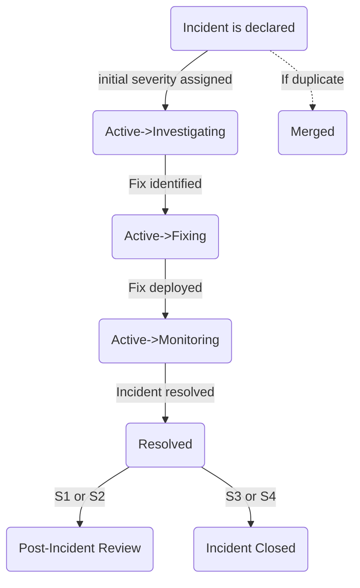

{}
GitLab のチームメンバーで、GitLab.com の可用性に関する問題について Reliability Engineering に通知したい場合は、こちらのインシデント報告に関するクイックインストラクションを参照してください: [インシデントの報告](#reporting-an-incident)。
{}

{}
GitLab のチームメンバーで、現在誰がエンジニアオンコール (EOC) かを知りたい場合は、[現在の EOC は誰?](#who-is-the-current-eoc) セクションを参照してください。
{}

{}
GitLab のチームメンバーで、最近のインシデントのステータスを知りたい場合は、インシデント[ボード](https://gitlab.com/gitlab-com/gl-infra/production/-/boards/1717012?&label_name%5B%5D=incident)を参照してください。インシデントのステータス変更に関する詳細は、[インシデントワークフロー](#incident-workflow) セクションを参照してください。
{}

{}
incident.io がダウンしているか、その他の理由で利用できない場合は、[incident.io がダウンしているときに何をすべきか](incident-io-down.md) に従ってください。
{}

## インシデント管理

インシデントとは、サービス低下や停止につながる、またはつながる可能性のある **異常な状態** です。これらのイベントは、混乱を回避するため、またはサービスを運用可能な状態に復元するために人の介入を必要とします。
インシデントには*常に*即座の対応が与えられます。

インシデント管理の目標は、混乱を整理して迅速なインシデント解決へ導くことです。そのために、インシデント管理は以下を提供します:

1. 対応チームのための [オンコール体制](./on-call/)。インシデントを解決できるチームメンバーが必ずいるようにします。
1. インシデントチームのメンバーに対する明確に定義された [役割と責任](#incident-response-roles) と [ワークフロー](#incident-workflow)、
1. 情報の流れと解決パスを管理するためのコントロールポイント、
1. 学びと技術が抽出され共有されるインシデントレビュー

[インシデントが開始する](#reporting-an-incident) と、インシデント自動化がテキストベースのコミュニケーション用のインシデントごとの Slack チャンネルへのリンクを含むメッセージを、対応する [インシデント告知チャンネル](#incident-announcement-channels) に送信します。
インシデントチャンネル内に、インシデントごとの Zoom リンクが作成されます。
さらに、[Production tracker](https://gitlab.com/gitlab-com/gl-infra/production) に GitLab Issue が作成されます。

### インシデント管理ライフサイクル

GitLab では、インシデント管理を以下のステップを持つフィードバックループとして捉えています:

1. **準備** — インシデントに関わる可能性のあるすべての人のためのプロセスドキュメントと関連する研修。これには、適切なモニタリングとアラートが整備され、適切な人がオンコールローテーションに含まれることを確実にすることが含まれます。
1. **特定** — 計測／アラート／モニタリング、顧客レポート、チームメンバーレポート、またはセキュリティレポートを通じて問題を特定します。特定されると、インシデントが宣言されます。
1. **調査** — 停止／サービス停止の原因を探し、影響の初期判断を行い、それが重大度レベルを決定します。
1. **封じ込め** — 影響を可能な限り迅速に封じ込め、サービスを安定化します。封じ込めが達成されると、インシデントは "mitigated" と見なされます。
1. **修復** — サービスを安定化するためのより堅牢な対応。すべての異常状態が解決された時点で、インシデントは修復済み、つまり "resolved" と見なされます。
1. **回復** — テストとドキュメントを横断して改善が行われます。インシデントが再発しないように、または将来の対応時間を改善するために特定された是正措置 (Corrective Action) は、このフェーズで開始される可能性があります。
1. **学び** — 根本原因分析、インシデントレビュー／レトロスペクティブ、そしてさらなる是正措置の特定。これらすべてがステップ 1 のドキュメントと研修の更新に還元され、フィードバックループが閉じられます。

私たちのモニタリングとアラートの概要については、[モニタリングハンドブックページ](/handbook/engineering/monitoring/) を参照してください。必要に応じて開発チームから専門知識を得るために、[開発エスカレーションプロセス](/handbook/engineering/workflow/development-processes/infra-dev-escalation/process/) も活用しています。

### メトリクス

インシデントパフォーマンスは、一連の目標メトリクス（MTTR、30 分以内に軽減された割合、内部検出された割合など）に対して追跡されます。定義、スコープ、ダッシュボードへのリンクは [Incident Metrics](./metrics.md) ページに記載されています。

### 計画メンテナンス

`C1` の計画メンテナンスは、宣言されていないインシデントとして扱うべきです。

メンテナンスウィンドウが始まる 30 分前に、変更を担当する Engineering Manager は、メンテナンスが始まろうとしていることを SRE オンコール、Release Manager、CMOC に通知すべきです。

調整とコミュニケーションは Situation Room Zoom で行うべきで、メンテナンスに問題が発生した場合に他のエンジニアを迅速・容易に巻き込めるようにします。

メンテナンス手順中に関連するインシデントが発生した場合、その EM はインシデントの間 Incident Manager として機能すべきです。

メンテナンス手順中に別の無関係なインシデントが発生した場合、計画メンテナンスに関わっているエンジニアは、進行中のインシデントを優先するために Situation Room Zoom から退出すべきです。

計画メンテナンス中に短時間のエラーが予想される場合、これも関連するステータスページの更新を通じてユーザーに伝達するべきです。
メンテナンスの時間を [Service Level Agreement](/handbook/engineering/infrastructure-platforms/service-level-agreement/) へのダウンタイムとしてカウントしないために、[メンテナンスウィンドウを設定](https://runbooks.gitlab.com/monitoring/set_maintenance_window/) する必要もあります。

## オーナーシップ

Incident Lead の役割は、すべてのインシデントに対して意図的に設定する必要があります。インシデントのオーナーの判断に助けが必要な場合、EOC が支援できます。
Incident Lead はいつでもオーナーシップを別のエンジニアに委譲したり、IM にエスカレーションしたりすることができます。
インシデントのオーナーは常に **1 人** で、そのオーナーのみがインシデントを解決済みと宣言できます。
Incident Lead はいつでも、サポートを得るために階層の次の役割を呼び出すことができます。Incident Lead の役割は常に現在のオーナーに割り当てられるべきです。

## インシデント管理構造

GitLab では、インシデント管理フレームワークは 2 つの重要な概念を区別します:

1. **インシデント対応役割**: インシデント対応中に必要な機能的なポジションで、それを誰が担うかに関わらず、特定の責任とアクションで定義されます。現在、Incident Lead、Incident Responder、Communications Manager の 3 つの役割が定義されています。

2. **対応チーム**: これらの役割を担う特定のチームとローテーションです。異なる対応チームが異なる環境（例: GitLab.com 対 Dedicated）または特化された機能をカバーする場合があります。

この区別を理解することで、インシデント中に誰が何をするかが明確になり、インシデント管理プロセス全体での適切な調整が可能になります。

<i class="fa-brands fa-youtube"></i> [Incident Response Roles vs. Teams の詳細を視聴する](https://youtu.be/vmK9-7roDFM)

## インシデント対応役割

インシデント中の責任の明確な区切りは重要です。迅速な解決には、フォーカスとタスク委譲のための明確な階層が必要です。重複を防ぎ、適切な操作順序を確保することは、軽減の鍵です。

| **役割** | **説明** | **必要な時** |
| ---- | ----------- | ---- |
| [**Incident Lead**](./roles/incident-lead.html) | インシデントのオーナーで、インシデント対応の調整を担当し、インシデントを解決へと導きます。Incident Lead は常に incident.io 内でこの役割が割り当てられるべきです。 | すべてのインシデントは Incident Lead を必要とし、インシデントごとに意図的に設定する必要があります。Incident Lead の選び方の詳細は [ワークフローセクション](#incident-lead) を参照してください |
| [**Incident Responder**](./roles/incident-responder.html) | 技術的な調査と軽減を実施します。インシデントを引き起こしている技術的問題の実際のトラブルシューティングと解決に責任を負います。 | すべてのインシデント |
| [**Communications Lead**](./roles/communications-lead.html) | 複数のメディアを通じてステークホルダーと顧客に情報を発信します。外部コミュニケーションとステータスアップデートを管理します。 | S1/S2 インシデント、または重要なコミュニケーションが必要な場合 |

## 対応チーム

私たちは、オンコールスケジュールを維持することで、インシデントを解決できるチームメンバーがいることを確実にしています。

オンコールのチームメンバーがページされるとインシデントに参加し、上記のインシデント対応役割のいずれかを担います。

オンコールプロセスとポリシーの詳細は、[オンコールハンドブックページ](./on-call/) にあります。

以下は、インシデント解決をサポートするオンコールローテーションのサマリーです:

### Tier 1

自動システムによって通知されるオンコールローテーション:

| **チーム** | **主な役割** | **機能** | **環境** | **誰?** |
| ---- | ---- | ----------- | ---- | ---- |
| **Engineer On Call (EOC)** | [Incident Responder](./roles/incident-responder.html)| 主に自動アラートおよび GitLab.com エスカレーションに対する最初の Incident Responder として機能します。役割への期待は [オンコールに関するハンドブック](/handbook/engineering/infrastructure-platforms/incident-management/on-call/#general-expectations-for-on-call) にあります。EOC のチェックリストは [runbooks](https://gitlab.com/gitlab-com/runbooks/blob/master/on-call/checklists/eoc.md) にあります。EOC が広範な問題のトラブルシューティングを支援するために設計されたランブックがあります - ランブックが不十分な場合、EOC は [Incident Manager と CMOC を関与させる](#how-to-engage-response-teams) ことでエスカレーションします。 | GitLab.com | 一般的に SRE で、インシデントを宣言できます。incident.io の "GitLab.com Production EOC" オンコールスケジュールの一部です。 |
| **Incident Manager On Call (IMOC)** |[Incident Lead](./roles/incident-lead.html) | 複雑なインシデント中に戦術的な調整とリーダーシップを提供します | GitLab.com | [incident.io](https://app.incident.io/gitlab/on-call/schedules/01K77XZFD7X7E3W8T6GDVMKAFF) のローテーション |

低重大度のインシデントでは、ページされた個人が複数の役割を担う場合があります。例えば S4 インシデントでは、EOC が Incident Lead と Incident Responder の両方を兼ねる場合があります。重大度が上がるにつれて、これらの役割を別々の個人が担うことがより重要になります。 [Tier 2](#tier-2) の人がページされる必要があります。

### Tier 2

人間によって通知されるオンコールローテーション:

| **チーム** | **役割** | **機能** | **環境** | **誰?** |
| ---- | ---- | ----------- | ---- | ---- |
| **Communications Manager On Call (CMOC)** | [Communications Lead](./roles/communications-lead.html) | Communications Manager の役割を担います | すべての環境 | 一般的に GitLab のサポートチームのメンバー。 |
| **Infrastructure Leadership** | n/a | 高重大度のインシデントに対するエスカレーションサポートを提供し、#cto を最新に保つことを含みます。 | すべての環境 | Infrastructure、Platform 部門の Staff+ または EM。 |
| **Subject Matter Expert (Tier 2 SME)**| [Incident Responder](./roles/incident-responder.html) |  インシデント中のサポートを提供できる特定の知識を持つエンジニア | GitLab.com / Dedicated | [特定の知識を持つエンジニア](/handbook/engineering/infrastructure-platforms/incident-management/tier2-escalations.md) |

## 役割とチームのマッピング

この表は、インシデント対応中に通常どのチームがどの役割を担うかを示しています:

| **役割** | **主なチーム** | **代替チーム** |
| ---- | ---- | ---- |
| Incident Lead | インシデントタイプによって異なる ([Incident Lead](./roles/incident-lead.html) 参照) | EOC、IMOC、Product Engineers |
| Incident Responder | EOC | Product Engineers、その他の Subject Matter Experts |
| Communications Lead | CMOC | N/A |

## 役割別の詳細責任

### Incident Lead の責任

Incident Lead は、インシデントが進行し最新の状態に保たれることを保証する責任を負います。この役割は自動的には設定されず、インシデントのタイプに基づいて割り当てるべきです。Incident Lead の割り当てのガイダンスについては、[ワークフローセクション](#incident-lead) を参照してください。Incident Lead は、必要に応じて EOC や IMOC など他の関係者を関与させる権限があると感じるべきです。

[Incident Lead の責任](./roles/incident-lead.html) のより詳細な内訳を参照してください。

### Incident Responder の責任

Incident Responder は、インシデントの技術的な調査と解決に貢献するすべての人です。EOC チームが通常一次対応者として機能しますが、関連する専門知識を持つ GitLab のチームメンバーは誰でも支援を求められることがあります。

[Incident Responder の責任](./roles/incident-responder.html) のより詳細な内訳を参照してください。

### Communications Lead の責任

Communications Lead は、ステータスページ更新の管理、ステークホルダー通知の調整、確認された重大な外部顧客影響のあるインシデントに関するタイムリーな公開コミュニケーションの確保によって、深刻なインシデント中の GitLab の公式な声として機能します。

複数のチャンネルにわたる調整されたコミュニケーションを必要とする深刻なインシデントでは、IMOC はインシデントの期間中 Communications Lead に頼ります。

[Communications Lead の責任](./roles/communications-lead.html) のより詳細な内訳を参照してください。

## チーム別の詳細責任

### Engineer On Call (EOC) の責任

Engineer On Call は通常、主な Incident Responder として機能し、宣言されたインシデントの影響軽減と解決を担当します。EOC は、助けが必要な場合、または他の人をインシデント調査に支援するために必要な場合、IMOC に連絡すべきです。

EOC は [Incident Responder の責任](./roles/incident-responder.html) を確認すべきです。

### Incident Manager On Call (IMOC) の責任

Incident Manager On Call は通常、Incident Lead として機能し、インシデント中の戦術的なリーダーシップと調整を担当します。

IMOC は、Incident Lead が低重大度のインシデントの多くで Communications Lead としても機能する可能性があるため、[Incident Lead の責任](./roles/incident-lead.html) と [Communications Lead の責任](./roles/communications-lead.html) の両方を確認すべきです。

_シフトのスケジュール方法、PTO を取るときや代替が必要なときに何をするかについての一般的な情報は、[Incident Manager オンボーディングドキュメント](/handbook/engineering/infrastructure-platforms/incident-management/incident-manager-onboarding/#frequently-asked-questions) を参照してください_

### Infrastructure Leadership の責任

Infrastructure Leadership は、Engineer On Call (EOC) と Incident Manager On Call (IMOC) の両方のエスカレーションパス上にあります。
これはアクティブな IMOC の代用または置き換えではありません（現在の IMOC が対応できない場合を除く）。

Infrastructure Leadership を直接ページするには、`/inc escalate` を実行し、`Oncall Teams` ドロップダウンメニューから `Infrastructure leadership escalation` を選択してください。

以下の状況でページされます:

1. すべての S1 インシデント (Slack の #cto に更新を提供する目的)。
2. IMOC が 15 分以内にページに応答できない場合。
3. EOC を過負荷にしている進行中のインシデントが複数ある場合、または複数の SRE 間で調整が必要な場合に、回復の調整を支援し、必要に応じて追加のサポートを呼び込むために Infrastructure Leadership をページできます。

ページされると、Infrastructure Leadership は以下を行います:

1. インシデント通話に参加する
2. Incident Responder に追加の SRE からのヘルプが必要か尋ねる。
3. IMOC が職務を遂行できるかどうかを確認する。
4. Incident Responder が修復に完全に集中できるように、IMOC/CMOC のための主要な技術的窓口となる。
5. すべての進行中の S1 インシデントについて #cto Slack チャンネルに更新を提供する。

#### CTO への更新

Infrastructure Leadership は、すべての S1 インシデントについて、インシデントオープン時、重要なステータス変更時 (例: Investigating から Fixing)、およびインシデント解決時に、GitLab.com と GitLab Dedicated の両方のインシデントについて #cto Slack チャンネルに更新を行うべきです。
更新は GitLab.com で使用される標準の incident.io Summary 形式に従うべきで、通常はインシデントサマリーからコピー＆ペーストできます。
既存のサマリーが不十分な場合、@incident Slack ボットにインシデント用の executive summary をドラフトするよう依頼できます。

```markdown
:s1: **Incident on GitLab.com**

**Problem**:
(include high level summary)
**Impact**:
(describe the impact to users including which service/access methods and what percentage of users)
**Causes**:
(List of causes if known)
**Response Strategy**:
(What we're doing to remediate the issue)
**— Production Issue —**
Main incident: (link to the incident)
Slack Channel: (link to incident slack channel)
```

## チームコーディネーター

### Incident Manager コーディネーター

1. 毎月第 1 火曜日頃:
   - コーディネーターは、[IM オンボーディング／オフボーディングボード](https://gitlab.com/gitlab-com/gl-infra/production-engineering/-/boards/5078854?label_name%5B%5D=IM) で、オープンな `~IM-Onboarding::Ready` および `~IM-Offboarding` の Issue をレビューし、それらのチームメンバーをスケジュールに追加します。
   - スケジュールは、incident.io の [Incident Manager - GitLab SaaS スケジュール](https://app.incident.io/gitlab/on-call/schedules/01K77XZFD7X7E3W8T6GDVMKAFF) を編集して更新されます。
   - スケジュールを編集する際、各ローテーションについて変更が有効になる時刻 (通常は最初の月曜日 00:00 UTC) を設定するようにしてください。
2. [`#im-general`](https://gitlab.slack.com/archives/C01NY82EJF6) にスケジュールが変更されたことを示すお知らせを投稿し、MR へのリンクと追加／削除された人の簡単な概要を共有します。
3. [IM オンボーディング／オフボーディングボード](https://gitlab.com/gitlab-com/gl-infra/production-engineering/-/boards/5078854?label_name%5B%5D=IM) のすべての Issue は、期限超過の有無について月に 1 回レビューする必要があります。
   期限超過の Issue があれば、コーディネーターはオンボーディングを完了するためにより時間やサポートが必要かどうかを著者に確認する必要があります。

### Engineer on-call コーディネーター

EOC コーディネーターは、SRE オンコールの QoL を改善し、社内全体のオンコールエンジニアが高い自信のレベルで運用できるようにするためのプロセスを構築することに焦点を当てています。

この役割の責任:

1. EOC の QoL を向上させるプロセスとツールのギャップを特定し、PI を通じて捕捉する。
2. 定期的なトレーニングとワークショップを調整する。
3. インシデントレビューや注目すべきインシデントのフォローアップとして、SRE 間の知識転移を可能にする。
4. SaaS Platforms 内の他のチームとの調整と優先順位設定を通じて、インシデント管理に関するより大きな変更を促進する。

EOC コーディネーターは、コアなオンコールとインシデント管理の懸念について Ops チームと密接に協力し、必要に応じて組織全体の他のチームを関与させます。

## 参考資料

### その他のエスカレーション

必要に応じて、Infrastructure Platforms チームからさらにサポートを得ることができます。
Infrastructure Platforms のリーダーシップには PagerDuty [Infrastructure Platforms Escalation](https://gitlab.pagerduty.com/escalation_policies#PDJ160O) を介して連絡できます (詳細は[Infrastructure Platforms のチームページ](/handbook/engineering/infrastructure-platforms/) で確認できます)。
Delivery のリーダーシップには PagerDuty を介して連絡できます。Delivery グループページの [Release Management Escalation](/handbook/engineering/infrastructure-platforms/gitlab-delivery/delivery/#release-management-escalation) 手順を参照してください。

### インシデント軽減方法 - EOC/Incident Manager

1. S1 または S2 のインシデント中に、より広範なユーザー影響が確認された場合、EOC として、インシデントを軽減するために必要に応じて [ユーザーをブロックする](https://docs.gitlab.com/ee/administration/moderate_users.html#block-a-user) 権限が、さらなる許可を必要とせずにあります。 [`Admin Notes` に関するサポートガイドライン](../../../support/workflows/admin_note/#adding-the-note) に従い、インシデントへのリンクを含むメモと、ユーザーがブロックされている理由を説明する追加のメモを残してください。
    1. ユーザーがブロックされた場合、さらなるフォローアップが必要です。これは時間制約に応じて、インシデント中、またはインシデントが軽減された後に行うことができます。
        1. アカウントでの活動が [不正利用と見なされる](/handbook/security/security-operations/trustandsafety/abuse-on-gitlab-com/#abuse-categories) 場合、[Trust and Safety](/handbook/security/security-operations/trustandsafety/#gitlab-team-members-can-reach-trust-and-safety-via) にユーザーを報告して、アカウントが永久にブロックされてクリーンアップされるようにしてください。イベントの性質によっては、EOC が SIRT チームへの連絡を検討する場合もあります。
        1. そうでない場合は、[関連する機密インシデント Issue を開いて CMOC に割り当て](https://gitlab.com/gitlab-com/gl-infra/production/-/issues/new?issuable_template=confidential_incident_data)、なぜ一時的にアカウントをブロックする必要があったのかを説明するためにユーザーに連絡してもらいます。
        1. EOC が、ユーザーのトラフィックが悪意あるものかどうか判断できない場合は、調査を実施するために [SIRT](/handbook/security/security-operations/sirt/) チームを関与させてください。

### Incident Manager を関与させるタイミング

以下のいずれかに該当する場合、Incident Manager を関与させるのが最善です:

1. S1/P1 レポートまたはセキュリティインシデントがある。
1. GitLab.com アプリケーションの機能のパス全体または一部をブロックする必要がある。
1. GitLab.com 本番システムへの不正アクセス
1. 他の SRE への委任を支援するための S3 以上のインシデントが 2 つ以上ある。

**注意してください**: インシデントの重大度が上がる場合 (例えば S3 から S1 へ)、incident.io が EOC、IMOC、CMOC に自動的にページします。

### 同時インシデントが発生した場合はどうなるか?

時折、複数のインシデントが同時に発生します。場合によっては、1 人の Incident Manager が複数のインシデントをカバーできます。これが常に可能とは限らず、特に活動が多い高重大度のインシデントが 2 つ同時に発生している場合は難しくなります。

複数のインシデントがあり、追加の Incident Manager のヘルプが必要だと判断したら、以下のアクションを取ってください:

1. #im-general と、適切な [インシデント告知チャンネル](#incident-announcement-channels) に追加の Incident Manager のヘルプを求める Slack メッセージを投稿します。
2. Slack 経由で対応がない場合、`/inc escalate` を使って Infrastructure Leadership にエスカレーションします。

### 週末のエスカレーション

EOC は週末でもアラートに対応する責任があります。`~severity::1` または `~severity::2` *でない限り* 、インシデントを軽減するための時間を費やすべきではありません。`~severity::3` および `~severity::4` のインシデントの軽減は、通常の営業時間 (月曜日から金曜日) に行うことができます。この点について質問があれば、[Infrastructure Engineering Manager](https://gitlab.com/gitlab-com/gl-infra/managers) に連絡してください。

`~severity::3` および `~severity::4` が複数回発生して週末の作業が必要な場合、複数のインシデントを単一の `severity::2` インシデントに統合すべきです。
重大度の決定に支援が必要な場合、EOC と Incident Manager は `/inc escalate` を使って Infrastructure Leadership に連絡することを推奨します。

### Incident Manager へのエスカレーション

Engineer on Call (EOC) が応答しない場合、ページは Incident Manager (IM) にエスカレーションされます。
このエスカレーションは incident.io を通過するすべてのアラート (低重大度アラートを含む) に対して発生します。
大量のページがあって EOC がページの確認に集中できないときにこれが発生する可能性があります。
これが発生した場合、IM は対応する [インシデント告知チャンネル](#incident-announcement-channels) の Slack で、EOC がアシスタンスを必要としているかどうかを確認するために連絡を取るべきです。

例:

```plaintext
@sre-oncall, I just received an escalation. Are you available to look into LINK_TO_INCIDENT_ESCALATION, or do you need some assistance?
```

EOC が対応できないために応答しない場合、incident.io アプリケーションを使ってインシデントをエスカレーションする必要があります。これにより Infrastructure Engineering リーダーシップにアラートが送られます。

### 対応チームを関与させる方法

インシデント中に、Incident Responder (EOC)、IMOC、または Communications Manager (CMOC) を関与させる必要がある場合、以下のいずれかの方法を使ってオンコールの担当者をページしてください。これは PagerDuty インシデントまたは incident.io エスカレーションをトリガーし、選択した **Impacted Service** に基づいて適切な人物にページします。

- Slack で `/inc escalate` コマンドを使い、以下のチームに基づいて `Oncall team` ドロップダウンメニューから正しいチームを選択します。

| ページするチーム | サービス名 |
| ----- | ----- |
| dotcom EOC | dotcom EOC |
| dotcom IMOC | dotcom IMOC |
| CMOC | dotcom CMOC |

### 顧客との直接のやり取りを必要とするインシデント

S1 または S2 インシデント中に、1 人以上の顧客と同期的な会話を持つことが有益と判断された場合、その会話のために新しい Zoom ミーティングを利用するべきです。通常、この行動につながる状況は 2 つあります:

1. 単一またはごく少数の顧客に独特の影響を与えているインシデントで、顧客が GitLab.com をどのように使用しているかについての洞察が解決策を見つけるのに価値がある場合。
1. 数時間にわたる完全な停止や地域 DR イベントなどの大規模なインシデントで、別の形式の更新を提供するため、またはさらなる質問に答えるために、主要顧客と同期的な会話を持つことが望まれる場合。

オーバーヘッドが多く、影響の軽減作業から注意が逸れるリスクがあるため、このコミュニケーションオプションは慎重に、非常に明確かつ独自のニーズがある場合にのみ使用すべきです。

インシデントに対する顧客との直接のやり取りの呼び出しの実施は、現在の Incident Manager がこれらのステップに従って開始します:

1. 顧客通話に専念する 2 人目の Incident Manager を特定します。インシデント内で利用可能でない場合は、`/here A second incident manager is required for a customer interaction call for XXX` のようなメッセージで #im-general でその必要性をアナウンスします。
2. 追加のサポートと意識を高めるために [Infrastructure Leadership ローテーション](#infrastructure-leadership-responsibilities) をページします。
3. 主要 CSM として行動し、顧客通話に専念する Customer Success Manager を特定します。この役割が明確でない場合、Infrastructure Leadership に支援を求めることも参照してください。
4. これらの追加役割の両者がインシデントの履歴と現在のステータスを把握するため、メインインシデントに参加することをリクエストします。軽減への集中を維持するために必要な場合、この情報共有は別の Zoom ミーティングで行うことができます (その後、顧客との会話にも使用できます)。

インシデントの履歴と現在の状態を把握した後、Engineering Communications Lead は以下のアクションを通じて顧客とのやり取りを開始・管理します:

1. 新しい Zoom ミーティングを開始します - 既に進行中でない限り - 主要 CSM を招待します。
1. Engineering Communications Lead と CSM は、Zoom 名を適切に設定して `GitLab` であることを示し、また自身の役割 (`CSM` `Engineering Communications Lead`) を示すべきです
1. CSM を通じて、議論に必要な顧客を招待します。
1. Engineering Communications Lead と Incident Manager は、適切な情報が会話間で流れることを許可する非同期更新を優先する必要があります。これにはインシデント Slack チャンネルを利用することを検討しますが、顧客通話が始まる前に同意してください。
1. Engineering Communications Lead と CSM は両方とも、インシデントに必要な時間中ずっと顧客と Zoom にとどまる必要があります。コンテキストの喪失を避けるため、どちらも内部インシデント Zoom と顧客とのやり取り Zoom の間を "ジャンプ" すべきではありません。

シナリオによっては、インシデントのほとんどの参加者 (EOC、他の開発者などを含む) が直接顧客と作業する必要がある場合があります。この場合、Incident Zoom ではなく、顧客とのやり取り Zoom を使用すべきです。これにより、会話 (およびテキストチャット) を許可しつつ、一次対応者が内部コミュニケーションを Incident Zoom でいつでもすばやく再開できるようにします。

## 是正措置 (Corrective Actions)

是正措置 (CA) は、インシデントの結果として作成される作業項目です。
インシデントから生じる Issue のみが `~"corrective action"` ラベルを受け取るべきです。
それらは同種のインシデントを防ぐか、軽減までの時間を改善するために設計されており、そのためインシデント管理サイクルの一部です。
下流の分析に役立てるため、是正措置はインシデント Issue に関連付けられている必要があります。

[Production Engineering プロジェクト](https://gitlab.com/gitlab-com/gl-infra/production-engineering/-/issues/new) における是正措置 Issue は、形式、ラベル、[完了に向けたサービスレベル目標](/handbook/product-development/how-we-work/issue-triage/#severity-slos) のアプリケーション/モニタリングの一貫性を確保するために、[Corrective Action Issue テンプレート](https://gitlab.com/gitlab-com/gl-infra/reliability/-/blob/master/.gitlab/issue_templates/incident-corrective-action.md) を使って作成する必要があります。

`~"corrective action"` ラベルが付いた Issue には、自動的に `~"infradev"` ラベルが付与されます。
これは、開発に対するプロセスに従って [特定の時間枠](/handbook/product-development/how-we-work/issue-triage/#severity-slos) で解決されるようにするために行われます。
詳しくは [infradev プロセス](/handbook/product/product-processes/#infradev) を参照してください。

### 是正措置 Issue 作成時のベストプラクティスと例

- [SMART](https://en.wikipedia.org/wiki/SMART_criteria) 基準を使用する: 具体的 (Specific)、測定可能 (Measurable)、達成可能 (Achievable)、関連性 (Relevant)、時間制約 (Time-bounded)。
- 起因となるインシデントへのリンクを張る。
- 関連するインシデントの中で最高の重大度を指定する Severity ラベルを割り当てる。
- 作業の[緊急度](/handbook/product-development/how-we-work/issue-triage/#priority) を示す優先順位ラベルを割り当てる。デフォルトでは、これはインシデントの Severity と一致するべきです
- 影響を受けるサービスに関連するラベルを該当する場合に割り当てる。
- 是正措置 Issue のプロジェクトに属するエンジニアが Issue を取り上げて、それをどう進めるかわかるように、十分なコンテキストを提供する。
- 以下のような是正措置の作成を避ける:
  - 過度に汎用的 (典型的な誤りで、具体性 (Specific) の反対)
  - インシデントの症状のみを修正する
  - より多くの人為的エラーを導入する
  - インシデントの再発防止に役立たない
  - 速やかに実装できない (時間制約 (time-bounded))。
- 例: (いくつかのベストプラクティス ポストモーテムページから)

| 悪い表現 | より良い表現 |
| ------------ | ------ |
| 停止を引き起こした問題を修正する | (具体的) ユーザー住所フォーム入力で無効な郵便番号を安全に処理する |
| このシナリオに対するモニタリングを調査する | (実行可能) このサービスが >1% のエラーを返すすべてのケースに対するアラートを追加する |
| エンジニアが、更新前にデータベーススキーマが解析できることを確認するようにする | (制限) スキーマ変更に対する自動 presubmit チェックを追加する |
| 信頼性を向上させるようにアーキテクチャを改善する | (時間制約と具体的) サービスに対する単一障害点が無くなるように、冗長ノードを追加する |

## ランブック

オンコールエンジニア向けに [Runbooks](https://gitlab.com/gitlab-com/runbooks) が用意されています。プロジェクト README には、上記の各役割のチェックリストへのリンクが含まれています。

**GitLab.com の停止時には**、runbooks リポジトリのミラーが Ops インスタンス https://ops.gitlab.net/gitlab-com/runbooks で利用可能です。

### 現在の EOC は誰?

現在の EOC を確認するには `@sre-oncall` ハンドルを使ってください

### 現在の EOC にいつ連絡するか

現在の EOC には Slack の `@sre-oncall` ハンドルを通じて連絡できますが、以下のシナリオに限定してこのハンドルを使用してください。

1. デプロイメントパイプラインを停止する支援が必要な場合。注意: これは [インシデントを報告](/handbook/engineering/infrastructure-platforms/incident-management/#reporting-an-incident) し、カスタムフィールド「Blocks Deployments」を「Yes」に設定することでも実現できます。
1. [Change Management](/handbook/engineering/infrastructure-platforms/change-management/) プロセスを通じて本番変更を実施しており、必須ステップとして EOC の承認を求める必要がある場合。
1. その他すべての懸念事項については、[Getting Assistance](/handbook/engineering/infrastructure-platforms/getting-assistance/) セクションを参照してください。

EOC は、Slack での `@sre-oncall` ハンドルの使用に対してできるだけ早く応答しますが、状況によってはすぐに対応できない場合があります。緊急で即時の応答が必要な場合は、[インシデントの報告](/handbook/engineering/infrastructure-platforms/incident-management/#reporting-an-incident) セクションを参照してください。

## インシデントの報告

GitLab のチームメンバーで、GitLab.com に関する可能性のあるインシデントを報告したい場合、以下の手順に従ってインシデントを宣言してください。EOC がオンラインになり、インシデントについてあなたと関与するチャンスを得るまで、オンラインのままでいてください。ご協力ありがとうございます！

### Slack 経由でインシデントを報告する

GitLab の Slack で `/incident` または `/inc` と入力し、プロンプトに従ってインシデント Issue を開きます。
重大度の選択にあたっては、より高い重大度を選ぶ方が安全であり、確信が持てなくても本番問題に対してインシデントを宣言するのは常に良い選択です。
このプロセスを通じて高重大度のバグを報告するのが推奨されるパスです。これにより、必要に応じて適切なエンジニアリングチームを関与させられるようになります。


_インシデント宣言の Slack ウィンドウ_

| フィールド | 説明 |
| ----- | ----------- |
| Name | 何が起きているかの短い説明を提供する。空欄のままにして後で変更することもできます |
| Incident Type | 影響を受けるサービスに応じて、適切なインシデントタイプを選択する: GitLab.com、Dedicated、SIRT、または Gameday |
| Initial status | 問題があることを確認し、すぐに調査したい場合は「Active incident」を選択し、初期調査の場合は「Triage a problem」を選択 |
| Severity | 重大度に確信が持てないが、大量の顧客への影響が見られる場合は、S1 または S2 を選択してください。詳細はこちら: [Incident Severity](#incident-severity)。EOC は S1 または S2 でのみ自動的にページされます。 |
| Summary (optional) | インシデントで何が起こったか、どのような影響があったかの現在の理解を提供する。ここで詳細に踏み込むのは問題ありません |


_インシデント宣言の結果_

GitLab インシデント Issue が開かれるだけでなく、専用のインシデント Slack チャンネルも開かれます。incident.io は対応する [インシデント告知チャンネル](#incident-announcement-channels) にこれらすべてのリソースへのリンクを投稿します。インシデント宣言の結果として作成およびリンクされるインシデント Slack チャンネルに参加して、オンコールエンジニアとインシデントを議論してください。S3 または S4 を宣言して EOC の支援が必要な場合は、Slack チャンネルに `/inc escalate` と入力してエスカレーションしてください。

## Outage、Degraded、Disruption の定義およびコミュニケーションのタイミング

これは Status.io の用語に対する Service Disruption (Outage)、Partial Service Disruption、Degraded Performance の定義の初回改訂版です。
データは [Key Service Metrics Dashboard](https://dashboards.gitlab.net/d/general-service/service-platform-metrics?orgId=1) のグラフに基づいています。

Outage と Degraded Performance のインシデントが発生するのは:

1. `Degraded` は、サービスがそのドキュメント化された Apdex SLO を下回るか、ドキュメント化されたエラー比率 SLO を超える状態が継続して 5 分間続いた場合です。
1. `Outage` (Status = Disruption) は、エラー比率グラフの Outage ラインを超えるエラー率が 5 分間継続した場合です


Degraded または Outage のいずれの場合も、イベントが 5 分を経過したら、Engineer on Call と Incident Manager は、外部コミュニケーションを支援するために CMOC を関与させるべきです。合計時間が 5 分を超えるすべてのインシデント (「blip」インシデントを含む) は、インシデント発生から 1 時間以内にできるだけ迅速に公に伝達されるべきです。

SLO は [runbooks/rules](https://gitlab.com/gitlab-com/runbooks/blob/master/rules/service_apdex_slo.yml) に記載されています。

GitLab.com が Degraded または Disrupted であるかどうかをチェックするには、これらのグラフを見ます:

1. Web Service
    - [Error Ratio](https://dashboards.gitlab.net/d/general-service/service-platform-metrics?orgId=1&fullscreen&panelId=8&var-PROMETHEUS_DS=Global&var-environment=gprd&var-type=web&var-stage=main&var-sigma=2)
    - [Apdex](https://dashboards.gitlab.net/d/general-service/service-platform-metrics?orgId=1&var-PROMETHEUS_DS=Global&var-environment=gprd&var-type=web&var-stage=main&var-sigma=2&fullscreen&panelId=7)
1. API Service
    - [Error Ratio](https://dashboards.gitlab.net/d/general-service/service-platform-metrics?orgId=1&fullscreen&panelId=8&var-PROMETHEUS_DS=Global&var-environment=gprd&var-type=api&var-stage=main&var-sigma=2)
    - [Apdex](https://dashboards.gitlab.net/d/general-service/service-platform-metrics?orgId=1&fullscreen&panelId=7&var-PROMETHEUS_DS=Global&var-environment=gprd&var-type=api&var-stage=main&var-sigma=2)
1. Git service (公開向けの git インタラクション)
    - [Error Ratio](https://dashboards.gitlab.net/d/general-service/service-platform-metrics?orgId=1&fullscreen&panelId=8&var-PROMETHEUS_DS=Global&var-environment=gprd&var-type=git&var-stage=main&var-sigma=2)
    - [Apdex](https://dashboards.gitlab.net/d/general-service/service-platform-metrics?orgId=1&fullscreen&panelId=7&var-PROMETHEUS_DS=Global&var-environment=gprd&var-type=git&var-stage=main&var-sigma=2)
1. GitLab Pages サービス
    - [Error Ratio](https://dashboards.gitlab.net/d/general-service/service-platform-metrics?orgId=1&fullscreen&panelId=8&var-PROMETHEUS_DS=Global&var-environment=gprd&var-type=pages&var-stage=main&var-sigma=2)
    - [Apdex](https://dashboards.gitlab.net/d/general-service/service-platform-metrics?orgId=1&fullscreen&panelId=7&var-PROMETHEUS_DS=Global&var-environment=gprd&var-type=pages&var-stage=main&var-sigma=2)
1. Registry サービス
    - [Error Ratio](https://dashboards.gitlab.net/d/general-service/service-platform-metrics?orgId=1&fullscreen&panelId=8&var-PROMETHEUS_DS=Global&var-environment=gprd&var-type=registry&var-stage=main&var-sigma=2)
    - [Apdex](https://dashboards.gitlab.net/d/general-service/service-platform-metrics?orgId=1&fullscreen&panelId=7&var-PROMETHEUS_DS=Global&var-environment=gprd&var-type=registry&var-stage=main&var-sigma=2)
1. Sidekiq
    - [Error Ratio](https://dashboards.gitlab.net/d/general-service/service-platform-metrics?orgId=1&var-PROMETHEUS_DS=Global&var-environment=gprd&var-type=sidekiq&var-stage=main&var-sigma=2&fullscreen&panelId=8)
    - [Apdex](https://dashboards.gitlab.net/d/general-service/service-platform-metrics?orgId=1&fullscreen&panelId=7&var-PROMETHEUS_DS=Global&var-environment=gprd&var-type=sidekiq&var-stage=main&var-sigma=2)

Partial Service Disruption は、GitLab.com のサービスまたはインフラストラクチャの一部のみがインシデントに遭遇している場合です。partial service disruption の例として、GitLab.com は通常通り運用されているが、以下のような場合があります:

1. CI/CD の保留中ジョブの遅延
1. リポジトリミラーリングの遅延
1. マージリクエストなど特定の機能に影響する高重大度のバグ
1. git リポジトリのサブセットに影響する 1 つの gitaly ノードでの不正利用または劣化。これは Gitaly のサービスメトリクスで可視化されます

### 高重大度バグ

高重大度のバグの場合、私たちは依然として [インシデントを報告する](/handbook/engineering/infrastructure-platforms/incident-management/#reporting-an-incident) を通じてインシデントが作成されることを好みます。これにより、イベントと対応を追跡できるインシデント Issue が得られます。

進行中または今後のデプロイメントにある高重大度バグの場合、[デプロイメントをブロックする](/handbook/engineering/deployments-and-releases/deployments/#deployment-blockers) ための手順に従ってください。

## セキュリティインシデント

インシデントがセキュリティ関連である可能性がある場合、Slack で `/security` を使って Security Engineer on-call を関与させてください。詳細は [Security Engineer On-Call の関与](/handbook/security/security-operations/sirt/engaging-security-on-call/) を参照してください。

## コミュニケーション

情報はインシデントに影響を受けるすべての人にとって資産です。サプライズを最小化し、期待値を設定するためには、情報の流れを適切に管理することが重要です。私たちは、関心のあるステークホルダーに対して、適切に計画できるようにタイムリーに進捗を伝え続けることを目指しています。

この流れは次によって決定されます:

1. 情報のタイプ、
1. その想定される対象者、
1. タイミング感度。

さらに、すべてのステークホルダーのフォーカスを維持するために、情報過多を回避することが必要です。

そのために、以下を用意しています:

1. すべてのインシデントに対する専用の Zoom 通話。Zoom 通話へのリンクは、対応する [インシデント告知チャンネル](#incident-announcement-channels) チャンネルに投稿されたインシデント Slack チャンネルにあります。
1. 複数ユーザーの入力に必要に応じて使用する [共有テンプレート](https://docs.google.com/document/d/1NMZllwnK70-WLUn_9IiiyMWeXs-JKPEiq-lordxJAig/edit#) に基づく Google Doc
1. 内部更新のための [インシデント告知チャンネル](#incident-announcement-channels)
1. status.io を介した status.gitlab.com への定期的な更新。さまざまなメディア (例: Twitter) に配信されます
1. インシデントや変更の Issue を保持する、Infrastructure のワークロードを保持するキューとは別の [Production](https://gitlab.com/gitlab-com/production) に関連する Issue 用の専用リポジトリ。

### インシデント告知チャンネル

私たちは、インシデントが告知される 3 つの専用の Slack チャンネルを持っています

- [#incidents](https://gitlab.slack.com/archives/incidents) : すべてのインシデントがここで告知されます
- [#incidents-dotcom](https://gitlab.slack.com/archives/incidents-dotcom) : すべての .com インシデントがここで告知されます
- [#incidents-dedicated](https://gitlab.slack.com/archives/incidents-dedicated) : すべての [Dedicated](/handbook/support/workflows/dedicated/) インシデントがここで告知されます

### Status

私たちは、[status.gitlab.com](https://status.gitlab.com) を更新する status.io を使ってインシデント [コミュニケーション](#communication) を管理しています。status.io のインシデントには **state** と **status** があり、CMOC によって更新されます。

status.io でインシデントを作成するには、Slack で `/woodhouse incident post-statuspage` を使用できます。

#### セキュリティインシデント中のステータス

場合によっては status.io への投稿をしないことを選択することがあります。投稿／ツイートをスキップする例を以下に示します。これは、セキュリティアップデートをリリースするまで、自己管理インスタンスのセキュリティを保護するのに役立ちます。

- パスの問題のある文字列を除外するために、URL の部分的なブロックが可能な場合。
- GitLab.com のログを検索した結果、過去 1 週間に該当 URL の使用がない場合。

#### State と Status

state と status の遷移のための定義とルールは以下のとおりです。

| **State** | **定義** |
| ----- | ---------- |
| Investigating | インシデントが発見されたばかりで、影響や原因がまだ明確に理解されていません。EOC が関与してから 30 分以上この状態が続く場合、インシデントは Incident Manager On Call にエスカレートされるべきです。 |
| Active | インシデントは進行中であり、まだ軽減されていません。**注:** 影響が軽減された後にインシデントを `Active` 状態のままにしておくべきではありません。 |
| Identified | インシデントの原因が特定されたと考えられ、**軽減のためのステップが計画され合意されています**。 |
| Monitoring | ステップが実行され、メトリクスが監視されてベースラインで動作していることを確認しています。解決につながる特定の軽減の明確な理解と、影響が再発しないという高い確信がある場合、この状態をスキップする方が望ましいです。 |
| Resolved | インシデントの影響が軽減され、ステータスは再び Operational です。解決されたインシデントは [レビュー対象としてマーク](/handbook/engineering/infrastructure-platforms/incident-review/#incident-review-process) され、[Corrective Actions](/handbook/engineering/infrastructure-platforms/incident-management/#corrective-actions) が定義できます。|

Status は state とは独立して設定できます。これらが一致しなければならないのは、Issue が次のとおりの場合のみです:

| **Status** | **定義** |
| ------ | ---------- |
| Operational | インシデントが開かれる前およびインシデントが解決された後のデフォルトのステータス。すべてのシステムが通常通り運用されています。 |
| Degraded Performance | ユーザーは断続的に影響を受けますが、影響はメトリクスに観察されていないか、広範または systemic であるとは報告されていません。 |
| Partial Service Disruption | ユーザーは私たちの SLO に違反する率で影響を受けています。Incident Manager On Call を関与させる必要があり、解決まで 30 分以上モニタリングが必要です。 |
| Service Disruption | これは Outage です。Incident Manager On Call を関与させる必要があります。 |
| Security Issue | セキュリティ脆弱性が公開と宣言され、セキュリティチームがステータスページへの公開を要請した場合。 |

## 重大度

### インシデントの重大度

インシデントの重大度は、組織全体での適切な対応を確保するために、インシデントの開始時に割り当てるべきです。インシデントの重大度は、**その時点で** 利用可能な情報に基づいて決定すべきです。重大度は、より多くの情報が利用可能になるにつれて調整できますし、すべきです。重大度レベルは、インシデントが持っていた最大影響を反映し、インシデントが軽減または解決された後でもそのレベルにとどまるべきです。**Customer Impact または GitLab Impact の基準のいずれかが満たされる場合、その行の Severity が割り当てられるべきです。**

Incident Manager と Engineers On-Call は、インシデント重大度を割り当てるためのガイドとして以下の表を使用できます。

| 重大度 | 影響 | GitLab の対応 | 例 |
|--------|-------------|-------------|---------------------|
| Severity:1 **Critical** | **Customer Impact:** <br> ユーザーへの非常に高い影響: ユーザー側の顧客またはビジネス成果が影響を受ける <br><br> **OR** <br><br> **GitLab Impact:** <br> ビジネスに対する確実なまたは深刻なダメージ |即時の総力対応 | - 顧客向けサービスがダウン <br> - 確認されたデータ侵害または赤/オレンジデータの曝露 <br> - 顧客データの損失 <br> - GitLab のプラットフォームまたはサプライチェーンに対する複雑度が低く、検証済みのエクスプロイトシナリオ。 <br> - 積極的にエクスプロイトされている、またはパッチ未適用で到達可能でエクスプロイト可能性の telemetry がない Critical RCE <br> - 公開されている (プレス、顧客、研究者による 0-day) Critical 脆弱性 <br> - 外部のアクターが特権の高い GitLab サービスアカウントを制御する|
| Severity:2 **High** | **Customer Impact:** <br> ユーザーへの重大な影響: ユーザーの内部運用が中断される <br><br> **OR** <br><br>**GitLab Impact:** <br> ビジネスに対するありうる、または高まったダメージ | リソースの割り当て、チーム間の調整、定期的なステークホルダー更新 | - 一部の顧客にとって顧客向けサービスが利用できない<br> - コア機能が大きく影響を受けている<br> - アカウント侵害またはインサイダー脅威の動機と知識を必要とする特権昇格シナリオ<br>- エクスプロイトの証拠がある、または高いプレスの注目を集める高重大度脆弱性<br>- 機密の GitLab システムへの不正アクセスの疑い<br>- GitLab のクラウドインフラストラクチャでのマルウェア検出 |
| Severity:3 **Medium** | **Customer Impact:** <br> ユーザーへの中程度の影響: ユーザーの内部運用が妨げられる可能性がある <br><br> **OR** <br><br> **GitLab Impact:** <br> ビジネスに対するありそうもない、または軽度のダメージ | 通常の運用手順を超えた対応のためにリソースが配分される | - 軽微なパフォーマンス劣化<br>- 重要でない機能が最適に動作していない<br>- 重要でないシステムにおける一般的マルウェア検出  |
| Severity:4 **Low** | **Customer Impact:**: <br> ユーザーへの低い影響: ユーザーの内部運用が変更される可能性がある <br><br> **OR** <br><br> **GitLab Impact:** ビジネスに対する最小限のダメージ | 標準の手順に従って問題が解決される | - 顧客への不便、回避策あり<br>- 使用可能なパフォーマンス劣化<br>- 赤/オレンジデータに影響を与えない GitLab セキュリティポリシー違反  |

### アラートの重大度

1. アラートの重大度は必ずしもインシデント重大度を決定するわけではありません。単一のインシデントが様々な重大度の多数のアラートをトリガーすることができますが、インシデントの重大度の決定は上記の定義によって決まります。
1. 時間の経過とともに、サービスレベルモニタリングを通じて特定の SLO に対する個別のアラートを集約することで、インシデントの重大度の決定を自動化することを目指しています。

## インシデントデータの分類

GitLab の [Data Classification Standard](/handbook/security/policies_and_standards/data-classification-standard/#data-classification-levels) には 4 つのデータ分類レベルが定義されています。

- RED データは、Issue が機密であっても、決してインシデントに含めるべきではありません。
- ORANGE および YELLOW データは含めることができ、インシデントを管理する Incident Manager は、インシデント Issue が confidential としてマークされるか、内部ノートにあることを確認すべきです。

Incident Manager は注意を払い、自分の最良の判断を行使すべきです。一般的に、可能ならば issue 全体を confidential としてマークするのではなく、内部ノートを使用することが推奨されます。
わずかな匿名性のあるログデータはデータセキュリティの懸念を示さない可能性がありますが、より大きなログ、クエリ、または他のデータセットには、より制限的なアクセスが必要です。

## インシデントワークフロー

### サマリー

インシデントライフサイクル全体は incident.io を通じて管理されます。すべての `S1` および `S2` インシデントにはレビューが必要であり、その他のインシデントも [ここで説明](/handbook/engineering/infrastructure-platforms/incident-review/#the-criteria-which-triggers-a-review) されているようにレビューすることができます。

インシデントは [報告](/handbook/engineering/infrastructure-platforms/incident-management/#reporting-an-incident) され、劣化が終わりおそらく再発しない時点で解決されます。

### Incident Lead

Incident Lead は、インシデントが進行し、最新の状態に保たれることを保証する責任を負います。この役割はインシデントの開始後に意図的に割り当てられます。
Lead は、インシデントのタイプに基づいて選ばれるべきです。例えば:

- 低複雑度インシデント: 影響を受けるシステムに最も精通しているチームメンバーがリードすべきです (多くの場合、報告者)
- 高複雑度インシデント: 調整要件のため、通常 IMOC (Sev1/2 用) または EOC (Sev3/4 用) がリードすべきですが、プロダクトエンジニアやエンジニアリングマネージャーもこの役割を果たすことができます。
- Delivery 関連のインシデント: Release Manager がリードするのに良い位置にいることが多いです
- セキュリティインシデント: セキュリティチームメンバーが通常リードすべきです

### Timeline

incident.io の web インターフェースのインシデントで、ページ下部の Activity セクションで「Highlights」を「All Activity」に変更することで、インシデントタイムラインが利用可能です。
インシデントチャンネル内の Slack 投稿に対する `:pushpin:` (📌) または `:star` (⭐) の絵文字リアクションを介して、タイムラインに項目を追加できます。`:pushpin:` でリアクションすると、GitLab インシデント Issue にパブリックコメントが残ります。`:star:` でリアクションすると、GitLab インシデント Issue に内部コメントが追加されます。Slack メッセージに添付された画像は incident.io のタイムラインに追加されますが、GitLab Issue には投稿されません。

### ラベル付け

私たちは、もはやインシデントのステータスを説明するために GitLab のラベルのみを使用しません。インシデントの真実の情報源は incident.io です。
ただし、incident.io はインシデントの状態に基づいて一部のラベルを設定するように設定されています。

#### ワークフローのラベル付け

| **ラベル** | **ワークフロー状態** |
| ----- | -------------- |
| `~Incident::Active` | ラベル付けされたインシデントがアクティブで進行中であることを示します。初期重大度はオープン時に割り当てられます。インシデントが `Active -> Investigating` または `Active -> Fixing` に設定されると設定されます |
| `~Incident::Mitigated` | インシデントが軽減されたことを示します。このラベルは、インシデントステータスが `Active -> Monitoring` に設定されている場合に適用されます |
| `~Incident::Resolved` | インシデントへの SRE の関与が終了し、アラートをトリガーした状態が解決されたことを示します。インシデントが "Post-incident" または "Closed" のライフサイクル段階にあるときに適用されます。 |

#### 他のインシデントラベル

これらのラベルは、メトリクスと追跡のためのメタデータを追加するためのメカニズムとしてインシデント Issue に追加されます。

| **ラベル** | **目的** |
| ----- | ------- |
| `~incident` (自動的に適用) | メトリクスの追跡とインシデント Issue の即時識別に使用されるラベル。 |
| `~blocks deployments` | インシデントがアクティブな場合、デプロイメントのブロッカーになることを示します。このラベルは、incident.io のカスタムフィールド「Blocks Deployments」が「yes」に設定されている場合に設定されます。`~severity::1` および `~severity::2` インシデントに自動的に適用されます。 |
| `~blocks feature-flags` | インシデントがアクティブな間、フィーチャーフラグへの変更のブロッカーになることを示します。このラベルは、incident.io のカスタムフィールド「Blocks Deployments」が「yes」に設定されている場合に設定されます。`~severity::1` および `~severity::2` インシデントに自動的に適用されます。 |

### 重複

既存のインシデントの重複であるインシデントが作成された場合、適切なプライマリインシデントとマージするのは EOC 次第です。
インシデントはオープンなインシデントにのみマージできるため、必要に応じてマージするために短時間インシデントを再オープンする必要があります。

### フォローアップ Issue

incident.io で「Follow-up」が作成されると、GitLab Issue が自動的に作成されます。インシデント Slack チャンネルにリンクを貼ることで、任意の GitLab Issue を Follow-up 項目として追加できます。
Follow-up 項目はデフォルトで [incident-follow-ups プロジェクト](https://gitlab.com/gitlab-com/gl-infra/incident-follow-ups/-/issues) に作成され、インシデント終了後に適切なプロジェクトに移動すべきです。

### ワークフロー図



## ニアミス

ニアミス、「ニアヒット」、または「ヒヤリハット」は、引き起こす可能性があったが実際にはインシデントを引き起こさなかった計画外のイベントです。

### 背景

米国では、航空安全報告システムが 1976 年以来、ヒヤリハットの報告を収集しています。ニアミスの観察と他の技術改善により、致命的事故の発生率は約 65 パーセント減少しました。
[出典](https://en.wikipedia.org/wiki/Near_miss_(safety))

[John Allspaw が述べる](https://qz.com/504661/why-etsy-engineers-send-company-wide-emails-confessing-mistakes-they-made) ように:

> ニアミスはワクチンのようなものです。誰にも、何にも害を与えることなく、将来のより深刻なエラーから会社をより良く防衛するのに役立ちます。

### ニアミスの取り扱い

ニアミスが発生した場合、通常のインシデントと同様の方法で扱うべきです。

1. まだ開かれていない場合は、[インシデント](/handbook/engineering/infrastructure-platforms/incident-management/#reporting-an-incident) Issue を開きます。実際にインシデントが発生していた場合に引き起こされていただろう重大度に対応する重大度ラベルを付けます。インシデント Issue に `~Near Miss` ラベルを付けます。
1. [Corrective Actions](/handbook/engineering/infrastructure-platforms/incident-management/#corrective-actions) は、実際のインシデントに対するものと同じ方法で扱うべきです。
1. インシデントレビューのオーナーシップは、ニアミスに気付いたチームメンバー、または適切な場合は、ニアミスがどのように発生したかについて最も知識のあるチームメンバーに割り当てるべきです。
