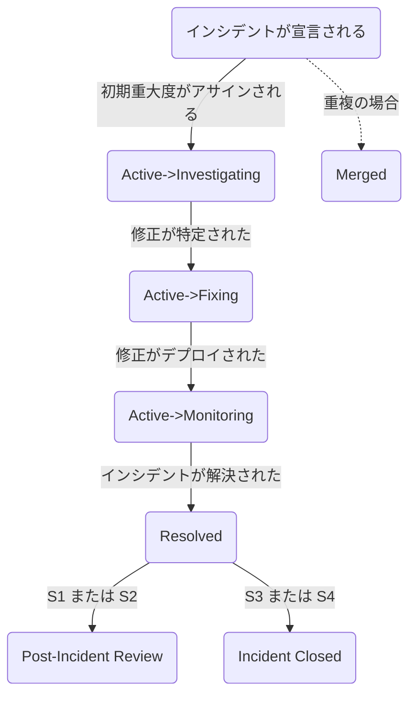

<div class="my-4 border-l-4 border-amber-500 bg-amber-50 px-4 py-3 rounded-r">

GitLab チームメンバーで GitLab.com の可用性に関する問題を Reliability Engineering に報告したい場合は、インシデント報告の簡単な手順をこちらでご確認ください：[インシデントの報告](#reporting-an-incident)。

</div>


<div class="my-4 border-l-4 border-amber-500 bg-amber-50 px-4 py-3 rounded-r">

GitLab チームメンバーで現在のオンコール担当エンジニア（EOC）を確認したい場合は、[現在の EOC は誰ですか？](#who-is-the-current-eoc)セクションをご覧ください。

</div>


<div class="my-4 border-l-4 border-amber-500 bg-amber-50 px-4 py-3 rounded-r">

GitLab チームメンバーで最近のインシデントの状況を確認したい場合は、インシデント[ボード](https://gitlab.com/gitlab-com/gl-infra/production/-/boards/1717012?&label_name%5B%5D=incident)をご覧ください。インシデントのステータス変更に関する詳細は[インシデントワークフロー](#incident-workflow)セクションをご覧ください。

</div>


<div class="my-4 border-l-4 border-amber-500 bg-amber-50 px-4 py-3 rounded-r">

incident.io がダウンしているまたは利用できない場合は、[incident.io がダウンしている場合の対処方法](incident-io-down.md)に従ってください。

</div>


## インシデント管理

インシデントとは、サービスの低下やアウテージを引き起こす—または引き起こす可能性のある—**異常な状態**です。これらのイベントは、サービスの中断を防いだり、運用状態にサービスを復旧させたりするために、人的介入を必要とします。
インシデントには_常に_即座の対応が行われます。

インシデント管理の目標は、混乱した状態を素早いインシデント解決へと整理することです。そのために、インシデント管理は以下を提供します。

1. 対応チームが確実にインシデントを解決できるメンバーを常駐させるための[オンコール体制](./on-call/)
1. インシデントチームメンバーのための明確に定義された[役割と責任](#incident-response-roles)および[ワークフロー](#incident-workflow)
1. 情報の流れと解決経路を管理するためのコントロールポイント
1. 教訓とテクニックを抽出・共有するためのインシデントレビュー

[インシデントが開始する](#reporting-an-incident)と、インシデント自動化ツールが対応する[インシデントアナウンスチャンネル](#incident-announcement-channels)にテキストベースのコミュニケーション用インシデント専用 Slack チャンネルへのリンクを含むメッセージを送信します。
インシデントチャンネル内に、インシデント専用の Zoom リンクが作成されます。
さらに、[Production トラッカー](https://gitlab.com/gitlab-com/gl-infra/production)に GitLab Issue がオープンされます。

### インシデント管理ライフサイクル

GitLab では、インシデント管理を以下のステップからなるフィードバックループとして取り組んでいます。

1. **準備** — インシデントに関わる可能性があるすべての人へのプロセスのドキュメント化と適切なトレーニング。適切なモニタリングとアラートが整備されており、適切な人がオンコールローテーションに含まれていることを確認することが含まれます。
1. **識別** — インストゥルメンテーション/アラート/モニタリング、顧客報告、チームメンバー報告、またはセキュリティ報告を通じて問題を特定します。特定されたらインシデントが宣言されます。
1. **調査** — アウテージ/サービス中断の原因を調査し、影響の初期評価を行い、重大度レベルを決定します。
1. **封じ込め** — 影響を封じ込め、できる限り迅速にサービスを安定させます。封じ込めが達成されたら、インシデントは「軽減済み」とみなされます。
1. **修復** — サービスの安定化に向けたより堅固な対応。すべての異常な状態が解消されたとき、インシデントは修復済み、つまり「解決済み」とみなされます。
1. **回復** — テストとドキュメントの改善。インシデントの再発防止や将来の対応時間を改善するために特定された是正措置は、このフェーズで開始される場合があります。
1. **学習** — 根本原因分析、インシデントレビュー/レトロスペクティブ、および追加の是正措置の特定。これらはすべてステップ1のドキュメントとトレーニングの更新にフィードバックされ、フィードバックループを閉じます。

モニタリングとアラートの概要については、[モニタリングハンドブックページ](/handbook/engineering/monitoring/)をご覧ください。必要に応じて開発チームの専門知識を得るための[開発エスカレーションプロセス](/handbook/engineering/workflow/development-processes/infra-dev-escalation/process/)も活用しています。

### メトリクス

インシデントのパフォーマンスは、ターゲットメトリクスのセット（MTTR、30分以内に軽減された割合、内部検知率など）に対して追跡されます。定義、スコープ、ダッシュボードへのリンクは[インシデントメトリクス](./metrics.md)ページに記載されています。

### スケジュールされたメンテナンス

`C1` のスケジュールされたメンテナンスは、未宣言のインシデントとして扱う必要があります。

メンテナンスウィンドウ開始の30分前に、変更を担当するエンジニアリングマネージャーは、SRE オンコール、リリースマネージャー、CMOC に対してメンテナンスが間もなく開始することを通知する必要があります。

調整とコミュニケーションは Situation Room Zoom で行い、メンテナンスに問題が発生した場合に他のエンジニアを迅速かつ簡単に参加させられるようにします。

メンテナンス手順中に関連するインシデントが発生した場合、EM はインシデントの期間中インシデントマネージャーとして行動する必要があります。

メンテナンス手順中に無関係の別のインシデントが発生した場合、スケジュールされたメンテナンスに関与しているエンジニアはアクティブなインシデントのために Situation Room Zoom を退出する必要があります。

スケジュールされたメンテナンス中に短時間のエラーが予想される場合は、関連するステータスページへの更新を通じてユーザーに通知する必要があります。メンテナンスの期間を[サービスレベル契約](/handbook/engineering/infrastructure-platforms/service-level-agreement/)へのダウンタイムとしてカウントしないようにするため、[メンテナンスウィンドウを設定する](https://runbooks.gitlab.com/monitoring/set_maintenance_window/)必要もあります。

## オーナーシップ

インシデントリードの役割はすべてのインシデントに対して意図的に設定する必要があります。インシデントのオーナーを決定する際に助けが必要な場合は、EOC が支援できます。
インシデントリードは、いつでも別のエンジニアにオーナーシップを委任したり、IM にオーナーシップをエスカレートしたりできます。
インシデントのオーナーは常に**1人**のみであり、インシデントのオーナーのみがインシデントを解決済みと宣言できます。
インシデントリードはいつでも階層の次の役割にサポートを求めることができます。インシデントリードの役割は常に現在のオーナーにアサインされている必要があります。

## インシデント管理の構造

GitLab では、インシデント管理フレームワークが2つの重要な概念を区別しています。

1. **インシデント対応の役割（Incident Response Roles）**：これらはインシデント対応中に必要な機能的な役職であり、誰が担うかに関わらず特定の責任と行動によって定義されます。現在、3つの定義された役割があります：インシデントリード、インシデントレスポンダー、コミュニケーションマネージャー。

2. **対応チーム（Response Teams）**：これらはこれらの役割を担当する特定のチームとローテーションです。異なる対応チームは異なる環境（例：GitLab.com 対 Dedicated）または専門機能をカバーする場合があります。

この区別を理解することで、インシデント中に誰が何をするかが明確になり、インシデント管理プロセス全体での適切な調整が確保されます。

<i class="fa-brands fa-youtube"></i> [インシデント対応の役割 対 チームについて詳しく見る](https://youtu.be/vmK9-7roDFM)

## インシデント対応の役割

インシデント中は責任の明確な区分が重要です。迅速な解決には、タスクの委任に関する集中力と明確な階層が必要です。重複を防ぎ、適切な操作順序を確保することが軽減に不可欠です。

| **役割** | **説明** | **必要な場面** |
| ---- | ----------- | ---- |
| [**インシデントリード**](./roles/incident-lead.html) | インシデント対応の調整を担当し、インシデントを解決に導くインシデントのオーナー。インシデントリードは常に incident.io で役割をアサインされている必要があります。 | すべてのインシデントにはインシデントリードが必要であり、インシデントごとに意図的に設定する必要があります。インシデントリードの選定に関する詳細は[ワークフローセクション](#incident-lead)をご覧ください。 |
| [**インシデントレスポンダー**](./roles/incident-responder.html) | 技術的な調査と軽減を実施します。インシデントを引き起こしている技術的問題の実際のトラブルシューティングと解決を担当します。 | すべてのインシデント |
| [**コミュニケーションリード**](./roles/communications-lead.html) | 複数のメディアを通じてステークホルダーと顧客に情報を発信します。外部コミュニケーションとステータス更新を管理します。 | S1/S2 インシデントまたは重要なコミュニケーションが必要な場合 |

## 対応チーム

オンコールスケジュールを維持することで、インシデントを解決できるチームメンバーが常に確保されています。

オンコールのチームメンバーがページングされると、インシデントに参加し、上記のインシデント対応の役割のいずれかを担当します。

オンコールのプロセスとポリシーの詳細は[オンコールハンドブックページ](./on-call/)をご覧ください。

以下はインシデント解決をサポートするオンコールローテーションの概要です。

### Tier 1

自動化システムによって通知されるオンコールローテーション：

| **チーム** | **主要な役割** | **機能** | **環境** | **担当者** |
| ---- | ---- | ----------- | ---- | ---- |
| **Engineer On Call (EOC)** | [インシデントレスポンダー](./roles/incident-responder.html) | 主に自動アラートおよび GitLab.com エスカレーションの最初のインシデントレスポンダーとして機能します。役割の期待事項は[オンコールハンドブック](/handbook/engineering/infrastructure-platforms/incident-management/on-call/#general-expectations-for-on-call)にあります。EOC のチェックリストは[ランブック](https://gitlab.com/gitlab-com/runbooks/blob/master/on-call/checklists/eoc.md)にあります。EOC が幅広い問題のトラブルシューティングを支援するランブックが用意されており、ランブックでは不十分な場合、EOC は[インシデントマネージャーと CMOC を招集](#how-to-engage-response-teams)してエスカレートします。 | GitLab.com | 通常 SRE で、インシデントを宣言できます。incident.io の「GitLab.com Production EOC」オンコールスケジュールに含まれています。 |
| **Incident Manager On Call (IMOC)** | [インシデントリード](./roles/incident-lead.html) | 複雑なインシデント中の戦術的な調整とリーダーシップを提供します。 | GitLab.com | [incident.io](https://app.incident.io/gitlab/on-call/schedules/01K77XZFD7X7E3W8T6GDVMKAFF) のローテーション |

低重大度のインシデントでは、ページングされた個人が複数の役割を担う場合があります。例えば、S4 インシデントでは EOC がインシデントリードとインシデントレスポンダーの両方の職務を担当することがあります。重大度が上がるにつれて、単一の個人がこれらの役割を担うことがより重要になります。[Tier 2](#tier-2) の個人をページングする必要が出てきます。

### Tier 2

人間によって通知されるオンコールローテーション：

| **チーム** | **役割** | **機能** | **環境** | **担当者** |
| ---- | ---- | ----------- | ---- | ---- |
| **Communications Manager On Call (CMOC)** | [コミュニケーションリード](./roles/communications-lead.html) | コミュニケーションマネージャー役割を担当します。 | すべての環境 | 通常 GitLab のサポートチームメンバー。 |
| **Infrastructure Leadership** | n/a | #cto への更新の維持を含む、高重大度インシデントのエスカレーションサポートを提供します。 | すべての環境 | Infrastructure、Platform 部門の Staff+ または EM。 |
| **Subject Matter Expert (Tier 2 SME)** | [インシデントレスポンダー](./roles/incident-responder.html) | インシデント中にサポートのために招集できる特定の知識を持つエンジニア。 | GitLab.com / Dedicated | [特定の知識を持つエンジニア](/handbook/engineering/infrastructure-platforms/incident-management/tier2-escalations.md) |

## 役割とチームのマッピング

このテーブルは、インシデント対応中にどのチームが通常どの役割を担うかを示しています。

| **役割** | **主要チーム** | **代替チーム** |
| ---- | ---- | ---- |
| インシデントリード | インシデントタイプによって異なります（[インシデントリード](./roles/incident-lead.html)を参照） | EOC、IMOC、プロダクトエンジニア |
| インシデントレスポンダー | EOC | プロダクトエンジニア、その他の Subject Matter Expert |
| コミュニケーションリード | CMOC | N/A |

## 詳細な役割責任

### インシデントリードの責任

インシデントリードは、インシデントが進行し更新され続けることを確保する責任があります。この役割は自動的に設定されるものではなく、インシデントの種類に基づいてアサインされるべきです。インシデントリードのアサインに関する詳細は[ワークフローセクション](#incident-lead)をご覧ください。インシデントリードは必要に応じて EOC や IMOC などの他の関係者を積極的に招集することが求められます。

[インシデントリードの責任](./roles/incident-lead.html)のより詳細な内訳をご覧ください。

### インシデントレスポンダーの責任

インシデントレスポンダーとは、インシデントの技術的な調査と解決に貢献するすべての人を指します。EOC チームは通常主要なレスポンダーとして機能しますが、関連する専門知識を持つ GitLab チームメンバーであれば誰でも支援のために呼び出される可能性があります。

[インシデントレスポンダーの責任](./roles/incident-responder.html)のより詳細な内訳をご覧ください。

### コミュニケーションリードの責任

コミュニケーションリードは、ステータスページの更新管理、ステークホルダー通知の調整、そして外部顧客への影響が確認された重大インシデントに関するタイムリーな公開コミュニケーションの確保を通じて、重大インシデント中の GitLab の公式な声として機能します。

複数のチャンネルにわたる調整されたコミュニケーションを必要とする重大インシデントでは、IMOC はインシデントの期間中コミュニケーションリードを頼ります。

[コミュニケーションリードの責任](./roles/communications-lead.html)のより詳細な内訳をご覧ください。

## 詳細なチーム責任

### Engineer On Call (EOC) の責任

Engineer On Call は通常、主要なインシデントレスポンダーとして機能し、宣言されたインシデントの影響軽減と解決を担当します。EOC はサポートが必要な場合や他の人がインシデント調査の支援に必要な場合は IMOC に連絡する必要があります。

EOC は[インシデントレスポンダーの責任](./roles/incident-responder.html)を確認してください。

### Incident Manager On Call (IMOC) の責任

Incident Manager On Call は通常、インシデントリードとして機能し、インシデント中の戦術的なリーダーシップと調整を担当します。

IMOC は[インシデントリードの責任](./roles/incident-lead.html)と[コミュニケーションリードの責任](./roles/communications-lead.html)の両方を確認してください。インシデントリードは多くの低重大度インシデントでコミュニケーションリードとしても機能する場合があるためです。

_シフトのスケジュール方法や PTO や補償が必要な場合の一般的なシナリオについての一般的な情報は、[インシデントマネージャーオンボーディングドキュメント](/handbook/engineering/infrastructure-platforms/incident-management/incident-manager-onboarding/#frequently-asked-questions)をご覧ください。_

### Infrastructure Leadership の責任

Infrastructure Leadership は、Engineer On Call (EOC) と Incident Manager On Call (IMOC) の両方のエスカレーションパスに含まれています。
これはアクティブな IMOC の代替や置き換えではありません（現在の IMOC が利用不可の場合を除く）。

Infrastructure Leadership に直接ページングするには、`/inc escalate` を実行し、`Oncall Teams` ドロップダウンメニューから `dotcom leadership escalation` を選択します。

以下の状況でページングされます。

1. #cto Slack への更新提供を目的とした、すべての S1 インシデント。
2. IMOC が 15 分以内にページに応答できない場合。
3. 複数の進行中インシデントが EOC を圧迫している場合、または複数の SRE 間での調整が必要な場合、Infrastructure Leadership をページングして回復の調整と追加支援の招集を支援してもらえます。

ページングされた際、Infrastructure Leadership は以下を実施します。

1. インシデントコールに参加します。
2. インシデントレスポンダーに追加の SRE からの支援が必要かどうか確認します。
3. IMOC が職務を果たせることを確認します。
4. インシデントレスポンダーが完全に修復に集中できるよう、IMOC/CMOC の主要な技術的接点となります。
5. 進行中のすべての S1 インシデントについて #cto Slack チャンネルへの更新を提供します。

#### CTO へのアップデート

Infrastructure Leadership は、GitLab.com および GitLab Dedicated インシデントの両方について、インシデント開始時、重要なステータス変更時（「調査中」から「修正中」など）、およびインシデント解決時に #cto Slack チャンネルへのアップデートを行う必要があります。
アップデートは GitLab.com 用に使用されている標準の incident.io Summary フォーマットに従い、通常はインシデントサマリーからコピー＆ペーストできます。
既存のサマリーが不十分な場合は、@incident Slack bot にインシデントの executive summary のドラフト作成を依頼できます。

```markdown
:s1: **GitLab.com でのインシデント**

**問題**:
（高レベルのサマリーを含む）
**影響**:
（どのサービス/アクセス方法と何割のユーザーに影響しているかを含む、ユーザーへの影響を説明）
**原因**:
（判明している場合は原因のリスト）
**対応戦略**:
（問題を修復するために何をしているか）
**— Production Issue —**
主なインシデント: （インシデントへのリンク）
Slack チャンネル: （インシデント Slack チャンネルへのリンク）
```

## チームコーディネーター

### インシデントマネージャーコーディネーター

1. 毎月第1火曜日頃：
   - コーディネーターは [IM オンボーディング/オフボーディングボード](https://gitlab.com/gitlab-com/gl-infra/production-engineering/-/boards/5078854?label_name%5B%5D=IM)の `~IM-Onboarding::Ready` と `~IM-Offboarding` のオープンな Issue をレビューし、これらのチームメンバーをスケジュールに追加します。
   - スケジュールは incident.io の [Incident Manager - GitLab SaaS スケジュール](https://app.incident.io/gitlab/on-call/schedules/01K77XZFD7X7E3W8T6GDVMKAFF)を編集して更新されます。
   - スケジュールを編集する際は、各ローテーションの変更が有効になる時間を設定することを確認してください（通常は最初の月曜日の UTC 00:00）。
2. MR へのリンクと追加または削除された人の簡単な概要とともにスケジュールが変更されたことを示すアナウンスが [`#im-general`](https://gitlab.slack.com/archives/C01NY82EJF6) に投稿されます。
3. [IM オンボーディング/オフボーディングボード](https://gitlab.com/gitlab-com/gl-infra/production-engineering/-/boards/5078854?label_name%5B%5D=IM)のすべての Issue は、期限超過の確認のために月に1回レビューする必要があります。
   期限を過ぎた Issue がある場合、コーディネーターはオンボーディングを完了するためにより多くの時間やサポートが必要かどうかを確認するために作成者にチェックインする必要があります。

### Engineer On-Call コーディネーター

EOC コーディネーターは、SRE オンコールの生活の質を向上させ、会社全体のオンコールエンジニアが高い自信のレベルで運用できるようにプロセスを設定することに焦点を当てています。

この役割の責任：

1. EOC の生活の質向上に役立つプロセスとツールのギャップを特定し、PI を通じて把握する。
2. 定期的なトレーニングとワークショップを調整する。
3. インシデントレビューと注目すべきインシデントのフォローアップとして、SRE 間の知識移転を可能にする。
4. SaaS Platforms 内の他のチームとの調整と優先度設定を通じて、インシデント管理に関するより大きな変更を推進する。

EOC コーディネーターはコアなオンコールとインシデント管理の懸念事項について Ops チームと密接に連携し、必要に応じて組織全体の他のチームと関わります。

## 参考資料

### その他のエスカレーション

必要に応じて Infrastructure Platforms チームからさらなるサポートが利用できます。
Infrastructure Platforms リーダーシップは PagerDuty [Infrastructure Platforms Escalation](https://gitlab.pagerduty.com/escalation_policies#PDJ160O) で連絡できます（詳細は[チームページ](/handbook/engineering/infrastructure-platforms/)をご覧ください）。
Delivery リーダーシップは PagerDuty で連絡できます。Delivery グループページの[リリース管理エスカレーション](/handbook/engineering/infrastructure-platforms/gitlab-delivery/delivery/#release-management-escalation)手順をご覧ください。

### インシデント軽減方法 - EOC/インシデントマネージャー

1. S1 または S2 インシデント中に広範なユーザーへの影響が確認された場合、EOC としてインシデントを軽減するために必要に応じて—さらなる許可なしに—[ユーザーをブロック](https://docs.gitlab.com/ee/administration/moderate_users.html#block-a-user)する権限があります。インシデントへのリンクと、ユーザーがブロックされた理由をさらに説明するメモを含む[サポートガイドラインの `Admin Notes` に関して](../../../support/workflows/admin_note/#adding-the-note)必ず従ってください。
    1. ユーザーがブロックされた場合、さらなるフォローアップが必要になります。これはインシデント中に、または時間的制約に応じて軽減後に実施できます。
        1. アカウントのアクティビティが[不正使用](/handbook/security/security-operations/trustandsafety/abuse-on-gitlab-com/#abuse-categories)と見なされる場合、アカウントを永久にブロックして後処理するために[Trust and Safety](/handbook/security/security-operations/trustandsafety/#gitlab-team-members-can-reach-trust-and-safety-via) にユーザーを報告してください。イベントの性質によっては、EOC は SIRT チームへの連絡も検討する場合があります。
        1. そうでない場合は、[関連する機密インシデント Issue を作成して CMOC にアサイン](https://gitlab.com/gitlab-com/gl-infra/production/-/issues/new?issuable_template=confidential_incident_data)し、ユーザーに一時的にアカウントをブロックしなければならなかった理由を説明してもらいます。
        1. EOC がユーザーのトラフィックが悪意のあるものかどうかを判断できない場合は、[SIRT](/handbook/security/security-operations/sirt/) チームに調査を依頼してください。

### インシデントマネージャーを招集するタイミング

以下のいずれかが当てはまる場合は、インシデントマネージャーを招集することをお勧めします。

1. S1/P1 レポートまたはセキュリティインシデントがある。
1. GitLab.com アプリケーションのパス全体または機能の一部をブロックする必要がある。
1. GitLab.com プロダクションシステムへの不正アクセスがある。
1. 他の SRE への委任を支援するために 2 件以上の S3 以上のインシデントがある。

**注意:** インシデントの重大度が上がった場合（例：S3 から S1 に）、incident.io は自動的に EOC、IMOC、CMOC にページングします。

### 複数のインシデントが同時発生した場合の対処

時折、同時に複数のインシデントが発生することがあります。場合によっては、1人のインシデントマネージャーが複数のインシデントをカバーできます。これは特に、重要なアクティビティを伴う2件の同時高重大度インシデントがある場合は不可能なことがあります。

複数のインシデントがあり、追加のインシデントマネージャー支援が必要と判断した場合は、以下のアクションを取ってください。

1. #im-general と適切な[インシデントアナウンスチャンネル](#incident-announcement-channels)に追加のインシデントマネージャー支援を求める Slack メッセージを投稿します。
2. Slack 経由でリクエストに対応がない場合は、`/inc escalate` を使用して Infrastructure Leadership にエスカレートします。

### 週末のエスカレーション

EOC は週末でもアラートへの対応が期待されています。インシデントが `~severity::1` または `~severity::2` でない限り、軽減に時間を費やすべきではありません。`~severity::3` と `~severity::4` インシデントの軽減は月曜日から金曜日の通常業務時間中に実施できます。ご質問がある場合は[インフラストラクチャエンジニアリングマネージャー](https://gitlab.com/gitlab-com/gl-infra/managers)にお問い合わせください。

`~severity::3` と `~severity::4` が複数回発生し週末作業が必要な場合、複数のインシデントを単一の `severity::2` インシデントにまとめるべきです。
重大度の判断に支援が必要な場合は、EOC とインシデントマネージャーは `/inc escalate` を通じて Infrastructure Leadership に連絡することをお勧めします。

### インシデントマネージャーエスカレーション

EOC（Engineer On Call）がページに応答しない場合、ページはインシデントマネージャー（IM）にエスカレートされます。
このエスカレーションは incident.io を経由するすべてのアラートで発生し、低重大度のアラートも含まれます。
大量のページがあり EOC がページの確認に集中できない場合にこれが発生する可能性があります。
この場合、IM は対応する[インシデントアナウンスチャンネル](#incident-announcement-channels)で EOC が支援を必要としているかどうかを確認するために Slack で連絡を取る必要があります。

例：

```plaintext
@sre-oncall、エスカレーションを受け取りました。LINK_TO_INCIDENT_ESCALATION を調査できますか、それとも何か支援が必要ですか？
```

EOC が利用不可のために応答しない場合は、incident.io アプリケーションを使用してインシデントをエスカレートし、インフラストラクチャエンジニアリングリーダーシップにアラートを送信する必要があります。

### 対応チームを招集する方法

インシデント中にインシデントレスポンダー（EOC）、IMOC、またはコミュニケーションマネージャー（CMOC）を招集する必要がある場合は、以下のいずれかの方法でオンコール担当者にページングします。これにより PagerDuty インシデントまたは incident.io エスカレーションがトリガーされ、選択した**Impacted Service** に基づいて適切な担当者にページングされます。

- Slack で `/inc escalate` コマンドを使用し、以下のチームに基づいて `Oncall team` ドロップダウンメニューから正しいチームを選択します。

| ページング先チーム | サービス名 |
| ----- | ----- |
| dotcom EOC | dotcom EOC |
| dotcom IMOC | dotcom IMOC |
| CMOC | dotcom CMOC |

### 顧客との直接対話が必要なインシデント

S1 または S2 インシデント中に、1人または複数の顧客と同期的な会話を持つことが有益と判断された場合、その会話には新しい Zoom ミーティングを使用すべきです。通常、このアクションにつながる2つの状況があります。

1. 顧客が GitLab.com をどのように使用しているかについての洞察が解決策の発見に価値のある、単一または少数の顧客に特有に影響するインシデント。
1. 主要な顧客と同期的な会話を持ちたい、追加の更新を提供したり追加の質問に回答するような、マルチ時間の完全停止や地域的な DR イベントなどの大規模なインシデント。

関係するオーバーヘッドと影響軽減の取り組みから注意を逸らすリスクから、このコミュニケーションオプションは慎重に使用し、非常に明確かつ明白なニーズがある場合にのみ使用すべきです。

インシデントの直接顧客対話コールの実施は、現在のインシデントマネージャーが以下の手順を取ることで開始されます。

1. 顧客コールに専念する2人目のインシデントマネージャーを特定します。インシデントにまだいない場合は、`/here A second incident manager is required for a customer interaction call for XXX` のようなメッセージで #im-general でニーズをアナウンスします。
2. 追加の支援と認識のために[Infrastructure Leadership ローテーション](#infrastructure-leadership-responsibilities)にページングします。
3. 顧客コールに専念するカスタマーサクセスマネージャー（CSM）を特定します。この役割が明確でない場合は、Infrastructure Leadership にも確認します。
4. これらの追加の役割をメインのインシデントに参加させてインシデントの履歴と現状を把握するよう依頼します。軽減への集中を維持するために必要な場合は、この情報共有を別の Zoom ミーティングで行うことができます（その後、顧客との会話にも使用できます）。

インシデントの履歴と現状を把握した後、エンジニアリングコミュニケーションリードは以下のアクションで顧客対話を開始・管理します。

1. 新しい Zoom ミーティングを開始し—すでに進行中のものがない限り—プライマリ CSM を招待します。
1. エンジニアリングコミュニケーションリードと CSM は、`GitLab` と自分の役割（`CSM`、`Engineering Communications Lead`）を示すように Zoom 名を適切に設定します。
1. CSM を通じて、ディスカッションに必要な顧客を招待します。
1. エンジニアリングコミュニケーションリードとインシデントマネージャーは、会話間で正確な情報が流れるよう非同期更新を優先する必要があります。このためにインシデント Slack チャンネルの使用を検討しますが、顧客コールが始まる前に合意してください。
1. エンジニアリングコミュニケーションリードと CSM の両方は、インシデントに必要な全時間、顧客との Zoom に留まる必要があります。コンテキストの損失を避けるため、どちらも内部インシデント Zoom と顧客対話 Zoom を行き来すべきではありません。

シナリオによっては、インシデントのほぼすべての参加者（EOC、他の開発者など）が顧客と直接作業する必要がある場合があります。この場合、インシデント Zoom ではなく顧客対話 Zoom を使用します。これにより、会話（およびテキストチャット）が可能になりながら、一次対応者がインシデント Zoom で内部コミュニケーションを素早く再開する機能も維持されます。

## 是正措置

是正措置（CA）はインシデントの結果として作成する作業アイテムです。
インシデントから生じた Issue のみが `~"corrective action"` ラベルを受け取るべきです。
これらは同種のインシデントを防止したり軽減までの時間を改善するために設計されており、インシデント管理サイクルの一部です。
是正措置はダウンストリームの分析を支援するためにインシデント Issue に関連付ける必要があります。

[Production Engineering プロジェクト](https://gitlab.com/gitlab-com/gl-infra/production-engineering/-/issues/new)の是正措置 Issue は、フォーマット、ラベル、[完了のためのサービスレベル目標の適用/モニタリング](/handbook/product-development/how-we-work/issue-triage/#severity-slos)の一貫性を確保するために[是正措置 Issue テンプレート](https://gitlab.com/gitlab-com/gl-infra/reliability/-/blob/master/.gitlab/issue_templates/incident-corrective-action.md)を使用して作成する必要があります。

`~"corrective action"` ラベルを持つ Issue には自動的に `~"infradev"` ラベルが適用されます。
これは、これらの Issue が[特定の期間](/handbook/product-development/how-we-work/issue-triage/#severity-slos)内に解決するための開発と同じプロセスに従うためです。
詳細については[infradev プロセス](/handbook/product/product-processes/#infradev)をご覧ください。

### 是正措置 Issue を作成する際のベストプラクティスと例

- [SMART](https://en.wikipedia.org/wiki/SMART_criteria) 基準を使用してください：具体的（Specific）、測定可能（Measurable）、達成可能（Achievable）、関連性のある（Relevant）、期限付き（Time-bounded）。
- 発生したインシデントへのリンクを貼ってください。
- 関連するインシデントの最高重大度を示す重大度ラベルをアサインしてください。
- 作業の[緊急性](/handbook/product-development/how-we-work/issue-triage/#priority)を示す優先度ラベルをアサインしてください。デフォルトでは、インシデントの重大度と一致させてください。
- 該当する場合は、関連する影響を受けたサービスのラベルをアサインしてください。
- 是正措置 Issue のプロジェクト内のどのエンジニアでも Issue を引き継いで次のステップを知ることができるよう、十分なコンテキストを提供してください。
- 以下のような是正措置の作成は避けてください：
  - 過度に一般的（「具体的」に反する、最も典型的な間違い）
  - インシデントの症状のみを修正する。
  - 人的エラーをさらに増加させる。
  - インシデントの再発防止に役立たない。
  - 迅速に実装できない（期限付きに反する）。
- 例：（いくつかのベストプラクティス Postmortem ページから引用）

| 適切でない表現 | より良い表現 |
| ------------ | ------ |
| アウテージを引き起こした問題を修正する | （具体的）ユーザーアドレスフォーム入力の無効な郵便番号を安全に処理する |
| このシナリオのモニタリングを調査する | （実行可能）このサービスが 1% 超のエラーを返すすべてのケースにアラートを追加する |
| データベーススキーマを更新する前にエンジニアが解析できることを確認する | （期限付き）スキーマ変更の自動 presubmit チェックを追加する |
| より信頼性が高くなるようアーキテクチャを改善する | （期限付きかつ具体的）サービスに単一障害点がなくなるよう冗長ノードを追加する |

## ランブック

[ランブック](https://gitlab.com/gitlab-com/runbooks)はオンコールのエンジニアが利用できます。プロジェクトの README には上記の各役割のチェックリストへのリンクが含まれています。

**GitLab.com のアウテージが発生した場合**、ランブックリポジトリのミラーが https://ops.gitlab.net/gitlab-com/runbooks の Ops インスタンスで利用できます。

### 現在の EOC は誰ですか？

`@sre-oncall` ハンドルを使用して現在の EOC を確認してください。

### 現在の EOC に連絡するタイミング

現在の EOC は Slack の `@sre-oncall` ハンドルで連絡できますが、このハンドルは以下のシナリオでのみ使用してください。

1. デプロイメントパイプラインを停止する支援が必要な場合。注：これは[インシデントを報告する](/handbook/engineering/infrastructure-platforms/incident-management/#reporting-an-incident)ことで、カスタムフィールド「Blocks Deployments」を「Yes」に設定することでも達成できます。
1. [変更管理](/handbook/engineering/infrastructure-platforms/change-management/)プロセスを通じてプロダクション変更を実施しており、必要なステップとして EOC の承認を求める必要がある場合。
1. その他の懸念事項については、[サポート依頼](/handbook/engineering/infrastructure-platforms/getting-assistance/)セクションをご覧ください。

EOC は Slack での `@sre-oncall` ハンドルの使用にできるだけ早く応答しますが、状況によっては直ちに対応できない場合があります。緊急の場合や即時の応答が必要な場合は、[インシデントの報告](/handbook/engineering/infrastructure-platforms/incident-management/#reporting-an-incident)セクションをご覧ください。

## インシデントの報告 {#reporting-an-incident}

GitLab チームメンバーで GitLab.com に関連する可能性のあるインシデントを報告したい場合は、以下の手順に従ってインシデントを宣言してください。EOC がオンラインになりインシデントについてあなたと関与するまでオンラインのままでいてください。ご協力ありがとうございます！

### Slack でインシデントを報告する

GitLab の Slack で `/incident` または `/inc` と入力し、プロンプトに従ってインシデント Issue をオープンしてください。
確信が持てない場合でも、より高い重大度を選択してプロダクション問題のインシデントを宣言することをお勧めします。
高重大度のバグをこのプロセスで報告することが推奨されており、必要に応じて適切なエンジニアリングチームを確保できます。


_インシデント宣言 Slack ウィンドウ_

| フィールド | 説明 |
| ----- | ----------- |
| Name | 何が起きているかの簡単な説明を入力します。空白にして後で変更することもできます。 |
| Incident Type | 影響を受けるサービスに応じて適切なインシデントタイプを選択します：GitLab.com、Dedicated、SIRT、または Gameday |
| Initial status | 問題が確認され今すぐ調査したい場合は「Active incident」を選択し、初期調査には「Triage a problem」を選択します。 |
| Severity | 重大度が不明だが大きな顧客影響が見られる場合は S1 または S2 を選択してください。詳細はこちら：[インシデントの重大度](#incident-severity)。EOC は S1 または S2 の場合のみ自動的にページングされます。 |
| Summary（オプション） | インシデントで何が起きたか、その影響についての現在の理解を提供してください。詳細に記述しても問題ありません。 |


_インシデント宣言結果_

GitLab インシデント Issue のオープンに加えて、専用のインシデント Slack チャンネルがオープンされます。incident.io は対応する[インシデントアナウンスチャンネル](#incident-announcement-channels)にこれらすべてのリソースへのリンクを投稿します。インシデント宣言の結果として作成・リンクされたインシデント Slack チャンネルに参加し、オンコールエンジニアとインシデントについてディスカッションしてください。S3 または S4 を宣言して EOC の支援が必要な場合は、Slack チャンネルで `/inc escalate` と入力してエスカレートしてください。

## アウテージ 対 低下 対 中断の定義とコミュニケーションのタイミング

これは Status.io の用語によるサービス中断（アウテージ）、部分的なサービス中断、パフォーマンス低下の定義の初版です。
データは[Key Service Metrics Dashboard](https://dashboards.gitlab.net/d/general-service/service-platform-metrics?orgId=1)のグラフに基づいています。

アウテージとパフォーマンス低下インシデントは次の場合に発生します。

1. `低下`：サービスが文書化された Apdex SLO を下回るか、文書化されたエラー率 SLO を上回る5分間継続する状態。
1. `アウテージ`（ステータス = 中断）：エラー率グラフのアウテージラインを超える5分間継続するエラー率。


低下またはアウテージのどちらの場合も、イベントが5分を経過したら、EOC とインシデントマネージャーは外部コミュニケーションのために CMOC を招集する必要があります。5分以上継続するすべてのインシデント（「一瞬」のインシデントを含む）は、インシデント発生から1時間以内にできるだけ早く公開で通知する必要があります。

SLO は [runbooks/rules](https://gitlab.com/gitlab-com/runbooks/blob/master/rules/service_apdex_slo.yml) に記載されています。

GitLab.com の低下または中断を確認するには、以下のグラフを確認します。

1. Web サービス
    - [エラー率](https://dashboards.gitlab.net/d/general-service/service-platform-metrics?orgId=1&fullscreen&panelId=8&var-PROMETHEUS_DS=Global&var-environment=gprd&var-type=web&var-stage=main&var-sigma=2)
    - [Apdex](https://dashboards.gitlab.net/d/general-service/service-platform-metrics?orgId=1&var-PROMETHEUS_DS=Global&var-environment=gprd&var-type=web&var-stage=main&var-sigma=2&fullscreen&panelId=7)
1. API サービス
    - [エラー率](https://dashboards.gitlab.net/d/general-service/service-platform-metrics?orgId=1&fullscreen&panelId=8&var-PROMETHEUS_DS=Global&var-environment=gprd&var-type=api&var-stage=main&var-sigma=2)
    - [Apdex](https://dashboards.gitlab.net/d/general-service/service-platform-metrics?orgId=1&fullscreen&panelId=7&var-PROMETHEUS_DS=Global&var-environment=gprd&var-type=api&var-stage=main&var-sigma=2)
1. Git サービス（公開向けの git インタラクション）
    - [エラー率](https://dashboards.gitlab.net/d/general-service/service-platform-metrics?orgId=1&fullscreen&panelId=8&var-PROMETHEUS_DS=Global&var-environment=gprd&var-type=git&var-stage=main&var-sigma=2)
    - [Apdex](https://dashboards.gitlab.net/d/general-service/service-platform-metrics?orgId=1&fullscreen&panelId=7&var-PROMETHEUS_DS=Global&var-environment=gprd&var-type=git&var-stage=main&var-sigma=2)
1. GitLab Pages サービス
    - [エラー率](https://dashboards.gitlab.net/d/general-service/service-platform-metrics?orgId=1&fullscreen&panelId=8&var-PROMETHEUS_DS=Global&var-environment=gprd&var-type=pages&var-stage=main&var-sigma=2)
    - [Apdex](https://dashboards.gitlab.net/d/general-service/service-platform-metrics?orgId=1&fullscreen&panelId=7&var-PROMETHEUS_DS=Global&var-environment=gprd&var-type=pages&var-stage=main&var-sigma=2)
1. Registry サービス
    - [エラー率](https://dashboards.gitlab.net/d/general-service/service-platform-metrics?orgId=1&fullscreen&panelId=8&var-PROMETHEUS_DS=Global&var-environment=gprd&var-type=registry&var-stage=main&var-sigma=2)
    - [Apdex](https://dashboards.gitlab.net/d/general-service/service-platform-metrics?orgId=1&fullscreen&panelId=7&var-PROMETHEUS_DS=Global&var-environment=gprd&var-type=registry&var-stage=main&var-sigma=2)
1. Sidekiq
    - [エラー率](https://dashboards.gitlab.net/d/general-service/service-platform-metrics?orgId=1&var-PROMETHEUS_DS=Global&var-environment=gprd&var-type=sidekiq&var-stage=main&var-sigma=2&fullscreen&panelId=8)
    - [Apdex](https://dashboards.gitlab.net/d/general-service/service-platform-metrics?orgId=1&fullscreen&panelId=7&var-PROMETHEUS_DS=Global&var-environment=gprd&var-type=sidekiq&var-stage=main&var-sigma=2)

部分的なサービス中断とは、GitLab.com のサービスまたはインフラストラクチャの一部のみがインシデントを経験している状態です。部分的なサービス中断の例としては、GitLab.com が通常通り運用されているが以下のような場合があります。

1. CI/CD ペンディングジョブの遅延
1. リポジトリミラーリングの遅延
1. マージリクエストなど特定の機能に影響する高重大度バグ
1. git リポジトリのサブセットに影響する1つの gitaly ノードでの不正使用または低下。これは Gitaly サービスメトリクスで確認できます。

### 高重大度バグ

高重大度バグの場合でも、[インシデントを報告する](/handbook/engineering/infrastructure-platforms/incident-management/#reporting-an-incident)経由でインシデントを作成することをお勧めします。これにより、イベントと対応を追跡するインシデント Issue が作成されます。

進行中または予定されているデプロイメントに高重大度バグがある場合は、[デプロイメントをブロック](/handbook/engineering/deployments-and-releases/deployments/#deployment-blockers)する手順に従ってください。

## セキュリティインシデント

インシデントがセキュリティに関連する可能性がある場合は、Slack で `/security` を使用してセキュリティエンジニアオンコールを招集してください。詳細は[セキュリティエンジニアオンコールの招集](/handbook/security/security-operations/sirt/engaging-security-on-call/)をご覧ください。

## コミュニケーション

情報はインシデントの影響を受けるすべての人にとっての資産です。情報の流れを適切に管理することは、驚きを最小限に抑え、期待値を設定するために不可欠です。適切に計画できるよう、関心のあるステークホルダーにタイムリーに進展を通知することを目指しています。

この流れは以下によって決まります。

1. 情報の種類
1. 対象となる読者
1. タイミングの重要性

さらに、すべてのステークホルダーの焦点を維持するために情報過多を避けることが必要です。

そのために、以下を設けています。

1. すべてのインシデント用の専用 Zoom コール。Zoom コールへのリンクは、対応する[インシデントアナウンスチャンネル](#incident-announcement-channels)に投稿されたインシデント Slack チャンネルで確認できます。
1. 複数ユーザーの入力が必要な場合に[共有テンプレート](https://docs.google.com/document/d/1NMZllwnK70-WLUn_9IiiyMWeXs-JKPEiq-lordxJAig/edit#)に基づく Google Doc。
1. 内部更新のための[インシデントアナウンスチャンネル](#incident-announcement-channels)。
1. 様々なメディア（例：Twitter）に配信される status.io 経由での status.gitlab.com への定期的な更新。
1. Infrastructure のワークロードを保持するキューとは別に、インシデントや変更に関する Issue 専用の[Production](https://gitlab.com/gitlab-com/production) リポジトリ。

### インシデントアナウンスチャンネル

インシデントがアナウンスされる専用のインシデント Slack チャンネルが3つあります。

- [#incidents](https://gitlab.slack.com/archives/incidents)：すべてのインシデントがここでアナウンスされます。
- [#incidents-dotcom](https://gitlab.slack.com/archives/incidents-dotcom)：すべての .com インシデントがここでアナウンスされます。
- [#incidents-dedicated](https://gitlab.slack.com/archives/incidents-dedicated)：すべての [Dedicated](/handbook/support/workflows/dedicated/) インシデントがここでアナウンスされます。

### ステータス

[status.gitlab.com](https://status.gitlab.com) を更新する status.io を使用してインシデントの[コミュニケーション](#communication)を管理しています。status.io のインシデントには **state** と **status** があり、CMOC によって更新されます。

status.io でインシデントを作成するには、Slack で `/woodhouse incident post-statuspage` を使用できます。

#### セキュリティインシデント中のステータス

場合によっては status.io への投稿を行わないことを選択する場合があり、投稿/ツイートをスキップする例を以下に示します。場合によっては、セキュリティ更新をリリースするまでセルフマネージドインスタンスのセキュリティを保護するのに役立ちます。

- パスのURLの部分ブロックが可能な場合、例えばパスの問題のある文字列を除外する場合。
- 過去1週間のログ検索で GitLab.com での URL の使用がない場合。

#### ステートとステータス

ステートとステータスを遷移するための定義とルールは次のとおりです。

| **ステート** | **定義** |
| ----- | ---------- |
| Investigating（調査中） | インシデントが発見されたばかりで、影響や原因についてまだ明確な理解がありません。EOC が関与してから 30 分以上このステートが続く場合は、インシデントを Incident Manager On Call にエスカレートする必要があります。 |
| Active（アクティブ） | インシデントが進行中で、まだ軽減されていません。**注：** 影響が軽減されたらインシデントを `Active` ステートのままにしないでください。 |
| Identified（特定済み） | インシデントの原因が特定されたと考えられ、**軽減のためのステップが計画・合意されています**。 |
| Monitoring（監視中） | ステップが実行され、ベースラインで運用していることを確認するためにメトリクスが監視されています。特定の軽減が解決に至ることへの明確な理解と高い確信がある場合は、このステートをスキップすることをお勧めします。 |
| Resolved（解決済み） | インシデントの影響が軽減され、ステータスが再び Operational になりました。解決後、インシデントは[レビューのためにマーク](/handbook/engineering/infrastructure-platforms/incident-review/#incident-review-process)でき、[是正措置](/handbook/engineering/infrastructure-platforms/incident-management/#corrective-actions)を定義できます。 |

ステータスはステートとは独立して設定できます。これらが一致しなければならない唯一の場面は Issue が

| **ステータス** | **定義** |
| ------ | ---------- |
| Operational（運用中） | インシデントがオープンされる前とインシデントが解決された後のデフォルトのステータス。すべてのシステムが正常に動作しています。 |
| Degraded Performance（パフォーマンス低下） | ユーザーは断続的に影響を受けていますが、影響はメトリクスで観察されず、報告も広範囲または体系的なものではありません。 |
| Partial Service Disruption（部分的なサービス中断） | ユーザーは SLO に違反する割合で影響を受けています。Incident Manager On Call が招集されており、解決へのモニタリングは 30 分以上続く必要があります。 |
| Service Disruption（サービス中断） | これはアウテージです。Incident Manager On Call が招集されなければなりません。 |
| Security Issue（セキュリティ問題） | セキュリティの脆弱性が公開され、セキュリティチームがステータスページへの公開を依頼しています。 |

## 重大度

### インシデントの重大度

インシデントの重大度は、組織全体での適切な対応を確保するためにインシデントの開始時にアサインする必要があります。インシデントの重大度は**その時点で**利用可能な情報に基づいて決定すべきです。重大度はより多くの情報が入手可能になるにつれて調整できる、また調整する必要があります。重大度レベルはインシデントが持った最大影響を反映し、インシデントが軽減または解決された後もそのレベルを維持する必要があります。**顧客への影響または GitLab への影響の基準のいずれかが満たされた場合、その行の重大度をアサインすべきです。**

インシデントマネージャーと EOC は、インシデントの重大度をアサインするためのガイドとして次のテーブルを使用できます。

| 重大度 | 影響 | GitLab の対応 | 例 |
|--------|-------------|-------------|---------------------|
| Severity:1 **Critical** | **顧客への影響：** <br> ユーザーへの非常に高い影響：顧客やビジネスアウトプットに影響します <br><br> **または** <br><br> **GitLab への影響：** <br> ビジネスへの可能性のある、または深刻なダメージ | 即時の全員対応 | - 顧客向けサービスがダウン <br> - 確認されたデータ侵害または red/orange データの露出 <br> - 顧客データの損失 <br> - GitLab のプラットフォームまたはサプライチェーンへの低複雑さの検証済みエクスプロイトシナリオ <br> - 積極的に悪用されているか、パッチが適用されておらず、到達可能で、exploitability テレメトリがない Critical RCE <br> - 公開露出（プレス、顧客、研究者による 0-day）のある Critical な脆弱性 <br> - 外部の攻撃者が高権限 GitLab サービスアカウントを制御している |
| Severity:2 **High** | **顧客への影響：** <br> ユーザーへの重大な影響：内部業務が中断されます <br><br> **または** <br><br>**GitLab への影響：** <br> ビジネスへの可能性のある、または高まったダメージ | アサインされたリソース、クロスチーム調整、定期的なステークホルダー更新 | - 一部の顧客で顧客向けサービスが利用不可<br> - コア機能が大幅に影響を受けている<br> - アカウント侵害またはインサイダー脅威の動機と知識を必要とする権限昇格シナリオ<br> - エクスプロイトの証拠またはプレスの注目度が高い High な脆弱性<br> - 機密 GitLab システムへの不正アクセスの疑い<br> - GitLab のクラウドインフラストラクチャでのマルウェア検出 |
| Severity:3 **Medium** | **顧客への影響：** <br> ユーザーへの中程度の影響：内部業務が妨げられる可能性があります <br><br> **または** <br><br> **GitLab への影響：** <br> ビジネスへのわずかな、または軽微なダメージ | 通常の運用手順を超えてリソースを転用して対処 | - わずかなパフォーマンス低下<br> - 最適に機能していない非重要機能<br> - 非重要システムでのコモディティマルウェア検出 |
| Severity:4 **Low** | **顧客への影響：** <br> ユーザーへの低い影響：内部業務が変更される可能性があります <br><br> **または** <br><br> **GitLab への影響：** ビジネスへの最小限のダメージ | 標準手順に従って Issue を解決 | - 顧客への不便さ、回避策あり<br> - 使用可能なパフォーマンス低下<br> - red/orange データに影響しない GitLab セキュリティポリシー違反 |

### アラートの重大度

1. アラートの重大度は必ずしもインシデントの重大度を決定するわけではありません。単一のインシデントは様々な重大度のいくつかのアラートをトリガーする場合がありますが、インシデントの重大度の決定は上記の定義によって駆動されます。
1. 時間をかけて、特定の SLO に対する個々のアラートを集約できるサービスレベルのモニタリングを通じて、インシデントの重大度の決定を自動化することを目指しています。

## インシデントデータ分類

GitLab の[データ分類標準](/handbook/security/policies_and_standards/data-classification-standard/#data-classification-levels)には4つのデータ分類レベルが定義されています。

- RED データはインシデントに含めるべきではありません（Issue が機密であっても）。
- ORANGE および YELLOW データは含めることができ、インシデントを管理するインシデントマネージャーはインシデント Issue が機密としてマークされているか内部メモにあることを確認する必要があります。

インシデントマネージャーは注意を払い最善の判断を行う必要があります。可能な限り Issue 全体を機密としてマークするのではなく、内部メモを使用することを好みます。
数行の無味な log データはデータセキュリティの懸念を表すものではないかもしれませんが、より大きなセット（ログ、クエリ、その他のデータ）にはより制限的なアクセスが必要です。

## インシデントワークフロー

### サマリー

インシデントのライフサイクル全体は incident.io を通じて管理されます。すべての `S1` と `S2` インシデントはレビューを必要とし、他のインシデントも[こちらで説明されている](/handbook/engineering/infrastructure-platforms/incident-review/#the-criteria-which-triggers-a-review)基準に従ってレビューできます。

インシデントは[報告](/handbook/engineering/infrastructure-platforms/incident-management/#reporting-an-incident)され、低下が終了して再発しないと判断されたときに解決されます。

### インシデントリード

インシデントリードは、インシデントが進行し更新され続けることを確保する責任があります。この役割はインシデント開始後に意図的にアサインされます。
リードはインシデントの種類に基づいて選択すべきです。例えば：

- 低複雑度インシデント：影響を受けるシステムに最も精通したチームメンバーがリードすべきです（多くの場合、報告者）。
- 高複雑度インシデント：調整要件から IMOC（Sev1/2）または EOC（Sev3/4）が通常リードすべきですが、プロダクトエンジニアとエンジニアリングマネージャーもこの役割を担うことができます。
- Delivery 関連インシデント：リリースマネージャーがリードに適していることが多い。
- セキュリティインシデント：セキュリティチームメンバーが通常リードすべき。

### タイムライン

インシデントのタイムラインは、ページ下部のアクティビティセクションで「Highlights」を「All Activity」に変更することで incident.io ウェブインターフェースのインシデントで確認できます。
インシデントチャンネル内の Slack 投稿に `:pushpin:`（📌）または `:star`（⭐）の絵文字リアクションをすることで、アイテムをタイムラインに追加できます。`:pushpin:` でリアクションすると、GitLab インシデント Issue に公開コメントが残ります。`:star:` でリアクションすると、GitLab インシデント Issue に内部コメントが追加されます。Slack メッセージに添付された画像は incident.io タイムラインに追加されますが、GitLab Issue には投稿されません。

### ラベリング

インシデントのステータスを説明するために GitLab ラベルのみを使用することはなくなりました。インシデントの信頼できる唯一の情報源は incident.io です。
ただし、incident.io はインシデントのステートに基づいていくつかのラベルを設定します。

#### ワークフローラベリング

| **ラベル** | **ワークフローステート** |
| ----- | -------------- |
| `~Incident::Active` | ラベル付けされたインシデントがアクティブで進行中であることを示します。初期の重大度はオープン時にアサインされます。これはインシデントが `Active -> Investigating` または `Active -> Fixing` に設定されたときに設定されます。 |
| `~Incident::Mitigated` | インシデントが軽減されたことを示します。このラベルはインシデントのステータスが `Active -> Monitoring` に設定された場合に適用されます。 |
| `~Incident::Resolved` | インシデントへの SRE 関与が終了し、アラートをトリガーした状態が解決されたことを示します。これはインシデントがインシデントライフサイクルの「Post-incident」または「Closed」ステージにあるときに適用されます。 |

#### その他のインシデントラベル

これらのラベルは、メトリクスと追跡のためのメタデータを追加するメカニズムとしてインシデント Issue に追加されます。

| **ラベル** | **目的** |
| ----- | ------- |
| `~incident`（自動適用） | メトリクス追跡とインシデント Issue の即時識別に使用されるラベル。 |
| `~blocks deployments` | インシデントがアクティブな場合、デプロイのブロッカーになることを示します。このラベルは incident.io のカスタムフィールド「Blocks Deployments」が yes に設定されたときに設定されます。`~severity::1` および `~severity::2` インシデントに自動的に適用されます。 |
| `~blocks feature-flags` | インシデントがアクティブな場合、フィーチャーフラグの変更のブロッカーになることを示します。このラベルは incident.io のカスタムフィールド「Blocks Deployments」が yes に設定されたときに設定されます。`~severity::1` および `~severity::2` インシデントに自動的に適用されます。 |

### 重複

既存のインシデントと重複するインシデントが作成された場合、それを適切な主要インシデントにマージするのは EOC 次第です。
インシデントはオープンなインシデントにのみマージできるため、必要に応じてインシデントを一時的に再オープンする必要がある場合があります。

### フォローアップ Issue

GitLab Issue は incident.io で「Follow-up」が作成されたときに自動的に作成されます。任意の GitLab Issue は、リンクをインシデント Slack チャンネルに貼り付けることでフォローアップアイテムとして追加できます。
フォローアップアイテムはデフォルトで[incident-follow-ups プロジェクト](https://gitlab.com/gitlab-com/gl-infra/incident-follow-ups/-/issues)に作成され、インシデント終了後に適切なプロジェクトに移動する必要があります。

### ワークフロー図



## ニアミス

ニアミス（「near hit」または「close call」）とは、インシデントを引き起こす可能性があるが、実際にはインシデントに至らない予期しないイベントです。

### 背景

米国では、Aviation Safety Reporting System が 1976 年から near call の報告を収集しています。ニアミスの観察とその他の技術的改善により、致死事故率は約 65% 低下しました。
[出典](https://en.wikipedia.org/wiki/Near_miss_(safety))

[John Allspaw が述べているように](https://qz.com/504661/why-etsy-engineers-send-company-wide-emails-confessing-mistakes-they-made)：

> ニアミスはワクチンのようなものです。それらはプロセス中に誰かや何かを傷つけることなく、会社が将来のより深刻なエラーに対してより良い防御を構築するのに役立ちます。

### ニアミスの処理

ニアミスが発生した場合は、通常のインシデントと同様の方法で処理する必要があります。

1. まだオープンされていない場合は、[インシデント](/handbook/engineering/infrastructure-platforms/incident-management/#reporting-an-incident) Issue をオープンします。実際にインシデントが発生していた場合に適切な重大度ラベルでラベル付けします。インシデント Issue に `~Near Miss` ラベルを付けます。
1. [是正措置](/handbook/engineering/infrastructure-platforms/incident-management/#corrective-actions)は実際のインシデントと同じように扱う必要があります。
1. インシデントレビューのオーナーシップはニアミスに気づいたチームメンバーにアサインするか、適切な場合は、ニアミスがどのように発生したかについて最も知識のあるチームメンバーにアサインします。
