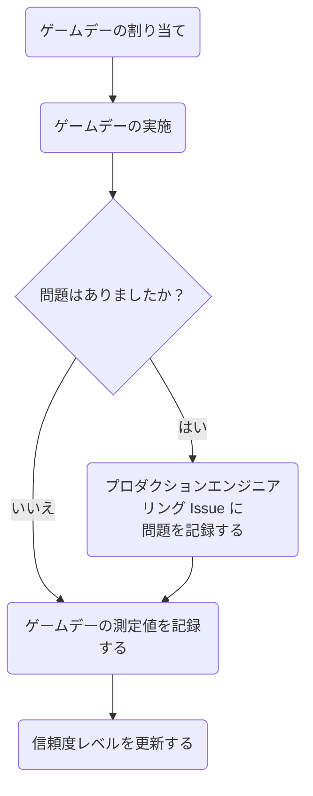

## 目的

GitLab.com の障害回復プロセスをテストし練習する理由はたくさんあります。

1. プロセスが期待通りに機能することを確認する。
1. 回復プロセスを壊したり複雑にしたりする可能性のある変更に追いつく。
1. オンコールローテーションに参加するメンバーのプロセスに対する信頼と知識を高める。
1. 障害回復シナリオの検証に関するコンプライアンス要件を満たす。

## 概要

これらのプラクティスは `DR ゲームデー` または単に `ゲームデー` と呼ばれることがよくあります。
現在、DR ゲームデーはゾーナル回復シナリオに焦点を当てており、それぞれが特定のコンポーネントに焦点を当てています。
実際のゾーナル障害が発生した場合、これらのゲームデーは時間を節約するために並行して実行できるように設計されています。

### ゲームデーの割り当て

毎四半期、各 `Phase 1` コンポーネントのゲームデープロセスが参加チームに割り当てられます。
この割り当てにより、各プロセスを四半期に 1 回テストできます。

1. Ops チームが [Production Engineering](https://gitlab.com/gitlab-com/gl-infra/production-engineering) Issue トラッカーに Issue を作成します。
1. この Issue は、プラクティスを実施する次のチームに割り当てられます。

### ゲームデーの実施

1. 適切なテンプレートを使用してゲームデー変更 Issue を作成します。
1. プロセスを確認し、プロセスのいずれかの部分が不明な場合は Ops チームに相談します。
1. ゲームデーのスケジュールを設定し、変更の適切なレビューと承認を求めます。
1. ゲームデーを実行します。
プロセス中に問題の記録、タイミングの測定、マージリクエストの承認を行うために、レビュアーと一緒に作業することを推奨します。

### ゲームデープロセスの問題の報告

ゲームデーからのフィードバックをまとめ、プロダクションエンジニアリング Issue を更新します。
Issue を作成した Ops チームメンバーが、フィードバックを将来のプラクティスに反映させる責任を持つ DRI となります。

### ゲームデー結果の記録

ゲームデーからのタイミングと実行情報を更新するマージリクエストを開きます。

[DR プラクティス測定値](https://gitlab.com/gitlab-com/runbooks/-/blob/master/docs/disaster-recovery/recovery-measurements.md)

### 信頼度レベルの更新

サービスが変化し、プロセスが改善されるにつれて、Ops チームは信頼度レベルの測定値を管理する責任があります。
