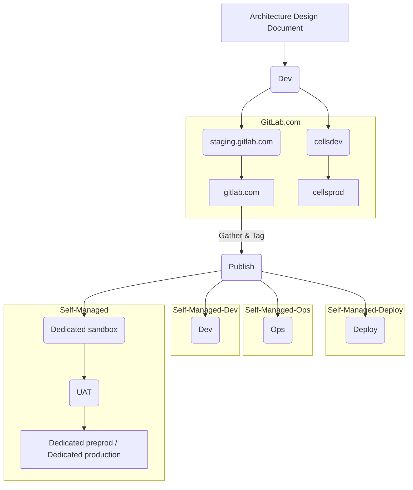
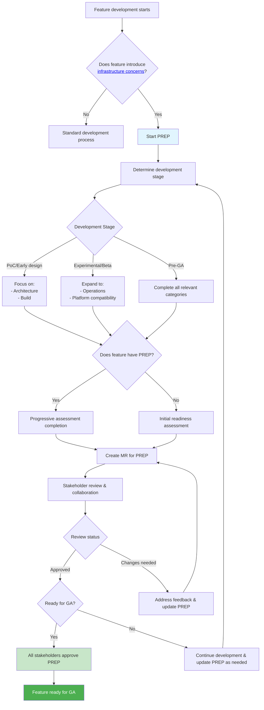

GitLab の**プラットフォームレディネス有効化プロセス（PREP）**は、GitLab.com、Dedicated、セルフマネージドプラットフォーム全体での本番環境レディネスについて GitLab 機能を体系的に評価することを包括しています。GitLab のレディネス評価機能がさらなるドメインをカバーするよう拡張されるにつれて、このフレームワークはすべての製品チームに統一された評価体験を提供するよう進化し、GitLab エコシステム全体での包括的な機能とコンポーネントのレディネスを確保しながら、プロセスの断片化を防ぐようになります。

この評価は、製品チームがレディネス評価をセルフサービスで実施できるよう支援し、レビューチームが機能が本番デプロイの準備ができていることを確認するのを助けます。

**PREP** は、GitLab の機能またはコンポーネントのドメインに関わらず、あらゆる機能またはコンポーネントに適用されるインフラの懸念事項を取り扱います。製品とインフラチームの間のコミュニケーションブリッジとして機能し、最終的にすべての GitLab プラットフォーム全体での本番デプロイに向けて機能の準備を確保します。

## ビジョン声明

本番環境への統一された整備された道筋: 開発チームが要件を所有し、開発者がプロアクティブな AI 情報のコンテキストとシームレスなシステム統合を通じてより高品質な機能を出荷できるよう支援します。

## PREP を推奨する理由

SaaS プロバイダー（GitLab.com）とソフトウェアベンダー（GitLab セルフマネージドおよび GitLab Dedicated）の両方としての GitLab の独自の立場が、既存のプロセスでは対処されていない重大なレディネスのギャップを生み出しています。GitLab は機能が GitLab セルフマネージドと GitLab Dedicated プラットフォーム全体での検証なしに一般公開（GA）に達し、顧客のデプロイ問題とサポート負担の増加を引き起こすプラットフォーム互換性の失敗を経験しました。

本番環境レディネスレビューは GitLab.com の運用レディネスのみをカバーしており、GitLab セルフマネージドと GitLab Dedicated プラットフォームの要件、または異なる顧客環境における証拠に基づく検証のための体系的な評価がありません。このギャップは、リリース後にクロスプラットフォームの互換性の問題が発見され、相当なエンジニアリング作業と GA プロモーションの遅延を必要とする反応的な問題発見につながりました。

PREP は、製品チームが GitLab プラットフォームエコシステム全体での機能のレディネスを体系的に評価するためのセルフサービス、証拠に基づくフレームワークを提供することで、この重大なギャップを埋め、すべての顧客に対して一貫した品質を確保します。

{}
完了・承認済みの PREP は、あらゆる新機能または変更セットがすべてのデプロイプラットフォームで GA ステータスに到達するための最速かつ最もシンプルな方法として**強く推奨**されます。
{}

### GitLab デプロイメント

以下の図は GitLab 機能がさまざまなデプロイターゲットを通じてどのように流れるかを示しています。PREP は各ステップでこのプロセスを促進します。

## PREP に参加する最適なタイミングは?

_インフラまたはコアコンポーネント_に変更を導入または重大な変更を加える機能については、できるだけ早く PREP に参加することを強く推奨します。これを判断するのに役立つ例をいくつか示します:

- 新しいサービスまたはコンポーネントを導入することを提案していますか? コアコンポーネントを再アーキテクチャしていますか?

  独立してパッケージ化、配布、運用する必要がある完全に新しいサービスを追加する場合、PREP への参加を推奨します。既存のコアコンポーネントがどのように機能するかを根本的に変更したり、コアコンポーネントの新しい依存関係を追加する場合、PREP への参加を推奨します。既存のサービス内で機能を追加する場合は、必要ない可能性が高いです。

- 機能に新しいインフラの依存関係が必要ですか?

  機能が新しいデータベース、外部サービス、ストレージバックエンド、またはネットワークコンポーネント（高可用性データベースの要求など）を必要とする場合、PREP を推奨します。既存のフレームワーク内での API 追加は追加評価を必要としない可能性があります。

- 機能に重大な運用リソース要件がありますか?

  機能またはコンポーネントが、さまざまな環境でのデプロイサイジング、スケーリング、またはリソース割り当てに影響する可能性のある新しいコンピューティング、ストレージ、またはメモリ要件を導入する場合、PREP が強く推奨されます。既存のサービスへの軽量な追加はこの推奨の対象外です。

- 機能に新しいインストール、設定、またはデプロイ手順が必要ですか?

  顧客が機能を使用するために追加のセットアップを実施したり、新しいコンポーネントを設定したり、デプロイ手順を変更する必要がある場合、PREP に参加する必要があります。

- 機能は GitLab.com、GitLab Dedicated、GitLab セルフマネージドで異なる動作をしますか?

  機能がデプロイ方法によって異なるプラットフォーム固有の考慮事項、互換性要件、またはパフォーマンス特性を持つ場合、PREP を推奨します。

- 機能は新しいインフラの懸念事項を導入しますか?

  機能がコア機能を超えてセキュリティモデル、モニタリング要件、バックアップ手順、アップグレードプロセス、またはその他の運用側面に影響する場合、PREP を推奨します。

これらの質問のいずれかに「はい」と答えた場合、機能は PREP 中にレビューされる新しいインフラの懸念事項またはその他のプラットフォームの依存関係を導入する可能性があります。

## 本番環境レディネスレビューとの関係

プラットフォームレディネス有効化プロセスは、既存の[本番環境レディネスレビュー](/handbook/engineering/infrastructure-platforms/production/readiness)と運用レディネスレビュープロセスを**統合**し、すべての GitLab デプロイメントのパスウェイとメソッド全体で機能が正しく動作することを確保することに焦点を当てています。

## 主要原則

PREP は他のレディネスプロセスと区別するいくつかの核心原則の上に構築されています:

- **セルフサービス**: 明確なガイダンスとステークホルダーの連絡先情報を備えた製品チームによる独立した完了のために設計されています
- **プログレッシブ**: 回答は開発ライフサイクルを通じて機能の成熟度とともに進化します - すべての質問に同時に回答する必要はありません
- **証拠に基づく**: すべての回答は具体的なドキュメント、実装の詳細、またはトラッキング Issue によって裏付けられる必要があります
- **コラボレーティブ**: 主要なゲートでの検証とともに、製品チームとレビューチームの間の継続的なコラボレーションを促進します

## 評価スコープ

PREP は 11 のインフラの懸念事項カテゴリをカバーし、それぞれに特定のアンケートとレビューするステークホルダーがいます:

- **ビルドとデプロイメント**: アーティファクト生成、パッケージング、デプロイ戦略
- **ドキュメントとサポート**: ユーザードキュメント、サポート資料
- **インストールと設定**: インストール方法、設定オプション
- **オブザーバビリティ**: モニタリング、ロギング、アラート
- **運用**: メンテナンス、アップグレード、ライフサイクル管理
- **パフォーマンスとスケーラビリティ**: パフォーマンス要件、スケーリング動作
- **プラットフォーム戦略**: プラットフォーム互換性、戦略的整合
- **品質保証**: テスト戦略、品質ゲート
- **セキュリティとコンプライアンス**: セキュリティ要件、コンプライアンスニーズ
- **サービスアーキテクチャ**: サービス設計、アーキテクチャパターン

カテゴリと各レビューするステークホルダーの完全なリストについては、
[評価構造ドキュメント](https://gitlab.com/gitlab-org/architecture/readiness#assessment-structure)を参照してください。

## ロールと責任

製品チームとレビューチームは異なるロールと責任を持っています。

### 製品チーム

- 証拠に基づく回答と具体的なドキュメントで **PREP 評価を完了**します
- コンテナ、Helm チャート、デプロイアーティファクト、設定を**ビルドして維持**します
- 実装の詳細、アーキテクチャの決定、運用手順を含む**包括的なドキュメントを提供**します
- **レビューのフィードバックに迅速に対応**し、ステークホルダーの意見に基づいて評価をイテレーションします
- 開発プロセスの早い段階で**ステークホルダーと連携**し、現実的なタイムライン期待を伝えます

### レビューチーム（インフラ/プラットフォーム）

- アンケートの要件と評価の期待を明確にする**ガイダンスを提供**します
- 完全性、技術的正確性、プラットフォーム標準との整合のために**評価をレビュー**します
- 実装の質問やアーキテクチャガイダンスについて**ベストエフォートのサポートを提供**します
- 開発ステージゲートで**レディネスを検証**し、タイムリーなフィードバックを提供します
- GA プロモーション前に**最終評価を承認**し、すべての要件が満たされていることを確認します

{}
製品チームは、コンテナのビルド、Helm チャートの作成、デプロイ設定の作成、運用ドキュメントの維持を含む実際の実装作業に責任があります。レビューチームはガイダンス、検証、承認を提供しますが、製品チームのためにこれらのアーティファクトをビルドしません。
{}

## プロセス概要

以下の図は PREP フローを示しています:

## 主要なアドバイス

- 機能開発ライフサイクルの**早い段階から始める** - PREP の承認はすべての GitLab プラットフォーム全体でのロールアウトの準備が整う可能性を高めるために強く推奨されます。
- **[レディネスプロジェクト README](https://gitlab.com/gitlab-org/architecture/readiness/-/blob/main/README.md) を読む**、包括的なガイダンスのために
- **ステークホルダーと早期に連携**し、タイムラインについて透明性を持ってコミュニケーションします
- 具体的なドキュメントとリンクで**証拠に基づく回答に焦点を当てる**
- GA プロモーションを試みる前に PREP が完了・承認されるよう**GA ゲートを計画する**
- **覚えておいてください** - これはすべての GitLab プラットフォームで機能が成功するよう設計されたコラボレーティブなプロセスです
- **PREP は生きたプロセス**であり、あなたの意見とフィードバックを通じて改善されます。

## 評価の実施

PREP を実施するには、以下の 3 つのステップに従います。

### ステップ 1: リポジトリへのアクセス

PREP は [gitlab-org/architecture/readiness](https://gitlab.com/gitlab-org/architecture/readiness)
リポジトリを通じて管理されます。

**包括的なガイドを読む**: 評価を開始する前に、以下を含む[完全な README](https://gitlab.com/gitlab-org/architecture/readiness/-/blob/main/README.md) を確認してください:

- 詳細なステップバイステップの使用方法
- 開発ステージに合わせたプログレッシブ完了ガイダンス
- 品質標準とベストプラクティス
- レビュープロセスとステークホルダーエンゲージメント
- エスカレーション手順

### ステップ 2: 開始点の決定

アプローチは機能の現在の[開発ステージ](https://docs.gitlab.com/policy/development_stages_support/)によって異なります:

- **PoC/早期設計**: 基盤となるアーキテクチャとセキュリティの考慮事項に焦点を当てます
- **実験的/ベータ**: 運用とプラットフォーム互換性の懸念事項に拡張します
- **GA 前**: 包括的な証拠を伴うすべての関連カテゴリを完了します

### ステップ 3: 評価の作成

以下のリポジトリ `README` にある[ステップバイステップの使用方法](https://gitlab.com/gitlab-org/architecture/readiness#step-by-step-usage-instructions)に従います:

1. リポジトリをクローンして機能ブランチを作成します
1. 機能のディレクトリ構造を設定します
1. 関連するアンケートテンプレートをコピーします
1. 開発ステージに基づいてプログレッシブ完了を開始します
1. コラボレーティブなレビューのためのマージリクエストを作成します

## レビューと承認プロセス

PREP レビュープロセスには複数のステークホルダーが関与し、構造化されたアプローチに従います:

- 証拠に基づく回答を持つ製品チームによる**セルフサービス完了**
- 開発ステージゲートでのインフラチームによる**プログレッシブ検証**
- マージリクエストの議論を通じた**コラボレーティブなイテレーション**
- **GA プロモーション前に必要な最終承認** - すべての関連ステークホルダーが完了した評価を明示的に承認する必要があります

機能が一般公開に昇格される前に、PREP は以下を満たす必要があります:

- 機能のスコープに基づくすべての関連カテゴリで完了している
- 包括的な証拠ドキュメントによって裏付けられている
- すべての必要なステークホルダーチームによってレビュー・明示的に承認されている
- 未解決のブロッキング Issue やギャップがない

レビュープロセス、ステークホルダーエンゲージメント、エスカレーション手順の詳細情報については、リポジトリドキュメントの[レビュープロセスセクション](https://gitlab.com/gitlab-org/architecture/readiness#review-process-and-responsibilities)を参照してください。

## ヘルプとサポートの取得

詳細については、[内部ハンドブックページ](https://internal.gitlab.com/handbook/product/platforms/feature-readiness-assessment/)を参照してください。
