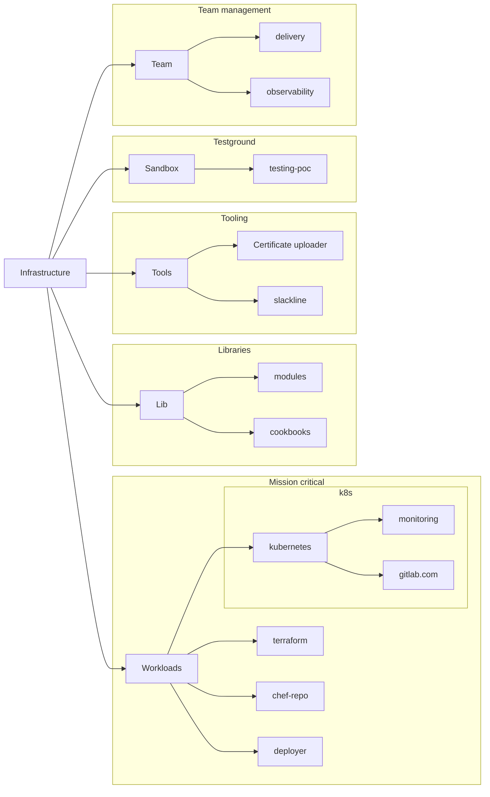

インフラ部門は GitLab プロジェクトを使用して、GitLab.com および GitLab Inc. のサポートサービスを運用しています。これは[GitLab エンジニアリングプロジェクト](/handbook/engineering/projects/)に加えてのものです。

このページは `project` の明確な定義を提供することを目的としています:

1. 種類
1. データ分類
1. 正規およびミラーの場所
1. オーナーシップとアクセス

## 種類

| 種類        | 説明                                                                                                                                                              |
|-------------|------------------------------------------------------------------------------------------------------------------------------------------------------------------|
| ワークロード | 複数のチーム/部門にまたがるプロジェクト。機密性の高い情報を含む場合が多く、またはランタイムにミッションクリティカルです。顧客に影響する頻度が高いです。 |
| ライブラリ     | ワークロードをサポートするプロジェクト。一般的に機密情報を含みませんが、機密情報を処理できます。  |
| ツール     | ライブラリとアプリケーション管理、一般的な日常的なプロジェクトメンテナンスの自動化をサポートするプロジェクト。  |
| チーム        | チームのワークフロー、チームの自動化、プロセスをサポートするプロジェクト。 |
| 進行中の作業 | サンドボックス、概念実証、または一度限りの自動化に使用されるプロジェクト。異なるタイプのプロジェクトに卒業するまで本番ワークロードを処理できません。|

## データ分類

| 名前       | 説明  |
|------------|--------------|
| 制限付き  | プロジェクトには、役割の一部としてアクセスを持たない個人へのアクセスを公開できるコード/データが含まれます。アクセスは悪意のあるユーザーが会社の評判を傷つけるのを助けたり、不適切に使用された場合にミッションクリティカルなシステムに損害を与える可能性があります。 |
| プライベート | プロジェクトには GitLab チームメンバーが閲覧でき、場合によってはより広いコミュニティに公開できるコードが含まれます。ランタイムに機密データにアクセスまたは処理できます。 |
| パブリック     | 機密データを含まず、ランタイムに機密データを直接処理しないコードを含むプロジェクト |

## 正規の場所

インフラ部門のワークフローは、製品をドッグフーディングするためだけでなく、一般的なワークフローをサポートするためにも使用される多数の GitLab インスタンスを通じて分割されています。一般的に、インフラ部門が日常的なワークフローをサポートするために使用する 2 つのインスタンスがあります:

1. GitLab.com
1. ops.gitlab.net

インフラ部門は作業の整理と計画に GitLab.com を使用しています。

GitLab.com を運用するために ops.gitlab.net を使用しています。必要なすべての依存関係をミラーリングするためだけでなく、ミッションクリティカルなプロジェクトを実行するためにも ops.gitlab.net を使用しています。

正規の場所は以下の基準に基づいて選択されます:

| 場所   | 説明  |
|----------------|-----------|
| GitLab.com     | 同期ツールがプロジェクトを 2 番目の場所にミラーリングします。同期の遅延はある程度許容でき、定期的な作業を妨げません（チームメンバーにとって多少の不便は生じるとしても）。この場所のプロジェクトは（部門）外部の貢献を受け取ることができます。 |
| ops.gitlab.net | これらのプロジェクトの同期遅延と可用性のなさは一般的に許容できず、GitLab.com の劣化を引き起こす可能性があります。（部門）外部の貢献はまれです。|

## オーナーシップとアクセス

プロジェクトのオーナーシップとアクセスは、データ分類とプロジェクトの目的、および正規のソースと密接に関連しています。

プロジェクトのオーナーシップは、可能な場合、他の人のコラボレーションを排除するべきではありません。代わりに、プロジェクトのワークフローを尊重しながら、できる限り広いアクセスを提供する必要があります。

以下の表は説明的な例を示しています。

| 正規の場所 | 種類     | データ分類 | アクセス     |
|--------------------|----------|---------------------|------------|
| ops.gitlab.net     | ワークロード | 制限付き          | 部門 |
| GitLab.com         | ワークロード | プライベート             | 会社    |
| GitLab.com         | ワークロード | パブリック              | コミュニティ  |
| ops.gitlab.net     | ライブラリ  | 制限付き          | 部門 |
| GitLab.com         | ライブラリ  | パブリック              | コミュニティ  |
| GitLab.com         | ツール  | パブリック              | コミュニティ  |

例えば、ops.gitlab.net のワークロードとして分類された制限付きプロジェクトは、日常業務のためにアクセスを必要とする部門全員にアクセスが付与されます。ただし、この同じプロジェクトが GitLab.com に安全にミラーリングできる機密コードを含まない場合、ミラーされた場所でより広いコミュニティに完全にアクセス可能にできます。

この説明に当てはまるプロジェクトの具体的な例は `deployer` プロジェクトです。ランタイムには、このプロジェクトのパイプラインが本番システムに接続するため、このプロジェクトには機密情報が含まれます。これが、プロジェクトが ops.gitlab.net にあり、インフラ部門のみがアクセスできる理由です。しかし GitLab.com のミラーは、このプロジェクトのスクリプトが機密情報を含まないため、誰でも完全にパブリックにアクセスできます。

[透明性の価値を尊重](/handbook/values/#transparency)しながらも、[価値の階層](/handbook/values/#hierarchy)を尊重して、プロジェクトをケースバイケースでレビューします。

## ワークフロー

GitLab プロジェクトには、作業をより簡単に達成できるさまざまな機能があります。本質的に、私たちのワークフローは通常以下で構成されています:

1. プロジェクト管理 - Issue、エピック、Issue ボード
1. コードコラボレーション - ピアレビューを伴うマージリクエスト
1. テストとデプロイメント - CI および CD パイプライン

GitLab は、さまざまなレベルの複雑さで、プロジェクトが 1 つの場所にある場合と同様の方法でワークフローに対処するために、これらのワークフローを異なる場所に分離することができます。ランタイムに機密情報を処理するがコードはパブリックにアクセス可能なプロジェクトの例として、ワークフローをサポートするために活用できる GitLab 機能を以下の表に示します:

|  リソース          |    正規                   |      ミラー             |
|--------------------|------------------------|-------------------------|
| インスタンス           | ops.gitlab.net         | gitlab.com              |
| 可視性オプション | プライベート/内部       | プライベート/内部/パブリック |
| Issue             | 無効                | 有効                 |
| MR                | 有効                | 無効                |
| パイプライン          | 有効                | 無効                |
| パッケージ           | 有効                | 無効                |
| アクセス             | 最小権限アクセス | 会社/パブリック          |

これは、ops.gitlab.net に正規リポジトリを持ち、ランタイムに最小権限アクセスを持つプロジェクトが、gitlab.com でパブリックにできることを意味します。ソースコードは gitlab.com にミラーリングでき、そこで Issue を提起して議論できます。CI を必要とし、デプロイを行う MR を通じた開発は ops.gitlab.net のみで有効にします。
この例では、ワークフローをサポートするコードを共有しながら、透明性を確保しつつも、効率的かつ安全に結果を提供できることを示しています。

## 正規の場所でのプロジェクト整理

### ops.gitlab.net

以下の図は、インフラ部門のプロジェクトが運用インスタンスでどのように整理されているかを示しています。

トップレベルグループは `Infrastructure` という名前で、インフラ部門が日常業務に使用するすべてのプロジェクトを含んでいます。そのグループの名前が `gl-infra` でない理由は、その名前の既存グループがすでに存在しており、名前と場所から GitLab に関連することが明らかだからです。
このグループへのアクセスはグループオーナーとインスタンス管理者にのみ付与されます。サブグループとそのサブグループ内のプロジェクトへのアクセスは、特定のチームグループに付与されます。個人ユーザーアカウントはチームグループ外のプロジェクト/サブグループに追加されません。

### GitLab.com

GitLab.com に現在あるプロジェクトは複数のグループ/サブグループと個別プロジェクトに分散しています。このページが導入された時点では、ops.gitlab.net の整理に焦点を当てており、その後 GitLab.com のプロジェクト再整理が続く予定でした。

## 適切なプロジェクトワークフローの選択

プロジェクトに適したワークフローを決定するには多くの変数があります。最も簡単なアプローチはすべてのプロジェクトに単一のワークフローを持つことですが、このアプローチは[透明性の価値](/handbook/values/#transparency)に反します。過去にはすべてをパブリックにするアプローチを取ったこともありますが、それは GitLab.com プラットフォームに影響するインシデント中に[迅速に結果を提供する](/handbook/values/#hierarchy)ことを妨げ、過度なパブリック情報が不必要なセキュリティリスクをもたらすため困難でした。

このセクションでは、一般的なワークフローの例とプロジェクトを分類する決定へのアプローチを提供します。

### 機密情報を持つミッションクリティカルプロジェクト

このタイプのプロジェクトの例は [Terraform 環境](https://ops.gitlab.net/gitlab-com/gl-infra/config-mgmt)です。このプロジェクトにはインスタンスタイプ、サービスアカウント名など、インフラの詳細がすべて含まれています。これらの詳細はそれ自体では問題ではなく、必ずしもプライベートである必要はありませんが、悪意のある攻撃者が攻撃ベクターを作成するのを無限に容易にします。さらに、偶発的な変更はプラットフォームに即座に影響を与える可能性があります。

これらのタイプのプロジェクトは以下の表に基づいて設定する必要があります:

| リソース   | 正規                  | ミラー     |
|------------|------------------------|------------|
| インスタンス   | ops.gitlab.net         | gitlab.com |
| 可視性 | 内部               | プライベート    |
| Issue     | 無効               | 有効    |
| MR        | 有効               | 無効   |
| パイプライン  | 有効               | 無効   |
| パッケージ   | 有効               | 無効   |
| アクセス     | 最小権限アクセス | 会社    |
| 場所   | infrastructure/workloads | TBD |

このタイプの整理により、会社全体がソースコードにアクセスして Issue でフィードバックを提供できます。MR へのリンクは、正規リポジトリで行われている作業の DRI が手動で追加する必要があります。ランタイムには、このタイプのプロジェクトは日常業務のためにアクセスを必要とする人々にのみアクセス可能です。

**重要** プロジェクトがこのように分類されている場合、プロジェクトの README ファイルには「なぜこのプロジェクトへのアクセスが制限されているのか?」という質問に答えるセクションが必要です。いつでも、この分類に合うプロジェクトはほんの数個であるべきです。

### ランタイムに機密性を持つミッションクリティカルプロジェクト

このタイプのプロジェクトの例は [Kubernetes gitlab.com プロジェクト](https://ops.gitlab.net/gitlab-com/gl-infra/k8s-workloads/gitlab-com)です。このプロジェクトには機密と見なせる情報が含まれているコードが含まれていますが、情報の大部分はパブリックにできます。ただし、ランタイムにこのプロジェクトは本番の機密ワークフローに接続し、管理者レベルのトークンと対話する可能性があります。MR は技術的には GitLab.com で作業できますが、パイプラインは別のインスタンスで実行されるため、ミスがプラットフォームのダウンタイムを引き起こす可能性があります。この理由から、プロジェクトは以下のように設定する必要があります:

| リソース   | 正規                  | ミラー     |
|------------|------------------------|------------|
| インスタンス   | ops.gitlab.net         | gitlab.com |
| 可視性 | 内部               | パブリック     |
| Issue     | 無効               | 有効    |
| MR        | 有効               | 無効   |
| パイプライン  | 有効               | 無効   |
| パッケージ   | 有効               | 無効   |
| アクセス     | 最小権限アクセス | 会社    |
| 場所   | infrastructure/workloads | TBD      |

### ミッションクリティカルなワークロードをサポートするプロジェクト

このタイプのプロジェクトの例は [omnibus-gitlab クックブック](https://gitlab.com/gitlab-org/cookbook-omnibus-gitlab/)です。このプロジェクトはインフラ全体に omnibus-gitlab パッケージをインストールするため、ミッションクリティカルなワークフローをサポートしています。ランタイムには、このプロジェクトが機密情報と連携する可能性が高いです。
ただし、このプロジェクトの機密性は、使用できないことが運用緊急時に不便を引き起こすことにあるだけで、プロジェクトのミラーを常に利用可能にすることで解決できます。より広いコミュニティがこのプロジェクトから恩恵を受け、自分たちのインストールにコードを活用できるため修正を貢献する可能性があります。プロジェクトは以下のように設定できます:

| リソース   | 正規  | ミラー         |
|------------|------------|----------------|
| インスタンス   | gitlab.com | ops.gitlab.net |
| 可視性 | パブリック     | 内部       |
| Issue     | 有効    | 無効       |
| MR        | 有効    | 無効       |
| パイプライン  | 有効    | 無効       |
| パッケージ   | 有効    | 無効       |
| アクセス     | パブリック     | 会社        |
| 場所   | TBD        | infrastructure/lib |

この分類基準を満たすプロジェクトは、パブリックな Terraform モジュール、Ansible スクリプトなどである可能性が高いです。

### メンテナンスツールと自動化プロジェクト

このタイプのプロジェクトの例は[証明書管理](https://gitlab.com/gitlab-com/gl-infra/certificates-updater)スクリプトセットです。このタイプのプロジェクトは日常機能を自動化し、動作するために機密リソースを必要とする可能性があります。ただし、プロジェクト自体の機密性はそれだけであり、作業を慎重に考慮することで問題を回避できます。より広いコミュニティはプロジェクトを見ることから直接の恩恵を受けないかもしれませんが、プロジェクトをプライベートにしておくメリットもありません。これらのタイプのプロジェクトは以下のように設定できます:

| リソース   | 正規  | ミラー         |
|------------|------------|----------------|
| インスタンス   | gitlab.com | ops.gitlab.net |
| 可視性 | パブリック     | 内部       |
| Issue     | 有効    | 無効       |
| MR        | 有効    | 無効       |
| パイプライン  | 有効    | 無効       |
| パッケージ   | 有効    | 無効       |
| アクセス     | パブリック     | 会社        |
| 場所   | TBD        | infrastructure/tools |

### 進行中の作業プロジェクト

サンドボックスグループにあるプロジェクトは、上記で参照した他のワークフローのいずれかに卒業する可能性があるプロジェクトです。概念実証、一度限りのマイグレーションのクイックスクリプト、または一度限りのメンテナンスをサポートするスクリプトはすべてこのグループに属します。

プロジェクトが定期的に再利用される場合は、使用される**前に**他のグループのいずれかに移行する必要があります。これはまた、プロジェクトが部門全体によって維持されることを示します。移行後は、これらのプロジェクトはそのグループの分類に従って扱われます。それまでは、これらのプロジェクトは GitLab.com を正規の場所として置く必要があります。

### チームプロジェクト

チームグループのプロジェクトは特定のチームワークフローをサポートするプロジェクトです。ステータス収集、プロジェクトトリアージ、および同様のチーム向けプロジェクトはここに追加する必要があります。これらのプロジェクトにはチームの機密情報が含まれる可能性があるため、正規の場所は ops.gitlab.net にできます。この判断はチームの裁量に委ねられています。
