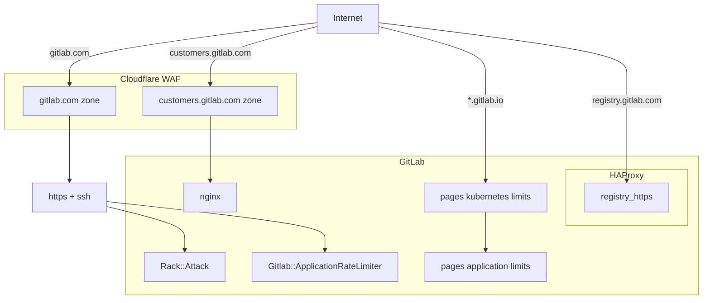
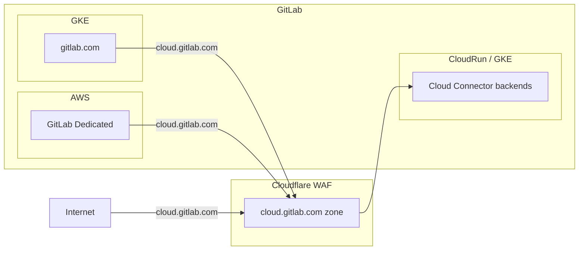

## 概要

レート制限は、設定された時間枠内にユーザーまたは IP アドレスが行えるリクエスト数を制限することで、セキュリティとパフォーマンスを向上させる GitLab の重要な機能です。GitLab のレート制限アプローチは乱用を防ぎ、公平なリソース割り当てを確保し、システムの安定性を維持し、潜在的な攻撃から効果的に保護し、信頼性の高いユーザー体験を保証します。

レート制限されたリクエストは `429 - Too Many Requests` レスポンスを返します。

## プロセス

- レート制限の変更には[変更リクエスト](../change-management/#change-request-workflows)が必要です。
- ユーザーのレート制限設定について[この Issue テンプレート](https://gitlab.com/gitlab-com/gl-infra/production-engineering/-/issues/new?issuable_template=request-rate-limiting)を使用して支援を要請してください。
- バイパスを求める内部チームは[レート制限バイパスポリシー](/handbook/engineering/infrastructure-platforms/rate-limiting/bypass-policy/)を参照してください。

## GitLab レート制限アーキテクチャ

### GitLab.com

### Cloud Connector

GitLab.com では複数のレイヤーにレート制限が存在し、上記のボックスで囲まれた各領域がレート制限が実装されている場所を表しています。

### 制限

重複を最小限に抑えるため、現在有効なレート制限を確認するには以下のソースを参照してください:

<table>
<tr>
<th>
Cloudflare
</th>
<td>

- GitLab.com:
  - [Cloudflare ダッシュボード](https://dash.cloudflare.com/852e9d53d0f8adbd9205389356f2303d/gitlab.com/security/waf/rate-limiting-rules)
  - [ベース Cloudflare ルール Terraform](https://gitlab.com/gitlab-com/gl-infra/terraform-modules/cloudflare/cloudflare-waf-rules)（Dedicated と共有）。
  - [GitLab.com Cloudflare ルール Terraform](https://ops.gitlab.net/gitlab-com/gl-infra/config-mgmt/-/blob/main/environments/gprd/cloudflare-custom-rules.tf)
- Cloud Connector:
  - [Cloudflare ダッシュボード](https://dash.cloudflare.com/852e9d53d0f8adbd9205389356f2303d/cloud.gitlab.com/security/waf/rate-limiting-rules)
  - [ランブック + TF リンク](https://gitlab.com/gitlab-com/runbooks/-/blob/master/docs/cloud_connector/README.md#rate-limiting)

</td>
</tr>

<tr>
<th>
アプリケーション
</th>
<td>

- [アプリケーション設定](https://gitlab.com/admin/application_settings/network)（管理者アクセスのみ）
  - `User and IP Rate Limits` と `Protected Paths` を参照
- [GitLab.com ドキュメント](https://docs.gitlab.com/user/gitlab_com/#rate-limits-on-gitlabcom)（手動で公開）

</td>
</tr>

</table>

### バイパス

[公開されているレート制限](https://docs.gitlab.com/user/gitlab_com/#rate-limits-on-gitlabcom)はすべての顧客とユーザーに例外なく適用されます。

バイパスを求める顧客または内部チームは[レート制限バイパスポリシー](/handbook/engineering/infrastructure-platforms/rate-limiting/bypass-policy/)を参照してください。

## トラフィック管理レート制限

### Cloudflare

Cloudflare は、受信トラフィックのネットワークエッジに位置する「最外層」の保護として機能します。私たちは Cloudflare の標準的な DDoS（分散型サービス拒否）保護と、SSH 経由の git を保護するための [Spectrum](https://www.cloudflare.com/en-us/application-services/products/cloudflare-spectrum/) を使用しています。

Cloudflare でのレート制限の適用方法:

<table>
<tr>
<th>
Gitlab.com ページルール
</th>
<td>

- [config-mgmt](https://ops.gitlab.net/gitlab-com/gl-infra/config-mgmt/-/blob/main/environments/gprd/cloudflare-pagerules.tf) の Terraform で設定されています。
- URL パターンマッチング。
- Cloudflare の DDoS 介入とキャッシング（バイパス、セキュリティレベルなど）を制御します。
- デフォルトではレート制限は設定されていませんが、攻撃を受けている時に有効にできます

</td>
</tr>
<tr>

<th>
Gitlab.com レート制限
</th>
<td>

- Dedicated と共有された[ベース制限](https://gitlab.com/gitlab-com/gl-infra/terraform-modules/cloudflare/cloudflare-waf-rules/-/blob/main/cloudflare-rate-limits.tf)と [GitLab.com 固有のもの](https://ops.gitlab.net/gitlab-com/gl-infra/config-mgmt/-/blob/main/environments/gprd/cloudflare-custom-rules.tf)を持つ `config-mgmt` の Terraform で設定されています。
- 幅広いケースをカバーします:
  - `IP` ごとのグローバル制限
  - IP スコープの誤検知を避けるためのレートカウンターとして、`session`（クッキー）または `tokens`（ヘッダー）ごとのグローバル制限（例: 1 つの IP の背後にいる多数のユーザー、VPN）
- エンドポイント固有の制限。
- アプリケーションレート制限とは独立しています。

</td>
</tr>

<th>
Cloud Connector レート制限
</th>
<td>

- Terraform で設定されています（[ランブックリンク](https://gitlab.com/gitlab-com/runbooks/-/blob/master/docs/cloud_connector/README.md#cloudflare)を参照）。
- IDE などのエンドユーザークライアントと、GitLab Rails インスタンス（GL.com、SM、Dedicated）の両方からのリクエストをスロットリングします。
- リクエストがどこから発生したかに関わらず、任意の GitLab ユーザーの匿名グローバルユーザー ID に対してカウントされます。
- 主に AI ベンダー制限など水平スケールできないリソースの消費をスロットリングするために使用されます。
- Cloud Connector バックエンドごとに個別に設定できます。

</td>
</tr>

</table>

**注:** Cloudflare はアプリケーションを認識しておらず、ユーザーとグループへのマッピング方法を知りません。

Cloudflare はまた、以下からの一部のリクエストに `X-GitLab-Rate-Limit-Bypass` ヘッダーを適用する責任があります:

- レガシーの顧客 IP レート制限バイパス
- 統合を持つサードパーティベンダー
- 内部インフラ

ヘッダーが適用される条件の完全なリストについては、[この設定](https://ops.gitlab.net/gitlab-com/gl-infra/config-mgmt/-/blob/main/environments/gprd/cloudflare-transform-rules.tf)を参照してください。

[Cloudflare ランブック](https://gitlab.com/gitlab-com/runbooks/-/blob/master/docs/cloudflare/)には、このインフラレイヤーの設定に関する詳細が含まれています。

Cloudflare レート制限の変更には[変更リクエスト](../change-management/#change-request-workflows)が必要であり、実装前に[プロダクションエンジニアリング::ネットワーキング & インシデント管理](https://gitlab.com/gitlab-com/gl-infra/production-engineering/-/issues/new?issuable_template=request-rate-limiting) SRE チームと議論する必要があります。

### HAProxy

GitLab のトラフィック管理レート制限の大部分は HAProxy から Cloudflare に移行されています（詳細については[機密 Issue](https://gitlab.com/gitlab-com/gl-infra/production-engineering/-/issues/24699) を参照してください）。

ただし、HAProxy はそのコンポーネントが Cloudflare でフロントされていないため、レジストリのレート制限を引き続き担当しています。詳細については [レジストリ](#registry)を参照してください。

現在 HAProxy は、限られた数の特殊なパスに `X-GitLab-Rate-Limit-Bypass` を適用することも担当しています。リストは[ここ](https://gitlab.com/gitlab-cookbooks/gitlab-haproxy/-/blob/master/templates/default/frontends/https.erb?ref_type=heads#L40-43)にあります。このロジックを Cloudflare に移行する[作業が進行中](https://gitlab.com/gitlab-com/gl-infra/production-engineering/-/issues/26205)です。

## アプリケーションレート制限

アプリケーションがユーザー情報へのアクセスを持つため、Cloudflare で実装されたものと比較してより情報に基づいたトラフィック管理を可能にする複数のアプリケーションレート制限メカニズムが実装されています:

- [Rack Attack](https://gitlab.com/gitlab-org/gitlab/blob/master/lib/gitlab/rack_attack.rb)
- [Application Rate Limiter](https://gitlab.com/gitlab-org/gitlab/-/blob/master/lib/gitlab/application_rate_limiter.rb)
- [Plan Limits](https://gitlab.com/gitlab-org/gitlab/-/blob/master/app/helpers/plan_limits_helper.rb)

アプリケーション制限を GitLab に貢献するには[アプリケーション制限開発](https://docs.gitlab.com/ee/development/application_limits.html)を参照してください。

### 概要

レート制限期間は 1 分（60 秒）です。

<table>
<tr>
<th>

カテゴリ

</th>
<th>

識別子

</th>
</tr>

<tr>
<th>

未認証

</th>
<td>

IP アドレス

</td>
</tr>

<tr>
<th>

認証済み

</th>
<td>

ユーザー情報（ユーザー、プロジェクトなど）

</td>
</tr>

<tr>
<th>

保護されたパス

</th>
<td>

例: `/user/sign_in` などの設定可能なパスのリスト

</td>
</tr>

</table>

### RackAttack

GitLab は Rack リクエストをスロットリングするミドルウェアとして [RackAttack](https://docs.gitlab.com/ee/development/application_limits.html#implement-rate-limits-using-rackattack) を利用しています。これらは `Gitlab::RackAttack` と `Gitlab::RackAttack::Request` を拡張することで設定できます。

GitLab インスタンスのレート制限設定の詳細については、[ユーザーおよび IP レート制限](https://docs.gitlab.com/ee/administration/settings/user_and_ip_rate_limits.html)のドキュメントを参照してください。

[GitLab.com 固有のレート制限](https://docs.gitlab.com/user/gitlab_com/#rate-limits-on-gitlabcom)に関する詳細情報と、[ランブック](https://gitlab.com/gitlab-com/runbooks/-/tree/master/docs/rate-limiting#application-rackattack)での RackAttack 設定ドキュメントを読むことができます。

### ApplicationRateLimiter

GitLab アプリケーションは、Rack Attack が提供できる以上の柔軟性が必要な場合に使用される、特定のアクションをスロットリングできるシンプルなレート制限ロジックを持っており、コントローラーまたは API レベルでスロットリングできます。これらのレート制限は [application_rate_limiter.rb](https://gitlab.com/gitlab-org/gitlab/-/blob/master/lib/gitlab/application_rate_limiter.rb) で設定されています。スコープは個々の制限実装次第で、任意の ActiveRecord オブジェクトまたは複数の組み合わせにできます。一般的にはユーザーごとまたはプロジェクトごと（または両方）ですが、例えば RawController のようにプロジェクトとパスでも制限できます。

これらのレート制限をバイパスする方法はありません（特定のユーザー/グループ/プロジェクトに対しても）。レート制限に達すると、レート制限ヘッダーなしに 429 ステータスコードのプレーンレスポンスが発行されます。

これらのレート制限の設定方法については [GitLab ドキュメント](https://docs.gitlab.com/ee/development/application_limits.html#implement-rate-limits-using-gitlabapplicationratelimiter)を参照してください。

GitLab に新しいレート制限を導入する詳細については、[製品プロセスハンドブック](/handbook/product/product-processes/#introducing-application-limits)ページを参照してください。

## その他のレート制限

### GitLab Pages

GitLab Pages は CloudFlare の背後になく CDN サポートもないため、レート制限は複数の場所で設定されています:

1. GitLab.com の [Kubernetes 設定](https://gitlab.com/gitlab-com/gl-infra/k8s-workloads/gitlab-com/-/blob/1c12c9ac84921893ac774e95e1087f144dd3b04a/releases/gitlab/values/values.yaml.gotmpl#L492)内。
2. Pages 用の [Go ratelimiter モジュール](https://gitlab.com/gitlab-org/gitlab-pages/-/blob/master/internal/ratelimiter/ratelimiter.go?ref_type=heads)内。

詳細については [Pages レート制限ドキュメント](https://docs.gitlab.com/ee/administration/pages/index.html#rate-limits)を参照してください。

### レジストリ

レジストリは Cloudflare でフロントされていません（理由の詳細については[機密 Issue](https://gitlab.com/gitlab-com/gl-infra/production-engineering/-/issues/16468) を参照してください）。アプリケーションレベルの設定もありません（それを追加する[オープンな機能リクエスト](https://gitlab.com/gitlab-org/gitlab/-/issues/438690)はあります）。そのため、レジストリのレート制限が実装されている唯一の場所は [HAProxy 内](https://gitlab.com/gitlab-cookbooks/gitlab-haproxy/-/blob/master/templates/default/frontends/registry_https.erb)です。

レジストリについては利用可能なレート制限の例外はありません。

## ヘッダー

半標準のレート制限応答ヘッダーのリストは[ここ](https://docs.gitlab.com/ee/administration/settings/user_and_ip_rate_limits.html#response-headers)にあります。

- `Cloudflare` はどのリクエストにもレート制限応答ヘッダーを返しません。
- `RackAttack` はスロットリングされたリクエストにのみレート制限応答ヘッダーを返します。
- `ApplicationRateLimiter` はレート制限応答ヘッダーを返しません。
- `GraphQL` エンドポイントは現在レート制限応答ヘッダーを返しません。

レート制限応答ヘッダーの返却改善については[この Issue](https://gitlab.com/gitlab-com/gl-infra/production-engineering/-/issues/25372) を参照してください。

## クライアントサイドのベストプラクティス

レート制限に達するリスクを最小化するために、以下を試すことができます:

1. リトライロジックの実装
    - 失敗した試みに対して[指数バックオフとリトライ](https://docs.aws.amazon.com/prescriptive-guidance/latest/cloud-design-patterns/retry-backoff.html)を設定します。
    - `429` レスポンスステータスと `Retry-After` ヘッダーを尊重します。
    - 持続的な失敗に対してサーキットブレーカーを実装します。
1. 自動化パイプラインのずらし実行
    - 同時に行われるリクエスト量を削減します。
1. リクエストバッチ処理
    - 可能な場合、複数の操作を単一のリクエストに結合します。
    - クライアントサイドのキュー管理を実装します。
1. キャッシングの実装
    - リクエスト頻度を削減するため可能な場合はレスポンスをキャッシュします。
    - 例えば `If-Modified-Since` を利用した条件付きリクエストを実装します。
1. レート制限されたレスポンスの監視
    - レート制限されたリクエストの予期しない増加をログに記録してアラートを発します。
    - 適用可能な場合はレート制限のレスポンスとヘッダーを追跡します。

## トラブルシューティング

[レート制限トラブルシューティング](/handbook/engineering/infrastructure-platforms/rate-limiting/troubleshooting/)を参照してください。

## 重要なリンク

- [ドキュメント: GitLab.com](https://docs.gitlab.com/user/gitlab_com/#rate-limits-on-gitlabcom)
- [ドキュメント: セルフマネージド（および Dedicated）](https://docs.gitlab.com/ee/security/rate_limits.html)
- [ランブック: GitLab.com レート制限](https://gitlab.com/gitlab-com/runbooks/-/tree/master/docs/rate-limiting)
- [ハンドブック: GitLab.com での IP ブロックの原因を特定する](/handbook/support/workflows/ip-blocks/)
