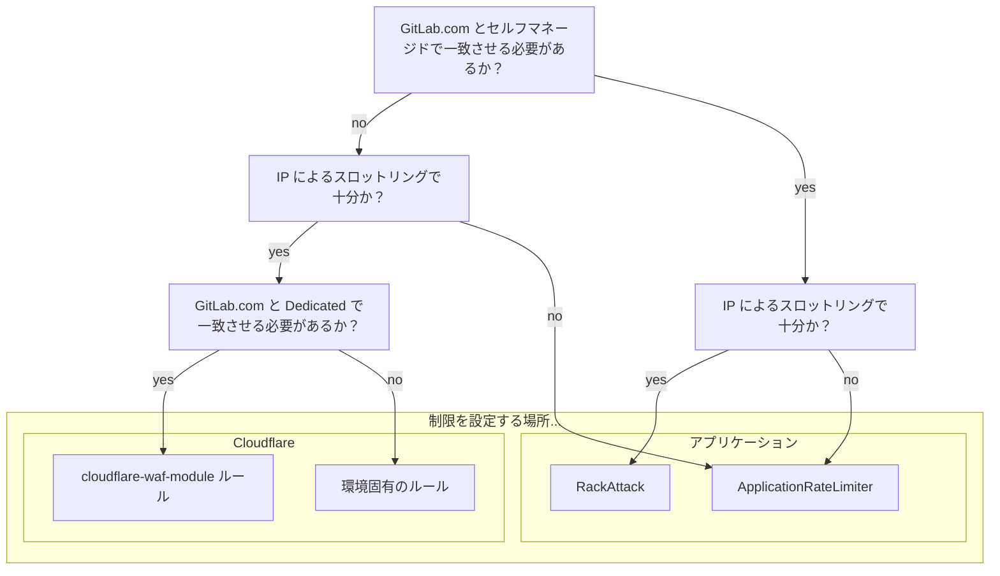

## 概要

GitLab 環境では、サービスとリソースを効果的に保護するために多層的なレート制限のアプローチが必要です。
各層はそれぞれ異なる利点を提供し、プラットフォームを守るための包括的な多層防御戦略における補完的な制御として機能します。

制限の導入または管理を行う際は、このガイドに従ってください。

## 制限を設定する場所

以下のダイアグラムを使用して制限を設定する場所を決定し、適切な設定方法に関する該当のガイダンスに従ってください。




{}
このドキュメントは現在、HTTP トラフィックへのインバウンド制限に焦点を当てており、将来的にサービス間の内部制限を考慮した拡張が予定されています。
{}


## 考慮事項

レート制限はデフォルトで有効にする必要があります。そうでない場合は、以下のケースについてこのプロセスに従う必要があります。

- 新しいレート制限の導入
- 既存のレート制限の引き下げ
- 無効にされたレート制限の再有効化
- レート制限の引き上げ

## プロセス


{}
インシデント対応の場合は、[Rate Limiting Runbooks](https://gitlab.com/gitlab-com/runbooks/-/tree/master/docs/rate-limiting) を参照してください。
{}


1. レート制限がすでに存在するかどうかを確認する
   - これに対するアプリケーション制限はすでにあるか？Cloudflare はどうか？
   - 既存の制限を調整（引き上げまたは引き下げ）することは可能か？
   - これらの制限がどこに設定されているかは [Rate Limiting: Limits](/handbook/engineering/infrastructure-platforms/rate-limiting/#limits) を参照してください。
1. 提案された制限を既存の制限と比較する
   - この制限を導入することで、顧客に悪影響が及ぶか？
   - この制限を導入しない場合、プラットフォームにリスクがあるか？
1. 可能であれば、最初は [`log`](https://developers.cloudflare.com/firewall/cf-firewall-rules/actions/) または [`track`](https://docs.gitlab.com/administration/settings/user_and_ip_rate_limits/#try-out-throttling-settings-before-enforcing-them) モードで有効にする
   - 週次のトラフィックパターンを把握するために、少なくとも1週間このモードのままにしておく必要があります。
   - これにより、潜在的な影響を評価できます。
   - オブザーバビリティツール（Cloudflare ダッシュボード、ログ、メトリクス）を使用して影響を分析してください。
1. 提案された制限の根拠を示す証拠を用意する
   - なぜその値を選択したのか？
   - 前のステップの調査結果を使って提案を裏付ける。
   - 顧客やバックエンドシステムへの連鎖的な影響はあるか？
1. ロールアウト計画を決定する
   - ブラウンアウト（短期間一時的に導入）を使用するか？
   - アプリケーション制限の場合: フィーチャーフラグを使用するか？
1. 関連するステークホルダーに変更を通知する
   - [#customer_success](https://gitlab.enterprise.slack.com/archives/C5D346V08)、[#support_gitlab-com](https://gitlab.enterprise.slack.com/archives/C4XFU81LG)、[#security](https://gitlab.enterprise.slack.com/archives/C248YCNCW) への通知を検討してください。
   - 制限に関して問い合わせてくる顧客を支援するためのドキュメントと関連情報へのアクセスを確保してください。
1. 顧客にコミュニケーションする
   - GitLab ブログでレート制限を発表する。[Projects, Groups, and Users APIs](https://about.gitlab.com/blog/2024/05/14/rate-limitations-announced-for-projects-groups-and-users-apis/) の例を参照。
   - アプリケーション制限の場合: 次のリリースポストでこの変更を文書化する。
   - [Support: Contacting Customers](/handbook/support/internal-support/#contacting-users-about-gitlab-incidents-or-changes) ワークフローに従ってコンタクトリクエストを起票する。
     - 可能な場合は変更と時間枠を通知する。
     - 影響を軽減するための利用可能な対処法、回避策、またはベストプラクティスに関するガイダンスを提供する。
1. docs.gitlab.com で制限を文書化する
   - 制限が文書化されていること、設定可能な場合はデフォルト値を記載していることを確認する。
   - 注意: Cloudflare の制限については常にこれが可能とは限りません。
1. [Change Management](/handbook/engineering/infrastructure-platforms/change-management/) プロセスに従う
   - レート制限へのいかなる変更も、トラフィックフローを乱す可能性があるため `Criticality 2` 変更と見なされます。
   - これには `@gitlab-org/saas-platforms/inframanagers` からの承認が必要です。

## Cloudflare

トラフィックが GitLab のインフラに到達する前にエッジネットワークで制限を適用することで、バックエンドリソースを消費する前に悪意のあるトラフィックをブロックし、大規模な volumetric 攻撃から保護できます。ただし、制限に使用できる設定オプションは限られており、主に IP アドレスによるものですが、他にもいくつかのオプションがあります。

1. Cloudflare レート制限は Terraform で管理されており、GitLab.com については [`cloudflare-waf-rules` モジュール](https://gitlab.com/gitlab-com/gl-infra/terraform-modules/cloudflare/cloudflare-waf-rules) を通じて行われます。このモジュールに追加されたルールは、このモジュールを使用している他のすべてのサービス（現在は GitLab Dedicated）に影響します。
2. 新しいルールを作成する際は、影響を分析するために `action = "log"` でインスタンス化することを推奨します。
3. レート制限が期待どおりに機能することを確認したら、Terraform で `action = "block"` に設定できます。

### GitLab Dedicated

GitLab Dedicated テナントのみに必要なレート制限（GitLab.com には不要）は、[Instrumentor](https://gitlab.com/gitlab-com/gl-infra/terraform-modules/cloudflare/cloudflare-waf-rules) の Terraform に追加する必要があります。さらなる支援が必要な場合は、[Dedicated Tracker](https://gitlab.com/gitlab-com/gl-infra/gitlab-dedicated/team/-/issues) で Issue を作成するか、Slack の [#g_dedicated_team](https://gitlab.enterprise.slack.com/archives/C025LECQY0M)（内部リンク）にアクセスしてください。

## アプリケーション

GitLab 内のアプリケーションレベルで制限を適用することで、より細かい制御が可能になります。これらは GitLab 固有のリソースを理解しているためより文脈に即しており、特定の機能に対してより詳細な制御を提供し、制限の判断にビジネスロジックやユーザー/プロジェクトベースの次元を適用する機能をサポートします。新しいアプリケーションレート制限は GitLab アプリケーションコードで設定され、[Product Processes](/handbook/product/product-processes/#introducing-application-limits) のガイドに従って導入する必要があります。

GitLab インスタンス内で現在設定されているレート制限については、[Rate Limits](https://docs.gitlab.com/security/rate_limits/) ドキュメントを参照してください。GitLab.com インスタンスに特有のレート制限については、[Rate Limits on GitLab.com](https://docs.gitlab.com/user/gitlab_com/#rate-limits-on-gitlabcom) を参照してください。

### RackAttack でのレート制限

GitLab は Rack リクエストをスロットリングするミドルウェアとして RackAttack を利用しています。アプリケーションレベルのレート制限の大部分は RackAttack で管理されています。既存のレート制限を設定する手順については、[User and IP Rate Limits](https://docs.gitlab.com/administration/settings/user_and_ip_rate_limits/) ドキュメントを参照してください。

新しいレート制限は、`Gitlab::RackAttack` と `Gitlab::RackAttack::Request` を拡張することで設定できます。その手順は [GitLab Development Docs](https://docs.gitlab.com/development/application_limits/#implement-rate-limits-using-rackattack) に記載されています。


{}
GitLab.com の新しい制限については、最初に ["Dry Run" (log) モードで有効にする](https://docs.gitlab.com/administration/settings/user_and_ip_rate_limits/#try-out-throttling-settings-before-enforcing-them)ことを推奨します。その手順は [Runbooks](https://gitlab.com/gitlab-com/runbooks/-/tree/master/docs/rate-limiting#application-rackattack) に記載されています。
{}


GitLab.com 固有のレート制限と RackAttack 設定ドキュメントの詳細については runbooks を参照してください。

### ApplicationRateLimiter でのレート制限

GitLab アプリケーションには、Rack Attack が提供できるものよりも柔軟性が必要な場合に使用される、特定のアクションをスロットリングするための単純なレート制限ロジックがあります。コントローラーまたは API レベルでスロットリングできます。これらのレート制限は [`application_rate_limiter.rb`](https://gitlab.com/gitlab-org/gitlab/-/blob/master/lib/gitlab/application_rate_limiter.rb) で設定されます。スコープは個々の制限の実装によって異なり、任意の ActiveRecord オブジェクトまたはその組み合わせを使用できます。一般的にユーザーごとまたはプロジェクトごと（またはその両方）ですが、何でも構いません。例えば RawController はプロジェクトとパスでスロットリングします。現在、ApplicationRateLimiter で作成された制限をバイパスする方法はありません。

新しいレート制限は、[GitLab docs](/handbook/product/product-processes/#introducing-application-limits) のガイドに従って ApplicationRateLimiter で作成できます。

## 潜在的に影響を受ける顧客の特定

影響を受ける顧客を特定する際に使用できるいくつかの次元があります。

<table>
<tr>
<th>

**Cloudflare**
</th>
<td>

- IP
- プロジェクト ID（URL から）

</td>
</tr>
<tr>
<th>

**RackAttack**
</th>
<td>

- ユーザー名
- IP

</td>
</tr>
<tr>
<th>

**ApplicationRateLimiter**
</th>
<td>

- ユーザー名
- IP
- プロジェクト

</td>
</tr>
</table>

GitLab.com でのレート制限に関するモニタリングとメトリクスは、[Rate Limiting Dashboard](https://dashboards.gitlab.net/d/rate-limiting-rate-limiting_overview/rate-limiting3a-rate-limiting3a-overview?orgId=1&from=now-6h&to=now&timezone=browser)（内部リンク）で最も簡単にアクセスできます。

### プロジェクト ID を使用した顧客ネームスペースの特定

レート制限に達している可能性があるリクエストのプロジェクト ID にアクセスできる場合、これをネームスペースに関連付ける方法が2つあります。

1. 管理者トークンを使用した API

   ```shell
   curl gitlab.com/api/v4/projects/:id
   ```

1. 本番環境 Rails コンソールを使用する

   ```ruby
   [ gprd ] production> p = Project.find(PROJECT_ID)
   => #<Project id:REDACTED redacted/redacted>>
   [ gprd ] production> p.full_path
   => "redacted/redacted"
   ```

## さらなる支援の要請

さらなる支援が必要な場合は、[Production Engineering::Foundations](https://gitlab.com/gitlab-com/gl-infra/production-engineering/-/issues/new?issuable_template=request-foundations) リクエスト Issue を開いてください。
