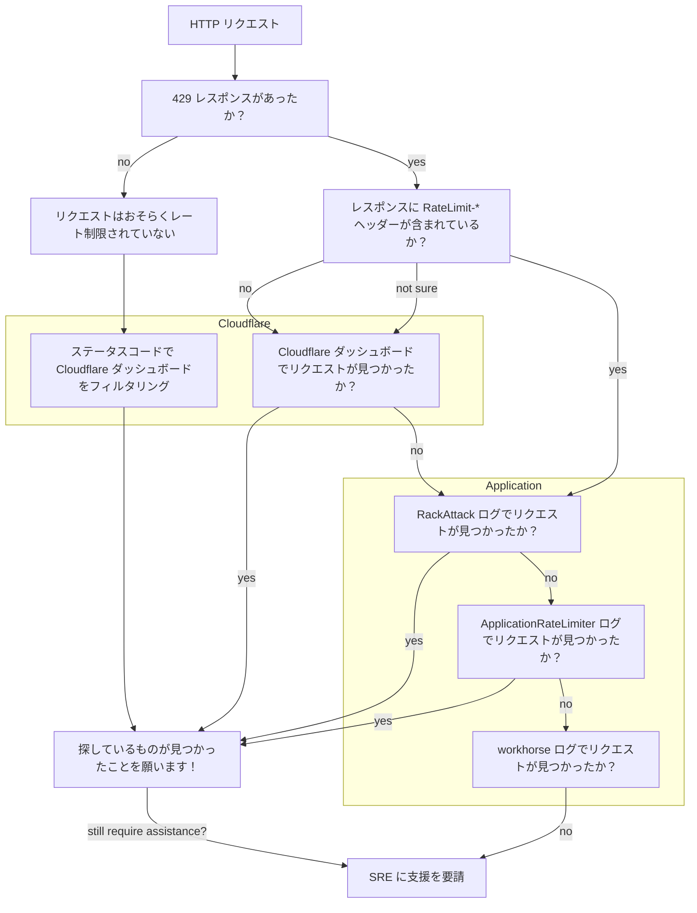

## 概要

レート制限の問題のトラブルシューティングは複雑な場合があります。
特に、リクエストがスタックの異なる層でスロットリングされる可能性があるためです。
このページでは、GitLab チームメンバー（適切な権限を持つ方）が、顧客のリクエストがどこでなぜレート制限されたかを見つけるために従うべき手順を提供します。

## リクエストはレート制限されたか？

レート制限されたリクエストは `429 - Too Many Requests` レスポンスを返します。

他のステータスコードに対してこれらのトラブルシューティングガイドに従うことも有益な場合があります。

## リクエストをレート制限している層はどこか？

GitLab.com へのすべてのトラフィックはレート制限の対象であり、
Cloudflare とアプリケーション内で適用される異なる[制限](/handbook/engineering/infrastructure-platforms/rate-limiting/#limits)があります。

**注意:** GitLab Pages またはレジストリに関するレート制限の問題をトラブルシューティングしている場合は、
設定方法の詳細については [その他のレート制限](/handbook/engineering/infrastructure-platforms/rate-limiting/#other-rate-limits) を参照してください。

以下のダイアグラムは、最初にどこを調べるかを判断する際の参考になります。
詳細については、関連するセクションまでスクロールしてください。

### レート制限レスポンスヘッダー

リクエストがレート制限された場合、ユーザーは `RateLimit-*` レスポンスヘッダーを受け取ることがあります。
これはリクエストをスロットリングした層によって異なります。
例えば、Cloudflare は `RateLimit-*` レスポンスヘッダーを返しません。
この動作については、ハンドブックの [Rate Limiting Headers](/handbook/engineering/infrastructure-platforms/rate-limiting/#headers) セクションにより詳しく記載されています。

これらのヘッダーの存在（または不在）は、調査を開始する場所を示すシグナルとして使用できます。
アプリケーション内の `RackAttack` レート制限は、スロットリングされたリクエストに対してこれらのレスポンスヘッダーを返します。

## Cloudflare

アクセス権を持つ GitLab チームメンバーは、[SSO を使用して Cloudflare アカウントにログイン](https://dash.cloudflare.com/login)できます。
ログインするには、GitLab メールアドレスを入力すると `Log in with SSO` オプションが表示されます。

アクセスを要請するには、Cloudflare Analytics ロールの[アクセスリクエスト](https://gitlab.com/gitlab-com/team-member-epics/access-requests/-/issues/new?issuable_template=Access_Change_Request)を開いてください。

[Cloudflare ダッシュボードのウォークスルー録画](https://www.youtube.com/watch?v=7oW5WrlJWp0)を視聴できます（GitLab チームメンバーのみ）。

### クイックリンク

- [Cloudflare Overview: gitlab.com ドメイン](https://dash.cloudflare.com/852e9d53d0f8adbd9205389356f2303d/gitlab.com)
- [Analytics & Logs: Network Analytics](https://dash.cloudflare.com/852e9d53d0f8adbd9205389356f2303d/network-analytics/all-traffic)
- [Analytics & Logs: gitlab.com の HTTP トラフィック](https://dash.cloudflare.com/852e9d53d0f8adbd9205389356f2303d/gitlab.com/analytics/traffic)
- [Security Center: gitlab.com のイベント](https://dash.cloudflare.com/852e9d53d0f8adbd9205389356f2303d/security-center/events?host=gitlab.com)
- [Security: gitlab.com の Bot Analytics](https://dash.cloudflare.com/852e9d53d0f8adbd9205389356f2303d/gitlab.com/security/bots)

#### 検索のカスタム日付範囲を選択する

これには2つの目的があります。

1. 検索を特定の期間に絞り込みます。
1. 同僚とスナップショットビューを共有できます。
`Previous 24 hours` はローリングウィンドウのリンクを生成します。

**注意:** UI に表示される日付はローカルタイムゾーンです。

### HTTP トラフィック分析

このダッシュボードは `gitlab.com` の HTTP トラフィックを表示します。
サンプリングされた結果が返ることがあります。
このダッシュボードを使用して、パス、IP、ソースユーザーエージェント、データセンターなどを検索してください。

{}

{}

#### フィルターを追加する

HTTP トラフィックを確認する際に適用できるフィルターが多数あります。
注意すべき有用なフィルターをいくつか紹介します。

- `Source IP` - 顧客の IP アドレスでフィルタリング。
- `Edge status code` - Cloudflare からのレスポンスコード。
- `Origin status code` - GitLab からのレスポンスコード。

例えば、Edge ステータスが GitLab から返された Origin ステータスと異なる場合、
リクエストが Cloudflare を通過していない可能性の兆候となる場合があります。

必要なだけフィルターを適用し、
スクロールして結果を確認してください。
デフォルトのビューはトップ5件を返しますが、
必要に応じて15件に増やすことができます。

### セキュリティイベント

[Security Events](https://dash.cloudflare.com/852e9d53d0f8adbd9205389356f2303d/security-center/events?host=gitlab.com) は、
ブロック、チャレンジ、またはスキップされたリクエストの量を表示します。
このダッシュボードを使用して、Cloudflare ルールがトラフィックをブロックしているかどうか（そして何が）を調査してください。

{}

{}

#### フィルターを追加する

セキュリティイベントを確認する際に適用できる最も有用なフィルターは次のとおりです。

- `Source IP` - 顧客の IP アドレスでフィルタリング。
- `Action` - 許可、ブロック、チャレンジ、またはその他のステータスを検索。
- `Ray ID` - 特定の識別子を検索 [[Cloudflare Ray ID docs](https://developers.cloudflare.com/fundamentals/reference/cloudflare-ray-id/)]。

必要なだけフィルターを適用し、
スクロールして結果を確認してください。
デフォルトのビューはトップ5件を返しますが、
必要に応じて15件に増やすことができます。

**注意:** 検索結果は30日間に制限される場合があります。

#### 結果の解釈

結果をフィルタリングしたら、さらなる調査に結果を活用できます。

- **ソース IP アドレス:** リクエストは1つの IP アドレスから来ているか、複数か？
- **ユーザーエージェント:** リクエストは共通のライブラリからか？バージョンは？
- **パス:** どのリソースやパスをターゲットにしているか、パターンはあるか？
- **ファイアウォール/レート制限/マネージドルール**: どのルールがヒットしているか？これは期待される動作か？
  - 注意: Analytics アクセス権を持つユーザーには `Rule unavailable` と表示される場合がありますが、
  どのタイプのルールがリクエストをブロックしたかを把握することは依然として有益です。

結果の中に特に興味深いものがある場合、
値にカーソルを合わせると `Filter` または `Exclude` でさらに深く調査できます。

{}
以下の結果は、潜在的に機密性の高い情報を削除するために編集されています。

{}

### SSH トラフィック

[Network Analytics](https://dash.cloudflare.com/852e9d53d0f8adbd9205389356f2303d/network-analytics/all-traffic?dest-port=22) ダッシュボードでは、宛先ポートでフィルタリングできます。
`Destination port equals 22` のフィルターを設定すると、
SSH トラフィックの基本的な分析ができます。

より詳細な調査のために、ログは Google Cloud Storage (GCS) バケットにプッシュされており、
GCP にアクセスできる方がさらに調査できます。

SSH トラフィックに関する Cloudflare ログのクエリの詳細は [Cloudflare runbook](https://gitlab.com/gitlab-com/runbooks/-/blob/master/docs/cloudflare/logging.md) を参照するか、
さらなる SRE 支援を要請するガイダンスに従ってください。

### ボット

[Bot Analytics](https://dash.cloudflare.com/852e9d53d0f8adbd9205389356f2303d/gitlab.com/security/bots) ダッシュボード（管理者アクセスのみ）では、
他の Cloudflare ダッシュボードと同じようにフィルタリングできます。
他のすべてのオプションを使い果たした後に、
自動化か人間のリクエストかの可能性を判断するのに役立ちます。

{}

{}

## HAProxy

HAProxy は `gitlab.com` へのリクエストをスロットリングするためには使用されていませんが、
レジストリや Pages に関連するレート制限を調査している場合は、
[HAProxy Logging runbook](https://gitlab.com/gitlab-com/runbooks/-/blob/master/docs/frontend/haproxy-logging.md) を参照してください。

## アプリケーション

GitLab アプリケーションには2つの主要なスロットリングメカニズムがあります。
[RackAttack](/handbook/engineering/infrastructure-platforms/rate-limiting/#rackattack) と
[ApplicationRateLimiter](/handbook/engineering/infrastructure-platforms/rate-limiting/#applicationratelimiter) です。

[Rate Limiting Overview](https://dashboards.gitlab.net/d/rate-limiting-rate-limiting_overview/rate-limiting3a-rate-limiting3a-overview?orgId=1) Grafana ダッシュボードを使用して、両方のトレンドを観察できます。

### クイックリンク

- [Metrics: Rate Limiting Overview ダッシュボード](https://dashboards.gitlab.net/d/rate-limiting-rate-limiting_overview/rate-limiting3a-rate-limiting3a-overview?orgId=1)
- [Logs: RackAttack](https://log.gprd.gitlab.net/app/discover#/view/0026cc97-6b9a-445a-a364-7197e04053a2?_g=())
- [Logs: ApplicationRateLimiter](https://log.gprd.gitlab.net/app/discover#/view/2d2cf10e-b22a-4c07-bbda-45bb665c31ee?_g=())
- [Logs: Rate Limit Dashboard](https://log.gprd.gitlab.net/app/r/s/AJDZC)

### RackAttack

[RackAttack](/handbook/engineering/infrastructure-platforms/rate-limiting/#rackattack) によってリクエストがスロットリングされた場合、`RateLimit-*` レスポンスヘッダーが含まれます。

[RackAttack ログ](https://log.gprd.gitlab.net/app/discover#/view/0026cc97-6b9a-445a-a364-7197e04053a2?_g=()) は次のようにフィルタリングできます。

- `json.remote_ip` を使用した IP アドレス
- `json.matched` を使用したスロットル
- `json.path` を使用したパス

### ApplicationRateLimiter

[ApplicationRateLimiter ログ](https://log.gprd.gitlab.net/app/discover#/view/2d2cf10e-b22a-4c07-bbda-45bb665c31ee?_g=()) は次のようにフィルタリングできます。

- `json.meta.remote_ip` を使用した IP
- `json.meta.user` または `json.meta.client_id` を使用したユーザー
- `json.meta.project` を使用したプロジェクト
- `json.env` を使用したスロットル
- `json.path` を使用したパス

### Workhorse

Cloudflare、RackAttack、または ApplicationRateLimiter でリクエストが見つからない場合は、
[Workhorse ログ](https://log.gprd.gitlab.net/app/discover#/view/7b6dc396-5b27-4e86-b150-72b476255faf?_g=()) でレート制限されたレスポンスを検索できます。

- `json.remote_ip` を使用した IP
- `json.uri` を使用したパス
- `json.status` を使用したステータス

## さらなる支援の要請

このトラブルシューティングガイドに従っても探している結果が見つからない場合は、
以下の2つの機密 Issue テンプレートのいずれかを使用して、サイト信頼性エンジニア（SRE）に支援を要請できます。

- [Cloudflare Troubleshooting](https://gitlab.com/gitlab-com/gl-infra/production-engineering/-/issues/new?issuable_template=Cloudflare%20Troubleshooting)
- [User Rate Limiting Settings](https://gitlab.com/gitlab-com/gl-infra/production-engineering/-/issues/new?issuable_template=request-rate-limiting)

## 追加リソース

- [Support Workflows: IP Blocks](/handbook/support/workflows/ip-blocks/)
- [Runbooks: Rate Limiting](https://gitlab.com/gitlab-com/runbooks/-/tree/master/docs/rate-limiting)
- [Runbooks: Cloudflare](https://gitlab.com/gitlab-com/runbooks/-/tree/master/docs/cloudflare)
- [Docs: RackAttack Troubleshooting](https://docs.gitlab.com/ee/security/rate_limits.html#troubleshooting)
