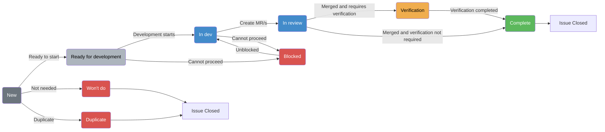

## 概要

Cells Infrastructure チームは、[Cells](/handbook/engineering/architecture/design-documents/cells/) アーキテクチャの主要なサービスとコンポーネントの開発を担当しています。また、Cells への貢献において他の開発チームと緊密に連携しています。

## ドキュメントナビゲーション

このページは Cells Infrastructure チームの概要を提供します。特定のワークフローとプロセスについては以下を参照してください。

- **[意思決定・透明性ガイドライン](process.md)** - 意思決定の方法と透明性の維持方法
- **[AI プロンプト](ai-prompts.md)** - 一般的なチームワークフロー用の AI プロンプトライブラリ
- **[Tenant Scale プロジェクト管理ガイダンス](../operating-system/project-management.md)**
- **[GitLab DRI ハンドブック](/handbook/people-group/directly-responsible-individuals/)**

### チームメンバー

チームメンバー情報は <a href="https://handbook.gitlab.com/handbook/engineering/infrastructure-platforms/tenant-scale/cells-infrastructure/#team-members" rel="external noopener">原文 (英語)</a> を参照してください。

### コンタクト

チームへの連絡は、[Issue](https://gitlab.com/gitlab-com/gl-infra/tenant-scale/cells-infrastructure/team/-/issues/new) を作成するのが最善です。

Cells に関する一般的な質問は、Slack チャンネル [#f_protocells](https://gitlab.enterprise.slack.com/archives/C0609EXHX6F) を気軽に使用してください。

チームへのコンタクトは Slack チャンネルを使用してください。
[#g_cells_infrastructure](https://gitlab.enterprise.slack.com/archives/C07URAK4J59)

## 作業方法

### プロジェクト管理

[Tenant Scale プロジェクト管理ガイダンスに従います](../operating-system/project-management.md)が、1つの例外があります。**ワークフローラベルの代わりに [Issue ステータス](https://docs.gitlab.com/user/work_items/status/)を使用**します。ただし、エピックレベルではラベルの設定が必要です。

#### DRI とサポート貢献者

エピックの [DRI](/handbook/people-group/directly-responsible-individuals/) は、プロジェクトの技術的方向性に関する[意思決定](/handbook/leadership/making-decisions/#making-decisions)に責任を持ちます。意思決定には、提案を作成し、ピアやエンジニアリングマネージャーからフィードバックを集めることが含まれます。また、適用される場合はチーム外のステークホルダーとの連携や協力も必要です。

意思決定権限と透明性プラクティスの詳細なガイダンスについては、[意思決定・透明性ガイドライン](process.md)を参照してください。

DRI はプロジェクト管理にも責任を持ち、関連する Issue でエピックを最新の状態に保ち、関連性のなくなった Issue を削除し、エピックの自動生成コメントに週次更新を記述します。

#### Issue トラッキング

Cells Infrastructure チームは以下の基本原則を遵守します。

1. **積極的に進行中の Issue のみに割り当てる**。取り組まれていない Issue は未割り当てのままにする。
1. **必須ラベルを適用する**。すべての Issue に以下を含める必要があります。
   - `group::cells infrastructure`
   - `section::tenant scale`
   - `Category:Cell`
   - `devops::runtime`
1. **必要に応じてサービス固有のラベルを追加する**。Issue が特定のサービス（例: Topology Service）に関連する場合は、適切にタグ付けします（例: `Service::Topology Service`）。

Cells Infrastructure チームは、`gitlab-org/gitlab`、`gitlab-org/cells/http-router`、`gitlab-org/cells/topology-service` など複数の GitLab プロジェクトにまたがって作業します。デフォルトでは、チームが所有する Issue は [Cells Infrastructure チーム Issue トラッカー](https://gitlab.com/gitlab-com/gl-infra/tenant-scale/cells-infrastructure/team/-/issues)の下に開き、`group::cells infrastructure` ラベルを適用する必要があります。適切な場合は、他のプロジェクトから Cells Infrastructure チームの Issue をチームの Issue トラッカーに移動してください。

チームの Issue トラッカーまたは他の `gitlab-com/gl-infra` プロジェクトの Issue については、GitLab の組み込み Issue ステータス機能を使用してワークフローの状態を追跡します。進行中、準備完了、またはトリアージが必要なすべての Issue に関連するステータスが適用されていることを確認してください。

以下のワークフロー Issue ボードを使用して Issue を追跡します。

- [`gitlab-com/gl-infra` プロジェクト](https://gitlab.com/gitlab-com/gl-infra/tenant-scale/cells-infrastructure/team/-/boards/9605325)
- [`gitlab-org` グループ Issue](https://gitlab.com/groups/gitlab-org/-/boards/9762600)

`gitlab-org` の新しい Issue については、`/cc @daveyleach` でメンションしてください。

#### Issue の説明

すべての Issue には、作業の説明、識別された `action items`（アクションアイテム）または `exit criteria`（完了基準）を含める必要があります。初期説明を変更する実装詳細に関する決定がなされた場合は、説明（および必要に応じて Issue タイトル）を更新して、Issue が実装または達成しようとしていることを常に正確に反映するようにしてください。Issue はピアによって「開発準備完了」と評価され、十分なコンテキストが提供されていることを確認することもできます。Issue の作成については、利用可能なテンプレートを参照してください。

- [一般的な Issue テンプレート](https://gitlab.com/gitlab-com/gl-infra/tenant-scale/cells-infrastructure/team/-/blob/main/.gitlab/issue_templates/issue.md?plain=1)
- [ディスカッション Issue テンプレート](https://gitlab.com/gitlab-com/gl-infra/tenant-scale/cells-infrastructure/team/-/blob/main/.gitlab/issue_templates/disscussion.md?plain=1)

Issue の作成と評価については、Issue Readiness と Issue Summary プロンプトを含む [AI プロンプト](ai-prompts.md) を参照してください。

また、使用できる *Cells-project-issue-creator* という Duo エージェントもあります。

- [cells infrastructure](https://gitlab.com/gitlab-com/gl-infra/tenant-scale/cells-infrastructure/team) プロジェクトに移動する
- [Cells-project-issue-creator エージェントを選択する](https://docs.gitlab.com/user/gitlab_duo_chat/agentic_chat/#select-an-agent)
- 作成したい Issue を説明すると、テンプレートを使用して Issue が作成されます

#### Issue ステータスの参照

| ステータス | 説明 | 使用するタイミング |
|--------|-------------|-------------|
| **New** | 新しく作成された Issue の初期状態 | Issue を最初に作成するとき |
| **Ready for development** | Issue は作業の準備ができている | すべての計画が完了し、作業を開始できるとき（準備ができているか不明な場合はピアレビューを検討） |
| **In dev** | 積極的な開発が進行中 | 開発者が Issue または Issue に関連する MR に積極的に取り組んでいるとき |
| **In review** | Issue のマージリクエストがレビュー中 | Issue に関連するすべてのアクティブな MR がピアレビューを待っているとき |
| **Blocked** | 依存関係のため作業が進められない | 外部の依存関係や他の Issue が進捗を妨げているとき |
| **Complete** | 作業が完了し検証された | Issue が完全に実装、テストされ、完了基準を満たしているとき |
| **Won't do** | 完了せずに Issue をクローズする | Issue が適用できなくなったか優先度が下がったとき |
| **Duplicate** | Issue が別の Issue の重複である | Issue が別の Issue の重複であるとき |
| **Verification** | 完了前に検証が必要 | 開発は完了しているが、テスト環境と本番環境での検証が必要なとき |

### 開発ワークフロー

Issue の所有者として、エンジニアは担当する Issue のステータスを最新の状態に保つことが求められます。エンジニアが Issue の作業を始める際は、開始点として「In Dev」ステータスを付け、開発を通じて Issue を更新し続けます。また水曜日までにグランドレビューのためにエピックを更新することが求められているため、Issue の所有者は、自分が属するエピックの DRI でもない場合は、取り組んでいる Issue に関連する更新を提供することも期待されます。週次エピックサマリーの Duo プロンプトは [Issue Update](ai-prompts.md) で使用できます。

プロセスは主に以下のダイアグラムに従います。

#### コードレビュー

コードレビューは、この[受け入れチェックリスト](https://docs.gitlab.com/development/code_review/#acceptance-checklist)に概説されている標準ガイドラインに従います。

#### メンテナー

Cells Infrastructure が所有するプロジェクトのメンテナーになるには、[メンテナーテンプレート](https://gitlab.com/gitlab-com/gl-infra/tenant-scale/cells-infrastructure/team/-/issues/new?issuable_template=maintainer)を使用して Issue を作成してください。

### チームミーティング

毎週火曜日に Cells Infrastructure は1時間のミーティングを行います。APAC/EMEA 0700UTC と EMEA/AMER 1100UTC のフレンドリーなタイムゾーンが交互に使われます。このミーティングの目的は次のとおりです。

- デモ
- 技術的な決定、ブロッカーなどをチームとしてレビューしてフィードバックを得る
- チームが知っておくべき情報の共有
- チームのディスカッション（プロセス、ロードマップ/今後の作業、会社のアイテムなど）

これらのミーティングのための週次ステータスレポートとエピックサマリーの生成については、週次エピックサマリーの [AI プロンプト](ai-prompts.md) を参照してください。

### Geekbot/ステータス更新

進捗中の作業に関する更新を提供するために、Slack との統合 Geekbot を使用しています。毎週月曜日に Geekbot がチームメンバーに更新を求め、Slack を通じて投稿します。

### マネージャーの責任

毎週 EM は Issue ボードをレビューします。レビューの目的は次のとおりです。

- Issue に適切なステータスが設定されていることを確認する。
- 進行中、ブロック、レビュー中の Issue の状態を確認する。
- 作業できるよう改善された Issue が準備されていることを確認する。改善された Issue とは、重み付けされ、説明に十分なコンテキストがあり、作業の準備ができていることを示す **Ready for development** ステータスが付いているものです。
- Issue がロードマップに沿っており、関連するエピックのステータス更新があることを確認する。

## リソース

- Slack:
  - [#g_cells_infrastructure](https://gitlab.enterprise.slack.com/archives/C07URAK4J59)
  - [#f_protocells](https://gitlab.enterprise.slack.com/archives/C0609EXHX6F)
  - [#g_cells_infrastructure_standup](https://gitlab.enterprise.slack.com/archives/C07UWPM2Y0P)
- [Cells Infrastructure チーム Issue トラッカー](https://gitlab.com/gitlab-com/gl-infra/tenant-scale/cells-infrastructure/team/-/issues)
- [チームメンバーが割り当てられた Issue ボード - メンバー別の進行中の作業量を確認するのに便利](https://gitlab.com/groups/gitlab-com/-/boards/8981056)
- [ワークフローボード](https://gitlab.com/gitlab-com/gl-infra/tenant-scale/cells-infrastructure/team/-/boards/9605325)
- [GitLab Org ワークフローボード](https://gitlab.com/groups/gitlab-org/-/boards/9762600)

## 関連ドキュメント

### チームプロセスとガイドライン

- **[意思決定・透明性ガイドライン](process.md)** - 意思決定の方法、エスカレーションパス、ドキュメント原則に関するガイド
- **[AI プロンプト](ai-prompts.md)** - Issue 管理、コードレビュー、テスト、ステータスレポートのための AI プロンプトのコレクション
