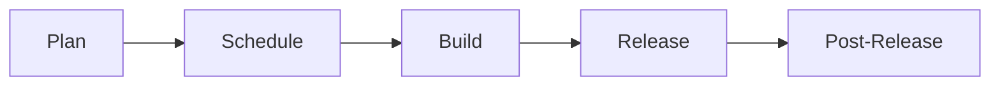

## ディスカッション

ディスカッションはこの [GitLab プロジェクト](https://gitlab.com/gitlab-org/geo-team/discussions/-/issues/?sort=created_date&state=opened&first_page_size=100)に記録されています。

## プランニング

### 作業項目の階層

開発実行において明確さをもたらすプランニングの一側面は、プロダクトマネジメントの一環として GitLab 独自の[作業項目](https://docs.gitlab.com/ee/development/work_items.html)として整理された情報の階層にロードマップを分解することです。

このセクションでは、Geo チームが要件をエンジニアが実装ワークフローを通じて進める作業中の項目に分解するアプローチについて説明します。

まず、共通の業界用語と整合性を持たせるために一般的なアジャイル作業項目の用語を説明します。次に、これらの一般的な用語を GitLab が使用する具体的な作業項目の用語にマッピングします。

最後に、新しい項目を作成する際のガイドラインと適切な粒度を選択するためのヒントを提供します。

詳細は [Geo のアジャイル作業項目の階層](../agile-work-items.html)ページに記載されています。

### カンバン

マイルストーンに整合しながら継続的なカンバン方式で作業します。

Epic と Issue には次のライフサイクルがあります:



このプロセスを監視するために 3 つのボードが使用されます

- [プラン](https://gitlab.com/groups/gitlab-org/-/boards/1181258)
- [スケジュール](https://gitlab.com/groups/gitlab-org/-/boards/981066)
- [ビルド](https://gitlab.com/groups/gitlab-org/-/boards/1181257)

#### プラン

まだマイルストーンに計画されていない Issue をトリアージするために[カンバンプランボード](https://gitlab.com/groups/gitlab-org/-/boards/1181258)を使用します。このボードの Issue には「group::geo」というラベルが付けられており、ステータス「Validation Backlog」、「Problem Validation」、「Solution Validation」、「Planning Breakdown」、「Refinement」を使用します。

エンジニアリングマネージャーがこのボードを管理し、実現可能な Epic になるまで Issue を進めるために使用します。作業がこのボードを離れるとき、エンジニアリングチームが Issue を実装するのに適した状態になっています。

この段階で、EM は Geo 機能に追加したい新しい作業を確立します。プランニングプロセスは次のとおりです:

##### 問題の検証

EM は、Issue が Geo 機能の問題をお客様に関連する（内部および外部）方法で説明しているか、または他の明確なメリット（例: バックエンドの技術的改善）があるかを確立しようとします。EM は必要に応じて他のグループメンバー、お客様、UX 組織を活用します。
問題が検証された場合、Issue は次の段階に進み、そうでない場合は問題が考慮されない*理由*についての短い説明とともにクローズされます。この説明には、[カテゴリ戦略へのリンク](/handbook/product/product-processes/#category-direction)も含める必要があります。

##### ソリューションの検証

問題が検証されると、PM は[作業の階層](../agile-work-items.html)のガイドラインに従って作業項目を作成することを検討します。
その後、PM はエンジニアリングマネージャー（EM）に技術的な担当者のコンタクトを求めます。EM は作業項目の[オーナーシップ](#work-ownership)をエンジニアに割り当てます。エンジニアは PM と協力して問題の技術的なソリューションを決定します。

場合によっては、実現可能な技術的パスを決定するために概念実証（POC）が必要になることがあります。必要な場合、PM は実施する調査のコンテキストと POC の目標を含む POC Issue を作成します。この Issue は、タスクの詳細な分解が行われる前に作業としてスケジュールされます。

POC の Issue はまた、期限付きで時間制限があり、これらの項目に `~"POC"` のラベルを付ける必要があります。期限の日に、エンジニアは POC の結果に関する Issue へのコメントを提供することが期待されます。これらの Issue に時間制限を設けることは、作業のスコープを制約することを意図しています。

また、すべての POC が成功するとは限らないことに注意することも重要です。それで構いません！一部の研究の方向性は成功しないかもしれませんが、POC は私たちのニーズを満たさないソリューションに多大な時間を投資することを防いでくれます。目標は速く失敗することです！

PM とエンジニアは、ソリューションを構築するために必要なすべての[作業項目](../agile-work-items.html)を作成するために協力します。これらの項目には次のものが含まれます

- ドキュメント
- テスト
- rake タスク、マイグレーション、監視 Issue などのリリース後の項目

理想的には、[Epic、機能、ユーザーストーリー](../agile-work-items.html)は実装の詳細ではなく外部の機能によって分解される必要があります。リファクタリングやパフォーマンスの改善でさえ、お客様の価値を強調し、ユーザー中心のアプローチで説明する必要があります。

SRE が実行する必要があるリリース後のタスクはインフラチームのプロジェクトで作成され、関連 Issue として作業項目に追加できません。これらのために、最上位の作業項目の説明にリスト化しておくと便利です。

解決策の合理的な内訳を持ち、各作業項目の工数の見積もりを含めることで満足したら、この内訳を残りのチームとディスカッションとフィードバックのために共有する必要があります。プランニングはいずれにせよ透明ですが、これは新しい作業項目が開発の準備ができていることをチームに通知する役割を果たします。

フィーチャーフラグ（FF）を使用する機能を含む Issue については、フィーチャーフラグの[ライフサイクルドキュメント](/handbook/product-development/how-we-work/product-development-flow/feature-flag-lifecycle/#development)に従います。
元の Issue は、ロールアウトが計画通りに行われない場合に備えて、FF ロールアウト Issue がクローズされるまで開いたままにしてブロックされている必要があります。

#### スケジュール

継続的に、EM は準備された項目を開発のキューに入れます。

このプロセスでは、準備された項目にマイルストーンラベルとステータス `Ready For Development` が付与され、ビルドボードに項目が引き込まれます。

継続的な優先順位付けとスケジューリング作業の一部として、次の質問への答えを提供します

1. 現在何が進行中か？
1. 次に何が必要か？
1. 成果物はあるか？
1. アクティブなリストは優先順位順か？
1. バグリスト
1. 発生している技術的負債の項目

これらのスケジューリング活動の成果は、EM が準備し、次のイテレーションの方向性とスコープをカプセル化した[Outlook Issue](https://gitlab.com/gitlab-org/geo-team/discussions/-/issues/?search=Geo%20Outlook&sort=due_date&state=all&first_page_size=100)に反映されます。

#### ビルド

[カンバンビルドボード](https://gitlab.com/groups/gitlab-org/-/boards/1181257)を使用して、`group::geo` ラベルとの組み合わせで `%Started` マイルストーンを持つ Issue を確認します。

エンジニアリングマネージャー（EM）がこのボードを管理し、チームが開発の準備ができていると判断した Epic と Issue を構築するのを促進するために使用します。

Issue は優先順位順に「Ready for Development」列に追加されます。エンジニアが空き時間になったとき、このリストの上から未割り当ての Issue を選ぶことができます。作業が進むにつれて、「In Dev」と「In Review」列を通じて Issue を進めます。エンジニアは Issue を対応するマージリクエストのステータスと一致させる必要があります。

Issue が「In Review」の状態にある場合、MR は元のエンジニアとレビュワーの両方に割り当てられ、マージリクエストにアクティブなレビュワーがいることが明確になります。これにより、EM は各人にどれだけの作業が割り当てられているかを把握できます。

「Verification」列は、Epic のオーナーまたは EM が Issue がソリューションのコンテキストに合っていることを確認する場所です。ここで、この Issue にリリースノートが必要かどうかを確認し、正しいマイルストーンを割り当てます。

#### リリースとリリース後

一部の Issue では、リリース完了後に SRE が実行する必要があるタスクがあります。これらのタスクはインフラプロジェクトにあることが多いため、Epic に追加できません。それでもこれらを追跡し、完了まで進める必要があります。

最後に、この Issue のために出す必要があるコミュニケーションを確実に届けます。これらはリリースポスト、ブログポスト、ビデオチュートリアル、またはデモの形を取ることがあります。

### 作業のオーナーシップ {#work-ownership}

Geo チームは、時間をかけて Geo カテゴリの成熟度を高める機能や能力を説明するためにさまざまな[作業項目](../agile-work-items.html)を使用します。

各上位レベルの作業項目（Epic および/または機能）は、その作業項目のすべての技術的側面に責任を持つエンジニアが所有する必要があります。いつでもオーナーが数日以上の休暇を取る必要がある場合、復帰するまで代理として行動する別のエンジニアを割り当てる必要があります。

**プランニングフェーズ**では、エンジニアリングオーナーがプロダクトマネージャーと密接に協力して、要件が何であるか、なぜお客様にとって重要なのかを理解します。エンジニアは必要な技術的作業をカプセル化した[タスク](../agile-work-items.html#task)をどのように最善に提供するかを決定して作成します。適切なアプローチを考え出すために、他のチームメンバーや安定したカウンターパートに相談する必要があるかもしれません。

ドキュメントの変更と必要な追加テスト要件のためのタスクを含める必要があります。必要に応じて、変更についてサポートグループの Geo 専門家に通知するタスクを作成する必要があります。エンジニアはまた、同時に対処するのが適切な技術的負債があるかどうかを検討する必要があります。ロールアウトやリリース後の ToDo のための追加タスクも必要です。

オーナーであるエンジニアが、タスクを実装する唯一の人物である必要はありません。
作業が正しく進んでいることを確認するために、タスクで行われた作業を監視する必要があります。
理想的には、作業項目の各 MR の承認者でもあるべきです。作業に問題がある場合や長い遅延がある場合は、プロダクトマネージャーとエンジニアリングマネージャーが認識していることを確認する必要があります。

**作業が完了に近づいたとき**、オーナーエンジニアはリリースノートを確認し、変更について PM と協力する必要があります。また、ビルドプロセス中に発生した可能性のある追加 Issue が対処されるか、作業としてスケジュールされていることを確認する必要があります。これにより、構築中に技術的負債を積み上げないことを確保できます。

**最後に**、オーナーは本番環境で Epic や機能をロールアウトする際に発生する必要がある作業も監視する必要があります。rake タスク、データベースマイグレーション、または実行する必要がある他のタスクがある場合、サイトリライアビリティのカウンターパートの助けを借りて本番システムで実行されるまで見届ける必要があります。また、作業項目のリリースノートを作成するためにプロダクトマネージャーを支援する必要がある場合もあります。

これはオーナーに多くの責任を課しますが、PM と EM は常にサポートしています。このオーナーシップは、作業項目を進められるのが PM または EM だけというボトルネックや状況を取り除きます。また、タスクをどのように実装するかを決定するのに最も適した人々は、実際に作業を行う人々であることが多いです。

プロダクトマネージャーの責任は、エンジニアが要件を満たす正しいソリューションを開発するのに十分な情報があることを確認することです。また、明確化の質問に答えたり、エッジケースへのアプローチを検討したりするためにも利用できます。作業項目の終わりには、この内容をお客様や他の関係者に伝えます。

エンジニアリングマネージャーはパスをクリアする責任があります。作業を実行するエンジニアが、作業を完了するための適切な情報、人材、ツール、その他のリソースにアクセスできることを確認する必要があります。問題を予見し、作業が進行中に発生する可能性のあるブロッカーをクリアしようとします。

### Issue のオープン

Geo チームでは、Issue テンプレートを使用してバックログに一貫性を持たせ、より効率的に作業し、より多くの結果を提供します。
Issue テンプレートの使用は、チームの次の点で役立つことがわかっています:

1. 外部のコンテキストなしに、どの貢献者でも取り上げて会話を開始または参加できるように、Issue に必要な情報がすべて含まれていることを確認します。
2. 精練化プロセスをより効率的に機能させることで、コミュニティへの貢献が増え、SME への依存が減ります。
3. Issue が意図せずバックログの底に沈まないようにします。

以下の Issue テンプレートを使用します:

- [バグ（テンプレート）](https://gitlab.com/gitlab-org/gitlab/-/blob/master/.gitlab/issue_templates/Bug.md)
  - バグとその調査のテンプレートとして使用されます。
- [機能 - リーン（テンプレート）](https://gitlab.com/gitlab-org/gitlab/-/blob/master/.gitlab/issue_templates/Feature%20Proposal%20-%20lean.md)
  - より大きな機能リクエストのテンプレートとして使用されます。これらはしばしば会話を促し、最終的に Epic に昇格し、MVC の変更として実装 Issue が分割されます。
- [実装（テンプレート）](https://gitlab.com/gitlab-org/gitlab/-/blob/master/.gitlab/issue_templates/Implementation.md)
  - 大規模な Epic を分解し、MVC レベルの変更を整理し、精練化プロセスを支援するために使用されます。

*注: テンプレートの多くのセクションは、追加すべき関連情報がない場合はオプションとして扱う必要があります。*

### Issue ラベルとメタデータ

Geo チームは、プロジェクト全体の作業を整理、優先順位付け、追跡するために一貫したラベリングシステムを使用しています。これらのラベルを理解することで、Issue が適切に分類され、効率的にトリアージおよびスケジューリングされることが確実になります。

#### グループおよびカテゴリラベル

- **group::geo**: すべての Geo チームの作業項目に適用されます。これは Issue が Geo チームに属することを示す主要なラベルであり、すべてのカンバンボードで Issue をフィルタリングするために使用されます。
- **Category:Geo**: Issue が Geo 機能エリアに関連することを示す製品カテゴリラベルです。このラベルはプロダクトマネジメントとロードマップ追跡に使用されます。
- **Category:Backup/Restore of GitLab instances**: バックアップ作成、リストア手順、バックアップ管理などのバックアップとリストア機能エリアに関連する Issue を示す製品カテゴリラベルです。
- **Category:Geo Replication**: データ同期、一貫性、レプリケーションラグの改善など、Geo レプリケーション機能に関連する Issue に適用されます。
- **Category:Disaster Recovery**: ディザスタリカバリ機能、フェイルオーバーメカニズム、リカバリ手順に関連する Issue に適用されます。

#### 優先度と重大度のラベル

優先度と重大度のラベルに関する GitLab の標準に従います。

#### ウェイト

ウェイトは「最良の作業日」（中断や気散らしがない日）で測定された、Issue を完了するために必要な推定工数を表します。\[1, 2, 3, 4, 5, 10\] のセットを使用します:

- **1〜3**: コミュニティへの貢献またはクイックウィンに適した小さな Issue。
- **4〜5**: 集中した取り組みが必要な中規模の Issue。
- **10**: 大きすぎる Issue で、より小さな部分に分解するか Epic に昇格する必要があります。

#### 追加ラベル

- **Seeking Community contributions**: 実装ガイドがあり、コミュニティ貢献者に適した、ウェイト 1〜3 の精練化された Issue に適用されます。

### 新しい Issue への迅速な対応

新しい Issue が発生したとき（テスト、カスタマーサポート Issue、またはその他の手段を通じて）、プロセスによって遅延することなく、それらに迅速に対応したいと思います。
新しい Issue をすぐに取り組む必要があると思う場合:

1. 他の誰かが Issue を理解し、作業をレビューするのに十分なコンテキストを持てるように、作業項目の説明に十分な詳細があることを確認します
2. ウェイトがあることを確認します
3. 現在のマイルストーンに割り当てます
4. `group::geo` ラベルを追加してステータスを設定します。
5. 自分自身に割り当てます

### ウェイト

\[1, 2, 3, 4, 5, 10\] のセットのウェイトを使用し、値は「最良の作業日」を表します。「最良の作業日」とは、中断、メール、その他の要求がない日を意味します。
例えば、Issue のウェイトが 5 であれば、エンジニアがその 5 日間だけを唯一行う必要があるとした場合、5 日間で作業を完了できる必要があります。

Issue のウェイトが 10 に割り当てられている場合、Issue は大きすぎるため、さらに分解する必要があります。これは通常、Issue を Epic に昇格させ、ウェイトが低い個別の Issue を提起することを意味します。

Issue のウェイトが 3 を超える場合は、さらに分解できるかどうかを自問すべきです。これは、Issue がすでにより大きな Issue から分解されていても行うべきです。

### バックログ精練化プロセス

バックログの精練化は、Issue をステータス `New` と `workflow::validation backlog` から各ステージを経て `Ready for Development` ステータスまで移動させることと等しいです。エンジニアは週次で割り当てられた「精練化 Issue」に提供される指示に従い、一般的に[製品開発フロー](/handbook/product-development/how-we-work/product-development-flow/)と整合します。

[GitLab.org グループ](https://gitlab.com/groups/gitlab-org/-/issues)の `~"group::geo` と `workflow::validation backlog` がラベル付けされた Issue が精練化されます。
毎週、ボットによってランダムに 3 つの Issue が選ばれ、チームによって精練化されます。バグは機能リクエストより優先され、ゴー/ノーゴーが与えられます。

1. 精練化 Issue が作成され、エンジニアに割り当てられます。各 Issue で何をすべきかの指示が含まれており、このプロセスの唯一の情報源となります。以下の残りのステップは概要です。
2. フェーズ 1: エンジニアはそれぞれ 1〜3 つの Issue を選択し、確認を始めるときにステータス `Problem Validation` を付けます。
   1. Issue に適切な Issue テンプレート/十分な詳細がない場合は、明確化のために著者/PM に返送されます
   2. Issue がゴーの場合は、フェーズ 2 のためにステータス `Refinement` に移動します。Issue が「ゴー」か「ノーゴー」かを決定する方法については以下を参照してください。
3. フェーズ 2: エンジニアは Issue の実装ガイド、正しいラベルとウェイトを追加します。それが完了したら、PM/EM がスケジュールするためにステータス `Ready for Development` に移動します。
   1. バグ Issue の場合、精練化プロセスの一部として最初にバグを再現する必要があります。バグ Issue が再現できない場合は、Issue をクローズできます。バグ Issue は通常のラベルに加えて優先度/重大度を割り当てる必要があります。
   2. 機能/メンテナンス Issue の場合、1 Issue あたり約 1 時間のタイムボックスが期待されます。バグの場合は再現する必要があるため、実装の詳細を追加する前に 2〜3 時間かかる可能性があります
   3. 実装ガイドが追加され、ウェイトが 1〜3 の場合は `~"Seeking Community contributions"` としてラベル付けしてください。
   4. この Issue のウェイトが 1〜3 でコミュニティ貢献者に十分に容易であれば、実装ガイドを記述するのも比較的簡単なはずです。30 分〜1 時間のタイムボックスを設定してください。
   5. Issue が非常に複雑な場合は、1 時間以上かかることに気づいた時点で調査を停止してください。
   6. Issue に時間がかかりすぎる場合、または現在のロードマップと整合していないと思う場合は、積極的に拒否して精練化 Issue でディスカッションしてください。

#### フェーズ 1: Issue が「ゴー」か「ノーゴー」かを決定する方法

フェーズ 1 では、Issue がフェーズ 2 の精練化に向けて「ゴー」か「ノーゴー」かを決定します。「ゴー」の Issue は常にフェーズ 2 の精練化に移動されます。

Issue が「ノーゴー」の場合:

1. 機能が現在のロードマップと整合していない（つまり、次の 6〜12 ヶ月以内にない）
1. Issue のコンテキストが古くなっているか、現在では無関係
1. 重複している（重複としてマークする）
1. すでに完全に、または優先するに値しないほど十分に解決されている
1. ソリューションが複雑で需要が低い

「ノーゴー」の Issue は、フェーズ 2 のエンジニアが精練化のために選ばないよう、理由を記載してクローズするか、優先度 4 に下げる必要があります。クローズについて 100% 確信がない場合は、EM と PM にタグ付けしてください。

精練化スクリプトは[ここ](https://gitlab.com/gitlab-org/geo-team/bots/-/tree/main/cmd/refinement?ref_type=heads)にあります。

#### エンジニアリング カスタマー/サポートローテーションプロセス

2 週間ごとに、Geo エンジニアがカスタマーサポートチケットの技術的評価を行い、サポート Issue のために[#g_geo](https://gitlab.enterprise.slack.com/archives/C32LCGC1H)チャンネルを監視する DRI に割り当てられます。

プロセスの概要:

- 毎週、[#geo-lounge](https://gitlab.enterprise.slack.com/archives/C7U95P909) チャンネルで Slack リマインダーがグループに技術的評価トリアージのための新しいサポートシフトの開始を通知します。
- すべての Geo エンジニアは、（以下のスケジュールに従って）自分の次のローテーションを把握し、Slack リマインダーに従ってアクションを取ることが期待されています。
- 現在ローテーションに割り当てられている DRI は、2 週間をカスタマーサポートの[バックログ](https://gitlab.com/gitlab-com/request-for-help/-/issues/?sort=created_date&state=opened&label_name%5B%5D=Help%20group%3A%3AGeo&first_page_size=100)からの Issue のレビューと [#g_geo](https://gitlab.enterprise.slack.com/archives/C32LCGC1H) チャンネルでのサポートに専念することが期待されます。
  - [#g_geo](https://gitlab.enterprise.slack.com/archives/C32LCGC1H) チャンネルの質問のトリアージに最初に対応します。Slack ワークフローができたので、より複雑な質問ごとに教えて/トリガーし、短くてシンプルなものに素早く答えてください。
  - 予期される業務: トリアージ、Issue の作成、初期調査の文書化、優先度ラベルの追加など、カスタマーサポート Issue が通常のワークフローに入れるように対処します。
- DRI が何らかの理由（PTO、病欠、他の責任が優先するなど）により次のトリアージローテーションシフトを実行できない場合、別のチームメンバーとローテーションを交換するか、EM に通知して調整を促すことが期待されます。交換が決まったら、MR を通じてスケジュールを更新する必要があります。
- DRI は 2025 年のローテーションのためにこの[Issue](https://gitlab.com/gitlab-org/geo-team/discussions/-/issues/5142) を更新する必要があります。
- DRI は、サポートに費やした時間を推定し、各 Issue の `Time Tracking` を通じてチケットとトリアージに費やした時間を時間単位で追跡する必要があります。これはトライアル段階にある新しいプロセスです。

ローテーションの終了時に、各エンジニアは[Issue](https://gitlab.com/gitlab-org/geo-team/discussions/-/issues/5142)内または RFH に直接引き継ぎノートを提供すべきです:

- 以下の RFH 引き継ぎ用の標準化された Duo/AI チャットプロンプトを使用して
- 必要に応じて Duo の出力を校正・修正する。
- スレッドではなく、新しいルートコメントとして、新しい DRI へのピングと共に Issue に直接投稿する
- 必要であれば、新しい DRI はコメントへの返信または Slack で明確化の質問をする。タイムゾーンが合う場合は、より難しいコンテキストを確認するためのミーティングを設定することも可能。

##### RFH 引き継ぎ用 Duo/AI プロンプト

```markdown
Geo チームのカスタマーサポート担当の次のバックエンドエンジニアに引き継ぐために、この Issue の現在のステータスを簡潔にまとめてください。
このテンプレートを使用してください:

Duo が生成し私がレビューした引き継ぎコメント:

### 現在のステータス

<!-- 現在のステータスの内容 -->

*信頼度: <!-- このステータスの正確さへの信頼度の割合 -->*

### アクション項目

- <!-- GitLab のハンドル名 of DRI --> (*信頼度: <!-- この項目の DRI が誰であるかへの信頼度の割合 -->*): <!-- アクション項目 -->. (*信頼度: <!-- このアクション項目の妥当性への信頼度の割合 -->*)
```

- 確信がある、または保守的に。アサーションを行う際は幻覚に注意してください。必要に応じて限定的な言い回しを使用してください。
- URL を含むリソース（GitLab の Issue や Zendesk チケット番号など）を参照する場合は、リンクにしてください。
- 追加のコンテキストが回答を改善する可能性がある場合は、リンクされた URL を読んでください。
- Markdown コードのみで回答してください。私がレビューして投稿します。

##### スケジュール

スケジュールは[Google スプレッドシート（内部リンク）](https://docs.google.com/spreadsheets/d/1-kvptYZfhCSV9WTVEs4epfUSVvxIMSf5wHxnT6BmjSw/edit?gid=1214041762#gid=1214041762)で管理されています。

## ふりかえり

ふりかえりはアジャイル方法論の[重要なコンポーネント](https://www.retrium.com/blog/i-was-wrong-retrospectives-are-not-the-most-critical-part-of-agile-but-they-are-close)です。ただし、ふりかえりを行うことは、アジャイルの ToDo リストにチェックを入れることについてであってはなりません。ふりかえりの目的は学ぶことであり、より良い場所に向かうアクションを起こすことです。私たちは過去のアクションと結果から学び、その知識を使って将来の実行を改善します。

GitLab には[グループのふりかえり](/handbook/engineering/careers/management/group-retrospectives/)を実施するための一般的なガイドラインと、[非同期](https://gitlab.com/gitlab-org/async-retrospectives)でふりかえりを実行するプロセス自動化があります。しかし Geo チームは、完全な非同期作業の要素と、これらの種類のインタラクションがもたらす活発な会話の利点と高いエンゲージメントレベルを組み合わせた新しいプロセスに取り組んでいます。

このプロセスの詳細は [Geo チームのふりかえり](./retrospectives.md)ページに記載されています。

## FAQ

### 次に何の作業をすべきか？

「右から引っ張る」。つまり、ビルドボードの右側から始めて、左に向かって進みます。

順番に言えば:

- 誰かのレビューを手伝えるか？
- 開発中の誰かのブロックを解除できるか？
- [カンバンビルドボード](https://gitlab.com/groups/gitlab-org/-/boards/1181257?milestone_title=%23started&&label_name[]=Geo)の「ready for development」列の上から選ぶ。

## フィーチャーフラグ管理

### 保持期間のガイドライン

- **開発フラグ**: 最大 5 マイルストーン、一般的なガイダンスとして 4 マイルストーンを目標とする
- **運用フラグ**: 最大 16 ヶ月、一般的なガイダンスとして 12 マイルストーンを目標とする

### プロセス

1. **DRI の割り当て**: 各フィーチャーフラグにはクリーンアップに責任を持つ指定オーナーが必要
2. **定期レビュー**: チームプランニング中に保持制限に近づいているフラグの月次チェック
3. **クリーンアップ**: 保持期間内にフラグを削除するか、正当化を添えて延長をリクエストする

### フラグのライフサイクル

- **作成**: `geo_` プレフィックスを使用し、明確な説明と期待されるタイムラインを設定する
- **監視**: 開発中に使用状況を追跡して削除を計画する
- **削除**: コードパスをクリーンアップしてドキュメントを更新する

### 延長

保持制限を超えるフラグは、文書化された正当化を伴うチームリードの承認が必要です。

### リソース

- [チームフィーチャーフラグ分析](https://docs.google.com/spreadsheets/d/1pbPwUQC30gkaueqy_f4m2KRK0Smta3YCHCvh-kEJbi0/edit?gid=1801934973#gid=1801934973)
- [GitLab フィーチャーフラグドキュメント](https://docs.gitlab.com/development/feature_flags/)

### チームが使用する AI プロンプト

#### コードレビュー

```markdown
あなたは GitLab のメインテナーであり、スタッフレベルのソフトウェアエンジニアです。

https://docs.gitlab.com/development/code_review/ に記載されているガイドラインに従い、conventional comments を使用してマージリクエストのコードをレビューしてください。

開発者ガイドラインはこちら: https://docs.gitlab.com/operator/developer/guide/
貢献者ガイドラインはこちら: https://docs.gitlab.com/development/contributing/

これらのページのすべてのリンクを参照し、開発者、テスター、レビュワーとして GitLab に貢献するためのすべてのガイドラインを確認してください。

各提案/コメントには、レビューの技術カテゴリ（例: バックエンド、フロントエンド、データベース、セキュリティ）を追加してください。

このすべての情報に基づいてコードレビューを行ってください。
```

#### Epic の週次ステータス更新

毎週、DRI ごとに Epic の変更履歴として何が起こったかのステータスレポートを生成する必要があります。以下は、このステータスレポートを生成するために使用できる AI プロンプトです

```markdown
以下の形式でマークダウンを使用してステータス更新を生成し、達成事項には直近 7 日間の最後のステータス更新以降にクローズされた Issue を、お客様にとってその Issue が達成することの短い（1〜2 文）サマリーとともにハイライトしてください。ブロッカーは空のままでも、ブロックされたステータスの Issue があれば使用できます。次は担当者が割り当てられており、開発中またはレビュー中のステータスの Issue があります。

<!-- 高レベルのサマリーを作成する（オプション） -->

:tada: **achievements**:

-

:issue-blocked: **blockers**:

-

:arrow_forward: **next**:


```
