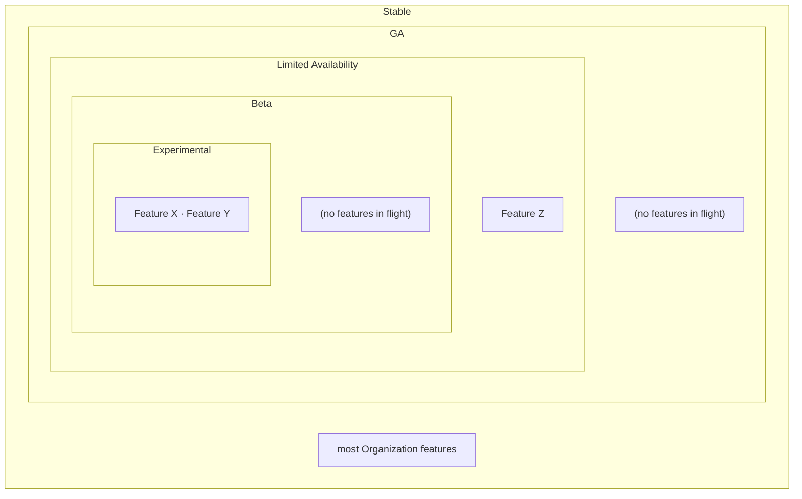
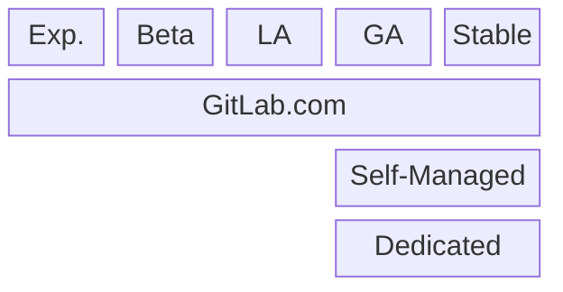
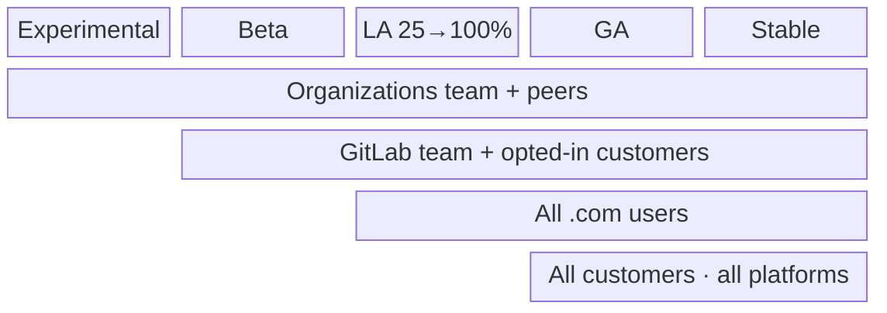

## 概要 {#overview}

Organization のステージは、全社的なプラクティスから大きく逸脱しています。これに正式な構造を提供することで、作業をリリーストンネルを通じて導き、誰もが（私たち自身、チーム、顧客が）物事の状況を把握できるようになります。

Organizations は、多くの機能で構成される **サーフェス** であり、それらの機能は必ずしも同時に同じリリースステージにあるとは限りません。顧客にとって、このサーフェスは単一のものとして提示されます。開発チームにとっては階層化されています — **ステージのオニオン（玉ねぎ）** であり、各層はその前の層よりも広範なオーディエンスとより多くのプラットフォームに到達します。機能は Experimental のコアから始まり、成熟するにつれて各層を通じて外側に拡大し、オーディエンスとプラットフォームの到達範囲を広げ、最終的に最も外側の Stable 層に落ち着きます。ステージは一時的なものです: 機能は蓄積されるのではなく、それらをすばやく通過し、すべての機能は最終的に Stable に到達し、もはやフィーチャーフラグの背後にはありません。

各層がステージであり、内部に表示される機能は、そのステージで現在進行中（in flight）のものです。各層はしばしば疎であるか空です — どの瞬間においても、ほとんどの機能はすでに Stable 層へと拡大し終えています。

## ステージの概要 {#stage-summary}

各ステージのスナップショット — そのオーディエンス、フィーチャーフラグ、ターゲットプラットフォーム、ロールバック:

| ステージ      | 対象者                                  | フラグ（`default_enabled`）            | プラットフォーム                       | ハンドブレーキ                                          |
| ------------- | -------------------------------------- | ------------------------------------- | ------------------------------------- | ------------------------------------------------------ |
| Experimental  | Organizations チームと選定されたピア    | `org_stage_experimental` (`false`) | GitLab.com                            | フラグ（GitLab 運用）                                  |
| Beta          | GitLab チーム + オプトインした顧客       | `org_stage_beta` (`false`)         | GitLab.com                            | フラグ（GitLab 運用）                                  |
| LA 25→100     | 顧客、25 / 50 / 75 / 100%               | `org_stage_la_25…100` (`false`)    | GitLab.com                            | フラグ（GitLab 運用）                                  |
| GA            | 全員                                    | `org_stage_ga` (`true`)            | GitLab.com + Self-Managed + Dedicated | 維持 — .com + Self-Managed; **Dedicated では無効**     |
| Stable        | 全員                                    | *(フラグ削除済み)*                     | すべてのプラットフォーム               | なし — 恒久的な製品                                     |

## ステージ {#stages}

作業は 5 つのステージを通って進みます。すべてのステージはまず GitLab.com で実行されます。Self-Managed と Dedicated は、機能が GA に到達して初めてそれを受け取ります:

**Exp.** = Experimental · **LA** = Limited Availability (25 → 50 → 75 → 100%)。

### 1. Experimental {#1-experimental}

- このステージは、.com 上の Organizations チームと選ばれたピアに「リリース」します。
- すべての実験的な作業は `org_stage_experimental` フィーチャーフラグの背後にあります。
- これは、大規模かつ/または複雑であり、反復的な改良を必要とするために未完成な作業の置き場です。例えば、オンボーディング、管理エリア、認証の作業など。

### 2. Beta {#2-beta}

- .com 上の GitLab チームとオプトインした顧客にリリースします。
- `org_stage_beta` フィーチャーフラグの背後に実装されます。

### 3. Limited Availability (LA) {#3-limited-availability-la}

- すべての .com ユーザーに、25%、50%、75%、100% の増分でリリースします。
- `org_stage_la_<increment>` フィーチャーフラグを利用します。

### 4. Generally Available (GA) {#4-generally-available-ga}

- すべての顧客にリリースします。
- すべてのプラットフォームにわたってリリースします。
- GA は概念的に、機能が **self-managed**（および Dedicated）にリリースされる場所であり、Organizations はこれを特別に扱います。
- `default_enabled: true` を持つ `org_stage_ga` フィーチャーフラグを使用します。
- このフラグは、.com と Self-Managed における緊急ブレーキとして保持されます。
- Dedicated 上では、このフラグは実質的に不活性（inert）です: デフォルトで有効になっているため機能は利用可能であり、Dedicated の顧客は
  [フィーチャーフラグを変更できません](https://docs.gitlab.com/subscriptions/gitlab_dedicated/#feature-flags)。
  [Dedicated での機能の有効化](https://docs.gitlab.com/development/enabling_features_on_dedicated/) に関する開発者向けガイダンスも参照してください。

### 5. Stable {#5-stable}

- 内部的な議論のために定義するステージですが、顧客にとっては重要ではありません。
- フィーチャーフラグのステージトンネルを終わらせます。
- Organization プロダクトのほとんどは、最終的にここに存在し、もはやフラグの背後にはありません。

## ステージを通じた進行 {#moving-through-the-stages}

機能はすべてのステージに触れる必要はありません。デフォルトのパスは
Experimental → Beta → LA → GA → Stable であり、いくつかのルールがあります:

1. **Experimental はオプション** — 適切な場合はスキップします。機能は Beta から始められます。
1. **Beta は必須** — スキップしないでください。
1. **LA は 100% に到達しなければならない** — 中間の増分（25 / 50 / 75）はスキップできますが、機能は GA の前に LA 100% に到達します。
1. **GA はすべての機能に強制されるわけではない** — それは重要な self-managed のリリースポイントですが、軽微な変更は直接 Stable に落ち着けます。
1. **機能をステージ間で進めるのは ChatOps ではなく MR で行う。** 機能を次のステージへ移動することはコード変更（そのステージフラグへの所属）であり、他のものと同様にレビューされます。
1. **機能を滞留させない。** あるステージに留まり続ける機能は問題の兆候です — 前に（または後ろに）移動させて解消します。レイヤー全体を引き戻す必要がある場合、ステージは ChatOps を通じて無効化できます（GA のハンドブレーキと同じ仕組みです）。



上記のルールはデフォルトのパスであり、厳密な要件ではありません。ロールアウトをきめ細かく制御する必要のある高リスクな機能は、完全に逸脱してよいです — 共有のステージフラグの代わりに、独自の機能ごとのフィーチャーフラグとオーダーメイドのロールアウト計画を使用します。



## リリースターゲット {#release-targets}

この構造の下で、私たちは次の対象にリリースします:

1. Beta で選ばれた顧客。
2. LA 100 ですべての .com 顧客。
3. GA ですべての顧客。

オーディエンスのアクセスは累積的です — 各グループは 1 つ後のステージで加わり、Stable までアクセスを保持するため、GA と Stable は一度に全員にサービスを提供します:

## なぜこの構造なのか {#why-this-structure}

これらのステージは、リリースの仕組み以上のものです — それらは Organizations チームが自身の作業を組織化する際の共有された構造です。

事前定義されたオーディエンスとターゲットプラットフォームを持つ一連の名前付きステージを定義することで、私たちの言語、プロセス、目標が整理され、整合されます。

事前定義されたオーディエンスとターゲットにより、機能ごとにオーディエンスとプラットフォームターゲットを絶えず再定義する負担を軽減します。

このモデルの下では、責任は 2 つの機能（function）間でクリーンに分割され、それぞれがステージのトンネルを通じて作業を進めることに集中できます:

- **Engineering** は、標準化されたリリースステージを通じてコードを押し進めます。
- **Product** は、Engineering、他のチーム、顧客にわたってステージを整合させます。

事前定義されたステージは、フィーチャーフラグの作成と維持の負担と摩擦を軽減します。今日、各エンジニアは機能のフラグのライフサイクルを自分で考え出す必要があります: GitLab の標準的な漸進的ロールアウトは Organization のニーズに合わず、機能ごとに状態遷移を計算するのは不合理に複雑であり、そのオーバーヘッドはフラグを使うこと自体を躊躇させます。機能が通過する共有のステージフラグが、その機能ごとの負担を取り除きます。

experimental ステージは、beta に入れられないエンジニアリング作業を着地させるためのバケツを提供します。このステージがなければ、「未完成」の MR として陳腐化したまま放置される作業が生じます。

## 全社的なフィーチャーフラグライフサイクルとの関係 {#relationship-to-the-company-wide-feature-flag-lifecycle}

これらのステージは、GitLab の標準的な
[フィーチャーフラグライフサイクル](/handbook/product-development/how-we-work/product-development-flow/feature-flag-lifecycle/) の上に位置し、それから逸脱します。標準プロセスは個々の機能がどのようにフラグ化されロールアウトされるかを管理します。Organizations サーフェスについては、上記で説明した追加の構造を適用します。両者が異なる場合、このページが Organizations の作業を統括します。

私たちがどのように逸脱するか:

- **機能ごとのライフサイクルではなく、共有のステージフラグ。** すべての機能が独自のフィーチャーフラグライフサイクルを定義し駆動する代わりに、サーフェスは小さく固定された一連の名前付きステージフラグ（`org_stage_experimental`、`org_stage_beta`、`org_stage_la_<increment>`、`org_stage_ga`）を使用します。機能は成熟するにつれてこれらのフラグを通過するため、エンジニアは機能ごとにロールアウト計画 — オーディエンス、プラットフォーム、増分 — を再計算しません。
- **事前定義されたオーディエンスとプラットフォーム。** 各ステージは固定されたオーディエンスとターゲットプラットフォームのセットを持つため、機能ごとに再定義しません。
- **保持される GA「ハンドブレーキ」。** ロールアウト後すぐにフラグを削除するのではなく、`org_stage_ga` フラグは Stable ステージまで、サーフェス全体の緊急ブレーキとして保持されます。
- **Experimental ステージ。** Beta の準備ができていない、大規模/複雑で未完成な作業のための、明示的な Beta 前の置き場を追加します。
