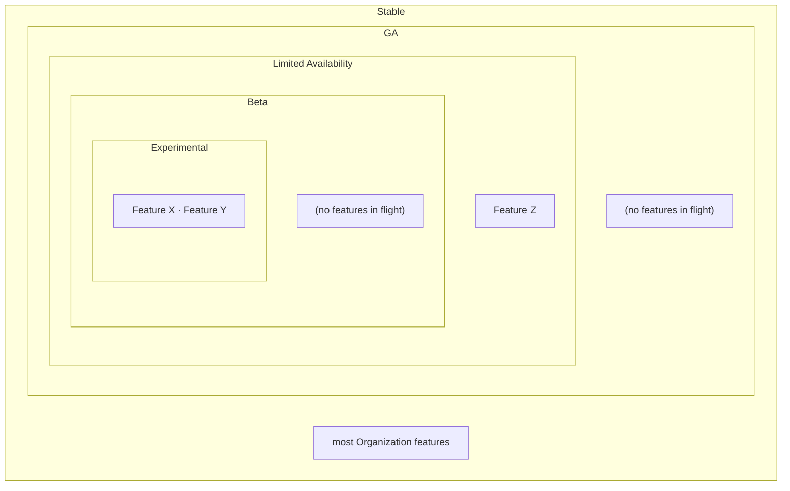
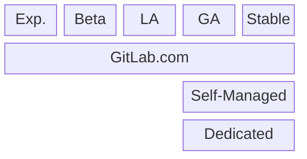
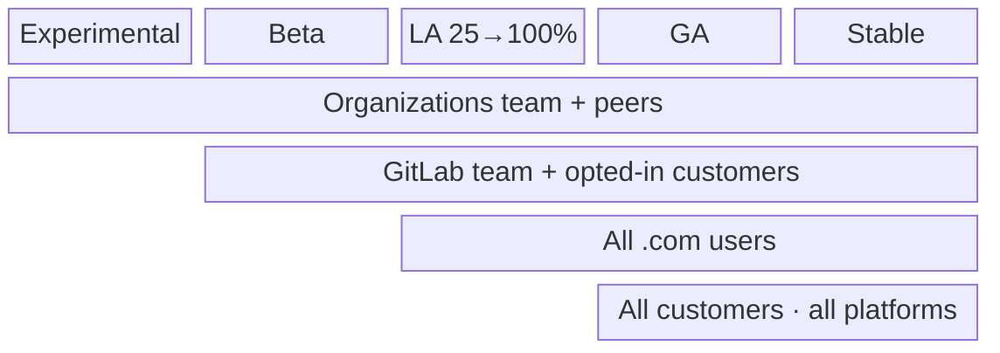

## 概要 {#overview}

Organization のステージは、全社的なプラクティスからかなり逸脱しています。これに関する
正式な構造を提供することは、リリーストンネルを通じて作業を導き、すべての関係者
（私たち自身、チーム、顧客）が物事がどの段階にあるかを把握できるようにするのに役立ちます。

Organizations は多くの機能で構成される **面（サーフェス）** であり、それらの機能は必ずしも
同時に同じリリースステージにあるわけではありません。顧客にとって、この面は
単一のものとして提示されます。開発チームにとっては階層的であり、**ステージの玉ねぎ** であって、
各層が前の層よりも広い対象者とより多くのプラットフォームに到達します。機能は Experimental の中核から始まり、
成熟するにつれて層を通じて外側に広がり、対象者とプラットフォームの範囲を広げながら、最終的に外側の
Stable 層に落ち着きます。ステージは一時的なものです。機能はそこに蓄積されるのではなく素早く通過し、
すべての機能は最終的に Stable に到達し、もはやフィーチャーフラグの背後にはありません。

対象者は常に拡大するだけであり、2 つの軸があります:

- **セグメント** — 機能にアクセスできる人: Organizations チーム、次に GitLab チーム
  メンバーとオプトインした顧客、次にすべての GitLab.com 顧客、そして全員。
- **プラットフォーム** — 機能が実行される場所: 最初は GitLab.com、次に GA で GitLab Self-Managed と
  GitLab Dedicated。

各ステージは、この拡大する面上の 1 点です。より高いステージでは、一方または
両方の軸で対象者が広がり、狭まることはありません。そのためアクセスは累積的であり、
以前の小さなセグメントで利用可能だった機能は、外側へ拡大してもそのアクセスを維持します。

各層はステージであり、内側に表示される機能はそのステージで現在進行中のものです。
層はしばしばまばらか空です。どの瞬間においても、ほとんどの機能はすでに Stable 層へと
広がり出ています。

## ステージのまとめ {#stage-summary}

各ステージのスナップショット、つまりその対象者、フィーチャーフラグ、対象プラットフォーム、ロールバック:

| ステージ      | 対象者                                 | フラグ (`default_enabled`)            | プラットフォーム                      | 緊急ブレーキ                                           |
| ------------- | -------------------------------------- | ------------------------------------- | ------------------------------------- | ------------------------------------------------------ |
| Experimental  | Organizations チームと選ばれた仲間     | `org_stage_experimental` (`false`) | GitLab.com                            | フラグ（GitLab が運用）                                |
| Beta          | GitLab チーム + オプトインした顧客     | `org_stage_beta` (`false`)         | GitLab.com                            | フラグ（GitLab が運用）                                |
| LA 25→100     | 顧客、25 / 50 / 75 / 100%              | `org_stage_la_25…100` (`false`)    | GitLab.com                            | フラグ（GitLab が運用）                                |
| GA            | 全員                                   | `org_stage_ga` (`true`)            | GitLab.com + Self-Managed + Dedicated | 保持 — .com + Self-Managed；**Dedicated では無効**     |
| Stable        | 全員                                   | *(フラグ削除済み)*                    | すべてのプラットフォーム              | なし — 恒久的なプロダクト                              |

## ステージ {#stages}

作業は 5 つのステージを通って進みます。すべてのステージは最初に GitLab.com で実行されます。Self-Managed
と Dedicated は、機能が GA に到達して初めてそれを受け取ります:

**Exp.** = Experimental · **LA** = Limited Availability (25 → 50 → 75 → 100%)。

### 1. Experimental {#1-experimental}

- このステージは、.com 上の Organizations チームと選ばれた仲間に「リリース」します。
- すべての Experimental の作業は、`org_stage_experimental` フィーチャーフラグの背後にあります。
- これは、大規模および／または複雑で反復的な改善を必要とするために未完成な作業のための
  場所です。たとえば、オンボーディング、管理エリア、認証作業など。

### 2. Beta {#2-beta}

- .com 上の GitLab チームとオプトインした顧客にリリースします。
- `org_stage_beta` フィーチャーフラグの背後に実装されます。

### 3. Limited Availability (LA) {#3-limited-availability-la}

- すべての .com ユーザーに、25%、50%、75%、100% の増分でリリースされます。
- `org_stage_la_<increment>` フィーチャーフラグを利用します。

### 4. Generally Available (GA) {#4-generally-available-ga}

- すべての顧客にリリースされます。
- すべてのプラットフォームでリリースされます。
- GA は概念的に、機能が **Self-Managed**（および Dedicated）にリリースされる場所であり、
  Organizations はこれを特別に扱います。
- `default_enabled: true` を持つ `org_stage_ga` フィーチャーフラグを使用します。
- このフラグは、.com と Self-Managed における緊急ブレーキとして保持されます。
- Dedicated では、このフラグは事実上無効です。デフォルトで有効になっているため
  機能は利用可能であり、Dedicated の顧客は
  [フィーチャーフラグを変更できません](https://docs.gitlab.com/subscriptions/gitlab_dedicated/#feature-flags)。
  [Dedicated での機能の有効化](https://docs.gitlab.com/development/enabling_features_on_dedicated/)に関する
  開発者向けガイダンスも参照してください。

### 5. Stable {#5-stable}

- 内部の議論のために定義するステージですが、顧客にとっては重要ではありません。
- フィーチャーフラグステージのトンネルを終わらせます。
- Organization プロダクトのほとんどは最終的にここに存在し、もはやフラグの背後にはありません。

## ステージ間の移動 {#moving-through-the-stages}

機能はすべてのステージに触れる必要はありません。デフォルトのパスは
Experimental → Beta → LA → GA → Stable で、いくつかのルールがあります:

1. **Experimental は任意です** — 適切な場合はスキップしてください。機能は Beta から始めることができます。
1. **Beta は必須です** — スキップしないでください。
1. **LA は 100% に到達する必要があります** — 中間の増分（25 / 50 / 75）はスキップできますが、
   機能は GA の前に LA 100% に到達します。
1. **GA はすべての機能に強制されるわけではありません** — それは重要な Self-Managed のリリースポイントですが、
   小さな変更は直接 Stable に落ち着くことができます。
1. **機能はステージを ChatOps ではなく MR で進めてください。** 機能を
   次のステージに移動することはコード変更（そのステージフラグのメンバーシップ）であり、他のものと同様にレビューされます。
1. **機能を滞留させないでください。** あるステージに留まっている機能は問題の兆候です。前方（または後方）に
   移動することで解決してください。層全体を引き戻す必要がある場合は、ChatOps を通じてステージを無効化
   できます（GA の緊急ブレーキと同じメカニズム）。



上記のルールはデフォルトのパスであり、厳格な要件ではありません。ロールアウトに対する
きめ細かい制御を必要とするハイリスクな機能は、完全に逸脱することがあります。共有のステージフラグの代わりに、
独自の機能ごとのフィーチャーフラグと特注のロールアウト計画を使用します。



## リリース対象 {#release-targets}

この構造のもとで、私たちは以下にリリースします:

1. Beta では選ばれた顧客。
2. LA 100 ではすべての .com 顧客。
3. GA ではすべての顧客。

対象者のアクセスは累積的です。各グループは 1 つ後のステージで加わり、
Stable を通じてアクセスを保持するため、GA と Stable は全員に同時にサービスを提供します:

## なぜこの構造なのか {#why-this-structure}

これらのステージは単なるリリースメカニズム以上のものです。それらは Organizations チームが
作業を組織する際の共有された構造です。

事前定義された対象者と対象プラットフォームを持つ名前付きステージのセットを定義することで、私たちの
言語、プロセス、目標が整理され、一致します。

事前定義された対象者と対象があることで、機能ごとに対象者とプラットフォームの対象を
絶えず再定義する負担を軽減します。

このモデルのもとで、責任は 2 つの機能の間できれいに分かれ、それぞれが
ステージのトンネルを通じて作業を進めることに集中できます:

- **エンジニアリング** は、標準化されたリリースステージを通じてコードを進めます。
- **プロダクト** は、エンジニアリング、他のチーム、顧客にまたがってステージを一致させます。

事前定義されたステージは、フィーチャーフラグの作成と保守の負担と摩擦を軽減します。
今日、各エンジニアは機能のフラグライフサイクルを自分で
解決する必要があります。GitLab の標準的な増分ロールアウトは Organization のニーズに合わず、
機能ごとに状態遷移を計算するのは不当に複雑であり、そのオーバーヘッドが
そもそもフラグを使うことを思いとどまらせます。機能が通過する共有のステージフラグは、その
機能ごとの負担を取り除きます。

Experimental ステージは、Beta に入れることができないエンジニアリング作業を着地させる
ための受け皿を提供します。このステージがなければ、作業は「未完成」の MR として滞留することになります。

## 全社的なフィーチャーフラグライフサイクルとの関係 {#relationship-to-the-company-wide-feature-flag-lifecycle}

これらのステージは、GitLab の標準的な
[フィーチャーフラグライフサイクル](/handbook/product-development/how-we-work/product-development-flow/feature-flag-lifecycle/)の上に位置し、
そこから逸脱します。標準プロセスは、個々の機能がどのようにフラグ付けされロールアウトされるかを管理します。
Organizations の面については、上記で説明した追加の構造を適用します。それらが
異なる場合、Organizations の作業はこのページが管理します。

私たちがどのように逸脱するか:

- **機能ごとのライフサイクルではなく、共有のステージフラグ。** すべての機能が
  独自のフィーチャーフラグライフサイクルを定義し駆動する代わりに、この面は小さく固定された一連の
  名前付きステージフラグ（`org_stage_experimental`、`org_stage_beta`、
  `org_stage_la_<increment>`、`org_stage_ga`）を使用します。機能は成熟するにつれてこれらのフラグを
  通って移動するため、エンジニアは機能ごとにロールアウト計画（対象者、プラットフォーム、
  増分）を再計算しません。
- **事前定義された対象者とプラットフォーム。** 各ステージには固定された対象者と対象
  プラットフォームのセットがあるため、機能ごとにそれらを再定義しません。
- **保持される GA「緊急ブレーキ」。** ロールアウト直後にフラグを削除するのではなく、
  `org_stage_ga` フラグは Stable ステージまで、面全体の緊急ブレーキとして
  保持されます。
- **Experimental ステージ。** Beta の準備ができていない大規模／複雑で
  未完成な作業のために、明示的な Beta 前の場所を追加します。
