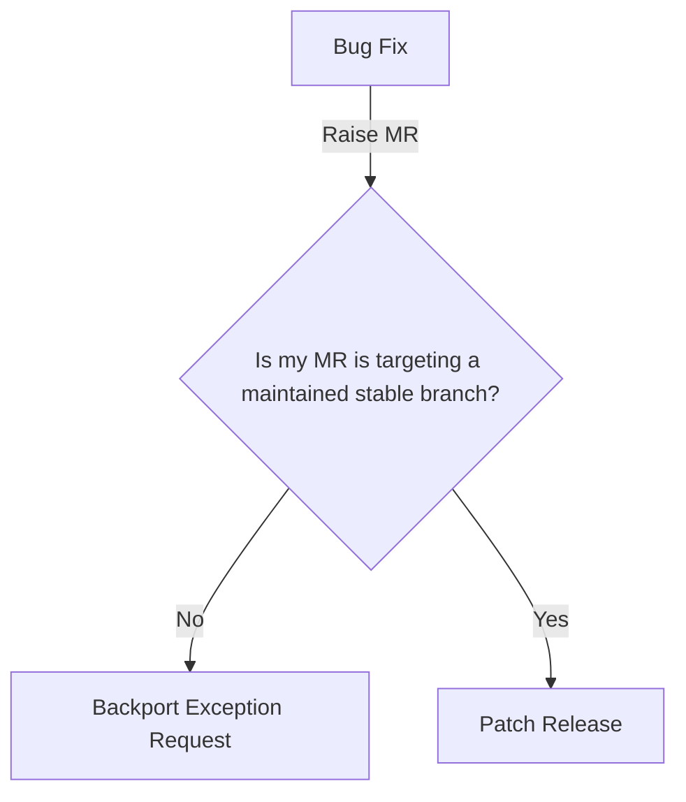

## バックポートの概要

このセクションでは、GitLab におけるバックポートに関する混乱を解消することを目的としています。質問がある場合は、このページに MR を作成するか、[Delivery グループ](/handbook/engineering/infrastructure-platforms/gitlab-delivery/delivery/)にお問い合わせください。また、[バックポート FAQ](/handbook/engineering/releases/backports/#backports-faq) もご確認ください。

### バックポートにはどの種類のリリースが必要ですか？

このフローチャートを使用して、必要なプロセスを確認してください。フローチャートの末端はクリックできるリンクになっています。

### バックポートの原則

- バックポートは[メンテナンスポリシー](https://docs.gitlab.com/ee/policy/maintenance.html)に従って提供され、そのポリシー外のバックポート例外はベストエフォートベースで提供され、保証はありません
- リリースマネージャーはメンテナンスポリシーでカバーされないバックポートについて最終的な判断権を持ちます
- リリースマネージャーは顧客が過度な量のアップグレードを受けないよう、バックポートを含むリリースをスケジュールします
- バックポート MR の作成者は、すべての修正における十分なテストカバレッジを確保する責任があります。同じ MR 内でテストシナリオを自動化できない場合、修正がマージされて各リリース環境にデプロイされた後、作成者が手動検証を行う責任があります。テスト設計に助けが必要な場合は、[テストガバナンス RFH](/handbook/engineering/infrastructure-platforms/developer-experience/test-governance/#request-for-help-process) プロセスを使用してください。

### バックポートプロセスの概要

このセクションではエンドツーエンドのプロセスの概要を説明します。

バックポートは複数のステップからなるプロセスです。バックポートを開発してデプロイするための基本的な手順を以下に示します: 以下の手順のリストはバックポートに関わる一般的なタスクを示したものであり、すべてを網羅するものではなく、すべての事態をカバーするものではありません。

1. エンジニアがパッチまたは更新が必要なソフトウェアバージョン内の Issue を特定します。
1. エンジニアが同じソフトウェアの新しいバージョンで利用可能なパッチ、更新、修正内容を確認します。
1. エンジニアが古いコードバージョンと互換性を持つよう修正を適応させます。
1. エンジニアが修正を追加するために必要な MR を作成します。
1. エンジニアがバックポートされたコードまたはバックポートパッケージがシステム内で完全な機能を維持していることを確認するための堅牢なテストを実施します。
1. エンジニアが前のステップで特定された望ましくない副作用に対処します。必要な回数繰り返します。
1. リリースマネージャーが修正を含む新しいリリースにタグを付けます。
1. リリースマネージャーが公式リリースを作成します。
1. リリースマネージャーが新しいタグ付きバージョンでリリースを公開します。

バックポートは、プロセスに関わるチームや個人間で多くのやり取りが必要な非常に複雑なプロセスになる場合があります。

### バックポートがメンテナンスポリシーでカバーされているかどうかを確認するには？

[メンテナンスポリシー](https://docs.gitlab.com/ee/policy/maintenance.html)でどの GitLab バージョンがカバーされているかを確認できます。

### バックポートがメンテナンスポリシーでカバーされていない場合は？ {#what-if-my-backport-is-not-covered-by-the-maintenance-policy}

[メンテナンスポリシー](https://docs.gitlab.com/policy/maintenance/#maintained-versions)外のバージョンへのバックポートは例外であり、Delivery/Platforms 組織内のエンジニアリングリーダーシップ（Senior Engineering Manager 以上）の承認が必要です。これは他のリリースポリシー例外と同じ[例外プロセス](/handbook/engineering/releases/#exception-process)に従います。

バックポート例外をリクエストするには:

1. [バックポートリクエスト](https://gitlab.com/gitlab-org/release/tasks/-/work_items/new?description_template=Exception-request)を作成します
1. 詳細な手順はこのテンプレートにあります。
1. リリースマネージャーは書面による承認を受けてから実行します
1. リリースが[リリースブログ](https://about.gitlab.com/releases/categories/releases/)で利用可能になった場合/なった時にステークホルダーに伝達します

バックポート例外はケースバイケースで評価され、保証はありません。

## バックポート FAQ

### バックポートとは？

バックポートとは、最新のソフトウェアバージョンからソフトウェア修正または更新を取り出し、それを同じソフトウェアの古いバージョンに適用することです。

このプロセスは、数行のコードを更新するだけで済む単純なものから、密接な調整が必要な複数の領域にわたる大規模な改修まで、さまざまです。後者の場合、最新バージョンにアップグレードすることと比べて、バックポートの適用は現実的でない場合があります。

GitLab では、[メンテナンスポリシー](https://docs.gitlab.com/ee/policy/maintenance.html)に従ってセキュリティ修正とバグ修正をバックポートしています。

### パッチリリースと同じですか？

いいえ、違います。バックポートは、新しいバージョンのソフトウェアから古いバージョンに更新やパッチを適用するあらゆる活動の総称です。GitLab では、[メンテナンスポリシー](https://docs.gitlab.com/ee/policy/maintenance.html)に従って適用される特定の[パッチリリースプロセス](/handbook/engineering/releases/patch-releases/#patch-release-overview)があります。メンテナンスポリシーの範囲外のバックポートには別の[例外プロセス](https://docs.gitlab.com/ee/policy/maintenance.html#backporting-to-older-releases)があり、ベストエフォートベースで提供され、保証はありません。

### バグ修正/セキュリティ Issue のバックポートを得るには？

バックポートがバグまたはセキュリティ修正であり、メンテナンスポリシーでカバーされている場合は、[パッチリリースプロセス](/handbook/engineering/releases/patch-releases/#patch-release-process)に従ってください。

メンテナンスポリシー外のものについては、[例外プロセス](/handbook/engineering/releases/backports/#what-if-my-backport-is-not-covered-by-the-maintenance-policy)に従ってください。

### プロダクトマネージャーはバックポートの承認時に何を考慮すべきですか？

バックポートでは複数のエンジニアが複数のバージョンに修正を適用する必要があり、時間を多く要します。バックポートリクエストをレビューする際は、プロダクトマネージャーは[バックポートポリシー](https://docs.gitlab.com/ee/policy/maintenance.html#backporting-to-older-releases)を参照して、バックポート提案が基準を満たしていることを確認する必要があります。プロダクトマネージャーは、重大度、優先度、顧客への影響、およびバックポートをしない場合の潜在的なリスクが承認前に適切に文書化されていることを確認する必要があります。

### バックポートの一般的な問題と考慮事項

#### リリースマネージャーとユーザーキャパシティの追加負荷

バックポートは集中的であり、正確に完了させて成功裏に提供するために異なるグループ間で多くのやり取りが必要です。このプロセスを完了するために相当な時間を確保する必要がある可能性が高いです。

#### 長期サポートとメンテナンスコスト

バックポートは古いバージョンのソフトウェアのセキュリティ上の欠陥や脆弱性に対処する効果的な方法です。ただし、各バックポートはシステムアーキテクチャ内に相当な複雑さをもたらし、メンテナンスにコストがかかる場合があります。

たとえば、Python 2.7.18 は Python 2 の最後の公式リリースでした。セキュリティパッチを最新の状態に保ち、Python が提供するすべての新しい開発の恩恵を受け続けるために、組織は Python 3 にアップグレードするか、要件をフリーズしてレガシー長期サポートにコミットする必要がありました。

#### バックポートの副作用

各バックポートはアプリケーション環境内に多くの望ましくない副作用を生む可能性があります。アップストリームのソフトウェアアプリケーションがすべてのダウンストリームアプリケーションに影響するように、コアソフトウェアに適用されたバックポートも同様に影響します。

#### セキュリティへの追加的な影響と脆弱性

バックポートは IT 環境内の既知のバグに対処する一般的な手法です。同時に、レガシーコードベースに依存することは、組織にとって他の重大なセキュリティ上の影響をもたらす可能性があります。古いまたはレガシーコードに依存すると、環境に弱点や脆弱性が生じる可能性があります。これらの問題はメインアプリケーションだけでなく、すべての依存ライブラリやパブリックリポジトリへのフォークされたアプリケーションにも影響します。各バックポートが組織の全体的なセキュリティ戦略と IT アーキテクチャにどのように適合するかを考慮することが重要です。
