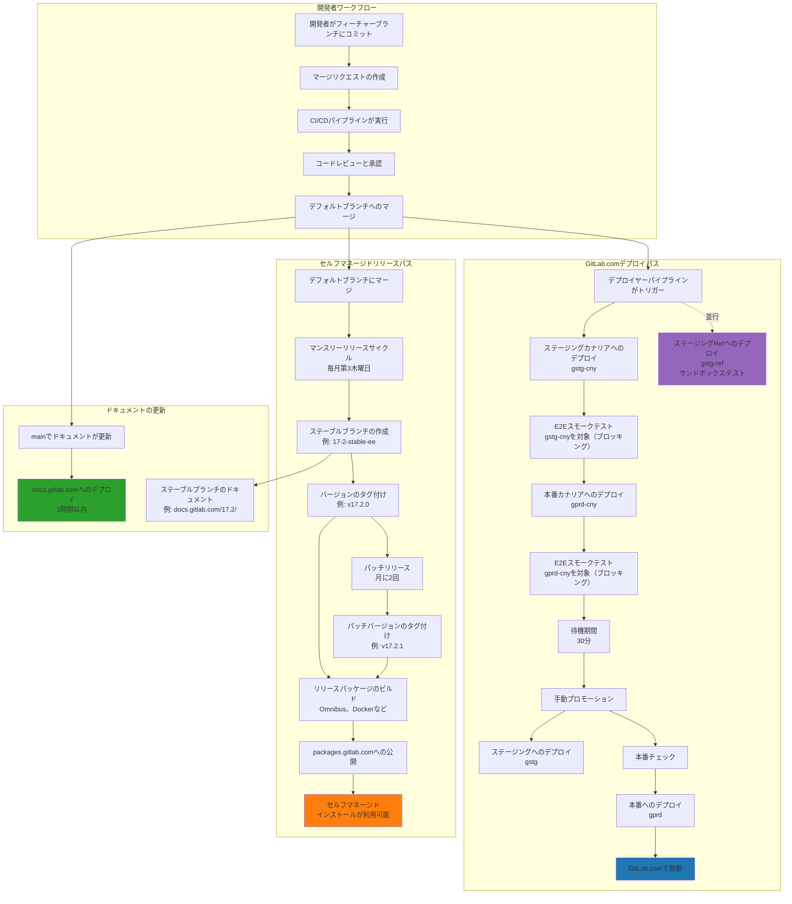

## GitLabのデプロイワークフロー

以下の図は、開発者のコミットからGitLab.comへの本番デプロイおよびセルフマネージドリリースまでの完全なデプロイワークフローを示しています。

## デプロイ後のマイグレーション

デプロイ後のマイグレーションには専用のワークフローがあり、特定の時間枠内に実行されることは保証されません。デプロイチームは必要と判断したときに実行する権限を持っています。ただし、これらは常にリリース管理タスクの前に実行されます。

詳細については、デプロイハンドブックの[デプロイ後マイグレーション（PDM）の実行](/handbook/engineering/deployments-and-releases/deployments/#post-deploy-migration-pdm-execution)セクションを参照してください。

## 関連ドキュメント

デプロイプロセスの追加コンテキストについては、デプロイとリリースハンドブックの[パッケージのデプロイ](/handbook/engineering/deployments-and-releases/deployments/#deploying-packages)セクションを参照してください。
