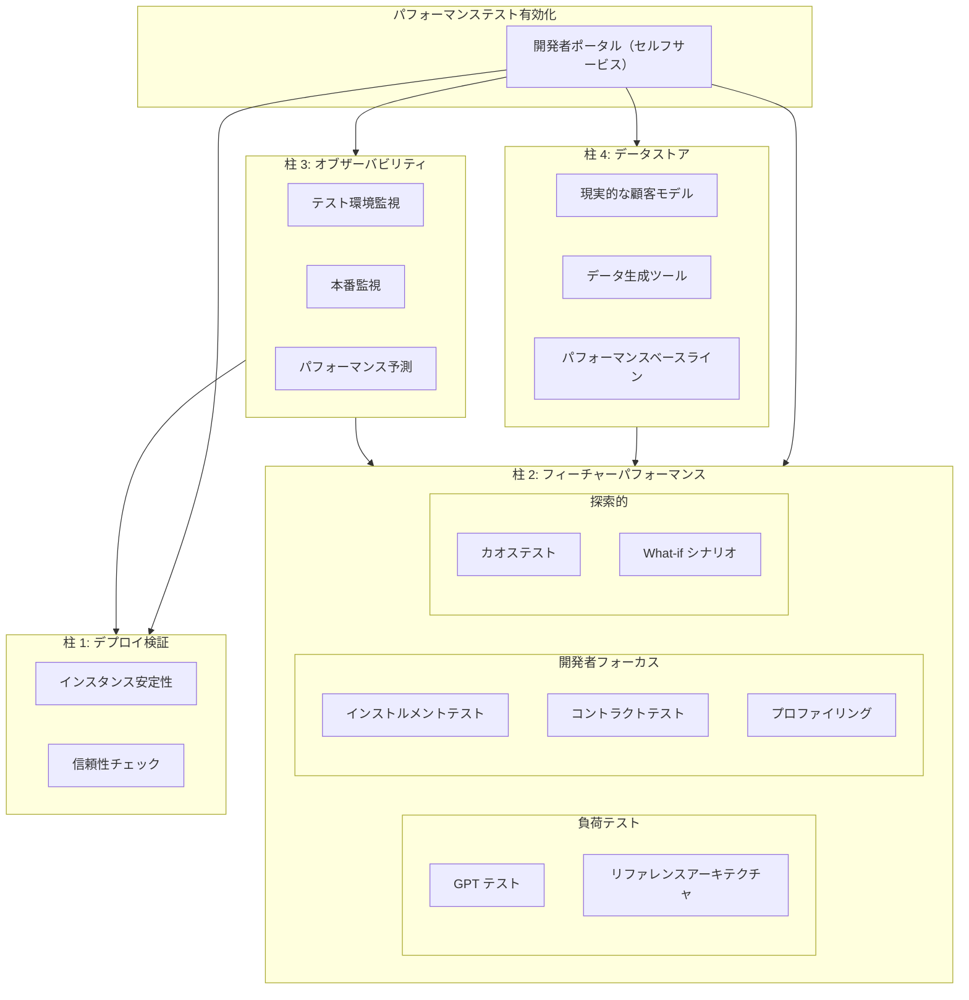

## 概要

セルフマネージド、Dedicated、SaaS の間で、デプロイが必要な大量の GitLab インスタンス（テナントとセル）が実行されることになります。デプロイするたびに、デプロイが成功してインスタンスが正常に起動したことを確認する必要があります。E2E（エンドツーエンド）テストスクリプトを使用してデプロイを検証することができます。ただし、これは非常に遅く、コストが高く、侵襲的なアプローチです。E2E テストは GitLab の UI/API を通じて動作するため、機能の変更（まだ活発に開発中のアプリケーションでは頻繁に発生します）に対して脆弱で、多くの場合は管理者アクセスを必要とし、テスト対象のインスタンスにデータを生成します。これらの 3 つはすべて、顧客向けインスタンスではあまり望ましくありません。

実行する必要があるチェックの多くは、E2E の観点からテストして報告することが困難または苦痛です。たとえば、GitLab インスタンスがすべてのデータストアに正しく接続できるかどうかの検証は、E2E シナリオでは間接的にしかテストできません。何らかの機能が動作しないことを見つけることによってですが、データストアにアクセスできなかったから動作しなかったのか、それともフィーチャーフラグが有効になっていなかったからなのか…?

より良いアプローチは、GitLab のエンドポイント / ヘルスチェックを強化して、インスタンスが正しく設定されてレスポンスを受け取っていることを教えてもらえるようにすることです。そうすれば、チェックに関する直接的な情報を得ることができます。

### アプローチ

デプロイ検証チェックは 3 つのアプローチに分けられます：

1. 問題が検出されたときに GitLab のレポートを改善してアラートを発する（インスタンスが S3 に接続できているか）
2. コンポーネントが正しく設定されているかを検出するためにパイプラインで実行できる特定のチェックを追加する（S3 が接続できるように正しく設定されているか）
3. 上記の 2 つが完了したら、GitLab インスタンスがコンポーネントを意図した通りに使用しているかを検証するために E2E テストを実行する価値があるかを判断する（GitLab が将来の分析のためにランの結果を S3 にプッシュできるか）。注意：事実上すべてのユースケースで、このパスは開発サイクルの早い段階で実行される GitLab 機能テストと重複しており、デプロイの一部として設定ではなく GitLab 機能をテストする特定の必要性が特定された場合にのみ実行してください。

## チェック

これは、テストサポートの開発に取り組んでいるチェックとして特定されたもののリストです：

| チェック名 | 説明 | 備考 |
| ---------- | ---- | ---- |

## E2E テスト

このページが文書化しているテストのほとんどは非 E2E テストです。このセクションは、E2E テストで最もよくカバーされるシナリオを記載するためのスペースを提供します。

| シナリオ | 説明 | カバーするテスト |
| -------- | ---- | --------------- |
