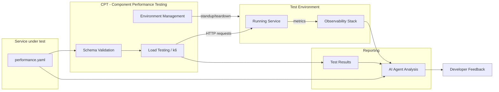
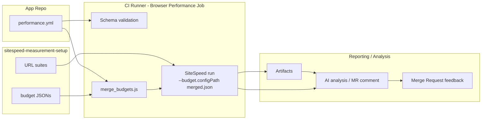

{}
このページでは、パフォーマンスコントラクトのスキーマと導入ガイドについて説明します。システム全体の設計、根拠、未決定の事項については、[モジュラーフィーチャー向けのパフォーマンステスト 設計ドキュメント](/handbook/engineering/infrastructure-platforms/developer-experience/design-documents/performance_contracts/)を参照してください。スキーマは Milestone 1 で確定中であり、[#4407](https://gitlab.com/gitlab-org/quality/quality-engineering/team-tasks/-/work_items/4407) で環境ツールが選定され次第、正式なリポジトリの保存場所へ移動されます。
{}

## Overview

コントラクトテストとは、サービスの外部インターフェースを定義し、そのサービスがどのように振る舞うかを規定する、機械可読な「コントラクト（契約）」を記述するプラクティスです。このアプローチには、次のようないくつかの利点があります。

- **テスト可能な合意** - 自動テストがコントラクトが破られていないことを検証します
- **明確なインターフェース** - 外部サービスが安心して連携を設計できます
- **破壊的変更の検出** - 自動検証が互換性のない変更を捉えます

パフォーマンスコントラクトは、この概念をモジュラーフィーチャーのパフォーマンス特性にまで拡張したものです。パフォーマンス目標を検証済みの YAML ファイル（`performance.yaml`）にエンコードすることで、チームは次のメリットを得られます。

- **より早期の回帰検出** - すべての MR がコントラクトに対して検証されます
- **AI を意識したパフォーマンスガバナンス** - AI コーディングアシスタントが具体的で機械可読なパフォーマンスルールを利用できます
- **標準化された導入** - 任意のモジュラーフィーチャーで再利用できるコントラクトスキーマと検証ツールキット

## Scope

パフォーマンスコントラクトは、CI からアクセス可能な環境で動作するモジュラーフィーチャーサービスを対象としています。明示的に対象外となるものの一覧については、[モジュラーフィーチャー向けのパフォーマンステスト 設計ドキュメント](/handbook/engineering/infrastructure-platforms/developer-experience/design-documents/performance_contracts/)を参照してください。

現在のイテレーションにおける主な境界は次のとおりです。

- **本番環境の SLO ツールではない** - コントラクトは SLO の参考にはなりますが、SLO を置き換えるものではありません
- **ローカルテストツールではない** - コントラクトテストは、開発者のノート PC ではなく、CI 内の一時的な環境に対して実行されます（ローカル実行は将来のイテレーションで予定されています）
- **組み合わせテストツールではない** - 各サービスのコントラクトは独立して検証されます。サービス間連携のパフォーマンスは対象外です

## Contract Types

パフォーマンスコントラクトは、ワークロードの種類や対象とするメトリクスに応じて、相互に補完し合う複数のツールアプローチを使って実装されます。私たちがサポートする 3 つの主要なコントラクトタイプは次のとおりです。

- **フロントエンド／UI コントラクト（SiteSpeed）** — ページ読み込みおよびブラウザレベルのメトリクス（FCP、LCP、CLS、TBT、パフォーマンススコア、ユーザージャーニー）。
- **バックエンド／サービスコントラクト（k6 / CPT）** — 低〜中程度の負荷下におけるサービスレベルのレイテンシとスループット。CPT が実行する k6 シナリオ。
- **API／OpenAPI 由来コントラクト（TBD）** — OpenAPI 仕様からのパフォーマンスチェックの自動生成。コンセプトレベルの作業を進行中。

各コントラクトタイプは同じ正式なエントリーポイント（`performance.yml`）を共有しますが、それぞれ異なる実行ツールと CI パターンにマッピングされます。以降のセクションでは、フロントエンド SiteSpeed バリアントを詳しく説明し、バックエンドおよび API アプローチについては概要レベルで触れます。

## Architecture

### Backend / Service Contracts

パフォーマンスコントラクトシステムは次のように動作します。



環境管理とテスト実行のツールとして [CPT（Component Performance Testing）](https://gitlab.com/gitlab-org/quality/component-performance-testing)の採用が確定しています。CPT は次を処理します。

- **環境のライフサイクル** - MR の実行ごとに GCP 上のテスト環境（Docker コンテナまたは CNG インスタンス）をプロビジョニングおよびティアダウンします
- **負荷テストの実行** - テスト対象のサービスに対して k6 テストを実行します
- **MR へのフィードバック** - テスト結果を、トリガーとなったマージリクエストにコメントとして投稿します

CPT は Milestone 2 で拡張され、`performance.yaml` を入力として受け取り、コントラクトから k6 シナリオとしきい値を動的に生成できるようになります。スキーマ検証のアプローチ（CPT 内に置くか別リポジトリに置くか）は、Milestone 2 で解決される未決定の事項です。詳しい根拠については[設計ドキュメント](/handbook/engineering/infrastructure-platforms/developer-experience/design-documents/performance_contracts/)を参照してください。

### Frontend / UI contracts

フロントエンドのパフォーマンスコントラクトについては、SiteSpeed バジェットを使った、軽量で開発者中心のワークフローをサポートしています。主な設計上の選択は次のとおりです。

- バジェットは、`sitespeed-measurement-setup` リポジトリの `performance/` ディレクトリ内で、テスト URL リストと並べて配置されます。これにより URL とバジェットを一緒にバージョン管理でき、開発者のローカル実行も簡単になります。
- メインリポジトリには `performance.yml` エントリが含まれ、これが CI の起点として機能します。このエントリは、`sitespeed-measurement-setup` サブモジュール内の環境バジェットと、任意のチームごとのバジェットファイルを参照します。
- CI 実行時には、選択された環境バジェットが、任意のチームごとのバジェットとマージされます。マージのセマンティクスは意図的にシンプルにしています。バジェットは SiteSpeed のネイティブなネスト形式を使用し、各セクション内ではチームのエントリがメトリクスレベルで環境のエントリを上書きし、URL／エイリアスをキーとする上書きはグローバルなセクションのデフォルトとは独立してマージされます。
- MR レベルの SiteSpeed 実行は、デフォルトでは参考扱い（advisory）です（MR ジョブは Browser-Performance パターンを使ってパイプライン内でローカルに SiteSpeed を実行し、マージ済みバジェットを `--budget.configPath` 経由で使用します）。MR の実行は `allow_failure: true` であり、MR ラベルまたは手動トリガーによるオプトイン方式です。



`sitespeed-measurement-setup` リポジトリ内のファイルとヘルパー（レイアウト例）:

```plaintext
performance/
  README.md
  schema/budget.schema.json
  budgets/
    default.json
    environments/{production,staging,mr}.json
    teams/{<team>.json}
  scripts/
    validate_budget.js
    merge_budgets.js
```

`validate_budget.js` は JSON スキーマ検証を実行します。`merge_budgets.js` は「チームが環境を上書きする」セマンティクスを実装したマージ済みバジェット JSON を生成します。CI では、バジェットを変更する PR に対して検証ツールを実行すべきです。

開発者のフロー（概要）:

1. 開発者は `sitespeed-measurement-setup` で URL リストとバジェットを編集し、MR を作成します。
2. MR ジョブ（オプトイン）は、環境バジェットとチームバジェットをマージし、レビューアプリの URL に対してジョブ内でローカルに SiteSpeed を実行し、アーティファクトと `browser_performance` レポートを生成します。
3. このジョブは参考扱いです。チームはより厳格な強制に移行する前に、バジェットを反復的に調整します。

## The `performance.yml` Contract

`performance.yml` ファイルは、このシステムの唯一のエントリーポイントです。コントラクトツール、負荷テストの実行、AI 分析を駆動します。このファイルは次を定義します。

- コントラクトのメタデータ（バージョン、サービスの識別情報と説明）
- フロントエンド設定（名前空間化された `frontend` オブジェクト: budgets、teams、default_budget、任意の `enabled`）。フロントエンドバジェットのマージセマンティクス（`(url,metric)` の衝突時にチームが環境を上書きする）は、フロントエンドバジェットオブジェクトの解釈方法の一部です。
- バックエンドエンドポイントのカテゴリ（latency_p95_ms、latency_p99_ms、error_rate_threshold などのパフォーマンスメトリクスを関連付けた、名前付きのルートグループ）
  - パフォーマンスティア（一般的なアーキタイプ向けに、出発点となるメトリクス値を提供する任意のプリセット）
- リソースバジェット（memory_limit_mb、cpu_limit_cores、connection_pool_max）
- SLI マッピング（Prometheus のメトリクス名、ラベルのマッピング、metrics_namespace/component）
- 検証／スキーマのメタデータ（コントラクトが期待される形に準拠していることを保証するためのスキーマバージョンと検証ツールの参照）
- 追加のサブシステムメトリクス（データベース、外部依存関係）。関連する場合にサービスごとに定義できます

## Schema Definition

`performance.yml` コントラクトは、次のセクションで構成されます。

### Contract Definition (required)

このセクションは、スキーマに関する追跡データを提供し、コントラクトが現行バージョンであることを検証できるようにします。

```yaml
version: "1.0"
service:
  name: "example-service"
  description: "Example modular feature performance contract"
```

| element | description |
| ---- | ----------- |
| `version` | 互換性追跡のためのスキーマバージョン |
| `service` | サービスの識別情報（name、description） |

### Frontend: SiteSpeed performance budgets

SiteSpeed バジェットを使ったフロントエンドワークフローをパイロット運用しています。基本的な考え方は、SiteSpeed の URL スイートとそのバジェットを `sitespeed-measurement-setup` リポジトリにまとめておき、開発者が同じ PR で URL とバジェットを更新できるようにすることです。メインリポジトリ（ルート）には引き続き `performance.yml` エントリを保持し、これがサブモジュールを指して、CI 実行時に環境バジェットとチームバジェットを選択します。

`performance.yml` エントリの例（起点 — 名前空間化されたフロントエンド設定）:

```yaml
frontend:
  enabled: true            # optional: presence of `frontend` can imply enabled; set false to opt-out
  budgets:
    production: testrunner/sitespeed-measurement-setup/performance/budgets/environments/production.json
    staging:   testrunner/sitespeed-measurement-setup/performance/budgets/environments/staging.json
    mr:        testrunner/sitespeed-measurement-setup/performance/budgets/environments/mr.json
  teams:
    rapid-diffs:
      url_dir: testrunner/sitespeed-measurement-setup/gitlab/desktop/urls
      budget:  testrunner/sitespeed-measurement-setup/performance/budgets/teams/rapid-diffs.json
  default_budget: mr
```

動作に関する注記:

- CI ランナーは、選択された環境バジェットと任意のチームごとのバジェットを、決定的なルールでマージします。バジェットは SiteSpeed のネイティブなネスト形式を使用し、各セクション内ではチームのエントリがメトリクスレベルで環境のエントリを上書きします。URL／エイリアスをキーとする上書き（例: `"CodeReview_MR_List": { ... }`）は、グローバルなセクションのデフォルトとは独立してマージされます。マージされた JSON は `--budget.configPath` で SiteSpeed に渡されます。
- MR レベルの実行は参考扱い（`allow_failure: true`）で、Browser-Performance ジョブパターンに従ってレビューアプリの URL に対してローカルに SiteSpeed を実行します。バジェットを調整している間にデータが氾濫するのを防ぐため、初期パイロットでは MR の実行を中央の sitespeed-runway ランナーに送信しないようにしています。
- `sitespeed-measurement-setup` リポジトリには、`performance/` 配下にバジェットファイルの例、JSON スキーマ、2 つのヘルパースクリプト（`validate_budget.js`、`merge_budgets.js`）が含まれています。CI では、バジェットファイルの変更に対して検証を実行すべきです。

注: スキーマは `frontend` オブジェクトを受け付けます。このオブジェクトが存在すること自体がフロントエンドコントラクトの設定を意味します。必要に応じて、任意の `enabled` ブール値を使って明示的にオプトアウトまたはオプトインできます。

### Backend Endpoints

各エントリは、類似したパフォーマンス特性を持つエンドポイントのカテゴリを表します。同一カテゴリ内のルートはレイテンシ目標を共有します。

```yaml
endpoints:
  fast_reads:
    description: >
      Single item lookup by ID. Simulates one indexed DB read.
      This is the most common call pattern in the Artifact Registry.
    routes:
      - "GET /api/v1/items/{id}"
    metrics:
      latency_p95_ms: 100
      latency_p99_ms: 250
      error_rate_threshold: 0.001
```

各エンドポイントカテゴリには次の要素があります。

| element | description |
| ---- | ----------- |
| `description` | エンドポイントの人間が読める定義 |
| `routes` | テスト対象の API ルート |
| `metrics` | これらのルートに対して測定されるパフォーマンス目標 |

#### Performance Tiers

パフォーマンスティアは、一般的なサービスのアーキタイプ向けに出発点となるデフォルト値を提供します。お使いのエンドポイントに最も合致するティアを選択し、実際のベースラインデータに基づいて調整してください。

- **Tier 1: Fast Reads** - データベースクエリを伴わない、またはインデックス化された最小限のルックアップだけの単純な読み取り（ヘルスチェック、ステータスエンドポイント）

```yaml
metrics:
  latency_p95_ms: 100
  latency_p99_ms: 250
  error_rate_threshold: 0.001
```

- **Tier 2: Standard Reads** - データベースクエリ、結合（join）、または中程度の計算を伴う読み取り操作

```yaml
metrics:
  latency_p95_ms: 500
  latency_p99_ms: 1000
  error_rate_threshold: 0.005
```

- **Tier 3: Write Operations** - 書き込み操作と複数ステップのトランザクション — 作成・更新・削除のエンドポイント、および複数サービスにファンアウトする操作

```yaml
metrics:
  latency_p95_ms: 1500
  latency_p99_ms: 3000
  error_rate_threshold: 0.01
```

- **Tier 4: Git Operations** - Git プロトコル操作（clone、pull、push、ls-remote）

```yaml
metrics:
  latency_p95_ms: 5000
  latency_p99_ms: 10000
  error_rate_threshold: 0.001
```

### Resources

このセクションは、テスト環境のリソース制約を定義します。現在は情報提供目的のみで、強制は将来のイテレーションで予定されています。

```yaml
resources:
  memory_limit_mb: 256
  cpu_limit_cores: 0.5
  # Maximum concurrent connections from the service's outbound pool.
  # Maps to bench.textproto Outbound.Backend.PoolConfig.max_open.
  connection_pool_max: 10
```

### Additional service metrics

サービスが依存するサブシステムのメトリクスを、それぞれ専用のセクションで定義します。現在は情報提供目的のみで、強制は将来のイテレーションで予定されています。

サービスがデータベースに依存している場合は、次のように定義できます。

```yaml
database:
  # Maximum query latency at the 95th percentile (milliseconds).
  query_latency_p95_ms: 30
  # Hard limit on DB queries per inbound request. N+1 queries violate this.
  max_queries_per_request: 5
```

### SLI mapping

各コントラクトのエンドポイントカテゴリを、サービスが LabKit v2 経由で出力する Prometheus のメトリクス名とラベル値にマッピングします。これにより、ツール（ダッシュボード、アラート、検証スクリプト）はサービスのソースコードを調べることなく、適切な時系列データを見つけられます。

```yaml
sli_mapping:
  metrics_namespace: gitlab
  component: api

  fast_read:
    requests_total_metric: gitlab_http_requests_total
    duration_metric: gitlab_http_request_duration_seconds
    endpoint_id_label: "GET /api/v1/items/{id}"
    feature_category_label: artifact_registry
```

#### LabKit v2 and SLI Mapping

LabKit v2 は、Go サービス向けの GitLab の標準プラットフォームライブラリです。`sli_mapping` セクションが直接参照するメトリクス名、ラベル規約、SLO に整合したヒストグラムバケットを提供します。すでに LabKit を使用しているサービスは、計装の変更を一切行わずにパフォーマンスコントラクトを導入できます。サービスが出力するメトリクスは、AI 支援による実行後分析のために、オブザーバビリティスタックで自動的に利用可能になります。

## Adoption Workflow

{}
導入ワークフローとツールは Milestone 2（MVP）で利用可能になります。このセクションは、ツールの準備が整い次第、詳しい手順で更新されます。
{}

### Quick Start (Planned)

1. **コントラクトをスキャフォールドする** - スキャフォールド CLI を使って、出発点となる `performance.yaml` を生成します
2. **目標をカスタマイズする** - サービスの特性に基づいて、レイテンシ、エラー率、リソースの目標を調整します
3. **CI 連携を追加する** - パフォーマンスコントラクトの CI テンプレートを `.gitlab-ci.yml` に取り込みます
4. **検証して反復する** - 変更をプッシュし、MR でコントラクトの検証結果を確認します

### CI Integration (Planned)

```yaml
# .gitlab-ci.yml
include:
  - project: 'gitlab-org/quality/performance-contracts'
    file: '/templates/performance-contract.yml'
```

## Handling Metrics Not Yet in LabKit

{}
LabKit がまだメトリクスを出力していないパフォーマンスの側面を扱うためのガイダンスは、[#4406](https://gitlab.com/gitlab-org/quality/quality-engineering/team-tasks/-/work_items/4406) で開発中です。
{}

LabKit がまだカバーしていないパフォーマンスの側面については、次のようにします。

- **ギャップを文書化する** - 不足しているメトリクスを、コメントとしてコントラクトに記載します
- **プレースホルダー値を使う** - 期待される動作に基づいて目標を定義します
- **計装作業を追跡する** - LabKit に不足しているメトリクスを追加するための Issue を作成します
- **デプロイ後に検証する** - 計装が利用可能になるまで、代替の検証方法を使用します

## AI Integration

パフォーマンスコントラクトは、[GitLab Skills リポジトリ](https://gitlab.com/gitlab-org/ai/skills)で公開されているスキルを通じて、GitLab Duo と連携します。これにより、AI コーディングアシスタントは次を利用できます。

- 具体的で機械可読なパフォーマンスルール
- レイテンシバジェットとリソース制約の把握
- パフォーマンステストをいつ適用すべきかに関するガイダンス
- 構造的なものとパフォーマンスの完全な全体像を得るための、機能コントラクトテストへのリンク

## Related Resources

- **Epic**: [&387 Performance contracts for Modular Features](https://gitlab.com/groups/gitlab-org/quality/-/work_items/387)
- **設計ドキュメント**: [Performance Testing for Modular Features - Design Decisions](/handbook/engineering/infrastructure-platforms/developer-experience/design-documents/performance_contracts/)
- **POC リポジトリ**: [perf-contract-poc](https://gitlab.com/gl-dx/performance-enablement/demos/perf-contract-poc)
- **POC ウォークスルー**: [動画ウォークスルー](https://drive.google.com/file/d/1bz2IwUE80H0MspLT0-TiFj3poWaEa9Cc/view?usp=drive_link)
- **パフォーマンステストツール**: [ツール選定ガイド](/handbook/engineering/testing/performance-tools/)

## Feedback and Questions

これは現在進行中の開発作業です。質問やフィードバックがあれば次のいずれかへどうぞ。

- [&387](https://gitlab.com/groups/gitlab-org/quality/-/work_items/387) にコメントする
- Performance Enablement チームに連絡する
- `#g_performance-enablement` Slack チャンネルのディスカッションに参加する
