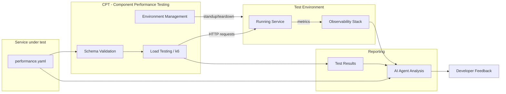

{}
このページではパフォーマンスコントラクトのスキーマと採用ガイドを記述しています。完全なシステム設計、根拠、未解決の決定事項については、[モジュラーフィーチャー向けのパフォーマンステスト設計ドキュメント](/handbook/engineering/infrastructure-platforms/developer-experience/design-documents/performance_contracts/) を参照してください。スキーマはマイルストーン 1 で最終化中であり、[#4407](https://gitlab.com/gitlab-org/quality/quality-engineering/team-tasks/-/work_items/4407) で環境ツールが選定された後、正規のリポジトリ場所に移動されます。
{}


## 概要

コントラクトテストは、サービスの外部表面を定義し、サービスがどのように振る舞うかを指定する機械可読な「コントラクト」を記述する手法です。このアプローチには次のような利点があります:

- **テスト可能な合意** — 自動テストがコントラクトが破られていないことを検証
- **明確なインターフェース** — 外部サービスが自信を持ってインテグレーションを設計可能
- **破壊的変更の検出** — 自動検証が互換性のない変更をキャッチ

パフォーマンスコントラクトはこの概念をモジュラーフィーチャーのパフォーマンス特性へ拡張します。検証された YAML ファイル（`performance.yaml`）にパフォーマンス目標をエンコードすることで、チームは次のものを得ます:

- **より早期の回帰検出** — すべての MR がコントラクトに対して検証される
- **AI 対応のパフォーマンスガバナンス** — AI コーディングアシスタントが具体的で機械可読なパフォーマンスルールを持つ
- **標準化された採用** — 任意のモジュラーフィーチャー向けの再利用可能なコントラクトスキーマと検証ツールキット

## スコープ

パフォーマンスコントラクトは、CI からアクセス可能な環境で動作するモジュラーフィーチャーサービスを対象とします。明示的にスコープ外となるものの完全なリストは、[モジュラーフィーチャー向けのパフォーマンステスト設計ドキュメント](/handbook/engineering/infrastructure-platforms/developer-experience/design-documents/performance_contracts/) を参照してください。

現在のイテレーションの主要な境界:

- **本番 SLO ツールではない** — コントラクトは SLO に情報を提供しますが、置き換えるものではありません
- **ローカルテストツールではない** — コントラクトテストは開発者のラップトップではなく、CI 上の一時的な環境に対して実行されます（将来のイテレーションで予定）
- **組み合わせテストツールではない** — 各サービスコントラクトは独立して検証され、サービス間の統合パフォーマンスはスコープ外です

## アーキテクチャ

パフォーマンスコントラクトシステムは次のように動作します:



### performance.yaml コントラクト

`performance.yaml` ファイルはシステムの単一のエントリーポイントです — コントラクトツール、負荷テスト実行、AI 分析を駆動します。次のものを定義します:

- **エンドポイントカテゴリー** とレイテンシパーセンタイル目標
- **エラー率の閾値**
- **リソース予算**（メモリ、CPU、コネクションプール）
- **データベース制約**（クエリレイテンシ、リクエストあたりの最大クエリ数）
- **SLI マッピング** から Prometheus メトリクスへ

### コントラクトツール

[CPT (Component Performance Testing)](https://gitlab.com/gitlab-org/quality/component-performance-testing) は環境管理とテスト実行のための確定済みツールです。CPT は次を扱います:

- **環境ライフサイクル** — MR ごとの実行に対応する GCP ホストテスト環境（Docker コンテナまたは CNG インスタンス）のプロビジョニングと撤去
- **負荷テスト実行** — テスト対象サービスに対する k6 テストの実行
- **MR フィードバック** — トリガーとなったマージリクエストにテスト結果をコメントとして投稿

CPT はマイルストーン 2 で `performance.yaml` を入力として受け入れ、コントラクトから k6 シナリオと閾値を動的に生成するように拡張されます。スキーマ検証アプローチ（CPT 内に存在するか別リポジトリに存在するか）はマイルストーン 2 で解決される未解決の問題です。完全な根拠については [設計ドキュメント](/handbook/engineering/infrastructure-platforms/developer-experience/design-documents/performance_contracts/) を参照してください。

## スキーマ定義

`performance.yaml` コントラクトは次のセクションで構成されます:

### コントラクト定義（必須）

このセクションはスキーマに関する追跡データを提供し、コントラクトが現行バージョンであることを検証可能にします。

```yaml
version: "1.0"
service:
  name: "example-service"
  description: "Example modular feature performance contract"
```

| 要素 | 説明 |
| ---- | ----------- |
| `version` | 互換性追跡のためのスキーマバージョン |
| `service` | サービス識別情報（名前、説明） |

### Endpoints（必須）

各エントリは、類似のパフォーマンス特性を持つエンドポイントのカテゴリーを表します。カテゴリー内のルートはレイテンシ目標を共有します。

```yaml
endpoints:
  fast_reads:
    description: >
      Single item lookup by ID. Simulates one indexed DB read.
      This is the most common call pattern in the Artifact Registry.
    routes:
      - "GET /api/v1/items/{id}"
    metrics:
      latency_p95_ms: 100
      latency_p99_ms: 250
      error_rate_threshold: 0.001
```

各エンドポイントカテゴリーは次の要素を持ちます:

| 要素 | 説明 |
| ---- | ----------- |
| `description` | エンドポイントの人間が読める定義 |
| `routes` | テストされる API ルート |
| `metrics` | これらのルートに対して測定されるパフォーマンス目標 |

#### パフォーマンスティア

パフォーマンスティアは、一般的なサービスアーキタイプに対する出発点となるデフォルトを提供します。エンドポイントに最も適合するティアを選択し、実際のベースラインデータに基づいて調整してください:

- **ティア 1: Fast Reads** - データベースクエリがないか、最小限のインデックス参照を伴うシンプルな読み取り（ヘルスチェック、ステータスエンドポイント）

```yaml
metrics:
  latency_p95_ms: 100
  latency_p99_ms: 250
  error_rate_threshold: 0.001
```

- **ティア 2: Standard Reads** - データベースクエリ、結合、または中程度の計算を伴う読み取り操作

```yaml
metrics:
  latency_p95_ms: 500
  latency_p99_ms: 1000
  error_rate_threshold: 0.005
```

- **ティア 3: Write Operations** - 書き込み操作とマルチステップトランザクション - 作成、更新、削除エンドポイント、および複数のサービスにファンアウトする操作

```yaml
metrics:
  latency_p95_ms: 1500
  latency_p99_ms: 3000
  error_rate_threshold: 0.01
```

- **ティア 4: Git Operations** - Git プロトコル操作（clone、pull、push、ls-remote）

```yaml
metrics:
  latency_p95_ms: 5000
  latency_p99_ms: 10000
  error_rate_threshold: 0.001
```

### Resources（任意）

このセクションはテスト環境のリソース制約を定義します。現在は情報提供のみであり、強制は将来のイテレーションで予定されています。

```yaml
resources:
  memory_limit_mb: 256
  cpu_limit_cores: 0.5
  # Maximum concurrent connections from the service's outbound pool.
  # Maps to bench.textproto Outbound.Backend.PoolConfig.max_open.
  connection_pool_max: 10
```

### 追加のサービスメトリクス（任意）

サービスが依存するサブシステムについて、独自のセクションでメトリクスを定義します。現在は情報提供のみであり、強制は将来のイテレーションで予定されています。

サービスがデータベースに依存している場合、次のように定義できます:

```yaml
database:
  # Maximum query latency at the 95th percentile (milliseconds).
  query_latency_p95_ms: 30
  # Hard limit on DB queries per inbound request. N+1 queries violate this.
  max_queries_per_request: 5
```

### SLI マッピング（任意）

各コントラクトエンドポイントカテゴリーを、サービスが LabKit v2 経由で出力する Prometheus メトリクス名とラベル値にマップします。これにより、ツール（ダッシュボード、アラート、検証スクリプト）がサービスのソースコードを調査することなく、適切な時系列を特定できます。

```yaml
sli_mapping:
  metrics_namespace: gitlab
  component: api

  fast_read:
    requests_total_metric: gitlab_http_requests_total
    duration_metric: gitlab_http_request_duration_seconds
    endpoint_id_label: "GET /api/v1/items/{id}"
    feature_category_label: artifact_registry
```

#### LabKit v2 と SLI マッピング

LabKit v2 は Go サービス向けの GitLab の標準プラットフォームライブラリです。`sli_mapping` セクションが直接参照する、メトリクス名、ラベル規約、SLO に整合したヒストグラムバケットを提供します。すでに LabKit を使用しているサービスは、計装の変更なしでパフォーマンスコントラクトを採用できます — 出力されるメトリクスは、AI 支援の実行後分析のために観測スタックで自動的に利用可能になります。

## 採用ワークフロー


{}
採用ワークフローとツールはマイルストーン 2（MVP）で利用可能になります。このセクションはツールが準備できた時点で、詳細な手順とともに更新されます。
{}


### クイックスタート（予定）

1. **コントラクトのスキャフォールディング** — スキャフォールディング CLI を使用してスタータの `performance.yaml` を生成
2. **目標のカスタマイズ** — サービスの特性に基づいてレイテンシ、エラー率、リソース目標を調整
3. **CI 統合の追加** — `.gitlab-ci.yml` にパフォーマンスコントラクト CI テンプレートを含める
4. **検証と反復** — 変更をプッシュし、MR でコントラクト検証結果をレビュー

### CI 統合（予定）

```yaml
# .gitlab-ci.yml
include:
  - project: 'gitlab-org/quality/performance-contracts'
    file: '/templates/performance-contract.yml'
```

## LabKit にまだないメトリクスの扱い


{}
LabKit がまだメトリクスを出力していないパフォーマンス側面の取り扱いに関するガイダンスは、[#4406](https://gitlab.com/gitlab-org/quality/quality-engineering/team-tasks/-/work_items/4406) で開発中です。
{}


まだカバーされていないパフォーマンス側面については:

- **ギャップを文書化** — 不足しているメトリクスをコメントとともにコントラクトに記載
- **プレースホルダー値を使用** — 期待される動作に基づいて目標を定義
- **計装作業を追跡** — LabKit に不足しているメトリクスを追加するための Issue を作成
- **デプロイ後に検証** — 計装が利用可能になるまで、代替の検証方法を使用

## AI 統合

パフォーマンスコントラクトは、[GitLab Skills リポジトリ](https://gitlab.com/gitlab-org/ai/skills) に公開されたスキルを通じて GitLab Duo と統合されます。これにより AI コーディングアシスタントは次のものを得ます:

- 具体的で機械可読なパフォーマンスルール
- レイテンシ予算とリソース制約の認識
- パフォーマンステストをいつ適用すべきかのガイダンス
- 完全な構造的 + パフォーマンス像のための機能コントラクトテストへのリンク

## 関連リソース

- **Epic**: [&387 Performance contracts for Modular Features](https://gitlab.com/groups/gitlab-org/quality/-/work_items/387)
- **設計ドキュメント**: [モジュラーフィーチャー向けのパフォーマンステスト - 設計上の決定](/handbook/engineering/infrastructure-platforms/developer-experience/design-documents/performance_contracts/)
- **POC リポジトリ**: [perf-contract-poc](https://gitlab.com/gl-dx/performance-enablement/demos/perf-contract-poc)
- **POC ウォークスルー**: [動画ウォークスルー](https://drive.google.com/file/d/1bz2IwUE80H0MspLT0-TiFj3poWaEa9Cc/view?usp=drive_link)
- **パフォーマンステストツール**: [ツール選定ガイド](/handbook/engineering/testing/performance-tools/)

## フィードバックと質問

これは活発に開発が進められている取り組みです。質問やフィードバックについては:

- [&387](https://gitlab.com/groups/gitlab-org/quality/-/work_items/387) にコメント
- Performance Enablement チームへ連絡
- `#g_performance-enablement` の Slack チャンネルでディスカッションに参加
