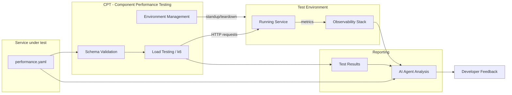

{}
このページではパフォーマンスコントラクトのスキーマと採用ガイドを記述しています。完全なシステム設計、根拠、未解決の決定事項については、[モジュラーフィーチャー向けのパフォーマンステスト設計ドキュメント](/handbook/engineering/infrastructure-platforms/developer-experience/design-documents/performance_contracts/) を参照してください。スキーマはマイルストーン 1 で最終化中であり、[#4407](https://gitlab.com/gitlab-org/quality/quality-engineering/team-tasks/-/work_items/4407) で環境ツールが選定された後、正規のリポジトリ場所に移動されます。
{}

## 概要

コントラクトテストは、サービスの外部表面を定義し、サービスがどのように振る舞うかを指定する機械可読な「コントラクト」を記述する手法です。このアプローチには次のような利点があります:

- **テスト可能な合意** — 自動テストがコントラクトが破られていないことを検証
- **明確なインターフェース** — 外部サービスが自信を持ってインテグレーションを設計可能
- **破壊的変更の検出** — 自動検証が互換性のない変更をキャッチ

パフォーマンスコントラクトはこの概念をモジュラーフィーチャーのパフォーマンス特性へ拡張します。検証された YAML ファイル（`performance.yaml`）にパフォーマンス目標をエンコードすることで、チームは次のものを得ます:

- **より早期の回帰検出** — すべての MR がコントラクトに対して検証される
- **AI 対応のパフォーマンスガバナンス** — AI コーディングアシスタントが具体的で機械可読なパフォーマンスルールを持つ
- **標準化された採用** — 任意のモジュラーフィーチャー向けの再利用可能なコントラクトスキーマと検証ツールキット

## スコープ

パフォーマンスコントラクトは、CI からアクセス可能な環境で動作するモジュラーフィーチャーサービスを対象とします。明示的にスコープ外となるものの完全なリストは、[モジュラーフィーチャー向けのパフォーマンステスト設計ドキュメント](/handbook/engineering/infrastructure-platforms/developer-experience/design-documents/performance_contracts/) を参照してください。

現在のイテレーションの主要な境界:

- **本番 SLO ツールではない** — コントラクトは SLO に情報を提供しますが、置き換えるものではありません
- **ローカルテストツールではない** — コントラクトテストは開発者のラップトップではなく、CI 上の一時的な環境に対して実行されます（将来のイテレーションで予定）
- **組み合わせテストツールではない** — 各サービスコントラクトは独立して検証され、サービス間の統合パフォーマンスはスコープ外です

## コントラクトの種類

パフォーマンスコントラクトは、ワークロードの種類と注目するメトリクスに応じて、複数の補完的なツールアプローチを用いて実装されます。私たちがサポートする 3 つの主要なコントラクトの種類は次のとおりです:

- **フロントエンド／UI コントラクト（SiteSpeed）** — ページロードおよびブラウザレベルのメトリクス（FCP、LCP、CLS、TBT、パフォーマンススコア、ユーザージャーニー）。
- **バックエンド／サービスコントラクト（k6 / CPT）** — 低〜中程度の負荷下でのサービスレベルのレイテンシとスループット。CPT によって実行される k6 シナリオ。
- **API／OpenAPI 由来のコントラクト（TBD）** — OpenAPI 仕様からのパフォーマンスチェックの自動生成。概念的な作業が進行中。

各コントラクトの種類は同じ正規のエントリポイント（`performance.yml`）を共有しますが、異なる実行ツールと CI パターンにマッピングされます。次のセクションでは、フロントエンドの SiteSpeed バリアントを詳細に説明し、バックエンドおよび API アプローチについて高レベルのノートを提供します。

## アーキテクチャ

### バックエンド／サービスコントラクト

パフォーマンスコントラクトシステムは次のように動作します:



[CPT (Component Performance Testing)](https://gitlab.com/gitlab-org/quality/component-performance-testing) は、環境管理とテスト実行のために確定したツールです。CPT は次を処理します:

- **環境のライフサイクル** — MR 実行ごとに、GCP でホストされるテスト環境（Docker コンテナまたは CNG インスタンス）のプロビジョニングとティアダウン
- **負荷テストの実行** — テスト対象のサービスに対する k6 テストの実行
- **MR フィードバック** — トリガーとなったマージリクエストへのコメントとしてテスト結果を投稿

CPT はマイルストーン 2 で拡張され、`performance.yaml` を入力として受け取り、コントラクトから k6 シナリオとしきい値を動的に生成するようになります。スキーマ検証のアプローチ（CPT 内に置くか別リポジトリに置くか）は、マイルストーン 2 で解決される未解決の課題です。完全な根拠については [設計ドキュメント](/handbook/engineering/infrastructure-platforms/developer-experience/design-documents/performance_contracts/) を参照してください。

### フロントエンド／UI コントラクト

私たちは、SiteSpeed バジェットを使用したフロントエンドパフォーマンスコントラクト向けに、軽量で開発者中心のワークフローをサポートしています。主要な設計上の選択は次のとおりです:

- バジェットは、`sitespeed-measurement-setup` リポジトリの `performance/` ディレクトリ配下に、テスト URL リストと並べて配置します。これにより URL とバジェットが一緒にバージョン管理され、ローカルでの開発者の実行が容易になります。
- メインリポジトリには CI の起点として機能する `performance.yml` エントリが含まれます。これは `sitespeed-measurement-setup` サブモジュール内の環境バジェットとオプションのチームごとのバジェットファイルを参照します。
- CI ランタイムでは、選択された環境バジェットがオプションのチームごとのバジェットとマージされます。マージのセマンティクスは意図的にシンプルで、各バジェットエントリは `(url, metric)` をキーとし、衝突した場合はチームエントリが環境エントリを上書きし、それ以外の場合はエントリが連結されます。
- MR レベルの SiteSpeed 実行はデフォルトで参考扱いです（MR ジョブは Browser-Performance パターンを使用してパイプライン内でローカルに SiteSpeed を実行し、`--budget.configPath` 経由でマージ済みバジェットを使用します）。MR 実行は `allow_failure: true` であり、MR ラベルまたは手動トリガーによるオプトイン方式です。


`sitespeed-measurement-setup` リポジトリ内のファイルとヘルパー（レイアウトの例）:

```plaintext
performance/
  README.md
  schema/budget.schema.json
  budgets/
    environments/{production,staging,mr}.json
    teams/{<team>.json}
  scripts/
    validate_budget.py
    merge_budgets.py
  requirements.txt
```

`validate_budget.py` は JSON Schema 検証を実行します。`merge_budgets.py` は「チームが環境を上書きする」セマンティクスを実装したマージ済みバジェット JSON を生成します。CI はバジェットを変更する PR に対してバリデーターを実行すべきです。

開発者フロー（要約）:

1. 開発者は `sitespeed-measurement-setup` で URL リストとバジェットを編集し、MR をオープンします。
2. MR ジョブ（オプトイン）は env + team バジェットをマージし、ジョブ内でレビューアプリの URL に対してローカルに SiteSpeed を実行し、アーティファクトと `browser_performance` レポートを生成します。
3. このジョブは参考扱いです。チームはより厳格な強制に移行する前に、バジェットを反復的にチューニングします。

## `performance.yml` コントラクト

`performance.yml` ファイルはシステムの単一のエントリポイントであり、コントラクトツール、負荷テストの実行、AI 分析を駆動します。次を定義します:

- コントラクトのメタデータ（バージョン、サービスの識別と説明）
- フロントエンド設定（名前空間化された `frontend` オブジェクト: budgets、teams、default_budget、オプションの `enabled`）。フロントエンドバジェットのマージセマンティクス（`(url,metric)` の衝突時にチームが環境を上書きする）は、フロントエンドバジェットオブジェクトの解釈方法の一部です。
- バックエンドエンドポイントのカテゴリ（latency_p95_ms、latency_p99_ms、error_rate_threshold などの関連するパフォーマンスメトリクスを持つ、ルートの名前付きグループ）
  - パフォーマンスティア（一般的なアーキタイプに対して開始点となるメトリクス値を提供するオプションのプリセット）
- リソースバジェット（memory_limit_mb、cpu_limit_cores、connection_pool_max）
- SLI マッピング（Prometheus メトリクス名、ラベルマッピング、metrics_namespace/component）
- 検証／スキーマのメタデータ（コントラクトが期待される形に準拠していることを保証するためのスキーマバージョンとバリデーター参照）
- 追加のサブシステムメトリクス（データベース、外部依存関係）。関連する場合にサービスごとに定義可能

## スキーマ定義

`performance.yml` コントラクトは次のセクションで構成されます:

### コントラクト定義（必須）

このセクションはスキーマに関する追跡データを提供し、コントラクトが現在のバージョンであることを検証できるようにします。

```yaml
version: "1.0"
service:
  name: "example-service"
  description: "Example modular feature performance contract"
```

| element | description |
| ---- | ----------- |
| `version` | 互換性追跡のためのスキーマバージョン |
| `service` | サービスの識別（name、description） |

### フロントエンド: SiteSpeed パフォーマンスバジェット

私たちは SiteSpeed バジェットを使用したフロントエンドワークフローをパイロット運用しています。主要なアイデアは、SiteSpeed の URL スイートとそのバジェットを `sitespeed-measurement-setup` リポジトリ内に一緒に保持し、開発者が同じ PR で URL とバジェットを更新できるようにすることです。メインリポジトリ（ルート）は、CI ランタイムで環境とチームのバジェットを選択するためにサブモジュールを指す `performance.yml` エントリを保持します。

`performance.yml` エントリの例（起点 — 名前空間化されたフロントエンド設定）:

```yaml
frontend:
  enabled: true            # optional: presence of `frontend` can imply enabled; set false to opt-out
  budgets:
    production: testrunner/sitespeed-measurement-setup/performance/budgets/environments/production.json
    staging:   testrunner/sitespeed-measurement-setup/performance/budgets/environments/staging.json
    mr:        testrunner/sitespeed-measurement-setup/performance/budgets/environments/mr.json
  teams:
    rapid-diffs:
      url_dir: testrunner/sitespeed-measurement-setup/gitlab/desktop/urls
      budget:  testrunner/sitespeed-measurement-setup/performance/budgets/teams/rapid-diffs.json
  default_budget: mr
```

挙動に関するノート:

- CI ランナーは、決定論的なルールを使用して、選択された環境バジェットとオプションのチームごとのバジェットをマージします。(url,metric) が一致した場合はチームエントリが環境エントリを上書きし、それ以外の場合はエントリが連結されます。マージ済み JSON は `--budget.configPath` で SiteSpeed に渡されます。
- MR レベルの実行は参考扱い（`allow_failure: true`）であり、Browser-Performance ジョブパターンでレビューアプリの URL に対してローカルに SiteSpeed を実行します。バジェットのチューニング中にデータが氾濫するのを防ぐため、最初のパイロットでは MR 実行を中央の sitespeed-runway ランナーに送信することを意図的に避けています。
- `sitespeed-measurement-setup` リポジトリには、サンプルバジェットファイル、JSON Schema、2 つのヘルパースクリプト（`validate_budget.py`、`merge_budgets.py`）を含む POC ブランチ `add-performance-contracts` が含まれています。CI はバジェットファイルの変更に対して検証を実行すべきです。

注: スキーマは `frontend` オブジェクトを受け付けます。このオブジェクトの存在はフロントエンドコントラクトが設定されていることを意味します。必要に応じて明示的にオプトアウト／オプトインするために、オプションの `enabled` ブール値を使用できます。

### バックエンドエンドポイント

各エントリは、類似したパフォーマンス特性を持つエンドポイントのカテゴリを表します。カテゴリ内のルートはレイテンシ目標を共有します。

```yaml
endpoints:
  fast_reads:
    description: >
      Single item lookup by ID. Simulates one indexed DB read.
      This is the most common call pattern in the Artifact Registry.
    routes:
      - "GET /api/v1/items/{id}"
    metrics:
      latency_p95_ms: 100
      latency_p99_ms: 250
      error_rate_threshold: 0.001
```

各エンドポイントカテゴリには次の要素があります:

| element | description |
| ---- | ----------- |
| `description` | エンドポイントの人間が読める定義 |
| `routes` | テスト対象の API ルート |
| `metrics` | これらのルートに対して測定されるパフォーマンス目標 |

#### パフォーマンスティア

パフォーマンスティアは、一般的なサービスアーキタイプに対して開始点となるデフォルト値を提供します。エンドポイントに最も合うティアを選択し、実際のベースラインデータに基づいてチューニングしてください:

- **ティア 1: Fast Reads** — データベースクエリのない、または最小限のインデックス参照によるシンプルな読み取り（ヘルスチェック、ステータスエンドポイント）

```yaml
metrics:
  latency_p95_ms: 100
  latency_p99_ms: 250
  error_rate_threshold: 0.001
```

- **ティア 2: Standard Reads** — データベースクエリ、結合、または中程度の計算を伴う読み取り操作

```yaml
metrics:
  latency_p95_ms: 500
  latency_p99_ms: 1000
  error_rate_threshold: 0.005
```

- **ティア 3: Write Operations** — 書き込み操作および複数ステップのトランザクション。作成、更新、削除エンドポイント、および複数のサービスにファンアウトする操作

```yaml
metrics:
  latency_p95_ms: 1500
  latency_p99_ms: 3000
  error_rate_threshold: 0.01
```

- **ティア 4: Git Operations** — Git プロトコル操作（clone、pull、push、ls-remote）

```yaml
metrics:
  latency_p95_ms: 5000
  latency_p99_ms: 10000
  error_rate_threshold: 0.001
```

### リソース

このセクションはテスト環境のリソース制約を定義します。現在は情報提供のみで、強制は将来のイテレーションで予定されています。

```yaml
resources:
  memory_limit_mb: 256
  cpu_limit_cores: 0.5
  # Maximum concurrent connections from the service's outbound pool.
  # Maps to bench.textproto Outbound.Backend.PoolConfig.max_open.
  connection_pool_max: 10
```

### 追加のサービスメトリクス

サービスが依存する任意のサブシステムのメトリクスを、それぞれのセクションで定義します。現在は情報提供のみで、強制は将来のイテレーションで予定されています。

サービスがデータベースに依存している場合、次のように定義できます:

```yaml
database:
  # Maximum query latency at the 95th percentile (milliseconds).
  query_latency_p95_ms: 30
  # Hard limit on DB queries per inbound request. N+1 queries violate this.
  max_queries_per_request: 5
```

### SLI マッピング

各コントラクトエンドポイントカテゴリを、サービスが LabKit v2 経由で出力する Prometheus メトリクス名とラベル値にマッピングします。これにより、ツール（ダッシュボード、アラート、検証スクリプト）はサービスのソースコードを調べることなく、正しい時系列を見つけられます。

```yaml
sli_mapping:
  metrics_namespace: gitlab
  component: api

  fast_read:
    requests_total_metric: gitlab_http_requests_total
    duration_metric: gitlab_http_request_duration_seconds
    endpoint_id_label: "GET /api/v1/items/{id}"
    feature_category_label: artifact_registry
```

#### LabKit v2 と SLI マッピング

LabKit v2 は GitLab の Go サービス向け標準プラットフォームライブラリです。`sli_mapping` セクションが直接参照する、メトリクス名、ラベル規約、SLO に整合したヒストグラムバケットを提供します。すでに LabKit を使用しているサービスは、計装を一切変更することなくパフォーマンスコントラクトを採用できます。出力されるメトリクスは、AI 支援による実行後分析のためにオブザーバビリティスタックで自動的に利用可能になります。

## 採用ワークフロー

{}
採用ワークフローとツールはマイルストーン 2（MVP）で利用可能になります。ツールが準備できしだい、このセクションは詳細な手順で更新されます。
{}

### クイックスタート（予定）

1. **コントラクトのスキャフォールド** — スキャフォールド用 CLI を使用してスターターの `performance.yaml` を生成
2. **目標のカスタマイズ** — サービスの特性に基づいて、レイテンシ、エラー率、リソース目標を調整
3. **CI インテグレーションの追加** — パフォーマンスコントラクトの CI テンプレートを `.gitlab-ci.yml` に含める
4. **検証と反復** — 変更をプッシュし、MR でコントラクト検証結果をレビュー

### CI インテグレーション（予定）

```yaml
# .gitlab-ci.yml
include:
  - project: 'gitlab-org/quality/performance-contracts'
    file: '/templates/performance-contract.yml'
```

## LabKit にまだないメトリクスの扱い

{}
LabKit がまだメトリクスを出力していないパフォーマンス面の扱いに関するガイダンスは、[#4406](https://gitlab.com/gitlab-org/quality/quality-engineering/team-tasks/-/work_items/4406) で開発中です。
{}

まだカバーされていないパフォーマンス面については:

- **ギャップを文書化する** — コントラクトに欠落しているメトリクスをコメントで記録
- **プレースホルダー値を使用する** — 期待される挙動に基づいて目標を定義
- **計装作業を追跡する** — 欠落しているメトリクスを LabKit に追加するための Issue を作成
- **デプロイ後に検証する** — 計装が利用可能になるまで、代替の検証方法を使用

## AI インテグレーション

パフォーマンスコントラクトは、[GitLab Skills リポジトリ](https://gitlab.com/gitlab-org/ai/skills) に公開されたスキルを通じて GitLab Duo と統合されます。これにより AI コーディングアシスタントは次を得ます:

- 具体的で機械可読なパフォーマンスルール
- レイテンシバジェットとリソース制約の認識
- パフォーマンステストをいつ適用すべきかのガイダンス
- 構造的 + パフォーマンスの全体像を得るための、機能コントラクトテストへのリンク

## 関連リソース

- **Epic**: [&387 Performance contracts for Modular Features](https://gitlab.com/groups/gitlab-org/quality/-/work_items/387)
- **設計ドキュメント**: [Performance Testing for Modular Features - Design Decisions](/handbook/engineering/infrastructure-platforms/developer-experience/design-documents/performance_contracts/)
- **POC リポジトリ**: [perf-contract-poc](https://gitlab.com/gl-dx/performance-enablement/demos/perf-contract-poc)
- **POC ウォークスルー**: [動画ウォークスルー](https://drive.google.com/file/d/1bz2IwUE80H0MspLT0-TiFj3poWaEa9Cc/view?usp=drive_link)
- **パフォーマンステストツール**: [ツール選定ガイド](/handbook/engineering/testing/performance-tools/)

## フィードバックと質問

これは活発な開発作業です。質問やフィードバックについては:

- [&387](https://gitlab.com/groups/gitlab-org/quality/-/work_items/387) にコメント
- Performance Enablement チームに連絡
- `#g_performance-enablement` Slack チャンネルでの議論に参加
