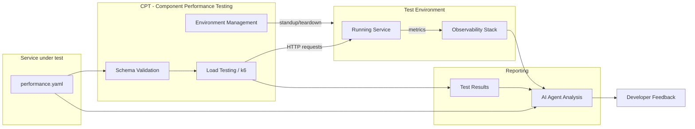
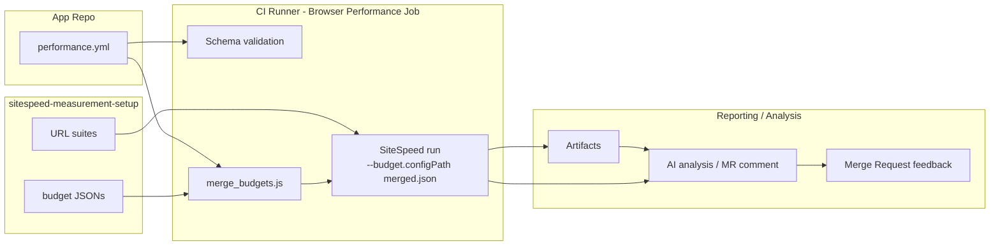

{}
このページではパフォーマンスコントラクトのスキーマと採用ガイドを記述しています。完全なシステム設計、根拠、未解決の決定事項については、[モジュラー機能向けのパフォーマンステスト設計ドキュメント](/handbook/engineering/infrastructure-platforms/developer-experience/design-documents/performance_contracts/) を参照してください。スキーマはマイルストーン 1 で最終化中であり、[#4407](https://gitlab.com/gitlab-org/quality/quality-engineering/team-tasks/-/work_items/4407) で環境ツールが選定された後、正規のリポジトリ場所に移動されます。
{}

## 概要

コントラクトテストとは、サービスの外部サーフェスを定義し、サービスがどのように振る舞うかを規定する機械可読な「コントラクト」を作成する実践です。このアプローチには、いくつかの利点があります:

- **テスト可能な合意** - 自動テストによってコントラクトが破られていないかを検証します
- **明確なインターフェイス** - 外部サービスは自信を持って統合を設計できます
- **破壊的変更の検出** - 自動検証で互換性のない変更を検出します

パフォーマンスコントラクトはこの概念をモジュラー機能のパフォーマンス特性に拡張します。パフォーマンス目標を検証された YAML ファイル（`performance.yaml`）にエンコードすることで、チームは以下を獲得します:

- **より早い回帰検出** - すべての MR がコントラクトに対して検証されます
- **AI 対応のパフォーマンスガバナンス** - AI コーディングアシスタントが具体的で機械可読なパフォーマンスルールを持ちます
- **標準化された採用** - あらゆるモジュラー機能で再利用可能なコントラクトスキーマと検証ツールキット

## スコープ

パフォーマンスコントラクトは、CI からアクセス可能な環境で実行されるモジュラー機能サービスにスコープが限定されます。明示的にスコープ外となるものの全リストについては、[モジュラー機能向けのパフォーマンステスト設計ドキュメント](/handbook/engineering/infrastructure-platforms/developer-experience/design-documents/performance_contracts/) を参照してください。

現在のイテレーションの主要な境界:

- **本番 SLO ツールではない** - コントラクトは SLO に情報を提供しますが、置き換えるものではありません
- **ローカルテストツールではない** - コントラクトテストは CI で一時的な環境に対して実行されます。開発者のラップトップ上ではありません（将来のイテレーションで予定）
- **組み合わせテストツールではない** - 各サービスコントラクトは独立して検証されます。サービス間の統合パフォーマンスはスコープ外です

## コントラクトの種類

パフォーマンスコントラクトは、ワークロードのタイプと関心のあるメトリクスに応じて、複数の補完的なツーリングアプローチを用いて実装されます。私たちがサポートする 3 つの主要なコントラクトの種類は次のとおりです:

- **フロントエンド／UI コントラクト（SiteSpeed）** — ページロードとブラウザレベルのメトリクス（FCP、LCP、CLS、TBT、パフォーマンススコア、ユーザージャーニー）。
- **バックエンド／サービスコントラクト（k6 ／ CPT）** — 低〜中程度の負荷下でのサービスレベルのレイテンシとスループット。CPT により実行される k6 シナリオ。
- **API ／ OpenAPI 派生のコントラクト（TBD）** — OpenAPI 仕様からのパフォーマンスチェックの自動生成。コンセプトワークが進行中。

各コントラクトの種類は同じ正規のエントリポイント（`performance.yml`）を共有しますが、異なる実行ツーリングと CI パターンにマッピングされます。次のセクションでは、フロントエンドの SiteSpeed バリアントを詳細に説明し、バックエンドと API のアプローチに関する高レベルのノートを提供します。

## アーキテクチャ

### バックエンド／サービスコントラクト

パフォーマンスコントラクトシステムは次のように動作します:



[CPT（Component Performance Testing）](https://gitlab.com/gitlab-org/quality/component-performance-testing) は環境管理とテスト実行のために確定したツールです。CPT は以下を処理します:

- **環境のライフサイクル** - MR 実行ごとの GCP ホスト型テスト環境（Docker コンテナまたは CNG インスタンス）のプロビジョニングとティアダウン
- **負荷テストの実行** - テスト対象サービスに対する k6 テストの実行
- **MR フィードバック** - テスト結果をトリガーマージリクエストへのコメントとして投稿

CPT はマイルストーン 2 で `performance.yaml` を入力として受け入れ、コントラクトから k6 シナリオとしきい値を動的に生成するよう拡張されます。スキーマ検証のアプローチ（CPT 内に存在するか、別リポジトリに存在するか）はマイルストーン 2 で解決される未解決の問いです。完全な根拠については [設計ドキュメント](/handbook/engineering/infrastructure-platforms/developer-experience/design-documents/performance_contracts/) を参照してください。

### フロントエンド／UI コントラクト

私たちは、SiteSpeed の予算を用いた、軽量で開発者中心のフロントエンドパフォーマンスコントラクトのワークフローをサポートします。主要な設計上の選択は以下のとおりです:

- 予算は、テスト URL リストとともに `sitespeed-measurement-setup` リポジトリの `performance/` ディレクトリに置かれます。これにより、URL と予算が一緒にバージョン管理され、ローカルでの開発者の実行が直感的になります。
- メインリポジトリには CI の起点として機能する `performance.yml` エントリが含まれており、`sitespeed-measurement-setup` サブモジュール内の環境予算とオプションのチームごとの予算ファイルを参照します。
- CI 実行時には、選択された環境予算とオプションのチームごとの予算がマージされます。マージセマンティクスは意図的にシンプルに保たれています: 予算は SiteSpeed のネイティブなネストされたフォーマットを使用します。チームのエントリは各セクション内でメトリクスレベルで環境のエントリを上書きし、URL／エイリアスキーのオーバーライドはグローバルセクションのデフォルトとは独立してマージされます。
- MR レベルの SiteSpeed 実行はデフォルトでアドバイザリです（MR ジョブは Browser-Performance パターンを使用して、`--budget.configPath` 経由でマージされた予算を使ってパイプライン内でローカルに SiteSpeed を実行します）。MR 実行は `allow_failure: true` であり、MR ラベルまたは手動トリガーを介してオプトインです。



`sitespeed-measurement-setup` リポジトリ内のファイルとヘルパー（レイアウト例）:

```plaintext
performance/
  README.md
  schema/budget.schema.json
  budgets/
    default.json
    environments/{production,staging,mr}.json
    teams/{<team>.json}
  scripts/
    validate_budget.js
    merge_budgets.js
```

`validate_budget.js` は JSON Schema 検証を実行します。`merge_budgets.js` は、team-overrides-environment セマンティクスを実装するマージされた予算 JSON を生成します。CI は予算を変更する PR で検証を実行する必要があります。

開発者フロー（概要）:

1. 開発者は `sitespeed-measurement-setup` で URL リストと予算を編集し、MR を作成します。
2. MR ジョブ（オプトイン）は env ＋ team の予算をマージし、レビューアプリの URL に対してジョブ内でローカルに SiteSpeed を実行し、アーティファクトと `browser_performance` レポートを生成します。
3. ジョブはアドバイザリです。チームはより厳しい強制に移行する前に、反復的に予算をチューニングします。

## `performance.yml` コントラクト

`performance.yml` ファイルはシステムの単一のエントリポイントです - コントラクトツーリング、負荷テストの実行、AI 分析を駆動します。以下を定義します:

- コントラクトメタデータ（バージョン、サービスの識別と説明）
- フロントエンド設定（名前空間化された `frontend` オブジェクト: budgets、teams、default_budget、オプションの `enabled`）。フロントエンド予算のマージセマンティクス（`(url, metric)` の衝突でチームが環境を上書き）は、フロントエンド予算オブジェクトの解釈方法の一部です。
- バックエンドのエンドポイントカテゴリ（latency_p95_ms、latency_p99_ms、error_rate_threshold などの関連するパフォーマンスメトリクスを持つルートの名前付きグループ）
  - パフォーマンスティア（一般的なアーキタイプの出発点となるメトリクス値を提供するオプションのプリセット）
- リソース予算（memory_limit_mb、cpu_limit_cores、connection_pool_max）
- SLI マッピング（Prometheus メトリクス名、ラベルマッピング、metrics_namespace/component）
- 検証／スキーマメタデータ（コントラクトが期待される形式に準拠していることを確認するためのスキーマバージョンと validator 参照）
- 関連する場合にサービスごとに定義できる追加のサブシステムメトリクス（データベース、外部依存関係）

## スキーマ定義

`performance.yml` コントラクトは以下のセクションで構成されます:

### コントラクト定義（必須）

このセクションは、スキーマに関する追跡データを提供し、コントラクトが現在のバージョンであることを検証できるようにします。

```yaml
version: "1.0"
service:
  name: "example-service"
  description: "Example modular feature performance contract"
```

| 要素 | 説明 |
| ---- | ----------- |
| `version` | 互換性追跡のためのスキーマバージョン |
| `service` | サービスの識別（name、description） |

### フロントエンド: SiteSpeed パフォーマンス予算

私たちは SiteSpeed 予算を用いたフロントエンドワークフローをパイロットしています。主要なアイデアは、SiteSpeed の URL スイートとその予算を `sitespeed-measurement-setup` リポジトリ内に一緒に保つことで、開発者が同じ PR 内で URL と予算を更新できるようにすることです。メインリポジトリ（ルート）は CI 実行時に環境とチームの予算を選択するためにサブモジュールを指す `performance.yml` エントリを保持します。

`performance.yml` エントリの例（起点 — 名前空間化されたフロントエンド設定）:

```yaml
frontend:
  enabled: true            # optional: presence of `frontend` can imply enabled; set false to opt-out
  budgets:
    production: testrunner/sitespeed-measurement-setup/performance/budgets/environments/production.json
    staging:   testrunner/sitespeed-measurement-setup/performance/budgets/environments/staging.json
    mr:        testrunner/sitespeed-measurement-setup/performance/budgets/environments/mr.json
  teams:
    rapid-diffs:
      url_dir: testrunner/sitespeed-measurement-setup/gitlab/desktop/urls
      budget:  testrunner/sitespeed-measurement-setup/performance/budgets/teams/rapid-diffs.json
  default_budget: mr
```

挙動に関する注意点:

- CI ランナーは、選択された環境予算とオプションのチームごとの予算を決定論的なルールでマージします: 予算は SiteSpeed のネイティブなネストされたフォーマットを使用します。チームのエントリは各セクション内でメトリクスレベルで環境のエントリを上書きします。URL／エイリアスキーのオーバーライド（例: `"CodeReview_MR_List": { ... }`）はグローバルセクションのデフォルトとは独立してマージされます。マージされた JSON は `--budget.configPath` で SiteSpeed に渡されます。
- MR レベルの実行はアドバイザリ（`allow_failure: true`）であり、Browser-Performance ジョブパターンでレビューアプリの URL に対してローカルに SiteSpeed を実行します。予算がチューニングされている間、データの氾濫を防ぐため、初期パイロットでは MR 実行を中央の sitespeed-runway ランナーに送信することを意図的に避けています。
- `sitespeed-measurement-setup` リポジトリには、サンプル予算ファイル、JSON Schema、および `performance/` 配下の 2 つのヘルパースクリプト（`validate_budget.js`、`merge_budgets.js`）が含まれています。CI は予算ファイルの変更で検証を実行する必要があります。

注: スキーマは `frontend` オブジェクトを受け入れます。オブジェクトが存在することはフロントエンドコントラクトが設定されていることを意味します。必要に応じて明示的にオプトアウトまたはオプトインするために、オプションの `enabled` ブール値を使用できます。

### バックエンドエンドポイント

各エントリは、類似のパフォーマンス特性を持つエンドポイントのカテゴリを表します。カテゴリ内のルートはレイテンシ目標を共有します。

```yaml
endpoints:
  fast_reads:
    description: >
      Single item lookup by ID. Simulates one indexed DB read.
      This is the most common call pattern in the Artifact Registry.
    routes:
      - "GET /api/v1/items/{id}"
    metrics:
      latency_p95_ms: 100
      latency_p99_ms: 250
      error_rate_threshold: 0.001
```

各エンドポイントカテゴリには以下の要素があります:

| 要素 | 説明 |
| ---- | ----------- |
| `description` | エンドポイントの人間可読な定義 |
| `routes` | テスト対象の API ルート |
| `metrics` | これらのルートに対して測定されるパフォーマンス目標 |

#### パフォーマンスティア

パフォーマンスティアは、一般的なサービスアーキタイプの出発点となるデフォルトを提供します。エンドポイントに最も合致するティアを選択し、実際のベースラインデータに基づいてチューニングしてください:

- **ティア 1: Fast Reads** - データベースクエリのないシンプルな読み取りまたは最小限のインデックス付きルックアップ（ヘルスチェック、ステータスエンドポイント）

```yaml
metrics:
  latency_p95_ms: 100
  latency_p99_ms: 250
  error_rate_threshold: 0.001
```

- **ティア 2: Standard Reads** - データベースクエリ、結合、または中程度の計算を含む読み取り操作

```yaml
metrics:
  latency_p95_ms: 500
  latency_p99_ms: 1000
  error_rate_threshold: 0.005
```

- **ティア 3: Write Operations** - 書き込み操作と複数ステップのトランザクション - create、update、delete エンドポイント、および複数のサービスにファンアウトする操作

```yaml
metrics:
  latency_p95_ms: 1500
  latency_p99_ms: 3000
  error_rate_threshold: 0.01
```

- **ティア 4: Git Operations** - Git プロトコル操作（clone、pull、push、ls-remote）

```yaml
metrics:
  latency_p95_ms: 5000
  latency_p99_ms: 10000
  error_rate_threshold: 0.001
```

### リソース

このセクションは、テスト環境のリソース制約を定義します。現在は情報提供のみで、強制は将来のイテレーションで予定されています。

```yaml
resources:
  memory_limit_mb: 256
  cpu_limit_cores: 0.5
  # Maximum concurrent connections from the service's outbound pool.
  # Maps to bench.textproto Outbound.Backend.PoolConfig.max_open.
  connection_pool_max: 10
```

### 追加のサービスメトリクス

サービスが依存するサブシステムのメトリクスを、独自のセクションで定義します。現在は情報提供のみで、強制は将来のイテレーションで予定されています。

サービスがデータベースに依存する場合、次のように定義できます:

```yaml
database:
  # Maximum query latency at the 95th percentile (milliseconds).
  query_latency_p95_ms: 30
  # Hard limit on DB queries per inbound request. N+1 queries violate this.
  max_queries_per_request: 5
```

### SLI マッピング

各コントラクトエンドポイントカテゴリを、LabKit v2 経由でサービスが発する Prometheus メトリクス名とラベル値にマッピングします。これにより、ツーリング（ダッシュボード、アラート、検証スクリプト）がサービスのソースコードを調べずに正しい時系列を特定できます。

```yaml
sli_mapping:
  metrics_namespace: gitlab
  component: api

  fast_read:
    requests_total_metric: gitlab_http_requests_total
    duration_metric: gitlab_http_request_duration_seconds
    endpoint_id_label: "GET /api/v1/items/{id}"
    feature_category_label: artifact_registry
```

#### LabKit v2 と SLI マッピング

LabKit v2 は Go サービス向けの GitLab の標準プラットフォームライブラリです。`sli_mapping` セクションが直接参照するメトリクス名、ラベル規約、SLO に整合したヒストグラムバケットを提供します。すでに LabKit を使用しているサービスは、計装の変更なしにパフォーマンスコントラクトを採用できます - サービスが発するメトリクスは、AI 支援のポストラン分析のために自動的に観測可能性スタックで利用可能になります。

## 採用ワークフロー

{}
採用ワークフローとツーリングはマイルストーン 2（MVP）で利用可能になります。このセクションは、ツーリングが準備でき次第、詳細な指示で更新されます。
{}

### クイックスタート（予定）

1. **コントラクトをスキャフォールド** - スキャフォールディング CLI を使用してスターターの `performance.yaml` を生成
2. **目標をカスタマイズ** - サービスの特性に基づいてレイテンシ、エラーレート、リソース目標を調整
3. **CI 統合を追加** - `.gitlab-ci.yml` にパフォーマンスコントラクト CI テンプレートを含める
4. **検証と反復** - 変更をプッシュし、MR でコントラクト検証結果をレビュー

### CI 統合（予定）

```yaml
# .gitlab-ci.yml
include:
  - project: 'gitlab-org/quality/performance-contracts'
    file: '/templates/performance-contract.yml'
```

## LabKit にまだないメトリクスの取り扱い

{}
LabKit がまだメトリクスを発しないパフォーマンスの側面の取り扱いに関するガイダンスは [#4406](https://gitlab.com/gitlab-org/quality/quality-engineering/team-tasks/-/work_items/4406) で開発中です。
{}

まだカバーしていないパフォーマンスの側面については:

- **ギャップを文書化** - コメントを使ってコントラクト内に欠落しているメトリクスを記録
- **プレースホルダ値を使用** - 期待される挙動に基づいて目標を定義
- **計装作業を追跡** - LabKit に欠落しているメトリクスを追加する Issue を作成
- **デプロイ後の検証** - 計装が利用可能になるまで代替の検証方法を使用

## AI 統合

パフォーマンスコントラクトは、[GitLab Skills リポジトリ](https://gitlab.com/gitlab-org/ai/skills) に公開されたスキルを介して GitLab Duo と統合されます。これにより、AI コーディングアシスタントには以下が提供されます:

- 具体的で機械可読なパフォーマンスルール
- レイテンシ予算とリソース制約の認識
- パフォーマンステストをいつ適用するかのガイダンス
- 完全な構造的＋パフォーマンスのピクチャを得るための機能的なコントラクトテストへのリンク

## 関連リソース

- **Epic**: [&387 Performance contracts for Modular Features](https://gitlab.com/groups/gitlab-org/quality/-/work_items/387)
- **設計ドキュメント**: [モジュラー機能向けのパフォーマンステスト - 設計判断](/handbook/engineering/infrastructure-platforms/developer-experience/design-documents/performance_contracts/)
- **POC リポジトリ**: [perf-contract-poc](https://gitlab.com/gl-dx/performance-enablement/demos/perf-contract-poc)
- **POC ウォークスルー**: [Video walkthrough](https://drive.google.com/file/d/1bz2IwUE80H0MspLT0-TiFj3poWaEa9Cc/view?usp=drive_link)
- **パフォーマンステストツール**: [Tool Selection Guide](/handbook/engineering/testing/performance-tools/)

## フィードバックと質問

これはアクティブな開発作業です。質問やフィードバックについては:

- [&387](https://gitlab.com/groups/gitlab-org/quality/-/work_items/387) にコメント
- Performance Enablement チームに連絡
- `#g_performance-enablement` Slack チャンネルでの議論に参加
