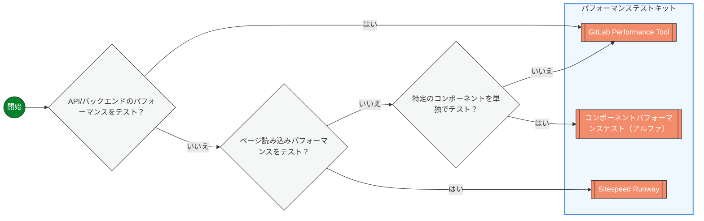

## 概要

パフォーマンステストは、システムのパフォーマンス特性を評価するためのさまざまなアプローチを含む広い分野です。負荷テストはパフォーマンステストと同義語と見なされることが多いですが、パフォーマンステストの多くのアプローチのひとつです。初期開発から本番環境の監視まで、開発ライフサイクル全体にわたってパフォーマンスをテストできる他のアプローチもあります。

以下のデシジョンツリーを使用して、ニーズに合った適切なパフォーマンステストアプローチを見つけてください。



### API またはバックエンドパフォーマンスのテスト

API、データベースクエリ、バックエンドサービスが負荷下でどのようにパフォーマンスを発揮するかをテストしたい場合は、[GitLab Performance Tool](https://gitlab.com/gitlab-org/quality/performance) を使用してください。これには、レスポンス時間、スループット、およびさまざまな負荷条件下でのシステム動作のテストが含まれます。

**使用する場面：**

- REST API エンドポイントのテスト
- データベースクエリパフォーマンスの検証
- バックエンドサービスの負荷テスト
- リファレンスアーキテクチャの検証

### コンポーネントを単独でテスト

マージリクエストレベルで個々のサービスやコンポーネントに対して自動化された負荷テストを実行して、本番環境に到達する前のパフォーマンス変化への早期フィードバックを提供するには、[Component Performance Testing Tool](https://gitlab.com/gitlab-org/quality/component-performance-testing) を使用してください。エンドユーザー API エンドポイントではなく内部 API エンドポイントに対してテストを実行することでこれを実現します。

**使用する場面：**

- 独立してデプロイ可能なコンテナ化されたサービスのテスト（Gitaly、AI Gateway、Registry など）
- マージ前に MR のパフォーマンスリグレッションを検出する
- コンポーネントの変更がスループットのボトルネックを引き起こさないことを検証する
- API レスポンス時間とリソース使用率への迅速なフィードバックを得る
- コンポーネント固有のキャッシュ戦略と設定変更のテスト

**テストの対象：**

- コンポーネントのスループットとレスポンス時間
- リソース使用率（CPU、メモリ、ネットワーク I/O）
- エラーハンドリングのパフォーマンス
- 設定に関連するパフォーマンスへの影響

**テストの対象外：**

- コンポーネント間の統合ボトルネック
- 本番規模のデータ量の問題
- エンドツーエンドのシステムパフォーマンス

> **⚠️ アルファステータス：** コンポーネントパフォーマンステストは現在アルファトライアル中です。使用を希望する場合は、Slack の [#g_performance_enablement](https://gitlab.slack.com/channels/g_performance_enablement) にお問い合わせください。

**採用の前提条件：**

- コンポーネントはコンテナ化されて単独でデプロイ可能であること
- テスト可能なインターフェース（HTTP API、gRPC など）を公開していること
- モック化された依存関係でのテストをサポートしていること

### ページ読み込みパフォーマンスのテスト

Time to First Byte、Largest Contentful Paint、その他の Core Web Vitals などのメトリクスを含む、ユーザーにとってのページ読み込み速度を測定するには、[Sitespeed Runway](https://gitlab.com/gitlab-org/quality/sitespeed-runway) を使用してください。

**使用する場面：**

- フロントエンドパフォーマンスのテスト
- ページ読み込み時間の測定
- ユーザーエクスペリエンスメトリクスの検証
- ブラウザベースのパフォーマンステスト

## 将来の改善

これらのツールはまだ実装されておらず、パフォーマンステストキットを補完して、パフォーマンスの問題を早期に検出する能力を高めます。

```mermaid
flowchart LR
  START((開始))
  UNIT[[ユニットテストのパフォーマンスチェック]]
  PROFILE[[プロファイリングツール]]
  OBSERVE_TEST[[オブザーバビリティベースのパフォーマンステスト]]

  SPECS{新しいユニットテストでテスト？}
  BUILT{開発中にテスト？}
  OBSERVABILITY{ライブパフォーマンスデータを分析？}

  START --> BUILT
  BUILT -- いいえ --> OBSERVABILITY
  BUILT -- はい --> SPECS
  SPECS -- はい --> UNIT
  SPECS -- いいえ --> PROFILE


  OBSERVABILITY -- はい --> OBSERVE_TEST


  %% Class definition
  classDef decision fill:#f5f7f6,stroke:#333,stroke-width:1px,rx:5px;
  classDef tool fill:#F28C6B,stroke:#333,stroke-width:1px,color:white,rx:5px;
  classDef start fill:#03822d,stroke:#333,stroke-width:1px,color:white,rx:10px;

  class BUILT,SPECS,OBSERVABILITY decision;
  class PROFILE,UNIT,OBSERVE_TEST tool;
  class START start;

  %% Tool tooltips with links
  click PROFILE "#profiling-tools"
  click OBSERVE_TEST "https://handbook.gitlab.com/handbook/engineering/testing/observability_performance/"
  click UNIT "#performance-unit-testing" "パフォーマンスアサーションとベンチマークをユニットテストスイートに直接追加して迅速なフィードバックを得る"

  %% Decision node tooltips
  click OBSERVABILITY "Analyzing-live-performance-data"
  click BUILT "Testing-during-development"
  click SPECS "Testing-with-new-unit-tests"
 ```

### 新しいユニットテストでのテスト

ユニットテストにパフォーマンスアサーションを直接追加して、開発の早い段階でパフォーマンスリグレッションを捕捉してください。これにより、個別のパフォーマンステストスイートを必要とせずに、コード変更への迅速なフィードバックが得られます。

**使用する場面：**

- 新しいユニットテストを書いていて、パフォーマンス検証を含めたい場合
- 既存のテストカバレッジにパフォーマンスチェックを追加する場合
- 重要なメソッドが許容可能なパフォーマンス閾値を維持していることを確保する場合
- コードレビュー中にパフォーマンスリグレッションを捕捉する場合

**アプローチの例：**

- 実行時間アサーション（メソッドが X ミリ秒以内に完了する）
- メモリ割り当て制限（メソッドが Y 個未満のオブジェクトを割り当てる）
- データベースクエリ数の検証

### 開発中のテスト

本番環境に到達する前にコードのパフォーマンス特性を理解するために、積極的に開発しながら軽量なプロファイリングツールを使用してください。

**使用する場面：**

- 開発中にアルゴリズムのパフォーマンスを最適化する場合
- 新機能のメモリ使用パターンを理解する場合
- 作業中のコードのパフォーマンスボトルネックを特定する場合
- フルテストスイートなしにコード変更への迅速なフィードバックを得る場合

**ツールの例：**

- CPU およびメモリ分析のためのコードプロファイラー
- データベースクエリアナライザー
- 実装を比較するためのベンチマークユーティリティ

### ライブパフォーマンスデータの分析

既存の監視およびオブザーバビリティデータを活用して、パフォーマンスの問題を特定し、実際の本番メトリクスを使用して改善を検証してください。

**使用する場面：**

- ユーザーから報告されたパフォーマンスの問題を調査する場合
- パフォーマンスの改善が本番環境で効果的であることを検証する場合
- 実際のパフォーマンスパターンを理解する場合
- コード変更と本番パフォーマンスメトリクスを関連付ける場合

**アプローチの例：**

- 主要パフォーマンス指標のダッシュボード分析
- ログベースのパフォーマンストレンド分析
- デプロイメントイベントとパフォーマンス変化の相関付け

### パフォーマンスユニットテスト

パフォーマンスユニットテストにより、開発者はユニットレベルでコードのパフォーマンス特性を評価・適用できます。このアプローチは開発中にパフォーマンスへの迅速なフィードバックを提供し、開発ライフサイクルの早い段階でパフォーマンスリグレッションを捕捉するのに役立ちます。

#### rspec-benchmark の使用

私たちの Gemfile には [rspec-benchmark](https://github.com/piotrmurach/rspec-benchmark) が含まれています。これはパフォーマンステスト用の RSpec マッチャーを提供する gem です。実行時間、1 秒あたりのイテレーション数、割り当て数、メモリ使用量など、さまざまなパフォーマンス側面をアサートするためのさまざまなマッチャーを提供します。

{}
以下は rspec-benchmark を使用してメソッドのパフォーマンスをテストする完全な例です：

```ruby
require 'spec_helper'

RSpec.describe UserFinder do
  describe '#find_active' do
    it 'performs query under 50ms' do
      users = create_list(:user, 100, status: :active)

      expect {
        UserFinder.new.find_active
      }.to perform_under(50).ms
    end

    it 'allocates less than 20 objects' do
      users = create_list(:user, 100, status: :active)

      expect {
        UserFinder.new.find_active
      }.to perform_allocation(count: 1..20)
    end

    it 'scales linearly with number of users' do
      expect do |n, i|
        users = create_list(:user, n, status: :active)
        UserFinder.new.find_active
      end.to perform_linear.in_range(10..100).sample(5)
    end
  end
end
```
{}

### プロファイリングツール

私たちはコーディングガイドラインを遵守し、一般的な問題のあるパターンを避けるために、パイプラインでプロファイリングツール（RuboCop など）をすでに使用しています。コードベースに含まれているパフォーマンスに焦点を当てたものをいくつか紹介します：

1. [ruby-prof](https://ruby-prof.github.io/): フラットプロファイルとグラフプロファイルの両方をサポートする包括的なプロファイリングソリューション。ruby-prof は CPU 時間、メモリ割り当て、オブジェクト作成を測定できます。
2. [Stackprof](https://github.com/tmm1/stackprof): サンプリングコールスタックプロファイラー。特定のユースケースで ruby-prof よりも高速でメモリ効率が良い代替として設計されています。
3. [memory profiler](https://github.com/SamSaffron/memory_profiler): オブジェクト割り当てと保持を含むメモリ使用に関する詳細情報を提供するメモリプロファイラー。パフォーマンスガイドラインの[ドキュメント](https://gitlab.com/gitlab-org/gitlab/-/blob/master/doc/development/performance.md?ref_type=heads#using-memory-profiler)。
4. [rbspy](https://rbspy.github.io): Ruby のサンプリングプロファイラー。Sidekiq トラブルシューティングドキュメントの[ドキュメント](https://gitlab.com/gitlab-org/gitlab/-/blob/master/doc/administration/sidekiq/sidekiq_troubleshooting.md?ref_type=heads#ruby-profiling-with-rbspy)。
5. [derailed benchmarks](https://github.com/zombocom/derailed_benchmarks): メモリ使用量と読み込み時間を含む Rails アプリケーションパフォーマンスのさまざまな側面を測定するベンチマークセット。パフォーマンスガイドラインの[ドキュメント](https://gitlab.com/gitlab-org/gitlab/-/blob/master/doc/development/performance.md?ref_type=heads#derailed-benchmarks)。
6. [benchmark-ips](https://github.com/evanphx/benchmark-ips): ブロックの 1 秒あたりのイテレーション数をベンチマーク。
7. [rspec_profiling](https://github.com/foraker/rspec_profiling): スペック実行時間のデータを収集。パフォーマンスガイドラインの[ドキュメント](https://gitlab.com/gitlab-org/gitlab/-/blob/master/doc/development/performance.md?ref_type=heads#rspec-profiling)。

これらのツールの使用アプローチの一部は、[プロファイリングページ](https://gitlab.com/gitlab-org/gitlab/-/blob/master/doc/development/profiling.md?ref_type=heads)で詳しく説明されています。

## 参考資料

### 外部参考資料

| ページ | 説明 |
| ---- | ---- |
| [Netflix のパフォーマンステスト](https://netflixtechblog.com/fixing-performance-regressions-before-they-happen-eab2602b86fe) | Netflix でのパフォーマンステストに関するブログ記事 |
| [パフォーマンステストプロセスのオートメーションピラミッドモデル](https://abstracta.us/blog/test-automation/performance-testing-automation-pyramid-model-process/) | パフォーマンステストのテストピラミッドを検討するブログ記事 |
| [継続的パフォーマンステスト：包括的ガイド](https://abstracta.us/blog/performance-testing/continuous-performance-testing-a-comprehensive-guide/) | 継続的パフォーマンステストに関するブログ記事 |
| [継続的インテグレーションにおける効果的なパフォーマンステストへの 3 つの課題](https://abstracta.us/blog/performance-testing/3-challenges-effective-performance-testing-continuous-integration/) | CI でのパフォーマンステスト実装の課題に関するブログ記事 |
| [パフォーマンステストを開始する最適な時期は？](https://abstracta.us/blog/performance-testing/best-time-start-performance-testing/) | パフォーマンステストをいつ行うかに関するブログ記事 |

### 内部参考資料

#### プロジェクト

| プロジェクト | 説明 |
| ---- | ---- |
| [GPT](https://gitlab.com/gitlab-org/quality/performance) | GitLab Performance Tool (GPT) は GitLab インスタンスの負荷テストを提供します |
| [Sitespeed Runway](https://gitlab.com/gitlab-org/quality/sitespeed-runway) | ブラウザパフォーマンステストのための SiteSpeed CI パイプライン |
| [CPT（アルファ）](https://gitlab.com/gitlab-org/quality/component-performance-testing) | 個々のサービスのコンポーネントレベルのパフォーマンステスト（現在アルファトライアル中） |
| [sitespeed-measurement-setup](https://gitlab.com/gitlab-org/frontend/sitespeed-measurement-setup) | sitespeed.io を通じて GitLab ウェブサイトのパフォーマンスを測定するためのセットアップ |

#### ドキュメントページ

| ページ | 説明 |
| ---- | ---- |
| [パフォーマンス戦略と測定](/handbook/engineering/performance.md) | GitLab の全体的なパフォーマンス戦略、ターゲット、および測定アプローチ |
| [プロファイリングページ](https://gitlab.com/gitlab-org/gitlab/-/blob/master/doc/development/profiling.md) | GitLab のプロファイリングアプローチに関するドキュメント |
| [ステージグループのオブザーバビリティ](https://docs.gitlab.com/ee/development/stage_group_observability/index.html) | ステージグループに焦点を当てたオブザーバビリティに関するドキュメント |
| [パフォーマンスバー](https://docs.gitlab.com/ee/administration/monitoring/performance/performance_bar.html) | 実行中の GitLab インスタンスのパフォーマンス分析のためのパフォーマンスバー |
| [開発者パフォーマンスガイドライン](https://docs.gitlab.com/ee/development/performance.html) | 開発者向けパフォーマンスガイドライン |
| [マージリクエストパフォーマンスガイドライン](https://docs.gitlab.com/ee/development/merge_request_concepts/performance.html) | マージリクエストに特有のパフォーマンスガイドライン |
| [プラットフォームトリアージダッシュボード](https://dashboards.gitlab.net/d/general-triage/general3a-platform-triage) | パフォーマンスの問題を調査するための出発点ダッシュボード |
