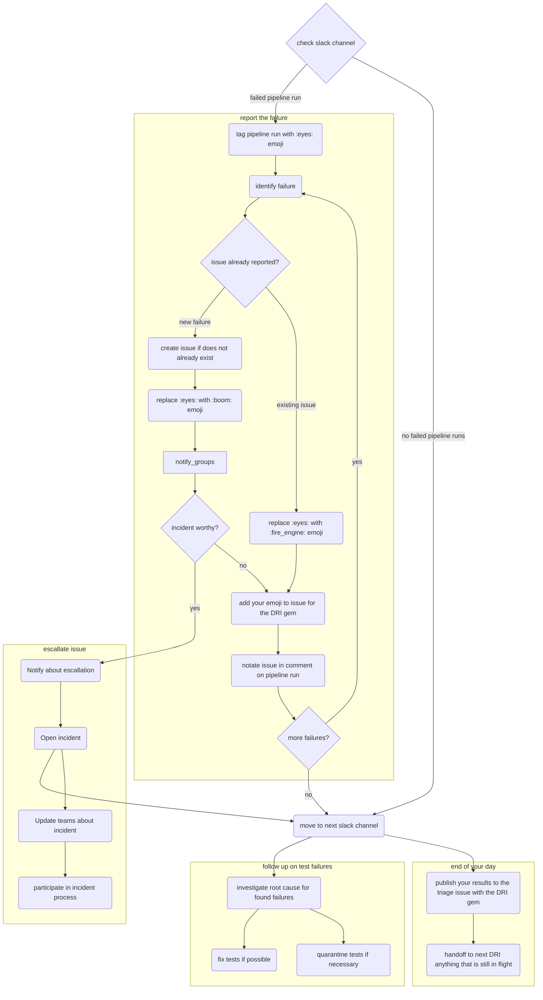

## 概要

このガイドラインは、パイプライントリアージを担当する GitLab チームメンバーに、この責任に伴う優先事項とプロセスを示します。これは [オンコールローテーション](oncall-rotation.md) で提供される情報を基礎にしています。

このガイドは[破損 `master`](/handbook/engineering/workflow/#broken-master) エンジニアリングワークフローの拡張であり、エンドツーエンドテストパイプラインの障害をトリアージする方法のより具体的なガイドを提供することを意図しています。[破損 master インシデントの特定と解決の最初のステップとして、破損 master プロセスのステップに従ってください。](../workflow/#broken-master-escalation)

パイプライントリアージ [DRI](/handbook/people-group/directly-responsible-individuals/) は、テストパイプライン障害の分析とデバッグを担当します。現在の DRI を知るには、[DRI 週次ローテーションスケジュール](oncall-rotation#schedule) を参照してください。

NOTE:
テストパイプライン障害のデバッグに関する情報は、[Debugging Failing E2E Tests and Test Pipelines](https://docs.gitlab.com/development/testing_guide/end_to_end/debugging_end_to_end_test_failures/) をご覧ください

## 一般的なガイドライン

1. **[monthly](https://gitlab.com/gitlab-org/release-tools/-/blob/80d9e08d7ffd99546e810911a31fb46934097880/.gitlab/ci/monthly/update-paths-ci.yml#L43) および [patch](https://gitlab.com/gitlab-org/release-tools/-/blob/80d9e08d7ffd99546e810911a31fb46934097880/.gitlab/ci/security/update-paths-ci.yml#L43) リリースパイプラインで失敗するアップデートパス QA の調査または修正**、必要に応じて修正について[Release Managers](/handbook/engineering/deployments-and-releases/#release-managers) と協調します。
1. **[リリース環境のパイプライン障害を調査または修正](https://gitlab.com/gitlab-com/gl-infra/release-environments/-/pipelines?page=1&scope=all&source=pipeline&ref=main&status=failed)**、必要に応じて修正について [Release Managers](/handbook/engineering/deployments-and-releases/#release-managers) と協調します。
1. **他の開発作業の前に `master` で失敗するテストを修正する**: [`master` で失敗するテストは、新機能などの他の開発作業に対して最高優先度として扱われます](/handbook/engineering/workflow/#broken-master)。パイプライントリアージ DRI にとっては、[トリアージとレポート](#report-the-failure) がテスト修正より優先される点に注意してください。
1. **[リリース環境のパイプライン障害を調査または修正](https://gitlab.com/gitlab-com/gl-infra/release-environments/-/pipelines?page=1&scope=all&source=pipeline&ref=main&status=failed)**、必要に応じて修正について [Release Managers](/handbook/engineering/deployments-and-releases/#release-managers) と協調します。
1. **テスト障害の調査、報告、解決には [パイプライントリアージガイドライン](#how-to-triage-a-qa-test-pipeline-failure) に従ってください**
1. **フレーキーなテストは安定が証明されるまで隔離する**: フレーキーなテストはテストがないのと同じくらい悪く、修正や書き直しに必要な労力のため、場合によってはより悪いことがあります。検出され次第すぐに隔離して CI を安定化し、できるだけ早く修正し、修正されるまで監視します。
1. **テストが隔離から外されたときに、テスト失敗 Issue（[issue](https://gitlab.com/gitlab-org/gitlab/-/issues/412769) の例）をクローズする**: 隔離 Issue は、テストが隔離から外されない限りクローズしてはいけません。
1. **隔離 Issue はアサインしてスケジュールするべき**: 誰かが Issue を所有していることを確実にするため、マイルストーンが設定された状態でアサインし、適切な `~"quarantine"`、タイプ付き quarantine（例: `~"quarantine::bug"`)、タイプ付き failure（例: `~"failure::bug"`) ラベルを付けるべきです。
1. **関連するステージグループに知らせる**: テストが失敗した場合、理由を問わず、関連するプロダクトグループラベル（例: `~"group::ide"`）を付けた Issue を作成し、できるだけ早く関連するプロダクトステージグループに知らせるべきです。
  自分たちのドメインのテストが失敗していることを通知するのに加えて、必要に応じてグループから助けを求めましょう。
1. **バグによる障害**: 1 つまたは複数のテスト失敗がバグの結果である場合、できるだけ多くの詳細（Issue のバグテンプレートを使い、再現手順、関連スクリーンショットなどを提供する）を含むバグ Issue を作成します。**すべて**の関連テスト失敗 Issue をバグ Issue にリンクします。修正がタイムリーにスケジュールされることを確実にするため、`~"type::bug"`、severity、priority、product group、feature category などのラベルを適用します。
  テスト失敗 Issue は追跡と調査の目的で使用されるため、`~"type::bug"` ラベルを持つべきではありません。テスト失敗がバグの結果である場合は、代わりに `~"failure::bug"` ラベルを適用します。
1. **誰でもテストを修正できますが、責任は最後に取り組んだ人にあります**: 誰でも失敗／フレーキーなテストを修正できますが、隔離されたテストが無視されないようにするため、
  テストに最後に取り組んだエンジニアが、テストを[隔離](https://gitlab.com/gitlab-org/gitlab/blob/master/qa/README.md#quarantined-tests) から外す責任を持ちます。

## トリアージフロー

パイプラインをトリアージするフローを意思決定ツリーとして表したものです（ノードはハンドブックの関連セクションにリンクしています）

## QA テストパイプラインの障害をトリアージする方法

一般的なトリアージステップは次のとおりです:

- [障害を報告する](#report-the-failure)
- [障害ログを確認する](#review-the-failure-logs)
- [根本原因を調査する](#investigate-the-root-cause)
- [テスト障害を分類しトリアージする](#classify-and-triage-the-test-failure)
- [関連グループに障害について通知する](#notify-relevant-groups-about-the-failure)

失敗したテストをトリアージした後、可能なフォローアップアクション:

- [テストの修正](#fixing-the-test)
- [テストの隔離](./quarantine-process.md)
- [テストの隔離解除](./quarantine-process.md#dequarantine-a-test)

### 障害を報告する

スケジュールされたパイプラインでは、テスト障害は [Test Failure Issues](https://gitlab.com/gitlab-org/quality/test-failure-issues) プロジェクトで作成および更新されます。

優先事項は、各障害に対して Issue があることを確認し、調査と解決のステータスを伝達することです。複数の障害を報告する必要がある場合、最初に報告する障害を決める際にそれらの影響を考慮してください。さらなるガイダンスについては[パイプライントリアージの責任](/handbook/engineering/testing/oncall-rotation/#responsibility) を参照してください。

複数の障害がある場合は、それぞれが新しいか古いか（つまり、すでにオープンな Issue があるか）を特定することをお勧めします。新しい各障害について、必須の情報のみを含む Issue を開きます。新しい障害ごとに Issue を開いたら、後のセクションで説明するように、それぞれをより徹底的に調査し、適切に行動できます。

すべての新しい障害を最初に報告する理由は、自分のマージリクエストテストパイプラインでテストが失敗していることに気づくかもしれないエンジニアによる、より速い発見を可能にするためです。その障害についてオープンな Issue がない場合、エンジニアは自分の変更がそれを引き起こしたかどうかを把握するのに時間を費やさなければなりません。

既知の障害は、現在の[パイプライントリアージレポート](https://gitlab.com/gitlab-org/quality/pipeline-triage/-/issues) にリンクされるべきです。
これは、自分のプロフィール絵文字でラベル付けすることで、[DRI gem](https://gitlab.com/gitlab-org/ruby/gems/dri) （Issue をパイプライントリアージレポートにリンクすることを自動化するツール）によって実行できます。

ただし、Issue は誰でも開けて、自動的には作成されない点に注意してください。

1. `failure::*` ラベルですでに作成されている既存の Issue を検索します。可能性の高い順:
    1. [`failure::investigating`](https://gitlab.com/gitlab-org/gitlab/-/issues?scope=all&utf8=%E2%9C%93&state=opened&label_name%5B%5D=failure%3A%3Ainvestigating)
    1. [`failure::test-environment`](https://gitlab.com/gitlab-org/gitlab/-/issues?scope=all&utf8=%E2%9C%93&state=opened&label_name%5B%5D=failure%3A%3Atest-environment)
    1. [`failure::broken-test`](https://gitlab.com/gitlab-org/gitlab/-/issues?scope=all&utf8=%E2%9C%93&state=opened&label_name%5B%5D=failure%3A%3Abroken-test)
    1. [`failure::flaky-test`](https://gitlab.com/gitlab-org/gitlab/-/issues?scope=all&utf8=%E2%9C%93&state=opened&label_name%5B%5D=failure%3A%3Aflaky-test)
    1. [`failure::stale-test`](https://gitlab.com/gitlab-org/gitlab/-/issues?scope=all&utf8=%E2%9C%93&state=opened&label_name%5B%5D=failure%3A%3Astale-test)
    1. [`failure::bug`](https://gitlab.com/gitlab-org/gitlab/-/issues?scope=all&utf8=%E2%9C%93&state=opened&label_name%5B%5D=failure%3A%3Abug)
    1. [`failure::external-dependency`](https://gitlab.com/gitlab-org/gitlab/-/issues/?sort=created_date&state=opened&label_name%5B%5D=failure%3A%3Aexternal-dependency)
1. 障害がすでに報告されている場合は、最新のステータスを追跡するため既存の Issue を使用してください。
1. 障害について既存の Issue がない場合は、以下のステップを介して、[分類ラベル](#classify-and-triage-the-test-failure) の 1 つを使って [Issue を作成](#create-an-issue) してください。

{}関連する Slack チャンネルで:

1. 障害を調査していることを示すため :eyes: 絵文字を適用します。
1. システム障害（例: Docker または runner 障害）がある場合は、ジョブを再試行して :retry: 絵文字を適用します。システム障害の例については以下を参照してください。
1. Issue が存在する場合は、:fire_engine: 絵文字を追加します。Issue へのリンクで障害通知に返信することが有用な場合がありますが、これは常に必要というわけではなく、特に障害が前回のパイプラインと同じで、そこにリンクがある場合は不要です。
1. 新しい障害 Issue の場合は :boom: 絵文字を追加します。

パイプライン関連のチャンネルについては、[Slack チャンネル](/handbook/engineering/infrastructure-platforms/developer-experience/onboarding/#slack-channels) のリストをチェックアウトしてください。

#### Issue を作成する

障害をキャプチャするための Issue が作成されていない場合は、このステップを使ってください。すでに Issue がある場合はこのステップをスキップしてください。

1. [https://gitlab.com/gitlab-org/gitlab/issues](https://gitlab.com/gitlab-org/gitlab/issues) で [QA failure](https://gitlab.com/gitlab-org/gitlab/issues/new?issuable_template=QA%20Failure) テンプレートを使って、テストまたはシステム障害（後者の場合、ジョブの再試行で解決しない場合）について Issue を作成します。CustomersDot テストの障害については、[CustomersDot](https://gitlab.com/gitlab-org/customers-gitlab-com/-/issues) プロジェクトで Issue を開いてください。
    - 調査が完了し、[Issue タイプ](/handbook/product/groups/product-analysis/engineering/metrics/#work-type-classification) が決定されるまで、Issue に `~"type::ignore"` ラベルを適用します。
    - 障害について対応する SET に知らせます。
    - システム障害の場合、[Omnibus GitLab](https://gitlab.com/gitlab-org/omnibus-gitlab/issues)、[GitLab QA](https://gitlab.com/gitlab-org/gitlab-qa/issues)、[GitLab Runner](https://gitlab.com/gitlab-org/gitlab-runner/issues) などの別のプロジェクトで Issue を開くことが理にかなう場合があります。
    - ステージング環境関連の障害については、[`#infrastructure_platforms`](https://gitlab.enterprise.slack.com/archives/C02D1HQRTKQ) で質問を投稿するか、[infrastructure プロジェクト](https://gitlab.com/gitlab-com/gl-infra/infrastructure) で Issue を開きます
    - どこに Issue を提出すべきか不確かな場合は、[`#s_developer_experience`](https://gitlab.slack.com/archives/C3JJET4Q6) で助けを求めてください。
1. 関連する Slack チャンネルで :boom: 絵文字を追加し、Issue へのリンクで障害通知に返信します。
1. 現在のパイプライントリアージレポートに関連 Issue として Issue を追加します。1 つのバグの結果として複数の Issue がある場合は、代わりにバグ Issue をレポートに追加します。

### 障害ログを確認する

このステップの目的は、障害を理解することです。調査結果は、障害について何をすべきかも教えてくれます。レビューからの調査結果で障害 Issue を更新してください。障害ログに関するより多くの情報については、[Debugging Failing Tests and Test Pipelines](https://docs.gitlab.com/development/testing_guide/end_to_end/debugging_end_to_end_test_failures/#test-failure-logs) を参照してください

### 根本原因を調査する

テストとその関連セットアップへのコンテキストのレベルによっては、根本原因を自分で調査するのが快適に感じるかもしれませんし、他の SET からすぐに助けを得るかもしれません。

自分で調査する場合は、根本原因を能動的に見つけようとするのに最大 20〜30 分を費やすことをお勧めします（これは障害を報告したり、障害ログを確認したり、テストセットアップやパイプラインの実行時間を費やしたりすることを除きます）。それ以降、またはアイデアが尽きたと感じたら、ブロック解除のため助けを求めることをお勧めします。

**注:** Canary/Production で `gitlab-qa` および他のすべてのボットアカウントを使ってログインすることは避けてください。これらは [SIRT](/handbook/security/security-operations/sirt/) によって監視されており、誰かがそれらを使ってログインするとアラートを発します。これらのアカウントでログインすることが本当に必要な場合は、[#security-division](https://gitlab.slack.com/archives/CM74JMLTU) で誰かがボットにログインしていることを簡単に知らせ、認識のため `@sirt-members` をタグ付けしてください。

以下は、可能性の降順での一般的な根本原因のリストです:

1. コード変更: 新しいコードが環境にデプロイされたかを確認します。
    - テストに影響を与える可能性のある変更があったかを確認するため、この例 `https://gitlab.com/gitlab-org/security/gitlab/-/compare/start_commit_sha...end_commit_sha` を使って現在と以前の GitLab バージョン間の差分を見つけます。
2. フィーチャーフラグ: 新しいフィーチャーフラグが環境で有効になっているかを確認します。
    - フィーチャーフラグが有効になると、特定の QA パイプライン Slack チャンネルに報告されます。これは Full QA ジョブもトリガーし、どの特定のフィーチャーフラグが障害を引き起こしたかを特定するのに役立つかもしれません。
    - 最近および過去のフィーチャーフラグ変更の詳細を含むログのリストは、[feature-flag-log](https://gitlab.com/gitlab-com/gl-infra/feature-flag-log) プロジェクトを訪問することで確認できます。フィーチャーフラグが更新されるたびに、フィーチャーフラグがいつ変更されたか、誰が更新を実行したか、どの環境かなど、有用な情報を含む新しい Issue がプロジェクトで生成されます。プロジェクトには、Issue を検索するときに環境でフィルタするのに役立ついくつかの `host` ラベル（例: `~host::staging.gitlab.com`）が含まれています
        - フィーチャーフラグステータスの視覚的表現として、この[dashboard](https://samdbeckham.gitlab.io/feature-flags) も参照できます。
3. 環境／インフラストラクチャ: コードまたはフィーチャーフラグの変更がなく、環境にフレーキーなエラーがある場合は、まず [Sentry エラーと Kibana ログ](#review-the-failure-logs) の分析から始めて、Issue をさらに調査します。
    - 進行中のインシデントが障害に貢献しているかを確認するため、`#incidents-dotcom` チャンネルをレビューします。
    - [`validate_canary!` check](https://gitlab.com/gitlab-org/gitlab/-/blob/4aa6dde8a375be69b3b1d0d2e2330c7885cbeb54/qa/qa/runtime/canary.rb#L8) が失敗している場合は、[#production](https://gitlab.slack.com/archives/production) Slack チャンネルで `/chatops run canary --production` または [#staging](https://gitlab.slack.com/archives/staging) Slack チャンネルで `/chatops run canary --staging` を実行して、[canary が環境で無効になっていない](https://gitlab.com/gitlab-org/release/docs/blob/master/general/deploy/canary.md#canary-chatops) かを確認します。canary が有効な場合は、各サーバーは `UP` の接続をいくつか報告するはずです。
      `gitlab_canary=true` クッキーが設定されているにもかかわらず、トラフィックが canary にディレクトされない [既知の断続的な Issue](https://gitlab.com/gitlab-org/gitlab/-/issues/431847) があります。
    - GitLab の [Tamland](https://gitlab-com.gitlab.io/gl-infra/tamland/intro.html) もレビューに役立つリソースかもしれません。Tamland は、Sidekiq などのさまざまなサービスの利用率と飽和度を予測するのに役立ちます。たとえば、高い飽和度が予測される場合、これはそのサービスからのパフォーマンス劣化のため、テストでのフレーキーな動作として表面化する可能性があります。Tamland に関するより多くの情報は[こちら](/handbook/engineering/infrastructure-platforms/capacity-planning/#forecasting-with-tamland) にあります。
    - 該当の環境で最近何かが変更されたかを尋ねるため、`#infrastructure_platforms` で Infrastructure チームに連絡することもできます。
4. テストデータ: テストデータが有効であることを確認します。Staging や Production のようなライブ環境は、事前存在するデータ（QA ユーザー、アクセストークン）に依存します。
5. 新しい GitLab QA バージョン: 新しい [GitLab QA バージョン](https://gitlab.com/gitlab-org/gitlab-qa/-/tags?sort=updated_desc) がリリースされたかを確認します。

障害の例は[トレーニングビデオ](#training-videos) で確認できます。

### テスト障害を分類しトリアージする

このステップの目的は、障害を古いテスト、テストのバグ、アプリケーションコードのバグ、フレーキーテストのいずれかとして分類することです。

障害の原因をキャプチャするために、次のラベルを使用します。

- `~"failure::investigating"`: 調査の開始時に適用するデフォルトラベル。
- `~"failure::stale-test"`: [アプリケーション変更による古いテスト](#stale-test-due-to-application-change)
- `~"failure::broken-test"`: [テストのバグ](#bug-in-the-test)
- `~"failure::flaky-test"`: [フレーキーテスト](#flaky-test)
- `~"failure::test-environment"`: [テスト環境による障害](#failure-due-to-test-environment)
- `~"failure::bug"`: [アプリケーションのバグ](#bug-in-the-application)
- `~"failure::external-dependency"`: [外部依存関係による障害](#failure-due-to-external-dependency)

エンドツーエンドテストの実行をブロックするバグ（結果として隔離されたテストが原因）には、さらに severity と priority のラベルが必要です。どれを選ぶかのガイドラインについては、[Issue トリアージページのブロックされたテストセクション](/handbook/product-development/how-we-work/issue-triage/#blocked-tests) を参照してください。

**注**: 修正がすべての環境に伝播するには時間がかかる場合があります。新しい障害が、まだ関連環境に到達していない最近マージされた修正と関連している可能性があることに注意してください。同様に、既知の障害が発生したが、修正がマージされたためテストが合格すべき場合は、さらに修正を試みる前に、修正が関連環境にデプロイされていることを確認してください。

#### アプリケーション変更による古いテスト

アプリケーションコードの変更によって障害が発生し、テストを更新する必要がある場合。

- 障害についての Issue にノートで調査結果を含めます。
- `~"failure::stale-test"` ラベルを適用します。
- 可能であれば、対応するエンジニアに知らせ続けるため、テストが壊れる原因となったマージリクエストをメンションします。

[テストの隔離](#quarantining-tests) を参照してください

#### テストのバグ

アプリケーションコードではなくテストコード自体のバグによって障害が発生した場合。

- 障害についての Issue にノートで調査結果を含めます。
- `~"failure::broken-test"` ラベルを適用します。

[テストの隔離](#quarantining-tests) を参照してください

#### アプリケーションのバグ

アプリケーションコードのバグによって障害が発生した場合。

- テスト失敗 Issue に `~"failure::bug"` ラベルを適用します。
- 新しい Issue を作成し、関連するすべてのテスト失敗 Issue をこの Issue にリンクします。
- バグ Issue に障害についての調査結果をノートで含めます。
- バグの再現手順と期待／実際の動作を追加します。
- `~"type::bug"` ラベルを適用し、対応するエンジニアリングマネージャー (EM)、QEM、SET を cc します。
- バグがエンドツーエンドテストの実行によって見つけられたことを示すため、バグ Issue（または即時修正される場合はバグ修正 MR）に `~"found by e2e test"` ラベルを適用します。
- 問題が[トランジェントバグ](/handbook/product-development/how-we-work/issue-triage/#transient-bugs) の定義に従う場合は、~"bug::transient" ラベルも適用します。
- バグについてすでにオープンな Issue がある場合は、この Issue を代わりに使用し、上記のステップを適用します。
- 対応する Slack チャンネルで Issue を伝達します。
- バグ Issue が作成された直後にテストを[隔離](./quarantine-process.md) します。バグ Issue に、隔離されたテストへのリンクと、修正と共に隔離を解除されるべきとのノートを残します。
- テストを隔離する理由が、今後数リリースで修正されないコードの低重要度バグであるためである場合、テスト失敗 Issue に `~"quarantine"`、タイプ付き quarantine、`~"failure::bug"` ラベルを追加します。
- バグが修正されたら、関連する隔離されたテストは隔離解除され、検証もされるべきです。バグ Issue と関連するすべてのテスト失敗 Issue を一緒にクローズすべきです。

**注**: GitLab は
[日次デプロイメントケイデンス](https://gitlab.com/gitlab-com/gl-infra/delivery/-/issues/880)
を維持しており、`master` での破壊的変更は Canary と Production にすばやく到達します。対応する[プロダクトグループ](/handbook/product/categories/#devops-stages) が回帰を認識し、アクションが必要であることを確実にするため、広く伝達してください。デプロイメントプロセスをブロックする `priority::1/severity::1` Issue については、適切な[Tier 2 オンコールチーム](/handbook/engineering/infrastructure-platforms/incident-management/on-call/tier-2/) へのエスカレーションを検討してください。

cc する適切なチームメンバーを見つけるには、[Organizational Chart](https://comp-calculator.gitlab.net/org_chart) を参照してください。

[テストの隔離](#quarantining-tests) を参照してください

#### フレーキーテスト

**もっと読む**:

- [What is a flaky test?](https://docs.gitlab.com/ee/development/testing_guide/unhealthy_tests.html#whats-a-flaky-test)
- [What are the potential causes for a test to be flaky?](https://docs.gitlab.com/ee/development/testing_guide/unhealthy_tests.html#what-are-the-potential-cause-for-a-test-to-be-flaky)

**プロセス**

- 障害 Issue にノートで調査結果を含めます。
- 障害 Issue に `~"failure::flaky-test"` ラベルを適用します。
- 障害 Issue に `~"flaky-test::*"` [scoped label](https://gitlab.com/groups/gitlab-org/-/labels?subscribed=&sort=relevance&search=flaky-test::) を適用します。

フレーキー性はさまざまな問題によって引き起こされる可能性があります。フレーキー性を引き起こした根本的な問題の例:

- ページのロードや状態間の遷移完了を適切に待たない。
- アニメーションがテストが要素と対話するのを妨げる。
- 独立していないテスト（つまり、テスト A は最初に実行すると合格するが、それ以外では失敗する）。
- アクションが成功裏に完了しない（例: ログアウト）。

詳細については、[unhealthy tests](https://docs.gitlab.com/ee/development/testing_guide/unhealthy_tests.html) ドキュメントの例 Issue リストを参照してください。

**自動フレーキーテスト検出**

最もインパクトの大きいフレーキーテストは自動的に検出され、テストの `feature_category` を所有するチームのエンジニアリングマネージャーに直接報告されます。

[Reporting of Top Flaky Test Files](flaky-tests/_index.md#reporting-of-top-flaky-test-files) を参照してください。

すでにトップフレーキーテストとして特定されたテストを確認するには、`test-failure-issues` プロジェクトの[全トップフレーキーテストファイル Issue](https://gitlab.com/gitlab-org/quality/test-failure-issues/-/issues?sort=created_date&state=opened&label_name%5B%5D=automation%3Atop-flaky-test-file&first_page_size=100) を確認してください。

パイプライントリアージ中に、自動検出されていないフレーキーテストを特定した場合は、[テスト隔離プロセス](./quarantine-process.md) の隔離プロセスに従ってください

#### テスト環境による障害

障害がテストのスコープ外だが GitLab の制御下にあるテスト環境内の外部要因によるもの。これは、環境、デプロイメントハングアップ、または GitLab の制御内のアップストリーム依存関係によるものかもしれません。

- 障害についての Issue にノートで調査結果を含めます。
- `~"failure::test-environment"` ラベルを適用します。
- 改善の一般カテゴリを特定し、[テスト環境の信頼性を向上させ、フレーキー／トランジェントテスト障害を減らす](https://gitlab.com/gitlab-org/quality/team-tasks/-/issues/1309) 追跡 Issue 内にリストされた適切な `Test Reliability` Issue に障害 Issue を追加します。

ジョブは特定のテストに関連しないインフラストラクチャまたはオーケストレーション Issue のために失敗することがあります。場合によっては、これらの Issue はテストが実行される前にジョブを失敗させます。テストに関連しない障害の例:

- GitLab Container Registry からのコンテナのダウンロード失敗
- Geo クラスタのオーケストレーション完了失敗
- CI runner タイムアウト
- ジョブアーティファクトのアップロード中の 500 エラー
- 期限切れトークン（より多くの情報については、[Rotate Credentials](https://internal.gitlab.com/handbook/engineering/infrastructure/engineering-productivity/rotating-credentials/) を確認してください）

#### 外部依存関係による障害

テストが依存しているが GitLab の制御外にある外部依存関係による障害。これは外部パッケージ管理システムの障害、または第三者統合の障害によるものかもしれません。可能な場合は、テストスイートの信頼性を高めるため、外部依存関係を避けるべきです。

- 障害についての Issue にノートで調査結果を含めます。
- `~"failure::external-dependency"` ラベルを適用します。
- 利用可能であれば、外部依存関係の障害通知へのリンクを含めます。

外部依存関係障害の例:

- registry.npmjs.org、RubyGems.org、NuGet、dockerhub などのパッケージまたはコンテナ管理システムの障害
- Zuora などの第三者統合の障害

### 関連グループに障害について通知する

#### エスカレーションが必要な障害

任意のテストスイートで以下の Issue が観察された場合にエスカレーションします:

- クリティカルワークフローで障害があり、3 回の再試行で解決せず、テスト実行時間が前週の平均と比較して 20% 増加している。これには [Test Suite Overview ダッシュボード](https://dashboards.devex.gitlab.net/d/b0d9a2c8-57ca-4b20-bece-b938d0b552ce/test-suite-overview?orgId=1&from=now-7d&to=now&timezone=browser&var-project=gitlab-org%2Fgitlab&var-run_type=e2e-test-on-gdk&var-group=$__all&var-pipeline_type=$__all&refresh=15m) を使用します
- 障害が `GitLab.com` のパフォーマンスおよび／またはセキュリティに影響する可能性がある
- 障害が `GitLab.com` を特定のユーザー／顧客グループに利用不可にする可能性がある

問題のタイプに基づくフォローステップ:

1. **デバッグが困難な失敗テスト**
    - [#g_developer_experience Slack チャンネル](https://gitlab.enterprise.slack.com/archives/C07TWBRER7H) でサポートを求めます
    - リリースマネージャーに Issue について通知します（[リリースマネージャーへの通知方法](#ways-to-notify-release-managers) を参照）

2. **環境障害がテストを失敗させる**
    - `#production` Slack チャンネルで `/incident declare` を使って[インシデントを宣言](../infrastructure-platforms/incident-management/#reporting-an-incident) します。GitLab.com へのデプロイメントもブロックする必要がある場合は、インシデントを S2 に設定します。それ以外は S3。
    - 根本原因と修正の進捗についてリリースマネージャーに通知します（[リリースマネージャーへの通知方法](#ways-to-notify-release-managers) を参照）

3. **コードまたはフィーチャーフラグの変更がテストを失敗させる**
    - 障害がフィーチャーフラグに関連している場合、それは[無効化](https://docs.gitlab.com/operations/feature_flags/#disable-a-feature-flag-for-a-specific-environment) されるべきです
    - 変更を担当する関連ステージグループにエスカレーションします
    - 複数チーム間の調整が必要な場合は、インシデントの宣言を検討します
    - 根本原因と修正の進捗についてリリースマネージャーに通知します（[リリースマネージャーへの通知方法](#ways-to-notify-release-managers) を参照）

##### リリースマネージャーへの通知方法

- GitLab.com では `@gitlab-org/release/managers` を使用
- Slack では `@release-managers` を使用

#### すべてのケースでグループに通知する

プロダクトグループから SET や EM などの適切なチームメンバーをループインすることで、認識を高めてください。SET/EM は、その[ステージ／グループ](/handbook/product/categories/#devops-stages) にアサインされている人を探して特定できます。多くのテストには `product_group` でタグ付けされており、これが特定に役立ちます。障害の影響によっては、Quality の Slack チャンネル `#quality` に投稿することも検討できます。

## テスト障害のフォローアップ

### テストの修正

テストが障害の原因であることがわかった場合（アプリケーションコードが変更されたか、テスト自体にバグがあるため）、修正する必要があります。これは別の SET または自分自身によって行われるかもしれません。ただし、できるだけ早く修正すべきです。いずれの場合も、従うステップは次のとおりです:

- テスト障害の修正でマージリクエスト (MR) を作成します。
- 修正が緊急でデプロイメントのブロック解除が必要な場合は、~"Pick into auto-deploy"、~"priority::1"、~"severity::1" ラベルを適用します。

テストがフレーキーだった場合:

- 隔離中に 3〜5 回合格することを確認することで、テストが安定していることを確認します。

> **注** テストが安定していると確信するために必要な合格数は、単なる提案です。
> 異なる閾値を選ぶために自分の判断を使用できます。

テストが隔離中だった場合は、[隔離から削除](#dequarantining-tests) します。

### テストの隔離

詳細な隔離ワークフローについては、[テスト隔離プロセス](./quarantine-process.md) を参照してください

### テストの隔離解除

[テスト隔離プロセス](./quarantine-process.md#dequarantine-a-test) の Dequarantine セクションを参照してください

## トレーニングビデオ

トリアージプロセスのウォークスルーであるこれらのビデオは、[GitLab Unfiltered](https://www.youtube.com/channel/UCMtZ0sc1HHNtGGWZFDRTh5A) YouTube チャンネルで録画およびアップロードされました。

- [Quality Team: Failure Triage Training - Part 1](https://www.youtube.com/watch?v=Fx1DeWoTG4M)
  - パイプライン障害をローカルで調査する基本をカバーします。
- [Quality Team: Failure Triage Training - Part 2](https://www.youtube.com/watch?v=WeQb8GEw6PM)
  - 失敗したパイプラインで使用された Docker コンテナの使用に焦点を当てた継続的な議論。
- [Quality Engineering On-call Rotation and Debugging QA failures](https://youtu.be/zdIEbl_DPHA) (GitLab Unfiltered の[非公開ビデオ](/handbook/marketing/marketing-operations/youtube/#unable-to-view-a-video-on-youtube))
  - QE オンコールローテーションプロセス、GitLab デプロイメントプロセス、失敗した E2E specs を例とともにデバッグする方法の概要。
- [Quality Engineering: Test environments show and tell](https://drive.google.com/file/d/1m3f5Vz-KSRu7SfNmdDjTQsU5kMDpPwDJ/view)
  - テスト環境の概要を示す Show and tell プレゼンテーション。元々は対応する人々の対象者向けに発表されました。
- [Runner Taskscaler and Fleeting Test Plan Discussion](https://www.youtube.com/watch?v=_uuy7KCDgWw)
  - 新しい [taskscaler](https://gitlab.com/gitlab-org/fleeting/taskscaler) と [fleeting](https://gitlab.com/gitlab-org/fleeting/fleeting) を含む新しい runner アーキテクチャに関するハイレベルな議論。[runner オートスケーリング](https://docs.gitlab.com/runner/runner_autoscale/) のために docker-machine を置き換えるコンポーネントです。
