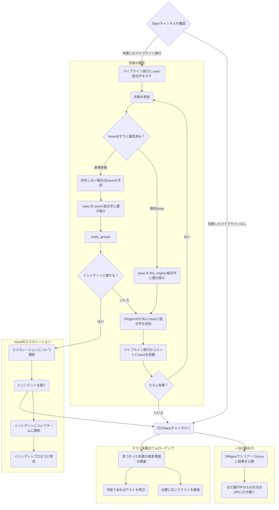

## 概要

このガイドラインは、パイプライントリアージを担当する GitLab チームメンバーに、この責任に伴う優先事項とプロセスについての考え方を提供します。これは[オンコールローテーション](oncall-rotation.md)で提供される情報をベースにしています。

このガイドは[Broken `master`](/handbook/engineering/workflow/#broken-master)エンジニアリングワークフローの拡張であり、エンドツーエンドテストパイプライン失敗のトリアージ方法について、より具体的なガイドを提供することを目的としています。[broken master プロセスに従って、まず broken master インシデントを特定して解決するための最初のステップとして行動してください。](../workflow/#broken-master-escalation)

パイプライントリアージ [DRI](/handbook/people-group/directly-responsible-individuals/) は、テストパイプライン失敗の分析とデバッグを担当します。現在の DRI が誰であるかを確認するには、[DRI 週次ローテーションスケジュール](oncall-rotation#schedule)を参照してください。

NOTE:
テストパイプライン失敗のデバッグに関する情報については、[失敗する E2E テストおよびテストパイプラインのデバッグ](https://docs.gitlab.com/development/testing_guide/end_to_end/debugging_end_to_end_test_failures/)をご覧ください。

## 一般ガイドライン

1. **[月次](https://gitlab.com/gitlab-org/release-tools/-/blob/80d9e08d7ffd99546e810911a31fb46934097880/.gitlab/ci/monthly/update-paths-ci.yml#L43)および[パッチ](https://gitlab.com/gitlab-org/release-tools/-/blob/80d9e08d7ffd99546e810911a31fb46934097880/.gitlab/ci/security/update-paths-ci.yml#L43)リリースパイプラインで失敗しているアップデートパス QA の調査または修正**：必要に応じて[リリースマネージャー](/handbook/engineering/deployments-and-releases/#release-managers)と修正について調整する。
1. **[リリース環境の失敗パイプライン](https://gitlab.com/gitlab-com/gl-infra/release-environments/-/pipelines?page=1&scope=all&source=pipeline&ref=main&status=failed)の調査または修正**：必要に応じて[リリースマネージャー](/handbook/engineering/deployments-and-releases/#release-managers)と修正について調整する。
1. **他の開発作業より先に `master` で失敗しているテストを修正**：[`master` でのテスト失敗は最高優先度として扱われます](/handbook/engineering/workflow/#broken-master)。新機能などの他の開発作業よりも優先されます。パイプライントリアージ DRI については、[トリアージと報告](#report-the-failure)がテストの修正より優先されることに注意してください。
1. **[リリース環境の失敗パイプライン](https://gitlab.com/gitlab-com/gl-infra/release-environments/-/pipelines?page=1&scope=all&source=pipeline&ref=main&status=failed)の調査または修正**：必要に応じて[リリースマネージャー](/handbook/engineering/deployments-and-releases/#release-managers)と修正について調整する。
1. **テスト失敗を調査、報告、解決するために[パイプライントリアージガイドライン](#how-to-triage-a-qa-test-pipeline-failure)に従う**
1. **フレーキーテストは安定するまで検疫する**：フレーキーテストはテストがない場合と同じくらい悪く、場合によってはテストを修正または書き直すために必要な労力のために、それよりも悪いことがあります。検出されたらすぐに CI を安定させるために検疫し、できるだけ早く修正し、修正されるまで監視してください。
1. **テストが検疫から外れたらテスト失敗 Issue をクローズ**（例：[Issue](https://gitlab.com/gitlab-org/gitlab/-/issues/412769)）：検疫 Issue はテストが検疫から外れない限りクローズすべきではありません。
1. **検疫 Issue は割り当てとスケジューリングが必要**：誰かが Issue を担当していることを確認するために、マイルストーンを設定して割り当て、適切な `~"quarantine"`、タイプ付き検疫（例：`~"quarantine::bug"`）、タイプ付き失敗（例：`~"failure::bug"`）ラベルを付けてください。
1. **関連するステージグループに知らせる**：テストが失敗する場合、どんな理由であれ、関連する製品グループラベル（例：`~"group::ide"`）を持つ Issue を作成し、できるだけ早く関連する製品ステージグループに知らせてください。テストが彼らのドメインで失敗していることを通知することに加えて、必要に応じてグループのヘルプを求めてください。
1. **バグによる失敗**：1 つまたは複数のテスト失敗がバグの結果である場合、できるだけ多くの詳細を含むバグ Issue を作成してください（例：Issue の Bug テンプレートを使用し、再現手順、関連スクリーンショットなどを提供する）。**すべての**関連するテスト失敗 Issue をバグ Issue にリンクしてください。修正が適時にスケジュールされることを確保するために、`~"type::bug"`、重大度、優先度、製品グループ、フィーチャーカテゴリなどのラベルを適用してください。
   テスト失敗 Issue はトラッキングと調査目的で使用され、`~"type::bug"` ラベルを持つべきではありません。テスト失敗がバグの結果である場合は、代わりに `~"failure::bug"` ラベルを適用してください。
1. **誰でもテストを修正できる、最後に取り組んだ人が責任を持つ**：誰でも失敗 / フレーキーなテストを修正できますが、検疫されたテストが無視されないように、そのテストに最後に取り組んだエンジニアが[検疫](https://gitlab.com/gitlab-org/gitlab/blob/master/qa/README.md#quarantined-tests)から外す責任があります。

## トリアージフロー

ハンドブックの関連セクションへのリンクを持つデシジョンツリーとしてパイプラインをトリアージするフロー

## QA テストパイプライン失敗のトリアージ方法

一般的なトリアージ手順は：

- [失敗を報告する](#report-the-failure)
- [失敗ログをレビューする](#review-the-failure-logs)
- [根本原因を調査する](#investigate-the-root-cause)
- [テスト失敗を分類してトリアージする](#classify-and-triage-the-test-failure)
- [失敗について関連グループに通知する](#notify-relevant-groups-about-the-failure)

失敗したテストのトリアージ後、可能なフォローアップアクションは：

- [テストを修正する](#fixing-the-test)
- [テストを検疫する](./quarantine-process.md)
- [テストの検疫を解除する](./quarantine-process.md#dequarantine-a-test)

### 失敗を報告する

スケジュールされたパイプラインの場合、テスト失敗は[Test Failure Issues](https://gitlab.com/gitlab-org/quality/test-failure-issues)プロジェクトに作成・更新されます。

優先事項は、各失敗について Issue があることを確認し、その調査と解決のステータスを伝えることです。報告すべき失敗が複数ある場合は、最初に報告するものを決める際に影響を考慮してください。詳細なガイダンスについては[パイプライントリアージの責任](/handbook/engineering/testing/oncall-rotation/#responsibility)を参照してください。

複数の失敗がある場合は、それぞれが新しいものか古いもの（したがってすでに Issue が開かれている）かを識別することを推奨します。各新しい失敗について、必要な情報のみを含む Issue を開いてください。新しい失敗ごとに Issue を開いたら、後のセクションで説明するように、それぞれをより徹底的に調査して適切に対処できます。

最初にすべての新しい失敗を報告する理由は、自分のマージリクエストテストパイプラインでテストの失敗を見つけたエンジニアによる発見を速めるためです。その失敗についてオープンな Issue がない場合、エンジニアは自分の変更がそれを引き起こしたかどうかを解明するのに時間を費やさなければなりません。

既知の失敗は現在の[パイプライントリアージレポート](https://gitlab.com/gitlab-org/quality/pipeline-triage/-/issues)にリンクされているべきです。
これは[DRI gem](https://gitlab.com/gitlab-org/ruby/gems/dri)（Issue をパイプライントリアージレポートにリンクする作業を自動化するツール）によって実行できます。プロフィール絵文字でラベリングすることで行います。

ただし、Issue は誰でも開けることができ、自動的には作成されないことに注意してください。

1. すでに `failure::*` ラベルで作成された既存の Issue を検索する。可能性の高い順に：
    1. [`failure::investigating`](https://gitlab.com/gitlab-org/gitlab/-/issues?scope=all&utf8=%E2%9C%93&state=opened&label_name%5B%5D=failure%3A%3Ainvestigating)
    1. [`failure::test-environment`](https://gitlab.com/gitlab-org/gitlab/-/issues?scope=all&utf8=%E2%9C%93&state=opened&label_name%5B%5D=failure%3A%3Atest-environment)
    1. [`failure::broken-test`](https://gitlab.com/gitlab-org/gitlab/-/issues?scope=all&utf8=%E2%9C%93&state=opened&label_name%5B%5D=failure%3A%3Abroken-test)
    1. [`failure::flaky-test`](https://gitlab.com/gitlab-org/gitlab/-/issues?scope=all&utf8=%E2%9C%93&state=opened&label_name%5B%5D=failure%3A%3Aflaky-test)
    1. [`failure::stale-test`](https://gitlab.com/gitlab-org/gitlab/-/issues?scope=all&utf8=%E2%9C%93&state=opened&label_name%5B%5D=failure%3A%3Astale-test)
    1. [`failure::bug`](https://gitlab.com/gitlab-org/gitlab/-/issues?scope=all&utf8=%E2%9C%93&state=opened&label_name%5B%5D=failure%3A%3Abug)
    1. [`failure::external-dependency`](https://gitlab.com/gitlab-org/gitlab/-/issues/?sort=created_date&state=opened&label_name%5B%5D=failure%3A%3Aexternal-dependency)
1. Issue がすでに報告されている場合は、既存の Issue を使用して最新のステータスを追跡してください。
1. 失敗について既存の Issue がない場合は、以下の手順で[分類ラベル](#classify-and-triage-the-test-failure)のいずれかを使用して[Issue を作成](#create-an-issue)してください。

関連する Slack チャンネルで：

1. :eyes: 絵文字を適用して、失敗を調査中であることを示す。
1. システム障害（Docker やランナーの障害など）がある場合は、ジョブを再試行して :retry: 絵文字を適用する。システム障害の例については以下を参照。
1. Issue が存在する場合は、:fire_engine: 絵文字を追加する。失敗通知への返信として Issue へのリンクを添付することが役立つ場合があるが、常に必要なわけではない。特に失敗が前のパイプラインと同じで、そこにリンクがある場合は不要。
1. 新しい失敗 Issue の場合は、:boom: 絵文字を追加する。

パイプライン関連チャンネルについては[Slack チャンネル](/handbook/engineering/infrastructure-platforms/developer-experience/onboarding/#slack-channels)のリストをご覧ください。

#### Issue を作成する

失敗をキャプチャするために作成された Issue がない場合は、このステップを使用してください。すでに Issue がある場合はこのステップをスキップしてください。

1. [https://gitlab.com/gitlab-org/gitlab/issues](https://gitlab.com/gitlab-org/gitlab/issues) で [QA failure](https://gitlab.com/gitlab-org/gitlab/issues/new?issuable_template=QA%20Failure) テンプレートを使用して、テストまたはシステム障害の Issue を作成する（後者の場合はジョブを再試行しても解決しない場合）。CustomersDot テストの失敗については、[CustomersDot](https://gitlab.com/gitlab-org/customers-gitlab-com/-/issues) プロジェクトで Issue を開く。
    - 調査が完了して [Issue タイプ](/handbook/product/groups/product-analysis/engineering/metrics/#work-type-classification)が決定されるまで、Issue に `~"type::ignore"` ラベルを適用する。
    - カウンターパート SET に失敗について通知する。
    - システム障害については、[Omnibus GitLab](https://gitlab.com/gitlab-org/omnibus-gitlab/issues)、[GitLab QA](https://gitlab.com/gitlab-org/gitlab-qa/issues)、[GitLab Runner](https://gitlab.com/gitlab-org/gitlab-runner/issues) など、別のプロジェクトで Issue を開くことが理にかなっている場合がある。
    - staging 環境関連の失敗については、[`#infrastructure-lounge`](https://gitlab.slack.com/archives/CB3LSMEJV) に質問を投稿するか、[インフラプロジェクト](https://gitlab.com/gitlab-com/gl-infra/infrastructure) で Issue を開く。
    - Issue をどこに提出すればよいかわからない場合は、[`#s_developer_experience`](https://gitlab.slack.com/archives/C3JJET4Q6) でヘルプを求める。
1. 関連する Slack チャンネルで :boom: 絵文字を追加し、失敗通知への返信として Issue へのリンクを添付する。
1. Issue を現在のパイプライントリアージレポートに関連 Issue として追加する。複数の Issue が 1 つのバグの結果である場合は、代わりにバグ Issue をレポートに追加する。

### 失敗ログをレビューする

このステップの目的は、失敗を理解することです。調査の結果は、失敗についてどうすべきかも教えてくれます。レビューの結果を失敗 Issue に更新してください。失敗ログの詳細については、[テストと テストパイプラインのデバッグ失敗](https://docs.gitlab.com/development/testing_guide/end_to_end/debugging_end_to_end_test_failures/#test-failure-logs)を参照してください。

### 根本原因を調査する

テストとその関連セットアップのコンテキストのレベルによっては、自分で根本原因を調査するのが快適かもしれないし、すぐに他の SET にヘルプを求めることもあります。

自分で調査する場合は、根本原因を積極的に見つけようとするのに最大 20〜30 分を費やすことを推奨します（これには失敗の報告、失敗ログのレビュー、またはテストのセットアップとパイプラインの実行時間は含まれません）。それ以降、またはアイデアがなくなった時はいつでも、ブロックを解除するためにヘルプを求めることを推奨します。

**注意：** Canary/Production の `gitlab-qa` およびその他のボットアカウントを介してログインすることは避けてください。これらは [SIRT](/handbook/security/security-operations/sirt/) によって監視されており、誰かがそれらを使用してログインするとアラートが発生します。これらのアカウントでログインする必要がある場合は、ボットにログインしていることを [#security-division](https://gitlab.slack.com/archives/CM74JMLTU) で簡単に知らせ、`@sirt-members` に認識のためタグを付けてください。

以下は、可能性の降順で並んだ一般的な根本原因のリストです：

1. コード変更：環境に新しいコードがデプロイされたかどうかを確認する。
    - この例 `https://gitlab.com/gitlab-org/security/gitlab/-/compare/start_commit_sha...end_commit_sha` を使用して、現在と前の GitLab バージョン間の差分を見つけ、テストに影響を与えた可能性のある変更があったかどうかを確認する。
2. フィーチャーフラグ：環境で新しいフィーチャーフラグが有効になっているかどうかを確認する。
    - フィーチャーフラグが有効になると、特定の QA パイプライン Slack チャンネルに報告される。これにより Full QA ジョブもトリガーされ、どの特定のフィーチャーフラグが失敗を引き起こしたかを特定するのに役立つ場合がある。
    - 最近と過去のフィーチャーフラグの変更の詳細を含むログのリストは、[feature-flag-log](https://gitlab.com/gitlab-com/gl-infra/feature-flag-log) プロジェクトを訪問することでも表示できる。フィーチャーフラグが更新されるたびに、フィーチャーフラグが変更された日時、更新を行ったユーザー、どの環境かなどの役立つ情報を含む新しい Issue がプロジェクトに生成される。プロジェクトには、Issue を検索する際に環境でフィルタリングするのに役立ついくつかの `host` ラベルが含まれている（例：`~host::staging.gitlab.com`）。
        - フィーチャーフラグのステータスを視覚的に確認するために、この[ダッシュボード](https://samdbeckham.gitlab.io/feature-flags)も参照できる。
3. 環境 / インフラ：コードやフィーチャーフラグの変更がなく、環境に断続的なエラーがある場合は、まず [Sentry エラーと Kibana ログ](#review-the-failure-logs)を分析して問題をさらに調査する。
    - `#incidents-dotcom` チャンネルを確認して、進行中のインシデントが失敗に貢献しているかどうかを確認する。
    - [`validate_canary!` チェック](https://gitlab.com/gitlab-org/gitlab/-/blob/4aa6dde8a375be69b3b1d0d2e2330c7885cbeb54/qa/qa/runtime/canary.rb#L8)が失敗している場合は、[環境でカナリアが無効になっていないか](https://gitlab.com/gitlab-org/release/docs/blob/master/general/deploy/canary.md#canary-chatops)を確認する。[#production](https://gitlab.slack.com/archives/production) で `/chatops run canary --production` または [#staging](https://gitlab.slack.com/archives/staging) Slack チャンネルで `/chatops run canary --staging` を実行する。カナリアが有効になっている場合、各サーバーはいくつかの接続 `UP` を報告するはず。
      `gitlab_canary=true` Cookie が設定されているにもかかわらず、トラフィックがカナリアに向けられないという[既知の断続的な問題](https://gitlab.com/gitlab-org/gitlab/-/issues/431847)がある。
    - GitLab の [Tamland](https://gitlab-com.gitlab.io/gl-infra/tamland/intro.html) も参考になるリソースかもしれない。Tamland は Sidekiq などのさまざまなサービスの使用率と飽和を予測するために使用されている。たとえば、高い飽和が予測される場合、そのサービスのパフォーマンス低下によるテストでのフレーキーな動作として現れる可能性がある。Tamland の詳細は[こちら](/handbook/engineering/infrastructure-platforms/capacity-planning/#forecasting-with-tamland)。
    - 問題となっている環境で最近何かが変更されたかどうかを `#infrastructure-lounge` でインフラチームに問い合わせることもできる。
4. テストデータ：テストデータが有効であることを確認する。Staging や Production などのライブ環境は既存のデータ（QA ユーザー、アクセストークン）に依存している。
5. 新しい GitLab QA バージョン：新しい [GitLab QA バージョン](https://gitlab.com/gitlab-org/gitlab-qa/-/tags?sort=updated_desc)がリリースされたかどうかを確認する。

失敗の例は[トレーニング動画](#training-videos)で確認できます。

### テスト失敗を分類してトリアージする

このステップの目的は、失敗を陳腐化したテスト、テストのバグ、アプリケーションコードのバグ、またはフレーキーテストとして分類することです。

失敗の原因をキャプチャするために以下のラベルを使用しています。

- `~"failure::investigating"`: 調査開始時にデフォルトで適用するラベル。
- `~"failure::stale-test"`: [アプリケーション変更による陳腐化したテスト](#stale-test-due-to-application-change)
- `~"failure::broken-test"`: [テストのバグ](#bug-in-the-test)
- `~"failure::flaky-test"`: [フレーキーテスト](#flaky-test)
- `~"failure::test-environment"`: [テスト環境による失敗](#failure-due-to-test-environment)
- `~"failure::bug"`: [アプリケーションのバグ](#bug-in-the-application)
- `~"failure::external-dependency"`: [外部依存性による失敗](#failure-due-to-external-dependency)

（検疫されたテストによる）エンドツーエンドテスト実行をブロックするバグには、重大度と優先度ラベルを追加してください。選択するガイドラインについては、[Issue トリアージページのブロックされたテストセクション](/handbook/product-development/how-we-work/issue-triage/#blocked-tests)を参照してください。

**注意**：修正が全環境に伝播するまでに時間がかかる場合があります。新しい失敗が、まだ関連する環境に到達していない最近マージされた修正に関連している可能性があることに注意してください。同様に、既知の失敗が発生したが、修正がマージされたためテストが通過するはずである場合は、さらなるトラブルシューティングを試みる前に、修正が関連する環境にデプロイされていることを確認してください。

#### アプリケーション変更による陳腐化したテスト

失敗はアプリケーションコードの変更によって引き起こされ、テストを更新する必要があります。

- Issue の注釈に調査結果を含める。
- `~"failure::stale-test"` ラベルを適用する。
- 可能であれば、テストが壊れる原因となったマージリクエストをメンションして、対応するエンジニアに通知する。

[テストの検疫](#quarantining-tests)を参照。

#### テストのバグ

失敗はアプリケーションコードではなく、テストコード自体のバグによって引き起こされました。

- Issue の注釈に調査結果を含める。
- `~"failure::broken-test"` ラベルを適用する。

[テストの検疫](#quarantining-tests)を参照。

#### アプリケーションのバグ

失敗はアプリケーションコードのバグによって引き起こされました。

- テスト失敗 Issue に `~"failure::bug"` ラベルを適用する。
- すべての関連するテスト失敗 Issue をこの Issue にリンクする新しい Issue を作成する。
- バグ Issue の注釈に調査結果を含める。
- バグの再現手順と期待 / 実際の動作を追加する。
- `~"type::bug"` ラベルを適用し、対応する Engineering Manager (EM)、QEM、SET に CC する。
- バグがエンドツーエンドテストの実行によって見つかったことを示すために、バグ Issue（またはすぐに修正される場合はバグ修正 MR）に `~"found by e2e test"` ラベルを適用する。
- 問題が[一時的なバグ](/handbook/product-development/how-we-work/issue-triage/#transient-bugs)の定義に当てはまる場合は、`~"bug::transient"` ラベルも適用する。
- バグのための Issue がすでに開かれている場合は、代わりにその Issue を使用して上記の手順を適用する。
- 対応する Slack チャンネルで Issue を伝える。
- バグ Issue が作成された直後に[テストを検疫する](./quarantine-process.md)。バグ Issue に検疫されたテストへのリンクを残し、修正でその検疫が解除されるべきであることをメンションする。
- テストを検疫する理由が、次の数リリースでは修正されない低重大度のコードバグである場合は、`~"quarantine"`、タイプ付き検疫、`~"failure::bug"` ラベルをテスト失敗 Issue に追加する。
- バグが修正されたら、関連する検疫されたテストも検疫解除して検証してください。バグ Issue とすべての関連するテスト失敗 Issue はまとめてクローズされるべきです。

**注意**：GitLab は[毎日のデプロイケイデンス](https://gitlab.com/gitlab-com/gl-infra/delivery/-/issues/880)を維持しているため、`master` の破壊的変更は Canary および Production に素早く到達します。対応する[プロダクトグループ](/handbook/product/categories/#devops-stages)がリグレッションを認識してアクションが必要であることを確認するために、広く伝えてください。デプロイメントプロセスをブロックする `priority::1/severity::1` の Issue については、適切な[Tier 2 オンコールチーム](/handbook/engineering/infrastructure-platforms/incident-management/on-call/tier-2/)へのエスカレーションを検討してください。

cc する適切なチームメンバーを見つけるには、[組織チャート](https://comp-calculator.gitlab.net/org_chart)を参照してください。

[テストの検疫](#quarantining-tests)を参照。

#### フレーキーテスト

**詳細情報**：

- [フレーキーテストとは？](https://docs.gitlab.com/ee/development/testing_guide/unhealthy_tests.html#whats-a-flaky-test)
- [テストがフレーキーになる潜在的な原因は？](https://docs.gitlab.com/ee/development/testing_guide/unhealthy_tests.html#what-are-the-potential-cause-for-a-test-to-be-flaky)

**プロセス**

- 失敗 Issue の注釈に調査結果を含める。
- 失敗 Issue に `~"failure::flaky-test"` ラベルを適用する。
- 失敗 Issue に `~"flaky-test::*"` [スコープラベル](https://gitlab.com/groups/gitlab-org/-/labels?subscribed=&sort=relevance&search=flaky-test::)を適用する。

フレーキーさは無数の問題によって引き起こされる可能性があります。私たちにフレーキーさをもたらした根本的な問題の例：

- ページの読み込みや、ある状態から別の状態への移行が完了するのを適切に待機していない。
- アニメーションがテストと要素の相互作用を妨げている。
- 独立していないテスト（テスト A が最初に実行されると通過するが、そうでないと失敗する）。
- アクションが正常に完了していない（例：ログアウト）。

詳細については、[不健全なテスト](https://docs.gitlab.com/ee/development/testing_guide/unhealthy_tests.html)ドキュメントの例の Issue のリストを参照してください。

**自動フレーキーテスト検出**

最も影響の大きいフレーキーテストは自動的に検出され、テストの `feature_category` を所有するチームの Engineering Manager に直接報告されます。

[トップフレーキーテストファイルのレポート](flaky-tests/_index.md#reporting-of-top-flaky-test-files)を参照してください。

どのテストがトップフレーキーテストとして特定されているかを確認するには、`test-failure-issues` プロジェクトのすべての[トップフレーキーテストファイル Issue](https://gitlab.com/gitlab-org/quality/test-failure-issues/-/issues?sort=created_date&state=opened&label_name%5B%5D=automation%3Atop-flaky-test-file&first_page_size=100)を表示してください。

パイプライントリアージ中に自動検出されていないフレーキーテストを特定した場合は、[テスト検疫プロセス](./quarantine-process.md)の検疫プロセスに従ってください。

#### テスト環境による失敗

テストのスコープ外だが GitLab のコントロール下にあるテスト環境内の外部要因による失敗です。これは環境、デプロイの問題、または GitLab のコントロール内のアップストリーム依存性によるものかもしれません。

- Issue の注釈に調査結果を含める。
- `~"failure::test-environment"` ラベルを適用する。
- 改善の一般的なカテゴリを特定し、[テスト環境の信頼性改善とフレーキー/一時的なテスト失敗の削減](https://gitlab.com/gitlab-org/quality/team-tasks/-/issues/1309)追跡 Issue 内の適切な `Test Reliability` Issue に失敗 Issue を追加する。

ジョブは特定のテストとは関係のないインフラやオーケストレーションの問題によって失敗することがあります。場合によっては、テストが実行される前にジョブが失敗することもあります。テスト以外の失敗のいくつかの例：

- GitLab Container Registry からコンテナのダウンロードに失敗
- Geo クラスターのオーケストレーションの完了に失敗
- CI ランナーのタイムアウト
- ジョブアーティファクトのアップロード中に 500 エラー
- 有効期限切れのトークン（詳細については、[認証情報のローテーション](https://internal.gitlab.com/handbook/engineering/infrastructure/engineering-productivity/rotating-credentials/)方法を参照してください）

#### 外部依存性による失敗

テストが依存しているが GitLab のコントロール外にある外部依存性による失敗です。これは外部パッケージ管理システムの停止、またはサードパーティ統合の停止によるものかもしれません。可能であれば、テストスイートの信頼性を高めるために外部依存性は避けるべきです。

- Issue の注釈に調査結果を含める。
- `~"failure::external-dependency"` ラベルを適用する。
- 可能であれば、外部依存性の停止通知へのリンクを含める。

外部依存性の失敗のいくつかの例：

- registry.npmjs.org、RubyGems.org、NuGet、dockerhub などのパッケージやコンテナ管理システムの停止
- Zuora などのサードパーティ統合の停止

### 失敗について関連グループに通知する

#### 失敗のエスカレーションが必要な場合

以下の Issue がどのテストスイートでも観察された場合にエスカレーションしてください：

- 重要なワークフローに失敗があり、3 回の再試行で解消されず、テスト実行時間が前週の平均と比較して 20% 以上増加している。これを確認するには[テストスイート概要ダッシュボード](https://dashboards.devex.gitlab.net/d/b0d9a2c8-57ca-4b20-bece-b938d0b552ce/test-suite-overview?orgId=1&from=now-7d&to=now&timezone=browser&var-project=gitlab-org%2Fgitlab&var-run_type=e2e-test-on-gdk&var-group=$__all&var-pipeline_type=$__all&refresh=15m)を使用する。
- 失敗が `GitLab.com` のパフォーマンスや/またはセキュリティに影響を与える可能性がある。
- 失敗が特定のグループのユーザー / 顧客に `GitLab.com` を利用不能にする可能性がある。

問題のタイプに基づいて従うべき手順：

1. **デバッグが難しい失敗したテスト**
    - [#g_developer_experience Slack チャンネル](https://gitlab.enterprise.slack.com/archives/C07TWBRER7H)でサポートを求める
    - リリースマネージャーに問題を通知する（[リリースマネージャーへの通知方法](#ways-to-notify-release-managers)を参照）

2. **テストの失敗を引き起こす環境の失敗**
    - `#production` Slack チャンネルで `/incident declare` を使用して[インシデントを宣言する](../infrastructure-platforms/incident-management/#reporting-an-incident)。GitLab.com へのデプロイをブロックする必要がある場合は、インシデントを S2 に設定する。それ以外は S3。
    - 根本原因と修正の進捗についてリリースマネージャーに通知する（[リリースマネージャーへの通知方法](#ways-to-notify-release-managers)を参照）

3. **テストの失敗を引き起こすコードまたはフィーチャーフラグの変更**
    - 失敗がフィーチャーフラグに関連している場合は、[無効化する](https://docs.gitlab.com/operations/feature_flags/#disable-a-feature-flag-for-a-specific-environment)べき
    - 変更を担当する関連ステージグループにエスカレーションする
    - 複数のチームにわたる調整が必要な場合は、インシデントの宣言を検討する
    - 根本原因と修正の進捗についてリリースマネージャーに通知する（[リリースマネージャーへの通知方法](#ways-to-notify-release-managers)を参照）

##### リリースマネージャーへの通知方法

- GitLab.com では `@gitlab-org/release/managers` を使用する
- Slack では `@release-managers` を使用する

#### すべての場合にグループに通知する

また、SET や EM などのプロダクトグループの適切なチームメンバーを巻き込んで認識を高めてください。SET/EM は[ステージ/グループ](/handbook/product/categories/#devops-stages)に割り当てられた担当者を見て特定できます。多くのテストには `product_group` でタグが付けられており、特定に役立ちます。失敗の影響によっては、Quality の Slack チャンネル `#quality` にも投稿することをお勧めします。

## テスト失敗のフォローアップ

### テストを修正する

テストが失敗の原因であること（アプリケーションコードが変更されたか、テスト自体にバグがあるため）がわかったら、修正が必要です。これは別の SET または自分自身によって行われるかもしれません。しかし、できるだけ早く修正する必要があります。いずれにしても、以下の手順に従ってください：

- テスト失敗の修正を含むマージリクエスト（MR）を作成する。
- 修正が緊急でデプロイをブロック解除するために必要な場合は、~"Pick into auto-deploy"、~"priority::1"、~"severity::1" ラベルを適用する。

テストがフレーキーだった場合：

- テストが検疫中に 3〜5 回パスすることで安定していることを確認する。

> **注意** テストが安定していることを確認するために必要なパス回数は単なる提案です。
> 別の閾値を選ぶためにあなたの判断を使うことができます。

テストが検疫中だった場合は、[検疫を解除する](#dequarantining-tests)。

### テストの検疫

詳細な検疫ワークフローについては、[テスト検疫プロセス](./quarantine-process.md)を参照してください。

### テストの検疫解除

[テスト検疫プロセス](./quarantine-process.md#dequarantine-a-test)の検疫解除セクションを参照してください。

## トレーニング動画

これらのトリアージプロセスのウォークスルー動画は録画されて [GitLab Unfiltered](https://www.youtube.com/channel/UCMtZ0sc1HHNtGGWZFDRTh5A) YouTube チャンネルにアップロードされています。

- [Quality Team: Failure Triage Training - Part 1](https://www.youtube.com/watch?v=Fx1DeWoTG4M)
  - パイプライン失敗をローカルで調査する基本をカバー。
- [Quality Team: Failure Triage Training - Part 2](https://www.youtube.com/watch?v=WeQb8GEw6PM)
  - 失敗したパイプラインで使用された Docker コンテナの使用に焦点を当てた継続的な議論。
- [Quality Engineering On-call Rotation and Debugging QA failures](https://youtu.be/zdIEbl_DPHA)（GitLab Unfiltered の[非公開動画](/handbook/marketing/marketing-operations/youtube/#unable-to-view-a-video-on-youtube)）
  - QE オンコールローテーションプロセス、GitLab デプロイプロセス、失敗した E2E スペックのデバッグ方法の例を含む概要。
- [Quality Engineering: Test environments show and tell](https://drive.google.com/file/d/1m3f5Vz-KSRu7SfNmdDjTQsU5kMDpPwDJ/view)
  - テスト環境の概要を示すショーアンドテールプレゼンテーション。カウンターパートの視聴者向けに元々プレゼンされた。
- [Runner Taskscaler and Fleeting Test Plan Discussion](https://www.youtube.com/watch?v=_uuy7KCDgWw)
  - 新しいランナーアーキテクチャの概要に関する高レベルな議論。新しい [taskscaler](https://gitlab.com/gitlab-org/fleeting/taskscaler) と [fleeting](https://gitlab.com/gitlab-org/fleeting/fleeting) を含む。[ランナーオートスケーリング](https://docs.gitlab.com/runner/runner_autoscale/)の docker-machine を置き換えるコンポーネント。
