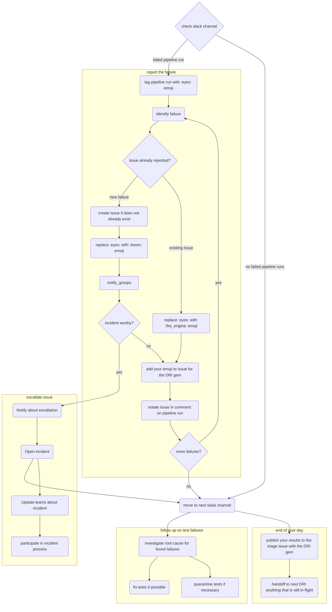

> ⚠️ 注: DevOps の変革の一環として、**Developer Experience はパイプライントリアージを行わなくなり**、中央集約型の Pipeline DRI プロセスは廃止されつつあります。テストパイプライン障害のトリアージとデバッグは、`feature_category`/`product_group` ごとの**所有機能チーム**の責任です。Developer Experience（DevEx）は、トリアージの所有者ではなく、**重大なエスカレーション先に限られます**。以下の手順ガイダンスは、トリアージを行う人にとって引き続き役立ちます。Software Engineer in Test（SET）のロールも Backend Engineer に移行しました。以下の「SET」は、所有チーム内の該当するエンジニアを意味します。

## 概要

このガイドでは、エンドツーエンドのテストパイプライン障害をトリアージおよびデバッグする方法を説明します。トリアージは、失敗したテストの `feature_category`/`product_group` で識別される、そのテストを所有するチームが担います。DevEx は共有パイプラインインフラストラクチャを提供し、重大な問題では最後の手段としてのみ対応します。これは [On-Call ローテーション](oncall-rotation.md) の情報を土台としています。

このガイドは [Broken `master`](/handbook/engineering/workflow/#broken-master) エンジニアリングワークフローの拡張であり、エンドツーエンドのテストパイプライン障害をトリアージする方法について、より具体的なガイドを提供することを目的としています。[broken master インシデントを特定し解決するための最初のステップとして、broken master プロセスの手順に従ってください。](../workflow/#broken-master-escalation)

パイプライン障害をトリアージする人は、以下の手順を使って障害を分析およびデバッグし、所有チームを巻き込む責任を負います。

NOTE:
テストパイプライン障害のデバッグに関する情報については、[Debugging Failing E2E Tests and Test Pipelines](https://docs.gitlab.com/development/testing_guide/end_to_end/debugging_end_to_end_test_failures/) を参照してください。

## 一般的なガイドライン

1. **[monthly](https://gitlab.com/gitlab-org/release-tools/-/blob/80d9e08d7ffd99546e810911a31fb46934097880/.gitlab/ci/monthly/update-paths-ci.yml#L43) および [patch](https://gitlab.com/gitlab-org/release-tools/-/blob/80d9e08d7ffd99546e810911a31fb46934097880/.gitlab/ci/security/update-paths-ci.yml#L43) リリースパイプラインで失敗しているアップデートパス QA を調査または修正する**。必要に応じて修正について [Release Managers](/handbook/engineering/deployments-and-releases/#release-managers) と調整します。
1. **[Release Environments のパイプライン障害を調査または修正する](https://gitlab.com/gitlab-com/gl-infra/release-environments/-/pipelines?page=1&scope=all&source=pipeline&ref=main&status=failed)**。必要に応じて修正について [Release Managers](/handbook/engineering/deployments-and-releases/#release-managers) と調整します。
1. **他の開発作業より先に `master` で失敗しているテストを修正する**: [`master` で失敗しているテストは、新機能などの他の開発作業よりも最優先で扱われます](/handbook/engineering/workflow/#broken-master)。パイプライン障害をトリアージするときは、[トリアージとレポート](#report-the-failure) がテストの修正より優先されることに注意してください。
1. **[Release Environments のパイプライン障害を調査または修正する](https://gitlab.com/gitlab-com/gl-infra/release-environments/-/pipelines?page=1&scope=all&source=pipeline&ref=main&status=failed)**。必要に応じて修正について [Release Managers](/handbook/engineering/deployments-and-releases/#release-managers) と調整します。
1. **テスト障害の調査、レポート、解決については [パイプライントリアージガイドライン](#how-to-triage-a-qa-test-pipeline-failure) に従う**
1. **フレーキーなテストは安定が証明されるまでクォランティンする**: フレーキーなテストはテストがないのと同じくらい悪く、場合によってはテストの修正や書き直しに要する労力のためにそれより悪いことさえあります。検出されしだい、CI を安定させるために直ちにクォランティンし、可能な限り早く修正し、修正されるまで監視します。
1. **テストがクォランティンから外されたら、テスト障害 Issue（例: [issue](https://gitlab.com/gitlab-org/gitlab/-/issues/412769)）をクローズする**: クォランティン Issue は、テストがクォランティンから外されない限りクローズすべきではありません。
1. **クォランティン Issue はアサインしスケジュールする**: 誰かがその Issue をオーナーとして持っていることを確実にするため、マイルストーンを設定してアサインし、適切な `~"quarantine"`、種別付きのクォランティン（例: `~"quarantine::bug"`）、種別付きの failure（例: `~"failure::bug"`）ラベルを付けるべきです。
1. **関連するステージグループに認識させる**: テストが理由を問わず失敗したとき、関連するプロダクトグループラベル（例: `~"group::ide"`）を付けた Issue を作成し、できるだけ早く関連するプロダクトステージグループに知らせるべきです。
  自分のドメインのテストが失敗していることを通知するのに加えて、必要に応じてグループの助けを求めてください。
1. **バグによる障害**: 1 つまたは複数のテスト障害がバグの結果である場合、バグ Issue を作成し、できるだけ多くの詳細（例: Issue の Bug テンプレートの使用、再現手順、関連するスクリーンショットなど）を提供します。**すべて** の関連するテスト障害 Issue をバグ Issue にリンクします。修正がタイムリーにスケジュールされるよう、`~"type::bug"`、severity、priority、product group、feature category などのラベルを適用します。
  テスト障害 Issue は追跡と調査の目的に使用されるため、`~"type::bug"` ラベルを付けるべきではありません。テスト障害がバグの結果である場合は、代わりに `~"failure::bug"` ラベルを適用します。
1. **誰でもテストを修正でき、責任は最後にそれに取り組んだ人にある**: 誰でも失敗している／フレーキーなテストを修正できますが、クォランティンされたテストが無視されないようにするため、最後にそのテストに取り組んだエンジニアが、それを [クォランティン](https://gitlab.com/gitlab-org/gitlab/blob/master/qa/README.md#quarantined-tests) から外す責任を負います。

## 優先順位と対応の期待事項 {#prioritization-and-response-expectations}

これらの期待事項は、パイプライン障害をトリアージする人、通常は所有チーム（`feature_category`/`product_group` ごと）に適用されます。

- **ライブ環境パイプラインを優先する**: [Production](https://ops.gitlab.net/gitlab-org/quality/production/pipelines)、[Canary](https://ops.gitlab.net/gitlab-org/quality/canary/pipelines)、[Staging](https://ops.gitlab.net/gitlab-org/quality/staging/pipelines) パイプラインでの E2E 障害の報告と分析は、[GitLab `master`](https://gitlab.com/gitlab-org/gitlab/pipelines) および [GitLab FOSS `master`](https://gitlab.com/gitlab-org/gitlab-foss/pipelines)、そしてテストの修正よりも優先されます。
- **リリース週中**: リリース週の月曜日から木曜日まで、リリース候補テストでは [Preprod](https://ops.gitlab.net/gitlab-org/quality/preprod/-/pipelines) パイプラインが Production および Staging と同等の優先度を持ちます。
- **ライブ環境の障害を緊急として扱う**: 特に反証されない限り、それらのパイプラインで報告された障害は `~priority::1`/`~severity::1` として扱い、できるだけ早く、理想的には報告から 2 時間以内に調査します。時間に制約がある場合は、アプリケーション問題かインフラストラクチャ問題かを判断できる最小限のトリアージを行い、[必要に応じてエスカレーションします](/handbook/engineering/workflow/development-processes/infra-dev-escalation/process/)。
- **必要に応じてリリースをブロックする**: スモーク spec で新しい `~severity::1` のリグレッションが見つかった場合は、[インシデントを作成してリリースをブロックする](/handbook/engineering/deployments-and-releases/deployments/#i-found-a-regression-what-do-i-do-next)ことを検討してください。
- **その他の障害**: [すべてのパイプライン](/handbook/engineering/testing/end-to-end-pipeline-monitoring/)を参照し、適時に、理想的には報告から 24 時間以内に調査してください。
- **すべてのリリースブランチに修正またはクォランティンを適用する**: リリース遅延を防ぐためです。
- **より広範な支援が必要ですか？** 重大で横断的な問題では、Developer Experience の [`#s_developer_experience`](https://gitlab.enterprise.slack.com/archives/C07TWBRER7H) にエスカレーションしてください。[`gitlab-org/gitlab`](https://gitlab.com/gitlab-org/gitlab/-/settings/ci_cd) で CI/CD 変数の変更が必要でアクセス権がない場合は、`#dx_maintainers` および `#development` Slack チャンネルで依頼してください。

## トリアージフロー

パイプラインをトリアージするフローを決定木として示します（ノードはハンドブックの関連セクションにリンクしています）

## QA テストパイプライン障害をトリアージする方法

一般的なトリアージ手順は次のとおりです:

- [障害をレポートする](#report-the-failure)
- [障害ログをレビューする](#review-the-failure-logs)
- [根本原因を調査する](#investigate-the-root-cause)
- [テスト障害を分類しトリアージする](#classify-and-triage-the-test-failure)
- [関連グループに障害を通知する](#notify-relevant-groups-about-the-failure)

失敗したテストをトリアージした後の、考えられるフォローアップアクションは次のとおりです:

- [テストの修正](#fixing-the-test)
- [テストのクォランティン](./quarantine-process.md)
- [テストのデクォランティン](./quarantine-process.md#dequarantine-a-test)

### 障害をレポートする

スケジュールされたパイプラインでは、テスト障害は [Test Failure Issues](https://gitlab.com/gitlab-org/quality/test-failure-issues) プロジェクトで作成・更新されます。

あなたの優先事項は、各障害に対して Issue があることを確実にし、その調査と解決の状況を伝えることです。レポートすべき障害が複数あるときは、どれを先にレポートするか決める際にそれぞれの影響を考慮してください。さらなるガイダンスについては [パイプライントリアージの責務](/handbook/engineering/testing/oncall-rotation/#responsibility) を参照してください。

複数の障害がある場合は、それぞれが新規か古いか（したがってすでに Issue がオープンされているか）を見極めることをお勧めします。新しい障害ごとに、必須情報のみを含む Issue をオープンします。新しい障害ごとに Issue をオープンしたら、後のセクションで説明するように、それぞれをより徹底的に調査し、適切に対処できます。

すべての新しい障害を先にレポートする理由は、自分のマージリクエストのテストパイプラインでそのテストが失敗していることに気づくかもしれないエンジニアによる発見を早めるためです。その障害についてオープンな Issue がない場合、エンジニアは自分の変更がそれを引き起こしたのかどうかを把握しようと時間を費やさなければなりません。

既知の障害は現在の [パイプライントリアージレポート](https://gitlab.com/gitlab-org/quality/pipeline-triage/-/issues) にリンクすべきです。これは、プロフィールの絵文字でラベル付けすることで [DRI gem](https://gitlab.com/gitlab-org/ruby/gems/dri)（Issue をパイプライントリアージレポートにリンクすることを自動化するツール）によって実行できます。

ただし、Issue は誰でもオープンでき、自動的には作成されないことに注意してください。

1. `failure::*` ラベルで既に作成されている既存の Issue を検索します。可能性が高い順に:
    1. [`failure::investigating`](https://gitlab.com/gitlab-org/gitlab/-/issues?scope=all&utf8=%E2%9C%93&state=opened&label_name%5B%5D=failure%3A%3Ainvestigating)
    1. [`failure::test-environment`](https://gitlab.com/gitlab-org/gitlab/-/issues?scope=all&utf8=%E2%9C%93&state=opened&label_name%5B%5D=failure%3A%3Atest-environment)
    1. [`failure::broken-test`](https://gitlab.com/gitlab-org/gitlab/-/issues?scope=all&utf8=%E2%9C%93&state=opened&label_name%5B%5D=failure%3A%3Abroken-test)
    1. [`failure::flaky-test`](https://gitlab.com/gitlab-org/gitlab/-/issues?scope=all&utf8=%E2%9C%93&state=opened&label_name%5B%5D=failure%3A%3Aflaky-test)
    1. [`failure::stale-test`](https://gitlab.com/gitlab-org/gitlab/-/issues?scope=all&utf8=%E2%9C%93&state=opened&label_name%5B%5D=failure%3A%3Astale-test)
    1. [`failure::bug`](https://gitlab.com/gitlab-org/gitlab/-/issues?scope=all&utf8=%E2%9C%93&state=opened&label_name%5B%5D=failure%3A%3Abug)
    1. [`failure::external-dependency`](https://gitlab.com/gitlab-org/gitlab/-/issues/?sort=created_date&state=opened&label_name%5B%5D=failure%3A%3Aexternal-dependency)
1. Issue がすでにレポートされている場合は、既存の Issue を使用して最新のステータスを追跡してください。
1. 障害に対する既存の Issue がない場合は、以下の手順で [分類ラベル](#classify-and-triage-the-test-failure) のいずれかを使用して [Issue を作成](#create-an-issue) してください。

{}関連する Slack チャンネルで:

1. :eyes: 絵文字を付けて、障害を調査中であることを示します。
1. システム障害（例: Docker やランナーの障害）がある場合は、ジョブをリトライして :retry: 絵文字を付けます。システム障害の例については以下を読んでください。
1. Issue が存在する場合は、:fire_engine: 絵文字を追加します。障害通知に Issue へのリンクを付けて返信すると役立つことがありますが、特に障害が前のパイプラインと同じでそこにリンクがある場合は、常に必要というわけではありません。
1. 新しい障害 Issue の場合は、:boom: 絵文字を追加します。

パイプライン関連のチャンネルについては、[Slack チャンネル](/handbook/engineering/infrastructure-platforms/developer-experience/onboarding/#slack-channels) のリストを確認してください。

#### Issue を作成する

障害をキャプチャするために作成された Issue がない場合に、この手順を使用してください。すでに Issue がある場合は、この手順をスキップしてください。

1. [QA failure](https://gitlab.com/gitlab-org/gitlab/issues/new?issuable_template=QA%20Failure) テンプレートを使用して、テストまたはシステムの障害（後者はジョブのリトライで解決しない場合）に対する Issue を [https://gitlab.com/gitlab-org/gitlab/issues](https://gitlab.com/gitlab-org/gitlab/issues) に作成します。CustomersDot のテストの障害については、[CustomersDot](https://gitlab.com/gitlab-org/customers-gitlab-com/-/issues) プロジェクトに Issue をオープンします。
    - 調査が完了して [Issue タイプ](/handbook/product/groups/product-analysis/engineering/metrics/#work-type-classification) が決定するまで、Issue に `~"type::ignore"` ラベルを適用します。
    - 所有チーム（`feature_category`/`product_group` ごと）に障害について知らせます。
    - システム障害については、[Omnibus GitLab](https://gitlab.com/gitlab-org/omnibus-gitlab/issues)、[GitLab QA](https://gitlab.com/gitlab-org/gitlab-qa/issues)、[GitLab Runner](https://gitlab.com/gitlab-org/gitlab-runner/issues) などの別のプロジェクトに Issue をオープンするのが理にかなっている場合があります。
    - ステージング環境関連の障害については、[`#infrastructure_platforms`](https://gitlab.enterprise.slack.com/archives/C02D1HQRTKQ) で質問を投稿するか、[infrastructure プロジェクト](https://gitlab.com/gitlab-com/gl-infra/infrastructure) に Issue をオープンできます。
    - Issue をどこに登録すればよいか不明な場合は、[`#s_developer_experience`](https://gitlab.slack.com/archives/C3JJET4Q6) で助けを求めてください。
1. 関連する Slack チャンネルで、:boom: 絵文字を追加し、障害通知に Issue へのリンクを付けて返信します。
1. その Issue を現在のパイプライントリアージレポートに関連 Issue として追加します。複数の Issue が 1 つのバグの結果である場合は、代わりにバグ Issue をレポートに追加します。

### 障害ログをレビューする

この手順の目的は障害を理解することです。調査の結果から、障害について何をすべきかもわかります。レビューで得られた発見事項で障害 Issue を更新してください。障害ログの詳細については、[Debugging Failing Tests and Test Pipelines](https://docs.gitlab.com/development/testing_guide/end_to_end/debugging_end_to_end_test_failures/#test-failure-logs) を確認してください。

### 根本原因を調査する

テストとその関連セットアップに対する自分のコンテキストのレベルに応じて、自分で根本原因を調査することに自信があるかもしれませんし、すぐに他の SET から助けを得るかもしれません。

自分で調査する場合、根本原因を能動的に見つけようとするのに最大 20〜30 分を費やすことをお勧めします（これには障害のレポート、障害ログのレビュー、テストのセットアップやパイプライン実行にかかる時間は含まれません）。その時点を過ぎたとき、またはアイデアが尽きたと感じたときは、ブロックを解消するために助けを求めることをお勧めします。

**注:** Canary/Production で `gitlab-qa` および他のすべてのボットアカウント経由でログインすることは避けてください。これらは [SIRT](/handbook/security/security-operations/sirt/) によって監視されており、誰かがログインに使用するとアラートが発生します。これらのアカウントでログインすることがどうしても必要な場合は、[#security-division](https://gitlab.slack.com/archives/CM74JMLTU) で誰かがボットにログインしていることを簡単に知らせ、認識のために `@sirt-members` をタグ付けしてください。

以下は、可能性の高い順に並べた一般的な根本原因のリストです:

1. コード変更: 新しいコードが環境にデプロイされたかどうかを確認します。
    - この例 `https://gitlab.com/gitlab-org/security/gitlab/-/compare/start_commit_sha...end_commit_sha` を使用して現在の GitLab バージョンと以前のバージョンの差分を見つけ、テストに影響を与えた可能性のある変更があったかどうかを確認します。
2. フィーチャーフラグ: 新しいフィーチャーフラグが環境で有効になっていないか確認します。
    - フィーチャーフラグが有効になると、特定の QA パイプライン Slack チャンネルに報告されます。これは Full QA ジョブもトリガーし、どの特定のフィーチャーフラグが障害を引き起こしたかを特定するのに役立つことがあります。
    - 最近および過去のフィーチャーフラグ変更の詳細を含むログのリストは、[feature-flag-log](https://gitlab.com/gitlab-com/gl-infra/feature-flag-log) プロジェクトを見ることでも確認できます。フィーチャーフラグが更新されるたびに、フィーチャーフラグがいつ変更されたか、誰がどの環境で更新を実行したかなどの有用な情報を含む新しい Issue がプロジェクトに生成されます。プロジェクトには、Issue を検索する際に環境でフィルタするのに役立ついくつかの `host` ラベルが含まれています（例: `~host::staging.gitlab.com`）。
        - フィーチャーフラグのステータスの視覚的な表現については、この [ダッシュボード](https://samdbeckham.gitlab.io/feature-flags) も参照できます。
3. 環境／インフラストラクチャ: コードやフィーチャーフラグの変更がなく、環境にフレーキーなエラーがある場合は、まず [Sentry エラーと Kibana ログ](#review-the-failure-logs) の分析から始めて、問題をさらに調査します。
    - `#incidents-dotcom` チャンネルをレビューして、進行中のインシデントが障害に寄与している可能性がないか確認します。
    - [`validate_canary!` チェック](https://gitlab.com/gitlab-org/gitlab/-/blob/4aa6dde8a375be69b3b1d0d2e2330c7885cbeb54/qa/qa/runtime/canary.rb#L8) が失敗している場合は、[#production](https://gitlab.slack.com/archives/production) で `/chatops run canary --production`、または [#staging](https://gitlab.slack.com/archives/staging) Slack チャンネルで `/chatops run canary --staging` を実行して、[環境で canary が無効になっていないか](https://gitlab.com/gitlab-org/release/docs/blob/master/general/deploy/canary.md#canary-chatops) を確認します。canary が有効な場合、各サーバーはいくつかの接続を `UP` と報告するはずです。
      `gitlab_canary=true` クッキーが設定されているにもかかわらずトラフィックが canary に向けられない [既知の断続的な問題](https://gitlab.com/gitlab-org/gitlab/-/issues/431847) があります。
    - GitLab の [Tamland](https://gitlab-com.gitlab.io/gl-infra/tamland/intro.html) もレビューに役立つリソースかもしれません。Tamland は Sidekiq などのさまざまなサービスの利用率と飽和度を予測するのに使用されます。たとえば、高い飽和度が予測される場合、そのサービスのパフォーマンス低下により、私たちのテストでフレーキーな挙動として現れることがあります。Tamland の詳細は [こちら](/handbook/engineering/infrastructure-platforms/capacity-planning/#forecasting-with-tamland) で確認できます。
    - `#infrastructure_platforms` で Infrastructure チームに連絡し、問題の環境で最近何か変更されたかどうかを尋ねることもできます。
4. テストデータ: テストデータが有効であることを確認します。Staging や Production のようなライブ環境は、既存のデータ（QA ユーザー、アクセストークン）に依存しています。
5. 新しい GitLab QA バージョン: 新しい [GitLab QA バージョン](https://gitlab.com/gitlab-org/gitlab-qa/-/tags?sort=updated_desc) がリリースされたかどうかを確認します。

障害の例は [トレーニング動画](#training-videos) で見ることができます。

### テスト障害を分類しトリアージする

この手順の目的は、障害を stale test、テストのバグ、アプリケーションコードのバグ、フレーキーなテストのいずれかとして分類することです。

障害の原因をキャプチャするために、次のラベルを使用します。

- `~"failure::investigating"`: 調査開始時に適用するデフォルトラベル。
- `~"failure::stale-test"`: [アプリケーションの変更による stale test](#stale-test-due-to-application-change)
- `~"failure::broken-test"`: [テストのバグ](#bug-in-the-test)
- `~"failure::flaky-test"`: [フレーキーなテスト](#flaky-test)
- `~"failure::test-environment"`: [テスト環境による障害](#failure-due-to-test-environment)
- `~"failure::bug"`: [アプリケーションのバグ](#bug-in-the-application)
- `~"failure::external-dependency"`: [外部依存関係による障害](#failure-due-to-external-dependency)

エンドツーエンドのテスト実行をブロックするバグ（その結果クォランティンされるテストによる）には、加えて severity と priority ラベルを付けるべきです。どれを選ぶかのガイドラインについては、[Issue トリアージページの blocked tests セクション](/handbook/product-development/how-we-work/issue-triage/#blocked-tests) を参照してください。

**注**: 修正がすべての環境に伝播するには時間がかかることがあります。新しい障害が、関連する環境にまだ届いていない最近マージされた修正に関連している可能性があることに注意してください。同様に、既知の障害が発生するが修正がマージされているためテストはパスするはずの場合は、さらにトラブルシューティングを試みる前に、修正が関連する環境にデプロイされていることを確認してください。

#### アプリケーションの変更による stale test

障害はアプリケーションコードの変更によって引き起こされ、テストを更新する必要があります。

- 発見事項を障害に関する Issue のノートに含めます。
- `~"failure::stale-test"` ラベルを適用します。
- 可能であれば、対応するエンジニアに情報を伝えるため、テストを壊したマージリクエストに言及します。

[テストのクォランティン](#quarantining-tests) を参照してください。

#### テストのバグ

障害はアプリケーションコードではなく、テストコード自体のバグによって引き起こされました。

- 発見事項を障害に関する Issue のノートに含めます。
- `~"failure::broken-test"` ラベルを適用します。

[テストのクォランティン](#quarantining-tests) を参照してください。

#### アプリケーションのバグ

障害はアプリケーションコードのバグによって引き起こされました。

- テスト障害 Issue に `~"failure::bug"` ラベルを適用します。
- 新しい Issue を作成し、関連するすべてのテスト障害 Issue をこの Issue にリンクします。
- 発見事項を障害に関するバグ Issue のノートに含めます。
- バグの再現手順と期待される／実際の挙動を追加します。
- `~"type::bug"` ラベルを適用し、対応する Engineering Manager (EM) を cc します。
- バグがエンドツーエンドのテスト実行によって見つかったことを示すため、バグ Issue（または即座に修正される場合はバグ修正 MR）に `~"found by e2e test"` ラベルを適用します。
- 問題が [transient bug](/handbook/product-development/how-we-work/issue-triage/#transient-bugs) の定義に当てはまる場合は、`~"bug::transient"` ラベルも適用します。
- バグに対する Issue がすでにオープンされている場合は、代わりにこの Issue を使用し、上記の手順を適用します。
- 対応する Slack チャンネルで問題を伝えます。
- バグ Issue が作成された直後にテストを [クォランティン](./quarantine-process.md) します。バグ Issue にクォランティンされたテストへのリンクを付けたノートを残し、修正とともにデクォランティンすべきであることを言及します。
- テストをクォランティンする理由が、今後数リリースで修正されないコードの低 severity のバグによるものである場合は、テスト障害 Issue に `~"quarantine"`、種別付きのクォランティン、`~"failure::bug"` ラベルを追加します。
- バグが修正されたら、関連するクォランティンされたテストはデクォランティンし検証もすべきです。バグ Issue とすべての関連するテスト障害 Issue は一緒にクローズすべきです。

**注**: GitLab は [日次デプロイサイクル](https://gitlab.com/gitlab-com/gl-infra/delivery/-/issues/880) を維持しているため、`master` の破壊的変更は Canary と Production に速く到達します。対応する [プロダクトグループ](/handbook/product/categories/#devops-stages) が回帰を認識し、アクションが必要であることを確実にするため、広くコミュニケーションしてください。デプロイプロセスをブロックする `priority::1/severity::1` の Issue については、適切な [Tier 2 On-Call チーム](/handbook/engineering/infrastructure-platforms/incident-management/on-call/tier-2/) へのエスカレーションを検討してください。

cc する適切なチームメンバーを見つけるには、[組織図](https://comp-calculator.gitlab.net/org_chart) を参照してください。

[テストのクォランティン](#quarantining-tests) を参照してください。

#### フレーキーなテスト

**さらに読む**:

- [フレーキーなテストとは?](https://docs.gitlab.com/ee/development/testing_guide/unhealthy_tests.html#whats-a-flaky-test)
- [テストがフレーキーになる潜在的な原因は?](https://docs.gitlab.com/ee/development/testing_guide/unhealthy_tests.html#what-are-the-potential-cause-for-a-test-to-be-flaky)

**プロセス**

- 発見事項を障害 Issue のノートに含めます。
- 障害 Issue に `~"failure::flaky-test"` ラベルを適用します。
- 障害 Issue に `~"flaky-test::*"` [スコープ付きラベル](https://gitlab.com/groups/gitlab-org/-/labels?subscribed=&sort=relevance&search=flaky-test::) を適用します。

フレーキーさは無数の問題によって引き起こされます。私たちにフレーキーさを引き起こした根本的な問題の例には、次のものがあります:

- ページのロードや、ある状態から別の状態への遷移の完了を適切に待たない。
- アニメーションがテストの要素との対話を妨げる。
- 独立していないテスト（つまり、テスト A は最初に実行するとパスするが、それ以外では失敗する）。
- アクションが正常に完了しない（例: ログアウト）。

詳細については、[unhealthy tests](https://docs.gitlab.com/ee/development/testing_guide/unhealthy_tests.html) ドキュメントの Issue 例付きのリストを参照してください。

**自動フレーキーテスト検出**

最も影響の大きいフレーキーなテストは自動的に検出され、そのテストの `feature_category` を所有するチームの Engineering Manager に直接報告されます。

[Reporting of Top Flaky Test Files](flaky-tests/_index.md#reporting-of-top-flaky-test-files) を参照してください。

すでにトップフレーキーテストとして特定されているテストを確認するには、`test-failure-issues` プロジェクト内のすべての [トップフレーキーテストファイル Issue](https://gitlab.com/gitlab-org/quality/test-failure-issues/-/issues?sort=created_date&state=opened&label_name%5B%5D=automation%3Atop-flaky-test-file&first_page_size=100) を表示してください。

パイプライントリアージ中に、まだ自動検出されていないフレーキーなテストを特定した場合は、[Test Quarantine Process](./quarantine-process.md) のクォランティンプロセスに従ってください。

#### テスト環境による障害

障害は、テストのスコープ外にあるが GitLab の制御下にあるテスト環境内の外部要因によるものです。これは環境、デプロイのハングアップ、または GitLab の制御下にあるアップストリーム依存関係によるものかもしれません。

- 発見事項を障害に関する Issue のノートに含めます。
- `~"failure::test-environment"` ラベルを適用します。
- 改善の一般的なカテゴリを特定し、[Improve test environment reliability and reduce flaky/transient test failures](https://gitlab.com/gitlab-org/quality/team-tasks/-/issues/1309) トラッキング Issue 内に記載されている適切な `Test Reliability` Issue に障害 Issue を追加します。

ジョブは、特定のテストとは関係のないインフラストラクチャやオーケストレーションの問題によって失敗することがあります。場合によっては、これらの問題はテストが実行される前にジョブを失敗させます。テストに関係しない障害の例には、次のものがあります:

- GitLab Container Registry からのコンテナのダウンロードに失敗
- Geo クラスタのオーケストレーションの完了に失敗
- CI ランナーのタイムアウト
- ジョブアーティファクトのアップロード中の 500 エラー
- 期限切れのトークン（詳細については、[認証情報のローテーション](https://internal.gitlab.com/handbook/engineering/infrastructure/engineering-productivity/rotating-credentials/) の方法を確認してください）

#### 外部依存関係による障害

障害は、テストが依存している外部依存関係によるものですが、GitLab の制御外にあります。これは外部のパッケージ管理システムの障害、またはサードパーティ統合の障害によるものかもしれません。可能であれば、テストスイートの信頼性を高めるために外部依存関係は避けるべきです。

- 発見事項を障害に関する Issue のノートに含めます。
- `~"failure::external-dependency"` ラベルを適用します。
- 利用可能であれば、外部依存関係の障害通知へのリンクを含めます。

外部依存関係の障害の例には、次のものがあります:

- registry.npmjs.org、RubyGems.org、NuGet、dockerhub などのパッケージまたはコンテナ管理システムの障害
- Zuora などのサードパーティ統合の障害

### 関連グループに障害を通知する

#### 障害にエスカレーションが必要な場合

いずれかのテストスイートで次の問題が観察された場合にエスカレーションします:

- クリティカルなワークフローに障害があり、3 回のリトライでも解決せず、テスト実行時間が前週の平均と比較して 20% 増加している。これには [Test Suite Overview ダッシュボード](https://dashboards.devex.gitlab.net/d/b0d9a2c8-57ca-4b20-bece-b938d0b552ce/test-suite-overview?orgId=1&from=now-7d&to=now&timezone=browser&var-project=gitlab-org%2Fgitlab&var-run_type=e2e-test-on-gdk&var-group=$__all&var-pipeline_type=$__all&refresh=15m) を使用します
- 障害が `GitLab.com` のパフォーマンスおよび／またはセキュリティに影響を与える可能性がある
- 障害が特定のグループのユーザー／顧客に対して `GitLab.com` を利用不能にする可能性がある

問題の種類に基づいて従う手順:

1. **デバッグが困難な失敗テスト**
    - 最後の手段として、[#s_developer_experience Slack チャンネル](https://gitlab.enterprise.slack.com/archives/C07TWBRER7H) で Developer Experience にサポートを求めます
    - リリースマネージャーに問題について通知します（[リリースマネージャーへの通知方法](#ways-to-notify-release-managers) を参照）

2. **テストを失敗させている環境障害**
    - `#production` Slack チャンネルで `/incident declare` を使用して [インシデントを宣言](../infrastructure-platforms/incident-management/#reporting-an-incident) します。GitLab.com へのデプロイもブロックする必要がある場合は、インシデントを S2 に設定します。そうでなければ S3 です
    - 根本原因と修正の進捗についてリリースマネージャーに通知します（[リリースマネージャーへの通知方法](#ways-to-notify-release-managers) を参照）

3. **テストを失敗させているコードまたはフィーチャーフラグの変更**
    - 障害がフィーチャーフラグに関連している場合は、それを [無効化](https://docs.gitlab.com/operations/feature_flags/#disable-a-feature-flag-for-a-specific-environment) すべきです
    - 変更に責任を持つ関連するステージグループにエスカレーションします
    - 複数チーム間の調整が必要な場合は、インシデントの宣言を検討します
    - 根本原因と修正の進捗についてリリースマネージャーに通知します（[リリースマネージャーへの通知方法](#ways-to-notify-release-managers) を参照）

##### リリースマネージャーへの通知方法

- GitLab.com では `@gitlab-org/release/managers` を使用します
- Slack では `@release-managers` を使用します

#### すべての場合でグループに通知する

SET や EM など、プロダクトグループの適切なチームメンバーを巻き込んで認識を高めてください。SET/EM は、その [ステージ/グループ](/handbook/product/categories/#devops-stages) に誰がアサインされているかを見ることで特定できます。多くのテストには `product_group` がタグ付けされており、特定に役立ちます。障害の影響に応じて、Quality の Slack チャンネル `#quality` に投稿することもおすすめします。

## テスト障害のフォローアップ

### テストの修正

テストが障害の原因である（アプリケーションコードが変更されたか、テスト自体にバグがあるかのいずれか）ことがわかった場合は、修正が必要です。これは他の SET か自分自身によって行われるかもしれません。いずれにせよ、できるだけ早く修正すべきです。いずれの場合も、従う手順は次のとおりです:

- テスト障害の修正を含むマージリクエスト (MR) を作成します。
- 修正が緊急でデプロイのブロック解除に必要な場合は、`~"Pick into auto-deploy"`、`~"priority::1"`、`~"severity::1"` ラベルを適用します。

テストがフレーキーだった場合:

- クォランティン中に 3〜5 回パスすることを確認して、テストが安定していることを確認します。

> **注** テストが安定していると確信するのに必要なパス回数は、あくまで提案です。
> 自分の判断で別のしきい値を選んでもかまいません。

テストがクォランティン中だった場合は、[クォランティンから外します](#dequarantining-tests)。

### テストのクォランティン

詳細なクォランティンワークフローについては、[Test Quarantine Process](./quarantine-process.md) を参照してください。

### テストのデクォランティン

[Test Quarantine Process](./quarantine-process.md#dequarantine-a-test) の Dequarantine セクションを参照してください。

## トレーニング動画

トリアージプロセスを説明するこれらの動画は録画され、[GitLab Unfiltered](https://www.youtube.com/channel/UCMtZ0sc1HHNtGGWZFDRTh5A) YouTube チャンネルにアップロードされています。

- [Quality Team: Failure Triage Training - Part 1](https://www.youtube.com/watch?v=Fx1DeWoTG4M)
  - パイプライン障害をローカルで調査する基本をカバーしています。
- [Quality Team: Failure Triage Training - Part 2](https://www.youtube.com/watch?v=WeQb8GEw6PM)
  - 失敗したパイプラインで使用された Docker コンテナの使用に焦点を当てた、続きの議論です。
- [Quality Engineering On-call Rotation and Debugging QA failures](https://youtu.be/zdIEbl_DPHA)（GitLab Unfiltered の [非公開動画](/handbook/marketing/marketing-operations/youtube/#unable-to-view-a-video-on-youtube)）
  - QE オンコールローテーションプロセス、GitLab デプロイプロセス、および失敗した E2E スペックを例とともにデバッグする方法の概要です。
- [Quality Engineering: Test environments show and tell](https://drive.google.com/file/d/1m3f5Vz-KSRu7SfNmdDjTQsU5kMDpPwDJ/view)
  - 私たちのテスト環境の概要を説明する show and tell プレゼンテーションです。もともとカウンターパートの聴衆向けに発表されました。
- [Runner Taskscaler and Fleeting Test Plan Discussion](https://www.youtube.com/watch?v=_uuy7KCDgWw)
  - 新しい [taskscaler](https://gitlab.com/gitlab-org/fleeting/taskscaler) と [fleeting](https://gitlab.com/gitlab-org/fleeting/fleeting)（[ランナーの自動スケーリング](https://docs.gitlab.com/runner/runner_autoscale/) のために docker-machine を置き換えるコンポーネント）を含む、新しいランナーアーキテクチャに関する高レベルの議論です。
