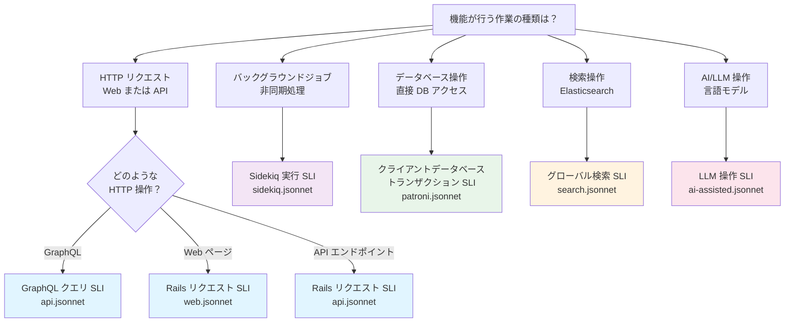

## PREP パフォーマンスメトリクスガイド

このガイドは、[PREP（プラットフォームレディネス有効化プロセス）レディネスプロセス](https://gitlab.com/gitlab-org/architecture/readiness)の一環として、チームが機能のパフォーマンスメトリクスを特定・測定するのに役立ちます。新しいメトリクスを作成するのではなく、本番環境ですでに監視されている既存の本番 SLI（サービスレベル指標）に機能をマッピングします。

## 概要

本番メトリクスには主に 2 つのソースがあります：

- 私たちの SaaS サービスは[メトリクスカタログ](https://gitlab.com/gitlab-com/runbooks/-/tree/master/metrics-catalog)を使用しており、GitLab.com がどのように SLI と SLO（サービスレベル目標）を通じてサービスの健全性を測定するかを定義します。これらの閾値は本番環境で実証されており、ユーザーが期待するものを表しています。
- セルフマネージドのお客様は[リファレンスアーキテクチャ](https://docs.gitlab.com/administration/reference_architectures/)と対応する公開[ベンチマーク](https://gitlab.com/gitlab-org/reference-architectures/-/wikis/Benchmarks/Latest)に依存しています。

機能を関連する本番 SLI / ベンチマークにマッピングすることで、いくつかの利点が得られます：

- **本番基準に紐づいたレディネスチェック** - 任意のメトリクスではなく、本番の健全性にとって重要として特定したものを測定する
- **テストと本番の一貫性** - PREP で本番とは異なるものを測定することを避け、デプロイ時の驚きを減らす
- **メトリクスのフィードバックループ** - PREP テストでメトリクスのギャップが明らかになった場合、本番監視に追加する新しいメトリクスを特定できる

## このガイドの使い方

**前提条件：** パフォーマンステストは、テストするコードパスの機能的正確さを前提としています。

1. **SLI を特定する** - 以下の[デシジョンツリー](#sli-component-decision-tree)を使用して、機能が触れる SLI コンポーネントを見つける。また、SLI に関連するメトリクスについて[セルフマネージドメトリクス](#self-managed-metrics-sources)もレビューする。
2. **重要なものを理解する** - [メトリクス選択ガイド](#metrics-selection-guide)を確認して、本番が何を測定しているか、テストで何を測定すべきかを確認する。
3. **基礎パフォーマンスを測定する** - PREP テスト中にレイテンシ、リソース、正確性のメトリクスを収集する。
4. **結果を文書化する** - PREP Issue テンプレートに調査結果を記録する。

## PREP レポートのメトリクスソース

PREP レポートには GitLab.com（SaaS）とセルフマネージドデプロイの両方からのメトリクスを含める必要があります。これらのソースは補完的な情報を提供します：

**GitLab.com（SaaS）メトリクス：**

- ソース：[メトリクスカタログ](https://gitlab.com/gitlab-com/runbooks/-/tree/master/metrics-catalog)からの本番 SLI 閾値
- 重要な理由：機能が本番環境のスケールで学んだ重要なことに対してどのようにパフォーマンスを発揮するかを示す
- 測定する内容：本番閾値と比較したレイテンシパーセンタイル、エラーレート、リソース消費
- 関連性：SaaS デプロイの本番レディネスの直接的な指標

**セルフマネージドメトリクス：**

- ソース：[リファレンスベンチマーク](https://gitlab.com/gitlab-org/reference-architectures/-/wikis/Benchmarks/Latest)
- 重要な理由：機能が異なるハードウェア、スケール、設定を持つ環境でどのようにパフォーマンスを発揮するかを示す
- 測定する内容：リファレンスベンチマークと比較したレイテンシパーセンタイル、エラーレート、リソース消費
- 関連性：セルフマネージドデプロイの範囲全体で機能がどのように動作するかを示す

**両方が重要な理由：**

- SaaS メトリクスは機能が GitLab.com の本番環境に対して準備ができているかを教えてくれる
- セルフマネージドメトリクスは機能が多様なデプロイ環境全体で合理的にパフォーマンスを発揮するかを教えてくれる
- 両方を合わせることで、デプロイタイプに関係なく機能が正常に動作するという確信が得られる

**PREP レポートでつなぎ合わせる：**

レポートに両方のコンテキストを含める：

1. **SaaS パフォーマンス：**「本番 SLI 閾値に対して、私の機能は [メトリクス] を達成しています。これは [レディネスレベル] を示しています。」
2. **セルフマネージドパフォーマンス：**「[デプロイサイズ / タイプ] のリファレンスベンチマークに対して、私の機能は [メトリクス] を達成しています。これは [レディネスレベル] を示しています。」
3. **バリアンス分析：**「SaaS とセルフマネージドのコンテキストの違いは [説明] です。これは [理由] によって予期されます。」

**例：**

```plaintext
SaaS コンテキスト: p95 レイテンシは 450ms（本番閾値: < 1s）✓
セルフマネージドコンテキスト: p95 レイテンシは 520ms（200 RPS / 10,000 ユーザーデプロイのリファレンスベンチマーク: < 800ms）✓
バリアンス: セルフマネージドはバックグラウンド負荷最適化がないため若干高い
結論: 機能は両方のデプロイタイプに対して準備ができている
```

このアプローチにより、PREP レポートが 1 つだけでなく、デプロイのコンテキスト全体でのレディネスを示すことが確保されます。

## SLI コンポーネントデシジョンツリー



## サービスの SLI を理解する

| デシジョンツリーの出力 | ガイドセクション | 主要メトリクス |
| --- | --- | --- |
| Rails リクエスト SLI (web.jsonnet) | [HTTP リクエスト SLI](#http-request-slis-rails-request-graphql-query) | レイテンシ (p95, p99)、エラーレート |
| Rails リクエスト SLI (api.jsonnet) | [HTTP リクエスト SLI](#http-request-slis-rails-request-graphql-query) | レイテンシ (p95, p99)、エラーレート |
| GraphQL クエリ SLI (api.jsonnet) | [HTTP リクエスト SLI](#http-request-slis-rails-request-graphql-query) | クエリレイテンシ (p95, p99)、エラーレート |
| Sidekiq 実行 SLI | [Sidekiq ジョブ SLI](#sidekiq-job-slis-execution--queueing) | 実行時間、リソース使用量 |
| データベーストランザクション SLI | [データベーストランザクション SLI](#database-transaction-sli) | トランザクション時間、接続プール |
| グローバル検索 SLI | [グローバル検索 SLI](#global-search-sli) | 検索レイテンシ、インデックスサイズ |
| LLM 操作 SLI | [AI/LLM 操作 SLI](#aillm-operation-slis) | TTFT、完了レイテンシ |

## メトリクス選択ガイド

機能がマッピングするサービスを特定したら、以下の適切なセクションを使用して、本番 SLI が何を測定しているか、PREP テスト中に何の基礎メトリクスを収集すべきかを理解してください。

**主要原則：** 本番 SLI はライブシステムの劣化を検出するように設計されています。PREP テストは、機能がその劣化を引き起こさないことを証明する*基礎的な測定値*に焦点を当てています。本番 SLO の閾値を再現しようとしているのではなく、レディネスを示す基本的なパフォーマンス特性を測定しています。

**閾値についての注記：** 各セクションに示されている本番の値は、本番で何が許容可能かを理解するための参照点です。テスト環境は本番と完全に一致しませんが、これらは重要なパフォーマンス特性を理解するのに役立ちます。テスト結果を解釈する際のコンテキストとして使用してください。

## パーセンタイルメトリクスの理解：p90 対 p95 対 p99

異なるツールとサービスは異なるパーセンタイルを測定します。違いを理解することで、コンテキストに適切なメトリクスを選択できます：

- **p90** - 操作の 90% がより速い値。[GitLab Performance Tool (GPT)](https://gitlab.com/gitlab-org/quality/performance) が基本メトリクスとして使用。タイミングの[ロングテール分布](https://en.wikipedia.org/wiki/Long_tail)に完全に歪められることなく、実際の世界のタイミングのバランスが良い。
- **p95** - 操作の 95% がより速い値。[メトリクスカタログ](https://gitlab.com/gitlab-com/runbooks/-/tree/master/metrics-catalog)のほとんどの本番 SLI の標準。劣化への感度とノイズ耐性のバランスが取れている。
- **p99** - 操作の 99% がより速い値。最悪のシナリオとテールレイテンシをキャプチャ。システム的な問題の特定に有用。

**注記：** ほとんどの SLI は p90、p95、または p99 を使用しますが、他のパーセンタイルを使用するものもあります。たとえば、グローバル検索は 99.95 パーセンタイルを使用します。SLI がどのパーセンタイルを使用するかについては、メトリクスカタログ内の SLI の説明を確認してください。

**機能を測定する場合：** SLI セクションで指定されたパーセンタイルを使用してください。本番メトリクスと比較したり、テストに GPT を使用したりする場合は、各ツールがどのパーセンタイルを測定するかに注意して、解釈を適切に調整してください。3 つすべてを測定する必要はありません - SLI が必要とするものとテストツールが提供するものを測定してください。

## SLI の基礎メトリクスを理解する

メトリクスカタログは 2 つの層で構成されています：

**Layer 1: SLI 定義** ([`metrics-catalog/gitlab-slis/library.libsonnet`](https://gitlab.com/gitlab-com/runbooks/-/tree/master/metrics-catalog//gitlab-slis/library.libsonnet))

- 説明と重要なラベルを含む再利用可能な SLI テンプレートを定義する
- 例：`rails_request`、`global_search`、`sidekiq_execution`、`llm_completion`
- これらは各 SLI が何を測定するかの*概念的な*定義であり、実際の閾値ではない

**Layer 2: サービス実装** ([`metrics-catalog/services/*.jsonnet`](https://gitlab.com/gitlab-com/runbooks/-/tree/master/metrics-catalog/services))

- 各サービスファイル（例：`api.jsonnet`、`web.jsonnet`）はライブラリから SLI をインスタンス化する
- `sliLibrary.get('rails_request').generateServiceLevelIndicator(selector, overrides)` を使用して具体的な実装を作成する
- `overrides` パラメータはサービス固有の閾値を設定する（例：`monitoringThresholds: { apdexScore: 0.99 }`）
- `capacityPlanning` セクションは監視する基礎メトリクスを特定する

SLI を特定したら、[メトリクスカタログ](https://gitlab.com/gitlab-com/runbooks/-/tree/master/metrics-catalog/services)内の対応するサービス jsonnet ファイルの `capacityPlanning` セクションを見ることで、監視する基礎メトリクスを見つけることができます。
たとえば、[`api.jsonnet` の `capacityPlanning` セクション](https://gitlab.com/gitlab-com/runbooks/-/blob/master/metrics-catalog/services/api.jsonnet#L298)では以下を特定しています：

- `ruby_thread_contention` - Ruby スレッドがブロックされているかを監視する
- `rails_db_connection_pool` - データベース接続の可用性を監視する
- `kube_go_memory` - サービスのメモリ使用量を監視する

`capacityPlanning` セクションのメトリクスは、オブザーバビリティで追跡するのに十分に有用であることが証明されているため、テストの一部として追跡する価値があります。これらは SLI（apdex スコアとエラーレート）を直接構成するものではありませんが、レイテンシとエラーレートのターゲットを達成するための前提条件です。これらのいずれかが枯渇または劣化すると、SLI が影響を受けます。

**PREP テストでは**、これらの基礎メトリクスを測定して、負荷がかかっても機能が主要な SLI ターゲットを維持できることを確保してください。これらは、負荷が増加するにつれて機能が SLI の閾値を満たし続けられるかどうかを理解するのに役立ちます。

## 監視するシステムレベルのメトリクス

どの SLI を測定する場合でも、パフォーマンステスト中は常にシステムレベルのメトリクスを監視してください。これによりチューニングとトラブルシューティングが可能になります。一般的なメトリクスをいくつか挙げます：

- **CPU 使用率** - 負荷に応じて線形にスケールするべき。ボトルネックを示すプラトーに注意する
- **メモリ使用量** - 安定しているべき。リークや突然のスパイクに注意する
- **ディスク I/O** - データベース / 検索操作では、読み書きレイテンシとスループットを監視する
- **ネットワークスループット** - 大きなペイロードを処理するサービスでは、帯域幅使用率を監視する
- **接続プール** - データベース接続、スレッドプールなどが枯渇しないようにする

**注記：** このリストは一般的なシステムレベルのメトリクスをカバーしています。機能の特定の実装によっては、追加のメトリクスの監視が必要な場合があります。

## SLI の測定

以下のセクションでは、各 SaaS SLI タイプで何を測定するかを詳述します。各タイプについて以下が含まれています：

- **本番が測定するもの** - 主要な SLI メトリクス（apdex、エラーレートなど）
- **PREP で測定すべきもの** - 主要な SLI を維持できることを証明する基礎メトリクス
- **例** - テスト方法を示す具体的なシナリオ

### HTTP リクエスト SLI（Rails リクエスト、GraphQL クエリ）

**適用対象：** Web ページ、API エンドポイント、GraphQL クエリ

**本番が測定するもの：**
本番 SLI は apdex スコア（レイテンシコンプライアンス）とエラーレートを追跡して、サービスが劣化しているときを検出します。本番閾値は：

- **Apdex スコア：** リクエストの 99.8% がレイテンシの期待値を満たすべき（満足: < 1 秒、許容: < 10 秒）
- **エラーレート：** リクエストの < 0.01% が失敗するべき

**PREP で測定すべきもの：**

1. **リクエストレイテンシパーセンタイル** - 機能はどれくらい速くレスポンスするか？
   - 測定単位：ミリ秒または秒
   - 重要な理由：遅い機能はユーザーエクスペリエンスを劣化させ、他の失敗にカスケードする可能性がある
   - 測定するもの：キャプチャするパーセンタイルを理解するために[パーセンタイルメトリクスの理解](#understanding-percentile-metrics-p90-vs-p95-vs-p99)を参照
   - 本番コンテキスト：本番は < 1 秒を「満足」、< 10 秒を「許容」とみなす
   - PREP ゲート：テスト環境でベースラインを確立する。p90/p95 は一貫して予測可能であるべき。p99 は p95 の 5〜10 倍を超えないようにする。既存の類似機能と比較する - 機能が著しく遅くなるべきではない（参照点として本番閾値を使用する）。
   - 収集方法：適切なツールを選択・使用するためのガイダンスは[パフォーマンステストツール](performance-tools.md)を、またはアプリケーションのインストルメンテーションを参照

2. **リソース消費** - 機能は合理的なリソースを消費するか？
   - 測定単位：CPU %、メモリ使用量、データベース接続
   - 重要な理由：リソースの枯渇はカスケード失敗を引き起こす可能性がある
   - 測定するもの：
     - ピーク負荷時の CPU 使用量
     - メモリ使用量（メモリリークなし）
     - データベース接続プールの使用率
   - PREP ゲート：負荷を増加させながらリソース使用量を監視する。CPU、メモリ、接続は予測可能にスケールするべき。超線形なリソース成長（例：負荷 2 倍でメモリ 4 倍）、突然のスパイク、ボトルネックを示すプラトーに注意する。
   - 収集方法：負荷テスト中にシステムメトリクスを監視する

**追跡する重要なラベル：**

- `endpoint_id` - どの特定のエンドポイント / ルートが呼ばれているか
- `feature_category` - これがどの機能領域に属するか
- `request_urgency` - これは高優先度または低優先度のリクエストか

**例：** ユーザープロフィール更新の新しい API エンドポイントは以下でテストする：

- 100〜1000 の同時ユーザーによる負荷テスト
- p95 と p99 のレイテンシ測定（それぞれ < 1 秒、< 10 秒であるべき）
- すべてのリクエストが正しいデータを返すことを確認する
- リソース枯渇がないように CPU / メモリを監視する

### Sidekiq ジョブ SLI（実行とキューイング）

**適用対象：** バックグラウンドジョブ、非同期ワーカー、スケジュールされたタスク

**重要：** Sidekiq ジョブは[緊急度レベル](https://docs.gitlab.com/development/sidekiq/worker_attributes/#job-urgency)によって分類されます。閾値を設定する前に、ジョブの緊急度を判断してください。ジョブキューが負荷を受けている場合、[レイテンシに敏感なジョブ](https://docs.gitlab.com/development/sidekiq/worker_attributes/#latency-sensitive-jobs)は実行が優先されます。

**緊急度レベル：**

- **高緊急度** - すぐに完了するべきユーザー向け操作（例：通知の送信、ユーザー設定の更新）
- **低緊急度** - より長くかかることができるバックグラウンド操作（例：バッチ処理、クリーンアップジョブ）

**ジョブの緊急度を判断する：**

「このジョブが 5 分遅延した場合、ユーザーは気づくか？」と問う：

- 気づく場合 → 高緊急度
- 気づかない場合 → 低緊急度

**本番が測定するもの：**
本番 SLI は、ジョブが時間がかかりすぎたり積み上がったりするときを検出するために、実行時間とキューイング時間を追跡します。本番閾値は：

- **実行時間（apdex 満足）：**
  - 高緊急度: < 5 秒
  - 低緊急度: < 300 秒
- **キューイング時間（apdex 満足）：**
  - 高緊急度: < 5 秒
  - 低緊急度: < 5 分
- **エラーレート：** ジョブの < 0.01% が失敗するべき

**PREP で測定すべきもの：**

1. **実行時間パーセンタイル** - ジョブの実行にどれくらいかかるか？
   - 測定単位：秒
   - 重要な理由：長時間実行するジョブは他の作業をブロックし、リソースを消費する可能性がある
   - 測定するもの：実行時間（キャプチャするパーセンタイルを理解するために[パーセンタイルメトリクスの理解](#understanding-percentile-metrics-p90-vs-p95-vs-p99)を参照）
   - 本番コンテキスト：高緊急度ジョブは < 5 秒、低緊急度は < 300 秒であるべき
   - PREP ゲート：実行時間はジョブの本番閾値を十分下回るべき
   - 収集方法：タイミングメトリクスでワーカーをインストルメント化；テストジョブをエンキューする

2. **リソース消費** - ジョブは合理的なリソースを消費するか？
   - 測定単位：CPU %、メモリ使用量、データベース接続
   - 重要な理由：リソースの枯渇はカスケード失敗を引き起こす可能性がある
   - 測定するもの：
     - ピークジョブ処理時の CPU 使用量
     - メモリ使用量（メモリリークなし）
     - データベース接続プールの使用率
   - PREP ゲート：リソース枯渇なし；ジョブ数に対して線形にスケールするべき
   - 収集方法：テストジョブを処理しながらシステムメトリクスを監視する

**追跡する重要なラベル：**

- `worker` - ジョブクラス名
- `feature_category` - このジョブがどの機能領域に属するか
- `urgency` - これが高または低緊急度の作業か
- `queue` - ジョブがどのキューにあるか

**例：** ユーザーエクスポートを処理する新しいバックグラウンドジョブは以下でテストする：

- さまざまなデータサイズで 1000 個のジョブをエンキューする
- p95 と p99 の実行時間を測定する（ジョブの本番閾値を大きく下回るべき）
- すべてのジョブが正常に完了して正しい結果を生成することを確認する
- リソース枯渇がないように CPU / メモリを監視する

### データベーストランザクション SLI

**適用対象：** 直接のデータベース操作を実行する機能

**本番が測定するもの：**
本番 SLI は、データベース操作が時間がかかりすぎるときを検出するためにトランザクション時間を追跡します。長いトランザクションはリソースをロックして他の操作をブロックする可能性があります。本番閾値はほとんどの操作で < 1 秒です。

**PREP で測定すべきもの：**

1. **トランザクション時間パーセンタイル** - データベーストランザクションにどれくらいかかるか？
   - 測定単位：ミリ秒または秒
   - 重要な理由：長いトランザクションはリソースをロックして他の操作をブロックする可能性がある
   - 測定するもの：トランザクション時間（キャプチャするパーセンタイルを理解するために[パーセンタイルメトリクスの理解](#understanding-percentile-metrics-p90-vs-p95-vs-p99)を参照）
   - 本番コンテキスト：ほとんどの操作は < 1 秒であるべき
   - PREP ゲート：トランザクション時間は本番閾値を下回るべき
   - 収集方法：タイミングメトリクスでデータベース呼び出しをインストルメント化；テストデータでクエリを実行する

2. **リソース消費** - 機能は合理的なデータベースリソースを消費するか？
   - 測定単位：接続プール使用率、クエリの複雑さ
   - 重要な理由：リソースの枯渇はカスケード失敗を引き起こす可能性がある
   - 測定するもの：
     - データベース接続プールの使用率
     - クエリ実行計画（フルテーブルスキャンなし）
     - ロック競合
   - PREP ゲート：接続プールの枯渇なし
   - 収集方法：テスト中にデータベースメトリクスを監視する；クエリプランをレビューする

**追跡する重要なラベル：**

- `db_config_name` - どのデータベース（プライマリ、レプリカなど）
- `feature_category` - これがどの機能領域に属するか

**例：** 新しいデータベーステーブルを追加してクエリする機能は以下でテストする：

- テストデータでクエリを実行して p95/p99 レイテンシを測定する
- クエリが正しい結果を返してデータの一貫性を保つことを確認する
- 接続プールの使用率を監視してクエリ実行計画をレビューする

### グローバル検索 SLI

**適用対象：** Elasticsearch またはグローバル検索機能を使用する機能

**本番が測定するもの：**
本番 SLI は、検索が時間がかかりすぎるときを検出するために検索レイテンシを追跡します。検索はユーザー向けであるため、遅い検索はエクスペリエンスを直接劣化させます。本番閾値は類似の検索の 99.95 パーセンタイルに基づいています。

**PREP で測定すべきもの：**

1. **検索レイテンシパーセンタイル** - 検索クエリにどれくらいかかるか？
   - 測定単位：ミリ秒または秒
   - 重要な理由：遅い検索はユーザーエクスペリエンスを劣化させ、他の失敗にカスケードする可能性がある
   - 測定するもの：レイテンシ（キャプチャするパーセンタイルを理解するために[パーセンタイルメトリクスの理解](#understanding-percentile-metrics-p90-vs-p95-vs-p99)を参照）グローバル検索は 99.95 パーセンタイルを使用
   - 本番コンテキスト：一般的な検索は < 2 秒であるべき
   - PREP ゲート：レイテンシはベースライン値を超えないようにする
   - 収集方法：テストデータに対して検索を実行する；クエリ実行時間を測定する

2. **リソース消費** - 検索機能は合理的なリソースを消費するか？
   - 測定単位：Elasticsearch リソース使用量、インデックスサイズ
   - 重要な理由：リソースの枯渇はカスケード失敗を引き起こす可能性がある
   - 測定するもの：
     - Elasticsearch の CPU とメモリ使用量
     - インデックスサイズの成長
     - クエリの複雑さ
   - PREP ゲート：リソース枯渇なし；インデックスサイズは合理的であるべき
   - 収集方法：テスト中に Elasticsearch メトリクスを監視する；インデックス統計をレビューする

**追跡する重要なラベル：**

- `search_scope` - 何が検索されているか（プロジェクト、Issue など）
- `search_type` - 検索のタイプ（基本、詳細など）
- `feature_category` - これがどの機能領域に属するか

**例：** 新しい検索可能なフィールドを追加する機能は以下でテストする：

- テストデータに対して検索を実行して p90 レイテンシを測定する
- 検索が新しいフィールドで正しい結果を返すことを確認する
- Elasticsearch リソース使用量とインデックスサイズを監視する

### AI/LLM 操作 SLI

**適用対象：** 言語モデルや AI サービスを呼び出す機能

**重要：** AI 機能の設計によって、異なる側面を測定することができます：

- **チャット / ストリーミング機能** - Time to First Token (TTFT) を優先する。ユーザーはレスポンスをどれだけ早く見られるかに基づいてレスポンシブネスを認識するため
- **完了ベースの機能** - 全体の完了レイテンシを優先する。ユーザーが結果を見る前に操作全体が完了しなければならないため

両方のアプローチは `ai-assisted.jsonnet` で同じ基礎 SLI を測定しますが、機能の相互作用モデルに基づいて重点が異なります。

**本番が測定するもの：**

本番 SLI は、AI 操作が時間がかかりすぎるときを検出するために Time to First Token (TTFT) と完了レイテンシを追跡します。本番閾値は：

- **TTFT：** < 5 秒（apdex 満足）
- **完了レイテンシ：** < 20 秒（apdex 満足）
- **エラーレート：** 操作の < 0.01% が失敗するべき

**PREP で測定すべきもの：**

1. **Time to First Token (TTFT) パーセンタイル** - 最初のレスポンストークンが届くまでどれくらいかかるか？
   - 測定単位：ミリ秒または秒
   - 重要な理由：ユーザーはレスポンスをどれだけ早く見られるかに基づいてレスポンシブネスを認識する
   - 測定するもの：レイテンシ（キャプチャするパーセンタイルを理解するために[パーセンタイルメトリクスの理解](#understanding-percentile-metrics-p90-vs-p95-vs-p99)を参照）。
   - 本番コンテキスト：< 5 秒であるべき
   - PREP ゲート：レイテンシはベースライン値を超えないようにする
   - 収集方法：リクエストから最初のトークン受信までの時間を測定する

2. **完了レイテンシパーセンタイル** - 全体の操作にどれくらいかかるか？
   - 測定単位：ミリ秒または秒
   - 重要な理由：全体のパフォーマンスとリソース消費を示す
   - 測定するもの：レイテンシ（キャプチャするパーセンタイルを理解するために[パーセンタイルメトリクスの理解](#understanding-percentile-metrics-p90-vs-p95-vs-p99)を参照）。
   - 本番コンテキスト：< 20 秒であるべき
   - PREP ゲート：レイテンシはベースライン値を超えないようにする
   - 収集方法：リクエストから完了までの総操作時間を測定する

3. **リソース消費** - AI 機能は合理的なリソースを消費するか？
   - 測定単位：API レート制限、トークン使用量、メモリ
   - 重要な理由：リソースの枯渇はカスケード失敗を引き起こす可能性がある
   - 測定するもの：
     - API レート制限の使用率
     - 操作あたりのトークン使用量
     - ストリーミング中のメモリ使用量
   - PREP ゲート：リソース枯渇なし；API 制限内に収まるべき
   - 収集方法：テスト中に API 使用量とシステムメトリクスを監視する

**追跡する重要なラベル：**

- `service_class` - どの AI サービスが使用されているか
- `feature_category` - これがどの機能領域に属するか

**例：** 新しい Duo Chat 機能は以下でテストする：

- p90 の TTFT と完了レイテンシを測定する
- レスポンスが一貫していて関連性があることを確認する
- API レート制限の使用量とトークン消費を監視する

## 開発中のメトリクス収集

### テストアプローチ

**合成テスト** - 制御されたリクエストでユーザーの動作をシミュレートする

- 最適な場面：既知の条件下でのベースラインパフォーマンスの確立
- 方法：ユーザーの動作を模倣する機能テストを書き、実行してベースラインパフォーマンスを確立する。合成テストとバックグラウンド負荷を組み合わせる必要がある場合は、負荷テストのガイダンスについて[パフォーマンステストツール](performance-tools.md)を参照する
- 収集するメトリクス：操作レート、レイテンシパーセンタイル、エラーレート

**負荷テスト** - ブレークポイントを見つけるために負荷を徐々に増加させる

- 最適な場面：機能がどのようにスケールするかの理解
- 方法：適切なツールを選択・使用するためのガイダンスについては[パフォーマンステストツール](performance-tools.md)を参照する
- 収集するメトリクス：異なる負荷レベルでのレイテンシ、ストレス下でのエラーレート

**インストルメンテーションを使用した手動テスト** - 実際の使用パターンを測定する

- 最適な場面：実際のユーザー動作の理解
- 方法：機能にログ / メトリクスを追加して手動でテストする
- 収集するメトリクス：実際のレイテンシ、エラーパターン、リソース使用量

### 測定する主要なパーセンタイル

レイテンシメトリクスを収集する際は、SLI セクションで指定されたパーセンタイルを測定してください（キャプチャするパーセンタイルを理解するために[パーセンタイルメトリクスの理解](#understanding-percentile-metrics-p90-vs-p95-vs-p99)を参照）。

### 既存のメトリクスが合わない場合

機能が既存の SLI にマッピングできない場合：

1. **最も近いものを使用する** - 最も近い SLI を選択して制限を文書化する
2. **新しいメトリクスを提案する** - オブザーバビリティドキュメントの[新しい SLI の追加](https://gitlab-com.gitlab.io/gl-infra/observability/docs-hub/service-level-indicators/howto-implementing-slis/)のプロセスに従う
3. **PREP に両方を含める** - 標準 SLI メトリクス + 提案するメトリクスを示す

PREP レポートに文書化する：「[SLI] に対して測定したが、機能は [方法] で異なる。将来の使用のために [メトリクス] を提案する。」

### テスト環境の違いを考慮する

テスト環境は本番環境とは異なります。結果を解釈する際：

- **データが少ない** → 絶対的な時間ではなく、クエリパターンとスケーリングに焦点を当てる
- **ハードウェアが異なる** → 本番の数値ではなく、同じテスト環境内の他の機能と比較する
- **バックグラウンド負荷がない** → 本番の競合を考慮して追加のバッファを負荷に加えることを検討する

**それでも重要なもの：** クエリパターン、アルゴリズムの複雑さ、リソーススケーリングの動作

## セルフマネージドメトリクスソース

機能がセルフマネージドデプロイをサポートしていることを確認するために、以下によってパフォーマンスベースラインを確立してください：

1. **SLI を定義する** - SLI として使用するメトリクスを特定する（いくつかの可能なソース：[メトリクスカタログ](#sli-component-decision-tree)、[GitLab リファレンスアーキテクチャベンチマーク](https://gitlab.com/gitlab-org/reference-architectures/-/wikis/Benchmarks/Latest)、チームが定義した他のソース）
2. **良い / 悪い結果を定義する** - デプロイコンテキストで許容可能なパフォーマンスがどのようなものかを判断する
3. **環境でベンチマークを実行する** - ターゲットデータと設定を持つ代表的なセルフマネージド環境で機能をテストする
4. **結果を評価する** - 定義した閾値と比較する

**参考リソース：**

- [GitLab リファレンスアーキテクチャベンチマーク](https://gitlab.com/gitlab-org/reference-architectures/-/wikis/Benchmarks/Latest) - 標準的なデプロイサイズの公開パフォーマンスデータ
- [セルフサービスパフォーマンスリグレッションテスト](self-service-performance-regression-testing.md) - パフォーマンスリグレッションテストを実行するためのプロセス。成功基準（SLI）を決定する方法についてのガイダンスが含まれる

**注記：** ベンチマークは典型的な設定を表しています；実際のデプロイは異なる場合があります。絶対要件としてではなく、参照点として使用してください。

## 結果の解釈

### グリーンライト（デプロイ準備完了）

機能が準備できている場合：

- **レイテンシ：** メトリクスが本番閾値を下回る
- **リソース：** リソース枯渇なし（CPU、メモリ、データベース接続、API 制限）
- **スケーラビリティ：** 負荷下でパフォーマンスが徐々に劣化；突然の失敗なし

### イエローライト（最適化が必要）

機能に作業が必要な場合：

- **レイテンシ：** メトリクスが本番閾値の 1〜2 倍
- **リソース：** ピーク負荷でリソース制限に近づいている

検討事項：

- ホットパスの最適化
- キャッシュの追加
- データベースクエリや API 呼び出しの削減
- アルゴリズム効率の改善
- 操作のバッチ化

### レッドライト（準備不足）

機能が準備できていない場合：

- **レイテンシ：** メトリクスが本番閾値の > 2 倍
- **リソース：** リソース枯渇が発生している（接続プールが満杯、メモリ不足、API レート制限を超過）
- **スケーラビリティ：** 予想される負荷でパフォーマンスが非線形に劣化または失敗する

デプロイを進めないでください。根本原因を調査して、再テストの前に最適化してください。

### イエローまたはレッドの場合

1. 最適化の前にプロファイリングする - ボトルネックを推測しない
2. 最も影響の大きい問題を修正する
3. 同じテストで再テストして改善を測定する

## 結果の文書化

結果を[パフォーマンス検証](https://gitlab.com/gitlab-org/architecture/readiness/-/blob/main/templates/performance_strategy/performance_validation.md)レディネス Issue に追加して、レビュアーと共有してください。

バリアンスや使用した新しいメトリクスがあれば必ず含めてください。

## 一般的なシナリオ

**注記：** これらのシナリオに示されている本番閾値は、ガイドの適用方法を示すための例示です。実際の閾値は特定の SLI 実装によって異なります。実際の監視閾値については、[`metrics-catalog/services/`](https://gitlab.com/gitlab-com/runbooks/-/tree/master/metrics-catalog/services) 内のサービスの jsonnet ファイルを確認してください。

### シナリオ 1：新しい API エンドポイント

**機能：** ユーザーアクティビティを取得する新しいエンドポイントを追加

**SLI マッピング：** Rails リクエスト SLI (api.jsonnet)

**本番コンテキスト：**

- 本番閾値: p95 レイテンシ < 1 秒、p99 < 10 秒
- 本番のエラーレート: < 0.01%

**テストアプローチ：**

- 100〜1000 の同時ユーザーによる負荷テスト
- レイテンシパーセンタイルを測定（p95 と p99）
- すべてのリクエストが正しいデータを返すことを確認する
- ピーク負荷時の CPU / メモリを監視する

**成功基準（グリーンライト）：**

- p95 レイテンシはテストの実行全体で一貫して予測可能
- p99 レイテンシは p95 の 5〜10 倍を超えない（システム的な問題ではなく、テール動作を示す）
- パフォーマンスは類似の既存エンドポイントと比較可能（参照点として本番閾値を使用する）
- リソース使用量は負荷に応じて線形にスケールする

### シナリオ 2：データ処理のバックグラウンドジョブ

**機能：** ユーザーエクスポートを処理する新しい Sidekiq ワーカー

**SLI マッピング：** Sidekiq 実行 SLI (sidekiq.jsonnet)

**ジョブ緊急度：** 低緊急度（5 分の遅延があってもユーザーは気づかない）

**本番コンテキスト：**

- 本番閾値: p95 実行 < 300 秒、p99 < 600 秒
- 本番のエラーレート: < 0.01%

**テストアプローチ：**

- さまざまなデータサイズで 1000 以上のジョブをエンキューする
- 実行時間パーセンタイルを測定（p95 と p99）
- すべてのジョブが正常に完了して正しい結果を生成することを確認する
- エッジケースをテストする（空のデータ、非常に大きなデータ、不正なデータ）
- ピークジョブ処理時の CPU / メモリを監視する

**成功基準（グリーンライト）：**

- p95 実行時間はテストの実行全体で一貫して予測可能
- p99 実行時間は p95 の 5〜10 倍を超えない
- パフォーマンスは類似の既存ワーカーと比較可能（参照点として本番閾値を使用する）
- リソース使用量はジョブ数に応じて線形にスケールする

### シナリオ 3：検索機能の拡張

**機能：** グローバル検索に新しい検索可能フィールドを追加

**SLI マッピング：** グローバル検索 SLI (search.jsonnet)

**本番コンテキスト：**

- 本番閾値: p95 レイテンシ < 2 秒、p99 < 5 秒
- 本番のエラーレート: < 0.5%

**テストアプローチ：**

- 既知の結果を持つテストデータに対して検索を実行する
- 検索レイテンシパーセンタイルを測定（p95 と p99）
- 検索が新しいフィールドで正しい結果を返すことを確認する
- エッジケースをテストする（空の結果、特殊文字、大きな結果セット）
- Elasticsearch リソース使用量とインデックスサイズを監視する
- 新しいフィールドのありとなしでパフォーマンスを比較する

**成功基準（グリーンライト）：**

- p95 検索レイテンシはテストの実行全体で一貫して予測可能
- p99 検索レイテンシは p95 の 5〜10 倍を超えない
- パフォーマンスは類似の既存検索機能と比較可能（参照点として本番閾値を使用する）
- 既存の検索パフォーマンスへの劣化なし
- インデックスサイズの成長は合理的
- Elasticsearch リソースはデータサイズに応じて線形にスケールする

## 参考資料

- [メトリクスカタログ README](https://gitlab.com/gitlab-com/runbooks/-/blob/master/metrics-catalog/README.md) - メトリクスカタログ構造の概要
- [サービス定義](https://gitlab.com/gitlab-com/runbooks/-/tree/master/metrics-catalog/services) - 各サービスの詳細な SLI 定義
- [SLI ライブラリ](https://gitlab.com/gitlab-com/runbooks/-/blob/master/metrics-catalog/gitlab-slis/library.libsonnet) - 再利用可能な SLI パターン
- [セルフサービスパフォーマンスリグレッションテスト](self-service-performance-regression-testing.md) - 関連するテストガイダンス
- [GitLab パフォーマンステストツール選択ガイド](performance-tools.md) - パフォーマンスツールの選択プロセス
- [Sitespeed Runway](https://gitlab.com/gitlab-org/quality/sitespeed-runway) - ブラウザでフロントエンドパフォーマンスを測定する [SiteSpeed](https://www.sitespeed.io/) ラッパー
- [GitLab コンポーネントパフォーマンスツール](https://gitlab.com/gitlab-org/quality/component-performance-testing) - コンテナ化と自動テストを活用して個々のコンポーネントパフォーマンスへのインサイトを提供する [k6](https://grafana.com/docs/k6/latest/) ラッパー
- [GitLab Performance Tool](https://gitlab.com/gitlab-org/quality/performance) - 任意の GitLab インスタンスのパフォーマンステストを提供する [k6](https://grafana.com/docs/k6/latest/) ラッパー
