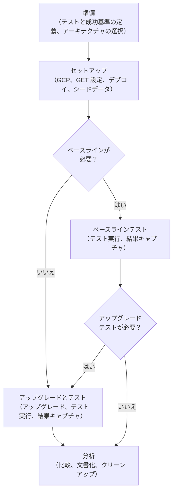

## 概要

このガイドは、チームが Performance Enablement のサポートを必要とせずに独自のパフォーマンスリグレッションテストを実行できるようにします。

**対象者**：何をテストして、なぜテストするかを理解しているチーム。新しいコンポーネントをテストする方法の定義が必要な場合は、[Performance Enablement にエスカレーション](#when-to-escalate-to-performance-enablement)してください。

## このガイドを使用する場面

- 負荷下でのパフォーマンスを検証する
- パフォーマンスリグレッションの主要なアップグレードをテストする
- インフラ変更前にパフォーマンスを検証する

## 前提条件

開始前に以下を確認してください：

### スキルと経験

- **GitLab Environment Toolkit (GET) の経験**：以前にリファレンスアーキテクチャをデプロイしたことがある（または [GET クイックスタートガイド](https://gitlab.com/gitlab-org/gitlab-environment-toolkit/-/blob/main/docs/environment_quick_start_guide.md)に従える）
- **GitLab Performance Tool (GPT) の経験**：[GPT](https://gitlab.com/gitlab-org/quality/performance) でデータをロードしてテストを実行したことがある（または [GPT クイックスタートガイド](https://gitlab.com/gitlab-org/quality/performance/-/blob/main/docs/quick_start.md)に従える）
- **変更の理解**：どのコンポーネント / フィーチャーをテストするか、なぜテストするかを知っている

### アクセスとアカウント

- [GitLab Sandbox](https://gitlabsandbox.cloud/login) へのアクセス
- プレリリースイメージへのプルアクセスを持つ GitLab.com アカウント
- サンドボックスアカウント内の GCP/AWS アカウント

**準備できているか不確かな場合？** 上記の GET と GPT クイックスタートガイドをレビューしてください。行き詰まった場合は、[Performance Enablement にエスカレーション](#when-to-escalate-to-performance-enablement)してください。

## このガイドを作業で使用する方法

このハンドブックページは、パフォーマンスリグレッションテストを実行するための包括的な実装ガイダンスを提供し、進捗を追跡するための GitLab プロジェクトの Issue テンプレートと対になっています。`Performance Regression Testing` テンプレートを使用してワークアイテムを作成して開始してください。

### これらのリソースを一緒に使用する方法

1. **このハンドブックページを読む** - 完全なプロセスと実装の詳細を理解するため
2. **テンプレートを使用してワークアイテムを開く** - 進捗と結果を追跡するため
3. **各フェーズを進める際にこのハンドブックの特定のセクションを参照する**
4. **チームの可視性のためにワークアイテムに調査結果を文書化する**

ハンドブックページは「なぜ」と「どのように」の詳細を提供し、ワークアイテムテンプレートは進捗を追跡するための「何を」チェックリストを提供します。

## クイックデシジョンツリー



---

## テスト準備


### テストの定義

チームはすでに何をテストして、なぜテストするかを理解しているはずです。

- テストするコンポーネント / フィーチャー
- 評価する変更（例：Rails 7.2 アップグレード、Ruby 3.3 アップグレード）
- 予想される影響領域（API レスポンス時間、スループット、メモリ使用量）

このステップには、実行するテストを決定し、実行に必要なテストツールを選択することも含まれます。この例では GPT がテストツールとして選択されていますが、他にも使用できるものがあります：

- [K6](https://grafana.com/docs/k6/latest/)
- [Component Performance Testing (CPT)](https://gitlab.com/gitlab-org/quality/component-performance-testing)
- [GitLab Browser Performance Tool (GBPT)](https://gitlab.com/gitlab-org/quality/performance-sitespeed)

GPT がテストツールとして選択された場合、[多くのテスト](https://gitlab.com/gitlab-org/quality/performance/-/tree/main/k6/tests)と[事前定義された負荷レベル](https://gitlab.com/gitlab-org/quality/performance/-/tree/main/k6/config/options)を使用できます。

希望するユースケースをカバーする既存のテスト / 負荷レベルがない場合は、新しいものを書く必要があります。

**スコープに不確かな場合**：先に進む前に [Performance Enablement にエスカレーション](#when-to-escalate-to-performance-enablement)してください。

### 成功基準の特定

パフォーマンステストを実行するとき、成功がどのようなものかを把握することで、成功と失敗、または無駄な努力の違いが生まれます。努力を導くために成功がどのようなものかを知っておく必要があります。そうしないと、必要な情報をキャプチャできず、テストを再実行しなければならないかもしれません。いくつかの例：

- ベースラインからパフォーマンスが低下しなかった
- ベースラインと比較してパフォーマンスが X% 改善した
- 負荷下での新しいフィーチャーのパフォーマンス特性を特定した
- このコンポーネントのベースラインを確立した

成功基準の決定の一部は、比較するベースラインが何であるかを決定することです。使用できる既存のベースラインがあるか、新しいベースラインを実行するべきか。またはベースラインを確立することが目標か？

ベースラインテストは、後続の比較テストなしでも価値あるパフォーマンスメトリクスを生成します。現在のシステムパフォーマンスを文書化するチームは、それが目標を満たすならベースラインを実行した後に停止することができます。

#### 重要な考慮事項

- **トンネルビジョンを避ける**：非常に具体的な目標を持ってパフォーマンステストに入ること（`Workhorse P95 メトリクスで 2 ms のレスポンスを期待する`）は、そのスコープにない興味深い結果を見逃すトンネルビジョンにつながる可能性がある。
- **テスト結果は本番に 1:1 で変換されない**：テスト環境でのパフォーマンス改善は本番に 1:1 で変換されない。テスト環境での 3 ms の改善は本番での改善につながるかもしれないが、異なるハードウェア、負荷パターン、データ特性により程度が異なる。

### リファレンスアーキテクチャの選択

特定の理由がない限り、**[X Large](https://docs.gitlab.com/administration/reference_architectures/10k_users/) リファレンスアーキテクチャを使用してください**。

X Large アーキテクチャが提供するもの：

- 複雑さとリソース使用量の良いバランス
- 十分に文書化されてテストされている
- 公開されているパフォーマンスベンチマークに合致する
- リアルなテストのための十分な HA コンポーネント

**以下の場合のみ別のサイズを使用：**

- **HA を必要としないコンポーネントをテストする** → [Medium](https://docs.gitlab.com/administration/reference_architectures/3k_users/) を使用する
- **本番規模でテストする** → [2X Large](https://docs.gitlab.com/administration/reference_architectures/25k_users/) またはそれ以上を使用する
- **Geo や特定の機能をテストする** → 適切なアーキテクチャを使用する（例：Geo セットアップ）

[リファレンスアーキテクチャサイジングガイド](https://docs.gitlab.com/administration/reference_architectures/#deciding-which-architecture-to-start-with)を使用してアーキテクチャの決定に役立てることができます。サンプルの GET 設定を含む、いくつかのリポジトリがあります：

- [GitLab Environment Toolkit サンプル設定](https://gitlab.com/gitlab-org/gitlab-environment-toolkit/-/tree/main/examples)
- [リファレンスアーキテクチャテスト環境](https://gitlab.com/gitlab-com/gl-infra/software-delivery/operate/get-environments/ra-test-environments)
- [GitLab Environment Toolkit テスト設定](https://gitlab.com/gitlab-org/quality/gitlab-environment-toolkit-configs)

**どれを使用するか不確かな場合**：[X Large](https://docs.gitlab.com/administration/reference_architectures/10k_users/) リファレンスアーキテクチャをデフォルトとする。

### テストイメージの特定

**変更を担当するチームと調整してイメージ URL を取得してください。** 彼らが最新バージョンを持っており、特別な考慮事項を提供できます。

**一般的なイメージソース**（参考として）：

- **MR / ブランチアーティファクト**：[MR / ブランチパイプライン](#capturing-an-image-url-from-a-branch-pipeline)上のジョブアーティファクト
- **ナイトリービルド**：[packages.gitlab.com/gitlab](https://packages.gitlab.com/gitlab)
- **Master パイプライン**：[最新の成功したビルド](#capturing-an-image-url-from-a-master-pipeline)
- **リリース候補**：次バージョンのプレリリースビルド
- **Docker Hub**：[hub.docker.com/u/gitlab](https://hub.docker.com/u/gitlab)
- **Dev ビルド**：[dev.gitlab.org/gitlab/omnibus-gitlab](https://dev.gitlab.org/gitlab/omnibus-gitlab/-/pipelines)

**注意：** ⚠️ Web パイプラインアーティファクトページからイメージ URL を取得する場合は、URL を API エンドポイントを使用するように変換する必要があります。

[Master パイプラインからのイメージ URL キャプチャ](#capturing-an-image-url-from-a-master-pipeline)または[ブランチパイプラインからのイメージ URL キャプチャ](#capturing-an-image-url-from-a-branch-pipeline)を参照して URL をキャプチャし、変換してください：

```plaintext
https://<URL>/gitlab/omnibus-gitlab/-/jobs/<JOB_ID>/artifacts/file/pkg/ubuntu-noble/...
```

から

```plaintext
https://<URL>/api/v4/projects/gitlab%2Fomnibus-gitlab/jobs/<JOB_ID>/artifacts/pkg/ubuntu-noble/...
```

URL のテストは以下で行えます

```bash
curl -H "PRIVATE-TOKEN: $PRIVATE_PROD_TOKEN" \
  "https://dev.gitlab.org/api/v4/projects/gitlab%2Fomnibus-gitlab/jobs/<JOB_ID>/artifacts/pkg/ubuntu-noble/<PACKAGE_NAME>.deb" \
  -o /tmp/test.deb -L

file /tmp/test.deb  # Should show "Debian binary package"
```

詳細は [GET 設定の準備](#prepare-get-configuration)セクションを参照してください

**文書化すること：**

- イメージ URL
- バージョン / コミット情報
- イメージのソース（更新されたイメージを取得する必要がある場合に備えて）

---

## テストのセットアップ

```mermaid
flowchart LR
    %% Nodes
    GET_prep["GET 設定の<br/>準備"]
    Test_infra["テストインフラの<br/>セットアップ"]

    %% Map
    GET_prep --> Test_infra

    %% Links
    click GET_prep "#prepare-get-configuration"
    click Test_infra "#setup-test-infrastructure"
 ```

### GET 設定の準備

ほとんどの作業は [GET クイックスタートガイド](https://gitlab.com/gitlab-org/gitlab-environment-toolkit/-/blob/main/docs/environment_quick_start_guide.md)でカバーされています。

重要なセクションは [`gitlab_deb_download_url` の設定](https://gitlab.com/gitlab-org/gitlab-environment-toolkit/-/blob/main/docs/environment_configure.md#direct)です。

先に特定した[テストイメージ](#identify-test-image)を GET が使用するように、ansible の `vars.yml` ファイルに以下を追加してください：

```yaml
all:
  vars:
  # ... existing vars ...

    gitlab_repo_script_url: "https://packages.gitlab.com/install/repositories/gitlab/nightly-builds/script.deb.sh"
    gitlab_deb_download_url: "{{ lookup('env','GITLAB_UBUNTU_IMAGE') | default('https://gitlab.com/api/v4/projects/14588374/jobs/11423868576/artifacts/pkg/ubuntu-jammy/gitlab.deb', true)}}" # update to use latest image url
    gitlab_deb_download_url_headers: {
        "PRIVATE-TOKEN": "{{ lookup('env','PRIVATE_PROD_TOKEN')}}",
    } # use your .com token

  # ... rest of file ...
```

**GPT テストの場合**：必要なレート制限が無効になっていること、カスタムポストコンフィギュレーションタスクが使用されていることを確認してください。https://gitlab.com/gitlab-org/quality/gitlab-environment-toolkit-configs/quality/-/blob/main/custom_task_files/gitlab_tasks/post_configure.yml#L1-35 は自動的に適用されます（https://gitlab.com/gitlab-org/quality/gitlab-environment-toolkit-configs/quality/-/blob/main/configs/reference_architectures/10k/ansible/inventory/vars.yml#L24-40 と https://gitlab.com/gitlab-org/gitlab-environment-toolkit/-/blob/main/docs/environment_advanced.md#custom-tasks を参照）。

### テストインフラのセットアップ

負荷テストはテスト環境のできるだけ近くから実行することをお勧めします（インターネットレイテンシを含めたテストを検討している場合は除く。これは通常、テストの範囲外です）。

GCP では、`n2-standard-2` VM で十分です。大量のテストを実行する予定がある場合は、ブートディスクサイズを 100 GB に増やすと、実行途中でディスクスペースが不足するのを防ぐのに役立ちます。

- VM に [GPT をインストールする](https://gitlab.com/gitlab-org/quality/performance/-/blob/main/docs/quick_start.md)。
- 環境のための[環境設定ファイル](https://gitlab.com/gitlab-org/quality/performance/-/blob/main/docs/quick_start.md#2-prepare-environment-config)をセットアップする。

---

## ベースラインテスト

```mermaid
flowchart LR
    %% Nodes
    deploy["ベース環境の<br/>デプロイ"]
    baseline_test["ベースライン<br/>テストの実行"]

    %% Map
    deploy --> baseline_test

    %% Links
    click deploy "#deploy-base-environment"
    click baseline_test "#run-baseline-test"
 ```

### ベース環境のデプロイ

[環境の立ち上げ](#stand-up-environment)にリンクしています。ベースラインを実行するには、システムが今日どのように機能するかを反映したバージョンの環境を立ち上げます。そのため、`gitlab_deb_download_url` パラメータをコメントアウトすることになるでしょう。

### ベースラインテストの実行

比較メトリクスを確立するために、ベースライン環境に対して GPT を実行してください。

**手順**：[「パフォーマンステストの実行」を参照](#running-a-performance-test)

**ベースライン固有**：

- 現在のイメージを使用する（[テストイメージとして特定した](#identify-test-image)カスタムイメージではない）
- タイムスタンプ付きでベースライン結果を文書化する
- `baseline_metrics_YYYY-MM-DD.csv` として結果を保存する

**注意**：ベースラインの生成 / 現在のシステムパフォーマンスの文書化が目標の場合、チームはテストを停止して直接[調査結果の文書化](#document-findings)に進むことができます。

---

## アップグレードテスト

```mermaid
flowchart LR
    %% Nodes
    deploy["環境の<br/>アップグレード"]
    test["アップグレード後<br/>テストの実行"]

    %% Map
    deploy --> test

    %% Links
    click deploy "#upgrade-environment"
    click test "#run-post-upgrade-test"
 ```

### 環境のアップグレード

テスト対象の変更を実装するために必要な変更を加えて、[環境の立ち上げ](#stand-up-environment)手順を再実行してください。ベースラインテストのために `gitlab_deb_download_url` パラメータをコメントアウトした場合は、コメントを解除してください。

### アップグレード後テストの実行

アップグレードされた環境に対して同じテスト設定を実行してください。

**手順**：[「パフォーマンステストの実行」を参照](#running-a-performance-test)

**アップグレード後固有**：

- アップグレードされたイメージを使用する
- タイムスタンプ付きでアップグレード後の結果を文書化する
- `post-upgrade_metrics_YYYY-MM-DD.csv` として結果を保存する

## 分析と結果

```mermaid
flowchart LR
    %% Nodes
    compare["結果の比較"]
    document["調査結果の文書化"]
    cleanup["クリーンアップ"]

    %% Map
    compare --> document
    document --> cleanup

    %% Links
    click compare "#compare-results"
    click document "#document-findings"
    click cleanup "#cleanup"
 ```

### 結果の比較

- ベースライン対アップグレード後のメトリクスを比較する
- [公開された閾値](https://gitlab.com/gitlab-org/reference-architectures/-/wikis/Benchmarks/Latest/10k)と照合する
- パフォーマンスリグレッションを特定する
- [結果の解釈](#interpreting-the-results)を確認する

### 調査結果の文書化

- 結果のサマリーを作成する
- 懸念のあるメトリクスを記録する
- エスカレーションが必要かどうかを判断する

### クリーンアップ

- テスト環境と VM を破棄する
  - GET（GitLab Environment Toolkit）の場合

    ```bash
    # Ansible による撤去
    cd <ansible_folder_in_GET>
    . ./get-python-env/bin/activate
    ansible-playbook -i environments/<ENV_NAME>/inventory playbooks/uninstall.yml

    # Terraform による撤去
    cd <terraform_folder_in_GET>
    terraform destroy
    ```

  - 将来負荷テストを実行することが予想される場合は、テストロードジェネレーターを破棄する代わりにオフ状態のままにしておくこともできる。
- GCP リソースがクリーンアップされたことを確認する
  - GET 外で作成したリソース（外部 IP アドレスなど）に特に注意する

---

## 環境の立ち上げ

### 環境のデプロイ

[GET で環境をプロビジョニングする](https://gitlab.com/gitlab-org/gitlab-environment-toolkit/-/blob/main/docs/environment_quick_start_guide.md#2c-provision)のは以下のように簡単です：

```bash
cd <terraform_folder_in_GET>
terraform apply
```

Terraform が完了したら、[Ansible の設定](https://gitlab.com/gitlab-org/gitlab-environment-toolkit/-/blob/main/docs/environment_quick_start_guide.md#3c-configure)を実行してください：

```bash
cd <ansible_folder_in_GET>
. ./get-python-env/bin/activate
ansible-playbook -i environments/<ENV_NAME>/inventory playbooks/all.yml
```

**注意**：これらのタスクは両方とも実行に時間がかかります。待機の準備をしてください。

---

### パフォーマンスデータのシード

環境をシードするには、[テストインフラのセットアップ](#setup-test-infrastructure)でセットアップしたロードジェネレーターを使用してください。[環境設定ファイル](https://gitlab.com/gitlab-org/quality/performance/-/blob/main/docs/quick_start.md#2-prepare-environment-config)がデータをロードしている環境用にセットアップされていることを確認してください。詳細は [GPT 環境準備ドキュメント](https://gitlab.com/gitlab-org/quality/performance/-/blob/main/docs/environment_prep.md)で確認できます。水平データと垂直データの両方をシードすることをお勧めします。

GPT に組み込まれたテストジェネレーターは以下の[ように実行されます](https://gitlab.com/gitlab-org/quality/performance/-/blob/main/docs/quick_start.md#3-generate-test-data)：

```bash
docker run -it \
  -e ACCESS_TOKEN=your-access-token \
  -v $(pwd)/config:/config \
  -v $(pwd)/results:/results \
  gitlab/gpt-data-generator --environment my-env.json -u
```

`-u` フラグは無人実行を有効にします。

別のリポジトリをロードしたい場合は、`--large-project-tarball=/home/user/<CUSTOM PROJECT TARBALL>.tar.gz` フラグで使用するための[プロジェクトの tarball を含める](https://gitlab.com/gitlab-org/quality/performance/-/blob/main/docs/environment_prep.md#setup-custom-test-data-using-the-gpt-data-generator)ことができます。[利用可能な代替 tarball](https://gitlab.com/gitlab-org/quality/performance-data/-/tree/main/projects_export?ref_type=heads)。

**注意**：データのロードには 1〜2 時間かかることがあります。接続が切断された場合でもデータのロードが継続するように、[`screen` セッション](https://www.gnu.org/software/screen/manual/screen.html)で実行することをお勧めします。

---

## パフォーマンステストの実行

GPT で[テストを実行する](https://gitlab.com/gitlab-org/quality/performance/-/blob/main/docs/k6.md#docker-recommended)のは以下のように簡単です：

```bash
docker run -it \
  -e ACCESS_TOKEN=<TOKEN> \
  -v <HOST CONFIG FOLDER>:/config \
  -v <HOST TESTS FOLDER>:/tests \
  -v <HOST RESULTS FOLDER>:/results \
  gitlab/gitlab-performance-tool --environment <ENV FILE NAME>.json --options 60s_500rps.json --tests <TEST FILE>.js
```

**テストを実行する前に**、必要なメトリクスをキャプチャするためにシステムがセットアップされていることを確認してください（テストから直接結果として、またはオブザーバビリティから）。

**テスト完了後**、比較のためにメトリクスをキャプチャして保存してください：

- テストのパス / 失敗統計
- テストツールからのレスポンスタイミング
- オブザーバビリティからのシステムメトリクス

**[成功基準](#identify-success-criteria)に関連するメトリクスを必ずキャプチャしてください。**

---

## Master パイプラインからのイメージ URL キャプチャ

この例では、[e2e-run-master](https://gitlab.enterprise.slack.com/archives/CNV2N29DM) でのテスト実行からキャプチャしています。


`Pipeline` リンクをクリックしてください。


`GitLab` アップストリームを展開して `build-images` ジョブを見つけてください：


`build-gdk-image` ジョブで、ビルドされた URL が表示されています：


URL は以下にあります：
`Built image 'registry.gitlab.com/gitlab-org/gitlab/gitlab-qa-gdk:2fe86491afa3db4d9b48c06302e295f038863c11'`

---

## ブランチパイプラインからのイメージ URL キャプチャ

この例では [rails-next](https://gitlab.com/gitlab-org/gitlab/-/pipelines?page=1&scope=all&status=success&ref=rails-next) パイプラインからイメージをプルしています。


ダウンストリームパイプラインを展開してください。


`trigger-omnibus` ジョブを開いてください。これでイメージをビルドする別のパイプラインが開きます。


アーキテクチャに合わせて `package` ステージの適切なジョブを選択し（ここでは `Ubuntu-24.04-branch` を使用）、アーティファクトを表示してください。


この場合、`pkg` > `ubuntu-noble` というフォルダを数回ナビゲートする必要がありました。

`*.deb` ファイルの URL をコピーして、GET の `GITLAB_UBUNTU_IMAGE` 環境変数として使用するために保存してください。

この場合の URL は：

```text
https://gitlab.com/gitlab-org/build/omnibus-gitlab-mirror/-/jobs/12607844542/artifacts/file/pkg/ubuntu-noble/gitlab-ee_18.7.0+rfbranch.2245624022.06bed6be-0_amd64.deb
```

**注意：** ⚠️ ジョブアーティファクトは 1〜2 日以内に有効期限が切れて削除されるため、テスト環境を再構築する必要がある場合はイメージ URL を再キャプチャする必要があるでしょう。

---

## 結果の解釈

ベースラインとアップグレード後のテストを実行した後、メトリクスが何を意味するかを理解する必要があります。

メトリクスはいくつかの方法で分析できます：

- GPT は[閾値に対する比較のサマリーを生成します](https://gitlab.com/gitlab-org/quality/performance/-/blob/main/docs/k6.md#test-output-and-results)
- 生の出力を確認する
  - 出力をスプレッドシートに読み込んで比較する（[例](#real-world-examples)のように行われた）
  - 比較するスクリプトを書く
  - グラフを生成する（スクリプト / 他のツール）
  - 手動で結果を比較する

このフレームワークを使用して結果を評価して次のステップを決定してください。

### グリーン（順調）

- メトリクスが公開された閾値内
- ベースライン対比で有意なリグレッションなし（差異 < 5%）
- パフォーマンスが安定または改善
- **アクション**：結果を文書化してテストをクローズする

### イエロー（注意が必要）

- メトリクスが閾値をわずかに上回っている（5〜10% 超過）
- ベースライン対比でわずかなリグレッション（5〜10% 遅い）
- 根本原因を調査する。最適化が必要かもしれない。
- **アクション**：パフォーマンストレードオフがユースケースに対して許容可能かどうかを判断する。許容可能な場合は変更されたベースラインを文書化して進む。そうでない場合は最適化の機会を調査する。

### レッド（再作業が必要）

- メトリクスが閾値を著しく上回っている（> 10% 超過）
- ベースライン対比で主要なリグレッション（> 10% 遅い）
- 負荷下で機能が壊れる
- **アクション**：根本原因を調査して修正を実施する。改善を確認するために変更後にテストを再実行する。

### 混在した結果

結果が混在している場合（一部のメトリクスがグリーン、一部がイエローまたはレッド）、変更に最も関連性の高いメトリクスに焦点を当ててください。トレードオフを文書化して、許容できない問題を修正してください。

### メトリクス比較の例

ベースラインとアップグレード後の結果を比較する場合：

| メトリクス | ベースライン | アップグレード後 | 変化 | ステータス |
| ------ | -------- | ------------ | ------ | ------ |
| API レスポンス時間 (p95) | 250ms | 260ms | +4% | グリーン |
| スループット (RPS) | 195 | 192 | -1.5% | グリーン |
| エラーレート | 0.1% | 0.15% | +0.05% | グリーン |
| メモリ使用量 | 4.2GB | 4.5GB | +7% | イエロー |
| CPU 使用率 | 65% | 68% | +4.6% | グリーン |

この例では、メモリ使用量がわずかに増加（イエロー）していますが、他のメトリクスは許容可能な範囲内（グリーン）です。これはメモリの増加に対する調査を保証しますが、必ずしもアップグレードをブロックするわけではありません。

### 関連するメトリクスの特定

すべてのメトリクスがすべての変更に関連するわけではありません。特定のアップグレードに関連するメトリクスに焦点を当ててください。一般的なメトリクスをいくつか挙げます：

#### Rails/Ruby アップグレードの場合

- API レスポンス時間（p50、p95、p99）
- スループット（1 秒あたりのリクエスト数）
- エラーレート
- メモリ使用量
- CPU 使用率

#### データベースアップグレードの場合

- クエリ実行時間
- データベース接続プール使用量
- ディスク I/O メトリクス
- メモリ使用量

#### インフラ変更の場合

- ネットワークレイテンシ
- ディスクスループット
- CPU 使用率
- メモリ使用量

---

## 実際の例

### Rails 7.2 アップグレードテスト

Rails 7.2 アップグレードテスト（[#579847](https://gitlab.com/gitlab-org/gitlab/-/issues/579847)）は完全なワークフローを示しています：

**セットアップ**：

- Rails 7.2 omnibus パッケージで 10k 環境をデプロイ
- MR アーティファクトからのカスタムイメージを使用
- パッケージの互換性のために Jammy（Ubuntu 22.04）を設定
- 水平と垂直のパフォーマンスデータをシード

**ベースラインテスト**：

- ベースライン環境に対して 60s_200rps.json 設定を実行
- 比較のために Grafana メトリクスをエクスポート
- タイムスタンプ付きですべての結果を文書化

**アップグレードとテスト**：

- 環境に Rails 7.2 アップグレードを適用
- 新バージョンが実行されていることを確認
- 同じ 60s_200rps.json 設定を実行
- テスト結果をキャプチャ
- アップグレード後の Grafana メトリクスをエクスポート（グラフのスクリーンショット）

**結果**：

- Google Sheet でテスト実行からのベースラインとアップグレード後のメトリクスを比較
- Grafana グラフエクスポートを視覚的に比較
- リファレンスアーキテクチャベンチマークと照合
- パフォーマンスリグレッションを特定
- Issue に調査結果を文書化

**主な学び**：

- 不安定な接続によるテストの中断を防ぐために `screen` コマンドを使用する
- テスト前にレート制限が無効になっていることを確認する
- 正確な比較のためにタイムスタンプ付きで Grafana メトリクスをエクスポートする

詳細な結果と分析については、全 Issue を参照してください：[#579847](https://gitlab.com/gitlab-org/gitlab/-/issues/579847)

### Ruby 3.3 アップグレードテスト

Ruby 3.3 アップグレードテスト（[#516194](https://gitlab.com/gitlab-org/gitlab/-/issues/516194)）はベースライン比較手法を示しています：

**セットアップ**：

- Ruby 3.3 omnibus パッケージで 10k 環境をデプロイ
- 直接比較のために Ruby 3.2 で並行環境を作成
- 両方の環境に同一のパフォーマンスデータをシード

**ベースラインテスト**：

- 両方の環境に対して 60s_200rps.json 設定を実行
- タイムスタンプ付きですべての結果を文書化
- それぞれのテスト結果をキャプチャ
- それぞれからアップグレード後の Grafana メトリクスをエクスポート（グラフのスクリーンショット）

**結果の比較**：

- Google Sheet で Ruby 3.3 対 Ruby 3.2 メトリクスを比較
- Grafana グラフエクスポートを視覚的に比較
- リファレンスアーキテクチャベンチマークと照合
- パフォーマンスの差異があるエンドポイントを特定
- 比較スプレッドシートに調査結果を文書化

**主な発見**：

- 全体的なテストスコアは Ruby 3.3 の方がわずかに良い（88.81% 対 88.75%）
- パフォーマンスが低下したエンドポイントはわずか（api_v4_users、web_user、api_v4_groups_group、web_project_file_rendered）
- Ruby 3.3 のメモリ使用率はわずかに高いが、同様のパターンを示した
- 結論：Ruby 3.3 は許容可能なパフォーマンスレベルを維持している

**主な学び**：

- 以前のバージョンで並行環境を作成することで直接比較が可能になる
- スプレッドシートベースの結果追跡は問題のある特定のエンドポイントを特定するのに役立つ
- メモリ使用パターンはレスポンス時間と同様に重要
- 将来の意思決定に役立つ方法で調査結果を文書化する

**リソース**：

- 詳細な結果を含む全 Issue：[#516194](https://gitlab.com/gitlab-org/gitlab/-/issues/516194)
- 将来のイテレーション向けランブック：[パフォーマンス環境セットアップランブック](https://gitlab.com/gitlab-org/quality/perf-toolkit/-/tree/main/docs/runbooks/performance_environment_setup)

---

## 一般的な問題とトラブルシューティング

このセクションは、テスト中に発生した具体的な問題とソリューションが見つかり次第、追加される予定です。トラブルシューティングのガイダンスをここで確認してください。

---

## Performance Enablement へのエスカレーション時期

以下の場合は Performance Enablement に連絡してください：

- **適切なテストツールの選択**：テストに使用するツールを把握する必要がある
- **テストフレームワークの変更**：新しいコンポーネントやテストシナリオのために GPT を変更する必要がある
- **結果の解釈**：結果が期待に合わず、専門的な分析が必要
- **カスタムテスト**：標準スイートにないコンポーネントのパフォーマンステストが必要

**エスカレーション方法**：[Developer Experience RFH プロジェクト](https://gitlab.com/gitlab-org/quality/request-for-help)で RFH を作成する：

- テスト環境 / 結果へのリンク
- 問題の説明
- すでに試みたこと
- 期待値と実際の結果

## 関連リソース

- [パフォーマンスツール選択ガイド](./performance-tools.md)
- [リファレンスアーキテクチャドキュメント](https://docs.gitlab.com/administration/reference_architectures/)
- [GitLab Environment Toolkit (GET)](https://gitlab.com/gitlab-org/gitlab-environment-toolkit)
- [GitLab Performance Tool (GPT)](https://gitlab.com/gitlab-org/quality/performance)
- [リファレンスアーキテクチャベンチマーク](https://gitlab.com/gitlab-org/reference-architectures/-/wikis/Benchmarks/Latest)
- [アップグレード例：Rails 7.2 テスト](https://gitlab.com/gitlab-org/gitlab/-/issues/579847)
- [アップグレード例：Ruby 3.3 テスト](https://gitlab.com/gitlab-org/gitlab/-/issues/516194)

## 質問またはフィードバック

このガイドについて質問がある場合や、ここに記載されていない問題が発生した場合は：

1. [トラブルシューティングセクション](#common-issues--troubleshooting)を確認する
2. 上記の関連リソースをレビューする
3. Performance Enablement のサポートが必要な場合は [quality-engineering/team-tasks](https://gitlab.com/gitlab-org/quality/quality-engineering/team-tasks) で Issue を作成する
